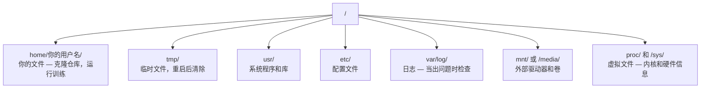

# Linux 用于 AI

> 大多数 AI 运行在 Linux 上。你需要掌握足够的知识，以免寸步难行。

**类型：** 学习
**语言：** --
**前置条件：** 阶段 0，课程 01
**时间：** ~30 分钟

## 学习目标

- 导航 Linux 文件系统并从命令行执行基本的文件操作
- 使用 `chmod` 和 `chown` 管理文件权限以解决"权限被拒绝"错误
- 使用 `apt` 安装系统包并为 AI 工作配置全新的 GPU 机器
- 识别 macOS 与 Linux 的差异——这些差异经常让开发者在远程机器上工作时碰壁

## 问题所在

你在 macOS 或 Windows 上进行开发。但当你 SSH 进入云 GPU 机器、租用 Lambda 实例或启动 EC2 实例时，你面对的是 Ubuntu。终端是你唯一的界面。没有 Finder，没有 Explorer，没有 GUI。如果你无法从命令行导航文件系统、安装包和管理进程，你只能一边为闲置的 GPU 时间付费，一边谷歌搜索"如何在 Linux 中解压文件"。

这是一本生存指南。它正好涵盖了你在远程 Linux 机器上进行 AI 工作所需的一切。不多不少。

## 文件系统布局

Linux 将所有内容组织在单个根目录 `/` 下。没有 `C:\` 或 `/Volumes`。你实际会接触到的目录：



你的主目录是 `~` 或 `/home/你的用户名`。你几乎所有的工作都在这里完成。

## 基本命令

以下 15 个命令覆盖了你在远程 GPU 机器上 95% 的操作。

### 导航

```bash
pwd                         # 我在哪里？
ls                          # 这里有什么？
ls -la                      # 这里有什么，包括隐藏文件和详细信息？
cd /路径/到/目录             # 前往那里
cd ~                        # 回家
cd ..                       # 上一级
```

### 文件和目录

```bash
mkdir 我的项目              # 创建一个目录
mkdir -p a/b/c              # 一次性创建嵌套目录

cp 文件.txt 备份.txt        # 复制文件
cp -r src/ src-备份/        # 复制目录（递归）

mv 旧.txt 新.txt            # 重命名文件
mv 文件.txt /tmp/           # 移动文件

rm 文件.txt                 # 删除文件（没有回收站，直接消失）
rm -rf 我的目录/             # 删除目录及其所有内容
```

`rm -rf` 是永久性的。没有撤销操作。在按回车之前仔细检查路径。

### 读取文件

```bash
cat 文件.txt                # 打印整个文件
head -20 文件.txt           # 前 20 行
tail -20 文件.txt           # 最后 20 行
tail -f 日志.txt            # 实时跟踪日志文件（按 Ctrl+C 停止）
less 文件.txt               # 滚动浏览文件（按 q 退出）
```

### 搜索

```bash
grep "error" 训练日志.log           # 查找包含"error"的行
grep -r "learning_rate" .           # 搜索当前目录下的所有文件
grep -i "cuda" 配置文件.yaml        # 忽略大小写搜索

find . -name "*.py"                 # 查找当前目录下所有 Python 文件
find . -name "*.ckpt" -size +1G     # 查找大于 1GB 的检查点文件
```

## 权限

Linux 中的每个文件都有所有者和权限位。当脚本无法执行或你无法写入目录时，你就会遇到这个问题。

```bash
ls -l train.py
# -rwxr-xr-- 1 user group 2048 Mar 19 10:00 train.py
#  ^^^             所有者权限：读，写，执行
#     ^^^          组权限：读，执行
#        ^^        其他人：只读
```

常见修复方法：

```bash
chmod +x train.sh           # 使脚本可执行
chmod 755 deploy.sh         # 所有者：全部权限，其他人：读+执行
chmod 644 配置文件.yaml      # 所有者：读+写，其他人：只读

chown user:group 文件.txt   # 更改文件所有者（需要 sudo）
```

当系统提示"权限被拒绝"时，几乎总是权限问题。`chmod +x` 或 `sudo` 能解决大多数情况。

## 包管理（apt）

Ubuntu 使用 `apt`。这是你安装系统级软件的方式。

```bash
sudo apt update             # 刷新包列表（始终先执行此操作）
sudo apt install -y htop    # 安装包（-y 跳过确认）
sudo apt install -y build-essential  # C 编译器、make 等。许多 Python 包需要这些
sudo apt install -y tmux    # 终端复用器（断开连接后保持会话存活）

apt list --installed        # 已安装了哪些包？
sudo apt remove htop        # 卸载
```

在一台全新的 GPU 机器上常见的安装包：

```bash
sudo apt update && sudo apt install -y \
    build-essential \
    git \
    curl \
    wget \
    tmux \
    htop \
    unzip \
    python3-venv
```

## 用户和 sudo

你通常以普通用户身份登录。某些操作需要 root（管理员）权限。

```bash
whoami                      # 我是什么用户？
sudo 命令                   # 以 root 身份运行单个命令
sudo su                     # 成为 root（输入 exit 返回，谨慎使用）
```

在云 GPU 实例上，你通常是唯一的用户并且已经拥有 sudo 权限。不要将所有命令都以 root 身份运行。仅在需要时使用 sudo。

## 进程和 systemd

当你的训练卡住，或者你需要检查正在运行的内容时：

```bash
htop                        # 交互式进程查看器（按 q 退出）
ps aux | grep python        # 查找正在运行的 Python 进程
kill 12345                  # 优雅地停止 PID 为 12345 的进程
kill -9 12345               # 强制终止（当优雅停止不起作用时使用）
nvidia-smi                  # GPU 进程和内存使用情况
```

systemd 管理系统服务（后台守护进程）。你在运行推理服务器时会用到它：

```bash
sudo systemctl start nginx          # 启动服务
sudo systemctl stop nginx           # 停止服务
sudo systemctl restart nginx        # 重启服务
sudo systemctl status nginx         # 检查服务是否在运行
sudo systemctl enable nginx         # 设置开机自启
```

## 磁盘空间

GPU 机器通常磁盘空间有限。模型和数据集很快会将其填满。

```bash
df -h                       # 所有挂载驱动器的磁盘使用情况
df -h /home                 # 特定 /home 的磁盘使用情况

du -sh *                    # 当前目录下每个项目的大小
du -sh ~/.cache             # 缓存大小（pip、huggingface 模型存放在此）
du -sh /data/checkpoints/   # 查看检查点文件有多大

# 查找最大的空间占用者
du -h --max-depth=1 / 2>/dev/null | sort -hr | head -20
```

常见的节省空间的方法：

```bash
# 清除 pip 缓存
pip cache purge

# 清除 apt 缓存
sudo apt clean

# 删除不需要的旧检查点
rm -rf checkpoints/epoch_01/ checkpoints/epoch_02/
```

## 网络

你需要从命令行下载模型、传输文件和访问 API。

```bash
# 下载文件
wget https://example.com/model.bin                   # 下载文件
curl -O https://example.com/data.tar.gz              # 用 curl 做同样的事
curl -s https://api.example.com/health | python3 -m json.tool  # 访问 API，美化打印 JSON

# 在机器之间传输文件
scp model.bin user@远程:/data/                       # 将文件复制到远程机器
scp user@远程:/data/results.csv .                    # 从远程机器复制文件到本地
scp -r user@远程:/data/checkpoints/ ./本地目录/       # 复制目录

# 同步目录（用于大文件传输比 scp 更快，失败后可续传）
rsync -avz --progress ./data/ user@远程:/data/
rsync -avz --progress user@远程:/results/ ./results/
```

对于大文件，优先使用 `rsync` 而非 `scp`。它只传输变化的字节，并且能处理中断的连接。

## tmux：保持会话存活

当你 SSH 进入远程机器后合上笔记本电脑，你的训练就会中断。tmux 可以防止这种情况。

```bash
tmux new -s 训练            # 启动一个名为"训练"的新会话
# ... 开始训练，然后：
# Ctrl+B，然后 D            # 分离（训练继续运行）

tmux ls                     # 列出会话
tmux attach -t 训练          # 重新连接到会话

# 在 tmux 内部：
# Ctrl+B，然后 %            # 垂直分割窗格
# Ctrl+B，然后 "            # 水平分割窗格
# Ctrl+B，然后方向键        # 在窗格之间切换
```

始终在 tmux 内运行长时间的训练任务。始终如此。

## 面向 Windows 用户的 WSL2

如果你在 Windows 上，WSL2 为你提供了一个真正的 Linux 环境，无需双系统启动。

```bash
# 在 PowerShell（管理员模式）中
wsl --install -d Ubuntu-24.04

# 重启后，从开始菜单打开 Ubuntu
sudo apt update && sudo apt upgrade -y
```

WSL2 运行一个真正的 Linux 内核。本课中的所有内容都可以在其中运行。你的 Windows 文件在 WSL2 内部位于 `/mnt/c/Users/你的用户名/` 路径下。

GPU 直通功能需要在 Windows 端安装 NVIDIA 驱动程序。安装 Windows 版 NVIDIA 驱动程序（而非 Linux 版），CUDA 就可以在 WSL2 内部使用。

## 易错点：从 macOS 到 Linux

如果你从 macOS 转过来，以下事项会让你措手不及：

| macOS | Linux | 说明 |
|-------|-------|------|
| `brew install` | `sudo apt install` | 包名有时不同。`brew install htop` 与 `sudo apt install htop` 效果相同，但 `brew install readline` 与 `sudo apt install libreadline-dev` 则不同。 |
| `open 文件.txt` | `xdg-open 文件.txt` | 但你在远程机器上没有 GUI。使用 `cat` 或 `less`。 |
| `pbcopy` / `pbpaste` | 不可用 | 通过 SSH 无法使用剪贴板管道。 |
| `~/.zshrc` | `~/.bashrc` | macOS 默认使用 zsh。大多数 Linux 服务器使用 bash。 |
| `/opt/homebrew/` | `/usr/bin/`、`/usr/local/bin/` | 二进制文件位于不同的位置。 |
| `sed -i '' 's/a/b/' 文件` | `sed -i 's/a/b/' 文件` | macOS 的 sed 需要在 `-i` 后加空字符串。Linux 则不需要。 |
| 不区分大小写的文件系统 | 区分大小写的文件系统 | 在 Linux 上，`Model.py` 和 `model.py` 是两个不同的文件。 |
| 换行符 `\n` | 换行符 `\n` | 相同。但 Windows 使用 `\r\n`，这会导致 bash 脚本出错。运行 `dos2unix` 修复。 |

## 快速参考卡

```
导航：          pwd, ls, cd, find
文件：          cp, mv, rm, mkdir, cat, head, tail, less
搜索：          grep, find
权限：          chmod, chown, sudo
包管理：        apt update, apt install
进程：          htop, ps, kill, nvidia-smi
服务：          systemctl start/stop/restart/status
磁盘：          df -h, du -sh
网络：          curl, wget, scp, rsync
会话：          tmux new/attach/detach
```

## 练习

1. SSH 进入任意一台 Linux 机器（或打开 WSL2），导航到你的主目录。创建一个项目文件夹，使用 `touch` 在其中创建三个空文件，然后用 `ls -la` 列出它们。
2. 使用 apt 安装 `htop`，运行它，并找出哪个进程使用的内存最多。
3. 启动一个 tmux 会话，在其中运行 `sleep 300`，分离，列出会话，然后重新连接。
4. 使用 `df -h` 检查可用磁盘空间，然后使用 `du -sh ~/.cache/*` 找出缓存中占用空间的内容。
5. 使用 `scp` 将一个文件从本地机器传输到远程机器，然后使用 `rsync` 进行同样的传输，比较两者的体验。
