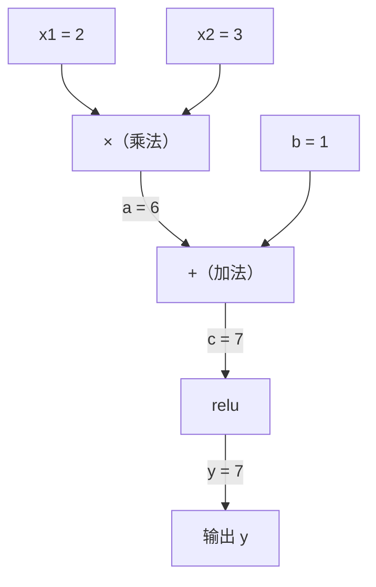
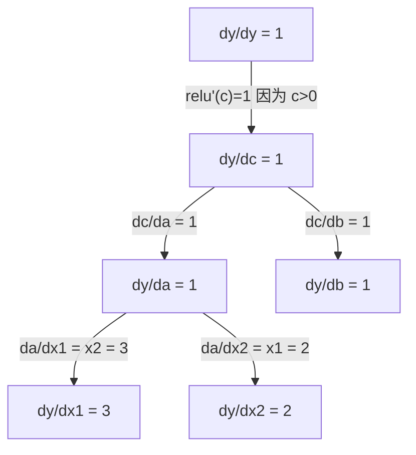

# 链式法则与自动微分

> 链式法则是每个学习型神经网络背后的引擎。

**类型：** 构建
**语言：** Python
**前置要求：** Phase 1, Lesson 04（导数与梯度）
**时间：** ~90 分钟

## 学习目标

- 构建一个极简的 autograd 引擎（Value 类），记录运算并通过反向模式自动微分计算梯度
- 使用拓扑排序实现计算图上的前向和反向传播
- 仅用手写 autograd 引擎构建并训练一个多层感知机解决 XOR 问题
- 使用梯度检查（数值有限差分）验证自动微分的正确性

## 问题

你可以计算简单函数的导数。但神经网络不是简单函数。它是成百上千个函数复合而成：矩阵乘法、加偏置、应用激活函数、再次矩阵乘法、softmax、交叉熵损失。输出是函数的函数的函数……。

要训练网络，你需要损失相对于每个权重的梯度。对数百万个参数手动完成是不可能的。用数值法（有限差分）又太慢。

链式法则给你数学工具。自动微分给你算法。它们一起让你能够通过任意函数复合计算精确梯度，时间与一次前向传播成比例。

这就是 PyTorch、TensorFlow 和 JAX 的工作原理。你将从头构建一个微型版本。

## 概念

### 链式法则

如果 `y = f(g(x))`，那么 `y` 关于 `x` 的导数是：

```
dy/dx = dy/dg × dg/dx = f'(g(x)) × g'(x)
```

沿着链相乘导数。每个链接贡献其局部导数。

示例：`y = sin(x²)`

```
g(x) = x²       g'(x) = 2x
f(g) = sin(g)   f'(g) = cos(g)

dy/dx = cos(x²) × 2x
```

对于更深的复合，链延伸：

```
y = f(g(h(x)))

dy/dx = f'(g(h(x))) × g'(h(x)) × h'(x)
```

神经网络中的每一层都是这条链中的一个链接。

### 计算图

计算图使链式法则可视化。每个操作成为一个节点。数据沿图向前流动。梯度沿图向后流动。

**前向传播（计算值）：**



**反向传播（计算梯度）：**



反向传播在每个节点应用链式法则，将梯度从输出传播到输入。

### 前向模式 vs 反向模式

通过图应用链式法则有两种方式。

**前向模式**从输入开始向前推进导数。它计算 `dx/dx = 1` 并通过每个操作传播。适用于输入少、输出多的情况。

```
前向模式：初始化 dx/dx = 1，向前传播

  x = 2       (dx/dx = 1)
  a = x²      (da/dx = 2x = 4)
  y = sin(a)  (dy/dx = cos(a) × da/dx = cos(4) × 4 = -2.615)
```

**反向模式**从输出开始向后拉取梯度。它计算 `dy/dy = 1` 并以相反顺序通过每个操作传播。适用于输入多、输出少的情况。

```
反向模式：初始化 dy/dy = 1，向后传播

  y = sin(a)  (dy/dy = 1)
  a = x²      (dy/da = cos(a) = cos(4) = -0.654)
  x = 2       (dy/dx = dy/da × da/dx = -0.654 × 4 = -2.615)
```

神经网络有数百万个输入（权重）和一个输出（损失）。反向模式一次反向传播就计算所有梯度。这就是为什么反向传播使用反向模式。

| 模式 | 初始化 | 方向 | 最适合 |
|------|--------|-----------|-----------|
| 前向 | `dx_i/dx_i = 1` | 输入到输出 | 输入少、输出多 |
| 反向 | `dy/dy = 1` | 输出到输入 | 输入多、输出少（神经网络） |

### 前向模式的对偶数

前向模式可以用对偶数优雅地实现。对偶数的形式为 `a + b×ε`，其中 `ε² = 0`。

```
对偶数：(value, derivative)

(2, 1) 意思是：值为 2，关于 x 的导数为 1

算术规则：
  (a, a') + (b, b') = (a+b, a'+b')
  (a, a') × (b, b') = (a×b, a'×b + a×b')
  sin(a, a')         = (sin(a), cos(a)×a')
```

将输入变量初始化为导数 1。导数通过每个操作自动传播。

### 构建 Autograd 引擎

一个 autograd 引擎需要三样东西：

1. **值包装。** 将每个数字包装在一个存储其值和梯度的对象中。
2. **图记录。** 每个操作记录其输入和局部梯度函数。
3. **反向传播。** 对图进行拓扑排序，然后反向遍历，在每个节点应用链式法则。

这正是 PyTorch 的 `autograd` 所做的。`torch.Tensor` 类包装值，在 `requires_grad=True` 时记录操作，并在你调用 `.backward()` 时计算梯度。

### PyTorch Autograd 内部工作原理

当你编写 PyTorch 代码时：

```python
x = torch.tensor(2.0, requires_grad=True)
y = x ** 2 + 3 * x + 1
y.backward()
print(x.grad)  # 7.0 = 2×x + 3 = 2×2 + 3
```

PyTorch 内部：

1. 为 `x` 创建一个 `requires_grad=True` 的 `Tensor` 节点
2. 每个操作（`**`、`*`、`+`）创建一个新节点并记录反向函数
3. `y.backward()` 通过记录图触发反向模式自动微分
4. 每个节点的 `grad_fn` 计算局部梯度并传递给父节点
5. 梯度通过加法（而非替换）累加到 `.grad` 属性中

图是动态的（define-by-run）。每次前向传播构建一个新图。这就是为什么 PyTorch 支持模型内的控制流（if/else、循环）。

```figure
chain-rule
```

## 动手实现

### 步骤 1：Value 类

```python
class Value:
    def __init__(self, data, children=(), op=''):
        self.data = data
        self.grad = 0.0
        self._backward = lambda: None
        self._prev = set(children)
        self._op = op

    def __repr__(self):
        return f"Value(data={self.data:.4f}, grad={self.grad:.4f})"
```

每个 `Value` 存储其数值数据、梯度（初始为零）、一个反向函数和指向产生它的子节点的指针。

### 步骤 2：带梯度跟踪的算术运算

```python
    def __add__(self, other):
        other = other if isinstance(other, Value) else Value(other)
        out = Value(self.data + other.data, (self, other), '+')
        def _backward():
            self.grad += out.grad
            other.grad += out.grad
        out._backward = _backward
        return out

    def __mul__(self, other):
        other = other if isinstance(other, Value) else Value(other)
        out = Value(self.data * other.data, (self, other), '*')
        def _backward():
            self.grad += other.data * out.grad
            other.grad += self.data * out.grad
        out._backward = _backward
        return out

    def relu(self):
        out = Value(max(0, self.data), (self,), 'relu')
        def _backward():
            self.grad += (1.0 if out.data > 0 else 0.0) * out.grad
        out._backward = _backward
        return out
```

每个操作创建一个闭包，知道如何计算局部导数并乘以上游梯度（`out.grad`）。`+=` 处理一个值在多个操作中使用的情况。

### 步骤 3：反向传播

```python
    def backward(self):
        topo = []
        visited = set()
        def build_topo(v):
            if v not in visited:
                visited.add(v)
                for child in v._prev:
                    build_topo(child)
                topo.append(v)
        build_topo(self)

        self.grad = 1.0
        for v in reversed(topo):
            v._backward()
```

拓扑排序确保每个节点的梯度在其传播到子节点之前已完全计算。初始梯度为 1.0（dy/dy = 1）。

### 步骤 4：完整引擎的更多运算

基本的 Value 类处理加法、乘法和 relu。真正的 autograd 引擎需要更多。以下是构建神经网络所需的运算：

```python
    def __neg__(self):
        return self * -1

    def __sub__(self, other):
        return self + (-other)

    def __radd__(self, other):
        return self + other

    def __rmul__(self, other):
        return self * other

    def __rsub__(self, other):
        return other + (-self)

    def __pow__(self, n):
        out = Value(self.data ** n, (self,), f'**{n}')
        def _backward():
            self.grad += n * (self.data ** (n - 1)) * out.grad
        out._backward = _backward
        return out

    def __truediv__(self, other):
        return self * (other ** -1) if isinstance(other, Value) else self * (Value(other) ** -1)

    def exp(self):
        import math
        e = math.exp(self.data)
        out = Value(e, (self,), 'exp')
        def _backward():
            self.grad += e * out.grad
        out._backward = _backward
        return out

    def log(self):
        import math
        out = Value(math.log(self.data), (self,), 'log')
        def _backward():
            self.grad += (1.0 / self.data) * out.grad
        out._backward = _backward
        return out

    def tanh(self):
        import math
        t = math.tanh(self.data)
        out = Value(t, (self,), 'tanh')
        def _backward():
            self.grad += (1 - t ** 2) * out.grad
        out._backward = _backward
        return out
```

**每个运算为什么重要：**

| 运算 | 反向规则 | 用在 |
|-----------|--------------|---------|
| `__sub__` | 复用 add + neg | 损失计算（pred - target） |
| `__pow__` | n × x^(n-1) | 多项式激活、MSE（error²） |
| `__truediv__` | 复用 mul + pow(-1) | 归一化、学习率缩放 |
| `exp` | exp(x) × upstream | Softmax、对数似然 |
| `log` | (1/x) × upstream | 交叉熵损失、对数概率 |
| `tanh` | (1 - tanh²) × upstream | 经典激活函数 |

巧妙之处：`__sub__` 和 `__truediv__` 是基于现有运算定义的。它们自动获得正确的梯度，因为链式法则通过底层的 add/mul/pow 运算复合。

### 步骤 5：从头实现微型 MLP

有了完整的 Value 类，你可以构建一个神经网络。不需要 PyTorch。不需要 NumPy。只有 Values 和链式法则。

```python
import random

class Neuron:
    def __init__(self, n_inputs):
        self.w = [Value(random.uniform(-1, 1)) for _ in range(n_inputs)]
        self.b = Value(0.0)

    def __call__(self, x):
        act = sum((wi * xi for wi, xi in zip(self.w, x)), self.b)
        return act.tanh()

    def parameters(self):
        return self.w + [self.b]

class Layer:
    def __init__(self, n_inputs, n_outputs):
        self.neurons = [Neuron(n_inputs) for _ in range(n_outputs)]

    def __call__(self, x):
        return [n(x) for n in self.neurons]

    def parameters(self):
        return [p for n in self.neurons for p in n.parameters()]

class MLP:
    def __init__(self, sizes):
        self.layers = [Layer(sizes[i], sizes[i+1]) for i in range(len(sizes)-1)]

    def __call__(self, x):
        for layer in self.layers:
            x = layer(x)
        return x[0] if len(x) == 1 else x

    def parameters(self):
        return [p for layer in self.layers for p in layer.parameters()]
```

一个 `Neuron` 计算 `tanh(w₁×x₁ + w₂×x₂ + ... + b)`。一个 `Layer` 是一组神经元。一个 `MLP` 堆叠层。每个权重都是一个 `Value`，所以调用 `loss.backward()` 会将梯度传播到每个参数。

**在 XOR 上训练：**

```python
random.seed(42)
model = MLP([2, 4, 1])  # 2 个输入，4 个隐藏神经元，1 个输出

xs = [[0, 0], [0, 1], [1, 0], [1, 1]]
ys = [-1, 1, 1, -1]  # XOR 模式（为 tanh 使用 -1/1）

for step in range(100):
    preds = [model(x) for x in xs]
    loss = sum((p - y) ** 2 for p, y in zip(preds, ys))

    for p in model.parameters():
        p.grad = 0.0
    loss.backward()

    lr = 0.05
    for p in model.parameters():
        p.data -= lr * p.grad

    if step % 20 == 0:
        print(f"step {step:3d}  loss = {loss.data:.4f}")

print("\nPredictions after training:")
for x, y in zip(xs, ys):
    print(f"  input={x}  target={y:2d}  pred={model(x).data:6.3f}")
```

这就是 micrograd。一个完整的、使用纯 Python 和自动微分的神经网络训练循环。每个商业深度学习框架都做同样的事情，只是规模更大。

### 步骤 6：梯度检查

你怎么知道你的 autodiff 是正确的？将其与数值导数比较。这就是梯度检查。

```python
def gradient_check(build_expr, x_val, h=1e-7):
    x = Value(x_val)
    y = build_expr(x)
    y.backward()
    autodiff_grad = x.grad

    y_plus = build_expr(Value(x_val + h)).data
    y_minus = build_expr(Value(x_val - h)).data
    numerical_grad = (y_plus - y_minus) / (2 * h)

    diff = abs(autodiff_grad - numerical_grad)
    return autodiff_grad, numerical_grad, diff
```

在复杂表达式上测试：

```python
def expr(x):
    return (x ** 3 + x * 2 + 1).tanh()

ad, num, diff = gradient_check(expr, 0.5)
print(f"Autodiff:  {ad:.8f}")
print(f"Numerical: {num:.8f}")
print(f"Difference: {diff:.2e}")
# 差值应 < 1e-5
```

在实现新运算时，梯度检查是必不可少的。如果你的反向传播有 bug，数值检查会发现它。每个严肃的深度学习实现都在开发过程中运行梯度检查。

**何时使用梯度检查：**

| 情况 | 做梯度检查？ |
|-----------|-------------------|
| 向 autograd 添加新运算 | 是，总是 |
| 调试不收敛的训练循环 | 是，先检查梯度 |
| 生产训练 | 否，太慢（每个参数需要 2 次前向传播） |
| autograd 代码的单元测试 | 是，自动化它 |

### 步骤 7：对照手动计算验证

```python
x1 = Value(2.0)
x2 = Value(3.0)
a = x1 * x2          # a = 6.0
b = a + Value(1.0)    # b = 7.0
y = b.relu()          # y = 7.0

y.backward()

print(f"y = {y.data}")          # 7.0
print(f"dy/dx1 = {x1.grad}")   # 3.0 (= x2)
print(f"dy/dx2 = {x2.grad}")   # 2.0 (= x1)
```

手动检查：`y = relu(x1×x2 + 1)`。由于 `x1×x2 + 1 = 7 > 0`，relu 是恒等映射。
`dy/dx1 = x2 = 3`。`dy/dx2 = x1 = 2`。引擎匹配。

## 使用现成库

### 对照 PyTorch 验证

```python
import torch

x1 = torch.tensor(2.0, requires_grad=True)
x2 = torch.tensor(3.0, requires_grad=True)
a = x1 * x2
b = a + 1.0
y = torch.relu(b)
y.backward()

print(f"PyTorch dy/dx1 = {x1.grad.item()}")  # 3.0
print(f"PyTorch dy/dx2 = {x2.grad.item()}")  # 2.0
```

相同的梯度。你的引擎计算出与 PyTorch 相同的结果，因为数学是一样的：通过链式法则的反向模式自动微分。

### 更复杂的表达式

```python
a = Value(2.0)
b = Value(-3.0)
c = Value(10.0)
f = (a * b + c).relu()  # relu(2×(-3) + 10) = relu(4) = 4

f.backward()
print(f"df/da = {a.grad}")  # -3.0 (= b)
print(f"df/db = {b.grad}")  #  2.0 (= a)
print(f"df/dc = {c.grad}")  #  1.0
```

## 产出

本课程产出：
- `outputs/skill-autodiff.md` —— 用于构建和调试 autograd 系统的技能
- `code/autodiff.py` —— 一个可以扩展的极简 autograd 引擎

这里构建的 Value 类是 Phase 3 神经网络训练循环的基础。

## 练习

1. 向 Value 类添加 `__pow__` 以便计算 `x ** n`。验证 `d/dx(x³)` 在 `x=2` 处等于 `12.0`。

2. 添加 `tanh` 作为激活函数。验证 `tanh'(0) = 1` 和 `tanh'(2) ≈ 0.0707`。

3. 构建一个单个神经元的计算图：`y = relu(w₁×x₁ + w₂×x₂ + b)`。计算所有五个梯度并对照 PyTorch 验证。

4. 使用对偶数实现前向模式自动微分。创建一个 `Dual` 类并验证它给出与反向模式引擎相同的导数。

## 关键术语

| 术语 | 人们说的 | 实际含义 |
|------|----------------|----------------------|
| 链式法则 | "乘导数" | 复合函数的导数等于每个函数在正确点处求值的局部导数的乘积 |
| 计算图 | "网络图" | 一个节点为操作、边传递值（前向）或梯度（反向）的有向无环图 |
| 前向模式 | "向前传播导数" | 从输入到输出传播导数的自动微分。每个输入变量一次传播。 |
| 反向模式 | "反向传播" | 从输出到输入传播梯度的自动微分。每个输出变量一次传播。 |
| Autograd | "自动梯度" | 记录值上的操作、构建图并通过链式法则计算精确梯度的系统 |
| 对偶数 | "值加导数" | 形式为 a + b×ε（ε² = 0）的数，通过算术运算携带导数信息 |
| 拓扑排序 | "依赖顺序" | 对图节点排序，使每个节点出现在其所有依赖之后。正确梯度传播所必需。 |
| 梯度累积 | "相加，不替换" | 当一个值馈入多个操作时，其梯度是所有传入梯度贡献的总和 |
| 动态图 | "define-by-run" | 每次前向传播重建的计算图，允许模型内使用 Python 控制流（PyTorch 风格） |
| 梯度检查 | "数值验证" | 将自动微分梯度与数值有限差分梯度进行比较以验证正确性。调试时必不可少。 |
| MLP | "多层感知机" | 具有一个或多个隐藏层神经元的神经网络。每个神经元计算加权和加偏置，然后应用激活函数。 |
| 神经元 | "加权和 + 激活" | 基本单元：output = activation(w₁×x₁ + w₂×x₂ + ... + b)。权重和偏置是可学习参数。 |

## 延伸阅读

- [3Blue1Brown: 反向传播微积分](https://www.youtube.com/watch?v=tIeHLnjs5U8) —— 神经网络中链式法则的可视化解释
- [PyTorch Autograd 机制](https://pytorch.org/docs/stable/notes/autograd.html) —— 真实系统的工作原理
- [Baydin et al., Automatic Differentiation in Machine Learning: a Survey](https://arxiv.org/abs/1502.05767) —— 全面参考
