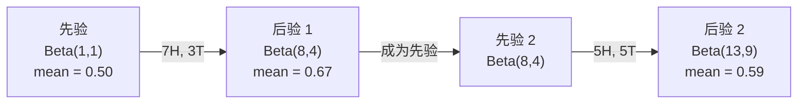

# 贝叶斯定理

> 概率描述你预期什么。贝叶斯定理描述你学到了什么。

**类型：** 构建
**语言：** Python
**前置要求：** Phase 1, Lesson 06（概率基础）
**时间：** ~75 分钟

## 学习目标

- 应用贝叶斯定理，根据先验、似然和证据计算后验概率
- 从头构建一个带有 Laplace 平滑和对数空间计算的朴素贝叶斯文本分类器
- 比较 MLE 和 MAP 估计，并解释 MAP 如何对应 L2 正则化
- 使用 Beta-Binomial 共轭先验实现序列贝叶斯更新，用于 A/B 测试

## 问题

某项医学检查的准确率为 99%。你测试呈阳性。你实际患病的概率是多少？

大多数人会说 99%。真正的答案取决于该疾病的罕见程度。如果一万人中只有一人患病，那么阳性结果只意味着大约 1% 的患病概率。其余 99% 的阳性结果是健康人群的假警报。

这不是陷阱题。这就是贝叶斯定理。每个垃圾邮件过滤器、每个医学诊断、每个量化不确定性的机器学习模型都使用这个推理过程。你从一个信念开始。你看到证据。你更新信念。

如果你在不理解这一点的情况下构建 ML 系统，你会误解模型输出、设置错误的阈值，并发布过度自信的预测。

## 概念

### 从联合概率到贝叶斯

你已经从 Lesson 06 知道条件概率是：

```
P(A|B) = P(A 且 B) / P(B)
```

对称地：

```
P(B|A) = P(A 且 B) / P(A)
```

两个表达式共享同一个分子：P(A 且 B)。将它们设为相等并重新排列：

```
P(A 且 B) = P(A|B) × P(B) = P(B|A) × P(A)

因此：

P(A|B) = P(B|A) × P(A) / P(B)
```

这就是贝叶斯定理。四个量，一个方程。

### 四个组成部分

| 部分 | 名称 | 含义 |
|------|------|---------------|
| P(A|B) | 后验 | 看到证据 B 后你对 A 的更新信念 |
| P(B|A) | 似然 | 如果 A 为真，证据 B 的可能性有多大 |
| P(A) | 先验 | 看到任何证据之前你对 A 的信念 |
| P(B) | 证据 | 在所有可能性下看到 B 的总概率 |

证据项 P(B) 充当归一化因子。你可以使用全概率公式展开它：

```
P(B) = P(B|A) × P(A) + P(B|not A) × P(not A)
```

### 医学检查示例

某种疾病影响一万人中的一人。检查准确率为 99%（能查出 99% 的病人，假阳性率为 1%）。

```
P(sick)          = 0.0001     （先验：疾病罕见）
P(positive|sick) = 0.99       （似然：检查能查出）
P(positive|healthy) = 0.01    （假阳性率）

P(positive) = P(positive|sick) × P(sick) + P(positive|healthy) × P(healthy)
            = 0.99 × 0.0001 + 0.01 × 0.9999
            = 0.000099 + 0.009999
            = 0.010098

P(sick|positive) = P(positive|sick) × P(sick) / P(positive)
                 = 0.99 × 0.0001 / 0.010098
                 = 0.0098
                 = 0.98%
```

不到 1%。先验起了主导作用。当一种情况罕见时，即使准确的检查也会产生大部分假阳性。这就是为什么医生会要求进行确认检查。

### 垃圾邮件过滤器示例

你收到一封包含"lottery"一词的邮件。它是垃圾邮件吗？

```
P(spam)                = 0.3      （30% 的邮件是垃圾邮件）
P("lottery"|spam)      = 0.05     （5% 的垃圾邮件包含"lottery"）
P("lottery"|not spam)  = 0.001    （0.1% 的正常邮件包含"lottery"）

P("lottery") = 0.05 × 0.3 + 0.001 × 0.7
             = 0.015 + 0.0007
             = 0.0157

P(spam|"lottery") = 0.05 × 0.3 / 0.0157
                  = 0.955
                  = 95.5%
```

一个词就将概率从 30% 变为 95.5%。真正的垃圾邮件过滤器同时对数百个词应用贝叶斯定理。

### 朴素贝叶斯：独立性假设

朴素贝叶斯通过假设所有特征在给定类别的情况下条件独立，将这一方法扩展到多个特征：

```
P(class | feature_1, feature_2, ..., feature_n)
  = P(class) × P(feature_1|class) × P(feature_2|class) × ... × P(feature_n|class)
    / P(feature_1, feature_2, ..., feature_n)
```

"朴素"之处在于独立性假设。在文本中，词的出现并非独立（"New"和"York"是相关的）。但这个假设在实践中出奇地好用，因为分类器只需要对类别进行排序，而不需要生成校准的概率。

由于所有类别的分母相同，你可以跳过它，只比较分子：

```
score(class) = P(class) × product of P(feature_i | class)
```

选择得分最高的类别。

### 最大似然估计（MLE）

如何从训练数据中得到 P(feature|class)？计数。

```
P("free"|spam) = (包含"free"的垃圾邮件数) / (总垃圾邮件数)
```

这就是 MLE：选择使观测数据最可能的参数值。你在最大化似然函数，对于离散计数，它简化为相对频率。

问题：如果一个词在训练期间的垃圾邮件中从未出现，MLE 会赋予它零概率。一个未见过的词就会杀死整个乘积。用 Laplace 平滑修复：

```
P(word|class) = (count(word, class) + 1) / (total_words_in_class + vocabulary_size)
```

给每个计数加 1 确保没有概率为零。

### 最大后验估计（MAP）

MLE 问：什么参数能最大化 P(data|parameters)？

MAP 问：什么参数能最大化 P(parameters|data)？

根据贝叶斯定理：

```
P(parameters|data) 正比于 P(data|parameters) × P(parameters)
```

MAP 在参数本身之上添加了一个先验。如果你认为参数应该很小，你将其编码为一个惩罚大数值的先验。这与 ML 中的 L2 正则化完全相同。岭回归中的"岭"惩罚实质上就是权重的 Gaussian 先验。

| 估计方式 | 优化目标 | ML 等价 |
|------------|-----------|---------------|
| MLE | P(data|params) | 无正则化训练 |
| MAP | P(data|params) × P(params) | L2 / L1 正则化 |

### 贝叶斯 vs 频率派：实际区别

频率派将参数视为固定的未知数。他们问："如果我重复这个实验很多次，会发生什么？"

贝叶斯派将参数视为分布。他们问："根据我所观察到的，我对参数有什么信念？"

对于构建 ML 系统，实际区别：

| 方面 | 频率派 | 贝叶斯派 |
|--------|-------------|----------|
| 输出 | 点估计 | 值的分布 |
| 不确定性 | 置信区间（关于过程） | 可信区间（关于参数） |
| 小数据 | 可能过拟合 | 先验起到正则化作用 |
| 计算 | 通常更快 | 通常需要采样（MCMC） |

大多数生产 ML 是频率派的（SGD、点估计）。贝叶斯方法在需要校准的不确定性（医疗决策、安全关键系统）或数据稀缺时（少样本学习、冷启动）表现出色。

### 贝叶斯思维为何对 ML 重要

联系比类比更深刻：

**先验就是正则化。** 权重上的 Gaussian 先验就是 L2 正则化。Laplace 先验就是 L1。每当你添加一个正则化项，你就在做一个关于参数值期望的贝叶斯陈述。

**后验就是不确定性。** 单个预测概率不会告诉你模型对该估计有多自信。贝叶斯方法给你一个分布："我认为 P(spam) 在 0.8 到 0.95 之间。"

**贝叶斯更新就是在线学习。** 今天的后验成为明天的先验。当模型看到新数据时，它增量地更新其信念，而不是从头重新训练。

**模型比较是贝叶斯式的。** 贝叶斯信息准则（BIC）、边际似然和贝叶斯因子都使用贝叶斯推理在不发生过拟合的情况下选择模型。

```figure
bayes-update
```

## 动手实现

### 步骤 1：贝叶斯定理函数

```python
def bayes(prior, likelihood, false_positive_rate):
    evidence = likelihood * prior + false_positive_rate * (1 - prior)
    posterior = likelihood * prior / evidence
    return posterior

result = bayes(prior=0.0001, likelihood=0.99, false_positive_rate=0.01)
print(f"P(sick|positive) = {result:.4f}")
```

### 步骤 2：朴素贝叶斯分类器

```python
import math
from collections import defaultdict

class NaiveBayes:
    def __init__(self, smoothing=1.0):
        self.smoothing = smoothing
        self.class_counts = defaultdict(int)
        self.word_counts = defaultdict(lambda: defaultdict(int))
        self.class_word_totals = defaultdict(int)
        self.vocab = set()

    def train(self, documents, labels):
        for doc, label in zip(documents, labels):
            self.class_counts[label] += 1
            words = doc.lower().split()
            for word in words:
                self.word_counts[label][word] += 1
                self.class_word_totals[label] += 1
                self.vocab.add(word)

    def predict(self, document):
        words = document.lower().split()
        total_docs = sum(self.class_counts.values())
        vocab_size = len(self.vocab)
        best_class = None
        best_score = float("-inf")
        for cls in self.class_counts:
            score = math.log(self.class_counts[cls] / total_docs)
            for word in words:
                count = self.word_counts[cls].get(word, 0)
                total = self.class_word_totals[cls]
                score += math.log((count + self.smoothing) / (total + self.smoothing * vocab_size))
            if score > best_score:
                best_score = score
                best_class = cls
        return best_class
```

对数概率可以防止下溢。将许多小概率相乘会产生浮点数无法表示的值。求和对数概率在数值上稳定且数学上等价。

### 步骤 3：在垃圾邮件数据上训练

```python
train_docs = [
    "win free money now",
    "free lottery ticket winner",
    "claim your prize today free",
    "urgent offer free cash",
    "congratulations you won free",
    "meeting tomorrow at noon",
    "project update attached",
    "can we schedule a call",
    "quarterly report review",
    "lunch on thursday sounds good",
    "team standup notes attached",
    "please review the pull request",
]

train_labels = [
    "spam", "spam", "spam", "spam", "spam",
    "ham", "ham", "ham", "ham", "ham", "ham", "ham",
]

classifier = NaiveBayes()
classifier.train(train_docs, train_labels)

test_messages = [
    "free money waiting for you",
    "meeting rescheduled to friday",
    "you won a free prize",
    "please review the attached report",
]

for msg in test_messages:
    print(f"  '{msg}' -> {classifier.predict(msg)}")
```

### 步骤 4：查看学习到的概率

```python
def show_top_words(classifier, cls, n=5):
    vocab_size = len(classifier.vocab)
    total = classifier.class_word_totals[cls]
    probs = {}
    for word in classifier.vocab:
        count = classifier.word_counts[cls].get(word, 0)
        probs[word] = (count + classifier.smoothing) / (total + classifier.smoothing * vocab_size)
    sorted_words = sorted(probs.items(), key=lambda x: x[1], reverse=True)
    for word, prob in sorted_words[:n]:
        print(f"    {word}: {prob:.4f}")

print("\nTop spam words:")
show_top_words(classifier, "spam")
print("\nTop ham words:")
show_top_words(classifier, "ham")
```

## 使用现成库

Scikit-learn 提供了生产级的朴素贝叶斯实现：

```python
from sklearn.feature_extraction.text import CountVectorizer
from sklearn.naive_bayes import MultinomialNB
from sklearn.metrics import classification_report

vectorizer = CountVectorizer()
X_train = vectorizer.fit_transform(train_docs)
clf = MultinomialNB()
clf.fit(X_train, train_labels)

X_test = vectorizer.transform(test_messages)
predictions = clf.predict(X_test)
for msg, pred in zip(test_messages, predictions):
    print(f"  '{msg}' -> {pred}")
```

同样的算法。CountVectorizer 处理标记化和词汇表构建。MultinomialNB 内部处理平滑和对数概率。你的手写版本用 40 行代码做同样的事。

## 产出

这里构建的 NaiveBayes 类展示了完整流程：标记化、带 Laplace 平滑的概率估计、对数空间预测。`code/bayes.py` 中的代码使用 Python 标准库即可端到端运行，无需任何依赖。

### 共轭先验

当先验和后验属于同一分布族时，该先验称为"共轭"的。这使得贝叶斯更新在代数上非常简洁 —— 无需数值积分即可得到闭式后验分布。

| 似然 | 共轭先验 | 后验 | 示例 |
|-----------|----------------|-----------|---------|
| Bernoulli | Beta(a, b) | Beta(a + 成功数, b + 失败数) | 硬币偏倚估计 |
| 正态（方差已知） | Normal(μ₀, σ₀) | Normal(加权均值, 较小方差) | 传感器校准 |
| Poisson | Gamma(a, b) | Gamma(a + 计数和, b + n) | 到达率建模 |
| 多项分布 | Dirichlet(α) | Dirichlet(α + 计数) | 主题建模、语言模型 |

为什么这很重要：没有共轭先验，你需要蒙特卡洛采样或变分推断来近似后验。有了共轭先验，只需更新两个数字。

Beta 分布是实践中最常见的共轭先验。Beta(a, b) 表示你对一个概率参数的信念。均值为 a/(a+b)。a+b 越大，分布越集中（自信）。

Beta 先验的特殊情况：
- Beta(1, 1) = 均匀分布。你对参数没有意见。
- Beta(10, 10) = 在 0.5 处集中。你强烈认为参数接近 0.5。
- Beta(1, 10) = 偏向 0。你认为参数很小。

更新规则极其简单：

```
先验：     Beta(a, b)
数据：      s 次成功，f 次失败
后验：     Beta(a + s, b + f)
```

没有积分。没有采样。只需要加法。

### 序列贝叶斯更新

贝叶斯推断天然是序列式的。今天的后验成为明天的先验。这就是真实系统增量学习的方式，无需重新处理所有历史数据。

具体示例：估计硬币是否公平。

**第 1 天：还没有数据。**
从 Beta(1, 1) 开始 —— 一个均匀先验。你没有意见。
- 先验均值：0.5
- 先验在 [0, 1] 上是平坦的

**第 2 天：观察到 7 次正面，3 次反面。**
后验 = Beta(1 + 7, 1 + 3) = Beta(8, 4)
- 后验均值：8/12 = 0.667
- 证据表明硬币偏向正面

**第 3 天：又观察到 5 次正面，5 次反面。**
使用昨天的后验作为今天的先验。
后验 = Beta(8 + 5, 4 + 5) = Beta(13, 9)
- 后验均值：13/22 = 0.591
- 平衡的新数据将估计值拉回了 0.5



观测顺序不重要。用所有 12 次正面和 8 次反面一次性更新 Beta(1,1) 会得到 Beta(13, 9) —— 相同的结果。序列更新和批量更新在数学上是等价的。但序列更新让你可以在每一步做出决策，而无需存储原始数据。

这是生产 ML 系统中在线学习的基础。Thompson 采样用于 bandit、增量推荐系统和流式异常检测器都使用此模式。

### 与 A/B 测试的联系

A/B 测试本质上是贝叶斯推断。

设置：你正在测试两个按钮颜色。变体 A（蓝色）和变体 B（绿色）。你想知道哪个获得更多点击。

贝叶斯 A/B 测试：

1. **先验。** 两个变体都从 Beta(1, 1) 开始。没有先验偏好。
2. **数据。** 变体 A：1000 次浏览中 50 次点击。变体 B：1000 次浏览中 65 次点击。
3. **后验。**
   - A：Beta(1 + 50, 1 + 950) = Beta(51, 951)。均值 = 0.051
   - B：Beta(1 + 65, 1 + 935) = Beta(66, 936)。均值 = 0.066
4. **决策。** 计算 P(B > A) —— B 的真实转化率高于 A 的概率。

解析计算 P(B > A) 很困难。但蒙特卡洛使之变得简单：

```
1. 从 Beta(51, 951) 中抽取 100,000 个样本 → samples_A
2. 从 Beta(66, 936) 中抽取 100,000 个样本 → samples_B
3. P(B > A) = B 大于 A 的样本比例
```

如果 P(B > A) > 0.95，你发布变体 B。如果在 0.05 和 0.95 之间，你继续收集数据。如果 P(B > A) < 0.05，你发布变体 A。

相对于频率派 A/B 测试的优势：
- 你会得到一个直接的概率陈述："B 更好的概率是 97%"
- 没有 p 值的混淆。没有"无法拒绝原假设"的含糊其辞。
- 你可以随时检查结果而不会增加假阳性率（没有"偷看问题"）
- 你可以融入先验知识（例如，之前的测试表明转化率通常在 3-8%）

| 方面 | 频率派 A/B | 贝叶斯 A/B |
|--------|----------------|--------------|
| 输出 | p 值 | P(B > A) |
| 解释 | "如果 A=B，这数据有多令人惊讶？" | "B 比 A 好的可能性有多大？" |
| 提前停止 | 增加假阳性 | 在任何点都安全（给定良好选择的先验和正确指定的模型） |
| 先验知识 | 不使用 | 编码为 Beta 先验 |
| 决策规则 | p < 0.05 | P(B > A) > 阈值 |

## 练习

1. **多次检查。** 一个病人在两个独立的检查中均呈阳性（均 99% 准确，疾病患病率万分之一）。两次检查后 P(sick) 是多少？将第一次检查的后验作为第二次检查的先验。

2. **平滑的影响。** 使用平滑值 0.01、0.1、1.0 和 10.0 运行垃圾邮件分类器。顶级词的概率如何变化？使用 smoothing=0 且一个仅出现在 ham 中的词时会发生什么？

3. **添加特征。** 扩展 NaiveBayes 类，使其除了词频之外还能使用消息长度（短/长）作为特征。从训练数据中估计 P(short|spam) 和 P(short|ham)，并将其纳入预测分数。

4. **手动 MAP。** 给定观察数据（10 次抛硬币中 7 次正面），使用 Beta(2,2) 先验计算偏倚的 MAP 估计。与 MLE 估计（7/10）比较。

## 关键术语

| 术语 | 人们说的 | 实际含义 |
|------|----------------|----------------------|
| 先验 | "我的初始猜测" | 观察到证据之前的 P(hypothesis)。在 ML 中：正则化项。 |
| 似然 | "数据拟合的程度" | P(evidence|hypothesis)。在特定假设下观测数据的可能性。 |
| 后验 | "我更新后的信念" | P(hypothesis|evidence)。先验乘以似然，然后归一化。 |
| 证据 | "归一化常数" | P(data) across all hypotheses。确保后验之和为 1。 |
| 朴素贝叶斯 | "那个简单的文本分类器" | 假设特征在给定类别时独立。尽管假设不成立但效果很好。 |
| Laplace 平滑 | "加一平滑" | 为每个特征添加小计数以防止未见数据导致零概率。 |
| MLE | "直接用频率" | 选择最大化 P(data|parameters) 的参数。无先验。小数据时会过拟合。 |
| MAP | "带先验的 MLE" | 选择最大化 P(data|parameters) × P(parameters) 的参数。等价于正则化的 MLE。 |
| 对数概率 | "在对数空间工作" | 使用 log(P) 代替 P 以避免乘许多小数字时的浮点下溢。 |
| 假阳性 | "错误警报" | 检查结果为阳性，但真实状态为阴性。导致基准率谬误。 |

## 延伸阅读

- [3Blue1Brown: 贝叶斯定理](https://www.youtube.com/watch?v=HZGCoVF3YvM) —— 用医学检查示例进行可视化解释
- [Stanford CS229: 生成式学习算法](https://cs229.stanford.edu/notes2022fall/cs229-notes2.pdf) —— 朴素贝叶斯及其与判别模型的联系
- [Think Bayes](https://greenteapress.com/wp/think-bayes/) —— 免费书籍，使用 Python 代码的贝叶斯统计
- [scikit-learn Naive Bayes](https://scikit-learn.org/stable/modules/naive_bayes.html) —— 生产级实现及何时使用每个变种
