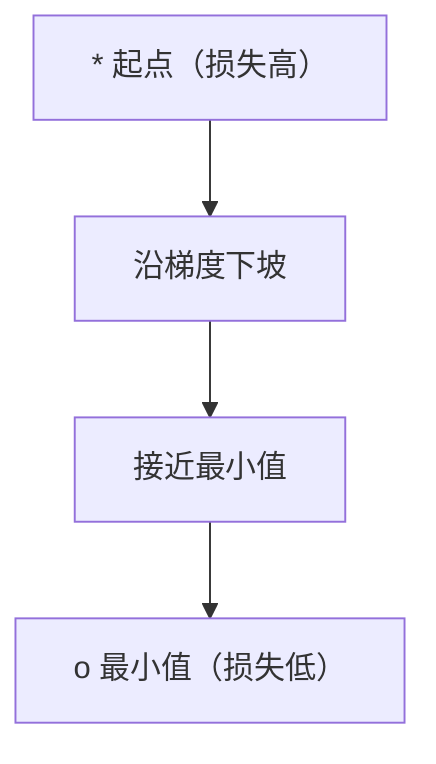
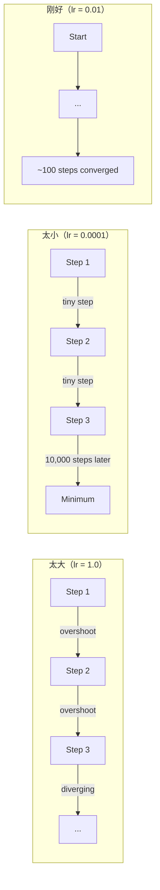
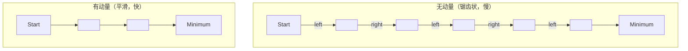
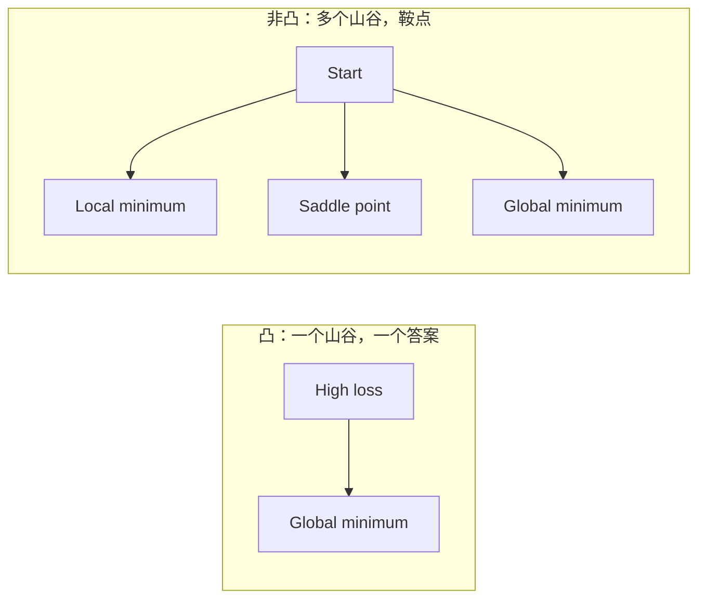
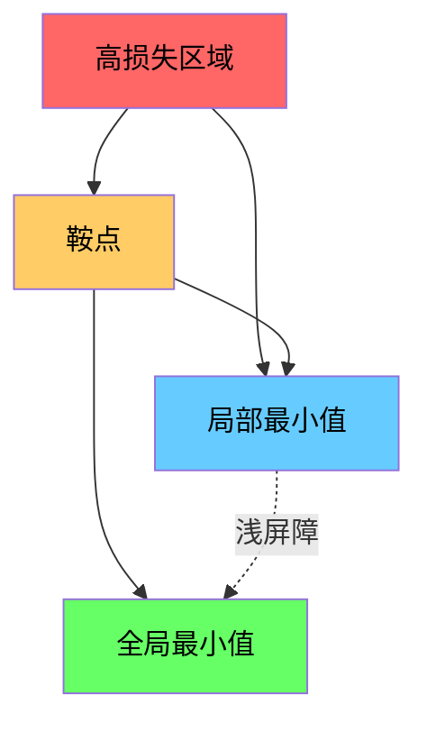

# 优化

> 训练神经网络只不过是在山谷中寻找最低点。

**类型：** 构建
**语言：** Python
**前置要求：** Phase 1, Lessons 04-05（导数、梯度）
**时间：** ~75 分钟

## 学习目标

- 从头实现 vanilla 梯度下降、带动量的 SGD 和 Adam
- 在 Rosenbrock 函数上比较优化器的收敛性，并解释 Adam 为何自适应每个权重的学习率
- 区分凸和非凸损失景观，并解释鞍点在高维中的作用
- 配置学习率调度（阶梯衰减、余弦退火、预热）以保证训练稳定性

## 问题

你有一个损失函数。它告诉你模型有多错。你有梯度。它们告诉你哪个方向会让损失更大。现在你需要一个走下坡的策略。

朴素的方法很简单：向梯度的反方向移动。用某个称为学习率的数缩放步长。重复。这就是梯度下降，它确实有效。但"有效"有前提。学习率太大，你会完全越过山谷，在墙壁之间反弹。太小，你会历经数千次不必要的步长爬向答案。碰到鞍点，即便你没有找到最小值，也会停止移动。

深度学习中的每个优化器都是对同一个问题的回答：如何更快、更可靠地到达谷底？

## 概念

### 优化的含义

优化是找到使函数最小化（或最大化）的输入值。在机器学习中，函数是损失函数。输入是模型的权重。训练就是优化。

```
minimize L(w) 其中：
  L = 损失函数
  w = 模型权重（可能有数百万个参数）
```

### 梯度下降（vanilla）

最简单的优化器。计算损失相对于每个权重的梯度。将每个权重沿其梯度的反方向移动。用学习率缩放步长。

```
w = w - lr × gradient
```

这就是整个算法。一行。



### 学习率：最重要的超参数

学习率控制步长。它决定了关于收敛的一切。



没有公式可以算出正确的学习率。你需要通过实验找到它。常见的起始点：Adam 用 0.001，带动量的 SGD 用 0.01。

### SGD vs 批处理 vs 小批量

Vanilla 梯度下降在整个数据集上计算梯度后才迈出一步。这称为批梯度下降。稳定但慢。

随机梯度下降（SGD）在单个随机样本上计算梯度并立即迈步。噪声大但快。

小批量梯度下降取其中间值。在一个小批（32、64、128、256 个样本）上计算梯度，然后迈步。这是每个人实际使用的方式。

| 变体 | 批大小 | 梯度质量 | 每步速度 | 噪声 |
|---------|-----------|-----------------|---------------|-------|
| 批 GD | 整个数据集 | 精确 | 慢 | 无 |
| SGD | 1 个样本 | 非常嘈杂 | 快 | 高 |
| 小批量 | 32-256 | 良好估计 | 均衡 | 中等 |

SGD 和小批量中的噪声不是 bug。它有助于逃离浅的局部最小值和鞍点。

### 动量：滚下山的球

Vanilla 梯度下降只看当前的梯度。如果梯度呈锯齿状（在狭窄山谷中常见），进展会很慢。动量通过将过去的梯度累积到速度项中来修复这个问题。

```
v = beta × v + gradient
w = w - lr × v
```

类比：一个滚下山的球。它不会在每个凸起处停下再重新开始。它在一致的方向上加速，并抑制振荡。



`beta`（通常为 0.9）控制保留多少历史。beta 越大，动量越大，路径越平滑，但对方向变化的响应越慢。

### Adam：自适应学习率

不同的权重需要不同的学习率。一个很少获得大梯度的权重，在终于获得大梯度时应该迈更大的步。一个持续获得巨大梯度的权重应该迈更小的步。

Adam（自适应矩估计）为每个权重跟踪两个量：

1. 一阶矩（m）：梯度的运行平均（类似动量）
2. 二阶矩（v）：梯度平方的运行平均（梯度幅度）

```
m = beta1 × m + (1 - beta1) × gradient
v = beta2 × v + (1 - beta2) × gradient²

m_hat = m / (1 - beta1^t)    偏置修正
v_hat = v / (1 - beta2^t)    偏置修正

w = w - lr × m_hat / (√v_hat + epsilon)
```

除以 `√v_hat` 是关键洞察。梯度大的权重除以一个大数（有效步长小）。梯度小的权重除以一个小数（有效步长大）。每个权重获得自己的自适应学习率。

默认超参数：`lr=0.001, beta1=0.9, beta2=0.999, epsilon=1e-8`。这些默认值对大多数问题有效。

### 学习率调度

固定的学习率是折中方案。训练早期，你想要大步快速前进。训练后期，你需要小步在最小值附近微调。

常见调度：

| 调度 | 公式 | 用途 |
|----------|---------|----------|
| 阶梯衰减 | 每 N 个 epoch，lr = lr × factor | 简单，手动控制 |
| 指数衰减 | lr = lr₀ × decay^t | 平滑减小 |
| 余弦退火 | lr = lr_min + 0.5 × (lr_max - lr_min) × (1 + cos(π × t / T)) | Transformer、现代训练 |
| 预热 + 衰减 | 线性上升后衰减 | 大型模型，防止早期不稳定 |

### 凸与非凸

凸函数只有一个最小值。梯度下降总能找到它。像 `f(x) = x²` 这样的二次函数是凸的。

神经网络损失函数是非凸的。它们有许多局部最小值、鞍点和平坦区域。



在实践中，高维神经网络中的局部最小值很少是问题。大多数局部最小值的损失值接近全局最小值。鞍点（在某些方向平坦，在其他方向弯曲）才是真正的障碍。来自小批量的动量和噪声有助于逃离它们。

### 损失景观可视化

损失是所有权重的函数。对于有 100 万个权重的模型，损失景观位于 1,000,001 维空间中。我们通过选取权重空间中的两个随机方向，绘制沿这些方向的损失，从而生成一个 2D 曲面来可视化它。



尖锐的最小值泛化能力差。平坦的最小值泛化能力好。这就是为什么带动量的 SGD 在最终测试准确率上通常优于 Adam：其噪声阻止了落入尖锐的最小值。

```figure
gradient-descent
```

## 动手实现

### 步骤 1：定义测试函数

Rosenbrock 函数是经典的优化基准。其最小值在 (1, 1) 处，位于一个狭窄的弯曲山谷中，容易找到但难以沿山谷下行。

```
f(x, y) = (1 - x)² + 100 × (y - x²)²
```

```python
def rosenbrock(params):
    x, y = params
    return (1 - x) ** 2 + 100 * (y - x ** 2) ** 2

def rosenbrock_gradient(params):
    x, y = params
    df_dx = -2 * (1 - x) + 200 * (y - x ** 2) * (-2 * x)
    df_dy = 200 * (y - x ** 2)
    return [df_dx, df_dy]
```

### 步骤 2：Vanilla 梯度下降

```python
class GradientDescent:
    def __init__(self, lr=0.001):
        self.lr = lr

    def step(self, params, grads):
        return [p - self.lr * g for p, g in zip(params, grads)]
```

### 步骤 3：带动量的 SGD

```python
class SGDMomentum:
    def __init__(self, lr=0.001, momentum=0.9):
        self.lr = lr
        self.momentum = momentum
        self.velocity = None

    def step(self, params, grads):
        if self.velocity is None:
            self.velocity = [0.0] * len(params)
        self.velocity = [
            self.momentum * v + g
            for v, g in zip(self.velocity, grads)
        ]
        return [p - self.lr * v for p, v in zip(params, self.velocity)]
```

### 步骤 4：Adam

```python
class Adam:
    def __init__(self, lr=0.001, beta1=0.9, beta2=0.999, epsilon=1e-8):
        self.lr = lr
        self.beta1 = beta1
        self.beta2 = beta2
        self.epsilon = epsilon
        self.m = None
        self.v = None
        self.t = 0

    def step(self, params, grads):
        if self.m is None:
            self.m = [0.0] * len(params)
            self.v = [0.0] * len(params)

        self.t += 1

        self.m = [
            self.beta1 * m + (1 - self.beta1) * g
            for m, g in zip(self.m, grads)
        ]
        self.v = [
            self.beta2 * v + (1 - self.beta2) * g ** 2
            for v, g in zip(self.v, grads)
        ]

        m_hat = [m / (1 - self.beta1 ** self.t) for m in self.m]
        v_hat = [v / (1 - self.beta2 ** self.t) for v in self.v]

        return [
            p - self.lr * mh / (vh ** 0.5 + self.epsilon)
            for p, mh, vh in zip(params, m_hat, v_hat)
        ]
```

### 步骤 5：运行并比较

```python
def optimize(optimizer, func, grad_func, start, steps=5000):
    params = list(start)
    history = [params[:]]
    for _ in range(steps):
        grads = grad_func(params)
        params = optimizer.step(params, grads)
        history.append(params[:])
    return history

start = [-1.0, 1.0]

gd_history = optimize(GradientDescent(lr=0.0005), rosenbrock, rosenbrock_gradient, start)
sgd_history = optimize(SGDMomentum(lr=0.0001, momentum=0.9), rosenbrock, rosenbrock_gradient, start)
adam_history = optimize(Adam(lr=0.01), rosenbrock, rosenbrock_gradient, start)

for name, history in [("GD", gd_history), ("SGD+M", sgd_history), ("Adam", adam_history)]:
    final = history[-1]
    loss = rosenbrock(final)
    print(f"{name:6s} -> x={final[0]:.6f}, y={final[1]:.6f}, loss={loss:.8f}")
```

预期输出：Adam 收敛最快。带动量的 SGD 路径更平滑。Vanilla GD 沿狭窄山谷进展缓慢。

## 使用现成库

在实践中，使用 PyTorch 或 JAX 优化器。它们处理参数组、权重衰减、梯度裁剪和 GPU 加速。

```python
import torch

model = torch.nn.Linear(784, 10)

sgd = torch.optim.SGD(model.parameters(), lr=0.01, momentum=0.9)
adam = torch.optim.Adam(model.parameters(), lr=0.001)
adamw = torch.optim.AdamW(model.parameters(), lr=0.001, weight_decay=0.01)

scheduler = torch.optim.lr_scheduler.CosineAnnealingLR(adam, T_max=100)
```

经验法则：

- 从 Adam（lr=0.001）开始。它对大多数问题无需调整即可工作。
- 当你需要最好的最终准确率并能承受更多调优时，切换到带动量的 SGD（lr=0.01, momentum=0.9）。
- 对 Transformer 使用 AdamW（带解耦权重衰减的 Adam）。
- 对于超过几个 epoch 的训练，始终使用学习率调度。
- 如果训练不稳定，减小学习率。如果训练太慢，增加它。

## 产出

本课程产出一个用于选择正确优化器的提示词。参见 `outputs/prompt-optimizer-guide.md`。

这里构建的优化器类在 Phase 3 中当我们从零训练神经网络时会再次出现。

## 练习

1. **学习率扫描。** 在 Rosenbrock 函数上使用学习率 [0.0001, 0.0005, 0.001, 0.005, 0.01] 运行 vanilla 梯度下降。绘制或打印每种情况下 5000 步后的最终损失。找到仍然收敛的最大学习率。

2. **动量比较。** 在 Rosenbrock 函数上使用动量值 [0.0, 0.5, 0.9, 0.99] 运行 SGD。跟踪每一步的损失。哪个动量值收敛最快？哪个会过头？

3. **鞍点逃脱。** 定义函数 `f(x, y) = x² - y²`（原点处有鞍点）。从 (0.01, 0.01) 开始。比较 vanilla GD、带动量的 SGD 和 Adam 的表现。哪个能逃出鞍点？

4. **实现学习率衰减。** 向 GradientDescent 类添加指数衰减调度：`lr = lr₀ × 0.999^step`。在 Rosenbrock 函数上比较有和没有衰减的收敛情况。

## 关键术语

| 术语 | 人们说的 | 实际含义 |
|------|----------------|----------------------|
| 梯度下降 | "走下坡" | 通过减去梯度乘以学习率来更新权重。最基本的优化器。 |
| 学习率 | "步长" | 控制每次更新移动权重的程度的标量。太大会发散。太小浪费计算。 |
| 动量 | "继续滚动" | 将过去的梯度累积到速度向量中。抑制振荡并加速沿一致方向的移动。 |
| SGD | "随机采样" | 随机梯度下降。在随机子集上计算梯度而非整个数据集。实践中几乎总是意味着小批量 SGD。 |
| 小批量 | "一块数据" | 用于估计梯度的一小块训练数据（32-256 个样本）。平衡速度和梯度准确性。 |
| Adam | "默认优化器" | 自适应矩估计。跟踪每个权重的梯度运行均值和平方均值，为每个权重提供自己的学习率。 |
| 偏置修正 | "修复冷启动" | Adam 的一阶和二阶矩初始化为零。偏置修正通过除以 (1 - beta^t) 来补偿早期步骤。 |
| 学习率调度 | "随时间改变 lr" | 训练期间调整学习率的函数。早期大步、后期小步。 |
| 凸函数 | "一个山谷" | 任何局部最小值都是全局最小值的函数。梯度下降总能找到它。神经网络损失不是凸的。 |
| 鞍点 | "平坦但不是最小值" | 梯度为零但在某些方向是最小值、在其他方向是最大值的点。在高维中常见。 |
| 损失景观 | "地形" | 在权重空间上绘制的损失函数。通过沿两个随机方向切片来可视化。 |
| 收敛 | "到达目标" | 优化器已达到进一步步长不会显著减少损失的点。 |

## 延伸阅读

- [Sebastian Ruder: 梯度下降优化算法概述](https://ruder.io/optimizing-gradient-descent/) —— 所有主要优化器的全面调查
- [Why Momentum Really Works (Distill)](https://distill.pub/2017/momentum/) —— 动量动力学的交互式可视化
- [Adam: A Method for Stochastic Optimization (Kingma & Ba, 2014)](https://arxiv.org/abs/1412.6980) —— 原始 Adam 论文，可读且简短
- [Visualizing the Loss Landscape of Neural Nets (Li et al., 2018)](https://arxiv.org/abs/1712.09913) —— 展示尖锐与平坦最小值的论文
