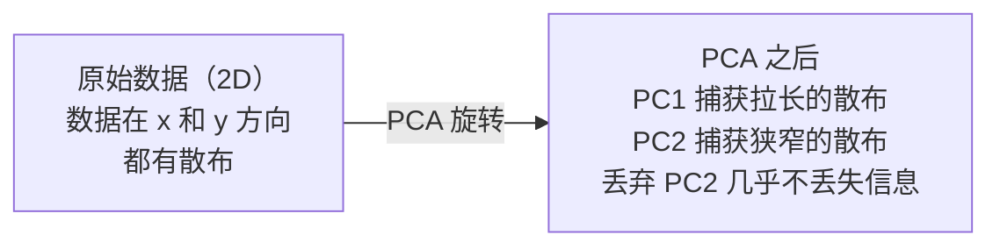

# 降维

> 高维数据有结构。你通过从正确的角度观察来发现它。

**类型：** 构建
**语言：** Python
**前置要求：** Phase 1, Lessons 01（线性代数直觉）、02（向量与矩阵运算）、03（特征值与特征向量）、06（概率与分布）
**时间：** ~90 分钟

## 学习目标

- 从头实现 PCA：数据中心化、计算协方差矩阵、特征分解和投影
- 使用解释方差比和手肘法选择主成分数量
- 比较 PCA、t-SNE 和 UMAP 在 2D 中可视化 MNIST 数字的效果，并解释它们的权衡
- 应用带 RBF 核的核 PCA 来分离标准 PCA 无法处理的非线性数据结构

## 问题

你的数据集每个样本有 784 个特征。可能是手写数字的像素值。可能是基因表达水平。可能是用户行为信号。你无法可视化 784 维。你无法绘制它们。你甚至无法思考它们。

但 784 个特征中的大部分是冗余的。实际信息存在于一个小得多的表面上。手写数字"7"不需要 784 个独立的数字来描述。它只需要几个：笔画的倾斜度、横杆的长度、倾斜的程度。其余的是噪声。

降维找到那个更小的表面。它将你的 784 维数据压缩到 2、10 或 50 维，同时保留重要的结构。

## 概念

### 维度灾难

高维空间违反直觉。随着维度增长，三件事会出问题。

**距离变得无意义。** 在高维中，任意两个随机点之间的距离收敛到相同的值。如果每个点与所有其他点的距离大致相同，最近邻搜索就失效了。

```
维度    平均距离比（随机点之间的最大/最小）
2            ~5.0
10           ~1.8
100          ~1.2
1000         ~1.02
```

**体积集中在角落。** d 维单位超立方体有 2^d 个角。在 100 维中，几乎所有的体积都在角落，远离中心。数据点分散到边缘，你的模型在内部缺乏数据。

**你需要指数级更多的数据。** 为了在空间中保持相同的样本密度，从 2D 到 20D 意味着你需要 10^18 倍更多的数据。你永远不会有足够的数据。降维将数据密度带回到可工作的水平。

### PCA：找到重要的方向

主成分分析（PCA）找到数据变化最大的轴。它旋转你的坐标系，使第一个轴捕获最多的方差，第二个捕获次多，以此类推。

算法：

```
1. 数据中心化    （减去每个特征的均值）
2. 计算协方差    （特征如何共同变化）
3. 特征分解    （找到主方向）
4. 按特征值排序 （方差最大的优先）
5. 投影          （保留前 k 个特征向量，丢弃其余）
```

为什么用特征分解？协方差矩阵是对称半正定的。其特征向量是特征空间中的正交方向。特征值告诉你每个方向捕获了多少方差。最大特征值对应的特征向量指向最大方差的方向。



- **PCA 前：** 数据云沿 x 和 y 轴的对角线方向散布
- **PCA 后：** 坐标系旋转，使 PC1 对齐方差最大的方向（拉长的散布），PC2 对齐方差最小的方向（狭窄的散布）
- **降维：** 丢弃 PC2 将数据投影到 PC1 上，丢失极少的信息

### 解释方差比

每个主成分捕获总方差的一部分。解释方差比告诉你多少。

```
成分       特征值    解释比     累计
PC1         4.73      0.473      0.473
PC2         2.51      0.251      0.724
PC3         1.12      0.112      0.836
PC4         0.89      0.089      0.925
...
```

当累计解释方差达到 0.95 时，你知道这些成分捕获了 95% 的信息。之后的主要是噪声。

### 选择成分数量

三种策略：

1. **阈值法。** 保留足够解释 90-95% 方差的成分。
2. **手肘法。** 绘制每个成分的解释方差。寻找急剧下降的点。
3. **下游性能。** 使用 PCA 作为预处理。扫描 k 并测量模型的准确率。最佳的 k 是准确率趋于平稳的点。

### t-SNE：保留邻域

t-分布随机邻域嵌入（t-SNE）专门用于可视化。它将高维数据映射到 2D（或 3D），同时保留哪些点彼此靠近。

核心直觉：在原始空间中，基于点对之间的距离计算一个概率分布。近的点获得高概率。远的点获得低概率。然后找到一个 2D 排列，使得相同的概率分布成立。在 784 维中相邻的点在 2D 中保持相邻。

t-SNE 的关键性质：
- 非线性。它可以展开 PCA 无法处理的复杂流形。
- 随机性。不同的运行产生不同的布局。
- 困惑度参数控制要考虑多少邻居（典型范围：5-50）。
- 输出中簇之间的距离没有意义。只有簇本身有意义。
- 在大数据集上慢。默认 O(n²)。

### UMAP：更快，更好的全局结构

均匀流形逼近与投影（UMAP）的工作原理与 t-SNE 类似，但有两个优势：
- 更快。它使用近似最近邻图而不是计算所有点对距离。
- 更好的全局结构。输出中簇的相对位置倾向于比 t-SNE 更有意义。

UMAP 在高维空间中构建一个加权图（"模糊拓扑表示"），然后找到一个尽可能保留此图的低维布局。

关键参数：
- `n_neighbors`：多少邻居定义局部结构（类似困惑度）。更高的值保留更多全局结构。
- `min_dist`：点在输出中聚集的紧密程度。更低的值创建更密集的簇。

### 何时使用哪种方法

| 方法 | 用途 | 保留 | 速度 |
|--------|----------|-----------|-------|
| PCA | 训练前预处理 | 全局方差 | 快（精确），可处理数百万样本 |
| PCA | 快速探索性可视化 | 线性结构 | 快 |
| t-SNE | 出版级 2D 图 | 局部邻域 | 慢（< 1 万个样本效果最佳） |
| UMAP | 大规模 2D 可视化 | 局部 + 部分全局结构 | 中等（可处理数百万） |
| PCA | 模型特征降维 | 按方差排序的特征 | 快 |
| t-SNE / UMAP | 理解簇结构 | 簇分离 | 中到慢 |

经验法则：使用 PCA 进行预处理和数据压缩。需要可视化 2D 结构时使用 t-SNE 或 UMAP。

### 核 PCA

标准 PCA 找到线性子空间。它旋转你的坐标系并丢弃轴。但如果数据位于非线性流形上呢？2D 中的圆不能被任何直线分开。标准 PCA 无法处理。

核 PCA 在由核函数诱导的高维特征空间中应用 PCA，而无需显式计算该空间中的坐标。这就是核技巧 —— 与 SVM 背后的想法相同。

算法：
1. 计算核矩阵 K，其中 K_ij = k(x_i, x_j)
2. 在特征空间中对核矩阵中心化
3. 对中心化后的核矩阵进行特征分解
4. 顶部特征向量（乘以 1/√(特征值)）就是投影

常见核函数：

| 核 | 公式 | 适用于 |
|--------|---------|----------|
| RBF（高斯） | exp(-gamma × ||x - y||²) | 大多数非线性数据，光滑流形 |
| 多项式 | (x · y + c)^d | 多项式关系 |
| Sigmoid | tanh(alpha × x · y + c) | 类似神经网络的映射 |

何时使用核 PCA vs 标准 PCA：

| 准则 | 标准 PCA | 核 PCA |
|-----------|-------------|------------|
| 数据结构 | 线性子空间 | 非线性流形 |
| 速度 | O(min(n²d, d²n)) | O(n²d + n³) |
| 可解释性 | 成分是特征的线性组合 | 成分缺乏直接的特征解释 |
| 可扩展性 | 可处理数百万样本 | 核矩阵为 n×n，受内存限制 |
| 重构 | 直接逆变换 | 需要原像近似 |

经典示例：2D 中的同心圆。两圈点，一个在另一个里面。标准 PCA 将两者投影到同一条线上 —— 对分类无用。带 RBF 核的核 PCA 将内圈和外圈映射到不同区域，使它们线性可分。

### 重构误差

你的降维效果如何？你将 784 维压缩到 50 维。你丢失了什么？

测量重构误差：
1. 将数据投影到 k 维：X_reduced = X @ W_k
2. 重构：X_hat = X_reduced @ W_k^T
3. 计算 MSE：mean((X - X_hat)²)

对于 PCA，重构误差与解释方差有清晰的关系：

```
重构误差 = 未包含的特征值之和
总方差   = 所有特征值之和
丢失比例 = (丢弃的特征值之和) / (所有特征值之和)
```

每个成分的解释方差比为：

```
explained_ratio_k = eigenvalue_k / sum(all eigenvalues)
```

绘制累计解释方差与成分数量的关系图，得到"手肘"曲线。正确的成分数量是：
- 曲线变平缓（收益递减）
- 累计方差超过你的阈值（通常为 0.90 或 0.95）
- 下游任务性能趋于平稳

重构误差除了选择 k 之外还有其他用途。你可以用它进行异常检测：重构误差高的样本是不符合学习子空间的异常值。这是生产系统中基于 PCA 的异常检测的基础。

```figure
pca-axes
```

## 动手实现

### 步骤 1：从头实现 PCA

```python
import numpy as np

class PCA:
    def __init__(self, n_components):
        self.n_components = n_components
        self.components = None
        self.mean = None
        self.eigenvalues = None
        self.explained_variance_ratio_ = None

    def fit(self, X):
        self.mean = np.mean(X, axis=0)
        X_centered = X - self.mean

        cov_matrix = np.cov(X_centered, rowvar=False)

        eigenvalues, eigenvectors = np.linalg.eigh(cov_matrix)

        sorted_idx = np.argsort(eigenvalues)[::-1]
        eigenvalues = eigenvalues[sorted_idx]
        eigenvectors = eigenvectors[:, sorted_idx]

        self.components = eigenvectors[:, :self.n_components].T
        self.eigenvalues = eigenvalues[:self.n_components]
        total_var = np.sum(eigenvalues)
        self.explained_variance_ratio_ = self.eigenvalues / total_var

        return self

    def transform(self, X):
        X_centered = X - self.mean
        return X_centered @ self.components.T

    def fit_transform(self, X):
        self.fit(X)
        return self.transform(X)
```

### 步骤 2：在合成数据上测试

```python
np.random.seed(42)
n_samples = 500

t = np.random.uniform(0, 2 * np.pi, n_samples)
x1 = 3 * np.cos(t) + np.random.normal(0, 0.2, n_samples)
x2 = 3 * np.sin(t) + np.random.normal(0, 0.2, n_samples)
x3 = 0.5 * x1 + 0.3 * x2 + np.random.normal(0, 0.1, n_samples)

X_synthetic = np.column_stack([x1, x2, x3])

pca = PCA(n_components=2)
X_reduced = pca.fit_transform(X_synthetic)

print(f"Original shape: {X_synthetic.shape}")
print(f"Reduced shape:  {X_reduced.shape}")
print(f"Explained variance ratios: {pca.explained_variance_ratio_}")
print(f"Total variance captured: {sum(pca.explained_variance_ratio_):.4f}")
```

### 步骤 3：2D 中的 MNIST 数字

```python
from sklearn.datasets import fetch_openml

mnist = fetch_openml("mnist_784", version=1, as_frame=False, parser="auto")
X_mnist = mnist.data[:5000].astype(float)
y_mnist = mnist.target[:5000].astype(int)

pca_mnist = PCA(n_components=50)
X_pca50 = pca_mnist.fit_transform(X_mnist)
print(f"50 components capture {sum(pca_mnist.explained_variance_ratio_):.2%} of variance")

pca_2d = PCA(n_components=2)
X_pca2d = pca_2d.fit_transform(X_mnist)
print(f"2 components capture {sum(pca_2d.explained_variance_ratio_):.2%} of variance")
```

### 步骤 4：与 sklearn 比较

```python
from sklearn.decomposition import PCA as SklearnPCA
from sklearn.manifold import TSNE

sklearn_pca = SklearnPCA(n_components=2)
X_sklearn_pca = sklearn_pca.fit_transform(X_mnist)

print(f"\nOur PCA explained variance:     {pca_2d.explained_variance_ratio_}")
print(f"Sklearn PCA explained variance: {sklearn_pca.explained_variance_ratio_}")

diff = np.abs(np.abs(X_pca2d) - np.abs(X_sklearn_pca))
print(f"Max absolute difference: {diff.max():.10f}")

tsne = TSNE(n_components=2, perplexity=30, random_state=42)
X_tsne = tsne.fit_transform(X_mnist)
print(f"\nt-SNE output shape: {X_tsne.shape}")
```

### 步骤 5：UMAP 比较

```python
try:
    from umap import UMAP

    reducer = UMAP(n_components=2, n_neighbors=15, min_dist=0.1, random_state=42)
    X_umap = reducer.fit_transform(X_mnist)
    print(f"UMAP output shape: {X_umap.shape}")
except ImportError:
    print("Install umap-learn: pip install umap-learn")
```

## 使用现成库

PCA 作为分类器前的预处理：

```python
from sklearn.decomposition import PCA as SklearnPCA
from sklearn.linear_model import LogisticRegression
from sklearn.model_selection import train_test_split
from sklearn.metrics import accuracy_score

X_train, X_test, y_train, y_test = train_test_split(
    X_mnist, y_mnist, test_size=0.2, random_state=42
)

results = {}
for k in [10, 30, 50, 100, 200]:
    pca_k = SklearnPCA(n_components=k)
    X_tr = pca_k.fit_transform(X_train)
    X_te = pca_k.transform(X_test)

    clf = LogisticRegression(max_iter=1000, random_state=42)
    clf.fit(X_tr, y_train)
    acc = accuracy_score(y_test, clf.predict(X_te))
    var_captured = sum(pca_k.explained_variance_ratio_)
    results[k] = (acc, var_captured)
    print(f"k={k:>3d}  accuracy={acc:.4f}  variance={var_captured:.4f}")
```

性能在远未达到 784 维之前就趋于平稳。那个平稳点就是你的操作点。

## 产出

本课程产出：
- `outputs/skill-dimensionality-reduction.md` —— 为给定任务选择正确降维技术的技能

## 练习

1. 修改 PCA 类以支持 `inverse_transform`。从 10、50 和 200 个成分重构 MNIST 数字。打印每种情况的重构误差（与原始图像的均方误差）。

2. 在相同的 MNIST 子集上，使用困惑度值 5、30 和 100 运行 t-SNE。描述输出如何变化。为什么困惑度会影响簇的紧密度？

3. 取一个有 50 个特征但只有 5 个有信息的数据集（使用 `sklearn.datasets.make_classification` 生成）。应用 PCA 并检查解释方差曲线是否正确识别数据实际上是 5 维的。

## 关键术语

| 术语 | 人们说的 | 实际含义 |
|------|----------------|----------------------|
| 维度灾难 | "太多特征" | 随着维度增长，距离、体积和数据密度都违反直觉。模型需要指数级更多的数据来补偿。 |
| PCA | "降维" | 旋转你的坐标系使轴对齐方差最大的方向，然后丢弃方差低的轴。 |
| 主成分 | "一个重要方向" | 协方差矩阵的特征向量。特征空间中数据变化最大的方向。 |
| 解释方差比 | "这个成分有多少信息" | 一个主成分捕获的总方差比例。将前 k 个比例相加可看到 k 个成分保留了多少。 |
| 协方差矩阵 | "特征如何相关" | 一个对称矩阵，其中 (i,j) 项衡量特征 i 和特征 j 如何共同变化。对角线项是各自的方差。 |
| t-SNE | "那个聚类图" | 一个通过保留成对邻域概率将高维数据映射到 2D 的非线性方法。适合可视化，不适合预处理。 |
| UMAP | "更快的 t-SNE" | 基于拓扑数据分析的非线性方法。保留局部和部分全局结构。可扩展性比 t-SNE 好。 |
| 困惑度 | "t-SNE 的旋钮" | 控制每个点考虑的有效邻居数量。低困惑度关注非常局部的结构。高困惑度捕获更广泛的模式。 |
| 流形 | "数据所在的表面" | 嵌入在高维空间中的低维表面。一张在 3D 中揉皱的纸是一个 2D 流形。 |

## 延伸阅读

- [A Tutorial on Principal Component Analysis](https://arxiv.org/abs/1404.1100) (Shlens) —— 从基础到 PCA 的清晰推导
- [How to Use t-SNE Effectively](https://distill.pub/2016/misread-tsne/) (Wattenberg et al.) —— t-SNE 陷阱和参数选择的交互式指南
- [UMAP documentation](https://umap-learn.readthedocs.io/) —— UMAP 作者提供的理论和实践指导
