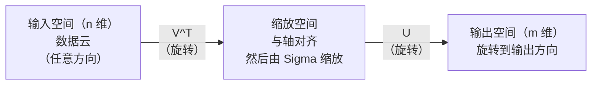
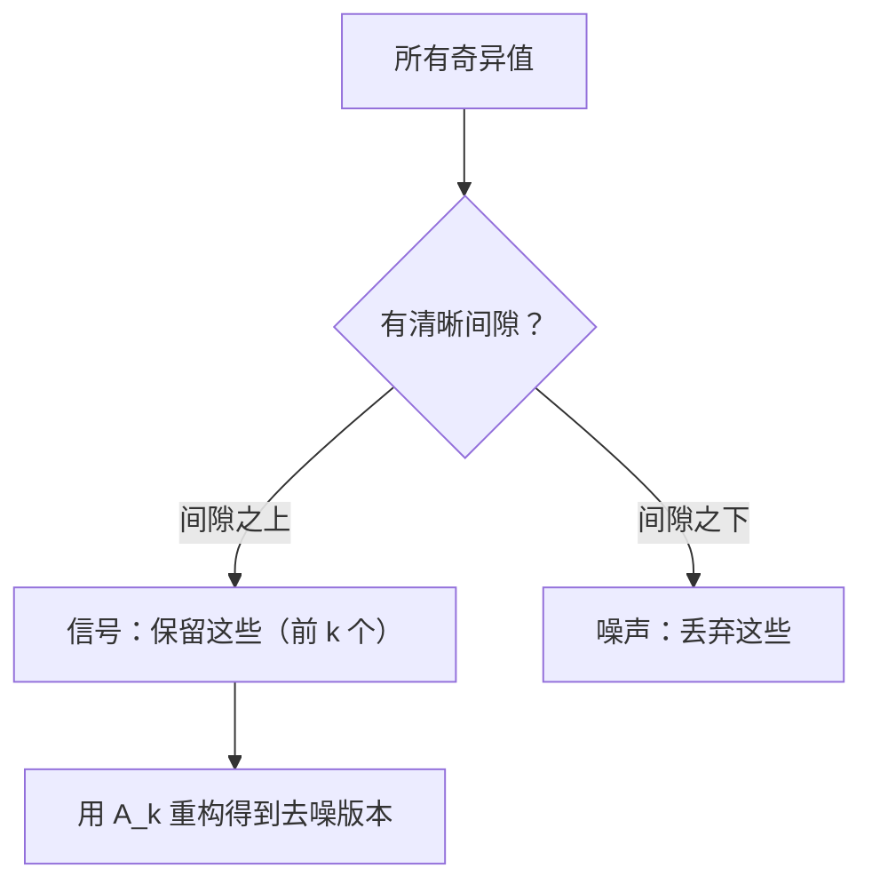

# 奇异值分解

> SVD 是线性代数的瑞士军刀。每个矩阵都有。每个数据科学家都需要一个。

**类型：** 构建
**语言：** Python, Julia
**前置要求：** Phase 1, Lessons 01（线性代数直觉）、02（向量与矩阵运算）、03（矩阵变换）
**时间：** ~120 分钟

## 学习目标

- 通过幂迭代实现 SVD，并解释 U、Sigma 和 V^T 的几何含义
- 应用截断 SVD 进行图像压缩，并测量压缩比与重构误差的权衡
- 通过 SVD 计算 Moore-Penrose 伪逆以求解超定最小二乘系统
- 将 SVD 与 PCA、推荐系统（潜在因子）和 NLP 中的潜在语义分析联系起来

## 问题

你有一个 1000×2000 的矩阵。可能是用户-电影评分矩阵。可能是文档-词频表。可能是图像的像素值。你需要压缩它、去噪、在其中找到隐藏结构，或者用它求解一个最小二乘系统。特征分解只适用于方阵。即使如此，它也需要矩阵具有一组完整的线性无关特征向量。

SVD 适用于任何矩阵。任何形状。任何秩。无任何条件。它将矩阵分解为三个因子，揭示了矩阵对空间作用的几何。它是整个线性代数中最通用、最有用的分解。

## 概念

### SVD 的几何作用

每个矩阵，无论形状如何，都按顺序执行三个操作：旋转、缩放、旋转。SVD 使这个分解显式化。

```
A = U × Sigma × V^T

      m × n     m × m    m × n    n × n
     （任意）  （旋转） （缩放） （旋转）
```

给定任意矩阵 A，SVD 将其分解为：
- V^T 在输入空间（n 维）中旋转向量
- Sigma 沿每个轴缩放（拉伸或压缩）
- U 将结果旋转到输出空间（m 维）



这样想。你把一个矩阵给 SVD。它告诉你："这个矩阵拿一个输入球体，先用 V^T 旋转它，然后用 Sigma 把它拉伸成一个椭球体，再用 U 旋转这个椭球体。"奇异值就是椭球体轴的长度。

### 完整分解

对于形状为 m × n 的矩阵 A：

```
A = U × Sigma × V^T

其中：
  U    是 m × m，正交（U^T U = I）
  Sigma 是 m × n，对角线（对角线上是奇异值）
  V    是 n × n，正交（V^T V = I）

奇异值 sigma_1 ≥ sigma_2 ≥ ... ≥ sigma_r > 0
其中 r = rank(A)
```

U 的列称为左奇异向量。V 的列称为右奇异向量。Sigma 的对角线项称为奇异值。它们总是非负的，并按照惯例以降序排列。

### 左奇异向量、奇异值、右奇异向量

SVD 的每个组成部分都有不同的几何含义。

**右奇异向量（V 的列）：** 构成输入空间（Rⁿ）的标准正交基。它们是输入空间中，矩阵将其映射到输出空间中正交方向的方向。可以将其视为域的自然坐标系。

**奇异值（Sigma 的对角线）：** 缩放因子。第 i 个奇异值告诉你矩阵沿第 i 个右奇异向量方向拉伸了多少。奇异值为零意味着矩阵完全压碎了那个方向。

**左奇异向量（U 的列）：** 构成输出空间（Rᵐ）的标准正交基。第 i 个左奇异向量是第 i 个右奇异向量（经缩放后）在输出空间中落地的方向。

它们之间的关系：

```
A × v_i = sigma_i × u_i

矩阵 A 取第 i 个右奇异向量 v_i，
用 sigma_i 缩放它，然后映射到第 i 个左奇异向量 u_i。
```

这给了你一个关于任何矩阵作用的坐标级图像。

### 外积形式

SVD 可以写为秩 1 矩阵的和：

```
A = sigma_1 × u_1 × v_1^T + sigma_2 × u_2 × v_2^T + ... + sigma_r × u_r × v_r^T

每个项 sigma_i × u_i × v_i^T 是一个秩 1 矩阵（外积）。
完整的矩阵是 r 个这样的矩阵的和，其中 r 是秩。
```

这种形式是低秩近似的基础。每一项添加一层结构。第一项捕获最重要的单一模式。第二项捕获次重要的模式。依此类推。截断这个求和得到给定秩下的最佳可能近似。

```
秩 1 近似：    A_1 = sigma_1 × u_1 × v_1^T
              （捕获主导模式）

秩 2 近似：    A_2 = sigma_1 × u_1 × v_1^T + sigma_2 × u_2 × v_2^T
              （捕获两个最重要的模式）

秩 k 近似：    A_k = 前 k 项之和
              （根据 Eckart-Young 定理为最优）
```

### 与特征分解的关系

SVD 和特征分解有深刻的联系。A 的奇异值和向量直接来自 A^T A 和 A A^T 的特征值和特征向量。

```
A^T A = V × Sigma^T × U^T × U × Sigma × V^T
      = V × Sigma^T × Sigma × V^T
      = V × D × V^T

其中 D = Sigma^T × Sigma 是一个对角矩阵，对角线上为 sigma_i²。

所以：
- 右奇异向量（V）是 A^T A 的特征向量
- 奇异值的平方（sigma_i²）是 A^T A 的特征值

类似地：
A A^T = U × Sigma × V^T × V × Sigma^T × U^T
      = U × Sigma × Sigma^T × U^T

所以：
- 左奇异向量（U）是 A A^T 的特征向量
- A A^T 的特征值也是 sigma_i²
```

这个联系告诉你三件事：
1. 奇异值总是实数且非负（它们是半正定矩阵特征值的平方根）。
2. 你可以通过 A^T A 的特征分解计算 SVD，但这会平方条件数并损失数值精度。专用的 SVD 算法避免了这一点。
3. 当 A 是方阵且对称半正定时，SVD 和特征分解是相同的。

### 截断 SVD：低秩近似

Eckart-Young-Mirsky 定理指出，A 的最佳秩 k 近似（在 Frobenius 范数和谱范数下）通过只保留前 k 个奇异值及其对应向量获得：

```
A_k = U_k × Sigma_k × V_k^T

其中：
  U_k    是 m × k（U 的前 k 列）
  Sigma_k 是 k × k（Sigma 的左上 k×k 块）
  V_k    是 n × k（V 的前 k 列）

近似误差 = sigma_{k+1}  （谱范数）
          = sqrt(sigma_{k+1}² + ... + sigma_r²)  （Frobenius 范数）
```

这不仅仅是"一个"好的近似。它在所有可能的秩 k 矩阵中可证明是最佳近似。

| 成分 | 相对大小 | 在秩 3 近似中保留？ |
|-----------|-------------------|------------------------|
| sigma_1 | 最大 | 是 |
| sigma_2 | 大 | 是 |
| sigma_3 | 中大 | 是 |
| sigma_4 | 中 | 否（误差） |
| sigma_5 | 中小 | 否（误差） |
| sigma_6 | 小 | 否（误差） |
| sigma_7 | 非常小 | 否（误差） |
| sigma_8 | 极小 | 否（误差） |

保留前 3 个：A_3 捕获了三个最大的奇异值。误差 = 剩余值（sigma_4 到 sigma_8）。

如果奇异值快速衰减，一个小的 k 就能捕获大部分矩阵。如果它们衰减缓慢，矩阵没有低秩结构。

### 使用 SVD 进行图像压缩

灰度图像是一个像素强度矩阵。800×600 的图像有 480,000 个值。SVD 可以用少得多的值来近似它。

```
原始图像：800 × 600 = 480,000 个值

秩 k 的 SVD：
  U_k：     800 × k 个值
  Sigma_k：  k 个值
  V_k：     600 × k 个值
  总计：    k × (800 + 600 + 1) = k × 1401 个值

  k=10：   14,010 个值   （原始值的 2.9%）
  k=50：   70,050 个值   （原始值的 14.6%）
  k=100：  140,100 个值  （原始值的 29.2%）

  压缩比随 k 变小而提高，
  但视觉质量下降。
```

关键洞察：自然图像的奇异值快速衰减。前几个奇异值捕获宽泛的结构（形状、渐变）。后面的捕获细节和噪声。在秩 50 处截断通常产生的图像看起来与原始图像几乎相同，同时使用 85% 更少的存储空间。

### SVD 用于推荐系统

Netflix 大奖赛使这变得著名。你有一个用户-电影评分矩阵，其中大多数条目缺失。

```
             Movie1  Movie2  Movie3  Movie4  Movie5
  User1      [  5      ?       3       ?       1  ]
  User2      [  ?      4       ?       2       ?  ]
  User3      [  3      ?       5       ?       ?  ]
  User4      [  ?      ?       ?       4       3  ]

  ? = 未知评分
```

思路是：这个评分矩阵是低秩的。用户没有完全独立的品味。有少数几个潜在因子（动作 vs. 剧情、老 vs. 新、脑力 vs. 情感）可以解释大多数偏好。

对（填充后的）评分矩阵进行 SVD 分解为：
- U：潜在因子空间中的用户画像
- Sigma：每个潜在因子的重要性
- V^T：潜在因子空间中的电影画像

用户对电影的预测评分是用户画像与电影画像的点积（经奇异值加权）。低秩近似填充了缺失的条目。

在实践中，你使用像 Simon Funk 的增量 SVD 或 ALS（交替最小二乘法）等变体，它们直接处理缺失数据。但核心思想是一样的：通过 SVD 的潜在因子分解。

### NLP 中的 SVD：潜在语义分析

潜在语义分析（LSA），也称为潜在语义索引（LSI），将 SVD 应用于词项-文档矩阵。

```
             Doc1   Doc2   Doc3   Doc4
  "cat"      [  3      0      1      0  ]
  "dog"      [  2      0      0      1  ]
  "fish"     [  0      4      1      0  ]
  "pet"      [  1      1      1      1  ]
  "ocean"    [  0      3      0      0  ]

经过秩 k=2 的 SVD 后：

  每个文档成为 2D"概念空间"中的一个点。
  每个词项成为同一个 2D 空间中的一个点。
  关于相似主题的文档聚集在一起。
  含义相似的词项聚集在一起。

  "cat"和"dog"最终靠近彼此（陆地宠物）。
  "fish"和"ocean"最终靠近彼此（水概念）。
  Doc1 和 Doc3 如果分享相似的主题则聚在一起。
```

LSA 是从原始文本中捕获语义相似性的最早成功方法之一。它之所以有效，是因为同义词倾向于出现在相似的文档中，所以 SVD 将它们分组到相同的潜在维度中。现代词嵌入（Word2Vec、GloVe）可以被视为这个想法的后代。

### SVD 用于降噪

含噪数据的信号集中在前几个奇异值上，而噪声分布在所有奇异值上。截断去除了噪声基底。

**干净信号的奇异值：**

| 成分 | 大小 | 类型 |
|-----------|-----------|------|
| sigma_1 | 非常大 | 信号 |
| sigma_2 | 大 | 信号 |
| sigma_3 | 中等 | 信号 |
| sigma_4 | 接近零 | 可忽略 |
| sigma_5 | 接近零 | 可忽略 |

**含噪信号的奇异值（噪声加到所有成分上）：**

| 成分 | 大小 | 类型 |
|-----------|-----------|------|
| sigma_1 | 非常大 | 信号 |
| sigma_2 | 大 | 信号 |
| sigma_3 | 中等 | 信号 |
| sigma_4 | 小 | 噪声 |
| sigma_5 | 小 | 噪声 |
| sigma_6 | 小 | 噪声 |
| sigma_7 | 小 | 噪声 |



这用于信号处理、科学测量和数据清洗。任何时候你有一个被加性噪声污染的矩阵，截断 SVD 都是一种有原则的分离信号和噪声的方法。

### 通过 SVD 计算伪逆

Moore-Penrose 伪逆 A⁺ 将矩阵求逆推广到非方阵和奇异矩阵。SVD 使计算它变得简单。

```
如果 A = U × Sigma × V^T，那么：

A⁺ = V × Sigma⁺ × U^T

其中 Sigma⁺ 通过以下方式构成：
  1. 转置 Sigma（交换行和列）
  2. 将每个非零的对角线项 sigma_i 替换为 1/sigma_i
  3. 零保持不变

对于 A（m × n）：     A⁺ 是（n × m）
对于 Sigma（m × n）： Sigma⁺ 是（n × m）
```

伪逆求解最小二乘问题。如果 Ax = b 没有精确解（超定系统），则 x = A⁺ b 是最小二乘解（最小化 ||Ax - b||）。

```
超定系统（方程多于未知数）：

  [1  1]         [3]
  [2  1]  x =    [5]       没有精确解。
  [3  1]         [6]

  x_ls = A⁺ b = V × Sigma⁺ × U^T × b

  这给出了最小化平方残差和的 x。
  与正规方程 (A^T A)^(-1) A^T b 的结果相同，
  但数值上更稳定。
```

### 数值稳定性优势

计算 A^T A 的特征分解会使奇异值平方（A^T A 的特征值是 sigma_i²）。这会使条件数平方，放大数值误差。

```
示例：
  A 的奇异值为 [1000, 1, 0.001]
  A 的条件数：1000 / 0.001 = 10^6

  A^T A 的特征值为 [10^6, 1, 10^{-6}]
  A^T A 的条件数：10^6 / 10^{-6} = 10^{12}

  直接计算 SVD：处理条件数 10^6
  通过 A^T A 计算： 处理条件数 10^{12}
                     （损失了 6 位额外精度）
```

现代 SVD 算法（Golub-Kahan 双对角化）直接在 A 上操作，从不构造 A^T A。这就是为什么你应该始终首选 `np.linalg.svd(A)` 而不是 `np.linalg.eig(A.T @ A)`。

### 与 PCA 的联系

PCA 就是对中心化后的数据进行 SVD。这不是类比。它在字面上是相同的计算。

```
给定数据矩阵 X（n_samples × n_features），中心化（减去均值）：

协方差矩阵：C = (1/(n-1)) × X^T X

PCA 寻找 C 的特征向量。但是：

  X = U × Sigma × V^T    （X 的 SVD）

  X^T X = V × Sigma² × V^T

  C = (1/(n-1)) × V × Sigma² × V^T

所以主成分正好是右奇异向量 V。
每个成分的解释方差是 sigma_i² / (n-1)。

在 sklearn 中，PCA 使用 SVD 而不是特征分解实现的。
它更快且数值上更稳定。
```

这意味着你在 Lesson 10 中学到的关于降维的一切在底层都是 SVD。PCA 是机器学习的 SVD 最常见的应用。

```figure
svd-rank-reconstruction
```

## 动手实现

### 步骤 1：使用幂迭代从头实现 SVD

思路：为了找到最大的奇异值及其向量，在 A^T A（或 A A^T）上使用幂迭代。然后消去（deflate）矩阵并重复下一个奇异值。

```python
import numpy as np

def power_iteration(M, num_iters=100):
    n = M.shape[1]
    v = np.random.randn(n)
    v = v / np.linalg.norm(v)

    for _ in range(num_iters):
        Mv = M @ v
        v = Mv / np.linalg.norm(Mv)

    eigenvalue = v @ M @ v
    return eigenvalue, v

def svd_from_scratch(A, k=None):
    m, n = A.shape
    if k is None:
        k = min(m, n)

    sigmas = []
    us = []
    vs = []

    A_residual = A.copy().astype(float)

    for _ in range(k):
        AtA = A_residual.T @ A_residual
        eigenvalue, v = power_iteration(AtA, num_iters=200)

        if eigenvalue < 1e-10:
            break

        sigma = np.sqrt(eigenvalue)
        u = A_residual @ v / sigma

        sigmas.append(sigma)
        us.append(u)
        vs.append(v)

        A_residual = A_residual - sigma * np.outer(u, v)

    U = np.column_stack(us) if us else np.empty((m, 0))
    S = np.array(sigmas)
    V = np.column_stack(vs) if vs else np.empty((n, 0))

    return U, S, V
```

### 步骤 2：测试并与 NumPy 比较

```python
np.random.seed(42)
A = np.random.randn(5, 4)

U_ours, S_ours, V_ours = svd_from_scratch(A)
U_np, S_np, Vt_np = np.linalg.svd(A, full_matrices=False)

print("Our singular values:", np.round(S_ours, 4))
print("NumPy singular values:", np.round(S_np, 4))

A_reconstructed = U_ours @ np.diag(S_ours) @ V_ours.T
print(f"Reconstruction error: {np.linalg.norm(A - A_reconstructed):.8f}")
```

### 步骤 3：图像压缩演示

```python
def compress_image_svd(image_matrix, k):
    U, S, Vt = np.linalg.svd(image_matrix, full_matrices=False)
    compressed = U[:, :k] @ np.diag(S[:k]) @ Vt[:k, :]
    return compressed

image = np.random.seed(42)
rows, cols = 200, 300
image = np.random.randn(rows, cols)

for k in [1, 5, 10, 20, 50]:
    compressed = compress_image_svd(image, k)
    error = np.linalg.norm(image - compressed) / np.linalg.norm(image)
    original_size = rows * cols
    compressed_size = k * (rows + cols + 1)
    ratio = compressed_size / original_size
    print(f"k={k:>3d}  error={error:.4f}  storage={ratio:.1%}")
```

### 步骤 4：降噪

```python
np.random.seed(42)
clean = np.outer(np.sin(np.linspace(0, 4*np.pi, 100)),
                 np.cos(np.linspace(0, 2*np.pi, 80)))
noise = 0.3 * np.random.randn(100, 80)
noisy = clean + noise

U, S, Vt = np.linalg.svd(noisy, full_matrices=False)
denoised = U[:, :5] @ np.diag(S[:5]) @ Vt[:5, :]

print(f"Noisy error:    {np.linalg.norm(noisy - clean):.4f}")
print(f"Denoised error: {np.linalg.norm(denoised - clean):.4f}")
print(f"Improvement:    {(1 - np.linalg.norm(denoised - clean) / np.linalg.norm(noisy - clean)):.1%}")
```

### 步骤 5：伪逆

```python
A = np.array([[1, 1], [2, 1], [3, 1]], dtype=float)
b = np.array([3, 5, 6], dtype=float)

U, S, Vt = np.linalg.svd(A, full_matrices=False)
S_inv = np.diag(1.0 / S)
A_pinv = Vt.T @ S_inv @ U.T

x_svd = A_pinv @ b
x_lstsq = np.linalg.lstsq(A, b, rcond=None)[0]
x_pinv = np.linalg.pinv(A) @ b

print(f"SVD pseudoinverse solution:  {x_svd}")
print(f"np.linalg.lstsq solution:   {x_lstsq}")
print(f"np.linalg.pinv solution:    {x_pinv}")
```

## 使用现成库

完整的工作演示在 `code/svd.py` 中。运行它以查看 SVD 应用于图像压缩、推荐系统、潜在语义分析和降噪。

```bash
python svd.py
```

Julia 版本在 `code/svd.jl` 中演示了使用 Julia 原生 `svd()` 函数和 `LinearAlgebra` 包的相同概念。

```bash
julia svd.jl
```

## 产出

本课程产出：
- `outputs/skill-svd.md` —— 一个用于了解何时以及如何在真实项目中应用 SVD 的技能

## 练习

1. 不使用幂迭代从头实现完整 SVD。而是计算 A^T A 的特征分解以得到 V 和奇异值，然后计算 U = A V Sigma⁻¹。比较数值精度与你的幂迭代版本以及 NumPy。

2. 加载一张真实的灰度图像（或将一张图像转换为灰度）。在秩 1、5、10、25、50、100 下压缩它。对于每个秩，计算压缩比和相对误差。找到图像在视觉上可接受的秩。

3. 构建一个微型推荐系统。创建一个 10×8 的用户-电影评分矩阵，包含一些已知条目。用行均值填充缺失条目。计算 SVD 并重构一个秩 3 近似。使用重构矩阵预测缺失评分。验证预测是否合理。

4. 创建一个 100×50 的文档-词项矩阵，包含 3 个合成主题。每个主题有 5 个相关词项。添加噪声。应用 SVD 并验证前 3 个奇异值远大于其余。将文档投影到 3D 潜在空间中，并检查来自同一主题的文档是否聚集在一起。

5. 生成一个干净的、秩 3 的低秩矩阵（大小 50×40）并在不同水平（sigma = 0.1、0.5、1.0、2.0）下添加高斯噪声。对于每个噪声水平，通过从 1 到 40 扫描 k 并测量相对于干净矩阵的重构误差来找到最佳截断秩。绘制最佳 k 随噪声水平变化的曲线。

## 关键术语

| 术语 | 人们说的 | 实际含义 |
|------|----------------|----------------------|
| SVD | "分解任何矩阵" | 将 A 分解为 U Sigma V^T，其中 U 和 V 正交，Sigma 对角且非负。适用于任何形状的任何矩阵。 |
| 奇异值 | "这个成分有多重要" | Sigma 的第 i 个对角线项。衡量矩阵沿第 i 个主方向拉伸的程度。总是非负，按降序排列。 |
| 左奇异向量 | "输出方向" | U 的一列。第 i 个右奇异向量映射到的输出空间方向（经 sigma_i 缩放后）。 |
| 右奇异向量 | "输入方向" | V 的一列。矩阵将其映射到第 i 个左奇异向量的输入空间方向（经 sigma_i 缩放后）。 |
| 截断 SVD | "低秩近似" | 只保留前 k 个奇异值及其向量。产生原始矩阵的最佳可证明秩 k 近似（Eckart-Young 定理）。 |
| 秩 | "真实维度" | 非零奇异值的数量。告诉你矩阵实际使用的独立方向数。 |
| 伪逆 | "广义逆" | V Sigma⁺ U^T。反转非零奇异值，保留零值。为非方阵或奇异矩阵求解最小二乘问题。 |
| 条件数 | "对误差的敏感度" | sigma_max / sigma_min。大的条件数意味着小的输入变化导致大的输出变化。SVD 直接揭示这一点。 |
| 潜在因子 | "隐藏变量" | SVD 发现的低秩空间中的一个维度。在推荐中，一个潜在因子可能对应于类型偏好。在 NLP 中，可能对应于一个主题。 |
| Frobenius 范数 | "总矩阵大小" | 所有条目平方和的平方根。等于所有奇异值平方和的平方根。用于衡量近似误差。 |
| Eckart-Young 定理 | "SVD 给出最佳压缩" | 对于任意目标秩 k，截断 SVD 在所有可能的秩 k 矩阵中最小化近似误差。 |
| 幂迭代 | "找到最大的特征向量" | 重复将随机向量乘以矩阵并归一化。收敛到最大特征值对应的特征向量。许多 SVD 算法的构建模块。 |

## 延伸阅读

- [Gilbert Strang: Linear Algebra and Its Applications, Chapter 7](https://math.mit.edu/~gs/linearalgebra/) —— 对 SVD 及其应用的透彻讲解
- [3Blue1Brown: 什么是 SVD？](https://www.youtube.com/watch?v=vSczTbgc8Rc) —— SVD 的几何直观
- [We Recommend a Singular Value Decomposition](https://www.ams.org/publicoutreach/feature-column/fcarc-svd) —— 美国数学会的易懂概述
- [Netflix Prize and Matrix Factorization](https://sifter.org/~simon/journal/20061211.html) —— Simon Funk 关于 SVD 用于推荐的原始博客文章
- [Latent Semantic Analysis](https://en.wikipedia.org/wiki/Latent_semantic_analysis) —— SVD 在 NLP 中的原始应用
- [Numerical Linear Algebra by Trefethen and Bau](https://people.maths.ox.ac.uk/trefethen/text.html) —— 理解 SVD 算法及其数值性质的金标准
