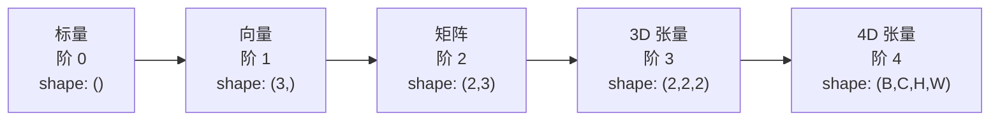
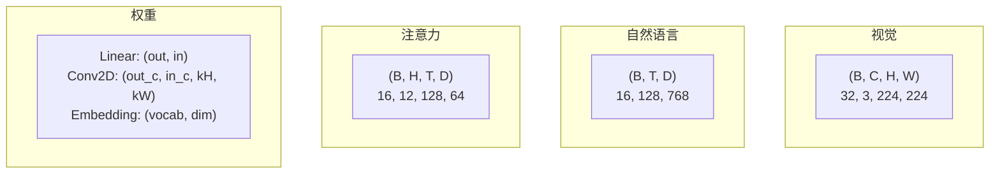
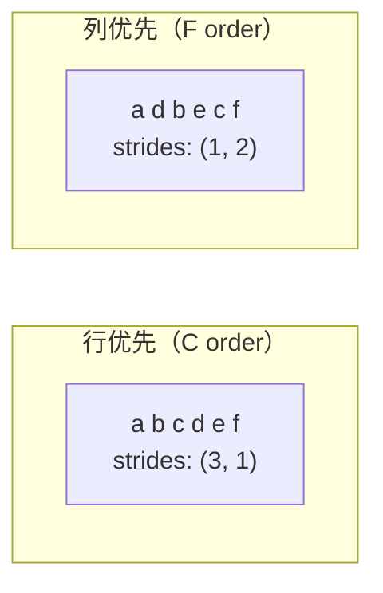
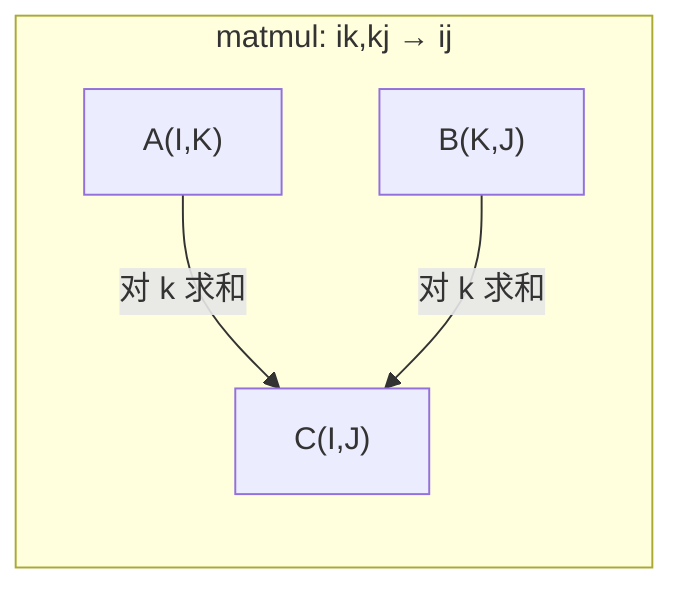

# 张量运算

> 张量是数据与深度学习之间的通用语言。每张图像、每个句子、每个梯度都流经它们。

**类型：** 构建
**语言：** Python
**前置要求：** Phase 1, Lessons 01（线性代数直觉）、02（向量与矩阵运算）
**时间：** ~90 分钟

## 学习目标

- 从头实现一个带有 shape、strides、reshape、transpose 和逐元素运算的张量类
- 应用广播规则在形状不同的张量上进行运算，无需复制数据
- 编写 einsum 表达式实现点积、矩阵乘法、外积和批处理运算
- 追踪多头注意力每一步的精确张量形状

## 问题

你构建了一个 transformer。前向传播看起来没问题。你运行它，得到：`RuntimeError: mat1 and mat2 shapes cannot be multiplied (32x768 and 512x768)`。你盯着形状。你试了试转置。现在它说 `Expected 4D input (got 3D input)`。你加了个 unsqueeze。又有别的东西坏了。

形状错误是深度学习代码中最常见的错误。它们在概念上并不难 —— 每个操作都有一个形状契约 —— 但它们会迅速累积。一个 transformer 有数十个 reshape、transpose 和 broadcast 链在一起。一个轴错了，错误就会级联。更糟糕的是，有些形状错误根本不会抛出错误。它们会通过沿错误的维度广播或在错误的轴上求和，无声地产生垃圾结果。

矩阵处理两组事物之间的成对关系。但真实数据不适用于两个维度。一批 32 张 224×224 的 RGB 图像是一个 4D 张量：`(32, 3, 224, 224)`。具有 12 个头的自注意力也是 4D：`(batch, heads, seq_len, head_dim)`。你需要一种数据结构来推广到任意数量的维度，且其运算能在所有维度上整洁地组合。这种结构就是张量。掌握它的运算后，形状错误就变得容易调试了。

## 概念

### 什么是张量

张量是一个多维度、均匀数据类型的数字数组。维度的数量称为**阶**（rank/order）。每个维度是一个**轴**。**形状**是一个元组，列出每个轴的大小。



总元素数 = 所有大小的乘积。形状 `(2, 3, 4)` 包含 `2 × 3 × 4 = 24` 个元素。

### 深度学习中的张量形状

不同类型的数据按约定映射到特定的张量形状。



PyTorch 使用 NCHW（通道在前）。TensorFlow 默认 NHWC（通道在后）。布局不匹配会导致无声的性能下降或错误。

### 内存布局如何工作

内存中的 2D 数组是一个一维字节序列。**步长（strides）** 告诉你沿着每个轴移动一步需要跳过多少个元素。



转置不移动数据。它交换步长，使张量变为**非连续（non-contiguous）** —— 某一行的元素在内存中不再相邻。

### 广播规则

广播让你可以在不同形状的张量上进行运算而无需复制数据。从右边对齐形状。两个维度在它们相等或其中一个为 1 时兼容。更少的维度在左侧用 1 填充。

```
张量 A：     (8, 1, 6, 1)
张量 B：        (7, 1, 5)
填充后 B：   (1, 7, 1, 5)
结果：       (8, 7, 6, 5)
```

### Einsum：通用张量运算

爱因斯坦求和约定用字母标记每个轴。输入中有但输出中没有的轴会被求和。两者中都有的则保留。



关键模式：`i,i→`（点积），`i,j→ij`（外积），`ii→`（迹），`ij→ji`（转置），`bij,bjk→bik`（批处理矩阵乘法），`bhtd,bhsd→bhts`（注意力分数）。

```figure
tensor-broadcast
```

## 动手实现

代码在 `code/tensors.py` 中。每一步都引用该文件的实现。

### 步骤 1：张量存储和步长

张量存储一个扁平的数字列表及形状元数据。步长告诉索引逻辑如何将多维索引映射到扁平位置。

```python
class Tensor:
    def __init__(self, data, shape=None):
        if isinstance(data, (list, tuple)):
            self._data, self._shape = self._flatten_nested(data)
        elif isinstance(data, np.ndarray):
            self._data = data.flatten().tolist()
            self._shape = tuple(data.shape)
        else:
            self._data = [data]
            self._shape = ()

        if shape is not None:
            total = reduce(lambda a, b: a * b, shape, 1)
            if total != len(self._data):
                raise ValueError(
                    f"无法将 {len(self._data)} 个元素重塑为形状 {shape}"
                )
            self._shape = tuple(shape)

        self._strides = self._compute_strides(self._shape)

    @staticmethod
    def _compute_strides(shape):
        if len(shape) == 0:
            return ()
        strides = [1] * len(shape)
        for i in range(len(shape) - 2, -1, -1):
            strides[i] = strides[i + 1] * shape[i + 1]
        return tuple(strides)
```

对于形状 `(3, 4)`，步长是 `(4, 1)` —— 跳 4 个元素前进一行，跳 1 个元素前进一列。

### 步骤 2：Reshape、squeeze、unsqueeze

Reshape 在不改变元素顺序的情况下改变形状。总元素数必须保持不变。使用 `-1` 让一个维度自动推断大小。

```python
t = Tensor(list(range(12)), shape=(2, 6))
r = t.reshape((3, 4))
r = t.reshape((-1, 3))
```

Squeeze 移除大小为 1 的轴。Unsqueeze 插入一个大小为 1 的轴。Unsqueeze 对广播至关重要 —— 加到批 `(B, T, D)` 上的偏置向量 `(D,)` 需要 unsqueeze 为 `(1, 1, D)`。

```python
t = Tensor(list(range(6)), shape=(1, 3, 1, 2))
s = t.squeeze()
v = Tensor([1, 2, 3])
u = v.unsqueeze(0)
```

### 步骤 3：Transpose 和 permute

Transpose 交换两个轴。Permute 重新排序所有轴。这就是你如何在 NCHW 和 NHWC 之间转换。

```python
mat = Tensor(list(range(6)), shape=(2, 3))
tr = mat.transpose(0, 1)

t4d = Tensor(list(range(24)), shape=(1, 2, 3, 4))
perm = t4d.permute((0, 2, 3, 1))
```

在 transpose 或 permute 之后，张量在内存中变为非连续的。在 PyTorch 中，`view` 在非连续张量上会失败 —— 改用 `reshape` 或先调用 `.contiguous()`。

### 步骤 4：逐元素运算和约简

逐元素运算（add、multiply、subtract）独立应用于每个元素并保持形状。约简（sum、mean、max）折叠一个或多个轴。

```python
a = Tensor([[1, 2], [3, 4]])
b = Tensor([[10, 20], [30, 40]])
c = a + b
d = a * 2
s = a.sum(axis=0)
```

CNN 中的全局平均池化：`(B, C, H, W).mean(axis=[2, 3])` 产生 `(B, C)`。NLP 中的序列平均池化：`(B, T, D).mean(axis=1)` 产生 `(B, D)`。

### 步骤 5：使用 NumPy 进行广播

`tensors.py` 中的 `demo_broadcasting_numpy()` 函数展示了核心模式。

```python
activations = np.random.randn(4, 3)
bias = np.array([0.1, 0.2, 0.3])
result = activations + bias

images = np.random.randn(2, 3, 4, 4)
scale = np.array([0.5, 1.0, 1.5]).reshape(1, 3, 1, 1)
result = images * scale

a = np.array([1, 2, 3]).reshape(-1, 1)
b = np.array([10, 20, 30, 40]).reshape(1, -1)
outer = a * b
```

通过广播计算成对距离：将 `(M, 2)` reshape 为 `(M, 1, 2)`，`(N, 2)` 为 `(1, N, 2)`，相减，沿最后一轴平方求和，取平方根。结果：`(M, N)`。

### 步骤 6：Einsum 运算

`demo_einsum()` 和 `demo_einsum_gallery()` 函数遍历了每种常见模式。

```python
a = np.array([1.0, 2.0, 3.0])
b = np.array([4.0, 5.0, 6.0])
dot = np.einsum("i,i->", a, b)

A = np.array([[1, 2], [3, 4], [5, 6]], dtype=float)
B = np.array([[7, 8, 9], [10, 11, 12]], dtype=float)
matmul = np.einsum("ik,kj->ij", A, B)

batch_A = np.random.randn(4, 3, 5)
batch_B = np.random.randn(4, 5, 2)
batch_mm = np.einsum("bij,bjk->bik", batch_A, batch_B)
```

收缩的计算成本是所有索引大小的乘积（保留的和求和的）。对于 `bij,bjk→bik`，B=32, I=128, J=64, K=128：`32 × 128 × 64 × 128 = 33,554,432` 次乘加运算。

### 步骤 7：通过 einsum 实现注意力机制

`demo_attention_einsum()` 函数端到端地实现了多头注意力。

```python
B, H, T, D = 2, 4, 8, 16
E = H * D

X = np.random.randn(B, T, E)
W_q = np.random.randn(E, E) * 0.02

Q = np.einsum("bte,ek->btk", X, W_q)
Q = Q.reshape(B, T, H, D).transpose(0, 2, 1, 3)

scores = np.einsum("bhtd,bhsd->bhts", Q, K) / np.sqrt(D)
weights = softmax(scores, axis=-1)
attn_output = np.einsum("bhts,bhsd->bhtd", weights, V)

concat = attn_output.transpose(0, 2, 1, 3).reshape(B, T, E)
output = np.einsum("bte,ek->btk", concat, W_o)
```

每一步都是一个张量运算：投影（通过 einsum 做矩阵乘法）、头分割（reshape + transpose）、注意力分数（通过 einsum 做批处理矩阵乘法）、加权和（通过 einsum 做批处理矩阵乘法）、头合并（transpose + reshape）、输出投影（通过 einsum 做矩阵乘法）。

## 使用现成库

### 手写 vs NumPy

| 运算 | 手写（Tensor 类） | NumPy |
|---|---|---|
| 创建 | `Tensor([[1,2],[3,4]])` | `np.array([[1,2],[3,4]])` |
| Reshape | `t.reshape((3,4))` | `a.reshape(3,4)` |
| Transpose | `t.transpose(0,1)` | `a.T` 或 `a.transpose(0,1)` |
| Squeeze | `t.squeeze(0)` | `np.squeeze(a, 0)` |
| Sum | `t.sum(axis=0)` | `a.sum(axis=0)` |
| Einsum | N/A | `np.einsum("ij,jk->ik", a, b)` |

### 手写 vs PyTorch

```python
import torch

t = torch.tensor([[1, 2, 3], [4, 5, 6]], dtype=torch.float32)
t.shape
t.stride()
t.is_contiguous()

t.reshape(3, 2)
t.unsqueeze(0)
t.transpose(0, 1)
t.transpose(0, 1).contiguous()

torch.einsum("ik,kj->ij", A, B)
```

PyTorch 增加了 autograd、GPU 支持和优化的 BLAS 内核。形状语义是相同的。如果你理解手写版本，PyTorch 的形状错误就变得可读了。

### 每个神经网络层作为张量运算

| 运算 | 张量形式 | Einsum |
|---|---|---|
| 线性层 | `Y = X @ W.T + b` | `"bd,od→bo"` + bias |
| 注意力 QKV | `Q = X @ W_q` | `"btd,dh→bth"` |
| 注意力分数 | `Q @ K.T / sqrt(d)` | `"bhtd,bhsd→bhts"` |
| 注意力输出 | `softmax(scores) @ V` | `"bhts,bhsd→bhtd"` |
| 批归一化 | `(X - mu) / sigma × gamma` | 逐元素 + broadcast |
| Softmax | `exp(x) / sum(exp(x))` | 逐元素 + reduction |

## 产出

本课程产出两个可复用的提示词：

1. **`outputs/prompt-tensor-shapes.md`** —— 一个用于调试张量形状不匹配的系统化提示词。包含每个常见操作（matmul、broadcast、cat、Linear、Conv2d、BatchNorm、softmax）的决策表和一个修复查找表。

2. **`outputs/prompt-tensor-debugger.md`** —— 一个分步调试提示词，当形状错误阻碍你时将其粘贴到任何 AI 助手中。提供错误信息和张量形状，获取精确的修复方案。

## 练习

1. **简单 —— Reshape 往返。** 取一个形状为 `(2, 3, 4)` 的张量。将其重塑为 `(6, 4)`，然后 `(24,)`，再回到 `(2, 3, 4)`。通过打印扁平数据验证每一步的元素顺序是否保留。

2. **中等 —— 实现广播。** 为 `Tensor` 类扩展一个 `broadcast_to(shape)` 方法，将大小为 1 的维度扩展以匹配目标形状。然后修改 `_elementwise_op` 在运算前自动广播。用形状 `(3, 1)` 和 `(1, 4)` 产生 `(3, 4)` 进行测试。

3. **困难 —— 从零构建 einsum。** 实现一个基本的 `einsum(subscripts, *tensors)` 函数，至少处理：点积（`i,i→`）、矩阵乘法（`ij,jk→ik`）、外积（`i,j→ij`）和转置（`ij→ji`）。解析下标字符串，识别收缩索引，并遍历所有索引组合。将结果与 `np.einsum` 比较。

4. **困难 —— 注意力形状追踪器。** 编写一个函数，接收 `batch_size`、`seq_len`、`embed_dim` 和 `num_heads` 作为输入，打印多头注意力每一步的精确形状：输入、Q/K/V 投影、头分割、注意力分数、softmax 权重、加权和、头合并、输出投影。对照 `demo_attention_einsum()` 的输出验证。

## 关键术语

| 术语 | 人们说的 | 实际含义 |
|---|---|---|
| 张量 | "比矩阵更多维度" | 具有统一类型和定义的形状、步长及运算的多维数组 |
| 阶 | "维度的数量" | 轴的数量。矩阵的阶为 2，不等于其矩阵秩 |
| 形状 | "张量的大小" | 列出每个轴大小的元组。`(2, 3)` 表示 2 行、3 列 |
| 步长 | "内存如何布局" | 沿每个轴前进一个位置需要跳过的元素数 |
| 广播 | "形状不同时它也能工作" | 一组严格的规则：从右对齐，维度必须相等或一方为 1 |
| 连续 | "张量是正常的" | 元素按逻辑布局的顺序连续存储在内存中，没有间隙或重排 |
| Einsum | "写 matmul 的花哨方式" | 用一种通用符号在一行中表达任何张量收缩、外积、迹或转置 |
| View | "同 reshape" | 共享同一内存缓冲区但具有不同形状/步长元数据的张量。在非连续数据上会失败 |
| 收缩 | "对索引求和" | 张量间的共享索引被相乘并求和的通用运算，产生更低阶的结果 |
| NCHW / NHWC | "PyTorch vs TensorFlow 格式" | 图像张量的内存布局约定。NCHW 将通道放在空间维度前，NHWC 将其放在后面 |

## 延伸阅读

- [NumPy Broadcasting](https://numpy.org/doc/stable/user/basics.broadcasting.html) —— 带有可视化示例的规范规则
- [PyTorch Tensor Views](https://pytorch.org/docs/stable/tensor_view.html) —— 何时 view 工作以及何时复制
- [einops](https://github.com/arogozhnikov/einops) —— 使张量重塑可读且安全的库
- [The Illustrated Transformer](https://jalammar.github.io/illustrated-transformer/) —— 可视化流经注意力的张量形状
- [Einstein Summation in NumPy](https://numpy.org/doc/stable/reference/generated/numpy.einsum.html) —— 带示例的完整 einsum 文档
