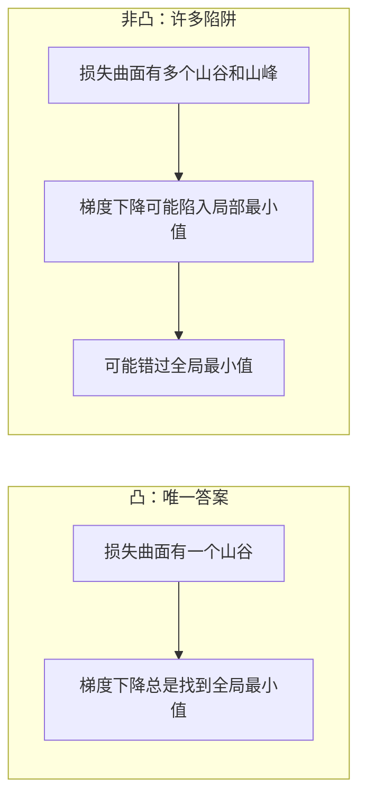
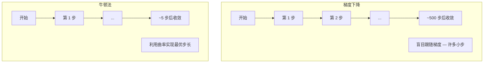
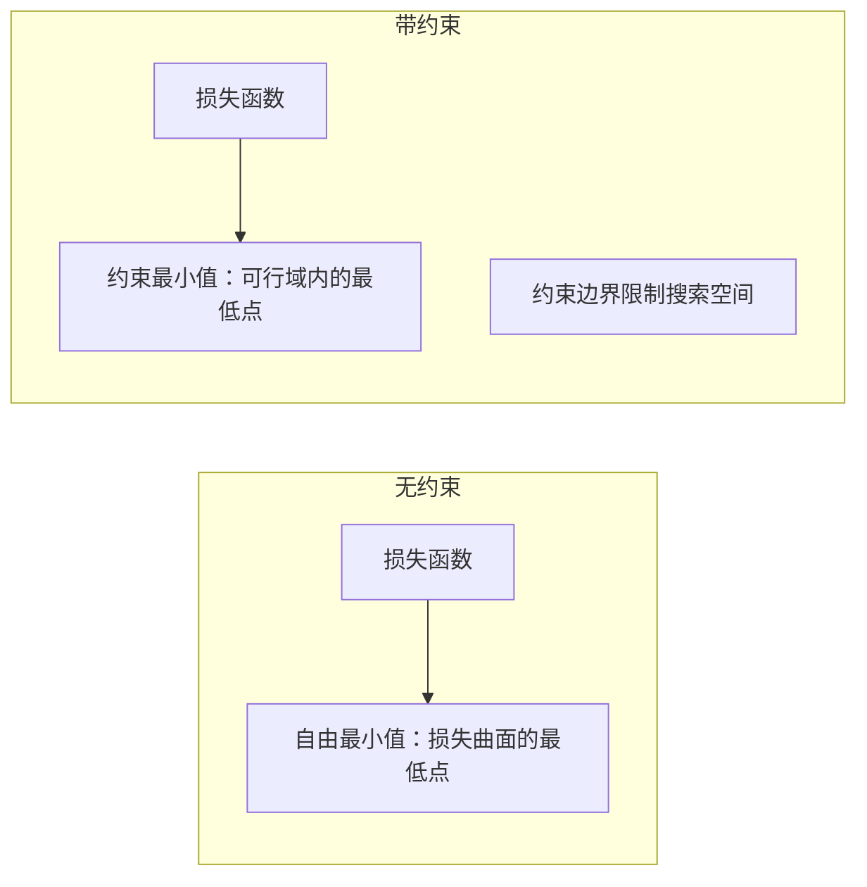
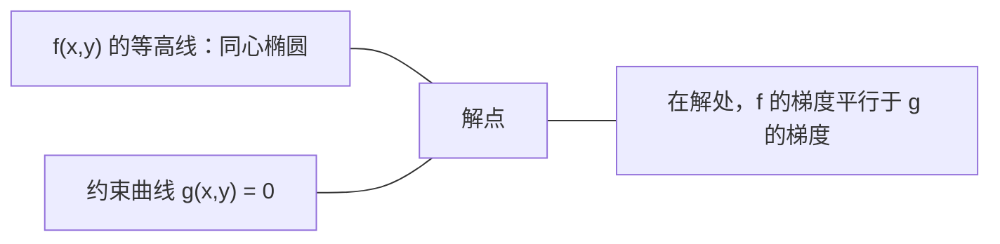

# 凸优化

> 凸问题只有一个山谷。神经网络有数百万个。知道区别很重要。

**类型：** 构建
**语言：** Python
**前置知识：** 阶段 1，课程 04（ML 微积分）、08（优化）
**时间：** ~90 分钟

## 学习目标

- 使用定义、二阶导数和 Hessian 矩阵准则检验函数是否为凸函数
- 实现牛顿法并将其二次收敛与梯度下降进行比较
- 使用拉格朗日乘子法求解约束优化问题，并解释 KKT 条件
- 解释为什么神经网络损失景观是非凸的，但 SGD 仍然能找到好的解

## 问题

课程 08 教你梯度下降、动量和 Adam。那些优化器在任何表面上都能下山。但它们没有任何保证。非凸景观上的梯度下降可能落在坏的局部最小值、卡在鞍点上或永远振荡。你仍然用了它们，因为神经网络是非凸的，没有其他选择。

但机器学习中的许多问题是凸的。线性回归、逻辑回归、SVM、LASSO、岭回归。对于这些问题，存在更强的东西：有数学保证的优化。凸问题只有一个山谷。任何下山的算法都会到达全局最小值。不需要重新启动。不需要学习率计划。不需要祈祷。

理解凸性做三件事。第一，它告诉你你的问题是容易的（凸）还是困难的（非凸）。第二，它为你提供了牛顿法等更快的工具来处理凸问题。第三，它解释了 ML 中出现的概念：作为约束的正则化、SVM 中的对偶性，以及深度学习尽管违反了凸性给你的所有优良性质却仍然有效的原因。

## 概念

### 凸集

集合 S 是凸集，如果对于 S 中的任意两点，它们之间的线段也完全位于 S 中。

| 凸集 | 非凸集 |
|------|--------|
| **矩形**：内部任意两点间的线段都保持在内部 | **星形/月牙形**：两个内点之间的线段可能穿出集合 |
| **三角形**：对所有内点都成立相同性质 | **甜甜圈/环面**：孔洞使某些线段穿出集合 |
| 任意两点间的线段都保持在集合内 | 某些点对间的线段会穿出集合 |

正规定义：对于 S 中的任意点 x、y 和 [0, 1] 中的任意 t，点 tx + (1-t)y 也在 S 中。

凸集的例子：
- 直线、平面、整个 R^n
- 球体（圆、球、超球）
- 半空间：{x : a^T x <= b}
- 任意多个凸集的交集

非凸集的例子：
- 甜甜圈（环面）
- 两个不相交圆的并集
- 任何有"凹陷"或"孔洞"的集合

### 凸函数

函数 f 是凸函数，如果其定义域是凸集，且对于定义域中的任意两点 x、y 和 [0, 1] 中的任意 t：

```
f(tx + (1-t)y) <= t*f(x) + (1-t)*f(y)
```

几何意义：图形上任意两点之间的线段位于图形之上或与图形重合。

| 性质 | 凸函数 | 非凸函数 |
|------|--------|----------|
| **线段测试** | 图形上任意两点间的线段在**曲线上方或重合** | 图形上某些点间的线段会**低于**曲线 |
| **形状** | 单一的碗/谷，向上弯曲 | 多个峰和谷，曲率混合 |
| **局部最小值** | 每个局部最小值就是全局最小值 | 可能存在多个不同高度的局部最小值 |

常见的凸函数：
- f(x) = x^2（抛物线）
- f(x) = |x|（绝对值）
- f(x) = e^x（指数函数）
- f(x) = max(0, x)（ReLU，虽然是分段线性）
- f(x) = -log(x) 其中 x > 0（负对数）
- 任何线性函数 f(x) = a^T x + b（既是凸函数也是凹函数）

### 检验凸性

三种实用的检验方法，从最简单到最严格。

**检验 1：二阶导数检验（一维）。** 如果对于所有 x 有 f''(x) >= 0，那么 f 是凸函数。

- f(x) = x^2：f''(x) = 2 >= 0。凸函数。
- f(x) = x^3：f''(x) = 6x。当 x < 0 时为负。不是凸函数。
- f(x) = e^x：f''(x) = e^x > 0。凸函数。

**检验 2：Hessian 矩阵检验（多变量）。** 如果对于所有 x，Hessian 矩阵 H(x) 是半正定的，那么 f 是凸函数。Hessian 矩阵是二阶偏导数的矩阵。

**检验 3：定义检验。** 直接检验不等式 f(tx + (1-t)y) <= t*f(x) + (1-t)*f(y)。适用于导数难以计算的函数。

### 为什么凸性重要

凸优化的中心定理：

**对于凸函数，每个局部最小值都是全局最小值。**

这意味着梯度下降不会被卡住。任何下山路径都通向相同的答案。该算法保证收敛到最优解。



推论：
- 不需要随机重启
- 不需要复杂的学习率计划
- 可以证明收敛性（速度取决于函数性质）
- 解是唯一的（在不考虑平坦区域的情况下）

### ML 中的凸与非凸

| 问题 | 凸？ | 原因 |
|------|------|------|
| 线性回归（MSE） | 是 | 损失在权重上是二次的 |
| 逻辑回归 | 是 | 对数损失在权重上是凸的 |
| SVM（合页损失） | 是 | 线性函数的最大值 |
| LASSO（L1 回归） | 是 | 凸函数之和仍是凸的 |
| 岭回归（L2） | 是 | 二次 + 二次 = 凸 |
| 神经网络（任何损失） | 否 | 非线性激活函数产生非凸景观 |
| k-means 聚类 | 否 | 离散分配步骤 |
| 矩阵分解 | 否 | 未知数的乘积 |

具有凸损失的线性模型是凸的。一旦你添加了具有非线性激活函数的隐藏层，凸性就被打破了。

### Hessian 矩阵

函数 f: R^n -> R 的 Hessian 矩阵 H 是 n x n 的二阶偏导数矩阵。

```
H[i][j] = d^2 f / (dx_i dx_j)
```

对于 f(x, y) = x^2 + 3xy + y^2：

```
df/dx = 2x + 3y       d^2f/dx^2 = 2      d^2f/dxdy = 3
df/dy = 3x + 2y       d^2f/dydx = 3      d^2f/dy^2 = 2

H = [ 2  3 ]
    [ 3  2 ]
```

Hessian 矩阵告诉你曲率信息：
- 特征值全为正：函数在所有方向上都向上弯曲（在该点凸）
- 特征值全为负：在所有方向上都向下弯曲（凹，局部最大值）
- 符号混合：鞍点（在某些方向上向上弯曲，在其他方向上向下弯曲）
- 特征值为零：在该方向上平坦（退化）

对于凸性，Hessian 矩阵必须在所有点上都是半正定（所有特征值 >= 0），而不仅仅是在某一点上。

### 牛顿法

梯度下降使用一阶信息（梯度）。牛顿法使用二阶信息（Hessian 矩阵）。它在当前点拟合一个二次近似，然后直接跳到该二次近似的极小点。

```
更新规则：
  x_new = x - H^(-1) * 梯度

与梯度下降比较：
  x_new = x - lr * 梯度
```

牛顿法用逆 Hessian 矩阵替换了标量学习率。这根据局部曲率自动调整步长和方向。



优点：
- 在最小值附近二次收敛（误差每一步平方）
- 无需调整学习率
- 尺度不变性（无论你如何参数化问题都有效）

缺点：
- 计算 Hessian 矩阵需要 O(n^2) 内存和 O(n^3) 求逆时间
- 对于具有 100 万个权重的神经网络，那是 10^12 个条目和 10^18 次操作
- 对深度学习不实用

### 约束优化

无约束优化：在所有 x 上最小化 f(x)。
约束优化：在约束条件下最小化 f(x)。

现实问题都有约束。你想要最小化成本，但预算有限。你想要最小化误差，但模型复杂度有限。



### 拉格朗日乘子法

拉格朗日乘子法将约束问题转化为无约束问题。

问题：在约束 g(x) = 0 下最小化 f(x)。

解法：引入一个新变量（拉格朗日乘子 lambda）并求解无约束问题：

```
L(x, lambda) = f(x) + lambda * g(x)
```

在解处，L 的梯度为零：

```
dL/dx = df/dx + lambda * dg/dx = 0
dL/dlambda = g(x) = 0
```

几何直觉：在约束最小值处，f 的梯度必须平行于约束 g 的梯度。如果它们不平行，你可以沿着约束曲面移动并进一步减小 f。



示例：在约束 x + y = 1 下最小化 f(x,y) = x^2 + y^2。

```
L = x^2 + y^2 + lambda(x + y - 1)

dL/dx = 2x + lambda = 0  =>  x = -lambda/2
dL/dy = 2y + lambda = 0  =>  y = -lambda/2
dL/dlambda = x + y - 1 = 0

从前两个式子得到：x = y
代入：2x = 1，所以 x = y = 0.5，lambda = -1
```

直线 x + y = 1 上离原点最近的点是 (0.5, 0.5)。

### KKT 条件

Karush-Kuhn-Tucker 条件将拉格朗日乘子法推广到不等式约束。

问题：在 g_i(x) <= 0，i = 1, ..., m 的约束下最小化 f(x)。

KKT 条件（最优性的必要条件）：

```
1. 平稳性：    df/dx + sum(lambda_i * dg_i/dx) = 0
2. 原始可行性：  g_i(x) <= 0  对所有 i
3. 对偶可行性：  lambda_i >= 0  对所有 i
4. 互补松弛性：  lambda_i * g_i(x) = 0  对所有 i
```

互补松弛性是关键洞察：要么约束是活动的（g_i = 0，解在边界上），要么乘子为零（该约束无关紧要）。不影响解的约束对应 lambda = 0。

KKT 条件是 SVM 的核心。支持向量是那些约束为活动（lambda > 0）的数据点。所有其他数据点的 lambda = 0，不影响决策边界。

### 正则化作为约束优化

L1 和 L2 正则化不是随意的技巧。它们是经过伪装的约束优化问题。

**L2 正则化（Ridge）：**

```
最小化  Loss(w)  约束条件  ||w||^2 <= t

等价的无约束形式：
最小化  Loss(w) + lambda * ||w||^2
```

约束 ||w||^2 <= t 定义了一个球体（二维中是圆，三维中是球）。解是损失等高线第一次碰到这个球体的地方。

**L1 正则化（LASSO）：**

```
最小化  Loss(w)  约束条件  ||w||_1 <= t

等价的无约束形式：
最小化  Loss(w) + lambda * ||w||_1
```

约束 ||w||_1 <= t 定义了一个菱形（二维中是旋转的正方形）。

| 性质 | L2 约束（圆） | L1 约束（菱形） |
|------|-------------|----------------|
| **约束形状** | 圆形（更高维是球体） | 菱形（二维中是旋转正方形） |
| **损失等高线接触位置** | 光滑边界 — 圆上的任意点 | 角 — 与坐标轴对齐 |
| **解的行为** | 权重很小但不为零 | 某些权重恰好为零（稀疏） |
| **结果** | 权重收缩 | 特征选择 |

这解释了为什么 L1 产生稀疏模型（特征选择），而 L2 只收缩权重。菱形有与坐标轴对齐的角。损失等高线更有可能碰到角，使一个或多个权重恰好为零。

### 对偶性

每个约束优化问题（原始问题）都有一个伴随问题（对偶问题）。对于凸问题，原始问题和对偶问题具有相同的最优值。这就是强对偶性。

拉格朗日对偶函数：

```
原始问题：在 g(x) <= 0 约束下最小化 f(x)
拉格朗日函数：L(x, lambda) = f(x) + lambda * g(x)
对偶函数：d(lambda) = min_x L(x, lambda)
对偶问题：在 lambda >= 0 约束下最大化 d(lambda)
```

为什么对偶性重要：
- 对偶问题有时比原始问题更容易求解
- SVM 在其对偶形式中求解，其中问题取决于数据点之间的点积（这使得核技巧成为可能）
- 对偶提供了原始最优值的下界，可用于检查解的质量

具体对于 SVM：

```
原始问题：找到最大化间隔 2/||w|| 的 w, b，满足
        y_i(w^T x_i + b) >= 1  对所有 i

对偶问题：最大化 sum(alpha_i) - 0.5 * sum_ij(alpha_i * alpha_j * y_i * y_j * x_i^T x_j)
        满足 alpha_i >= 0 且 sum(alpha_i * y_i) = 0

对偶问题只涉及点积 x_i^T x_j。
将 x_i^T x_j 替换为 K(x_i, x_j) 就得到了核技巧。
```

### 为什么深度学习尽管非凸却仍然有效

神经网络损失函数是严重非凸的。按照所有经典度量，优化它们应该失败。然而随机梯度下降可靠地找到了好的解。有几个因素可以解释这一点。

**大多数局部最小值已经足够好。** 在高维空间中，随机临界点（梯度为零的点）绝大多数是鞍点，而不是局部最小值。少数存在的局部最小值的损失值往往接近全局最小值。当参数空间有数百万个维度时，陷入一个糟糕的局部最小值是极不可能的。

**鞍点，而不是局部最小值，才是真正的障碍。** 在具有 n 个参数的函数中，鞍点具有正负曲率方向的混合。对于高维中的随机临界点，所有 n 个特征值都为正（局部最小值）的概率大约为 2^(-n)。几乎所有临界点都是鞍点。SGD 的噪声帮助逃离它们。

**过参数化使景观更平滑。** 参数多于训练样本的网络具有更平滑、更连通的损失曲面。更宽的网络具有更少的坏局部最小值。这与直觉相反，但经验上是一致的。

**损失景观结构：**

| 性质 | 低维空间 | 高维空间 |
|------|---------|---------|
| **景观** | 许多孤立的峰和谷 | 平滑连接的山谷 |
| **最小值** | 许多孤立的局部最小值 | 少数坏的局部最小值；大多数接近最优 |
| **导航** | 难以找到全局最小值 | 许多路径通向好的解 |
| **临界点** | 局部最小值和鞍点的混合 | 绝大多数是鞍点，不是局部最小值 |

**随机噪声充当隐式正则化。** 小批量 SGD 添加噪声，防止收敛到尖锐的最小值。尖锐的最小值过拟合；平坦的最小值泛化更好。噪声使优化偏向损失景观中的平坦区域。

### 二阶方法在实践中

纯牛顿法对于大型模型不实用。几种近似使二阶信息可用。

**L-BFGS（有限内存 BFGS）：** 使用最后 m 个梯度差来近似逆 Hessian 矩阵。需要 O(mn) 内存而不是 O(n^2)。适用于最多约 10,000 个参数的问题。用于经典 ML（逻辑回归、CRF），但不用于深度学习。

**自然梯度：** 使用 Fisher 信息矩阵（对数似然的期望 Hessian）而不是标准 Hessian。这考虑了概率分布的几何结构。K-FAC（克罗内克因子近似曲率）将 Fisher 矩阵近似为克罗内克积，使其对神经网络实用。

**无 Hessian 优化：** 使用共轭梯度求解 Hx = g 而无需显式构造 H。只需要 Hessian-向量积，可以通过自动微分在 O(n) 时间内计算。

**对角近似：** Adam 的二阶矩是 Hessian 矩阵对角线的对角近似。AdaHessian 通过 Hutchinson 估计量使用实际的 Hessian 对角线元素来扩展这一点。

| 方法 | 内存 | 每步代价 | 何时使用 |
|------|------|---------|---------|
| 梯度下降 | O(n) | O(n) | 基线，大型模型 |
| 牛顿法 | O(n^2) | O(n^3) | 小型凸问题 |
| L-BFGS | O(mn) | O(mn) | 中型凸问题 |
| Adam | O(n) | O(n) | 深度学习默认 |
| K-FAC | O(n) | O(n) 每层 | 研究，大批量训练 |

```figure
convex-vs-nonconvex
```

## 构建它

### 第 1 步：凸性检验器

构建一个函数，通过采样点并检验定义来经验性地测试凸性。

```python
import random
import math

def check_convexity(f, dim, bounds=(-5, 5), samples=1000):
    violations = 0
    for _ in range(samples):
        x = [random.uniform(*bounds) for _ in range(dim)]
        y = [random.uniform(*bounds) for _ in range(dim)]
        t = random.uniform(0, 1)
        mid = [t * xi + (1 - t) * yi for xi, yi in zip(x, y)]
        lhs = f(mid)
        rhs = t * f(x) + (1 - t) * f(y)
        if lhs > rhs + 1e-10:
            violations += 1
    return violations == 0, violations
```

### 第 2 步：二维牛顿法

使用显式 Hessian 矩阵实现牛顿法。比较收敛速度与梯度下降。

```python
def newtons_method(f, grad_f, hessian_f, x0, steps=50, tol=1e-12):
    x = list(x0)
    history = [x[:]]
    for _ in range(steps):
        g = grad_f(x)
        H = hessian_f(x)
        det = H[0][0] * H[1][1] - H[0][1] * H[1][0]
        if abs(det) < 1e-15:
            break
        H_inv = [
            [H[1][1] / det, -H[0][1] / det],
            [-H[1][0] / det, H[0][0] / det],
        ]
        dx = [
            H_inv[0][0] * g[0] + H_inv[0][1] * g[1],
            H_inv[1][0] * g[0] + H_inv[1][1] * g[1],
        ]
        x = [x[0] - dx[0], x[1] - dx[1]]
        history.append(x[:])
        if sum(gi ** 2 for gi in g) < tol:
            break
    return history
```

### 第 3 步：拉格朗日乘子求解器

使用对拉格朗日函数的梯度下降求解约束优化。

```python
def lagrange_solve(f_grad, g_val, g_grad, x0, lr=0.01,
                   lr_lambda=0.01, steps=5000):
    x = list(x0)
    lam = 0.0
    history = []
    for _ in range(steps):
        fg = f_grad(x)
        gv = g_val(x)
        gg = g_grad(x)
        x = [
            xi - lr * (fgi + lam * ggi)
            for xi, fgi, ggi in zip(x, fg, gg)
        ]
        lam = lam + lr_lambda * gv
        history.append((x[:], lam, gv))
    return history
```

### 第 4 步：对比一阶与二阶方法

在同一二次函数上运行梯度下降和牛顿法。统计收敛所需的步数。

```python
def quadratic(x):
    return 5 * x[0] ** 2 + x[1] ** 2

def quadratic_grad(x):
    return [10 * x[0], 2 * x[1]]

def quadratic_hessian(x):
    return [[10, 0], [0, 2]]
```

牛顿法将在 1 步内收敛（对于二次函数它是精确的）。梯度下降需要数百步，因为 Hessian 矩阵的特征值相差 5 倍，产生了一个狭长的山谷。

## 使用它

凸性分析在选择 ML 模型和求解器时直接适用。

对于凸问题（逻辑回归、SVM、LASSO）：
- 使用专门的求解器（liblinear、CVXPY、scipy.optimize.minimize 使用 method='L-BFGS-B'）
- 期望唯一的全局解
- 二阶方法实用且快速

对于非凸问题（神经网络）：
- 使用一阶方法（SGD、Adam）
- 接受解依赖于初始化和随机性
- 使用过参数化、噪声和学习率计划作为隐式正则化
- 不要浪费时间寻找全局最小值。一个好的局部最小值就足够了。

```python
from scipy.optimize import minimize

result = minimize(
    fun=lambda w: sum((y - X @ w) ** 2) + 0.1 * sum(w ** 2),
    x0=np.zeros(d),
    method='L-BFGS-B',
    jac=lambda w: -2 * X.T @ (y - X @ w) + 0.2 * w,
)
```

对于 SVM，对偶公式让你使用核技巧：

```python
from sklearn.svm import SVC

svm = SVC(kernel='rbf', C=1.0)
svm.fit(X_train, y_train)
print(f"支持向量: {svm.n_support_}")
```

## 练习

1. **凸性画廊。** 使用检验器测试以下函数的凸性：f(x) = x^4、f(x) = sin(x)、f(x,y) = x^2 + y^2、f(x,y) = x*y、f(x) = max(x, 0)。解释为什么每个结果是有意义的。

2. **牛顿法 vs 梯度下降竞赛。** 从起点 (10, 10) 开始，两种方法都运行在 f(x,y) = 50*x^2 + y^2 上。每种方法需要多少步才能达到 loss < 1e-10？当条件数（Hessian 矩阵最大与最小特征值之比）增加时，梯度下降会怎样？

3. **拉格朗日乘子几何。** 在约束 x + 2y = 4 下最小化 f(x,y) = (x-3)^2 + (y-3)^2。通过检查在解处 f 的梯度是否平行于 g 的梯度来验证解。

4. **正则化约束。** 实现 L1 约束优化：在约束 |x| + |y| <= 1 下最小化 (x-3)^2 + (y-2)^2。证明解有一个坐标为零（菱形约束带来的稀疏性）。

5. **Hessian 矩阵特征值分析。** 计算 Rosenbrock 函数在 (1,1) 和 (-1,1) 处的 Hessian 矩阵。计算两个点的特征值。特征值告诉你关于最小值处与远离最小值处的曲率分别说明了什么？

## 关键术语

| 术语 | 含义 |
|------|------|
| 凸集 | 集合中任意两点间的线段保持在集合内的集合 |
| 凸函数 | 图形上任意两点间的线段位于图形之上或与之重合的函数。等价地，Hessian 矩阵处处半正定 |
| 局部最小值 | 比所有附近点都低的点。对于凸函数，每个局部最小值都是全局最小值 |
| 全局最小值 | 函数在其整个定义域上的最低点 |
| Hessian 矩阵 | 所有二阶偏导数的矩阵。编码曲率信息 |
| 半正定 | 特征值全为非负的矩阵。"二阶导数 >= 0"的多维类比 |
| 条件数 | Hessian 矩阵最大与最小特征值之比。高条件数意味着狭长的山谷和缓慢的梯度下降 |
| 牛顿法 | 使用逆 Hessian 矩阵确定步长和方向的二阶优化器。在最小值附近二次收敛 |
| 拉格朗日乘子 | 为将约束优化问题转化为无约束问题而引入的变量 |
| KKT 条件 | 带不等式约束的最优性的必要条件。推广了拉格朗日乘子法 |
| 互补松弛性 | 在解处，要么约束是活动的，要么其乘子为零。两者不会同时非零 |
| 对偶性 | 每个约束问题都有一个伴随的对偶问题。对于凸问题，两者具有相同的最优值 |
| 强对偶性 | 原始和对偶最优值相等。对于满足 Slater 条件的凸问题成立 |
| L-BFGS | 近似二阶方法，存储最后 m 个梯度差而不是完整的 Hessian 矩阵 |
| 鞍点 | 梯度为零但在某些方向上是极小值、在其他方向上是极大值的点 |
| 过参数化 | 使用比训练样本更多的参数。使损失景观更平滑，减少坏的局部最小值 |

## 延伸阅读

- [Boyd & Vandenberghe: Convex Optimization](https://web.stanford.edu/~boyd/cvxbook/) - 标准教科书，可免费在线获取
- [Bottou, Curtis, Nocedal: Optimization Methods for Large-Scale Machine Learning (2018)](https://arxiv.org/abs/1606.04838) - 连接凸优化理论与深度学习实践的桥梁
- [Choromanska et al.: The Loss Surfaces of Multilayer Networks (2015)](https://arxiv.org/abs/1412.0233) - 为什么非凸神经网络景观并不像看起来那么糟糕
- [Nocedal & Wright: Numerical Optimization](https://link.springer.com/book/10.1007/978-0-387-40065-5) - 关于牛顿法、L-BFGS 和约束优化的全面参考
