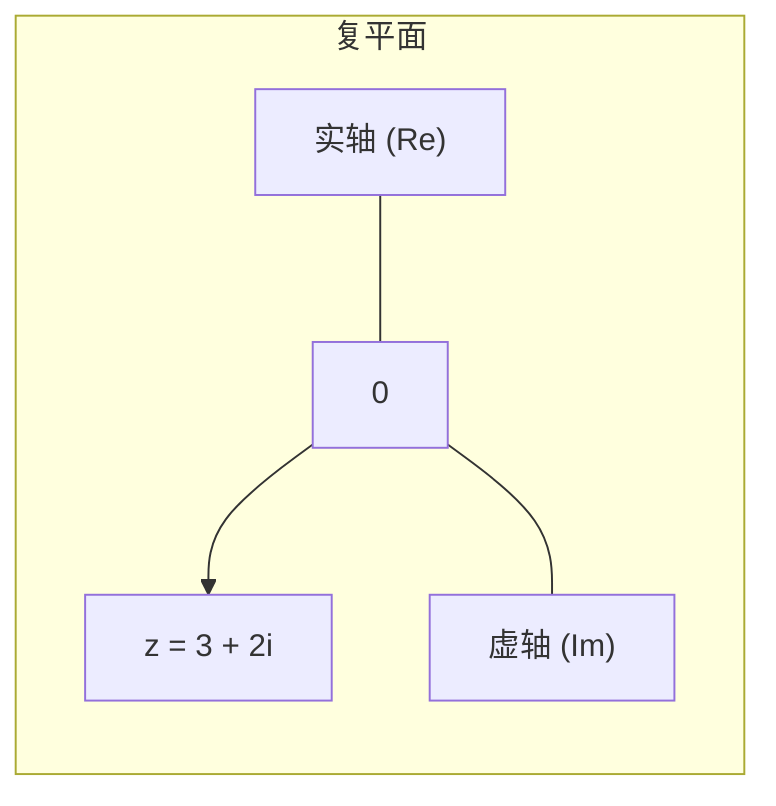
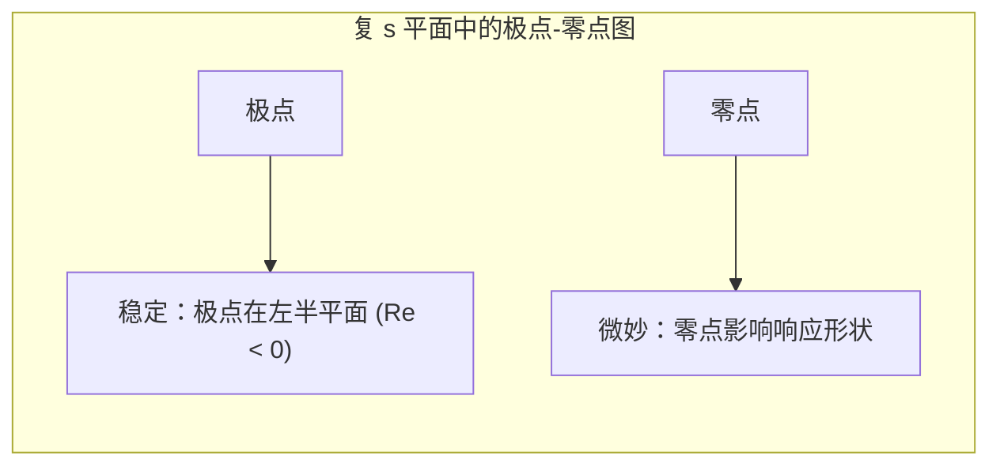

# 复数

> 数学发明了 i，因为 x^2 + 1 = 0 需要解。音频、傅里叶分析和量子力学认为这个想法很有用。

**类型：** 构建
**语言：** Python
**前置知识：** 无
**时间：** ~60 分钟

## 学习目标

- 将复数解释为二维向量，并实现加减乘除
- 使用欧拉公式 e^(iθ) 在极坐标和笛卡尔坐标之间转换
- 区分实极点和复极点，并解释复极点如何产生振荡
- 解释为什么傅里叶变换使用复数（实正弦与复指数）

## 问题

你第一次"看见"复数是在高中，有人说"解方程 x^2 = -1"。你被教导要接受它：i^2 = -1，仅此而已。可能感觉很造作，像一个为了方便而编造的数学把戏。

但复数在 ML 中反复出现，就像它们是真实存在的一样。傅里叶变换？复数。信号处理？复数。音频特征（例如语谱图）？复数。RNN 中的稳定性分析？实极点和复极点。量子机器学习？关于复数的一切。正则化中的"单位圆盘"？复平面。分数导数？复分析。

**复数不是比喻。** 它们是二维空间的一个不同的乘法版本。实数将两个量相乘得到另一个量。复数将两个向量相乘得到另一个向量。它恰好具有 x^2 + 1 = 0 在该空间中有一个解的性质。

## 概念

### 作为点的复数

复数 z = x + yi 是一对实数 x 和 y，加上一条额外的规则：i^2 = -1。

把它看作复平面中的一个点。x 轴是实部。y 轴是虚部。



```
z1 = 3 + 2i   实部 = 3，虚部 = 2
z2 = -1 + i   实部 = -1，虚部 = 1
z3 = -2 - 3i  实部 = -2，虚部 = -3
z4 = 4 - i    实部 = 4，虚部 = -1
```

**共轭：** 翻转虚部的符号：z* = x - yi。共轭反映过实轴。

**模（绝对值）：** |z| = sqrt(x^2 + y^2)。这是从原点到点 z 的距离，与二维欧几里得范数完全相同。

**辐角（相位）：** arg(z) = atan2(y, x)。向量与正实轴之间的角度。

### 复数算术

加法和减法是按分量进行的，就像二维向量一样。

```
加法：  (a + bi) + (c + di) = (a + c) + (b + d)i
减法：  (a + bi) - (c + di) = (a - c) + (b - d)i
```

乘法使用分配律和关键事实：i^2 = -1。

```
乘法：  (a + bi) * (c + di) = ac + adi + bci + bdi^2
                             = ac + adi + bci - bd
                             = (ac - bd) + (ad + bc)i
```

除法通过分子分母同时乘以共轭得到实数分母来处理。

```
除法：  (a + bi) / (c + di) = (a + bi)(c - di) / (c^2 + d^2)
           = (ac + bd + (bc - ad)i) / (c^2 + d^2)
           = (ac + bd)/(c^2 + d^2) + (bc - ad)/(c^2 + d^2)i
```

理解复数乘法的关键是将复数视为缩放加旋转，而不是这团混乱的代数。

### 极坐标形式

任何一个复数都可以写为：

```
z = x + yi = r * (cos(theta) + i * sin(theta))
```

其中 r = |z| = sqrt(x^2 + y^2)，theta = arg(z) = atan2(y, x)。

从笛卡尔坐标到极坐标的过程：

```
给定 z = 3 + 4i：
r = sqrt(9 + 16) = 5
theta = atan2(4, 3) ≈ 0.927 弧度

z = 5 * (cos(0.927) + i * sin(0.927))
```

### 欧拉公式

联系指数函数、三角函数和空想出来的 i 的最重要公式：

```
e^(i*theta) = cos(theta) + i * sin(theta)
```

这给出了极坐标形式的紧凑表示法：

```
z = r * e^(i*theta)
```

代入 theta = pi：e^(i*pi) = -1，所以 e^(i*pi) + 1 = 0。一个公式链接了五个最重要的数学常数。

通过欧拉公式，乘法变得自然：

```
如果 z1 = r1 * e^(i*theta1) 且 z2 = r2 * e^(i*theta2)：
z1 * z2 = r1 * r2 * e^(i*(theta1 + theta2))
```

**乘法 = 模相乘，辐角相加。** 将一个复数乘以另一个复数就是旋转和缩放。缩放因子是 r2。旋转角度是 theta2。

```
乘以 i：e^(i*pi/2) = i。乘以 i 就是将复平面旋转 90 度。

3 + 4i = 5 * e^(i*0.927)
(3 + 4i) * i = 5 * e^(i*(0.927 + pi/2)) = 5 * e^(i*2.498)
              = 5 * (cos(2.498) + i * sin(2.498))
              ≈ -4 + 3i
```

### 复指数：建模振荡

函数 e^(i*omega*t) 在复平面的单位圆上运动。cos(omega*t) 沿着实轴来回振荡。sin(omega*t) 沿着虚轴振荡。

```
e^(i*omega*t) = cos(omega*t) + i * sin(omega*t)

实部（看 cos）在 +1 和 -1 之间振荡。
虚部（看 sin）也在 +1 和 -1 之间振荡。
但组合 e^(i*omega*t) 是一个半径为 1 的等速旋转。
```

这就是为什么音频如此自然地用复数表示。一个"音符"不是正弦波——它是一个以特定频率旋转的相量。将两个音符相加就是将旋转的向量相加。

### 实极点与复极点

线性动力学中的稳定性分析使用极点（特征值）。极点可以是实数或复数。

| | 实极点 | 复极点 |
|--|--------|--------|
| 响应 | 指数增长或衰减 | 振荡 |
| 解 | e^(lambda*t) 其中 lambda 是实数 | e^(alpha*t) * (cos(beta*t) + i * sin(beta*t)) |
| 稳定 | lambda < 0 | alpha < 0（衰减振荡） |
| 增长 | lambda > 0 | alpha > 0（增长的振荡） |
| 边界 | lambda = 0 | alpha = 0，beta ≠ 0（持续振荡） |

复极点总是成对出现（共轭对：alpha +/- i*beta）。实数极点可以是复数吗？是的——物理量的演化可以用它们在实轴上的分量总和来描述，但动力学本身是复数的。

这对于理解 RNN 是有用的。RNN 有一个权重矩阵（或者在你的 RNN 实现中有一个标量权重 w）。如果 |w| < 1，梯度消失。如果 |w| > 1，梯度爆炸。如果是复数，|w| = 1 且辐角非零，得到持续的动力学（振荡的记忆）。

同样，对于更复杂的 RNN 中的线性层，特征值为复数意味着谐波动力学。实特征值意味着纯指数衰减或增长。

### 传递函数

在信号处理和控制论中，传递函数 H(s) 是复变量 s = sigma + i*omega 的函数。它不是凭空捏造的——H(s) 描述了系统如何响应不同频率的输入。

零点是 H(s) = 0 的位置。极点是 H(s) 变为无穷大的位置（分母为零的位置）。



传递函数将极点放在某个位置。极点决定了系统对能量的处理方式：
- 左半平面（负实部）：稳定。振动衰减。
- 右半平面（正实部）：不稳定。振动增长。
- 虚轴上（实部 = 0）：持续振荡。

这就是为什么理解复极点对机器学习听众很重要：不是因为你将显式地使用传递函数，而是因为他们对"极点"的思考方式与滤波器设计相关。

现在，很少有人工智能的研究者专门使用传递函数，除了在物理启发式神经网络或信号处理层中。所以把它当作背景知识。

### 在 ML 中遇到复数的地方

| 领域 | 复数的角色 | 具体地点 |
|------|-----------|---------|
| 傅里叶变换 | 使用复指数 e^(i*omega*t) | 频谱、语谱图 |
| 音频处理 | 相量（复数振幅 + 相位） | 声学特征抽取 |
| 稳定性分析 | 复特征值决定动力学 | RNN 初始化、序列建模 |
| 量子 ML | 态向量是复数的 | 变分量子电路 |
| 并行计算 | 复数数据格式 | 过去是雷达，但现在很少用于典型的人工智能 |
| 复数数值计算 | 复数域中的计算 | 一些 PDE 求解器或物理求解器 |

## 构建它

### 第 1 步：你的第一个复数类

从头实现基本的复数算术，了解当人们编写处理复数的复杂库时发生了什么。

```python
import math

class MyComplex:
    def __init__(self, real, imag):
        self.real = real
        self.imag = imag

    def __add__(self, other):
        return MyComplex(
            self.real + other.real,
            self.imag + other.imag
        )

    def __sub__(self, other):
        return MyComplex(
            self.real - other.real,
            self.imag - other.imag
        )

    def __mul__(self, other):
        return MyComplex(
            self.real * other.real - self.imag * other.imag,
            self.real * other.imag + self.imag * other.real,
        )

    def __truediv__(self, other):
        den = other.real ** 2 + other.imag ** 2
        real = (self.real * other.real + self.imag * other.imag) / den
        imag = (self.imag * other.real - self.real * other.imag) / den
        return MyComplex(real, imag)

    def conjugate(self):
        return MyComplex(self.real, -self.imag)

    def modulus(self):
        return math.sqrt(self.real ** 2 + self.imag ** 2)

    def phase(self):
        return math.atan2(self.imag, self.real)

    def __repr__(self):
        return f"({self.real:.4f} + {self.imag:.4f}i)"
```

### 第 2 步：极坐标转换函数

```python
def to_polar(z):
    r = z.modulus()
    theta = z.phase()
    return r, theta

def from_polar(r, theta):
    return MyComplex(r * math.cos(theta), r * math.sin(theta))
```

### 第 3 步：可视化复指数

这个函数使用 Python 的 `complex` 类型（因为我们不能在 OurComplex 上调用 `math.exp`）来显示 e^(i*omega*t) 的实际路径。

```python
import numpy as np
import matplotlib.pyplot as plt

def visualize_complex_exp(omega=1.0, duration=2 * math.pi, steps=100):
    times = np.linspace(0, duration, steps)
    vals = np.exp(1j * omega * times)
    plt.plot(times, vals.real, label="实部（余弦）")
    plt.plot(times, vals.imag, label="虚部（正弦）")
    plt.xlabel("时间")
    plt.ylabel("幅度")
    plt.legend()
    plt.show()
```

### 第 4 步：共轭乘积

```python
def conjugate_product(v1, v2):
    # 向量的内积，其中第一个元素是共轭的
    # 这就是"复内积"——||v||^2 = conj(v) @ v
    return sum(a.conjugate() * b for a, b in zip(v1, v2))
```

这表明复数也适用内积。

## 使用它

复数在模型构建中通常不是前端工具，但当你需要它们时，你会需要它们。

在 Python 中使用复数：

```python
z1 = 3 + 4j
z2 = 1 - 2j

z1 + z2    # (4+2j)
z1 * z2    # (11-2j)
z1 / z2    # (-1+2j)
abs(z1)    # 5.0
z1.real    # 3.0
z1.imag    # 4.0
z1.conjugate()  # (3-4j)
cmath.phase(z1)  # 获得辐角
```

对于数组操作，NumPy 原生支持 `complex64` 和 `complex128`。

```python
import numpy as np

a = np.array([1 + 2j, 3 + 4j, 5 + 6j], dtype=np.complex64)
np.abs(a)    # 模
np.angle(a)  # 相位（辐角）
```

## 练习

1. 将 z = 1 + i 转换为极坐标形式。然后计算 z^2、z^3 和 z^4。验证模和辐角的模式。（提示：每次乘法会使辐角增加 45 度。）

2. 使用欧拉公式计算 e^(i*pi/3)、e^(i*pi/2)、e^(i*pi) 和 e^(i*2*pi)。验证 e^(i*2*pi) 回到了 1。

3. 使用 NumPy 生成 f(t) = Re(e^(i*omega_1*t) + e^(i*omega_2*t)) 并绘制频率为 200Hz 和 300Hz 的结果。你能看到拍频吗？两个频率之间的差是多少？（提示：当两个接近的频率相加时会出现拍频。）

4. 计算 (3 + 2j) / (1 - 4j)。通过将结果乘以分母来验证你的答案。

5. 通过将 z1 = 3 + 4j 旋转 pi/4 弧度（45 度）来找到 z2。通过将 z1 乘以 e^(i*pi/4) 来实现。验证模保持不变。

## 关键术语

| 术语 | 含义 |
|------|------|
| 复数 | x + yi 形式的数，其中 i^2 = -1 |
| 实部 | x，复数在实轴上的投影 |
| 虚部 | y，复数在虚轴上的投影 |
| 共轭 | z* = x - yi，通过实轴翻转 |
| 模 | |z| = sqrt(x^2 + y^2)，与二维向量的欧几里得范数完全相同 |
| 辐角 | atan2(y, x)，与正实轴之间的角度 |
| 极坐标形式 | r * e^(i*theta)，其中 r 是模，theta 是辐角 |
| 欧拉公式 | e^(i*theta) = cos(theta) + i*sin(theta)。连接指数与三角学的桥梁 |
| 相量 | 具有模和相位的复数。e^(i*omega*t) 以频率 omega 旋转 |
| 复变函数 | 以复数为变量并返回复数的函数。傅里叶变换就是一个例子 |
| 极点 | 复函数无限增长的位置。决定稳定性 |
| 零点 | 复函数为零的位置。决定响应形状 |

## 延伸阅读

- [BetterExplained: Complex Numbers](https://betterexplained.com/articles/a-visual-intuitive-guide-to-imaginary-numbers/) - 一个专注于直觉而非代数的可视化解释
- [3Blue1Brown: Complex Numbers](https://www.3blue1brown.com/lessons/eulers-formula) - 欧拉公式 + 复数乘法的可视化
- [Needham: Visual Complex Analysis](https://global.oup.com/academic/product/visual-complex-analysis-9780198534464) - 关于复数的优秀可视化书籍
