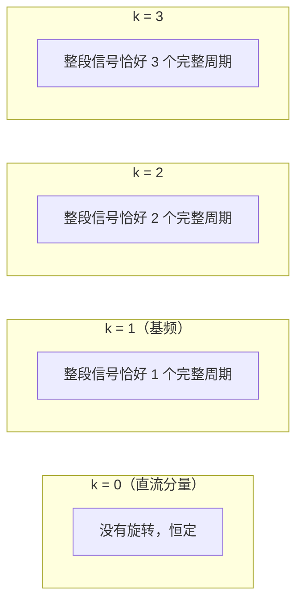
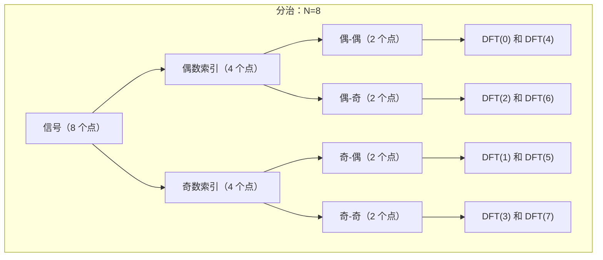

# 傅里叶变换

> 每个序列都是一组频率的和。只有当你理解了这个事实，你才能正确地滤波、压缩或生成音频。

**类型：** 构建
**语言：** Python
**前置知识：** 阶段 1，课程 19（复数）
**时间：** ~90 分钟

## 学习目标

- 将 DFT 解释为投射到一组复指数上，并从头实现它
- 将 DFT 与 FFT 区分开，并实现 Cooley-Tukey 分治算法
- 使用卷积定理通过 FFT 执行快速卷积
- 解释谱图在音频特征抽取中做什么，以及为什么对于分类来说，谱图比原始波形更好

## 问题

信号可以表示为纯振荡之和。傅里叶变换从信号中提取这些振荡。

傅里叶变换发生在：
- **听觉：** 耳朵内有鼓膜和基底膜，将声波分解为频率分量。这就是你区分笛声（高频）和低音鼓（低频）的方式。
- **语音 AI：** MFCC 和谱图是音频分类的标准输入特征。它们都是频域表示。
- **图像处理：** 图像的傅里叶变换让你看到哪些频率是主要的。
- **神经网络：** 当你不理解频域时，卷积网络中的对抗性扰动最容易设计。

时域让你看到信号的幅度如何变化。频域让你看到该信号由哪些频率分量构成。

## 概念

### 从连续到离散

自然界中发生的信号是连续的。在计算机中，我们处理的是**离散时间信号**（采样得到的有序数值序列）。

**连续傅里叶变换**采用连续函数并返回连续函数。对于计算来说，它太理想化了——计算机需要离散数据。

**离散傅里叶变换（DFT）** 从 N 个等距采样的复数点出发，将它们分解为 N 个不同的频率分量。DFT 正是我们从采样信号计算频率的方式。

**FFT（快速傅里叶变换）** 是 DFT 的一种算法实现，没有近似。

### 什么是频率？

取 N 个等距隔开的点，将它们绕单位圆排列。

频率 k 的正弦波是向量：

```
f_k[n] = e^(i*2*pi*k*n / N)
```

其中 n = 0, 1, ..., N-1 表示第 n 个采样点。

这个向量的第 n 个分量等于绕着复平面走了 (k/N) 圈后的角度。随着 k 增加，波形绕单位圆更快地转动：
- k = 0：根本不转动（全在实轴上）
- k = 1：绕 1 周（一个完整周期）
- k = 2：绕 2 周，等等
- k = N/2：绕 N/2 周（交替采样 +1, -1, +1, -1）
- k > N/2：与 k = N - k' 的负频率互为镜像



**最高可分辨频率**是 k = N/2（当 N 为偶数时），称为奈奎斯特频率。高于奈奎斯特频率的频率会发生"混叠"，表现为虚假的低频分量。

### DFT 公式

DFT 的公式出奇地简单。你取信号 x（N 个采样点的序列）并计算每个频率 k 的投影值：

```
X[k] = sum_{n=0}^{N-1} x[n] * e^(-i*2*pi*k*n / N)
```

这个公式的含义是：把你信号中的第 n 个样本与频率为 k 的第 n 个复指数相乘，然后求和。乘法是点积。结果是信号 x 与频率 k 下的复指数之间的点积。

如果信号与特定频率对齐，该频率的点积会很大，因为它乘以 1（一个与它同方向的单位向量）产生较大的和。

如果信号不包含该频率，乘积在正负之间跳跃，求和接近于零。

### 忽略负号

仔细看：`e^(-i*2*pi*k*n/N)`，而之前的正弦波用的是 `e^(+i*2*pi*k*n/N)`。负号意味着 DFT 将信号"投影"到所有复指数上，通过取共轭之间的内积来得到这些频率的强度。

在实践中：
- **幅度谱：**`|X[k]|`
- **相位谱：**`arg(X[k])`

通常你只关心幅度谱，因为大多数分类依据的是"信号中有多少能量落在某个频段"，而不关心确切的起始相位。

### 逆 DFT

如果 DFT 是"解构"，逆 DFT 就是"重构"。从频率分量 X 重建原始信号：

```
x[n] = (1/N) * sum_{k=0}^{N-1} X[k] * e^(i*2*pi*k*n / N)
```

唯一真正的区别是符号（正 vs 负）和 1/N 的归一化因子。

### 快速傅里叶变换（FFT）

DFT 的朴素实现是 O(N^2)。对于每个频率 k，你需要求 N 项的和。总共 N 个频率，总计 O(N^2) 次运算。

Cooley-Tukey FFT 将它降到 O(N log N)，利用了对称性和周期性。



基 2 算法的工作原理如下：

1. 将信号分为偶数索引和奇数索引。
2. 递归计算偶数和奇数部分的 DFT。基本情形是长度为 1 的序列，其 DFT 就是它本身。
3. 使用旋转因子（"旋转因子"）重新组合：
   ```
   X[k]          = E[k] + W^k * O[k]
   X[k + N/2]    = E[k] - W^k * O[k]
   ```
   其中 W^k = e^(-i*2*pi*k/N)。

4. 这种重新组合之所以有效，是因为旋转因子 W^(k+N/2) = -W^k，也就是存在对称性，一半的计算可以从另一半推导出来。

利用更多的对称性，还有进一步的优化实序列的方法（实信号的 DFT 是共轭对称的），以及利用零填充的方法。但核心是 FFT。

最终结果：对于 N = 1024，朴素 DFT 需要约 100 万次运算，FFT 需要约 1 万次运算。对于采样率 16kHz 的 1 秒音频，FFT 是实时计算，DFT 则会卡住。

### 将 FFT 应用于典型音频

对于 16-bit、16kHz、1 秒的单声道音频，输入是 16000 个采样点。运行 FFT 得到 16000 个复数。

解析这些数字：
- `X[0]` 是直流分量（信号的平均值）。
- `X[1]` 是 1Hz 分量的幅度和相位。
- `X[k]` 是频率 `k * 16000 / 16000 = k Hz` 的幅度和相位。
- `X[8000]` 是奈奎斯特频率（8000 Hz）的分量。
- `X[8001]` 到 `X[15999]` 是负频率，对于实信号来说，它们与 `X[7999]` 到 `X[1]` 共轭对称。

所以**实信号的幅度谱对称，你可以丢弃后一半的频点而不会丢失信息**。

### 谱图

对于实际的音频，频率内容随时间变化。一个单一的全局 FFT 会完全丢失时间信息："在哪个时间点发生了什么"。

谱图将信号切成短帧（通常 20-30 毫秒），对每帧做 FFT，然后将结果堆叠成一张二维图像。

```
原始音频：[n0, n1, n2, ..., n15999]  （16000 个采样点）

帧 1： [n0, n1, ..., n399]     FFT -> 长度为 400 的向量（或称 201 个频点，因为对称性）
帧 2： [n200, n201, ..., n599]  FFT -> 又得到一个向量
帧 3： [n400, n401, ..., n799]  FFT -> 等等
```

帧重叠（例如帧移 200，即 50% 重叠）。纵轴是频率，横轴是时间，颜色是幅度。

```
              时间 ----->
频     _________________________________
率     |  |  |  |  |  |  |  |  |  |  |  |  较亮的颜色
      |  |  |  |  |  |  |  |  |  |  |  |  = 更强的能量
|     |  |  |  |  |  |  |  |  |  |  |  |
v     _________________________________

      帧 1 帧 2 帧 3 帧 4 ...
```

这正是麦克风和耳朵在 20ms 内所做的粗略划分。谱图所做的就是将每个时间窗口的 FFT 作为一列。

### 频谱子带

人类的听觉大致是 24 个频带（临界频带）。在 ML 中，通常将谱图频率映射到梅尔刻度——这是一种对数频率刻度，模拟人类听觉的非线性。例如，人耳能分辨 200Hz 和 300Hz 的差异，但很难分辨 3200Hz 和 3300Hz 的差异。

因此 MFCC（梅尔频率倒谱系数）会：
1. 计算谱图
2. 通过梅尔滤波器组进行滤波
3. 取对数幅度
4. 应用 DCT（离散余弦变换）来去相关特征

最终输出是一个紧凑的表示（通常 13 个系数 × 帧数），用作语音/音频模型的输入特征。

### 卷积定理

在时域中，对两个长度为 N 的向量做卷积需要 O(N^2) 次操作。但频域使这个过程更快。

```
x * h = IFFT(FFT(x) · FFT(h))
```

其中 `·` 表示逐元素相乘。

```
时域卷积：将每个输入元素与每个权重相乘 -> O(N^2)

频域做：
  1. FFT(x)    O(N log N)
  2. FFT(h)    O(N log N)
  3. 逐元素相乘    O(N)
  4. IFFT       O(N log N)

总复杂度：O(N log N)，快得多。
```

卷积定理是音频滤波的基础。要设计一个低通滤波器，只需在频域中将高频成分归零，然后做逆变换。

## 构建它

### 第 1 步：朴素 DFT

直接使用定义，因为公式简单。

```python
import numpy as np

def naive_dft(x):
    N = len(x)
    X = np.zeros(N, dtype=complex)
    for k in range(N):
        for n in range(N):
            angle = -2 * np.pi * k * n / N
            X[k] += x[n] * np.exp(1j * angle)
    return X
```

### 第 2 步：Cooley-Tukey FFT

```python
def cooley_tukey_fft(x):
    N = len(x)
    if N == 1:
        return x

    # 假设 N 是 2 的幂
    evens = cooley_tukey_fft(x[0::2])
    odds = cooley_tukey_fft(x[1::2])

    half = N // 2
    factor = np.exp(-2j * np.pi * np.arange(half) / N)

    # 组合
    first_half = evens + factor * odds
    second_half = evens - factor * odds

    return np.concatenate([first_half, second_half])
```

这个实现在 N 不是 2 的幂或不是偶数时不会退化（因为它会不断分半直到长度为 1）。如果 N 恰好是 2 的幂，它会很高效。

### 第 3 步：谱图

从原始音频构建谱图：

```python
def simple_spectrogram(audio, frame_size=1024, hop_size=512):
    frames = []
    for start in range(0, len(audio) - frame_size, hop_size):
        frame = audio[start:start + frame_size]
        windowed = frame * np.hanning(frame_size)  # 加窗抑制边界伪影
        spectrum = np.fft.rfft(windowed)           # rfft 利用对称性
        magnitude = np.abs(spectrum)
        frames.append(magnitude)

    return np.array(frames).T  # 频率 × 时间
```

### 第 4 步：使用 FFT 的快速卷积

```python
def fft_convolution(x, h):
    N = len(x) + len(h) - 1
    # 填充到 2 的幂
```figure
fourier-synthesis
```

    M = 1
    while M < N:
        M *= 2

    X = np.fft.fft(x, n=M)
    H = np.fft.fft(h, n=M)
    y = np.fft.ifft(X * H)
    return np.real(y[:N])
```

### 第 5 步：幅度谱与相位谱

```python
def amplitude_spectrum(X):
    return np.abs(X)

def phase_spectrum(X):
    return np.angle(X)
```

## 使用它

从音频信号中提取特征：

```python
import librosa

# 加载音频
audio, sr = librosa.load('speech.wav', sr=16000)

# 梅尔谱图
mel_spec = librosa.feature.melspectrogram(y=audio, sr=sr, n_mels=40)

# MFCC
mfcc = librosa.feature.mfcc(y=audio, sr=sr, n_mfcc=13)

# 谱图（对数幅度）
spec = librosa.stft(audio)
log_spec = librosa.amplitude_to_db(np.abs(spec))
```

在网络中，这些经常被堆叠为通道，就像图像一样，供 CNN 使用。

```python
# 典型的音频分类形状
# (batch, time_steps, freq_bins, channels)
# e.g., (32, 200, 40, 1)
```

或者作为 Transformer 的序列：

```python
# (batch, time_steps, features)
# e.g., (32, 200, 13) for MFCCs
```

## 练习

1. 生成频率为 400Hz 的正弦波和频率为 300Hz 的正弦波，采样率是 8000Hz，持续 1 秒。对两信号求和，计算其 DFT，并绘制幅度谱。你能看到两个峰吗？它们出现在哪个索引？

2. 对 `np.arange(8)` 运行你的 `naive_dft` 和 `cooley_tukey_fft`。比较输出。对于 N = 1024，计时对比如何？（使用 `time.time()`。）

3. 对一个 5 秒的纯音（例如 440Hz，采样率 16000）计算谱图。将原始波形（时域）与谱图（频域随时间变化）进行对比绘制。谱图中你能在哪里看到 440Hz？

4. 使用 FFT 卷积将[1, -1] 滤波器应用于随机信号。将结果与 `np.convolve` 的输出对比。检查数值一致性。

5. 重新生成音频信号：取一个纯音的幅度谱，随机打乱相位，做逆 FFT。听起来有什么不同？（这证明了相位对于拟合同样重要。）

## 关键术语

| 术语 | 含义 |
|------|------|
| 傅里叶变换 | 将信号分解为构成它的频率的数学变换。离散版本就是 DFT |
| DFT（离散傅里叶变换） | X[k] = sum x[n] * e^(-i*2*pi*k*n/N)，将 N 个采样点分解为 N 个频率分量 |
| FFT | 一种快速计算 DFT 的 O(N log N) 算法。不是对 DFT 的近似，而是精确计算 |
| 幅度谱 | X[k] 的绝对值，|X[k]|——每个频率的能量 |
| 相位谱 | X[k] 的辐角，arg(X[k])——每个频率的偏移 |
| 频谱 | 信号的频域表示的通用术语。通常是幅度谱的别名 |
| 谱图 | 随时间变化的频谱，通过将信号切成短帧并对每帧做 FFT 生成。频率 × 时间 × 幅度 |
| 梅尔刻度 | 基于感知的对数频率刻度，模拟人类听觉的弯曲 |
| MFCC | 梅尔频率倒谱系数——将谱图简化为紧凑的系数向量 |
| 卷积定理 | 时域卷积 ⇔ 频域逐元素相乘。利用 FFT 实现快速卷积 |
| 奈奎斯特频率 | 采样率的一半。高于此的频率发生混叠 |
| 混叠 | 当信号包含高于奈奎斯特频率的频率时，高频能量表现为虚假的低频伪影 |
| 窗口 | 在 FFT 之前应用于每帧的平滑函数（汉宁窗、汉明窗），以减少频谱泄漏 |

## 延伸阅读

- [3Blue1Brown: Fourier Transform](https://www.3blue1brown.com/lessons/fourier-transform) - 对 FT 含义仅有的必要解释
- [Oppenheim: Discrete-Time Signal Processing](https://www.pearson.com/en-us/subject-catalog/p/discrete-time-signal-processing/P200000003219) - DFT 和 FFT 的标准教材
