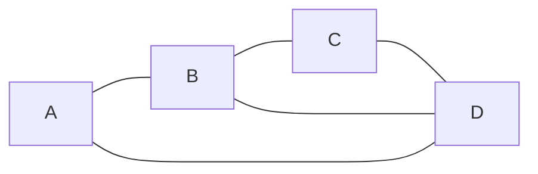
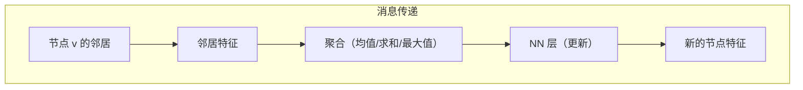

# 图论

> 数据不是表格。它是关系。图结构建模了这些关系。

**类型：** 构建
**语言：** Python
**前置知识：** 阶段 1，课程 02（向量与矩阵）
**时间：** ~90 分钟

## 学习目标

- 解释图如何表示为邻接矩阵和关联矩阵
- 实现 BFS 和 DFS，并解释它们在何种图上表现不同
- 解释为什么拉普拉斯矩阵对图聚类至关重要
- 将图卷积理解为消息传递：聚合邻居特征并用神经网络处理

## 问题

表格数据很整齐。每一行是一个样本，每一列是一个特征。神经网络处理得非常好。

但很多数据不是表格化的。网页通过超链接连接。分子中的原子通过化学键连接。社交网络中将人与人连接起来。推荐系统中用户和物品之间相互作用。

当你将数据表示为图时，你可以利用连接结构进行学习。在分子图上训练的 GNN 可以预测化学性质。在论文引用图上训练的 GNN 可以预测研究领域。在社交图上训练的 GNN 可以推荐朋友。

本课程涵盖图论的基础知识，以便为图神经网络（课程 19）做好准备。结构先于表示，表示先于学习。

## 概念

### 图

图 G = (V, E) 由节点（顶点）和连接节点的边组成。

```
V = {A, B, C, D}               4 个节点
E = {(A,B), (B,C), (C,D), (D,A), (B,D)}   5 条边
```



**有向图：** 边有方向。A → B 与 B → A 不同。
**无向图：** 边没有方向。A—B 意味着双向关系。
**加权图：** 边有权重。A—B（权重 0.8）与 A—C（权重 0.2）不同。
**多重图：** 两个节点之间可以有多个并行边。

### 邻接矩阵

邻接矩阵 A 是大小为 |V| × |V| 的矩阵，如果节点 i 和 j 之间有边，则 A[i][j] = 1（或边的权重），否则为 0。

```
您的图：
   A  B  C  D
A  0  1  0  1
B  1  0  1  1
C  0  1  0  1
D  1  1  1  0
```

无向图的邻接矩阵是对称的（A[i][j] = A[j][i]）且对角线为 0。

**度矩阵** D 是对角矩阵，D[i][i] = sum_j A[i][j]。在无向图中，节点 i 的度数是与其连接的节点数。

```
D = [2  0  0  0]
    [0  3  0  0]
    [0  0  2  0]
    [0  0  0  3]
```

**关联矩阵** B 的大小为 |V| × |E|。如果节点 i 连接到边 e，则 B[i][e] = 1。

邻接矩阵很直观，但随着节点数量的增加，稀疏性会增大。对于稀疏图（许多节点，很少边），邻接表（每个节点的邻居列表）存储起来更高效。

### 图的连通性

**连通图：** 任意两个节点之间都存在路径。
**连通分量：** 节点可以到达彼此的最大节点集合。
**有向图中的强连通分量：** 节点可以沿有向路径相互到达的最大节点集合。

检查连通性的方法：从任意节点运行 DFS（深度优先搜索）。如果访问到了所有节点，图就是连通的。

### BFS 与 DFS

两种方法都遍历图，但顺序不同。

**广度优先搜索（BFS）：** 使用队列。首先访问所有邻居，然后访问邻居的邻居，以此类推。

```
BFS 从 A 开始：

1. 访问 A，将 B、D 入队              队列：[B, D]
2. 从队首取出 B，访问 C、D（D 已访问过）  队列：[D, C]
3. 从队首取出 D，访问 C（已访问过）      队列：[C]
4. 从队首取出 C，无新的邻居             队列：[]
```

结果：A, B, D, C（使用邻接顺序）。

**深度优先搜索（DFS）：** 使用栈（或递归）。深入一个方向直到无路可走，然后回溯。

```
DFS 从 A 开始（按字母顺序）：

1. 访问 A，推入 B                 栈：[B]
2. 访问 B，推入 A（已），C，D       栈：[A, C, D]
3. 访问 D                       栈：[A, C]
4. 访问 C                       栈：[A]

结果：A, B, D, C
```

**比较：**

| 性质 | BFS | DFS |
|------|-----|-----|
| 数据结构 | 队列 | 栈（或递归） |
| 最短路径 | 是，找到最短路径 | 否，找到任意路径 |
| 未加权图上的最短路径 | 严格适用 | 不保证 |
| 内存 | O(宽度)，对于宽图可能很大 | O(深度)，对于深图可能很大 |
| 节点访问顺序 | 按距起点的距离分层 | 沿一条路彻底探索再回溯 |

### 拉普拉斯矩阵

图的拉普拉斯矩阵 L = D - A：

```
L = D - A
  = [2  0  0  0]    [0  1  0  1]    [ 2 -1  0 -1]
    [0  3  0  0]  - [1  0  1  1]  = [-1  3 -1 -1]
    [0  0  2  0]    [0  1  0  1]    [ 0 -1  2 -1]
    [0  0  0  3]    [1  1  1  0]    [-1 -1 -1  3]
```

拉普拉斯矩阵具有优良的性质：
- L 对于无向图是对称的
- 特征值都是非负的，最小值始终为 0
- 零特征值的重数等于连通分量的数量
- L 的二次型：x^T L x = sum_{(i,j) in E} (x_i - x_j)^2，衡量"信号在边上的变化程度"

**标准化拉普拉斯矩阵**将行和列标准化为单位长度：L_norm = I - D^(-1/2) A D^(-1/2)。

### 谱聚类

拉普拉斯矩阵的第二小特征值（Fiedler 值）告诉你图被"切"断的难易程度。

```
x^T L x = sum_{(i,j) in E} (x_i - x_j)^2

如果节点可以分成两组 A 和 B，使得 A 和 B 之间的边很少，
那么将 x_i 设为 +1（对于 A）或 -1（对于 B）会使得 x_i - x_j 很小，
因此 x^T L x 也很小。

这意味着 x 接近拉普拉斯矩阵与特征值 0 相关的特征向量。
第二个特征向量（Fiedler 向量）给出了最优二分。
```

谱聚类通过以下方式工作：

```
1. 计算拉普拉斯矩阵 L
2. 计算 L 的前 k 个特征向量（对应于最小特征值）
3. 将每个节点映射到由这些特征向量给出的 k 维点
4. 在这些 k 维点上运行 k-means
5. 将每个节点的归属标签映射回原始图节点
```

这比在原始图上运行 k-means 效果更好，因为图结构（哪些节点相连）隐含在拉普拉斯矩阵的特征向量中。

### 图卷积作为消息传递

图卷积将图像卷积推广到图。在图像中，每个像素从其局部邻居（3x3 网格）聚合信息。在图结构中，每个节点从其邻居聚合信息。

**消息传递范式：**

```
对于图中的每个节点 v：
  1. 收集：从 v 的所有邻居收集特征向量 h_u
  2. 聚合：将邻居特征聚合为一个单一向量（通过求和、取均值或取最大值）
  3. 更新：将聚合结果与 v 自己的特征结合，通过一个神经网络层

h_v^{(k+1)} = sigma(W * MEAN({h_u^{(k)} for u in N(v) 并上 v}))
```

其中 N(v) 是 v 的邻居集，并上 v 是自环。

这是图卷积网络（GCN）的基本形式。将其堆叠 k 层，每个节点就会知道其 k 跳范围内的邻居的信息。



### 邻接矩阵的幂

A^2 中的重要事实： (A^2)[i][j] = 从 i 到 j 长度为 2 的路径数。

A^3[i][j] = 从 i 到 j 长度为 3 的路径数。

这给出了 k 步消息传递的概念：节点 k 步可达的信息融入到特征中。在图神经网络的背景下，消息传递 k 层等价于考虑 k 步邻域。

```figure
graph-degree-distribution
```

### 图的度量和 ML 用例

| 概念 | 定义 | 在 ML 中的角色 |
|------|------|---------------|
| 度数 | 节点的邻居数 | 度数大的节点可能是枢纽或关键 |
| 聚类系数 | 邻居之间互相连接的程度（实际边数 / 可能边数） | 衡量局部紧密性 |
| 路径长度 | 连接两个节点所需的最少边数 | 网络直径、分离度 |
| 中心性 | 衡量节点的重要程度（介数、接近度、特征向量） | 寻找关键节点 |
| PageRank | 基于链接的随机游走的重要性度量 | 网页排名、推荐系统中的节点重要性 |

## 构建它

### 第 1 步：图类

```python
import numpy as np
from collections import deque

class SimpleGraph:
    def __init__(self, n_nodes, directed=False):
        self.n = n_nodes
        self.directed = directed
        self.adj = [[] for _ in range(n_nodes)]

    def add_edge(self, u, v):
        self.adj[u].append(v)
        if not self.directed:
            self.adj[v].append(u)

    def adjacency_matrix(self):
        A = np.zeros((self.n, self.n), dtype=float)
        for u in range(self.n):
            for v in self.adj[u]:
                A[u, v] = 1.0
        return A

    def laplacian(self):
        A = self.adjacency_matrix()
        D = np.diag(A.sum(axis=1))
        return D - A
```

### 第 2 步：BFS 和 DFS

```python
def bfs(graph, start):
    visited = [False] * graph.n
    order = []
    queue = deque([start])
    visited[start] = True
    while queue:
        u = queue.popleft()
        order.append(u)
        for v in graph.adj[u]:
            if not visited[v]:
                visited[v] = True
                queue.append(v)
    return order

def dfs(graph, start):
    visited = [False] * graph.n
    order = []

    def _dfs(u):
        visited[u] = True
        order.append(u)
        for v in graph.adj[u]:
            if not visited[v]:
                _dfs(v)

    _dfs(start)
    return order
```

### 第 3 步：谱聚类

```python
def spectral_clustering(graph, k=2):
    L = graph.laplacian()
    eigvals, eigvecs = np.linalg.eigh(L)
    X = eigvecs[:, :k]

    from sklearn.cluster import KMeans
    kmeans = KMeans(n_clusters=k, random_state=0, n_init=10)
    labels = kmeans.fit_predict(X)
    return labels
```

### 第 4 步：简单的消息传递

用 NumPy 手动实现一层 GCN。

```python
import numpy as np

def gcn_layer(A, H, W, activation=lambda x: x):
    # A: 添加自环的邻接矩阵 (N x N)
    # H: 节点特征 (N x F_in)
    # W: 权重矩阵 (F_in x F_out)

    # 度矩阵的逆平方根
    D = np.array(A.sum(axis=1)).flatten()
    D_inv_sqrt = np.diag(1.0 / np.sqrt(np.maximum(D, 1e-8)))

    # 标准化邻接矩阵
    A_hat = D_inv_sqrt @ A @ D_inv_sqrt

    # 消息传递：聚合 + 更新
    H_new = A_hat @ H @ W
    return activation(H_new)
```

## 使用它

谱聚类将图划分为基于连接的簇：

```python
g = SimpleGraph(6)
edges = [(0, 1), (1, 2), (2, 0), (3, 4), (4, 5), (5, 3)]
for u, v in edges:
    g.add_edge(u, v)

labels = spectral_clustering(g, k=2)
print(labels)  # [0, 0, 0, 1, 1, 1] 将节点分成两组
```

图卷积为 PyTorch Geometric 中真实的 GNN 提供了基础。

```python
# PyTorch Geometric 中的简单 GCN
import torch
import torch.nn.functional as F
from torch_geometric.nn import GCNConv

class GCN(torch.nn.Module):
    def __init__(self, in_channels, hidden_channels, out_channels):
        super().__init__()
        self.conv1 = GCNConv(in_channels, hidden_channels)
        self.conv2 = GCNConv(hidden_channels, out_channels)

    def forward(self, x, edge_index):
        x = self.conv1(x, edge_index).relu()
        x = self.conv2(x, edge_index)
        return x
```

## 练习

1. 实现一个有 6 个节点的图，使得邻接矩阵的 (A^2)[i][j] > 0 当且仅当 i 和 j 之间有长度为 2 的路径。验证。

2. 在你的图上运行 BFS 和 DFS。打印从节点 0 开始的访问顺序。解释 BFS 和 DFS 在星形图（一个中心节点连接到所有其他节点）上的表现差异。

3. 创建一个由两个簇组成的图（每个簇紧密连接，簇之间只有一条边）。计算拉普拉斯矩阵，得到特征值，并检查 Fiedler 向量（第二特征向量）。它是否将两个簇分开？

4. 在一个小的分子图（例如，C 和 O 原子作为节点，化学键作为边）上运行消息传递。假设输入特征为 one-hot 编码（[1, 0] 表示 C，[0, 1] 表示 O），随机初始化一个 GCN 层。C 和 O 节点的输出特征是否不同？有多个邻居的 C 节点与只有一个邻居的 C 节点相比输出有什么不同？

5. 在一个随机图上运行 k=3 的谱聚类。将聚类结果与原始图的结构进行比较。

## 关键术语

| 术语 | 含义 |
|------|------|
| 图 | 节点（顶点）和连接节点的边组成的数据结构 |
| 邻接矩阵 | 大小为 N×N 的矩阵，A[i][j] = 1 表示节点 i 和 j 之间有边 |
| 度矩阵 | 对角线为节点度数的对角矩阵 |
| 拉普拉斯矩阵 | L = D - A。矩阵的二次型衡量"在图上的变化" |
| 谱聚类 | 使用拉普拉斯矩阵的特征向量对节点进行聚类的算法 |
| Fiedler 向量 | 拉普拉斯矩阵的第二特征向量。用于对图进行二分 |
| BFS | 广度优先搜索。使用队列按层次遍历 |
| DFS | 深度优先搜索。使用栈深入探索一条分支 |
| 消息传递 | 图神经网络中使用的范式：从邻居聚合特征，然后通过神经网络进行更新 |
| GCN | 图卷积网络。将图像卷积推广到图结构数据 |

## 延伸阅读

- [Bondy & Murty: Graph Theory](https://link.springer.com/book/9781846289699) - 图论的标准教材
- [Hamilton: Graph Representation Learning](https://www.cs.mcgill.ca/~wlh/grl_book/) - 涵盖谱图理论和图神经网络
- [Von Luxburg: A Tutorial on Spectral Clustering](https://arxiv.org/abs/0711.0189) - 谱聚类的权威教程
