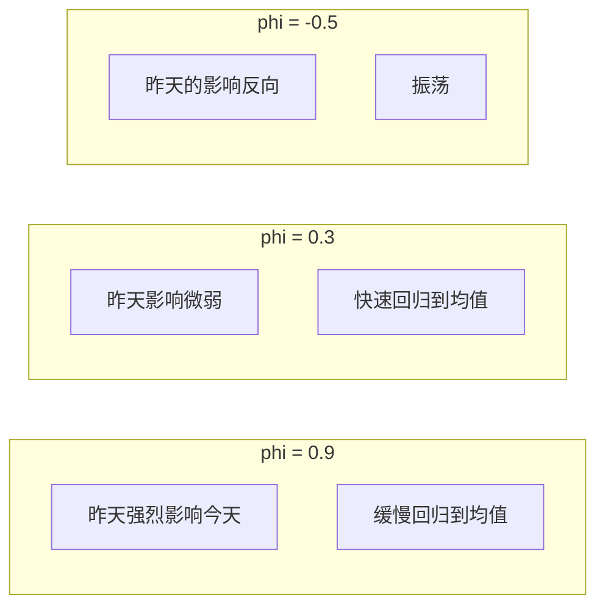

# 随机过程

> 非平稳性是股票预测困难的原因。理解它的数学机理，你就会明白哪些问题可以求解，哪些不能。

**类型：** 构建
**语言：** Python
**前置知识：** 阶段 1，课程 06（概率与分布）、08（优化）
**时间：** ~90 分钟

## 学习目标

- 定义随机过程，并区分平稳与非平稳过程
- 模拟随机游走、AR(1) 和高斯过程，并解释它们的性质
- 使用 Augmented Dickey-Fuller 检验检测平稳性
- 解释为什么非平稳序列使时间序列预测变得困难，以及差分如何解决这个问题

## 问题

确定性过程有精确的输出。掷骰子是不确定的，但每次掷骰是独立的：过去不影响未来。

随机过程处于两者之间。每次观测都是不确定的，但**过程会演变**。明天的值取决于今天的状态。由此产生的路径——整条序列——是一个随机对象。

在股市中，今天的价格是昨天价格的延续，但具体的走向在细节上是不确定的。温度是连续变化的，但下一个温度是否存在骤升只能通过概率来预测。文本中的下一个单词依赖于之前的单词。

概率论处理的是单个随机事件。随机过程处理的是在时间上**展开的序列**（或任意索引集）。许多 ML 问题本质上就是推断序列的下一个值。

\[
x_t = f(x_{t-1}, x_{t-2}, \ldots, \epsilon_t)
\]

## 概念

### 随机过程

随机过程是一族随机变量，按时间（或某种索引）排列：

\[
\{X_t : t \in T\}
\]

对于固定的时间点 t，X_t 是一个随机变量。当你观察整个过程时，你得到所有时间点上随机变量的一个实现——一条路径。

**分类：**

| 类型 | 时间 | 状态 | 例子 |
|------|------|------|------|
| 离散时间，离散状态 | 整数 | 有限/可数 | 赌徒破产、马尔可夫链 |
| 离散时间，连续状态 | 整数 | 实数 | AR(1)、股票收益 |
| 连续时间，离散状态 | 实数 | 有限/可数 | 排队系统、泊松过程 |
| 连续时间，连续状态 | 实数 | 实数 | 布朗运动、伊藤过程 |

### 平稳性

平稳性意味着**过程的统计性质不随时间变化**。

**严格平稳：** X_{t1}..., X_{tk} 的联合分布与 X_{t1+h},..., X_{tk+h} 的联合分布完全相同，对任意 h 和任意选择的时间点成立。这是一个很难满足的条件。

**弱平稳（协方差平稳）：** 更容易满足，对 ML 通常已足够：

1. 均值恒定：E[X_t] = mu，对所有 t
2. 自协方差只依赖于滞后：Cov(X_t, X_{t-h}) = gamma(h)，对所有的 t 和 h

如果序列是弱平稳的，它没有趋势、没有季节性周期变化（统计性质来说）、且方差恒定。

非平稳序列使预测变得困难，因为过去的关系在未来可能不成立：

| 性质 | 平稳序列 | 非平稳序列 |
|------|---------|-----------|
| **均值** | 随时间恒定 | 可能随时间变化（趋势） |
| **方差** | 有限且恒定 | 可能随时间变化 |
| **可预测性** | 模式可推广 | 模式可能只在过去成立 |
| **历史相关性** | 高（统计性质不变） | 低（统计性质可能已变） |
| **例子** | 白噪声、稳定 AR(1) | 随机游走、带趋势的 GDP |

### 自协方差与自相关

平稳过程的自协方差函数 gamma(h) = Cov(X_t, X_{t-h}) 衡量了相隔 h 步的观测值之间的线性依赖关系。

自相关函数（ACF）是将其标准化：

\[
\rho(h) = \frac{\gamma(h)}{\gamma(0)} = \text{Corr}(X_t, X_{t-h})
\]

其中 gamma(0) = Var(X_t)。

ACF 可以识别模式：
- 白噪声中：ACF 在所有滞后上为零或接近零。
- AR(1)（正参数）：ACF 缓慢衰减。
- 季节模式：ACF 在季节性滞后上有峰值。
- 随机游走：ACF 在所有滞后上都很高且衰减极为缓慢。

### 白噪声

最简单的随机过程：i.i.d. 序列，均值为零，方差为常数 sigma^2。

\[
X_t = \epsilon_t, \quad \epsilon_t \overset{i.i.d.}{\sim} (0, \sigma^2)
\]

```
白噪声序列图：

值  |  ·  ·     ·  ·           ·     ·  ·  ·
   |     ···  ·  ··  ··  ··   ···  ···  ·  ···
   |·· ·      ·  ·    ·· ··  ·   ··     ·
   +-----------------------------------------
     时间 -->
```

白噪声是严格平稳的。它没有模式可供学习——每一步都是独立的。如果你对白噪声做预测，最佳预测就是历史均值零。

所有的模式都来自于依赖结构。白噪声作为基准：如果你的模型在白噪声上的表现不比随机猜测好，说明你已经提取了所有信号。

### 随机游走

\[
X_t = X_{t-1} + \epsilon_t
\]

从 X_0 = 0 开始：

\[
X_t = \sum_{s=1}^t \epsilon_s
\]

**性质：**
- E[X_t] = 0，对所有 t（均值恒定）
- Var(X_t) = t sigma^2（方差随时间增长！）
- 对于滞后 h：Cov(X_t, X_{t-h}) = (t - h) sigma^2（自协方差依赖时间）

随机游走不是平稳的。方差增长到无穷大，自协方差依赖 t。但它的增量 epsilon_t 是平稳的。

预测随机游走的下一步：最佳预测就是当前值。未来是当前值加上不可预测的噪声。这就是有效市场假说：股价已经反映了所有信息，所以明天的价格预期就是今天的价格。

许多时间序列接近于随机游走。如果你将它们当作平稳序列处理，你会错误地推断出关系。你需要差分（计算相邻差值）来使其平稳。

### 差分

通过取连续差值将非平稳序列转换为平稳序列：

\[
\Delta X_t = X_t - X_{t-1}
\]

如果 X_t 是随机游走，那么 Delta X_t = X_t - X_{t-1} = epsilon_t，即平稳的白噪声。

**何时差分：**
- 序列有趋势（长期变化）→ 一阶差分通常移除趋势。
- 序列有季节性 → 季节性差分（滞后 12 的差值，针对月度数据，或与周期长度相对应的滞后 k）。
- 一次差分后序列仍然非平稳 → 再次差分（二阶差分）。

在 ML 实践中：在拟合模型之前始终检查平稳性。如果你拟合的是序列的水平值，你可能会高估预测效果。检验方法：Augmented Dickey-Fuller（ADF）检验。

### Augmented Dickey-Fuller (ADF) 检验

ADF 检验检验序列是否为单位根过程（即，是否非平稳是因为具有趋近于 1 的自回归参数）。

原假设 H0：序列具有单位根（非平稳）。
备择假设 H1：序列是平稳的。

ADF 检验将 AR(p) 模型拟合到序列上，并检验滞后项系数是否为 1。

如果 p 值 < 0.05，拒绝原假设，认为序列是平稳的。否则，你不拒绝原假设，认为序列是非平稳的。

```python
from statsmodels.tsa.stattools import adfuller

result = adfuller(time_series)
print(result[1])  # p 值
if result[1] < 0.05:
```figure
random-walk-diffusion
```

    print("序列是平稳的")
else:
    print("序列是非平稳的（可能需要差分）")
```

### AR(1) 过程

一阶自回归模型 AR(1)：

\[
X_t = \phi X_{t-1} + \epsilon_t
\]

其中 |phi| < 1 保证平稳性。

**性质：**
- E[X_t] = 0（如果均值已被去除）
- Var(X_t) = sigma^2 / (1 - phi^2)（有限且恒定）
- rho(h) = phi^h（自相关呈指数衰减）

**phi 的控制：**
- phi 接近 1：缓慢衰减的 ACF，序列表现得像随机游走。
- phi 为正但较小：短期记忆，快速回归到均值。
- phi = 0：白噪声。
- phi 为负：振荡模式（正负交替）。



**AR(p) 推广：**

\[
X_t = \phi_1 X_{t-1} + \phi_2 X_{t-2} + \ldots + \phi_p X_{t-p} + \epsilon_t
\]

这相当于在 X 的过去值上进行线性回归。这也是时间序列预测中的"线性回归"——AR(p) 可以处理许多时间序列中的依赖结构。

### 移动平均 (MA) 过程

MA(q) 过程使用过去的误差项（冲击）作为预测因子：

\[
X_t = \epsilon_t + \theta_1 \epsilon_{t-1} + \ldots + \theta_q \epsilon_{t-q}
\]

虽然名字里有"移动平均"，但它不是对数据做平滑——它是将序列表示为过去白噪声冲击的加权和。

性质：所有 MA(q) 过程都是平稳的（因为它们是有限长度的平稳白噪声的线性组合）。ACF 在滞后 q 之后截断为零。

### ARIMA

自回归综合移动平均模型。大多数现实世界序列具有非平稳性、自回归和移动平均成分。

ARIMA(p, d, q)：
- p：AR 阶数（包含多少个滞后项）
- d：差分阶数（需要多少次差分才能使序列平稳）
- q：MA 阶数（包含多少个滞后误差项）

示例：ARIMA(1, 1, 1)：

```
1. 一阶差分：Y_t = X_t - X_{t-1}
2. AR(1)：Y_t = phi * Y_{t-1} + epsilon_t + theta * epsilon_{t-1}
```

ARIMA 模型的建模过程（Box-Jenkins 方法）：
1. 识别：通过 ACF 和 PACF 图确定 p、d、q
2. 估计：拟合参数
3. 检验：残差应为白噪声
4. 预测：使用模型生成未来值

### 高斯过程

高斯过程（GP）将多元高斯分布推广到无限多个维度。在 ML 中，GP 是一种非参数回归方法。

GP 由均值函数 m(t) 和核函数（协方差函数）k(t, t') 定义：

\[
f(t) \sim GP(m(t), k(t, t'))
\]

核函数控制函数的性质：
- 径向基函数（RBF）核：产生平滑函数。长度尺度参数控制函数变化的快慢。
- 马顿核：比 RBF 更粗糙的函数。常用于物理建模。
- 周期核：重复的模式。

在任意有限个点 t1, ..., tn 处对 GP 求值，得到一个多元正态分布：

```
(f(t1), ..., f(tn)) ~ N(mu, K)

其中 K[i][j] = k(ti, tj)
```

使用 GP 进行预测需要计算条件分布：给定观测到的 f(t) 值，推断新点 t* 处的 f(t*)。

这与线性系统相关联：GP 预测均值 = k*^T K^(-1) y，其中 K 是核矩阵，k* 是训练数据与新点间的协方差向量。这正是 K^(-1) y 的解，就像 Ridge 中使用 Cholesky 计算的那样。

高斯过程回归是贝叶斯非参数回归。你不需要固定数量的参数——复杂度随着数据自动增长。

### 为什么时间序列预测很难

非平稳性是核心原因。在标准监督学习中，(x, y) 对是独立同分布的。今天的数据和明天的数据都来自相同的分布。在时间序列中，这种假设几乎总是被违反。

时间序列建模中失败的具体原因：

1. **分布漂移。** 时序数据的分布会随着时间推移而演变。

2. **反馈循环。** 在金融时间序列中，如果你发布了一个预测："股价将上涨"，人们基于该预测采取行动，从而改变股价，那么预测本身就不再成立。

3. **度量标准是 h 步向前预测。** 评估无法像在独立同分布数据上那样进行。

4. **变化的方差。** 许多金融序列无法用恒定方差的模型来描述。

5. **因果结构。** 你不能做标准的交叉验证，因为未来不能用来预测过去（时间顺序不允许）。

**这对 ML 实践的启示是：**

- 始终检验平稳性。如果序列是非平稳的，差分。
- 在时间上使用合适的验证方案。
- 在拟合之前理解时间序列的结构成分。
- 对于股票预测，不要假设你找到了可以盈利的规律，除非你仔细处理了非平稳性并避免了未来信息泄漏。

## 构建它

### 第 1 步：生成随机过程

```python
import numpy as np
import matplotlib.pyplot as plt

def white_noise(n, sigma=1.0, seed=42):
    rng = np.random.default_rng(seed)
    return rng.normal(0, sigma, n)

def random_walk(n, sigma=1.0, seed=42):
    rng = np.random.default_rng(seed)
    steps = rng.normal(0, sigma, n)
    return np.cumsum(steps)

def ar1(n, phi, sigma=1.0, seed=42):
    rng = np.random.default_rng(seed)
    x = np.zeros(n)
    x[0] = rng.normal(0, sigma)
    for t in range(1, n):
        x[t] = phi * x[t - 1] + rng.normal(0, sigma)
    return x
```

### 第 2 步：自相关函数

```python
def autocorrelation(x, max_lag=40):
    n = len(x)
    mean = np.mean(x)
    xc = x - mean
    acf = np.zeros(max_lag + 1)
    for h in range(max_lag + 1):
        if h == 0:
            acf[h] = 1.0
        else:
            num = np.sum(xc[:-h] * xc[h:])
            den = np.sum(xc ** 2)
            acf[h] = num / den
    return acf
```

### 第 3 步：Augmented Dickey-Fuller 检验（手动）

一个简化的单位根检验实现。

```python
def simple_adf(x, max_lag=5):
    n = len(x)
    dx = np.diff(x)

    # 构建滞后的 X 值和差分的滞后值作为回归变量
    lagged_x = x[max_lag:-1]
    lagged_dx = np.column_stack([
        dx[max_lag - 1 - i: -1 - i]
        for i in range(max_lag)
    ])

    y = dx[max_lag - 1:]
    X = np.column_stack([np.ones(len(lagged_x)), lagged_x, lagged_dx])

    beta = np.linalg.lstsq(X, y, rcond=None)[0]
    residuals = y - X @ beta

    se = np.sqrt(np.sum(residuals ** 2) / (len(y) - X.shape[1])
                 * np.linalg.inv(X.T @ X).diagonal())

    t_stat = beta[1] / se[1]  # 滞后 X 系数的 t 统计量
    return t_stat  # 与临界值比较（约 -2.89 对应 95% 置信度）
```

在实践中，使用 `statsmodels.tsa.stattools.adfuller`，它处理选择滞后阶数，并提供适当的临界值。

### 第 4 步：简单的高斯过程回归

```python
def rbf_kernel(x1, x2, length_scale=1.0, variance=1.0):
    sqdist = (x1[:, None] - x2[None, :]) ** 2
    return variance * np.exp(-0.5 * sqdist / length_scale ** 2)

def gp_predict(X_train, y_train, X_test,
               length_scale=1.0, noise=0.1):
    K = rbf_kernel(X_train, X_train, length_scale)
    K += noise * np.eye(len(X_train))

    K_s = rbf_kernel(X_train, X_test, length_scale)
    K_ss = rbf_kernel(X_test, X_test, length_scale)

    L = np.linalg.cholesky(K)
    alpha = np.linalg.solve(L.T, np.linalg.solve(L, y_train))

    mean = K_s.T @ alpha
    v = np.linalg.solve(L, K_s)
    cov = K_ss - v.T @ v
    std = np.sqrt(np.diag(cov))

    return mean, std
```

## 使用它

检查你的时间序列是否平稳：

```python
from statsmodels.tsa.stattools import adfuller

result = adfuller(my_series)
if result[1] > 0.05:
    # 非平稳——需要差分
    my_series_diff = np.diff(my_series)
```

拟合 ARIMA 模型：

```python
from statsmodels.tsa.arima.model import ARIMA

model = ARIMA(series, order=(1, 1, 1))
result = model.fit()
forecast = result.forecast(steps=10)
```

使用高斯过程进行回归：

```python
from sklearn.gaussian_process import GaussianProcessRegressor
from sklearn.gaussian_process.kernels import RBF, WhiteKernel

kernel = 1.0 * RBF(length_scale=1.0) + WhiteKernel(noise_level=0.1)
gp = GaussianProcessRegressor(kernel=kernel, alpha=0.0)
gp.fit(X_train.reshape(-1, 1), y_train)
y_pred, y_std = gp.predict(X_test.reshape(-1, 1), return_std=True)
```

## 练习

1. **绘制随机过程。** 分别生成 phi = 0.0、0.5、0.95、1.0（随机游走）的 AR(1) 路径 n=200 步。在同一张图上绘制所有四条路径。哪个看起来最像股票价格？哪个看起来像传感器的噪声？

2. **检验平稳性。** 将 ADF 检验应用于白噪声、AR(1) 且 phi=0.5、随机游走和一个带线性趋势的序列。记录每个序列的 p 值。哪些拒绝原假设？为什么？

3. **ACF 分析。** 绘制与练习 1 相同的序列的 ACF。识别每种情况的模式：白噪声的快速截断、AR(1) 的指数衰减、随机游走的高持久性。

4. **差分。** 生成随机游走序列。一阶差分。将 ADF 检验应用于差分后的序列。绘制差分前后的序列。解释为什么差分使序列平稳。

5. **高斯过程。** 从 n=10 个点出发，使用 GP 预测 sin(x)（添加小噪声）。绘制均值预测和 95% 置信区间。在预测不确定性大的区间与训练点接近的区间之间比较。这种不确定性如何随着训练点的增加而减少？

6. **模拟股票价格。** 根据几何布朗运动生成股票价格：P_t = P_{t-1} * exp((mu - 0.5 * sigma^2) + sigma * epsilon_t)。取对数，然后检验平稳性。你预期对数价格是平稳的还是非平稳的？对数收益（对数价格的一阶差分）呢？

## 关键术语

| 术语 | 含义 |
|------|------|
| 随机过程 | 按时间（或索引）排列的一族随机变量。对"随时间演变的随机性"进行了数学化描述 |
| 平稳性 | 统计性质（均值、方差、自相关）不随时间变化的性质。严格的版本要求所有联合分布在时间平移下都不变 |
| 白噪声 | 独立同分布的序列，均值为零，方差恒定。最基本的随机过程 |
| 随机游走 | X_t = X_{t-1} + epsilon_t。方差随时间增长。非平稳。许多经济时间序列接近随机游走 |
| AR(1) | X_t = phi * X_{t-1} + epsilon_t。|phi| < 1 时平稳。phi 接近 1 时接近随机游走 |
| 自相关函数（ACF） | Corr(X_t, X_{t-h})，关于滞后 h 的函数。揭示依赖结构 |
| 差分 | Delta X_t = X_t - X_{t-1}。移除趋势和随机游走成分以使序列平稳 |
| ADF 检验 | 单位根的统计检验。p 值小于 0.05 意味着拒绝非平稳性的原假设 |
| ARIMA | 结合自回归、差分和移动平均的模型。Box-Jenkins 方法的产出 |
| 高斯过程 | 在任意有限多个点上构成多元正态分布的随机过程。在 ML 中用作非参数回归模型 |
| 核函数 | 定义 GP 中协方差结构的函数。控制函数的光滑度、周期性和长度尺度 |
| 非平稳性 | 统计性质随时间变化的性质。使标准 ML 方法失效，因为独立同分布假设被打破了 |

## 延伸阅读

- [Shumway & Stoffer: Time Series Analysis and Its Applications](https://www.stat.pitt.edu/stoffer/tsa4/) - 包含 R 示例的时间序列标准教材
- [Rasmussen & Williams: Gaussian Processes for Machine Learning](http://www.gaussianprocess.org/gpml/) - GP 的权威参考，免费在线获取
- [Hamilton: Time Series Analysis](https://press.princeton.edu/books/hardcover/9780691042893/time-series-analysis) - 计量经济学时间序列的标准参考书
