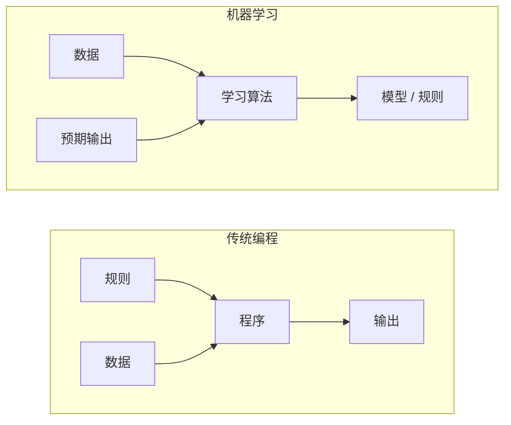
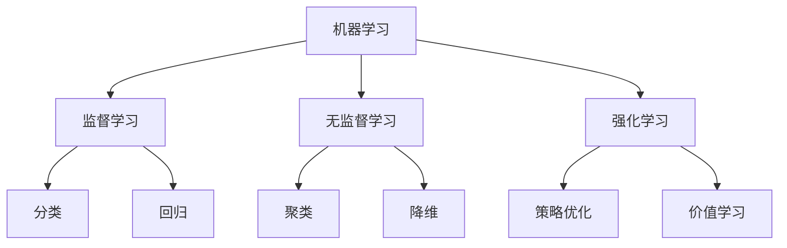
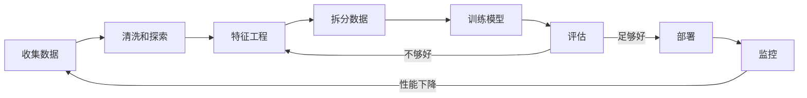
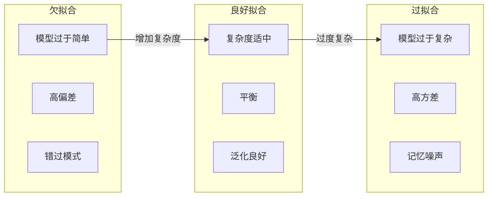
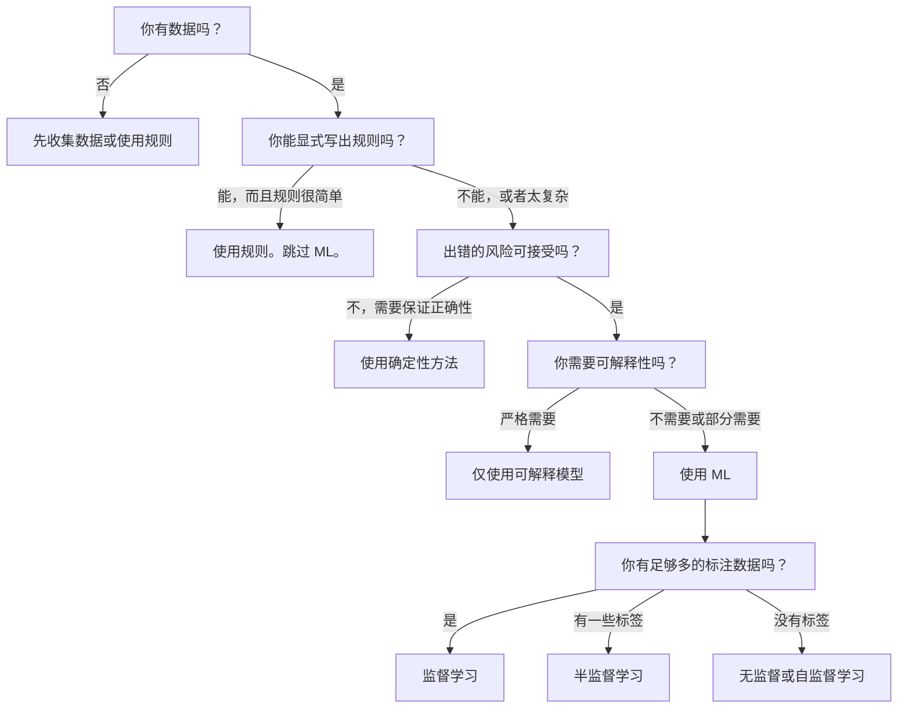

# 什么是机器学习

> 机器学习是教计算机从数据中发现模式，而不是手动编写规则。

**类型：** 学习
**语言：** Python
**前置知识：** 阶段 1（数学基础）
**时间：** ~45 分钟

## 学习目标

- 解释监督学习、无监督学习和强化学习之间的区别，并识别给定问题属于哪种类型
- 从头实现一个最近质心分类器，并与随机基线进行比较评估
- 区分分类任务和回归任务，并为每种任务选择合适的损失函数
- 评估给定的业务问题是否适合使用 ML，还是更适合用确定性规则解决

## 问题

你想构建一个垃圾邮件过滤器。传统做法：坐下来写几百条规则。"如果邮件包含'免费赚钱'，标记为垃圾邮件。如果感叹号超过 3 个，标记为垃圾邮件。"你花数周写规则。然后垃圾邮件发送者改变措辞。你的规则失效了。你写更多规则。循环永无止境。

机器学习颠覆了这种方式。你不是编写规则，而是给计算机数千封已标记的邮件（"垃圾邮件"或"非垃圾邮件"），让它自己找出规则。计算机发现了你永远想不到的模式。当垃圾邮件发送者改变策略时，你重新训练新数据，而不是重写代码。

从"编程规则"到"从数据中学习"的转变，正是机器学习的核心。每一个推荐引擎、语音助手、自动驾驶汽车和语言模型都是这样工作的。

## 概念

### 从数据中学习，而非从规则中学习

传统编程和机器学习以相反的方向解决问题。



传统编程：你编写规则。程序将规则应用于数据并产生输出。

机器学习：你提供数据和预期输出。算法发现规则。

训练后得到的"模型"就是规则，被编码为数字（权重、参数）。它从已见过的例子中泛化，对从未见过的数据进行预测。

### 机器学习的三种类型



**监督学习**：你有输入-输出对。模型学习从输入到输出的映射。
- "这里有 10,000 张标有猫或狗的照片。学习区分它们。"
- "这里有房屋特征和价格。学习预测价格。"

**无监督学习**：你只有输入，没有标签。模型自己发现结构。
- "这里有 10,000 份客户购买记录。找到自然的分组。"
- "这里有 1,000 维的数据点。在保留结构的同时降到 2 维。"

**强化学习**：智能体在环境中采取行动，获得奖励或惩罚。它学习使总奖励最大化的策略。
- "玩这个游戏。赢了 +1，输了 -1。找出策略。"
- "控制这个机械臂。捡起物品 +1，每浪费一秒 -0.01。"

在实践中，你构建的大多数模型使用监督学习。无监督学习常用于预处理和探索。强化学习驱动游戏 AI、机器人技术以及语言模型的 RLHF。

### 三大类之外的扩展

以上三种分类很清晰，但现实中的 ML 常常模糊了边界。

**半监督学习**使用少量标注数据和大量未标注数据。你可能只有 100 张标注的医学图像和 100,000 张未标注的图像。常见技术包括：

- **标签传播：** 构建连接相似数据点的图。标签通过图从标注节点传播到未标注的邻居节点。
- **伪标签：** 在标注数据上训练模型，用它为未标注数据预测标签，然后在全部数据上重新训练。模型自我引导构建训练集。
- **一致性正则化：** 模型对输入及其轻微扰动版本应给出相同的预测。即使没有标签也有效。

**自监督学习**从数据本身创造监督信号。完全不需要人工标签。模型从数据结构中创建自己的预测任务。

- **掩码语言建模（BERT）：** 隐藏句子中 15% 的词，训练模型预测缺失的词。"标签"来自原始文本。
- **对比学习（SimCLR）：** 取一张图像，创建两个增强版本。训练模型识别它们来自同一张图像，同时与来自其他图像的增强版本区分开。
- **下一词元预测（GPT）：** 根据前面所有词预测下一个词。每个文本文档都成为训练样本。

这些并不是独立于三大类的新类别。它们是结合了监督和无监督思想的策略。自监督学习在技术上是监督学习（模型在预测某样东西），但标签是自动生成的，而非人工标注。

### 分类 vs 回归

这是两大类监督学习任务。

| 方面 | 分类 | 回归 |
|------|------|------|
| 输出 | 离散类别 | 连续数值 |
| 例子 | "这封邮件是垃圾邮件吗？" | "房价是多少？" |
| 输出空间 | {猫, 狗, 鸟} | 任意实数 |
| 损失函数 | 交叉熵、准确率 | 均方误差、MAE |
| 决策 | 类别之间的边界 | 拟合数据的曲线 |

分类回答"属于哪个类别？"回归回答"多少？"

有些问题可以用两种方式来框定。预测股票上涨还是下跌是分类。预测确切价格是回归。

### 机器学习工作流

每个机器学习项目都遵循相同的流程，无论使用什么算法。



**收集数据**：获取原始数据。更多数据几乎总是更好，但质量比数量更重要。

**清洗和探索**：处理缺失值、删除重复项、可视化分布、发现异常。这一步通常占用项目总时间的 60-80%。

**特征工程**：将原始数据转换为模型可用的特征。将日期转换为星期几、归一化数值列、编码分类变量。好的特征比花哨的算法更重要。

**拆分数据**：划分为训练集、验证集和测试集。模型在训练集上训练，你在验证集上调超参数，在测试集上报告最终性能。

**训练模型**：将训练数据输入算法。算法调整内部参数以最小化损失函数。

**评估**：在验证/测试集上衡量性能。如果性能不可接受，返回尝试不同的特征、算法或超参数。

**部署**：将模型投入生产，对新数据进行预测。

**监控**：跟踪随时间变化的性能。数据分布会变化（数据漂移），模型会退化。当性能下降时，重新训练。

### 训练集、验证集和测试集的划分

这是初学者最容易搞错的最重要概念。你必须用训练期间从未见过的数据来评估模型。否则你衡量的是记忆，而不是学习。

```mermaid
flowchart LR
    subgraph 完整数据集（100%）
        direction LR
        TR[训练集 (70%)]
        VA[验证集 (15%)]
        TE[测试集 (15%)]
    end

    TR -->|训练模型| M[模型]
    M -->|调优超参数| VA
    VA -->|最终评估| TE
```

| 划分 | 用途 | 使用时机 | 典型大小 |
|------|------|---------|---------|
| 训练集 | 模型从这些数据中学习 | 训练期间 | 60-80% |
| 验证集 | 调优超参数、比较模型 | 每次训练后 | 10-20% |
| 测试集 | 最终无偏性能评估 | 只在最后使用一次 | 10-20% |

测试集是神圣的。你只看它一次。如果你根据测试性能不断调整模型，你实际上就是在用测试集训练，报告的数字毫无意义。

对于小数据集，使用 k 折交叉验证：将数据分成 k 份，在 k-1 份上训练，在剩余一份上验证，轮换并平均结果。

### 过拟合 vs 欠拟合



**欠拟合**：模型过于简单，无法捕捉数据中的模式。试图用直线拟合曲线关系。训练误差高，测试误差高。

**过拟合**：模型过于复杂，记住了训练数据及其噪声。一条弯曲的曲线穿过每个训练点，但在新数据上失败。训练误差低，测试误差高。

**良好拟合**：模型捕捉到真实模式而不记忆噪声。训练误差和测试误差都相当低。

过拟合的迹象：
- 训练准确率远高于验证准确率
- 模型在训练数据上表现良好，但在新数据上表现差
- 增加更多训练数据能改善性能（说明模型在记忆，而不是学习）

过拟合的修复方法：
- 获取更多训练数据
- 降低模型复杂度（更少的参数、更简单的架构）
- 正则化（对大权重添加惩罚）
- Dropout（训练时随机将神经元置零）
- 早停（当验证误差开始增大时停止训练）

欠拟合的修复方法：
- 使用更复杂的模型
- 添加更多特征
- 减少正则化
- 更长时间的训练

### 偏差-方差权衡

这是过拟合和欠拟合背后的数学框架。

**偏差**：由模型中错误的假设引起的误差。当真实关系是非线性时，线性模型具有高偏差。高偏差导致欠拟合。

**方差**：由对训练数据中微小波动的敏感性引起的误差。高方差模型在不同数据子集上训练时会产生非常不同的预测。高方差导致过拟合。

| 模型复杂度 | 偏差 | 方差 | 结果 |
|-----------|------|------|------|
| 太低（用线性模型拟合曲线数据） | 高 | 低 | 欠拟合 |
| 恰到好处 | 中等 | 中等 | 良好泛化 |
| 太高（用 20 次多项式拟合 10 个点） | 低 | 高 | 过拟合 |

总误差 = 偏差^2 + 方差 + 不可约噪声

你无法减少不可约噪声（它是数据本身中的随机性）。你需要找到偏差^2 与方差之和最小的最佳点。

### 没有免费午餐定理

不存在对所有问题都表现最好的单一算法。在一类问题上表现良好的算法，在另一类问题上可能表现很差。这就是数据科学家会尝试多种算法并比较结果的原因。

在实践中，选择取决于：
- 你有多少数据
- 有多少特征
- 关系是线性还是非线性
- 是否需要可解释性
- 你能承受多少计算资源

### 何时不使用机器学习

机器学习很强大，但并非总是合适的工具。在你拿模型解决问题之前，先问一下你是否真的需要模型。

**在以下情况下不要使用机器学习：**

- **规则简单且定义明确。** 税收计算、排序算法、单位换算。如果你能用几条 if 语句写出逻辑，模型只会增加复杂度而没有收益。
- **你没有数据或数据极少。** ML 需要例子来学习。只有 10 个数据点，你无法训练出任何有意义的东西。先收集数据。
- **出错的代价是灾难性的，且需要保证正确性。** 医疗剂量计算、核反应堆控制、加密验证。ML 模型是概率性的。它们有时会出错。如果"有时出错"不可接受，请使用确定性方法。
- **查找表或启发式方法能解决问题。** 如果简单的阈值或表格能覆盖 99% 的情况，添加 ML 只会增加维护成本而没有有意义的改进。
- **你无法解释决策，且可解释性是必需的。** 受监管的行业（贷款、保险、刑事司法）有时要求每个决策完全可解释。有些 ML 模型是可解释的（线性回归、小型决策树）。大多数不是。
- **问题的变化速度快于你重新训练的速度。** 如果规则每天都在变化，而重新训练需要一周，模型总是过时的。

使用这个决策流程：



## 构建它

`code/ml_intro.py` 中的代码从头实现了一个最近质心分类器，这是最简单的机器学习算法。它展示了核心理念：从数据中学习，然后对新数据进行预测。

### 第 1 步：从头实现最近质心分类器

最近质心分类器计算训练数据中每个类别的中心（均值）。为了预测，它将每个新点分配给中心最近的那个类别。

```python
class NearestCentroid:
    def fit(self, X, y):
        self.classes = np.unique(y)
        self.centroids = np.array([
            X[y == c].mean(axis=0) for c in self.classes
        ])

    def predict(self, X):
        distances = np.array([
            np.sqrt(((X - c) ** 2).sum(axis=1))
            for c in self.centroids
        ])
        return self.classes[distances.argmin(axis=0)]
```

这就是整个算法。拟合计算两个均值。预测计算距离。没有梯度下降，没有迭代，没有超参数。

### 第 2 步：在合成数据上训练

我们生成一个二维分类数据集，包含两个略有重叠的类别。质心分类器在类别中心之间画出一条线性决策边界。

```python
rng = np.random.RandomState(42)
X_class0 = rng.randn(100, 2) + np.array([1.0, 1.0])
X_class1 = rng.randn(100, 2) + np.array([-1.0, -1.0])
X = np.vstack([X_class0, X_class1])
y = np.array([0] * 100 + [1] * 100)
```

### 第 3 步：与基线比较

每个 ML 模型都应该与一个简单基线进行比较。这里的基线是随机预测一个类别。如果你的 ML 模型不能超过随机猜测，那就有问题了。

```python
baseline_preds = rng.choice([0, 1], size=len(y_test))
baseline_acc = np.mean(baseline_preds == y_test)
```

质心分类器在这个干净数据集上应该能达到 90%+ 的准确率。随机基线大约在 50%。

### 为什么这很重要

最近质心分类器极其简单。它没有超参数、没有迭代、没有梯度下降。但它抓住了机器学习的基本模式：

1. **学习**——从训练数据中学习一个表示（质心）
2. **预测**——使用该表示对新数据进行预测（最近距离）
3. **评估**——与基线比较（随机猜测）

从逻辑回归到 Transformer，每个 ML 算法都遵循同样的三步模式。表示变得越来越复杂，但工作流保持不变。

### 第 4 步：质心分类器不能做什么

最近质心分类器假设每个类别形成一个单独的团块。它画出线性的决策边界。当以下情况发生时，它会失败：

- 类别有多个簇（例如，数字"1"可以有多种写法）
- 决策边界是非线性的（例如，一个类别包围了另一个类别）
- 特征的尺度差异很大（距离被最大尺度的特征主导）

这些局限性驱动了你将学习的每一种其他算法。K 近邻处理多个簇。决策树处理非线性边界。特征缩放解决了尺度问题。每一课都建立在上一课的局限性之上。

## 使用它

sklearn 提供了 `NearestCentroid` 和合成数据生成器：

```python
from sklearn.neighbors import NearestCentroid
from sklearn.datasets import make_classification
from sklearn.model_selection import train_test_split

X, y = make_classification(
    n_samples=500, n_features=2, n_redundant=0,
    n_clusters_per_class=1, random_state=42
)
X_train, X_test, y_train, y_test = train_test_split(X, y, test_size=0.3)

clf = NearestCentroid()
clf.fit(X_train, y_train)
print(f"Accuracy: {clf.score(X_test, y_test):.3f}")
```

## 交付物

本课程产出 `outputs/prompt-ml-problem-framer.md`——一个将模糊的业务问题转化为具体 ML 任务的提示词。给定一个问题描述（"我们想降低客户流失率"或"预测下季度的需求"），它能识别学习类型、定义预测目标、列出候选特征、选择成功指标、建立基线，并标记数据泄露或类别不平衡等陷阱。在任何 ML 项目开始时使用它，以避免构建错误的东西。

## 关键术语

| 术语 | 人们说的 | 实际含义 |
|------|---------|---------|
| 模型 | "那个 AI" | 一个带有可学习参数的数学函数，将输入映射到输出 |
| 训练 | "教 AI" | 运行优化算法调整模型参数，使预测与已知输出匹配 |
| 特征 | "输入列" | 数据的一个可测量的属性，模型用它来做预测 |
| 标签 | "答案" | 训练样本的已知输出，用于计算误差信号 |
| 超参数 | "你要调的一个设置" | 训练前设置的参数，控制学习过程（学习率、层数） |
| 损失函数 | "模型有多离谱" | 衡量预测值与实际值差距的函数，训练试图将其最小化 |
| 过拟合 | "它背下了测试题的答案" | 模型学会了训练特有的噪声而不是通用模式，在新数据上失败 |
| 欠拟合 | "它什么都没学到" | 模型过于简单，无法捕捉数据中的真实模式 |
| 泛化 | "在新数据上也管用" | 模型对未训练过的数据做出准确预测的能力 |
| 交叉验证 | "在不同的块上测试" | 反复将数据拆分为训练/测试折并平均结果，得到更稳健的性能估计 |
| 正则化 | "让权重保持小" | 在损失函数中添加惩罚项，阻止模型过于复杂 |
| 数据漂移 | "世界变了" | 输入数据的统计分布随时间变化，导致模型性能下降 |

## 练习

1. 取任意数据集（如 Iris、Titanic）。按 70/15/15 拆分为训练/验证/测试。解释为什么你不应该在测试集上调超参数。
2. 列出三个现实世界的问题。对每个问题，识别它是分类、回归还是聚类，是监督还是无监督。
3. 一个模型在训练数据上达到 99% 的准确率，但在测试数据上只有 60%。诊断问题并列出你会尝试修复的三种方法。

## 延伸阅读

- [An Introduction to Statistical Learning](https://www.statlearning.com/)——免费教科书，涵盖所有经典 ML 方法并提供实用示例
- [Google's Machine Learning Crash Course](https://developers.google.com/machine-learning/crash-course)——简洁直观的 ML 概念入门
- [Scikit-learn User Guide](https://scikit-learn.org/stable/user_guide.html)——在 Python 中实现 ML 的实用参考
