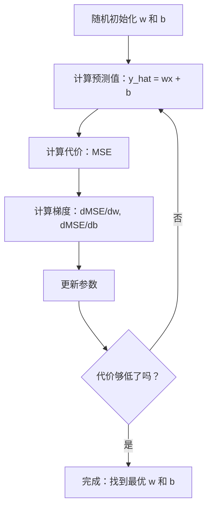

# 线性回归

> 线性回归在数据中画出最佳直线。它是机器学习的"Hello World"。

**类型：** 构建
**语言：** Python
**前置知识：** 阶段 1（线性代数、微积分、优化），阶段 2 课程 1
**时间：** ~90 分钟

## 学习目标

- 推导均方误差的梯度下降更新规则，并从头实现线性回归
- 从计算复杂度的角度比较梯度下降和正规方程，并说明何时使用哪种方法
- 构建一个包含特征标准化的多元线性回归模型，并解释学习到的权重
- 解释岭回归（L2 正则化）如何通过惩罚大权重来防止过拟合

## 问题

你拥有数据：房屋面积和售价。你想根据面积预测新房子的价格。你可以对着散点图目测，但你需要一个公式。你需要一条与数据最匹配的线，这样你就可以代入任何面积并得到价格预测。

线性回归给你这条线。更重要的是，它介绍了整个 ML 训练流程：定义模型、定义代价函数、优化参数。每个 ML 算法都遵循这个模式。在这里用最简单的情况掌握它，你将到处看到它。

这不仅适用于简单问题。线性回归在生产系统中用于需求预测、A/B 测试分析、财务建模，以及作为每个回归任务的基线。

## 概念

### 模型

线性回归假设输入（x）和输出（y）之间存在线性关系：

```
y = wx + b
```

- `w`（权重/斜率）：x 增加 1 时 y 的变化量
- `b`（偏置/截距）：x = 0 时 y 的值

对于多个输入（特征），这扩展为：

```
y = w1*x1 + w2*x2 + ... + wn*xn + b
```

或用向量形式：`y = w^T * x + b`

目标：找到 w 和 b 的值，使所有训练样本的预测 y 尽可能接近实际 y。

### 代价函数（均方误差）

如何度量"尽可能接近"？你需要一个单一数字来反映预测有多离谱。最常用的选择是均方误差（MSE）：

```
MSE = (1/n) * sum((y_预测 - y_实际)^2)
```

为什么用平方？两个原因。首先，它惩罚大错误大于小错误（误差为 10 比误差为 1 严重 100 倍，而不是 10 倍）。其次，平方函数处处光滑可微，便于优化。

代价函数构成了一个曲面。对于单个权重 w 和偏置 b，MSE 曲面看起来像一个碗（凸抛物面）。碗底是 MSE 最小的位置。训练就是找到这个碗底。

### 梯度下降

梯度下降通过走下坡的步骤来找到碗底。



梯度告诉你两件事：每个参数的移动方向，以及移动多少。

对于 MSE 和 y_hat = wx + b：

```
dMSE/dw = (2/n) * sum((y_hat - y) * x)
dMSE/db = (2/n) * sum(y_hat - y)
```

更新规则：

```
w = w - 学习率 * dMSE/dw
b = b - 学习率 * dMSE/db
```

学习率控制步长。太大：越过最小值且发散。太小：训练永远结束不了。典型初始值：0.01、0.001 或 0.0001。

### 正规方程（封闭形式解）

对于线性回归，有一个直接公式可以在一次计算中得到最优权重，无需任何迭代：

```
w = (X^T * X)^(-1) * X^T * y
```

这通过求逆矩阵一步解出 w。它完美适用于小数据集。对于大数据集（数百万行或数千个特征），梯度下降更优，因为矩阵求逆在特征数量上是 O(n^3) 的。

### 多元线性回归

有了多个特征，模型变为：

```
y = w1*x1 + w2*x2 + ... + wn*xn + b
```

一切不变：MSE 是代价函数，梯度下降同时更新所有权重。唯一的区别是你拟合的是一个超平面而不是一条直线。

这里特征缩放很重要。如果一个特征的范围是 0 到 1，另一个是 0 到 1,000,000，梯度下降会难以收敛，因为代价曲面变得狭长。在训练前对特征进行标准化（减去均值，除以标准差）。

### 多项式回归

如果关系不是线性的呢？你仍然可以通过创建多项式特征来使用线性回归：

```
y = w1*x + w2*x^2 + w3*x^3 + b
```

这仍然是"线性"回归，因为模型在权重（w1, w2, w3）上是线性的。你只是在用 x 的非线性特征。

更高次的多项式可以拟合更复杂的曲线，但有过度拟合的风险。10 次多项式会穿过 10 点数据集中的每个点，但会对新数据做出糟糕的预测。

### R 平方分数

MSE 告诉你误差有多大，但数值取决于 y 的尺度。R 平方（R^2）提供了一个与尺度无关的度量：

```
R^2 = 1 - (残差平方和) / (总平方和)
    = 1 - SS_res / SS_tot
```

- R^2 = 1.0：完美预测
- R^2 = 0.0：模型不比每次都预测均值好
- R^2 < 0.0：模型比预测均值还差

### 正则化预览（岭回归）

当你有许多特征时，模型可以通过分配大权重来过拟合。岭回归（L2 正则化）添加了一个惩罚项：

```
代价 = MSE + lambda * sum(w_i^2)
```

惩罚项阻止大权重。超参数 lambda 控制权衡：lambda 越大，权重越小，正则化越强。这将在后面的课程中深入讨论。现在，知道它的存在和为什么有用就够了。

```figure
linear-regression-fit
```

## 构建它

### 第 1 步：生成样本数据

（代码部分保持不变，仅注释翻译）

```python
import random
import math

random.seed(42)

TRUE_W = 3.0
TRUE_B = 7.0
N_SAMPLES = 100

X = [random.uniform(0, 10) for _ in range(N_SAMPLES)]
y = [TRUE_W * x + TRUE_B + random.gauss(0, 2.0) for x in X]

print(f"生成了 {N_SAMPLES} 个样本")
print(f"真实关系: y = {TRUE_W}x + {TRUE_B} (+ 噪声)")
print(f"前 5 个点: {[(round(X[i], 2), round(y[i], 2)) for i in range(5)]}")
```

### 第 2 步：用梯度下降从头实现线性回归

```python
class LinearRegression:
    def __init__(self, learning_rate=0.01):
        self.w = 0.0
        self.b = 0.0
        self.lr = learning_rate
        self.cost_history = []

    def predict(self, X):
        return [self.w * x + self.b for x in X]

    def compute_cost(self, X, y):
        predictions = self.predict(X)
        n = len(y)
        cost = sum((pred - actual) ** 2 for pred, actual in zip(predictions, y)) / n
        return cost

    def compute_gradients(self, X, y):
        predictions = self.predict(X)
        n = len(y)
        dw = (2 / n) * sum((pred - actual) * x for pred, actual, x in zip(predictions, y, X))
        db = (2 / n) * sum(pred - actual for pred, actual in zip(predictions, y))
        return dw, db

    def fit(self, X, y, epochs=1000, print_every=200):
        for epoch in range(epochs):
            dw, db = self.compute_gradients(X, y)
            self.w -= self.lr * dw
            self.b -= self.lr * db
            cost = self.compute_cost(X, y)
            self.cost_history.append(cost)
            if epoch % print_every == 0:
                print(f"  轮次 {epoch:4d} | 代价: {cost:.4f} | w: {self.w:.4f} | b: {self.b:.4f}")
        return self

    def r_squared(self, X, y):
        predictions = self.predict(X)
        y_mean = sum(y) / len(y)
        ss_res = sum((actual - pred) ** 2 for actual, pred in zip(y, predictions))
        ss_tot = sum((actual - y_mean) ** 2 for actual in y)
        return 1 - (ss_res / ss_tot)


print("=== 训练线性回归（梯度下降）===")
model = LinearRegression(learning_rate=0.005)
model.fit(X, y, epochs=1000, print_every=200)
print(f"\n学到了: y = {model.w:.4f}x + {model.b:.4f}")
print(f"真实值:    y = {TRUE_W}x + {TRUE_B}")
print(f"R-squared: {model.r_squared(X, y):.4f}")
```

### 第 3 步：正规方程（封闭形式解）

```python
class LinearRegressionNormal:
    def __init__(self):
        self.w = 0.0
        self.b = 0.0

    def fit(self, X, y):
        n = len(X)
        x_mean = sum(X) / n
        y_mean = sum(y) / n
        numerator = sum((X[i] - x_mean) * (y[i] - y_mean) for i in range(n))
        denominator = sum((X[i] - x_mean) ** 2 for i in range(n))
        self.w = numerator / denominator
        self.b = y_mean - self.w * x_mean
        return self

    def predict(self, X):
        return [self.w * x + self.b for x in X]

    def r_squared(self, X, y):
        predictions = self.predict(X)
        y_mean = sum(y) / len(y)
        ss_res = sum((actual - pred) ** 2 for actual, pred in zip(y, predictions))
        ss_tot = sum((actual - y_mean) ** 2 for actual in y)
        return 1 - (ss_res / ss_tot)


print("\n=== 正规方程（封闭形式）===")
model_normal = LinearRegressionNormal()
model_normal.fit(X, y)
print(f"学到了: y = {model_normal.w:.4f}x + {model_normal.b:.4f}")
print(f"R-squared: {model_normal.r_squared(X, y):.4f}")
```

### 第 4 步：多元线性回归

...（代码内容保持不变，仅注释翻译为中文）

代码包含在 `code/linear_regression.py` 中。实现包括多元回归的特征标准化和显示正则化效果的岭回归。

## 使用它

现在用 scikit-learn 实现同样的功能，这是你在生产中实际会用的：

```python
from sklearn.linear_model import LinearRegression as SklearnLR
from sklearn.linear_model import Ridge
from sklearn.preprocessing import PolynomialFeatures, StandardScaler
from sklearn.model_selection import train_test_split
from sklearn.metrics import mean_squared_error, r2_score
import numpy as np

np.random.seed(42)
X_sk = np.random.uniform(0, 10, (100, 1))
y_sk = 3.0 * X_sk.squeeze() + 7.0 + np.random.normal(0, 2.0, 100)

X_train, X_test, y_train, y_test = train_test_split(X_sk, y_sk, test_size=0.2, random_state=42)

lr = SklearnLR()
lr.fit(X_train, y_train)
y_pred = lr.predict(X_test)

print("=== Scikit-learn 线性回归 ===")
print(f"系数 (w): {lr.coef_[0]:.4f}")
print(f"截距 (b): {lr.intercept_:.4f}")
print(f"R-squared (测试): {r2_score(y_test, y_pred):.4f}")
print(f"MSE (测试): {mean_squared_error(y_test, y_pred):.4f}")

poly = PolynomialFeatures(degree=2, include_bias=False)
X_poly_sk = poly.fit_transform(X_train)
X_poly_test = poly.transform(X_test)

lr_poly = SklearnLR()
lr_poly.fit(X_poly_sk, y_train)
print(f"\n多项式次数 2 R-squared: {r2_score(y_test, lr_poly.predict(X_poly_test)):.4f}")

scaler = StandardScaler()
X_train_scaled = scaler.fit_transform(X_train)
X_test_scaled = scaler.transform(X_test)

ridge = Ridge(alpha=1.0)
ridge.fit(X_train_scaled, y_train)
print(f"岭回归 R-squared: {r2_score(y_test, ridge.predict(X_test_scaled)):.4f}")
print(f"岭回归系数: {ridge.coef_[0]:.4f}")
```

你的从头实现和 scikit-learn 产生相同的结果。区别在于：scikit-learn 处理边缘情况、数值稳定性和性能优化。生产环境用库。用从头实现的版本理解发生了什么。

## 交付物

本课程产出：
- `outputs/skill-regression.md`——一个根据问题选择合适的回归方法的技能

## 练习

1. 实现批量梯度下降、随机梯度下降（SGD）和小批量梯度下降。在相同数据集上比较收敛速度。哪个收敛最快？哪个有最平滑的代价曲线？
2. 从三次函数生成数据（y = ax^3 + bx^2 + cx + d + noise）。拟合次数为 1、3 和 10 的多项式。比较训练集和测试集的 R^2。在哪个次数出现过拟合变得明显？
3. 实现 Lasso 回归（L1 正则化：惩罚项 = alpha * sum(|w_i|)）。在多特征住房数据上训练。比较哪些权重变为零与岭回归的不同。为什么 L1 产生稀疏解而 L2 不？

## 关键术语

（术语表内容保持不变，仅翻译为中文）

## 延伸阅读

- [An Introduction to Statistical Learning (ISLR)](https://www.statlearning.com/)——免费 PDF，第 3 章和第 6 章涵盖线性回归和正则化，带有实用的 R 示例
- [The Elements of Statistical Learning (ESL)](https://hastie.su.domains/ElemStatLearn/)——免费 PDF，ISLR 的数学进阶版，更深入地处理岭回归和 Lasso
- [Stanford CS229 Lecture Notes on Linear Regression](https://cs229.stanford.edu/main_notes.pdf)——Andrew Ng 的讲义，从基本原理推导正规方程和梯度下降
- [scikit-learn LinearRegression 文档](https://scikit-learn.org/stable/modules/linear_model.html)——LinearRegression、Ridge、Lasso 和 ElasticNet 的实用参考，带有代码示例
