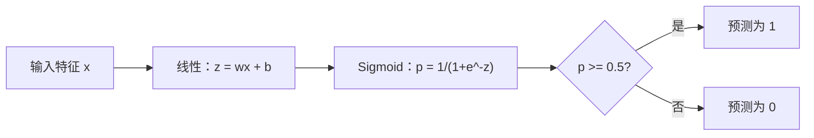

# 逻辑回归

> 逻辑回归将一条直线弯曲成 S 形曲线，用概率回答是或否的问题。

**类型：** 构建
**语言：** Python
**前置知识：** 阶段 2 课程 1-2（什么是 ML、线性回归）
**时间：** ~90 分钟

## 学习目标

- 使用 Sigmoid 函数和二值交叉熵损失从头实现逻辑回归
- 计算并解释精确率、召回率、F1 分数和混淆矩阵，用于二分类
- 解释为什么 MSE 不适合分类，以及为什么二值交叉熵产生凸代价曲面
- 构建一个用于多分类的 Softmax 回归模型，并评估阈值调优的权衡

## 问题

你想根据肿瘤大小预测其是恶性还是良性。你尝试线性回归。它输出像 0.3、1.7 或 -0.5 这样的数字。这些是什么意思？1.7 是"非常恶性"吗？-0.5 是"非常良性"吗？线性回归输出无界数字。分类需要介于 0 和 1 之间的有界概率，以及一个清晰的决策：是或否。

逻辑回归解决了这个问题。它取相同的线性组合（wx + b），通过 Sigmoid 函数将其压缩到 (0, 1) 范围内。输出是一个概率。你设置一个阈值（通常是 0.5）并做出决策。

这是实践中使用最广泛的算法之一。尽管名字里有"回归"，逻辑回归实际上是一个分类算法。这个名字来源于它使用的逻辑（Sigmoid）函数。

## 概念

### 为什么线性回归不适合分类

想象一下根据学习小时数预测及格/不及格（1/0）。线性回归在数据中拟合一条线：

```
学习小时数：1   2   3   4   5   6   7   8   9   10
实际结果：   0   0   0   0   1   1   1   1   1   1
```

线性拟合可能在第 1 小时产生 -0.2 的预测，在第 10 小时产生 1.3 的预测。这些值不是概率。它们低于 0 和高于 1。更糟糕的是，一个异常值（学习了 50 小时的人）会拖动整条线，改变每个人的预测。

分类需要一个具有以下性质的函数：
- 输出介于 0 和 1 之间的值（概率）
- 产生一个陡峭的过渡（决策边界）
- 不会被远离边界的异常值扭曲

### Sigmoid 函数

Sigmoid 函数正好做到这一点：

```
sigmoid(z) = 1 / (1 + e^(-z))
```

性质：
- 当 z 很大且为正时，sigmoid(z) 接近 1
- 当 z 很大且为负时，sigmoid(z) 接近 0
- 当 z = 0 时，sigmoid(z) = 0.5
- 输出始终在 0 和 1 之间
- 函数处处光滑可微

导数有一个简洁的形式：sigmoid'(z) = sigmoid(z) * (1 - sigmoid(z))。这使得梯度计算高效。

### 逻辑回归 = 线性模型 + Sigmoid

模型计算 z = wx + b（与线性回归相同），然后应用 sigmoid：



输出 p 被解释为 P(y=1 | x)，即输入属于类别 1 的概率。决策边界在 wx + b = 0 处，此时 sigmoid 输出恰好为 0.5。

### 二值交叉熵损失

你不能在逻辑回归中使用 MSE。MSE 配合 sigmoid 会创建一个具有许多局部最小值的非凸代价曲面。改用二值交叉熵（对数损失）：

```
损失 = -(1/n) * sum(y * log(p) + (1-y) * log(1-p))
```

为什么这样有效：
- 当 y=1 且 p 接近 1 时：log(1) = 0，损失接近 0（正确，低成本）
- 当 y=1 且 p 接近 0 时：log(0) 接近负无穷，损失巨大（错误，高成本）
- 当 y=0 且 p 接近 0 时：log(1) = 0，损失接近 0（正确，低成本）
- 当 y=0 且 p 接近 1 时：log(0) 接近负无穷，损失巨大（错误，高成本）

这个损失函数对于逻辑回归是凸的，保证了单一全局最小值。

### 逻辑回归的梯度下降

二值交叉熵配合 sigmoid 的梯度有一个简洁的形式：

```
dL/dw = (1/n) * sum((p - y) * x)
dL/db = (1/n) * sum(p - y)
```

这些看起来与线性回归的梯度相同。区别在于 p = sigmoid(wx + b) 而不是 p = wx + b。Sigmoid 引入了非线性，但梯度更新规则保持不变。

```mermaid
flowchart TD
    A[初始化 w=0, b=0] --> B[前向传播：z = wx+b, p = sigmoid(z)]
    B --> C[计算损失：二值交叉熵]
    C --> D["计算梯度：dw = (1/n) * sum((p-y)*x)"]
    D --> E[更新：w = w - lr*dw, b = b - lr*db]
    E --> F{收敛了吗？}
    F -->|否| B
    F -->|是| G[模型已训练]
```

### 决策边界

对于二维输入（两个特征），决策边界是直线：

```
w1*x1 + w2*x2 + b = 0
```

一侧的点被分类为 1，另一侧的点被分类为 0。逻辑回归总是产生线性决策边界。如果你需要弯曲的边界，要么添加多项式特征，要么使用非线性模型。

### 多分类与 Softmax

二值逻辑回归处理两个类别。对于 k 个类别，使用 softmax 函数：

```
softmax(z_i) = e^(z_i) / sum(e^(z_j) for all j)
```

每个类别有自己的权重向量。模型为每个类别计算分数 z_i，然后 softmax 将分数转换为总和为 1 的概率。预测的类别是概率最高的那个。

损失函数变为分类交叉熵：

```
损失 = -(1/n) * sum(sum(y_k * log(p_k)))
```

其中 y_k 对真实类别为 1，对其他所有类别为 0（独热编码）。

### 评估指标

仅靠准确率是不够的。对于一个包含 95% 负例和 5% 正例的数据集，一个始终预测负例的模型可以达到 95% 的准确率，但毫无用处。

**混淆矩阵：**

| | 预测为正 | 预测为负 |
|---|---|---|
| 实际为正 | 真正例 (TP) | 假负例 (FN) |
| 实际为负 | 假正例 (FP) | 真负例 (TN) |

**精确率：** 在所有预测为正例的结果中，有多少是真正的正例？
```
精确率 = TP / (TP + FP)
```

**召回率（灵敏度）：** 在所有实际正例中，我们找出了多少？
```
召回率 = TP / (TP + FN)
```

**F1 分数：** 精确率和召回率的调和平均。平衡两个指标。
```
F1 = 2 * (精确率 * 召回率) / (精确率 + 召回率)
```

何时优先考虑：
- **精确率**：当假正例代价高时（垃圾邮件过滤器，你不希望屏蔽正常邮件）
- **召回率**：当假负例代价高时（癌症筛查，你不希望漏掉肿瘤）
- **F1**：当你需要一个单一的平衡指标时

```figure
logistic-sigmoid
```

## 构建它

代码包含在 `code/logistic_regression.py` 中。实现了从梯度下降拟合到混淆矩阵计算的完整端到端流程。关键部分包括：

- 从头实现的逻辑回归类，带 `predict_proba`、`predict`、`fit` 方法
- 从头实现的分类指标类，带 `confusion_matrix`、`precision`、`recall`、`f1`
- 用于 3 类分类的 Softmax 回归
- 显示精确率-召回率权衡的阈值调优

## 使用它

现在用 scikit-learn 实现同样的功能：

```python
from sklearn.linear_model import LogisticRegression as SklearnLR
from sklearn.metrics import accuracy_score, precision_score, recall_score, f1_score
from sklearn.metrics import confusion_matrix, classification_report
from sklearn.model_selection import train_test_split
from sklearn.preprocessing import StandardScaler
import numpy as np

np.random.seed(42)
X_0 = np.random.randn(100, 2) + [2, 2]
X_1 = np.random.randn(100, 2) + [5, 5]
X_sk = np.vstack([X_0, X_1])
y_sk = np.array([0] * 100 + [1] * 100)

X_tr, X_te, y_tr, y_te = train_test_split(X_sk, y_sk, test_size=0.2, random_state=42)

scaler = StandardScaler()
X_tr_sc = scaler.fit_transform(X_tr)
X_te_sc = scaler.transform(X_te)

lr = SklearnLR()
lr.fit(X_tr_sc, y_tr)
y_pred = lr.predict(X_te_sc)

print("=== Scikit-learn 逻辑回归 ===")
print(f"准确率:  {accuracy_score(y_te, y_pred):.4f}")
print(f"精确率: {precision_score(y_te, y_pred):.4f}")
print(f"召回率:    {recall_score(y_te, y_pred):.4f}")
print(f"F1:        {f1_score(y_te, y_pred):.4f}")
print(f"\n混淆矩阵:\n{confusion_matrix(y_te, y_pred)}")
print(f"\n分类报告:\n{classification_report(y_te, y_pred)}")
```

你的从头实现产生相同的决策边界和指标。Scikit-learn 增加了求解器选项（liblinear、lbfgs、saga）、自动正则化、多类策略（一对多、多项式）和数值稳定性优化。

## 交付物

本课程产出：
- `code/logistic_regression.py`——带完整指标的从头实现的逻辑回归

## 练习

1. 生成一个**不是**线性可分的数据集（例如两个同心圆）。训练逻辑回归并观察其失败。然后添加多项式特征（x1^2、x2^2、x1*x2）并再次训练。显示准确率提高了。
2. 为 3 类 softmax 模型实现一个多类混淆矩阵。计算每个类别的精确率和召回率。哪个类别最难分类？
3. 从头构建 ROC 曲线。取 100 个从 0 到 1 的阈值，计算真正例率和假正例率。使用梯形法则计算 AUC（曲线下面积）。

## 关键术语

| 术语 | 含义 |
|------|------|
| 逻辑回归 | 一个线性模型后接 sigmoid 函数，输出类别概率 |
| Sigmoid 函数 | 函数 1/(1+e^(-z))，将任意实数映射到 (0, 1) 范围 |
| 二值交叉熵 | 损失函数 -[y*log(p) + (1-y)*log(1-p)]，严重惩罚自信的错误预测 |
| 决策边界 | 模型输出概率等于 0.5 的曲面，分隔预测的类别 |
| Softmax | 将分数向量转换为总和为 1 的概率的函数 |
| 精确率 | TP / (TP + FP)，阳性预测中实际为阳性的比例 |
| 召回率 | TP / (TP + FN)，实际阳性中被模型正确识别的比例 |
| F1 分数 | 精确率和召回率的调和平均：2*P*R / (P+R) |
| 混淆矩阵 | 显示每对类别的 TP、TN、FP、FN 计数的表格 |
| 阈值 | 模型预测为正类别的概率阈值（默认为 0.5，可调） |
| 独热编码 | 将类别 k 表示为一个全零向量，在第 k 位为 1 |
| 分类交叉熵 | 二值交叉熵到 k 个类别的扩展，使用独热编码标签 |

## 延伸阅读

- [An Introduction to Statistical Learning](https://www.statlearning.com/)——第 4 章涵盖逻辑回归和多类分类
- [Scikit-learn 逻辑回归文档](https://scikit-learn.org/stable/modules/linear_model.html#logistic-regression)——逻辑回归求解器和正则化的实用参考
- [CS229 分类讲义](https://cs229.stanford.edu/main_notes.pdf)——Andrew Ng 关于逻辑回归和 softmax 的推导笔记
