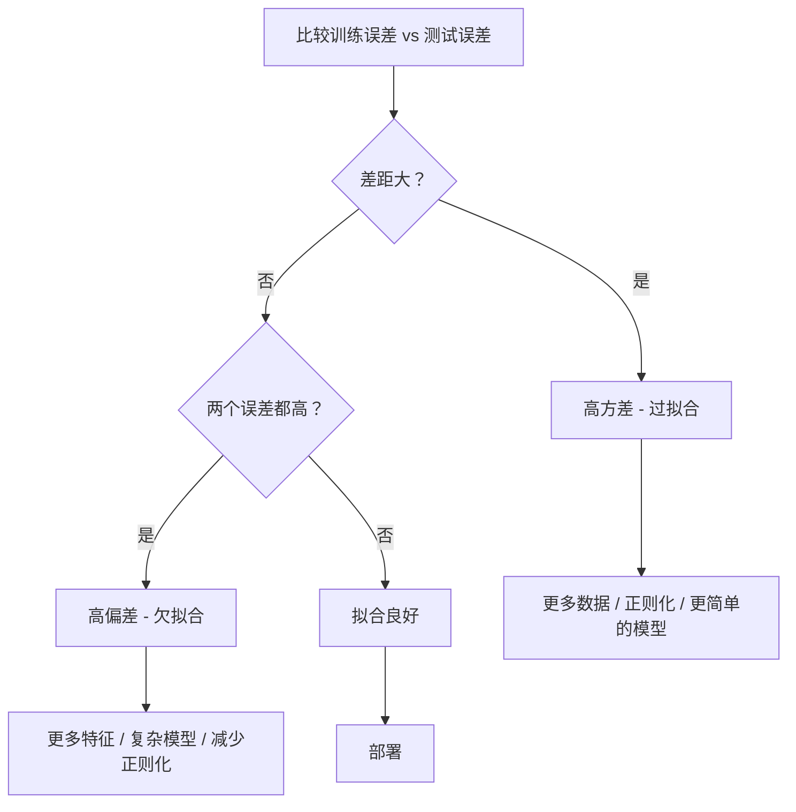
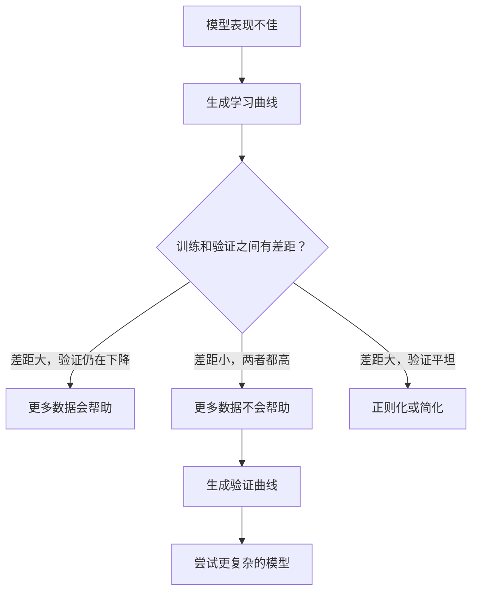

# 偏差-方差权衡

> 每个模型的误差都来自三个来源之一：偏差、方差或噪声。你只能控制前两个。

**类型：** 学习
**语言：** Python
**前置知识：** 阶段 2，课程 01-09（ML 基础、回归、分类、评估）
**时间：** ~75 分钟

## 学习目标

- 推导期望预测误差的偏差-方差分解，并解释不可约噪声的作用
- 使用训练和测试误差模式诊断模型是否遭受高偏差或高方差
- 解释正则化技术（L1、L2、dropout、早停）如何用偏差换取方差
- 实现可视化不同复杂度模型之间偏差-方差权衡的实验

## 问题

你训练了一个模型。它在测试数据上有一些误差。这些误差来自哪里？

如果你的模型太简单（弯曲数据集上的线性回归），它会始终错过真实模式。那是偏差。如果你的模型太复杂（15 个数据点上的 20 次多项式），它会完美拟合训练数据但在新数据上给出截然不同的预测。那是方差。

对于固定的模型容量，你不能同时最小化两者。降低偏差，方差就上升。降低方差，偏差就上升。理解这种权衡是机器学习中最有用的诊断技能。它告诉你应该让模型更复杂还是更简单，是获取更多数据还是设计更好的特征，是多正则化还是少正则化。

## 概念

### 偏差：系统性误差

偏差衡量模型平均预测与真实值之间的距离。如果你在从同一分布中抽取的许多不同训练集上训练同一个模型并平均这些预测，偏差就是该平均值与真实值之间的差距。

高偏差意味着模型过于僵化，无法捕捉真实模式。拟合抛物线的一条直线总会偏离曲线，无论你给它多少数据。这就是欠拟合。

```
高偏差（欠拟合）：
  模型总是预测大致相同的错误结果。
  训练误差：高
  测试误差：高
  两者差距：小
```

### 方差：对训练数据的敏感性

方差衡量当你在数据的不同子集上训练时，你的预测变化有多大。如果训练集中的微小变化导致模型的巨大变化，方差就很大。

高方差意味着模型在拟合训练数据中的噪声，而非潜在的信号。一个 20 次多项式会穿过每一个训练点，但在它们之间剧烈振荡。这就是过拟合。

```
高方差（过拟合）：
  模型完美拟合训练数据但在新数据上失败。
  训练误差：低
  测试误差：高
  两者差距：大
```

### 分解

对于任何点 x，在平方损失下的期望预测误差精确分解为：

```
期望误差 = 偏差^2 + 方差 + 不可约噪声

其中：
  偏差^2   = (E[f_hat(x)] - f(x))^2
  方差 = E[(f_hat(x) - E[f_hat(x)])^2]
  噪声    = E[(y - f(x))^2]             (sigma^2)
```

- `f(x)` 是真实函数
- `f_hat(x)` 是你模型的预测
- `E[...]` 是在不同训练集上的期望
- `y` 是观察到的标签（真实函数加噪声）

噪声项是不可约的。在有噪声的数据上，没有模型能比 sigma^2 做得更好。你的工作是在偏差^2 和方差之间找到正确的平衡。

### 模型复杂度 vs 误差


经典的 U 形曲线：

| 复杂度 | 偏差 | 方差 | 总误差 |
|-----------|------|----------|-------------|
| 太低 | 高 | 低 | 高（欠拟合） |
| 刚好 | 适中 | 适中 | 最低 |
| 太高 | 低 | 高 | 高（过拟合） |

### 正则化作为偏差-方差控制

正则化故意增加偏差以减小方差。它约束模型使其无法追逐噪声。

- **L2（岭回归）：** 将所有权重向零收缩。保留所有特征但减小它们的影响。
- **L1（套索）：** 将某些权重精确推至零。执行特征选择。
- **Dropout：** 训练期间随机禁用神经元。强制冗余表示。
- **早停：** 在模型完全拟合训练数据之前停止训练。

正则化强度（lambda、dropout 率、轮数）直接控制你在偏差-方差曲线上的位置。更多正则化意味着更多偏差、更少方差。

### 双重下降：现代视角

经典理论说：在理想点之后，更多复杂度总是有害的。但 2019 年以来的研究显示了一些意想不到的结果。如果你继续增加模型容量远远超过插值阈值（模型拥有足够参数完美拟合训练数据的点），测试误差可能再次下降。


这种"双重下降"现象解释了为什么超参数化神经网络（参数远多于训练样本）仍能泛化良好。经典的偏差-方差权衡并没有错，但对于现代机制来说它是不完整的。

关于双重下降的关键观察：
- 在线性模型、决策树和神经网络中都会发生
- 在插值区域，更多数据实际上可能有害（样本级双重下降）
- 更多训练轮次也会导致它（轮次级双重下降）
- 正则化平滑了峰值但并未消除它

为什么会发生这种情况？在插值阈值处，模型拥有刚好足够的容量来拟合所有训练点。它被迫进入一个穿过了每个点的非常特定的解，数据中的微小扰动会导致拟合的剧烈变化。这就是方差达到顶峰的地方。超过阈值后，模型有许多可能的解都能完美拟合数据。学习算法（例如，带有隐式正则化的梯度下降）倾向于从中选择最简单的那个。这种对简单解的隐式偏好就是超参数化模型能够泛化的原因。

| 机制 | 参数 vs 样本 | 行为 |
|--------|----------------------|----------|
| 欠参数化 | p << n | 经典权衡适用 |
| 插值阈值 | p ~ n | 方差达到顶峰，测试误差激增 |
| 超参数化 | p >> n | 隐式正则化启动，测试误差下降 |

实际上：如果你使用神经网络或大型树集成，不要在插值阈值处停下。要么保持在远低于它的位置（通过显式正则化），要么远高于它。最糟糕的位置恰好在阈值处。

### 诊断你的模型



| 症状 | 诊断 | 修复 |
|---------|-----------|-----|
| 高训练误差、高测试误差 | 偏差 | 更多特征、复杂模型、减少正则化 |
| 低训练误差、高测试误差 | 方差 | 更多数据、正则化、更简单的模型、dropout |
| 低训练误差、低测试误差 | 拟合良好 | 发布 |
| 训练误差下降、测试误差上升 | 过拟合进行中 | 早停 |

### 实用策略

**当偏差是问题时：**
- 添加多项式或交互特征
- 使用更灵活的模型（树集成代替线性）
- 降低正则化强度
- 训练更长时间（如果尚未收敛）

**当方差是问题时：**
- 获取更多训练数据
- 使用 bagging（随机森林）
- 增加正则化（更高 lambda、更多 dropout）
- 特征选择（移除噪声特征）
- 使用交叉验证及早发现

### 集成方法与方差降低

集成方法是对抗方差最实用的工具。

**Bagging（Bootstrap 聚合）** 在训练数据的不同 bootstrap 样本上训练多个模型，然后平均它们的预测。每个单独的方差很大，但平均值方差要小得多。随机森林是应用于决策树的 bagging。

为什么它在数学上有效：如果你平均 N 个独立预测，每个方差为 sigma^2，则平均值的方差为 sigma^2 / N。模型并非真正独立（它们都看到类似的数据），所以减少量小于 1/N，但仍然可观。

**Boosting** 通过顺序构建模型来降低偏差，其中每个新模型专注于先前模型的误差。梯度提升和 AdaBoost 是主要例子。如果添加太多模型，Boosting 可能会过拟合，因此你需要早停或正则化。

| 方法 | 主要效果 | 偏差变化 | 方差变化 |
|--------|---------------|-------------|-----------------|
| Bagging | 降低方差 | 不变 | 降低 |
| Boosting | 降低偏差 | 降低 | 可能增加 |
| Stacking | 两者都降低 | 取决于元学习器 | 取决于基模型 |
| Dropout | 隐式 bagging | 略微增加 | 降低 |

**实用规则：** 如果你的基础模型方差大（深树、高次多项式），使用 bagging。如果你的基础模型偏差大（浅决策桩、简单的线性模型），使用 boosting。

### 学习曲线

学习曲线将训练和验证误差绘制为训练集大小的函数。它们是你拥有的最实用的诊断工具。与单次训练/测试比较不同，学习曲线显示了模型的轨迹，并告诉你更多数据是否会有所帮助。


如何解读：

| 场景 | 训练误差 | 验证误差 | 差距 | 含义 | 怎么做 |
|----------|---------------|-----------------|-----|---------------|------------|
| 高偏差 | 高 | 高 | 小 | 模型无法捕捉模式 | 更多特征、复杂模型、减少正则化 |
| 高方差 | 低 | 高 | 大 | 模型记忆训练数据 | 更多数据、正则化、更简单的模型 |
| 良好拟合 | 适中 | 适中 | 小 | 模型泛化良好 | 发布 |
| 高方差，改进中 | 低 | 随数据增加而下降 | 缩小 | 数据可以解决的方差问题 | 收集更多数据 |
| 高偏差，平坦 | 高 | 高且平坦 | 小且平坦 | 更多数据不会帮助 | 改变模型架构 |

关键的见解：如果两条曲线都已达到平台且差距小但两者误差都高，更多数据是无用的。你需要一个更好的模型。如果差距大且仍在缩小，更多数据会有帮助。

### 如何生成学习曲线

有两种方法：

**方法 1：变化训练集大小，固定模型。** 保持模型和超参数不变。在训练数据的越来越大的子集上训练。在每个大小测量训练误差和验证误差。这是标准的学习曲线。

**方法 2：变化模型复杂度，固定数据。** 保持数据不变。扫描复杂度参数（多项式次数、树深度、层数）。在每个复杂度水平测量训练误差和验证误差。这是验证曲线，直接显示了偏置-方差权衡。

两种方法相互补充。第一种告诉你更多数据是否会有帮助。第二种告诉你不同的模型是否会有帮助。在决定下一步行动之前，同时运行两者。



```figure
bias-variance
```

## 构建它

`code/bias_variance.py` 中的代码运行完整的偏差-方差分解实验。以下是逐步的方法。

### 第 1 步：从已知函数生成合成数据

我们使用 `f(x) = sin(1.5x) + 0.5x` 加上高斯噪声。知道真实函数使我们能够计算精确的偏差和方差。

```python
def true_function(x):
    return np.sin(1.5 * x) + 0.5 * x

def generate_data(n_samples=30, noise_std=0.5, x_range=(-3, 3), seed=None):
    rng = np.random.RandomState(seed)
    x = rng.uniform(x_range[0], x_range[1], n_samples)
    y = true_function(x) + rng.normal(0, noise_std, n_samples)
    return x, y
```

### 第 2 步：Bootstrap 采样和多项式拟合

对于每个多项式次数，我们从多个 bootstrap 训练集中提取样本，拟合多项式，并在固定的测试网格上记录预测。这给出了每个测试点处预测的分布。

```python
def fit_polynomial(x_train, y_train, degree, lam=0.0):
    X = np.column_stack([x_train ** d for d in range(degree + 1)])
    if lam > 0:
        penalty = lam * np.eye(X.shape[1])
        penalty[0, 0] = 0
        w = np.linalg.solve(X.T @ X + penalty, X.T @ y_train)
    else:
        w = np.linalg.lstsq(X, y_train, rcond=None)[0]
    return w
```

我们在 200 个不同的 bootstrap 样本上拟合。每个 bootstrap 样本来自相同的底层分布但包含不同的点。

### 第 3 步：计算偏差^2、方差分解

有了每个测试点处的 200 组预测，我们可以直接从定义计算分解：

```python
mean_pred = predictions.mean(axis=0)
bias_sq = np.mean((mean_pred - y_true) ** 2)
variance = np.mean(predictions.var(axis=0))
total_error = np.mean(np.mean((predictions - y_true) ** 2, axis=1))
```

- `mean_pred` 是从 bootstrap 样本估计的 E[f_hat(x)]
- `bias_sq` 是平均预测与真实值之间的平方差距
- `variance` 是跨 bootstrap 样本的预测平均离散度
- `total_error` 应大致等于 bias^2 + variance + noise

### 第 4 步：学习曲线

学习曲线在保持模型复杂度固定的同时扫描训练集大小。它们显示你的模型是数据限制还是容量限制。

```python
def demo_learning_curves():
    sizes = [10, 15, 20, 30, 50, 75, 100, 150, 200, 300]
    degree = 5

    for n in sizes:
        train_errors = []
        test_errors = []
        for seed in range(50):
            x_train, y_train = generate_data(n_samples=n, seed=seed * 100)
            w = fit_polynomial(x_train, y_train, degree)
            train_pred = predict_polynomial(x_train, w)
            train_mse = np.mean((train_pred - y_train) ** 2)
            test_pred = predict_polynomial(x_test, w)
            test_mse = np.mean((test_pred - y_test) ** 2)
            train_errors.append(train_mse)
            test_errors.append(test_mse)
        # 跨运行取平均给出学习曲线点
```

对于高方差模型（小数据上的 5 次多项式），你看到：
- 训练误差从低开始，随着更多数据使记忆更难而增加
- 测试误差从高开始，随着模型获得更多信号而下降
- 差距随更多数据而缩小

对于高偏差模型（1 次多项式），两条曲线很快收敛到相同的较高值，更多数据没有帮助。

### 第 5 步：正则化扫描

代码还包括 `demo_regularization_sweep()`，它固定高次多项式（15 次）并扫描岭正则化强度从 0.001 到 100。这从不同角度显示了偏差-方差权衡：不是变化模型复杂度，而是变化约束强度。

```python
def demo_regularization_sweep():
    alphas = [0.001, 0.005, 0.01, 0.05, 0.1, 0.5, 1.0, 5.0, 10.0, 50.0, 100.0]
    for alpha in alphas:
        results = bias_variance_decomposition([15], lam=alpha)
        r = results[15]
        print(f"alpha={alpha:.3f}  bias={r['bias_sq']:.4f}  var={r['variance']:.4f}")
```

在低 alpha 下，15 次多项式几乎是未约束的。方差占主导地位，因为模型追逐每个 bootstrap 样本中的噪声。在高 alpha 下，惩罚如此之强，以至于模型实际上变成一个接近常数函数。偏差占主导地位。最优 alpha 位于这些极端之间。

这与通过变化多项式次数得到的 U 形曲线相同，但由连续旋钮而不是离散旋钮控制。实际上，正则化是控制权衡的首选方式，因为它允许精细控制而无需改变特征集。

## 使用它

sklearn 提供了 `learning_curve` 和 `validation_curve` 来自动化这些诊断，无需编写 bootstrap 循环。

### 验证曲线：扫描模型复杂度

```python
from sklearn.model_selection import validation_curve
from sklearn.pipeline import make_pipeline
from sklearn.preprocessing import PolynomialFeatures
from sklearn.linear_model import Ridge

degrees = list(range(1, 16))
train_scores_all = []
val_scores_all = []

for d in degrees:
    pipe = make_pipeline(PolynomialFeatures(d), Ridge(alpha=0.01))
    train_scores, val_scores = validation_curve(
        pipe, X, y, param_name="polynomialfeatures__degree",
        param_range=[d], cv=5, scoring="neg_mean_squared_error"
    )
    train_scores_all.append(-train_scores.mean())
    val_scores_all.append(-val_scores.mean())
```

这直接给出了偏差-方差权衡曲线。验证分数相对于训练分数最差的地方，方差占主导地位。两者都差的地方，偏差占主导地位。

### 学习曲线：扫描训练集大小

```python
from sklearn.model_selection import learning_curve

pipe = make_pipeline(PolynomialFeatures(5), Ridge(alpha=0.01))
train_sizes, train_scores, val_scores = learning_curve(
    pipe, X, y, train_sizes=np.linspace(0.1, 1.0, 10),
    cv=5, scoring="neg_mean_squared_error"
)
train_mse = -train_scores.mean(axis=1)
val_mse = -val_scores.mean(axis=1)
```

将 `train_mse` 和 `val_mse` 对 `train_sizes` 绘制。形状告诉你关于模型的一切。

### 带正则化扫描的交叉验证

```python
from sklearn.model_selection import cross_val_score

alphas = [0.001, 0.01, 0.1, 1.0, 10.0, 100.0]
for alpha in alphas:
    pipe = make_pipeline(PolynomialFeatures(10), Ridge(alpha=alpha))
    scores = cross_val_score(pipe, X, y, cv=5, scoring="neg_mean_squared_error")
    print(f"alpha={alpha:>7.3f}  MSE={-scores.mean():.4f} +/- {scores.std():.4f}")
```

这扫描了固定模型复杂度的正则化强度。你将看到相同的偏差-方差权衡：低 alpha 意味着高方差，高 alpha 意味着高偏差。

### 完整的诊断工作流程

实际上，你按顺序运行这些诊断：

1. 训练你的模型。计算训练和测试误差。
2. 如果两者都高：你有偏差问题。跳到第 4 步。
3. 如果训练低但测试高：你有方差问题。生成学习曲线看看更多数据是否会有帮助。如果没有，正则化。
4. 生成扫描你主要复杂度参数的验证曲线。找到理想点。
5. 在理想点处，生成学习曲线。如果差距仍然大，你需要更多数据或正则化。
6. 尝试带有不同 alpha 值的岭/套索，使用 `cross_val_score`。选择交叉验证误差最小的 alpha。

这对大多数表格数据集需要 10-15 分钟计算时间，并节省数小时的猜测。

## 交付物

本课程产出：`outputs/prompt-model-diagnostics.md`

## 练习

1. 以 `noise_std=0`（无噪声）运行分解。不可约误差项会发生什么？最优复杂度会改变吗？
2. 将训练集大小从 30 增加到 300。这对方差分量有何影响？最优多项式次数会移动吗？
3. 向实验添加 L2 正则化（岭回归）。对于固定的高次多项式（15 次），从 0 到 100 扫描 lambda。绘制 bias^2 和方差随 lambda 变化的图。
4. 将真实函数从多项式修改为 `sin(x)`。偏置-方差分解如何变化？是否仍存在清晰的优次数？
5. 实现简单的 bootstrap 聚合（bagging）包装器：在 bootstrap 样本上训练 10 个模型并平均预测。展示这能在不显著增加偏差的情况下减少方差。

## 关键术语

| 术语 | 人们说的 | 实际含义 |
|------|----------------|----------------------|
| 偏差 | "模型太简单" | 来自错误假设的系统性误差。平均模型预测与真实值之间的差距。 |
| 方差 | "模型过拟合" | 来自对训练数据敏感性的误差。预测在不同训练集之间的变化程度。 |
| 不可约误差 | "数据中的噪声" | 来自真实数据生成过程中随机性的误差。没有模型可以消除它。 |
| 欠拟合 | "没有学到足够" | 模型有高偏差。即使在训练数据上也错过了真实模式。 |
| 过拟合 | "记住数据" | 模型有高方差。它拟合训练数据中无法泛化的噪声。 |
| 正则化 | "约束模型" | 添加惩罚以降低模型复杂度，用偏差换取更低的方差。 |
| 双重下降 | "更多参数可能有所帮助" | 当模型容量远远超过插值阈值时，测试误差再次下降。 |
| 模型复杂度 | "模型的灵活性" | 模型拟合任意模式的能力。由架构、特征或正则化控制。 |

## 延伸阅读

- [Hastie, Tibshirani, Friedman: 统计学习要素，第 7 章](https://hastie.su.domains/ElemStatLearn/)——偏差-方差分解的权威论述
- [Belkin 等人，调和现代机器学习实践与偏差-方差权衡（2019）](https://arxiv.org/abs/1812.11118)——双重下降论文
- [Nakkiran 等人，深度双重下降（2019）](https://arxiv.org/abs/1912.02292)——轮次级和样本级双重下降
- [Scott Fortmann-Roe：理解偏差-方差权衡](http://scott.fortmann-roe.com/docs/BiasVariance.html)——清晰的视觉化解释
