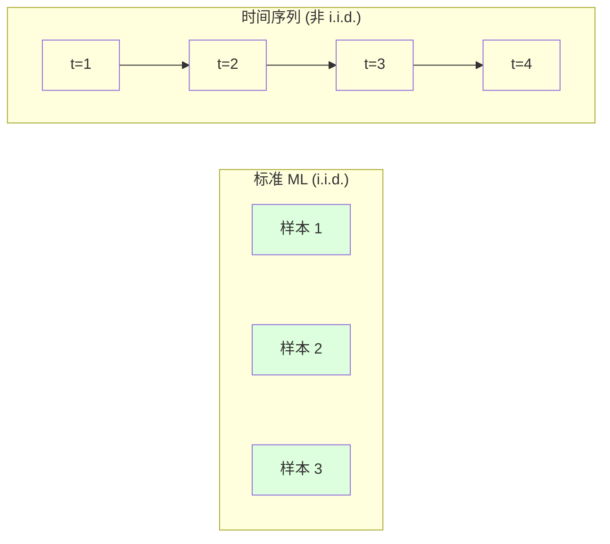
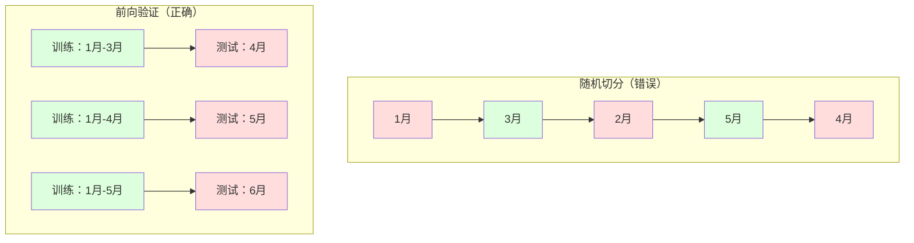

# 时间序列基础

> 过去的表现在未来确实会重演——前提是你先检查平稳性。

**类型：** 构建
**语言：** Python
**前置知识：** 阶段 2，课程 01-09
**时间：** ~90 分钟

## 学习目标

- 将时间序列分解为趋势、季节性和残差分量，并检验平稳性
- 实现滞后特征和滚动统计，将时间序列转化为监督学习问题
- 构建防止未来数据泄露到训练中的前向验证框架
- 解释为什么随机训练/测试切分对于时间序列无效，并演示与正确时间切分的性能差距

## 问题

你有按时间排序的数据。每日销售额、每小时温度、每分钟 CPU 使用率、每周股票价格。你想预测下一个值、下一周、下一季度。

你拿起你标准的 ML 工具包：随机训练/测试切分、交叉验证、特征矩阵输入、预测输出。每一步都是错的。

时间序列打破了标准 ML 所依赖的假设。样本不是独立的——今天的温度取决于昨天的。随机切分将未来信息泄露到过去。在回测中看起来很好的特征在生产中失败，因为它们依赖随时间变化的模式。

一个在随机交叉验证下达到 95% 准确率的模型，在基于时间的正确评估下可能只有 55%。差异不是技术细节。它是纸面上能用的模型和生产中能用的模型之间的区别。

本课程涵盖基础：什么使时间数据与众不同，如何诚实地评估模型，以及如何将时间序列转化为标准 ML 模型可以消费的特征。

## 概念

### 什么使时间序列不同

标准 ML 假设 i.i.d.——独立同分布。每个样本来自同一分布，独立于其他样本。时间序列违反了这两个假设：

- **不独立。** 今天的股价取决于昨天的。本周的销售额与上周的相关。
- **不同分布。** 分布随时间变化。十二月的销售额看起来与三月不同。

这些违反不是小问题。它们改变了你构建特征、评估模型的方式以及哪些算法有效。



在标准 ML 中，样本是可互换的。打乱它们什么也不改变。在时间序列中，顺序就是一切。打乱会摧毁信号。

### 时间序列的组成部分

每个时间序列都是以下分量的组合：

- **趋势**：长期方向。收入每年增长 10%。全球温度上升。
- **季节性**：固定间隔的重复模式。零售销售在十二月激增。空调使用在七月达到峰值。
- **残差**：移除趋势和季节性后剩余的部分。如果残差看起来像白噪声，分解捕捉到了信号。

### 平稳性

如果一个时间序列的统计属性（均值、方差、自相关）不随时间变化，它就是平稳的。大多数预测方法假设平稳性。

**为什么重要：** 非平稳序列的均值会漂移。一个在 1 月数据上训练的模型学到的均值与 2 月将显示的不同。它将系统性地出错。

**如何检查：** 计算窗口上的滚动均值和滚动标准差。如果它们漂移，序列是非平稳的。

**如何修复：** 差分。不建模原始值，而是建模连续值之间的变化：

```
diff[t] = value[t] - value[t-1]
```

如果一轮差分不能使序列平稳，再应用一次（二阶差分）。大多数现实世界的序列最多需要两轮。

**示例：**

原始序列：[100, 102, 106, 112, 120]
一阶差分： [2, 4, 6, 8]（仍在趋势向上）
二阶差分： [2, 2, 2]（恒定——平稳）

**正式检验：** 增强 Dickey-Fuller (ADF) 检验是平稳性的标准统计检验。

### 自相关

自相关衡量时间 t 的值与时间 t-k 的值的相关程度。自相关函数 (ACF) 绘制每个滞后 k 的相关性。

**ACF 告诉你：**
- 序列记忆多久之前。如果 ACF 在滞后 5 后下降到零，早于 5 步的值无关紧要。
- 是否存在季节性。如果 ACF 在滞后 12 处有尖峰（月度数据），存在年度季节性。
- 创建多少滞后特征。使用直到 ACF 变得可忽略的滞后。

### 滞后特征：将时间序列转化为监督学习

标准 ML 模型需要特征矩阵 X 和目标 y。时间序列给你一列值。桥梁就是滞后特征。

取序列 [10, 12, 14, 13, 15] 并创建 lag-1 和 lag-2 特征：

| lag_2 | lag_1 | target |
|-------|-------|--------|
| 10    | 12    | 14     |
| 12    | 14    | 13     |
| 14    | 13    | 15     |

现在你有一个标准的回归问题。任何 ML 模型都可以从滞后中预测目标。

可以工程化的其他特征：
- **滚动统计：** 过去 k 个值的均值、标准差、最小值、最大值
- **日历特征：** 星期几、月份、是否假日、是否周末
- **差分值：** 上一步的变化
- **扩展统计：** 累积均值、累积和
- **比例特征：** 当前值 / 滚动均值

**目标对齐陷阱。** 创建滞后特征时，目标必须是时间 t 的值，所有特征必须使用时间 t-1 或更早的值。如果不小心将时间 t 的值包含为特征，你有一个完美的预测器——和一个完全无用的模型。

### 前向验证

这是本课最重要的概念。标准 K 折交叉验证将样本随机分配到训练和测试。对于时间序列，这会泄露未来信息。



前向验证：
1. 在直到时间 t 的数据上训练
2. 预测 t+1
3. 向前滑动窗口
4. 重复

每个测试折只包含所有训练数据之后的数据。没有未来泄露。

**扩展窗口**使用所有历史数据进行训练（窗口增长）。**滑动窗口**使用固定大小的训练窗口（窗口滑动）。当你相信旧数据仍然相关时使用扩展窗口。当世界变化且旧数据有害时使用滑动窗口。

### 预测策略

**递推式（迭代式）：** 预测一步，使用预测作为下一步的输入。简单但误差累积。

**直接式：** 为每个预测范围训练单独的模型。无误差累积，但每个模型训练样本更少。

**多输出式：** 训练一个同时输出所有预测范围的模型。

对于大多数实际问题，短预测范围（1-5 步）用递推式，较长预测范围用直接式。

## 构建它

`code/time_series.py` 中的代码从头实现了核心构建模块。

### 滞后特征创建器

```python
def make_lag_features(series, n_lags):
    n = len(series)
    X = np.full((n, n_lags), np.nan)
    for lag in range(1, n_lags + 1):
        X[lag:, lag - 1] = series[:-lag]
    valid = ~np.isnan(X).any(axis=1)
    return X[valid], series[valid]
```

### 前向交叉验证

```python
def walk_forward_split(n_samples, n_splits=5, min_train=50):
    assert min_train < n_samples, "min_train must be less than n_samples"
    step = max(1, (n_samples - min_train) // n_splits)
    for i in range(n_splits):
        train_end = min_train + i * step
        test_end = min(train_end + step, n_samples)
        if train_end >= n_samples:
            break
        yield slice(0, train_end), slice(train_end, test_end)
```

### 简单自回归模型

纯 AR 模型就是在滞后特征上的线性回归：

```python
class SimpleAR:
    def __init__(self, n_lags=5):
        self.n_lags = n_lags
        self.weights = None
        self.bias = None

    def fit(self, series):
        X, y = make_lag_features(series, self.n_lags)
        X_b = np.column_stack([np.ones(len(X)), X])
        theta = np.linalg.lstsq(X_b, y, rcond=None)[0]
        self.bias = theta[0]
        self.weights = theta[1:]
        return self
```

### 平稳性检查

```python
def check_stationarity(series, window=50):
    rolling_mean = np.array([
        series[max(0, i - window):i].mean()
        for i in range(1, len(series) + 1)
    ])
    rolling_std = np.array([
        series[max(0, i - window):i].std()
        for i in range(1, len(series) + 1)
    ])
    return rolling_mean, rolling_std
```

如果滚动均值漂移或滚动标准差变化，序列是非平稳的。应用差分并重新检查。

### 自相关

```python
def autocorrelation(series, max_lag=20):
    n = len(series)
    mean = series.mean()
    var = series.var()
    acf = np.zeros(max_lag + 1)
    for k in range(max_lag + 1):
        cov = np.mean((series[:n-k] - mean) * (series[k:] - mean))
        acf[k] = cov / var if var > 0 else 0
    return acf
```

## 使用它

使用 sklearn，将滞后特征与任何回归器直接使用：

```python
from sklearn.linear_model import Ridge
from sklearn.model_selection import TimeSeriesSplit

X, y = make_lag_features(series, n_lags=10)

tscv = TimeSeriesSplit(n_splits=5)
for train_index, test_index in tscv.split(X):
    X_train, X_test = X[train_index], X[test_index]
    y_train, y_test = y[train_index], y[test_index]
    model = Ridge(alpha=1.0)
    model.fit(X_train, y_train)
```

对于 ARIMA，使用 statsmodels：

```python
from statsmodels.tsa.arima.model import ARIMA

model = ARIMA(train_series, order=(5, 1, 2))
fitted = model.fit()
forecast = fitted.forecast(steps=30)
```

## 交付物

本课程产出：
- `outputs/prompt-time-series-advisor.md`——用于框定时间序列问题的提示词
- `code/time_series.py`——滞后特征、前向验证、AR 模型、平稳性检查

### 必须超越的基线

1. **最后值（持久化）。** 预测明天与今天相同。对许多序列来说，这出乎意料地难以打败。
2. **季节性朴素。** 预测今天与上周同一天相同。如果你的模型不能打败这个，它没有学到任何有用的模式。
3. **移动平均。** 预测最近 k 个值的均值。

### 实用技巧

1. **从绘图开始。** 在任何建模之前，绘制原始序列。观察趋势、季节性、异常值、结构性突变。
2. **先差分，后建模。** 如果序列有明显趋势，在创建滞后特征之前差分它。
3. **至少保留一个完整的季节性周期。** 如果你有周度季节性，测试集需要至少一整周。
4. **在生产中监控。** 时间序列模型会随着世界变化而随时间退化。
5. **注意机制变化。** 在疫情前数据上训练的模型无法预测疫情后的行为。
6. **对偏态序列进行对数变换。** 在对数空间中预测，然后取幂回到原始单位。

## 练习

1. **平稳性实验。** 生成带线性趋势的序列。用滚动统计检查平稳性。应用一阶差分。再次检查。二次趋势需要几轮差分？
2. **滞后选择。** 计算季节性序列上的 ACF。哪些滞后有最高的自相关？只使用这些滞后创建滞后特征，准确率提高了吗？
3. **前向验证与随机切分。** 在滞后特征上训练岭回归。用随机 80/20 切分和前向验证评估。随机切分高估了多少性能？
4. **特征工程。** 向滞后特征添加滚动均值、滚动标准差和星期几特征。使用前向验证比较添加这些特征后的准确率。
5. **多步预测。** 修改 AR 模型以预测未来 5 步。比较递推式和直接式策略。

## 关键术语

| 术语 | 人们说的 | 实际含义 |
|------|----------------|----------------------|
| 平稳性 | "统计量不随时间变化" | 均值、方差和自相关结构随时间恒定的序列 |
| 差分 | "减去连续值" | 计算 y[t] - y[t-1] 以移除趋势并实现平稳性 |
| 自相关 (ACF) | "序列与自身的相关性" | 时间序列与其滞后副本之间的相关性，作为滞后的函数 |
| 偏自相关 (PACF) | "仅直接相关" | 移除所有更短滞后影响后的滞后 k 自相关 |
| 滞后特征 | "过去值作为输入" | 使用 y[t-1], y[t-2], ..., y[t-k] 作为预测 y[t] 的特征 |
| 前向验证 | "尊重时间的交叉验证" | 训练数据始终在测试数据之前的时间顺序评估 |
| ARIMA | "经典时间序列模型" | 自回归积分滑动平均：结合过去值 (AR)、差分 (I) 和过去误差 (MA) |
| 季节性 | "重复的日历模式" | 与日历周期（每日、每周、每年）相关的规律、可预测的周期 |
| 趋势 | "长期方向" | 序列水平随时间持续增加或减少 |
| 扩展窗口 | "使用所有历史" | 训练集随每个折增长的前向验证 |
| 滑动窗口 | "固定大小的历史" | 训练集为固定长度窗口向前滑动的前向验证 |

## 延伸阅读

- [Hyndman and Athanasopoulos, Forecasting: Principles and Practice (3rd ed.)](https://otexts.com/fpp3/)
- [scikit-learn Time Series Split](https://scikit-learn.org/stable/modules/generated/sklearn.model_selection.TimeSeriesSplit.html)
- [statsmodels ARIMA docs](https://www.statsmodels.org/stable/generated/statsmodels.tsa.arima.model.ARIMA.html)
- [Makridakis et al., The M5 Competition (2022)](https://www.sciencedirect.com/science/article/pii/S0169207021001874)
