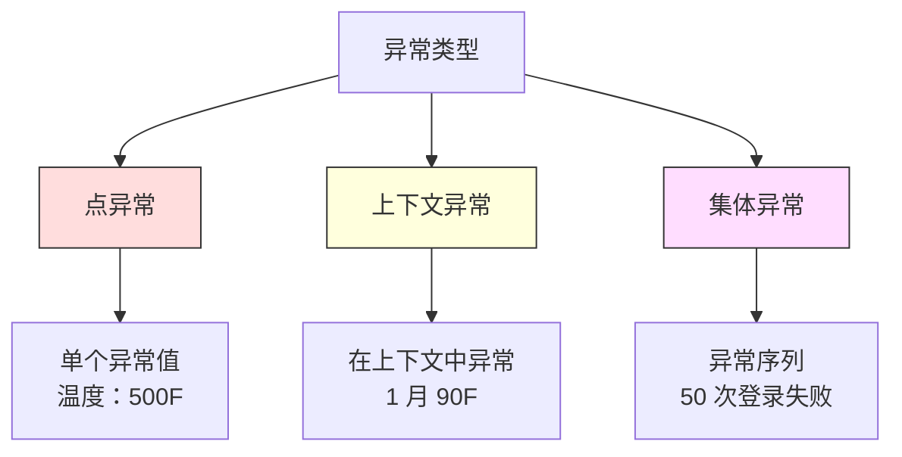

# 异常检测

> 正常很容易定义。异常是任何不符合正常的东西。

**类型：** 构建
**语言：** Python
**前置知识：** 阶段 2，课程 01-09
**时间：** ~75 分钟

## 学习目标

- 从头实现 Z 分数、IQR 和孤立森林异常检测方法
- 区分点异常、上下文异常和集体异常，并为每种类型选择适当的检测方法
- 解释为什么异常检测被框定为对正常数据建模而非对异常分类
- 比较无监督异常检测与监督分类，并评估新颖异常覆盖率和精确率之间的权衡

## 问题

一张信用卡下午 2 点在纽约使用，然后在下午 2:05 在东京使用。一个工厂传感器读数为 150 度，而正常范围是 80-120。一台服务器每秒发送 50,000 个请求，而每日平均是 200。

这些都是异常。找到它们很重要。欺诈造成数十亿损失。设备故障造成停机。网络入侵造成数据泄露。

挑战：你很少拥有标记的异常示例。欺诈只占交易的 0.1%。设备故障每年发生几次。你不能训练标准分类器，因为"异常"类别中几乎没有什么可以学习。即使你有一些标签，你见过的异常也不是你将会遇到的唯一类型。明天的欺诈手法看起来与今天的不同。

异常检测翻转了问题。不去学习什么是异常的，而是学习什么是正常的。任何偏离正常的事物都是可疑的。这在没有标签的情况下工作，适应新类型的异常，并扩展到大规模数据集。

## 概念

### 异常类型

并非所有异常都相同：

- **点异常：** 无论上下文如何，单个数据点都是异常的。500 度的温度读数。
- **上下文异常：** 给定上下文下异常的数据点。90 度在夏季正常，在冬季异常。相同的值，不同的上下文。
- **集体异常：** 一组数据点整体上是异常的，即使每个单独的点可能是正常的。五次登录失败是正常的。连续五十次是暴力破解攻击。

大多数方法检测点异常。上下文异常需要时间或位置特征。集体异常需要序列感知方法。



### 无监督框架

在标准分类中，你有两个类别的标签。在异常检测中，你通常处于以下三种情况之一：

1. **完全无监督。** 完全没有标签。你在所有数据上拟合检测器，希望异常足够少，不会破坏"正常"模型。
2. **半监督。** 你有一个仅包含正常数据的干净数据集。你在这个干净集上拟合，并对其他所有内容评分。这是可能时最强大的设置。
3. **弱监督。** 你有少量标记的异常。将它们用于评估而非训练。以无监督方式训练，然后在标记子集上测量精确率/召回率。

关键的见解：异常检测从根本上不同于分类。你是在对正常数据的分布建模，而不是对两个类别之间的决策边界建模。

### 监督 vs 无监督：权衡

**监督（视为分类）：**
- 捕捉你之前见过的确切异常类型
- 对已知异常类型的精确率更高
- 完全遗漏新的异常类型
- 当新异常类型出现时需要重新训练
- 需要足够多的异常示例（通常太少）

**无监督（建模正常、标记偏离）：**
- 捕捉任何偏离正常的现象，包括新类型
- 不需要标记的异常
- 假阳性率较高（并非所有不寻常的都是坏的）
- 对分布变化更鲁棒

实际上，最好的系统结合两者：无监督检测用于广泛覆盖，监督模型用于已知的高优先级异常类型，人工审核用于模棱两可的情况。

### Z 分数方法

最简单的方法。计算每个特征的均值和标准差。标记任何距离均值超过 k 个标准差的点。

```
z_score = (x - mean) / std
anomaly if |z_score| > threshold
```

默认阈值是 3.0（对于高斯分布，99.7% 的正常数据落在 3 个标准差内）。

**优点：** 简单。快速。可解释。

**缺点：** 假设数据是正态分布。对训练数据中的异常值敏感。在多峰分布上失败。

### IQR 方法

比 Z 分数更鲁棒。使用四分位距代替均值和标准差。

```
Q1 = 25 百分位
Q3 = 75 百分位
IQR = Q3 - Q1
lower_bound = Q1 - factor * IQR
upper_bound = Q3 + factor * IQR
anomaly if x < lower_bound or x > upper_bound
```

默认因子是 1.5。

**优点：** 对异常值鲁棒。适用于偏态分布。无正态性假设。

**缺点：** 仅单变量（每特征独立）。当特征一起考虑时无法检测异常。

### 孤立森林

关键见解：异常数量少且与众不同。在数据的随机划分中，异常更容易被隔离——它们需要更少的随机分裂就能与其余数据分开。

**工作原理：**
1. 构建许多随机树（孤立森林）
2. 在每个节点，选择一个随机特征和该特征最小值和最大值之间的随机分裂值
3. 持续分裂直到每个点被隔离（在自己的叶子中）
4. 异常在所有树中具有更短的平均路径长度

**为什么有效：** 正常点位于密集区域。需要许多随机分裂才能将一个点与其邻居隔离。异常位于稀疏区域。一到两次随机分裂就足以隔离它们。

异常分数基于所有树的平均路径长度，通过随机二叉搜索树的期望路径长度进行归一化：

```
score(x) = 2^(-average_path_length(x) / c(n))
```

其中 `c(n)` 是 n 个样本的期望路径长度。分数接近 1 意味着异常。分数接近 0.5 意味着正常。

**优点：** 无分布假设。在高维中工作。扩展性好。

**缺点：** 在密集区域中的异常处理困难（掩蔽效应）。当许多特征无关时，随机分裂效果较差。

### 局部异常因子 (LOF)

LOF 比较点周围的局部密度与其邻居周围的密度。位于稀疏区域且被密集区域包围的点是异常的。

**工作原理：**
1. 为每个点找到其 k 个最近邻
2. 计算局部可达密度（邻域有多密集）
3. 将每个点的密度与其邻居密度比较
4. 如果点密度远低于其邻居，则是异常值

**优点：** 检测局部异常。在不同密度的簇上有效。

**缺点：** 大数据集上慢。对 k 的选择敏感。在高维中效果不佳。

### 比较

| 方法 | 假设 | 速度 | 处理高维 | 检测局部异常 |
|--------|------------|-------|-------------------|------------------------|
| Z 分数 | 正态分布 | 非常快 | 是（每特征） | 否 |
| IQR | 无（每特征） | 非常快 | 是（每特征） | 否 |
| 孤立森林 | 无 | 快 | 是 | 部分 |
| LOF | 距离有意义 | 慢 | 差 | 是 |

### 评估挑战

评估异常检测器比评估分类器更难：

- **极端类别不平衡。** 只有 0.1% 的异常，预测全部正常给出 99.9% 准确率。准确率无用。
- **AUROC 具有误导性。** 在严重不平衡下，AUROC 可能看起来不错，即使模型在实际阈值下错过了大多数异常。
- **更好的指标：** Precision@k、AUPRC（精确率-召回率曲线下面积）、在固定假阳性率下的召回率。

### 异常检测流水线

1. 收集基线数据。理想情况下，一个你知道没有（或很少）异常的时期。
2. 特征工程。原始特征加上派生特征。
3. 训练检测器。在基线数据上拟合。
4. 对新数据评分。每个新观测获得一个异常分数。
5. 阈值选择。选择分数截断值。这是业务决策。
6. 告警和调查。标记的点进入人工审核或自动响应。
7. 反馈收集。记录标记项是否是真异常或误报。

## 构建它

`code/anomaly_detection.py` 中的代码从头实现了 Z 分数、IQR 和孤立森林。

### Z 分数检测器

```python
def zscore_detect(X, threshold=3.0):
    mean = X.mean(axis=0)
    std = X.std(axis=0)
    std[std == 0] = 1.0
    z = np.abs((X - mean) / std)
    return z.max(axis=1) > threshold
```

### IQR 检测器

```python
def iqr_detect(X, factor=1.5):
    q1 = np.percentile(X, 25, axis=0)
    q3 = np.percentile(X, 75, axis=0)
    iqr = q3 - q1
    iqr[iqr == 0] = 1.0
    lower = q1 - factor * iqr
    upper = q3 + factor * iqr
    outside = (X < lower) | (X > upper)
    return outside.any(axis=1)
```

### 从头实现孤立森林

```python
class IsolationTree:
    def __init__(self, max_depth):
        self.max_depth = max_depth

    def fit(self, X, depth=0):
        n, p = X.shape
        if depth >= self.max_depth or n <= 1:
            self.is_leaf = True
            self.size = n
            return self
        self.is_leaf = False
        self.feature = np.random.randint(p)
        x_min = X[:, self.feature].min()
        x_max = X[:, self.feature].max()
        if x_min == x_max:
            self.is_leaf = True
            self.size = n
            return self
        self.threshold = np.random.uniform(x_min, x_max)
        left_mask = X[:, self.feature] < self.threshold
        self.left = IsolationTree(self.max_depth).fit(X[left_mask], depth + 1)
        self.right = IsolationTree(self.max_depth).fit(X[~left_mask], depth + 1)
        return self
```

### 演示场景

代码生成多个测试场景：单簇带异常值、多模态数据和高维数据。

## 使用它

使用 sklearn：

```python
from sklearn.ensemble import IsolationForest
from sklearn.neighbors import LocalOutlierFactor

iso = IsolationForest(n_estimators=100, contamination=0.05, random_state=42)
iso.fit(X_train)
predictions = iso.predict(X_test)

lof = LocalOutlierFactor(n_neighbors=20, contamination=0.05, novelty=True)
lof.fit(X_train)
predictions = lof.predict(X_test)
```

### 生产考虑

1. **阈值漂移。** 随着数据分布变化，固定阈值会过时。
2. **告警疲劳。** 误报太多，操作员就不再关注。从高阈值开始。
3. **集成方法。** 结合多个检测器。仅当多个方法一致认为是异常时才标记。
4. **特征工程。** 原始特征很少足够。添加滚动统计量、比率和时间特征。
5. **反馈循环。** 操作员调查标记项并确认或驳回时，反馈给系统。

## 交付物

本课程产出：
- `outputs/skill-anomaly-detector.md`——选择正确检测器的决策技能
- `code/anomaly_detection.py`——Z 分数、IQR 和孤立森林

## 练习

1. **阈值调优。** 用 1.0 到 5.0 的阈值运行 Z 分数检测器。绘制精确率和召回率。
2. **多变量异常。** 创建每个特征单独看起来正常但组合后异常的数据。
3. **从头实现 LOF。** 使用 KNN 实现局部异常因子。与 sklearn 比较。
4. **流式异常检测。** 修改 Z 分数检测器以在流式设置中工作。
5. **真实世界评估。** 使用已知异常的数据集评估所有四种方法。

## 关键术语

| 术语 | 人们说的 | 实际含义 |
|------|----------------|----------------------|
| 异常 | "异常值，不寻常的点" | 显著偏离正常数据预期模式的数据点 |
| 点异常 | "单个异常值" | 无论上下文如何都是异常的单个观测 |
| 上下文异常 | "正常值，错误上下文" | 在给定上下文中异常但在另一上下文中正常的观测 |
| 孤立森林 | "随机分裂以找异常值" | 用比正常点更少的分裂隔离异常的随机树集成 |
| 局部异常因子 | "比较与邻居的密度" | 标记局部密度远低于邻居密度的点的方法 |
| Z 分数 | "距离均值的标准差数" | (x - mean) / std，以标准差为单位测量点距中心的距离 |
| IQR | "四分位距" | Q3 - Q1，测量中间 50% 数据的离散度，用于鲁棒的异常值检测 |
| 污染率 | "期望的异常比例" | 告诉检测器应标记多少数据为异常的超参数 |
| Precision@k | "前 k 个标记中多少为真" | 仅在最可疑的 k 个点上计算的精确率 |
| AUPRC | "精确率-召回率曲线下面积" | 总结所有阈值下精确率-召回率性能的指标 |

## 延伸阅读

- [Liu et al., Isolation Forest (2008)](https://cs.nju.edu.cn/zhouzh/zhouzh.files/publication/icdm08b.pdf)
- [Breunig et al., LOF: Identifying Density-Based Local Outliers (2000)](https://dl.acm.org/doi/10.1145/342009.335388)
- [scikit-learn Outlier Detection docs](https://scikit-learn.org/stable/modules/outlier_detection.html)
- [Chandola et al., Anomaly Detection: A Survey (2009)](https://dl.acm.org/doi/10.1145/1541880.1541882)
- [Goldstein and Uchida, A Comparative Evaluation of Unsupervised Anomaly Detection Algorithms (2016)](https://journals.plos.org/plosone/article?id=10.1371/journal.pone.0152173)
