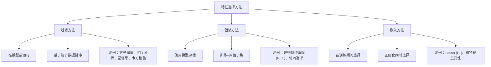

# 特征选择

> 更多的特征并不意味着更好。正确的特征才是更好。

**类型：** 构建
**语言：** Python
**前置知识：** 阶段 2，课程 01-09、08（特征工程）
**时间：** ~75 分钟

## 学习目标

- 从头实现过滤方法（方差阈值、互信息）和包装方法（RFE、前向选择）
- 解释为什么互信息能捕捉到相关分析遗漏的非线性特征-目标关系
- 比较 L1 正则化（嵌入选择）与 RFE（包装选择）并评估它们的计算权衡
- 构建一个结合多种方法的特征选择流水线，并展示在保留数据上改进的泛化性能

## 问题

你有 500 个特征。你的模型训练缓慢，不断过拟合，没人能解释它学到了什么。你添加更多特征以期提升性能。结果变得更糟。

这是维度灾难的体现。随着特征数量增长，特征空间的体积呈指数级爆炸。数据点变得稀疏。点之间的距离趋于一致。模型需要指数级更多的数据来找到真正的模式。噪声特征淹没了信号特征。过拟合成为默认状态。

特征选择是解药。剥离噪声。去除冗余。保留那些真正携带目标信息的特征。结果是：更快的训练、更好的泛化，以及你能够真正解释的模型。

目标不是使用所有可用信息。而是使用正确的信息。

## 概念

### 特征选择的三个类别



### 过滤方法（模型无关）

过滤方法在训练任何模型之前评估特征。它们根据某些统计标准对特征进行排序，并选择得分最高的特征。

**方差阈值：** 移除方差异常低的特征。零方差特征在所有样本中具有相同的值——它们对任何模型的预测能力都为零。低方差特征几乎不变——它们携带很少信息。

```python
selector = VarianceThreshold(threshold=0.01)
X_selected = selector.fit_transform(X)
```

方差不考虑与目标的关系。一个特征可能有高方差但完全与目标无关。方差阈值是初始清理（移除常数和近常数特征）的好方法。

**相关性（皮尔逊）：** 衡量特征与目标之间的线性关系。皮尔逊相关系数范围为 -1 到 +1。高绝对值表示强线性关系。

问题：如果与目标的关系是非线性的，相关性会完全遗漏它。一个特征可能与目标有完美的 U 型关系，但相关性为 0。

**互信息：** 衡量知道 X 后 Y 的不确定性减少量。捕捉任何类型的关系（线性或非线性）。与相关性不同，它可以检测复杂依赖关系。

对于离散变量，互信息定义如下：

```
MI(X, Y) = sum_x sum_y p(x, y) * log(p(x, y) / (p(x) * p(y)))
```

对于连续变量，使用基于 k 近邻估计的方法来估计 MI。与皮尔逊相关不同，MI 总是非负且为 0 当且仅当 X 和 Y 独立。

哪些关系被遗漏？相关性遗漏非线性关系。互信息捕捉所有类型的关系，但需要更多数据来准确估计。

| 关系类型 | 皮尔逊相关 | 互信息 |
|-------------|-------------------|------------|
| 线性 | 1.0 | 高 |
| 二次（U 型） | 0.0 | 高 |
| 正弦 | ~0.0 | 中到高 |
| 阶跃函数 | 中 | 高 |
| 独立 | 0.0 | 0.0 |

**卡方检验：** 对类别特征（即离散变量）的统计检验。衡量观察到的计数与期望计数（如果特征和目标是独立的）之间的差异。

```
X^2 = sum (observed - expected)^2 / expected
```

这与互信息类似但来自不同的统计传统。互信息基于信息论，卡方基于假设检验。

### 包装方法（模型依赖）

包装方法将模型引入循环中。它们使用模型的性能来评估特征子集。

**递归特征消除（RFE）：**

1. 在所有特征上训练模型
2. 按重要性对特征排序（系数幅度、树重要性）
3. 移除最不重要的特征
4. 在剩余特征上重新训练
5. 重复直到达到目标特征数量

```python
from sklearn.feature_selection import RFE

selector = RFE(estimator=LinearRegression(), n_features_to_select=10)
selector.fit(X, y)
selected = X.columns[selector.support_]
```

**前向选择：**

1. 从空特征集开始
2. 逐个添加特征：训练模型，评估性能
3. 为每个可能的添加重复上述步骤
4. 添加能带来最佳改善的特征
5. 重复直到添加不再有帮助

包装方法通常比过滤方法更准确，因为它们直接优化模型性能。但计算成本高得多：每个子集都需要重新训练。

| 方法 | 计算复杂度 | 选择质量 |
|----------|-----------------------|----------------|
| 前向选择 | O(d * T) | 中等（贪婪） |
| 递归特征消除 | O(d * T) | 中等到高 |
| 穷举搜索 | O(2^d * T) | 最优但无法实现 |

其中 d = 特征数，T = 训练一次的成本。

包装方法的两个主要风险是：
1. 搜索空间太大，导致拟合不足或实际不可行的计算时间
2. 在每个子集上重新训练会导致过拟合，因为子集选择本身是基于验证性能的

### 嵌入方法（训练期间选择）

嵌入方法在训练过程中选择特征，作为模型拟合的副产品。

**L1 正则化（Lasso）：** 在损失函数中添加 L1 惩罚项：`loss + lambda * sum(|w_j|)`。L1 惩罚将不重要的系数精确推至零。

```python
from sklearn.linear_model import Lasso

model = Lasso(alpha=0.01)
model.fit(X, y)
selected = X.columns[model.coef_ != 0]
```

随着 lambda 上升，更多系数变为零，有效移除特征。你可以通过改变 lambda 来控制选择的力度。

**树特征重要性：** 在随机森林或梯度提升中，特征重要性由该特征在所有树上减少的平均不纯度（或均方误差）来定义。

```python
from sklearn.ensemble import RandomForestRegressor

model = RandomForestRegressor()
model.fit(X, y)
importance = pd.DataFrame({
    "feature": X.columns,
    "importance": model.feature_importances_
}).sort_values("importance", ascending=False)
```

嵌入方法结合了过滤方法（高效）和包装方法（使用模型信号）的优点。

### 选择特征数量

你需要的不是所有特征。正确的特征数量可以通过肘部法或交叉验证来确定。

**肘部法（得分 vs 特征数量）：**
1. 按重要性对特征排序
2. 训练模型，使用前 k 个特征
3. 绘制得分 vs k
4. 寻找改善变慢的"肘部"

**交叉验证选择：** 使用带有不同特征子集的交叉验证，并选择给出最佳验证得分的子集。

**经验法则：** 对于线性模型，特征数量应约为样本数量的 1/10。对于树模型，可以更多，但超过 ~1000 个特征通常适得其反，除非样本数量以百万计。

### 组合方法：混合选择

最可靠的方法是结合多种方法：

1. **过滤方法：** 快速移除明显无用的特征（方差阈值、低 MI）
2. **嵌入方法：** 使用 Lasso 或 TreeImportance 预筛选
3. **RFE 或前向选择：** 对剩余候选进行精细化


## 构建它

`code/feature_selection.py` 中的代码从头实现了多种特征选择方法。

### 第 1 步：过滤方法（VarianceThreshold、MI）

```python
def variance_threshold(X, threshold=0.01):
    variances = np.var(X, axis=0)
    return np.where(variances >= threshold)[0]

def mutual_information(X, y, k=3):
    n, d = X.shape
    mi_scores = np.zeros(d)
    for f in range(d):
        x = X[:, f]
        x_discrete = np.digitize(x, np.percentile(x, np.linspace(0, 100, k+1)[1:-1]))
        mi_scores[f] = compute_mi_discrete(x_discrete, y)
    return mi_scores

def compute_mi_discrete(x, y):
    xy = np.vstack([x, y]).T
    joint = np.zeros((len(np.unique(x)), len(np.unique(y))))
    for xi, yi in xy:
        joint[int(xi), int(yi)] += 1
    joint /= len(xy)
    px = joint.sum(axis=1)
    py = joint.sum(axis=0)
    mi = 0
    for i in range(len(px)):
        for j in range(len(py)):
            if joint[i,j] > 0 and px[i] > 0 and py[j] > 0:
                mi += joint[i,j] * np.log(joint[i,j] / (px[i] * py[j]))
    return mi
```

### 第 2 步：用于特征选择的包装方法（RFE）

```python
def recursive_feature_elimination(X, y, model_fn, n_features_to_select):
    n, d = X.shape
    mask = np.ones(d, dtype=bool)
    while mask.sum() > n_features_to_select:
        model = model_fn()
        model.fit(X[:, mask], y)
        coeffs = np.abs(model.coef_)
        worst = np.argmin(coeffs)
        mask[np.where(mask)[0][worst]] = False
    return np.where(mask)[0]
```

### 第 3 步：嵌入方法（Lasso 系数、树重要性）

```python
def lasso_selection(X, y, alpha=0.01):
    from sklearn.linear_model import Lasso
    model = Lasso(alpha=alpha, max_iter=10000)
    model.fit(X, y)
    return np.where(np.abs(model.coef_) > 1e-6)[0]

def tree_importance_selection(X, y, n_features_to_select):
    from sklearn.ensemble import RandomForestRegressor
    model = RandomForestRegressor(n_estimators=100)
    model.fit(X, y)
    imp = model.feature_importances_
    top = np.argsort(imp)[::-1][:n_features_to_select]
    return top
```

### 第 4 步：合成数据演示

代码生成 50 个特征，其中只有 5 个是信号特征（与目标相关），其余 45 个是随机噪声。它比较了每种方法在这些噪声主导的特征中恢复信号特征的能力。

一些特征与目标保持非线性关系，以便展示互信息相对于相关性的优势。

## 使用它

使用 sklearn：

```python
from sklearn.feature_selection import (
    VarianceThreshold,
    SelectKBest,
    mutual_info_classif,
    chi2,
    RFE,
    SelectFromModel,
)
from sklearn.linear_model import LogisticRegression
from sklearn.ensemble import RandomForestClassifier

# 过滤：方差
selector = VarianceThreshold(threshold=0.01)
X_high_var = selector.fit_transform(X)

# 过滤：互信息
mi_selector = SelectKBest(mutual_info_classif, k=20)
X_mi = mi_selector.fit_transform(X, y)

# 过滤：卡方检验
chi2_selector = SelectKBest(chi2, k=20)
X_chi = chi2_selector.fit_transform(X, y)

# 嵌入：Lasso
lasso_selector = SelectFromModel(
    LogisticRegression(penalty="l1", solver="saga", C=0.1),
    threshold="mean",
)
X_lasso = lasso_selector.fit_transform(X, y)

# 包装：RFE
rfe_selector = RFE(
    estimator=LogisticRegression(),
    n_features_to_select=20,
    step=10,
)
X_rfe = rfe_selector.fit_transform(X, y)

# 组合：过滤 + 嵌入 + 包装
X_filtered = SelectKBest(mutual_info_classif, k=50).fit_transform(X, y)
X_embedded = SelectFromModel(
    LogisticRegression(penalty="l1", solver="saga", C=0.1)
).fit_transform(X_filtered, y)
X_final = RFE(
    estimator=RandomForestClassifier(),
    n_features_to_select=10,
).fit_transform(X_embedded, y)
```

## 交付物

本课程产出：
- `outputs/skill-feature-selector.md`——用于选择和应用特征选择方法的技能

## 练习

1. 生成 100 个样本和 100 个特征，其中只有 3 个是信号特征。在测试集上比较使用过滤、包装和嵌入方法选择前后的模型性能。每种方法恢复真实信号的效果如何？
2. 从头实现前向特征选择。将其复杂度与 RFE 进行比较。当 n_features_to_select 增长时运行时间如何变化？
3. 使用互信息与相关性来排名特征。在具有非线性依赖的数据上，哪种排名更准确？
4. 向数据集添加 20 个完全随机的特征（与目标无关）。重复选择过程。哪些方法将它们与真实特征区分开？
5. 在包含 1000 个特征和 500 个样本的真实数据集上结合过滤、嵌入和包装方法。使用交叉验证来评估最终特征子集。与只使用所有特征相比，泛化性能提高多少？

## 关键术语

| 术语 | 人们说的 | 实际含义 |
|------|----------------|----------------------|
| 过滤方法 | "模型前运行" | 独立于任何模型根据统计数据选择特征的方法 |
| 包装方法 | "模型评估子集" | 通过训练模型并评估性能来选择特征子集的方法 |
| 嵌入方法 | "训练期间选择" | 在模型训练过程中执行特征选择，如 Lasso 或树重要性 |
| 互信息 | "关系强度" | 衡量知道一个变量减少了多少另一个变量的不确定性 |
| 递归特征消除 (RFE) | "移除最差的特征" | 迭代训练模型、按重要性排序、移除最差的，直到达到目标数量 |
| L1 正则化（Lasso）| "将系数推至零" | 添加系数绝对值的惩罚；将不重要的特征精确设置为零 |
| 方差阈值 | "移除常数特征" | 移除在所有样本中几乎不变的简单筛选 |
| 维度灾难 | "太多特征" | 随着特征数量增长，数据在空间中变得稀疏，模型需要指数级更多数据 |
| 前向选择 | "一次添加一个" | 从空开始，迭代添加最佳的新特征，直到性能平稳 |

## 延伸阅读

- [Guyon & Elisseeff, An Introduction to Variable and Feature Selection (2003)](https://www.jmlr.org/papers/volume3/guyon03a/guyon03a.pdf)
- [scikit-learn Feature Selection Guide](https://scikit-learn.org/stable/modules/feature_selection.html)
- [Kuhn & Johnson, Feature Engineering and Selection (2019)](https://bookdown.org/max/FES/)
