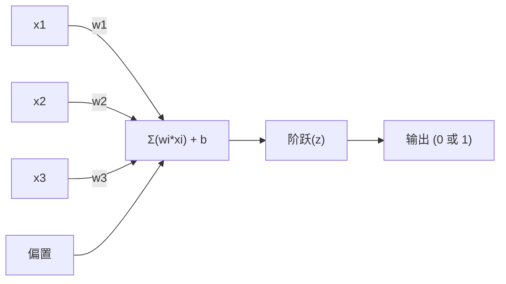
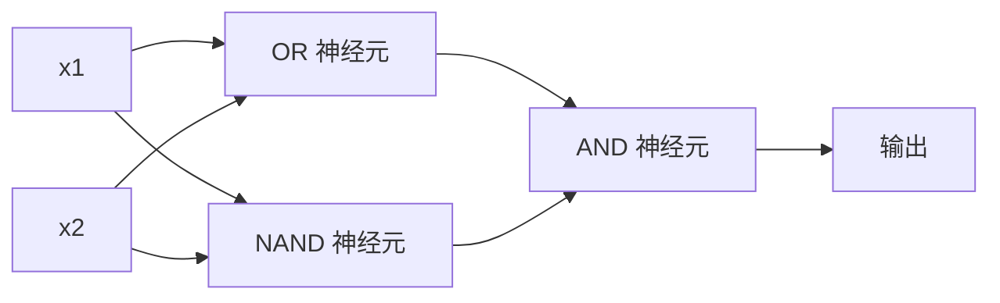

# 感知机

> 感知机是神经网络的原子。把它拆开，你会发现权重、偏置和一个决策。

**类型：** 构建
**语言：** Python
**前置知识：** 阶段 1（线性代数直觉）
**时间：** ~60 分钟

## 学习目标

- 从头用 Python 实现一个感知机，包括权重更新规则和阶跃激活函数
- 解释为什么单个感知机只能解决线性可分问题，并演示 XOR 失败案例
- 通过组合 OR、NAND 和 AND 门构建多层感知机来解决 XOR
- 使用 sigmoid 激活和反向传播训练一个两层网络自动学习 XOR

## 问题

你知道向量和点积。你知道矩阵将输入转换成输出。但机器如何*学习*使用哪种变换？

感知机回答了这个问题。它是最简单的学习机器：接受一些输入，乘以权重，加上偏置，做出一个二元决策。然后调整。仅此而已。每一个曾经构建的神经网络都是这个思想的层叠堆叠。

理解感知机意味着理解"学习"在代码中实际意味着什么：调整数字直到输出与事实匹配。

## 概念

### 一个神经元，一个决策

感知机接受 n 个输入，每个乘以一个权重，对它们求和，加上一个偏置，并将结果通过一个激活函数传递。



阶跃函数是残酷的：如果加权和加上偏置 >= 0，输出 1。否则，输出 0。

```
阶跃(z) = 1  如果 z >= 0
         0  如果 z < 0
```

这是一个线性分类器。权重和偏置定义了一条线（或在更高维度中的超平面），将输入空间分成两个区域。

### 决策边界

对于两个输入，感知机在二维空间中画出一条线：

```
  x2
  ┤
  │  类别 1        /
  │    (0)        /
  │              /
  │             / w1·x1 + w2·x2 + b = 0
  │            /
  │           /     类别 2
  │          /        (1)
  ┼─────────/─────────── x1
```

线一侧的所有内容输出 0。另一侧的所有内容输出 1。训练移动这条线，直到它正确分离类别。

### 学习规则

感知机学习规则很简单：

```
对于每个训练样本 (x, y_true):
    y_pred = predict(x)
    error = y_true - y_pred

    对于每个权重：
        w_i = w_i + learning_rate * error * x_i
    bias = bias + learning_rate * error
```

如果预测正确，error = 0，什么也不变。如果预测为 0 但应为 1，权重增加。如果预测为 1 但应为 0，权重减少。学习率控制每次调整的大小。

### XOR 问题

问题就在这里。看看这些逻辑门：

```
AND 门：           OR 门：            XOR 门：
x1  x2  out        x1  x2  out        x1  x2  out
0   0   0          0   0   0          0   0   0
0   1   0          0   1   1          0   1   1
1   0   0          1   0   1          1   0   1
1   1   1          1   1   1          1   1   0
```

AND 和 OR 是线性可分的：你可以画一条线来分离 0 和 1。XOR 则不行。没有一条线可以分离 [0,1] 和 [1,0] 远离 [0,0] 和 [1,1]。

```
AND (可分)：          XOR (不可分)：

  x2                      x2
  1 ┤  0     1            1 ┤  1     0
    │     /                 │
  0 ┤  0 / 0              0 ┤  0     1
    ┼──/──────── x1         ┼──────────── x1
       线有效！              没有线有效！
```

这是一个基本限制。单个感知机只能解决线性可分的问题。Minsky 和 Papert 在 1969 年证明了这一点，它几乎扼杀了神经网络研究十年之久。

解决办法：将感知机堆叠成层。多层感知机可以通过将两个线性决策组合成一个非线性决策来解决 XOR。

```figure
perceptron-boundary
```

## 构建它

### 第 1 步：感知机类

```python
class Perceptron:
    def __init__(self, n_inputs, learning_rate=0.1):
        self.weights = [0.0] * n_inputs
        self.bias = 0.0
        self.lr = learning_rate

    def predict(self, inputs):
        total = sum(w * x for w, x in zip(self.weights, inputs))
        total += self.bias
        return 1 if total >= 0 else 0

    def train(self, training_data, epochs=100):
        for epoch in range(epochs):
            errors = 0
            for inputs, target in training_data:
                prediction = self.predict(inputs)
                error = target - prediction
                if error != 0:
                    errors += 1
                    for i in range(len(self.weights)):
                        self.weights[i] += self.lr * error * inputs[i]
                    self.bias += self.lr * error
            if errors == 0:
                print(f"在第 {epoch + 1} 轮收敛")
                return
        print(f"在 {epochs} 轮后未收敛")
```

### 第 2 步：在逻辑门上训练

```python
and_data = [
    ([0, 0], 0), ([0, 1], 0),
    ([1, 0], 0), ([1, 1], 1),
]

or_data = [
    ([0, 0], 0), ([0, 1], 1),
    ([1, 0], 1), ([1, 1], 1),
]

not_data = [
    ([0], 1), ([1], 0),
]
```

### 第 3 步：观察 XOR 失败

XOR 门永远无法收敛。这是单个感知机无法学习 XOR 的硬性证明。

### 第 4 步：用两层解决 XOR

技巧：XOR = (x1 OR x2) AND NOT (x1 AND x2)。组合三个感知机：



```python
def xor_network(x1, x2):
    or_neuron = Perceptron(2)
    or_neuron.weights = [1.0, 1.0]
    or_neuron.bias = -0.5

    nand_neuron = Perceptron(2)
    nand_neuron.weights = [-1.0, -1.0]
    nand_neuron.bias = 1.5

    and_neuron = Perceptron(2)
    and_neuron.weights = [1.0, 1.0]
    and_neuron.bias = -1.5

    hidden1 = or_neuron.predict([x1, x2])
    hidden2 = nand_neuron.predict([x1, x2])
    output = and_neuron.predict([hidden1, hidden2])
    return output
```

所有四种情况都正确。将感知机堆叠成层创建了任何单个感知机都无法产生的决策边界。

## 使用它

sklearn 一行代码实现：

```python
from sklearn.linear_model import Perceptron as SkPerceptron
import numpy as np

X = np.array([[0,0],[0,1],[1,0],[1,1]])
y = np.array([0, 0, 0, 1])

clf = SkPerceptron(max_iter=100, tol=1e-3)
clf.fit(X, y)
print([clf.predict([x])[0] for x in X])
```

## 交付物

本课程产出：
- `outputs/skill-perceptron.md`——涵盖何时需要单层与多层架构的技能

## 练习

1. 在 NAND 门上训练感知机（通用门——任何逻辑电路都可以由 NAND 构建）。验证其权重和偏置形成有效的决策边界。
2. 修改感知机类以跟踪每个轮的决策边界。打印在 AND 门训练期间线的移动。
3. 构建一个 3 输入感知机，仅在至少 2 个输入为 1 时才输出 1（多数投票函数）。这是线性可分的吗？为什么？

## 关键术语

| 术语 | 人们的说法 | 实际含义 |
|------|------------|----------|
| 感知机 | "一个假神经元" | 一个线性分类器：输入和权重的点积，加上偏置，通过阶跃函数 |
| 权重 | "输入的重要性" | 一个乘数，缩放每个输入对决策的贡献 |
| 偏置 | "阈值" | 一个常数，偏移决策边界，使感知机在零输入时也能激活 |
| 激活函数 | "挤压值的东西" | 在加权和之后应用的函数——感知机用阶跃函数，现代网络用 sigmoid/ReLU |
| 线性可分 | "你可以在它们之间画一条线" | 一个数据集，其中单个超平面可以完美分离类别 |
| XOR 问题 | "感知机做不到的事" | 证明单层网络无法学习非线性可分函数的证据 |
| 决策边界 | "分类器切换的地方" | 将输入空间分成两个类别的超平面 w*x + b = 0 |
| 多层感知机 | "一个真正的神经网络" | 多层堆叠的感知机，每层输出馈送到下一层输入 |

## 延伸阅读

- Frank Rosenblatt, "The Perceptron: A Probabilistic Model for Information Storage and Organization in the Brain" (1958)——开启一切的开创性论文
- Minsky & Papert, "Perceptrons" (1969)——证明 XOR 无法被单层网络解决并扼杀感知机研究十年的书
- Michael Nielsen, "Neural Networks and Deep Learning", 第 1 章 (http://neuralnetworksanddeeplearning.com/)——免费在线，关于感知机如何组合成网络的最佳可视化解释
