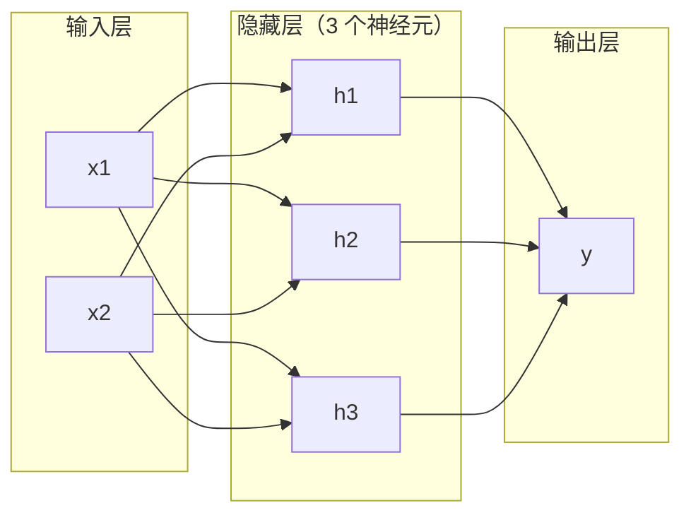
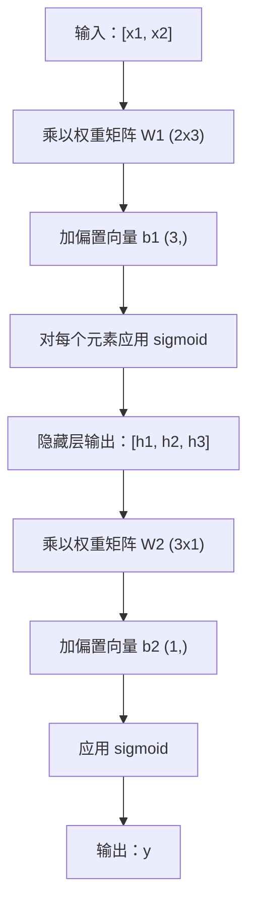

# 多层网络与前向传播

> 一个神经元画一条线。堆叠它们，你可以画出任何东西。

**类型：** 构建
**语言：** Python
**前置知识：** 阶段 1（数学基础）、课程 03.01（感知机）
**时间：** ~90 分钟

## 学习目标

- 用 Layer 和 Network 类从头构建一个多层网络，执行完整的前向传播
- 跟踪矩阵维度在网络中每一层的传播，并识别形状不匹配
- 解释堆叠非线性激活如何使网络学习弯曲的决策边界
- 使用 2-2-1 架构和手动调整的 sigmoid 权重解决 XOR 问题

## 问题

单个神经元是一个画线器。仅此而已。穿过你数据的一条直线。每一个真正 AI 中的问题——图像识别、语言理解、下围棋——都需要曲线。将神经元堆叠成层就是得到曲线的方法。

1969 年，Minsky 和 Papert 证明了这个限制是致命的：单层网络无法学习 XOR。不是"难以学习"——而是数学上的不可能。XOR 真值表将 [0,1] 和 [1,0] 放在一边，[0,0] 和 [1,1] 放在另一边。没有一条线可以分离它们。

这扼杀了神经网络研究超过十年。解决办法事后看来很明显：不要只用一层。将神经元堆叠成层。让第一层将输入空间雕刻成新的特征，让第二层将这些特征组合成任何单条线都无法做出的决策。

这个堆叠就是多层网络。它是当今生产中每个深度学习模型的基础。前向传播——数据从输入通过隐藏层流向输出——是你在其他任何工作开始之前需要构建的第一件事。

## 概念

### 层：输入层、隐藏层、输出层

多层网络有三种类型的层：

**输入层**——并非真正的层。它容纳你的原始数据。两个特征意味着两个输入节点。没有计算发生在这里。

**隐藏层**——工作完成的地方。每个神经元取前一层每个输出，应用权重和偏置，然后通过激活函数传递结果。"隐藏"是因为你在训练数据中从未直接看到这些值。

**输出层**——最终答案。对于二分类，一个带 sigmoid 的神经元。对于多分类，每类一个神经元。



这是一个 2-3-1 网络。两个输入，三个隐藏神经元，一个输出。每个连接都带有一个权重。每个神经元（除了输入）都带有一个偏置。

### 前向传播：数据如何流动

前向传播将输入数据逐层推过网络，直到到达输出。前向传播期间没有学习发生。它纯粹是计算：乘、加、激活、重复。



在每一层，三个操作按顺序发生：

```
z = W * input + b       (线性变换)
a = sigmoid(z)           (激活)
```

一层的输出成为下一层的输入。这就是整个前向传播。

### 矩阵维度

跟踪维度是深度学习中最重要的一项调试技能。这是 2-3-1 网络：

| 步骤 | 操作 | 维度 | 结果形状 |
|------|------|------|----------|
| 输入 | x | -- | (2,) |
| 隐藏层线性 | W1 * x + b1 | W1：(3,2)，b1：(3,) | (3,) |
| 隐藏层激活 | sigmoid(z1) | -- | (3,) |
| 输出层线性 | W2 * h + b2 | W2：(1,3)，b2：(1,) | (1,) |
| 输出层激活 | sigmoid(z2) | -- | (1,) |

规则：第 k 层的权重矩阵 W 的形状为（第 k 层神经元数，第 k-1 层神经元数）。行匹配当前层。列匹配前一层。如果形状不匹配，就有一个 bug。

### 万能近似定理

1989 年，George Cybenko 证明了一些值得注意的事情：一个带单隐藏层的神经网络，只要有足够多的神经元，就可以近似任何连续函数到任意精度。

这并不意味着一个隐藏层总是最好的。它意味着该架构在理论上是可行的。在实践中，更深的网络（更多层，每层更少神经元）用比浅宽网络少得多的总参数来学习相同的函数。这就是深度学习有效的原因。

直觉：每个隐藏层的神经元学习一个"凸起"或特征。放置在正确位置的足够多的凸起可以近似任何平滑曲线。

## 构建它

### 第 1 步：Sigmoid 激活

```python
import math

def sigmoid(x):
    x = max(-500.0, min(500.0, x))
    return 1.0 / (1.0 + math.exp(-x))
```

### 第 2 步：Layer 类

```python
class Layer:
    def __init__(self, n_inputs, n_neurons, weights=None, biases=None):
```figure
mlp-forward
```

        import random
        self.weights = weights or [
            [random.uniform(-1, 1) for _ in range(n_inputs)]
            for _ in range(n_neurons)
        ]
        self.biases = biases or [0.0] * n_neurons

    def forward(self, inputs):
        self.last_input = inputs
        self.last_output = []
        for neuron_idx in range(len(self.weights)):
            z = sum(w * x for w, x in zip(self.weights[neuron_idx], inputs))
            z += self.biases[neuron_idx]
            self.last_output.append(sigmoid(z))
        return self.last_output
```

权重矩阵的形状为 (n_neurons, n_inputs)。每行是一个神经元在所有输入上的权重。

### 第 3 步：Network 类

```python
class Network:
    def __init__(self, layers):
        self.layers = layers

    def forward(self, inputs):
        current = inputs
        for layer in self.layers:
            current = layer.forward(current)
        return current
```

这就是整个前向传播。

### 第 4 步：手动调整权重的 XOR

用 2-2-1 架构：两个输入，两个隐藏神经元，一个输出。

```python
hidden = Layer(n_inputs=2, n_neurons=2,
    weights=[[20.0, 20.0], [-20.0, -20.0]], biases=[-10.0, 30.0])
output = Layer(n_inputs=2, n_neurons=1,
    weights=[[20.0, 20.0]], biases=[-30.0])

xor_net = Network([hidden, output])
```

大权重使 sigmoid 表现得像阶跃函数。第一个隐藏神经元近似 OR。第二个近似 NAND。输出神经元将它们组合成 AND，也就是 XOR。

### 第 5 步：圆形分类

一个更难的问题：将二维点分类为在圆心半径为 0.5 的圆内还是圆外。这需要一个弯曲的决策边界——对单个感知机来说是不可能的。

随机权重给出很差的准确率。在使用反向传播（课程 03）训练后，相同的 8 隐藏神经元架构将画出一个分离内外的弯曲边界。

## 使用它

PyTorch 四行代码完成上述所有操作：

```python
import torch
import torch.nn as nn

model = nn.Sequential(
    nn.Linear(2, 8), nn.Sigmoid(),
    nn.Linear(8, 1), nn.Sigmoid(),
)

x = torch.tensor([[0.0, 0.0], [0.0, 1.0], [1.0, 0.0], [1.0, 1.0]])
output = model(x)
```

`nn.Linear(2, 8)` 就是你的 Layer 类：形状为 (8,2) 的权重矩阵，形状为 (8,) 的偏置向量。`nn.Sequential` 就是你的 Network 类：按顺序链接层。

## 交付物

本课程产出可复用的提示词：
- `outputs/prompt-network-architect.md`

## 练习

1. 构建一个 2-4-2-1 网络（两个隐藏层）并在 XOR 数据上运行前向传播。打印中间隐藏层输出以查看表示在每层如何变换。
2. 将圆形分类器的隐藏层大小从 8 改为 2，然后改为 32。隐藏神经元的数量是否改变了输出范围或分布？为什么？
3. 在 Network 类上实现返回可训练权重和偏置总数的 `count_parameters` 方法。在 784-256-128-10 网络上测试。
4. 为 3-4-4-2 网络构建前向传播。
5. 用"泄露阶跃"函数替换 sigmoid。使用手动调整的权重在 XOR 上运行。它还能工作吗？为什么平滑的 sigmoid 优于硬截止？

## 关键术语

| 术语 | 人们的说法 | 实际含义 |
|------|------------|----------|
| 前向传播 | "运行模型" | 将输入逐层推送到输出——乘以权重、加偏置、激活 |
| 隐藏层 | "中间部分" | 输入和输出之间的任何层，其值在数据中不直接观察 |
| 多层网络 | "深层神经网络" | 顺序堆叠的神经元层，每层的输出馈送到下一层的输入 |
| 激活函数 | "非线性" | 在线性变换后应用的函数，引入曲线到决策边界 |
| Sigmoid | "S 曲线" | sigma(z) = 1/(1+e^(-z))，将任何实数压缩到 (0,1)，平滑且处处可微 |
| 权重矩阵 | "参数" | 形状为(当前层神经元数, 前一层神经元数)的矩阵，包含可学习的连接强度 |
| 万能近似 | "神经网络可以学习任何东西" | 一个隐藏层有足够多的神经元可以近似任何连续函数 |
| 决策边界 | "分类器切换的地方" | 输入空间中的表面，网络输出在此穿过分类阈值 |

## 延伸阅读

- Michael Nielsen, "Neural Networks and Deep Learning", 第 1-2 章 (http://neuralnetworksanddeeplearning.com/)
- Cybenko, "Approximation by Superpositions of a Sigmoidal Function" (1989)——原始万能近似定理论文
- 3Blue1Brown, "But what is a neural network?" (https://www.youtube.com/watch?v=aircAruvnKk)
- Goodfellow, Bengio, Courville, "Deep Learning", 第 6 章 (https://www.deeplearningbook.org/)
