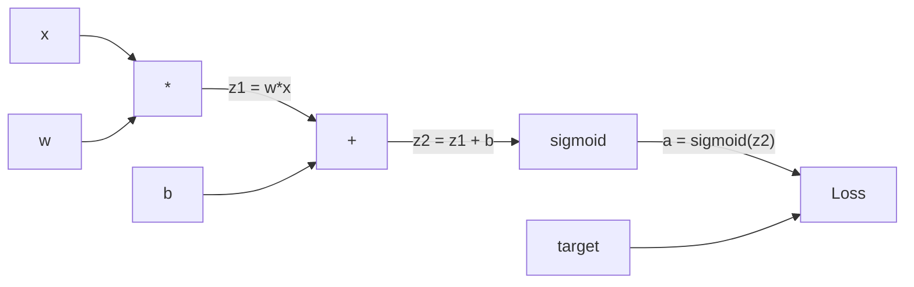
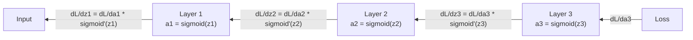

# 从头实现反向传播

> 反向传播是使学习成为可能的算法。没有它，神经网络只是昂贵的随机数生成器。

**类型：** 构建
**语言：** Python
**前置知识：** 课程 03.02（多层网络）
**时间：** ~120 分钟

## 学习目标

- 实现一个基于 Value 的自动梯度引擎，构建计算图并通过拓扑排序计算梯度
- 使用链式法则推导加法、乘法和 sigmoid 的反向传播
- 仅使用你从头构建的反向传播引擎在 XOR 和圆形分类上训练多层网络
- 识别深度 sigmoid 网络中的梯度消失问题，并解释梯度为何呈指数级缩小

## 问题

你的网络有一个隐藏层，有 768 个输入和 3072 个输出。那是 2,359,296 个权重。它做出了一个错误的预测。哪些权重导致了错误？逐个测试每个权重意味着 230 万次前向传播。反向传播在一次反向传播中计算出所有 230 万个梯度。这不是优化。这是可训练和不可能之间的区别。

朴素的方法：取一个权重，微调一丁点，再次运行前向传播，测量损失是上升还是下降。这给了你该权重的梯度。现在对网络中每个权重重复。再乘以数千个训练步骤和数百万个数据点。你需要地质时间才能训练出任何有用的东西。

反向传播解决了这个问题。一次前向传播，一次反向传播，所有梯度全部算完。技巧来自微积分中的链式法则，系统地应用于计算图。这就是使深度学习变得实用的算法。没有它，我们仍会困在玩具问题上。

## 概念

### 链式法则，应用于网络

快速回顾：如果 y = f(g(x))，则 dy/dx = f'(g(x)) * g'(x)。你沿着链乘导数。

在神经网络中，"链"是从输入到损失的操作序列。每一层应用权重、加偏置、通过激活函数传递。损失函数比较最终输出和目标。反向传播反向追踪这个链，计算每个操作对误差的贡献程度。

### 计算图

每次前向传播构建一个图。每个节点是一个操作（乘、加、sigmoid）。每条边向前携带一个值，向后携带一个梯度。



前向传播：值从左向右流动。反向传播：梯度从右向左流动。

### 梯度通过网络流动

对于 3 层网络，梯度通过每一层链接：



在每一层，梯度乘以 sigmoid 导数。sigmoid 导数是 a * (1 - a)，最大值为 0.25（当 a = 0.5 时）。三层深：梯度已被乘以最多 0.25^3 = 0.0156。十层深：0.25^10 = 0.000001。

### 梯度消失

这就是梯度消失问题。Sigmoid 将其输出压缩在 0 和 1 之间。它的导数总是小于 0.25。堆叠足够多的 sigmoid 层，梯度就会消失。早期层几乎不学习，因为它们接收接近零的梯度。

```
sigmoid(z)：     输出范围 [0, 1]
sigmoid'(z)：    最大值 0.25（在 z = 0 处）

5 层之后：  gradient * 0.25^5 = 0.001x 原始值
10 层之后： gradient * 0.25^10 = 0.000001x 原始值
```

这就是为什么深度 sigmoid 网络几乎不可能训练。解决办法——ReLU 及其变种——是课程 04 的主题。现在，理解反向传播工作完美。问题在于它要通过什么传播。

### 推导 2 层网络的梯度

前向传播：
```
z1 = W1 * x + b1
a1 = sigmoid(z1)
z2 = W2 * a1 + b2
a2 = sigmoid(z2)
L = (a2 - y)^2
```

反向传播（逐步应用链式法则）：
```
dL/da2 = 2(a2 - y)
da2/dz2 = a2 * (1 - a2)
dL/dz2 = dL/da2 * da2/dz2
dL/dW2 = dL/dz2 * a1
dL/db2 = dL/dz2
dL/da1 = dL/dz2 * W2
da1/dz1 = a1 * (1 - a1)
dL/dz1 = dL/da1 * da1/dz1
dL/dW1 = dL/dz1 * x
dL/db1 = dL/dz1
```

每个梯度都是从损失回溯的局部导数的乘积。这就是全部的反向传播。

## 构建它

### 第 1 步：Value 节点

每个数字变成了一个 Value。它存储数据、梯度和它的创建方式（以便知道如何向后计算梯度）。

```python
class Value:
    def __init__(self, data, children=(), op=''):
        self.data = data
        self.grad = 0.0
        self._backward = lambda: None
        self._children = set(children)
        self._op = op
```

```figure
backprop-vanishing
```

### 第 2 步：带反向传播函数的操作

```python
def __add__(self, other):
    other = other if isinstance(other, Value) else Value(other)
    out = Value(self.data + other.data, (self, other), '+')
    def _backward():
        self.grad += out.grad
        other.grad += out.grad
    out._backward = _backward
    return out

def __mul__(self, other):
    other = other if isinstance(other, Value) else Value(other)
    out = Value(self.data * other.data, (self, other), '*')
    def _backward():
        self.grad += other.data * out.grad
        other.grad += self.data * out.grad
    out._backward = _backward
    return out
```

`+=` 是关键的。一个 Value 可能被用于多个操作。它的梯度是所有路径上梯度的和。

### 第 3 步：Sigmoid 和损失

```python
def sigmoid(self):
    x = self.data; x = max(-500, min(500, x))
    s = 1.0 / (1.0 + math.exp(-x))
    out = Value(s, (self,), 'sigmoid')
    def _backward():
        self.grad += (s * (1 - s)) * out.grad
    out._backward = _backward
    return out

def mse_loss(predicted, target):
    diff = predicted + Value(-target)
    return diff * diff
```

### 第 4 步：反向传播

拓扑排序确保我们以正确的顺序处理节点：

```python
def backward(self):
    topo = []; visited = set()
    def build_topo(v):
        if v not in visited:
            visited.add(v)
            for child in v._children:
                build_topo(child)
            topo.append(v)
    build_topo(self)
    self.grad = 1.0
    for v in reversed(topo):
        v._backward()
```

### 第 5 步：层和网络

```python
class Neuron:
    def __init__(self, n_inputs):
        scale = (2.0 / n_inputs) ** 0.5
        self.weights = [Value(random.uniform(-scale, scale)) for _ in range(n_inputs)]
        self.bias = Value(0.0)
    def __call__(self, x):
        act = sum((wi * xi for wi, xi in zip(self.weights, x)), self.bias)
        return act.sigmoid()
    def parameters(self):
        return self.weights + [self.bias]
```

### 第 6 步：在 XOR 上训练

```python
net = Network([2, 4, 1])
learning_rate = 1.0

for epoch in range(1000):
    total_loss = Value(0.0)
    for inputs, target in xor_data:
        x = [Value(i) for i in inputs]
        pred = net(x)
        loss = mse_loss(pred, target)
        total_loss = total_loss + loss
    net.zero_grad()
    total_loss.backward()
    for p in net.parameters():
        p.data -= learning_rate * p.grad
```

## 使用它

PyTorch 在几行中完成了上述所有操作：

```python
import torch
import torch.nn as nn

model = nn.Sequential(
    nn.Linear(2, 4), nn.Sigmoid(),
    nn.Linear(4, 1), nn.Sigmoid(),
)
optimizer = torch.optim.SGD(model.parameters(), lr=1.0)
criterion = nn.MSELoss()

for epoch in range(1000):
    pred = model(X)
    loss = criterion(pred, y)
    optimizer.zero_grad()
    loss.backward()
    optimizer.step()
```

## 交付物

本课程产出：
- `outputs/prompt-gradient-debugger.md`——用于诊断任何神经网络中梯度问题的可复用提示词

## 练习

1. 添加 `__sub__` 和 `__neg__` 方法到 Value 类。验证梯度是否正确。
2. 添加 `relu` 方法到 Value。在隐藏层用 relu 替换 sigmoid 并在 XOR 上训练。比较收敛速度。
3. 实现 `__pow__` 方法用于整数幂。替换 `mse_loss`。
4. 在训练循环中添加梯度裁剪：调用 backward() 后，将所有梯度裁剪到 [-1, 1]。
5. 训练后打印网络中每个参数的梯度。识别哪一层的梯度最小。

## 关键术语

| 术语 | 人们的说法 | 实际含义 |
|------|------------|----------|
| 反向传播 | "网络学习" | 通过应用链式法则反向遍历计算图来计算每个权重的 dL/dw 的算法 |
| 计算图 | "网络结构" | 节点为操作、边携带值（正向）和梯度（反向）的有向无环图 |
| 链式法则 | "乘导数" | 反向传播的数学基础 |
| 梯度消失 | "深层网络不学习" | 梯度在通过具有饱和激活（如 sigmoid）的层时呈指数级缩小 |
| 前向传播 | "运行网络" | 通过顺序应用每层的操作从输入计算输出并存储中间值 |
| 反向传播 | "计算梯度" | 反向遍历计算图，在每节点使用链式法则累积梯度 |

## 延伸阅读

- Rumelhart, Hinton & Williams, "Learning representations by back-propagating errors" (1986)
- 3Blue1Brown, "Neural Networks"系列 (https://www.youtube.com/playlist?list=PLZHQObOWTQDNU6R1_67000Dx_ZCJB-3pi)
