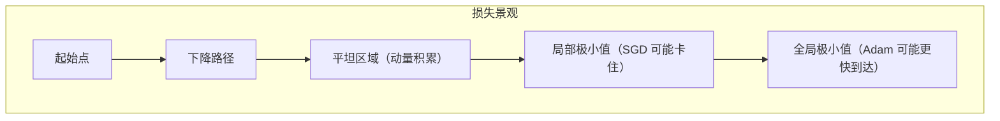

# 优化器：SGD、动量、Adam

> 梯度告诉你方向。优化器决定步伐。一个糟糕的步长比错误的方向更能破坏训练。

**类型：** 构建
**语言：** Python
**前置知识：** 课程 03.03（反向传播）、课程 03.05（损失函数）
**时间：** ~75 分钟

## 学习目标

- 从头实现带动量的 SGD、RMSprop 和 Adam
- 解释为什么固定的学习率在损失景观的平坦区域停滞，以及动量如何克服这一点
- 在复杂损失景观上训练时，在同一网络中混合不同的优化器（SGD 用于权重，Adam 用于偏置）
- 检测 Adam 更新中梯度平方的衰减问题，并解释围绕零的 ε 项为何是必要的

## 问题

梯度指向最陡上升的方向。走反方向是行不通的。但走多远？一个固定的步长在陡峭区域使训练发散，在平坦区域又停滞不前。到达谷底后，你就在最小值周围振荡，永远无法精确地稳定下来。

优化器不仅仅是走下山。它们处理的是当"山"有 10M 个维度时发生的情况。固定学习率是不可能的——你需要每参数的适应率、冲过小凹陷的动量，以及当你到达平坦区域时能够刹车。批量梯度下降、带动量的 SGD 和 Adam 是解决这些问题的三种工具。

最基本的优化器（SGD）在大约 30 年后仍然被使用，因为它在泛化方面表现良好——在最优点周围振荡实际上有助于找到更宽的极小值。Adam 通过保持每个参数的适应性学习率，加速了早期训练，但可能在后期微调中挣扎。理解何时使用哪一个，以及为什么。

## 概念

### 损失景观概览

可视化一个二维损失面，具有陡峭的墙壁、平坦的山谷和局部极小值：



三种优化器采用不同的路径穿越这个景观。

### SGD：基础

SGD（随机梯度下降）使用梯度更新权重。没有技巧，没有衰减，只有一个学习率。

```
w = w - lr * gradient
```

它很简单并且仍然被广泛使用，因为它的噪声有助于泛化。SGD 找到的最小值趋向于更平坦、更宽的极小值，这些极小值在测试集上的泛化效果往往更好。代价：收敛慢。

### 动量：穿过平坦区域

动量累积过去梯度的指数衰减和：

```
v = momentum * v - lr * gradient
w = w + v
```

想象一个球滚下山。动量使它穿过小凹陷和狭窄的平坦区域。没有动量，SGD 在平坦区域停滞不前（梯度接近零，所以权重不变）。有了动量，速度会保持并携带它通过平坦区域。

标准动量值为 0.9。更高的动量（0.99）携带了你几乎无法阻止的更大惯性，可能导致发散。低于 0.5 的动量几乎没有帮助。

### Adam：自适应学习率

自适应矩估计（Adam）为每个参数保持单独的学习率。它跟踪梯度的一阶矩（均值）和二阶矩（未中心化的方差）。

```
m = beta1 * m + (1 - beta1) * gradient      （一阶矩）
v = beta2 * v + (1 - beta2) * gradient^2      （二阶矩）

m_hat = m / (1 - beta1^t)                     （偏差纠正）
v_hat = v / (1 - beta2^t)

w = w - lr * m_hat / (sqrt(v_hat) + epsilon)
```

这意味着每个参数的有效学习率被缩放为 lr / RMS（梯度）。频繁接收到大量梯度的参数学习得更慢。很少接收到梯度的参数更快地加速。这是自动的，按参数进行的。

默认值：lr=1e-3，beta1=0.9，beta2=0.999，epsilon=1e-8。梯度平方（beta2=0.999）的极长衰减意味着 v 统计了基本上所有过去梯度的平方——给予非常稳定的 RMS 度量。

### 优化器如何缩放？

损失景观中的路径比较：

| 特征 | SGD | 动量 | Adam |
|---------|-----|----------|------|
| 平坦区域 | 停滞 | 快速穿过 | 快速穿过 |
| 陡峭峡谷 | 振荡 | 平稳 | 平稳 |
| 鞍点 | 卡住 | 可以穿过 | 快速穿过 |
| 泛化 | 最好 | 好 | 可以 |
| 训练速度 | 最慢 | 中等 | 最快 |

一条经验法则：Adam 用于早期快速实验，SGD 用于后期微调以获得最佳性能。许多论文实际上在训练过程中切换——先用 Adam 预训练，再用 SGD 微调。

## 构建它

### 第 1 步：SGD

```python
class SGD:
    def __init__(self, parameters, lr=0.01):
        self.parameters = parameters
        self.lr = lr

    def step(self):
        for p in self.parameters:
            p.data -= self.lr * p.grad

    def zero_grad(self):
        for p in self.parameters:
            p.grad = 0.0
```

### 第 2 步：带动量的 SGD

```python
class SGDMomentum:
    def __init__(self, parameters, lr=0.01, momentum=0.9):
        self.parameters = parameters
        self.lr = lr
        self.momentum = momentum
        self.velocities = [0.0 for _ in parameters]

    def step(self):
        for i, p in enumerate(self.parameters):
            self.velocities[i] = self.momentum * self.velocities[i] - self.lr * p.grad
            p.data += self.velocities[i]
```

### 第 3 步：Adam

```python
class Adam:
    def __init__(self, parameters, lr=0.001, beta1=0.9, beta2=0.999, eps=1e-8):
        self.parameters = parameters
        self.lr = lr
        self.beta1 = beta1
        self.beta2 = beta2
        self.eps = eps
        self.m = [0.0 for _ in parameters]
```figure
optimizer-trajectory
```

        self.v = [0.0 for _ in parameters]
        self.t = 0

    def step(self):
        self.t += 1
        for i, p in enumerate(self.parameters):
            self.m[i] = self.beta1 * self.m[i] + (1 - self.beta1) * p.grad
            self.v[i] = self.beta2 * self.v[i] + (1 - self.beta2) * p.grad * p.grad

            m_hat = self.m[i] / (1 - self.beta1 ** self.t)
            v_hat = self.v[i] / (1 - self.beta2 ** self.t)

            p.data -= self.lr * m_hat / (math.sqrt(v_hat) + self.eps)
```

### 第 4 步：在 XOR 上训练比较

在 XOR 数据集上训练同一个网络，分别使用 SGD、动量 SGD 和 Adam。比较收敛速度和最终损失。Adam 应当收敛最快，但在最低损失上可争论。

### 第 5 步：鞍点演示

创建一个在 x=0 处为鞍点的损失景观（L(x) = x^4 - x^2）。Adam 应当快速穿过该点，而纯 SGD 可能卡住。

## 使用它

PyTorch 提供了所有这些：

```python
import torch.optim as optim

optimizer = optim.SGD(model.parameters(), lr=0.01, momentum=0.9)
optimizer = optim.Adam(model.parameters(), lr=0.001, betas=(0.9, 0.999))

for epoch in range(100):
    pred = model(x)
    loss = criterion(pred, y)
    optimizer.zero_grad()
    loss.backward()
    optimizer.step()
```

## 交付物

本课程产出：
- `outputs/prompt-optimizer-tuner.md`——为任何训练运行选择正确的优化器和超参数的可复用提示词

## 练习

1. 偏置专门优化器。用 Adam 优化你的网络权重，SGD 优化偏置。两者都需要收敛。
2. 追踪训练过程中 Adam 的 m 和 v 缓冲区——打印每个轮次后每个参数的平均步长。
3. 在 Adam 更新中实现权重衰减：在梯度步骤之后，将所有权重衰减一个因子。
4. 尝试 Nesterov 动量：在计算梯度之前用动量更新参数。它与标准动量相比如何？
5. 扩展鞍点实验，使用 Rastrigin 函数，这是优化器测试中常见的高度多模态景观。

## 关键术语

| 术语 | 人们的说法 | 实际含义 |
|------|------------|----------|
| 优化器 | "更新权重的算法" | 使用梯度来更新网络参数的迭代算法 |
| SGD | "随机梯度下降" | 基于当前批次梯度的基本权重更新：w = w - lr * grad |
| 动量 | "惯性" | 将梯度更新的指数衰减平均值应用于权重更新，帮助穿过平坦区域 |
| Adam | "自适应矩估计" | 为每个参数保持适应性学习率的优化器，结合动量和 RMSprop |
| 偏差纠正 | "Adam 的冷启动" | Adam 在步骤 1 中除以 (1 - beta^t)，以便在梯度的指数移动平均值开始累积时正确缩放它们 |
| 学习率 | "步长" | 控制每次梯度更新中权重变化大小的超参数 |
| 鞍点 | "一个方向下坡，另一个方向上坡" | 梯度为零的临界点，SGD 在此卡住但动量/Adam 可能逃逸 |

## 延伸阅读

- Kingma & Ba, "Adam: A Method for Stochastic Optimization" (ICLR 2015)
- Qian, "On the momentum term in gradient descent learning algorithms" (1999)
- Sutskever et al., "On the importance of initialization and momentum in deep learning" (2013)
