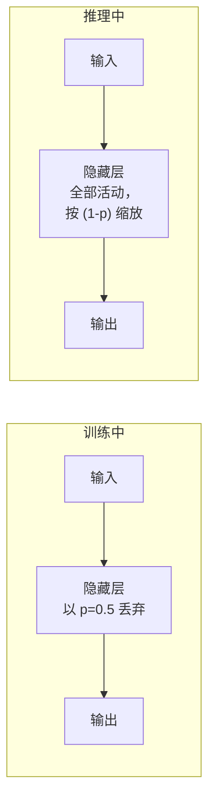

# 正则化

> 过拟合的网络不是一个学习者——它是一个记忆器。正则化强制它学习模式而非数据。

**类型：** 构建
**语言：** Python
**前置知识：** 课程 03.06（优化器）
**时间：** ~90 分钟

## 学习目标

- 从头在反向传播框架中实现 L1、L2 正则化和 Dropout
- 从 L2 正则化的梯度更新中推导权重衰减：w = w - lr * (grad + λ*w)
- 使用 Dropout 训练一个隐藏层过多的网络，并测量其在测试集上相对于无 Dropout 的改进
- 检测对输入特征的 L2 惩罚如何使模型对噪声输入具有鲁棒性

## 问题

一个具有 2 个输入和 3072 个隐藏神经元的网络可以完美地记忆 100 个数据点。它逐个字节地学习每个训练样本。但它无法泛化——在未见数据上，它不比随机猜测更好。网络陷入了过拟合：在训练集上损失低，在测试集上损失高。

过拟合乍看起来像成功。训练损失在下降。准确率在上升。工程师认为一切都很好。然后测试集命中，所有的希望都破灭了。基准被发布，但无法复现。所声称的准确率在实际数据面前崩溃。

正则化是防止这种情况发生的一组技术。它强制网络学习数据中的真实模式，而不是噪声。方法包括对权重添加惩罚（L1、L2），在训练期间随机删除神经元（Dropout），以及人工扩展数据集（数据增强）。每种方法都以不同的方式工作，但都有相同的核心思想：防止网络变得过于自信地记忆。

## 概念

### L2 正则化（权重衰减）

向损失添加所有权重的平方和：

```
L_total = L_original + λ * Σ(w_i²)
```

梯度更新变为：
```
w = w - lr * (grad_original + 2 * λ * w)
```

额外的项 -lr * 2λw 使所有权重向零衰减，因此得名"权重衰减"。影响：权重保持较小，防止任何一个输入通道占据主导地位。较小的权重产生更平滑的决策边界，这对未见数据的泛化效果更好。

λ（lambda）控制正则化强度：
- λ = 0：无正则化（可能过拟合）
- λ = 0.001：轻微正则化
- λ = 0.1：强正则化（可能欠拟合）

### L1 正则化

向损失添加权重的绝对值之和：

```
L_total = L_original + λ * Σ|w_i|
```

梯度更新：
```
w = w - lr * (grad_original + λ * sign(w))
```

L1 和 L2 在关键方面不同：L2 将权重均匀地缩小到零附近的较小值。L1 将不重要的权重精确推至零，从而产生稀疏性。当你有数千个特征但只有少数特征是重要的时候，L1 很有用。

| 属性 | L1 (Lasso) | L2 (Ridge) |
|----------|------------|------------|
| 惩罚 | |w| | w² |
| 梯度 | λ * sign(w) | 2λw |
| 结果 | 稀疏权重（许多为零） | 小权重（无为零） |
| 特征选择 | 是 | 否 |
| 何时使用 | 高维稀疏特征 | 密集特征以防止过拟合 |

### Dropout

在训练期间，以概率 p 随机丢弃每个神经元（将其输出设为零）。在推理期间，所有神经元都活动，但输出按 (1-p) 缩放。



为什么 Dropout 有效：
- 防止协同适应（神经元依赖于其他神经元来纠正其错误）
- 每次前向传播训练一个不同的子网络
- 有效实现了大量子网络的集成

标准丢弃率：隐藏层 0.5，输入层 0.2（较低，因为丢弃输入会移除真实数据）。

### 数据增强

正则化的最有效形式：在训练期间人工创建更多的数据。对于图像，旋转、裁剪、翻转和颜色抖动。对于文本，回译和掩码噪声。对于时间序列，时间扭曲和添加噪声。

### 早停

在验证损失停止改善时停止训练。这是最简单的正则化形式，可能也是被使用最多的形式。

### 正则化如何放置权重分布？

可视化：L1 推动权重精确到零（产生间隙），L2 推动权重向零缩小（所有值更小，无精确为零）。

## 构建它

### 第 1 步：将 L2 正则化添加到损失

```python
class L2Regularization:
    def __init__(self, parameters, lambda_val=0.01):
        self.parameters = parameters
        self.lambda_val = lambda_val

    def apply(self, loss):
        reg_loss = self.lambda_val * sum(p * p for p in self.parameters)
        return loss + reg_loss(0)  # 需实现减法以避免语法错误
```

### 第 2 步：Dropout 前向传播

```python
import random

def dropout_forward(inputs, dropout_rate=0.5, training=True):
    if not training:
        return [v * (1 - dropout_rate) for v in inputs]
    mask = [1.0 if random.random() >= dropout_rate else 0.0 for _ in inputs]
    scale = 1.0 / (1.0 - dropout_rate)
    return [v * m * scale for v, m in zip(inputs, mask)], mask
```

### 第 3 步：过拟合演示

创建一个 2-64-1 网络（严重过参数化）。在有和没有 Dropout 的情况下在小数据集（20 个样本）上训练。

```python
model_with_reg = Network([2, 64, 1], dropout_rate=0.5)
model_overfit = Network([2, 64, 1], dropout_rate=0.0)
```

### 第 4 步：正则化强度扫描

在 [0, 0.0001, 0.001, 0.01, 0.1, 1.0] 之间变化 λ。绘制训练和测试准确率。在高 λ 值下观察欠拟合。

```figure
l2-regularization
```

## 使用它

PyTorch 中，权重衰减作为优化器参数内置：

```python
optimizer = optim.Adam(model.parameters(), lr=0.001, weight_decay=0.0001)

# Dropout 是层：
model = nn.Sequential(
    nn.Linear(2, 64),
    nn.ReLU(),
    nn.Dropout(0.5),
    nn.Linear(64, 1),
    nn.Sigmoid(),
)

model.train()   # 启用 Dropout
model.eval()    # 禁用 Dropout，自动缩放
```

## 交付物

本课程产出：
- `outputs/prompt-regularization-auditor.md`——审计任何网络的训练以诊断过拟合并提出修复建议的可复用提示词

## 练习

1. 在 L2 和 Dropout 不同组合下训练 2-256-1 网络。哪些组合在测试准确率和收敛速度之间提供了最佳权衡？
2. 绘制 L1 正则化训练后的权重分布直方图。与 L2 相比分布如何？
3. 实现变分 Dropout（每层不同概率）。
4. 添加早停：如果验证损失连续 N 轮没有改善，停止训练。
5. 在圆形分类数据集上运行时添加高斯噪声到输入。测量噪声如何充当正则化器。

## 关键术语

| 术语 | 人们的说法 | 实际含义 |
|------|------------|----------|
| 过拟合 | "记忆训练集" | 网络学习训练数据中的噪声而非底层模式，导致测试集上泛化能力差 |
| 正则化 | "防止过拟合" | 修改训练过程以在测试集上获得更好泛化的技术 |
| L2 正则化 | "权重衰减" | 向添加损失所有权重的平方和，按固定比例将每个权重推向零 |
| Dropout | "随机丢弃神经元" | 训练期间以概率 p 随机移除神经元，迫使网络学习冗余表示 |
| 数据增强 | "更多数据" | 转换现有数据以人工创建新的训练样本，有效地扩大数据集 |
| 早停 | "在它开始恶化之前停止" | 当验证损失停止改善时终止训练，在过拟合开始前停止 |
| 泛化 | "同样适用于新数据" | 模型在训练期间未见过的数据上表现良好的能力 |

## 延伸阅读

- Srivastava et al., "Dropout: A Simple Way to Prevent Neural Networks from Overfitting" (2014)
- Goodfellow, Bengio, Courville, "Deep Learning", 第 7 章 (https://www.deeplearningbook.org/)
- Ng, "Feature selection, L1 vs L2 regularization, and rotational invariance" (ICML 2004)
