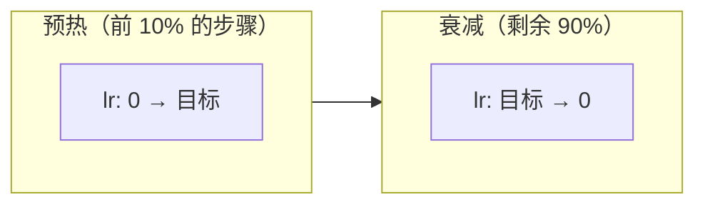

# 学习率调度

> 一个固定的学习率在训练中从未正确。开始需要大步，结束需要小步。调度是用来实现这一点的策略。

**类型：** 构建
**语言：** Python
**前置知识：** 课程 03.06（优化器）
**时间：** ~60 分钟

## 学习目标

- 从头实现阶跃衰减、指数衰减、余弦退火和循环学习率调度
- 解释为什么热门冷启动（高学习率然后退火）在实践中的效果优于固定学习率
- 测量不同 LR 调度下的训练损失曲线，以区分平稳收敛和振荡发散
- 为 Adam 和 SGD 调度学习率，并解释 Adam 的 3e-4 经验法则的来源

## 问题

你设置了 lr = 0.01。前十步有效。损失在下降。到第一百步，网络正在振荡。学习率太大了——你在最小值周围跳跃，永远无法稳定下来。你设置了 lr = 0.0001。现在学习永远不会开始。权重在缓慢移动，仿佛在糖浆中跋涉。在 1000 步之后，损失几乎没有下降。不存在一个适用于整个训练过程的学习率。你需要一个能在开始时快速前进、结束时谨慎接近的学习率。

学习率调度是随训练过程改变学习率的策略。开始时大的学习率快速穿过宽广的平坦区域。后来小的学习率稳定地陷入更深的极小值区域。调度是训练系统之间的关键区别——在论文中，调度通常被埋藏在代码注释中，但它是使竞争优势成为可能的原因。

对于 SGD，需要的衰减更加激进（从 0.1 降到 0.001）。对于 Adam，范围更窄（从 1e-3 降到 1e-5），因为适应性学习率已经处理了每参数缩放。Adam 的 3e-4 经验法则是一个在实践中几乎始终有效的起始点——大致的启发式是，它是由注意力的交叉熵训练确定的，其中默认的 0.001 略微不稳定。

## 概念

### 阶段 1：热启动（预热）

在非常早期的训练阶段，网络还没有看到一个训练样本的像样数量。梯度是巨大的，因为权重是随机的——它们的范数在早期是最大值的。使用一个大的学习率会立即发散。预热是在几千步内从 0 线性上升到目标学习率。



### 阶段 2：余弦退火

Loshchilov & Hutter (ICLR 2017) 推广了余弦调度。学习率在整个训练过程中按照半余弦曲线下降：从 lr_max 开始，平滑地下降到 lr_min。

```
lr(t) = lr_min + 0.5 * (lr_max - lr_min) * (1 + cos(t / T * π))
```

余弦退火之所以有效，是因为它平滑地降低了学习率，避免了阶跃下降带来的不连续性。这对 SGD 来说至关重要——对 Adam 来说也很不错，但不太重要，因为 Adam 的适应性步长已经自然处理了降低。

### 阶段 3：余弦退火热重启（SGDR）

Loschilov & Hutter 还证明，突然提高学习率（热重启）可以帮助网络逃逸局部极小值并找到更平坦的极小值。他们称之为 SGDR：随机梯度下降与热重启。

```
lr(t) = lr_min + 0.5 * (lr_max - lr_min) * (1 + cos(t / T_i * π))
```

其中 T_i 在每次重启后增长（例如，T_{i+1} = 2 * T_i）。每次重启将学习率重置回初始最大值。网络"抖掉"当前最小值并探索损失景观。

### 循环学习率

Smith (2017) 表明，在一个范围内循环学习率——而不是单调地降低它——可以更快地训练并实现更好的泛化。循环 LR 调度在三解形波中变化 LR：线性上升和下降。如果您进行超参数扫描，找出最小 LR 和最大 LR 的边界，这个范围的边界提供了最高的学习率，同时对收敛保持稳定性。

### 调度族

| 调度 | 公式 | 何时使用 |
|--------|---------|-----------|
| 固定 | lr = 常数 | 从不 |
| 阶跃衰减 | 每 N 轮乘以 gamma | 经典计算机视觉 |
| 指数衰减 | lr_0 * gamma^epoch | 快速衰退是合适的 |
| 余弦退火 | 余弦从 max 到 min | 现代训练（推荐） |
| 余弦重启 | 余弦 + 周期性重置 | 从卡住的极小值逃逸 |
| 循环 | 线性波浪 | 超参数扫描 |

## 构建它

### 第 1 步：调度器基类

```python
class LRScheduler:
    def __init__(self, optimizer, initial_lr):
        self.optimizer = optimizer
        self.initial_lr = initial_lr

    def get_lr(self, epoch):
        raise NotImplementedError

    def step(self, epoch):
        lr = self.get_lr(epoch)
        for param_group in self.optimizer.param_groups:
            param_group['lr'] = lr
        return lr
```

### 第 2 步：实现几个调度器

```python
import math

class StepDecay(LRScheduler):
    def __init__(self, optimizer, initial_lr, step_size=30, gamma=0.1):
        super().__init__(optimizer, initial_lr)
        self.step_size = step_size
        self.gamma = gamma

    def get_lr(self, epoch):
        return self.initial_lr * (self.gamma ** (epoch // self.step_size))

class ExponentialDecay(LRScheduler):
    def __init__(self, optimizer, initial_lr, gamma=0.95):
        super().__init__(optimizer, initial_lr)
        self.gamma = gamma

    def get_lr(self, epoch):
        return self.initial_lr * (self.gamma ** epoch)

class CosineAnnealing(LRScheduler):
    def __init__(self, optimizer, initial_lr, T_max, lr_min=0):
        super().__init__(optimizer, initial_lr)
        self.T_max = T_max
        self.lr_min = lr_min

    def get_lr(self, epoch):
        return self.lr_min + 0.5 * (self.initial_lr - self.lr_min) * (1 + math.cos(math.pi * epoch / self.T_max))

class CosineAnnealingWarmRestarts(LRScheduler):
    def __init__(self, optimizer, initial_lr, T_0=10, T_mult=2, lr_min=0):
        super().__init__(optimizer, initial_lr)
        self.T_0 = T_0
        self.T_mult = T_mult
        self.lr_min = lr_min
        self.T_i = T_0
        self.T_cur = 0

    def get_lr(self, epoch):
        self.T_cur += 1
        if self.T_cur >= self.T_i:
            self.T_cur = 0
            self.T_i *= self.T_mult
        return self.lr_min + 0.5 * (self.initial_lr - self.lr_min) * (1 + math.cos(math.pi * self.T_cur / self.T_i))

class CyclicLR(LRScheduler):
    def __init__(self, optimizer, base_lr, max_lr, step_size_up=2000):
        super().__init__(optimizer, base_lr)
        self.base_lr = base_lr
        self.max_lr = max_lr
        self.step_size_up = step_size_up
        self.step = 0

    def get_lr(self, epoch):
        self.step += 1
        cycle = math.floor(1 + self.step / (2 * self.step_size_up))
        x = abs(self.step / self.step_size_up - 2 * cycle + 1)
        return self.base_lr + (self.max_lr - self.base_lr) * max(0, 1 - x)
```

### 第 3 步：调度器比较

在具有固定学习率和相同优化器的多分类问题上训练相同的网络。对于 SGD，余弦退火应优于固定的低学习率。

### 第 4 步：LR Range Test

通过在每个小批次逐步增加学习率来找到最佳 LR 范围，并记录损失。该曲线显示"三阶段"模式：低学习率下降，中间范围平台期，高学习率发散。

```figure
lr-schedule
```

## 使用它

PyTorch 提供了调度器：

```python
import torch.optim.lr_scheduler as lr_scheduler

optimizer = optim.SGD(model.parameters(), lr=0.1)

scheduler = lr_scheduler.CosineAnnealingLR(optimizer, T_max=100)
scheduler = lr_scheduler.StepLR(optimizer, step_size=30, gamma=0.1)
scheduler = lr_scheduler.CosineAnnealingWarmRestarts(optimizer, T_0=10)

for epoch in range(100):
    train_one_epoch()
    scheduler.step()
```

## 交付物

本课程产出：
- `outputs/prompt-lr-scheduler-chooser.md`——为任何训练运行选择正确的 LR 调度和参数的可复用提示词

## 练习

1. 在具有不同 LR 调度的 XOR 问题上比较 SGD 训练：固定 0.01、固定 0.1、余弦退火。绘制每个的损失曲线。
2. 实现一个预热阶段：从 lr=0 线性上升到目标 lr，然后进行余弦退火。
3. 运行 LR Range Test（在一系列小批次中将 LR 从非常小增加到非常大）并绘制损失与 LR 的关系图。识别最佳 LR。
4. 用单个 LR 调度器同时调度 Adam 和 SGD。
5. 实现"余弦退火热重启"并验证在每次重启后，损失跳过局部极小值。

## 关键术语

| 术语 | 人们的说法 | 实际含义 |
|------|------------|----------|
| 学习率调度 | "改变学习率" | 在训练过程中系统地改变学习率以平衡早期速度和后期稳定性的策略 |
| 余弦退火 | "平滑衰减" | 沿着余弦曲线降低学习率，从最大值平滑过渡到最小值 |
| 预热 | "从 0 开始" | 在几千步内从 0 线性增加到目标学习率，避免早期步长过大 |
| 热重启 | "再次提高学习率" | 周期性将学习率重置为高值，使优化器逃逸局部极小值 |
| 循环学习率 | "上下调整 LR" | 将学习率在边界之间循环，提供变化以实现更好的泛化 |
| 三阶段 | "LR Range Test 模式" | 描绘出 LR Range Test 中三个不同的阶段：下降、平台期、发散 |

## 延伸阅读

- Loshchilov & Hutter, "SGDR: Stochastic Gradient Descent with Warm Restarts" (ICLR 2017)
- Loshchilov & Hutter, "Fixing Weight Decay Regularization in Adam" (2017)
- Smith, "Cyclical Learning Rates for Training Neural Networks" (WACV 2017)
- Smith & Topin, "Super-Convergence: Very Fast Training of Neural Networks Using Large Learning Rates" (2018)
