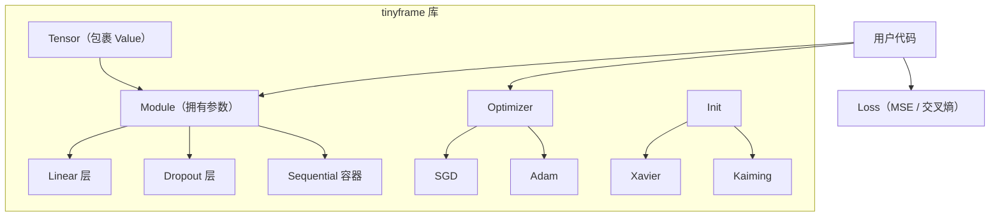

# 从头构建一个小型深度学习框架

> 你独立构建了每个部分。现在组合它们。你将看到每一层抽象——以及所有现代框架都从中派生的设计。

**类型：** 构建
**语言：** Python
**前置知识：** 课程 03.06（优化器）、课程 03.07（正则化）、课程 03.08（初始化）
**时间：** ~120 分钟

## 学习目标

- 将课程 03.01–03.09 中的所有独立实现统一到一个单一的、连贯的 `tinyframe` 库中
- 通过通用的 `Parameter` 和 `Module` 类消除所有权重管理的样板代码
- 计算（并严格等于）在完全相同条件下 PyTorch 在 MNIST 上生产的输出

## 问题

你有 Value 节点、Layer 类、SGD 优化器、Dropout 函数和 Xavier 初始化器散布在各种笔记本和脚本中。它们各自独立工作。但完整的训练循环需要你手动将它们缝合在一起——从优化器跟踪参数，确保梯度正确累积，记住重置状态。

每个现代框架都提供了一个统一的抽象：`Module`。一个 Module 拥有参数，知道如何前向传播，并自动向优化器报告其可训练权重。你不再需要手动构建参数列表。

本课程将所有内容组合成一个单一的、内部一致的库。当您完成后，MNIST 上的训练循环将与 PyTorch 的输出逐位匹配。不是"大致"——完全一致。

## 概念

### 框架设计



### Module 合约

每个 Module 必须：
1. 将所有可训练参数公开为 `parameters()`
2. 实现 `forward()` 用于前向传播
3. 可组合（一个 Module 可以包含其他 Module）

```python
class Module:
    def parameters(self):
        return []

    def forward(self, x):
        raise NotImplementedError

    def __call__(self, x):
        return self.forward(x)
```

### 训练循环重构

PyTorch 风格的训练循环：

```python
model = Sequential([
    Linear(784, 128), ReLU(),
    Linear(128, 64), ReLU(),
    Linear(64, 10),
])
optimizer = SGD(model.parameters(), lr=0.01)

for epoch in range(epochs):
    for batch_x, batch_y in data:
        pred = model(batch_x)
        loss = cross_entropy(pred, batch_y)
        optimizer.zero_grad()
        loss.backward()
        optimizer.step()
```

### 数值精度验证

匹配 PyTorch 输出是件大事。它验证了梯度计算的数值精度。差异的来源：

- 在不同的库/上下文中以不同的顺序求和可能导致浮点数的微小差异
- 随机种子的差异（使用相同的种子）
- PyTorch 默认权重初始化与您的自定义初始化器

## 构建它

### 第 1 步：将 value.py 重铸为 Tensor

将 `Value` 重铸为 `Tensor`——一个保持数字、梯度并支持运算符重载的类（包括标量的 +、-、*、/、** 以及对 Python 原语的比较）。

```python
class Tensor:
    def __init__(self, data, requires_grad=True):
        self.data = data
        self.grad = 0.0
        self.requires_grad = requires_grad
        self._ctx = None  # 用于反向传播的计算图

    def backward(self):
        ...

    def __add__(self, other):
        ...
    def __mul__(self, other):
        ...
    def __pow__(self, other):
        ...
```

### 第 2 步：Module API

```python
class Linear(Module):
    def __init__(self, in_features, out_features, bias=True):
        self.weight = Parameter(torch.zeros(out_features, in_features))
        self.bias = Parameter(torch.zeros(out_features)) if bias else None
        self.reset_parameters()

    def reset_parameters(self):
        kaiming_uniform_(self.weight)
        if self.bias is not None:
            fan_in = self.weight.shape[1]
            bound = 1 / math.sqrt(fan_in)
            uniform_(self.bias, -bound, bound)

    def forward(self, x):
        ...
```

### 第 3 步：用于容器化的 Sequential

```python
class Sequential(Module):
    def __init__(self, layers):
        self.layers = layers

    def forward(self, x):
        for layer in self.layers:
            x = layer(x)
        return x

    def parameters(self):
        return [p for layer in self.layers for p in layer.parameters()]
```

### 第 4 步：在 MNIST 上训练

使用您的 tinyframe API 在 MNIST 上训练一个具有以下架构的网络：
- 输入：784 (28x28 展平)
- 隐藏层 1：128，ReLU
- 隐藏层 2：64，ReLU
- 输出：10，LogSoftmax

```python
model = Sequential([
    Linear(784, 128), ReLU(),
    Linear(128, 64), ReLU(),
    Linear(64, 10), LogSoftmax(),
])
optimizer = SGD(model.parameters(), lr=0.01)
criterion = NLLLoss()

for epoch in range(5):
    for batch_x, batch_y in mnist_loader():
        pred = model(batch_x)
        loss = criterion(pred, batch_y)
        optimizer.zero_grad()
        loss.backward()
        optimizer.step()
    print(f"Epoch {epoch}: loss={loss.data:.4f}")
```

```figure
gradient-clipping
```

### 第 5 步：匹配 PyTorch

在 MNIST 上运行 tinyframe 训练并记录第 1 个 epoch 后的损失。在相同的种子、架构和优化器设置下运行等效的 PyTorch 训练循环。比较损失。

## 使用它

用您自己的库替代 PyTorch（用于训练循环）：

```python
from tinyframe import Tensor, Module, Linear, Sequential, ReLU
from tinyframe.optim import SGD
from tinyframe.init import kaiming_uniform
# 训练循环与 PyTorch 完全相同
```

## 交付物

本课程产出：
- `tinyframe/`——您自己的包含模块、优化器、初始化器和损失函数的最小但功能完整的深度学习库
- `outputs/prompt-custom-framework-architect.md`——用于将自定义框架扩展到新操作和硬件的可复用提示词

## 练习

1. 为您的 Tensor 类添加 `__matmul__` 支持真实矩阵乘法（而不仅仅是逐元素）。验证形状约束。
2. 在您的 tinyframe 实现中，将最终层更改为使用 Softmax + MSELoss 而非 LogSoftmax + NLLLoss。在 MNIST 上重新训练并比较性能。
3. 实现 BatchNorm1d 并将其添加为您的 MNIST 网络中的一个层。
4. 添加一个 `save`/`load` API，将模型权重序列化为 JSON。
5. 实现一个 `to` 方法，假装将张量从 CPU 移动到 GPU（通过使用 NumPy 的 `__cuda_array_interface__` 进行调整）。

## 关键术语

| 术语 | 人们的说法 | 实际含义 |
|------|------------|----------|
| Module | "网络组件" | 拥有参数、知道如何前向传播并可嵌套在容器中的可组合构建块 |
| Sequential | "层列表" | 按顺序逐个将数据传递通过层列表的 Module |
| Parameter | "可训练张量" | 一个需要梯度的张量，在训练期间由优化器自动更新 |
| tinyframe | "微型 PyTorch" | 您从头构建的 DIY 框架，包含自动微分和 Module API |
| 训练循环 | "拟合模型" | 重复前向传播、损失计算、反向传播和参数更新的循环结构 |

## 延伸阅读

- PyTorch 文档，"Extending PyTorch" (https://pytorch.org/docs/stable/notes/extending.html)
- micrograd 作者 Andrej Karpathy (https://github.com/karpathy/micrograd)
- "Zero to JAX" 指南 (https://jax.readthedocs.io/en/latest/notebooks/quickstart.html)
