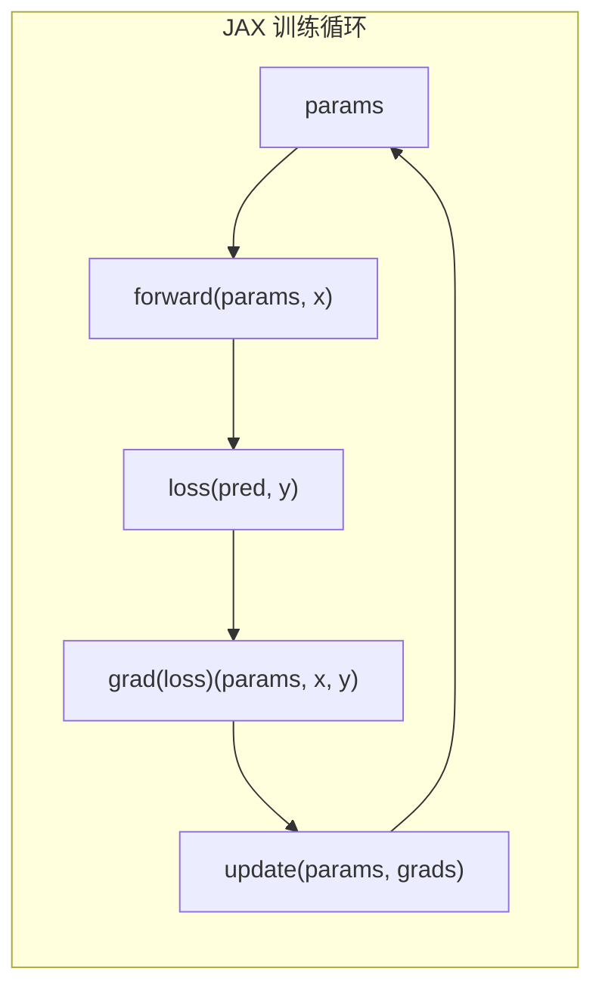

# JAX 入门

> PyTorch 是命令式的——逐步构建。JAX 是函数式的——组合变换。转变你的思维模式。

**类型：** 参考
**语言：** Python
**前置知识：** 课程 03.10（微框架）
**时间：** ~60 分钟

## 学习目标

- 解释 JAX 的函数式范式（纯函数、无状态、变换）与 PyTorch 的命令式状态之间的核心差异
- 使用 `jit`、`grad` 和 `vmap` 在 MNIST 分类器上编译和向量化训练循环
- 编写一个完全无状态的训练循环，其中模型参数作为显式参数传递
- 实现一个自定义的 `ParamTree` 类以模拟一个可变的、状态化的训练循环，同时保留 JAX 的函数式核心

## 问题

你已经习惯了 PyTorch。你实例化一个模型，调用 `model.to(device)`，运行 `loss.backward()`，然后调用 `optimizer.step()`。模型内部保持其状态。

JAX 不以这种方式工作。在 JAX 中，没有"模型对象"来保持状态。没有 `loss.backward()`。没有 `optimizer.step()`。相反，你将纯函数组合起来，通过变换传递它们。

```
PyTorch：x -> model(x)    （模型保持状态）
JAX：     f(params, x)    （状态是显式参数）
```

这感觉很不对。但当你理解它时，它就释放了力量。JAX 的函数式方法意味着用 `jit` 进行即时编译（将整个函数编译为高效的 GPU 内核）、用 `vmap` 进行自动向量化（将单个样本函数转换为批处理版本）、以及用 `pmap` 进行自动并行化（跨多个 GPU 分片工作）都是对相同底层代码应用的**纯变换**。

## 概念

### JAX 的核心哲学

JAX 不是一个框架。它是一个用于数值计算的**可组合函数变换库**。

| 变换 | 做什么 | PyTorch 等价物 |
|-----------|--------|----------------|
| `jit(f)` | 将 `f` 编译为 XLA | `torch.compile()` |
| `grad(f)` | 返回计算 `f` 梯度的函数 | `loss.backward()` |
| `vmap(f)` | 向量化 `f` 以处理批次 | 手动批处理 |
| `pmap(f)` | 在多个设备上并行化 | `DistributedDataParallel` |
| `lax.scan` | 带状态的循环 | `for` 循环 |

关键洞察：这些变换是**可组合的**。你可以嵌套它们：

```python
# 关于批次中每个样本的损失、在多个设备上、经过编译的梯度
grad_loss = jit(grad(loss), device=devices)
```

### 纯函数

JAX 函数必须是纯的——无副作用，无隐藏状态。如果你编写一个修改全局变量的函数，JAX 会默默地忽略该修改（因为它追踪函数的数值操作，而不是 Python 的副作用）。

```python
# 不好的：JAX 忽略副作用
counter = 0
def bad_f(x):
    global counter
    counter += 1
    return x * 2

# 好的：显式状态
def good_f(x, counter):
    return x * 2, counter + 1
```

### 函数式训练循环



每个步骤接收参数并返回新的参数。没有内部突变。

### PRNG 状态

JAX 不像 `numpy.random.seed(42)` 那样工作。相反，它显式地将随机状态作为参数传递：

```python
key = jax.random.PRNGKey(42)  # 获取一个 key
key, subkey = jax.random.split(key)  # 从中拆分
params = jax.random.normal(subkey, shape=(784, 128))
```

## 构建它

### 第 1 步：安装并导入

```python
import jax
import jax.numpy as jnp
from jax import random, grad, jit, vmap
```

### 第 2 步：定义参数

在 JAX 中没有 `nn.Linear`——参数是显式的：

```python
def init_mlp_params(key, layer_sizes):
    keys = random.split(key, len(layer_sizes) - 1)
    params = []
    for key_in, n_in, n_out in zip(keys, layer_sizes[:-1], layer_sizes[1:]):
        w = random.normal(key_in, (n_in, n_out)) * jnp.sqrt(2.0 / n_in)
        b = jnp.zeros((n_out,))
        params.append((w, b))
    return params
```

### 第 3 步：前向传播

```python
def relu(x):
    return jnp.maximum(0, x)

def forward(params, x):
    for w, b in params[:-1]:
        x = relu(x @ w + b)
    w_last, b_last = params[-1]
    logits = x @ w_last + b_last
    return logits - jax.nn.log_softmax(logits)
```

### 第 4 步：损失和梯度

```python
def loss_fn(params, x, y):
    logits = forward(params, x)
    one_hot = jax.nn.one_hot(y, num_classes=10)
    return -jnp.mean(jnp.sum(one_hot * logits, axis=-1))

@jit
def update(params, x, y, lr=0.01):
    grads = grad(loss_fn)(params, x, y)
    return [(w - lr * dw, b - lr * db) for (w, b), (dw, db) in zip(params, grads)]
```

### 第 5 步：训练循环

```python
key = random.PRNGKey(42)
key, subkey = random.split(key)
params = init_mlp_params(subkey, [784, 128, 64, 10])

for epoch in range(10):
    for batch_x, batch_y in data_loader:  # 任何兼容的 DataLoader
        params = update(params, batch_x, batch_y)
    print(f"Epoch {epoch}: loss = {loss_fn(params, test_x, test_y):.4f}")
```

## 使用它

JAX 在那些对编译和并行化有显著需求的领域中大放异彩。例如，跨多个 GPU 和批次位置训练相同的 MNIST 分类器：

```python
# pmap 在第一个轴（设备）上并行化
parallel_update = pmap(update, axis_name='devices')

# 将数据拆分为设备数份
batch_x = batch_x.reshape(num_devices, -1, 784)
batch_y = batch_y.reshape(num_devices, -1)
params = parallel_update(params, batch_x, batch_y)
```

## 交付物

本课程产出：
- `mnist_jax.py`——用 JAX 编写的 MNIST 训练脚本
- `outputs/pytorch-vs-jax-cheatsheet.md`——并排参考

## 练习

1. 使用 `jax.lax.scan` 实现训练循环，以在单次函数调用中运行整个训练过程（无 Python for 循环）。（提示：`scan` 要求所有状态都是显式的。）
2. 调整 MNIST 架构以添加 Dropout。实施 Dropout 需要显式传递 PRNG key。为什么？
3. 在不修改 `init_mlp_params` 的情况下，使用 `vmap` 对三个不同的初始化 key 进行超参数扫描。
4. 导出一个 `param_count` 函数以报告 JAX 参数树中的总浮点值。
5. 使用 `jax.numpy` 实现一个执行时间比 NumPy 快 10 倍的线性代数运算。提示：需要大型矩阵。

## 关键术语

| 术语 | 人们的说法 | 实际含义 |
|------|------------|----------|
| JAX | "GPU 上的 NumPy" | 用于高性能数值计算的库，具有可组合的函数变换 |
| 函数式编程 | "无副作用" | 程序通过组合不修改外部状态的纯函数来构建的范式 |
| `jit` | "即时编译" | 将 Python 函数编译为 XLA 的变换，以加速执行 |
| `grad` | "自动微分" | 返回计算给定函数梯度的函数的变换 |
| `vmap` | "向量化映射" | 重写函数以处理批量的变换，通过自动添加批次维度 |
| `pmap` | "并行映射" | 在多个设备（CPU、GPU、TPU）上并行化函数的变换 |
| PRNG | "随机状态" | JAX 显式的、函数式的随机状态管理——key 被拆分和传递，而非种子设定 |
| 参数树 | "参数列表" | JAX 中任意的参数嵌套结构（列表、元组、字典） |

## 延伸阅读

- JAX 文档：https://jax.readthedocs.io/
- "JAX for the Impatient" 指南
- 官方常见问题解答：https://jax.readthedocs.io/en/latest/faq.html
