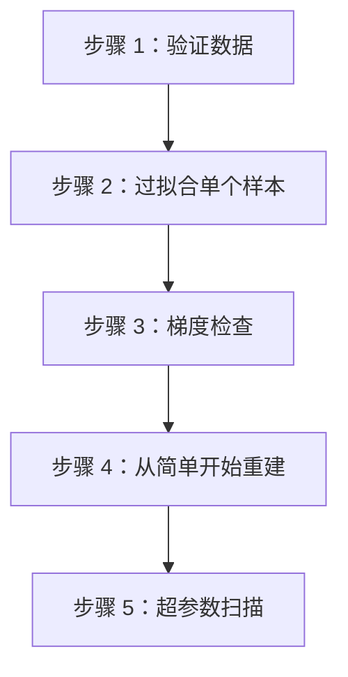

# 神经网络调试

> 神经网络从不第一次就工作。调试它们的可靠过程是区分有成就的工程师和困惑的爱好者的分水岭。

**类型：** 实践
**语言：** Python
**前置知识：** 课程 03.03（反向传播）、课程 03.10（微框架）
**时间：** ~90 分钟

## 学习目标

- 通过 5 步调试过程诊断并修复不收敛的神经网络：数据验证 → 过拟合单个样本 → 梯度检查 → 重建 → 超参数扫描
- 将梯度检查应用于 tinyframe 的 Value 类，以在 1e-5 的容差内验证反向传播实现
- 实现一个梯度健康监视器，该监视器标记死亡神经元、消失的梯度和爆炸的更新
- 在训练循环中追踪 NaN 到其根源——除以零、日志中的负输入或大权重初始化

## 问题

你的损失是 nan。你的梯度是零。或者梯度是 inf。或者网络只是产生垃圾——损失在 0.693 处平稳，与随机猜测无法区分。没有错误信息。没有堆栈跟踪。只是一个从未下降的损失曲线。

神经网络无声地失败。没有 TypeErrors 告诉你"梯度消失"。没有 IndexErrors 说"学习率太高"。你得到一个漂亮的、平滑的、水平不变的损失图，你的周末就没了。

本课程为您提供一个用于神经网络调试的**可靠过程**。一个你可以每次遵循的逐步检查表。当你开始感到沮丧时，你可以引用它。

## 概念

### 5 步调试过程



### 步骤 1：验证数据

在触摸模型之前确保数据是正确的。修复数据错误可以防止你在被污染的数据上浪费数小时的工作：

```python
def debug_data(X, y):
    print(f"形状：X={X.shape}, y={y.shape}")
    print(f"X 范围：[{X.min():.4f}, {X.max():.4f}]")
    print(f"y 分布：{np.bincount(y)}")
    print(f"NaN 值：X={np.isnan(X).any()}, y={np.isnan(y).any()}")
    print(f"样本 0：X[0]={X[0]}, y[0]={y[0]}")
```

如果标签是静态的，数据是归一化的，并且形状匹配，转到步骤 2。

### 步骤 2：过拟合单个样本

这是最重要的调试步骤。你的模型需要能够学习任何东西——如果它不能在单个数据点上过拟合，它永远不会在大数据集上学习。

```python
# 取一个样本
x_single = X[0:1]
y_single = y[0:1]

# 训练
for epoch in range(500):
    pred = model(x_single)
    loss = criterion(pred, y_single)
    optimizer.zero_grad()
    loss.backward()
    optimizer.step()
    if epoch % 50 == 0:
        print(f"{epoch}: loss={loss.item():.6f}")
```

如果损失没有下降到接近零，你的模型就无法学习。问题在于（按可能性排序）：
1. 学习率错误（太高或太低）
2. 优化器错误（更新是错误的）
3. 前向传播错误（形状不匹配）
4. 梯度计算错误

### 步骤 3：梯度检查

通过有限差分验证你的反向传播梯度：

```python
def gradient_check(model, x, y, epsilon=1e-5):
    loss_fn = lambda: criterion(model(x), y)
    loss_fn()
    model.zero_grad()
    loss.backward()

    for name, param in model.named_parameters():
        param_flat = param.data.view(-1)
        grad_flat = param.grad.view(-1)
        for i in range(min(10, len(param_flat))):
            param_flat[i] += epsilon
            loss_plus = loss_fn()
            param_flat[i] -= 2 * epsilon
            loss_minus = loss_fn()
            param_flat[i] += epsilon
            numerical = (loss_plus - loss_minus) / (2 * epsilon)
            print(f"  {name}[{i}]: numerical={numerical:.8f} backward={grad_flat[i]:.8f} "
                  f"diff={abs(numerical - grad_flat[i]):.8f}")
```

最大 diff 应小于 epsilon 的 10 倍（1e-4）。如果相差更大，说明反向传播中存在错误。

### 步骤 4：从简单开始重建

如果前 3 个步骤已经通过，但网络仍然不收敛，将问题简化到最简单的形式：
- 移除正则化（Dropout、权重衰减）
- 使用最简单的架构（2 层，每层少量神经元）
- 使用 vanilla SGD（无动量，无 Adam）
- 使用单个隐藏层

### 步骤 5：超参数扫描

如果模型可以在简化后学习，但加入复杂性后失败，运行系统性的超参数扫描：

| 超参数 | 扫描范围 | 日志尺度 |
|----------------|-------------|---------------|
| 学习率 | [1e-5, 1e-1] | 是 |
| 隐藏层大小 | [8, 16, 32, 64, 128] | 否 |
| 层数 | [1, 2, 3, 4] | 否 |
| 批量大小 | [8, 16, 32, 64] | 否 |
| 动量 | [0.0, 0.5, 0.9, 0.99] | 否 |

### 常见问题和修复

| 症状 | 问题 | 修复 |
|---------|---------|------|
| 损失为 NaN | 梯度爆炸 | 降低 LR，添加梯度裁剪，检查除零 |
| 损失在 log(2) = 0.693 平稳 | 随机分类输出 | 检查标签，确保损失函数正确 |
| 损失从第一个 epoch 上升 | LR 太高 | 降低 LR 10 倍 |
| 损失从不下降 | LR 太低 | 提高 LR 10 倍，检查梯度是否非零 |
| 损失振荡 | LR 太高 | 降低 LR，增加动量 |
| 训练准确率 100%，测试准确率 50% | 过拟合 | 添加正则化，更多数据 |

## 构建它

### 第 1 步：可复现调试脚本

```python
def diagnose_training(model, dataloader, criterion, optimizer, epochs=5):
    """运行诊断并在问题出现时标记它们。"""
    print("=" * 60)
    print("诊断训练...")
    print("=" * 60)

    for epoch in range(epochs):
        epoch_loss = 0
        for batch_x, batch_y in dataloader:
            pred = model(batch_x)
            loss = criterion(pred, batch_y)

            if jnp.isnan(loss).any():
                print(f"[ALERT] NaN 损失在 epoch {epoch}")
                return

            if loss > 1e6:
                print(f"[ALERT] 损失爆炸在 epoch {epoch}: {loss:.4f}")
                return

            optimizer.zero_grad()
            loss.backward()

            total_grad_norm = 0
            dead_neurons = 0
            for p in model.parameters():
                total_grad_norm += jnp.sum(p.grad ** 2)
                if hasattr(p, 'is_relu') and p.grad.sum() == 0:
                    dead_neurons += 1

            optimizer.step()
            epoch_loss += loss

        print(f"Epoch {epoch}: loss={epoch_loss:.4f}, "
              f"grad_norm={jnp.sqrt(total_grad_norm):.6f}, "
              f"dead_neurons={dead_neurons}")
```

### 第 2 步：实现梯度健康监视器

```python
class GradientHealthMonitor:
    def __init__(self, model):
        self.model = model

    def step(self):
        stats = {}
        for name, param in self.model.named_parameters():
            if param.grad is not None:
                grad = param.grad
                stats[name] = {
                    'mean': grad.mean().item(),
                    'std': grad.std().item(),
                    'min': grad.min().item(),
                    'max': grad.max().item(),
                    'dead': (grad == 0).sum().item(),
                    'nan': jnp.isnan(grad).sum().item(),
                    'inf': jnp.isinf(grad).sum().item(),
                }
                if stats[name]['nan'] > 0:
                    print(f"[ALERT] {name} 包含 NaN 梯度！")
                if stats[name]['inf'] > 0:
                    print(f"[ALERT] {name} 包含 Inf 梯度！")
                if stats[name]['dead'] > 0.5 * grad.numel():
                    print(f"[ALERT] {name} 有 {stats[name]['dead']}/{grad.numel()} 死亡梯度！")
        return stats
```

### 第 3 步：创建一个全面的调试终端

```python
def full_debug_session(model_class, dataset, debug_steps):
    print("FULL DEBUG SESSION")
    print("=" * 60)

    print("\n[步骤 1] 验证数据...")
    debug_data(dataset.data, dataset.targets)

    print("\n[步骤 2] 过拟合单个样本...")
    single_sample_overfit(model_class, dataset[0])

    print("\n[步骤 3] 梯度检查...")
    gradient_check(model_class, dataset)

    print("\n[步骤 4] 超参数扫描...")
    hyperparameter_scan(model_class, dataset)

    print("\n[DONE] 如果需要，打开手册进行步骤 5。")
```

### 第 4 步：故意引入常见错误

在你的 tinyframe 中，将 sigmoid 激活替换为恒等函数并在 XOR 上训练。损失是 NaN。反向传播中的除以 0 是罪魁祸首。

```figure
learning-curves
```

## 使用它

```python
from debug import diagnose_training

diagnose_training(
    model=my_model,
    dataloader=train_loader,
    criterion=nn.MSELoss(),
    optimizer=optimizer,
    epochs=10
)
```

## 交付物

本课程产出：
- `debug.py`——包含 GradientHealthMonitor、梯度检查器和完整调试过程的模块
- `outputs/skill-neural-network-debugger.md`——一个可复用的技能，用于在培训期间调试任何神经网络

## 练习

1. 在你的 tinyframe 网络中通过翻转损失函数中的符号（target - pred 而非 pred - target）引入一个 bug。调试过程发现它了吗？
2. 实现一个"最佳学习率查找器"（在课程 09 的 LR Range Test 之后）并提取推荐的范围。
3. 添加一个自动汇报器，在训练完成后生成一个带有损失图、梯度直方图和参数分布的 HTML 页面。
4. 引入梯度裁剪以避免爆炸——然后验证裁剪钩子是否修正了损失爆炸。
5. 实现了一个自动修复 NaN 损失的恢复钩子。

## 关键术语

| 术语 | 人们的说法 | 实际含义 |
|------|------------|----------|
| 梯度检查 | "验证反向传播" | 通过有限差分逼近梯度并检查是否与反向传播梯度匹配来验证计算 |
| 梯度裁剪 | "防止爆炸" | 当梯度的范数超过阈值时对其进行缩放，防止在陡峭的区域发散 |
| 梯度健康 | "跟踪梯度统计" | 监控梯度范数、均值和方差以诊断消失/爆炸梯度 |
| 过拟合单个样本 | "它还能学吗？" | 在单个数据点上训练模型以检查它是否能达到接近零的损失 |
| 损失纳米 | "NaN 损失" | 由于爆炸梯度造成的除零、日志负值或数值溢出而导致的损失值 NaN |
| 梯度 norm | "梯度的范数" | 所有参数梯度的总 Frobenius 范数，在每次训练步骤后作为总体健康指标进行监控 |

## 延伸阅读

- "A Recipe for Training Neural Networks" by Andrej Karpathy (https://karpathy.github.io/2019/04/25/recipe/)
- "Stanford CS231n: Debugging Neural Networks" (http://cs231n.github.io/neural-networks-3/)
- "Debugging Neural Networks: A Taxonomy of Common Errors" by Matthew Stewart
