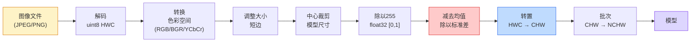
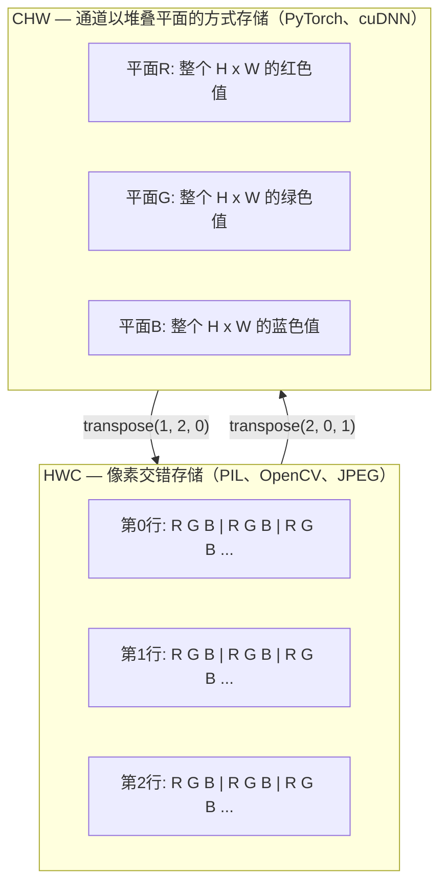

# 图像基础——像素、通道、色彩空间

> 图像是光样本的张量。你将使用的每一个视觉模型都始于这一事实。

**类型：** 构建
**语言：** Python
**前置知识：** 第一阶段第12课（张量运算），第三阶段第11课（PyTorch入门）
**时间：** ~45分钟

## 学习目标

- 解释连续场景如何被离散化为像素，以及采样/量化决策如何决定所有下游模型的上限
- 以NumPy数组形式读取、切片和检查图像，并在HWC和CHW布局之间流畅切换
- 在RGB、灰度、HSV和YCbCr之间转换，并证明每种色彩空间存在的理由
- 应用像素级预处理（归一化、标准化、调整大小、通道优先），完全按照torchvision的期望

## 问题

你读的每篇论文、下载的每个预训练权重、调用的每个视觉API都假设输入的特定编码。将`uint8`图像传给期望`float32`的模型，它仍然会运行——然后静默地产生垃圾。将BGR馈送给在RGB上训练的网络，准确率会下降十个百分点。将通道在最后的输入交给期望通道在前面的模型，第一个卷积层会把高度当作特征通道。这些都不会抛出错误。它们只会毁掉你的指标，而你花一周时间寻找一个存在于文件加载方式中的错误。

卷积一旦你知道它在滑动什么就不复杂了。困难的部分在于"图像"对相机、JPEG解码器、PIL、OpenCV、torchvision和CUDA内核意味着不同的东西。每个栈都有自己的轴顺序、字节范围和通道约定。一个不能分清这些的视觉工程师会交付有问题的流水线。

本课打好基础，使本阶段的其余内容可以建立其上。到课程结束时，你将知道什么是像素、为什么每个像素有三个值而非一个、"用ImageNet统计量归一化"实际上做了什么、以及如何在本阶段其他所有课程假定的两三种布局之间切换。

## 概念

### 完整预处理流水线一览

每个生产级视觉系统都是相同的可逆变换序列。搞错一步，模型看到的输入就与其训练时看到的不同。



两个红色和蓝色框是80%的静默失败所在：缺少标准化和错误的布局。

### 像素是采样，不是方块

相机传感器统计落在微小探测器网格上的光子。每个探测器在一个时间片段内积分光线，并发出与撞击光子数成比例的电压。然后传感器将该电压离散化为整数。一个探测器变成一个像素。

```
连续场景                    传感器网格                   数字图像
（无限细节）                （H x W 个探测器）            （H x W 个整数）

    ~~~~~                        +--+--+--+--+--+                 210 198 180 155 120
   ~   ~   ~                     |  |  |  |  |  |                 205 195 178 152 118
  ~  光线  ~     ---->           +--+--+--+--+--+     ---->       200 190 175 150 115
   ~~~~~                         |  |  |  |  |  |                 195 185 170 148 112
                                  +--+--+--+--+--+                 188 180 165 145 108
```

这一步发生两个选择，它们决定了所有下游的上限：

- **空间采样**决定每度场景有多少个探测器。太少，边缘会变得锯齿状（混叠）。太多，存储和计算会爆炸。
- **强度量化**决定电压被分桶的精细程度。8位给出256级，是显示的标准。10、12、16位提供更平滑的渐变，对医学成像、HDR和原始传感器流水线很重要。

像素不是一个有面积的有色方块。它是一个单独的测量值。当你调整大小或旋转时，你正在重新采样该测量网格。

### 为什么是三个通道

一个探测器在整个可见光谱上计数光子——这就是灰度。为了获得颜色，传感器用红色、绿色和蓝色过滤器的马赛克覆盖网格。经过去马赛克处理后，每个空间位置都有三个整数：红色滤波探测器、绿色滤波探测器和附近蓝色滤波探测器的响应。这三个整数就是一个像素的RGB三元组。

```
内存中的一个像素：

    (R, G, B) = (210, 140, 30)   <- 红橙色

一张 H x W 的RGB图像：

    形状 (H, W, 3)     存储为 H 行，每行 W 个像素，每个像素 3 个值
                       每个值在 [0, 255] 范围内（uint8）
```

三个不是神奇的数字。深度相机增加Z通道。卫星增加红外和紫外波段。医学扫描通常有一个通道（X射线、CT）或多个通道（高光谱）。通道数是最后一个轴；卷积层学会跨通道混合。

### 两种布局约定：HWC和CHW

相同的张量，两种顺序。每个库选择一种。

```
HWC（高、宽、通道）              CHW（通道、高、宽）

   W ->                             H ->
  +-----+-----+-----+              +-----+-----+
H |R G B|R G B|R G B|            C |R R R R R R|
| +-----+-----+-----+            | +-----+-----+
v |R G B|R G B|R G B|            v |G G G G G G|
  +-----+-----+-----+              +-----+-----+
                                    |B B B B B B|
                                    +-----+-----+

   PIL、OpenCV、matplotlib、        PyTorch、大多数深度学习
   几乎磁盘上的所有图像文件       框架、cuDNN内核
```

CHW存在是因为卷积核在H和W上滑动。将通道轴放在前面意味着每个核在每个通道上看到一个连续的二维平面，这可以很好地向量化。磁盘格式保持HWC因为这与传感器输出扫描线的方式匹配。

你将输入一千次的一行转换：

```
img_chw = img_hwc.transpose(2, 0, 1)      # NumPy
img_chw = img_hwc.permute(2, 0, 1)        # PyTorch tensor
```

内存布局，可视化：



### 字节范围和数据类型

三种主要约定：

| 约定 | 数据类型 | 范围 | 使用场景 |
|------------|-------|-------|------------------|
| 原始 | `uint8` | [0, 255] | 磁盘上的文件、PIL、OpenCV输出 |
| 归一化 | `float32` | [0.0, 1.0] | `img.astype('float32') / 255` 之后 |
| 标准化 | `float32` | 约[-2, +2] | 减去均值并除以标准差之后 |

卷积网络是在标准化输入上训练的。ImageNet统计量 `mean=[0.485, 0.456, 0.406]`、`std=[0.229, 0.224, 0.225]` 是整个ImageNet训练集上三个通道的算术均值和标准差，在[0, 1]归一化像素上计算。将原始`uint8`输入给期望标准化浮点的模型是应用视觉中最常见的静默失败。

### 色彩空间及其存在的理由

RGB是采集格式，但它并不总是对模型最有用的表示。

```
 RGB               HSV                       YCbCr / YUV

 R 红色             H 色调（角度0-360）       Y 亮度（明亮度）
 G 绿色             S 饱和度（0-1）           Cb 蓝色-黄色色度
 B 蓝色             V 明度/亮度（0-1）        Cr 红色-绿色色度

 线性对应            将颜色与亮度分离。       将亮度与颜色分离。
 传感器输出          对颜色阈值处理、UI        JPEG和大多数视频
                     滑块、简单滤波器有用    编解码器更强烈地压缩
                                               色度通道，因为人眼
                                               对色度细节不如对Y敏感
```

对于大多数现代CNN，你输入RGB。你在以下情况会遇到其他空间：

- **HSV** — 经典CV代码、基于颜色的分割、白平衡。
- **YCbCr** — 读取JPEG内部、视频流水线、仅在Y上操作的超分辨率模型。
- **灰度** — OCR、文档模型、任何颜色是噪声变量而非信号的情况。

从RGB到灰度是加权和而非平均，因为人眼对绿色比红色或蓝色更敏感：

```
Y = 0.299 R + 0.587 G + 0.114 B       (ITU-R BT.601，经典权重)
```

### 宽高比、调整大小和插值

每个模型都有固定的输入尺寸（大多数ImageNet分类器为224x224，现代检测器为384x384或512x512）。你的图像很少匹配。三种重要的调整大小选择：

- **调整短边，然后中心裁剪** — 标准ImageNet方法。保持宽高比，丢弃一绺边缘像素。
- **调整大小并填充** — 保持宽高比和每个像素，添加黑边。检测和OCR的标准方法。
- **直接调整到目标** — 拉伸图像。便宜，扭曲几何形状，对许多分类任务没问题。

插值方法决定新网格与旧网格不对齐时如何计算中间像素：

```
最近邻               最快，块状，仅用于蒙版/标签
双线性               快速，平滑，大多数图像调整大小的默认选择
双三次               较慢，放大时更清晰
Lanczos              最慢，质量最佳，用于最终显示
```

经验法则：训练用双线性，你将查看的资产用双三次或Lanczos，任何包含整数类别ID的用最近邻。

```figure
conv-output-size
```

## 构建

### 第一步：加载图像并检查其形状

使用Pillow加载任何JPEG或PNG，转换为NumPy，并打印你得到了什么。对于离线运行的确定性示例，合成一个。

```python
import numpy as np
from PIL import Image

def synthetic_rgb(h=128, w=192, seed=0):
    rng = np.random.default_rng(seed)
    yy, xx = np.meshgrid(np.linspace(0, 1, h), np.linspace(0, 1, w), indexing="ij")
    r = (np.sin(xx * 6) * 0.5 + 0.5) * 255
    g = yy * 255
    b = (1 - yy) * xx * 255
    rgb = np.stack([r, g, b], axis=-1) + rng.normal(0, 6, (h, w, 3))
    return np.clip(rgb, 0, 255).astype(np.uint8)

arr = synthetic_rgb()
# 或从磁盘加载：
# arr = np.asarray(Image.open("your_image.jpg").convert("RGB"))

print(f"类型:   {type(arr).__name__}")
print(f"数据类型:  {arr.dtype}")
print(f"形状:  {arr.shape}     # (H, W, C)")
print(f"最小值:    {arr.min()}")
print(f"最大值:    {arr.max()}")
print(f"(0, 0)处像素: {arr[0, 0]}")
```

预期输出：`shape: (H, W, 3)`，`dtype: uint8`，范围 `[0, 255]`。这是标准的磁盘表示形式，无论字节来自相机、JPEG解码器还是合成生成器。

### 第二步：分离通道并重新排序布局

分别提取R、G、B，然后从HWC转换为CHW以用于PyTorch。

```python
R = arr[:, :, 0]
G = arr[:, :, 1]
B = arr[:, :, 2]
print(f"R 形状: {R.shape}, 均值: {R.mean():.1f}")
print(f"G 形状: {G.shape}, 均值: {G.mean():.1f}")
print(f"B 形状: {B.shape}, 均值: {B.mean():.1f}")

arr_chw = arr.transpose(2, 0, 1)
print(f"\nHWC 形状: {arr.shape}")
print(f"CHW 形状: {arr_chw.shape}")
```

三个灰度平面，每个通道一个。CHW只是重新排列轴；当内存布局允许时，不需要严格的数据复制。

### 第三步：灰度和HSV转换

加权和灰度，然后手动RGB到HSV。

```python
def rgb_to_grayscale(rgb):
    weights = np.array([0.299, 0.587, 0.114], dtype=np.float32)
    return (rgb.astype(np.float32) @ weights).astype(np.uint8)

def rgb_to_hsv(rgb):
    rgb_f = rgb.astype(np.float32) / 255.0
    r, g, b = rgb_f[..., 0], rgb_f[..., 1], rgb_f[..., 2]
    cmax = np.max(rgb_f, axis=-1)
    cmin = np.min(rgb_f, axis=-1)
    delta = cmax - cmin

    h = np.zeros_like(cmax)
    mask = delta > 0
    rmax = mask & (cmax == r)
    gmax = mask & (cmax == g)
    bmax = mask & (cmax == b)
    h[rmax] = ((g[rmax] - b[rmax]) / delta[rmax]) % 6
    h[gmax] = ((b[gmax] - r[gmax]) / delta[gmax]) + 2
    h[bmax] = ((r[bmax] - g[bmax]) / delta[bmax]) + 4
    h = h * 60.0

    s = np.where(cmax > 0, delta / cmax, 0)
    v = cmax
    return np.stack([h, s, v], axis=-1)

gray = rgb_to_grayscale(arr)
hsv = rgb_to_hsv(arr)
print(f"灰度 形状: {gray.shape}, 范围: [{gray.min()}, {gray.max()}]")
print(f"HSV 形状: {hsv.shape}")
print(f"色调范围: [{hsv[..., 0].min():.1f}, {hsv[..., 0].max():.1f}] 度")
print(f"饱和度范围: [{hsv[..., 1].min():.2f}, {hsv[..., 1].max():.2f}]")
print(f"明度范围: [{hsv[..., 2].min():.2f}, {hsv[..., 2].max():.2f}]")
```

色调以度为单位，饱和度和明度在[0, 1]范围内。这与OpenCV的`hsv_full`约定一致。

### 第四步：归一化、标准化和反向操作

从原始字节到预训练ImageNet模型期望的确切张量，然后再返回。

```python
mean = np.array([0.485, 0.456, 0.406], dtype=np.float32)
std = np.array([0.229, 0.224, 0.225], dtype=np.float32)

def preprocess_imagenet(rgb_uint8):
    x = rgb_uint8.astype(np.float32) / 255.0
    x = (x - mean) / std
    x = x.transpose(2, 0, 1)
    return x

def deprocess_imagenet(chw_float32):
    x = chw_float32.transpose(1, 2, 0)
    x = x * std + mean
    x = np.clip(x * 255.0, 0, 255).astype(np.uint8)
    return x

x = preprocess_imagenet(arr)
print(f"预处理后形状: {x.shape}     # (C, H, W)")
print(f"预处理后类型: {x.dtype}")
print(f"预处理后各通道均值:  {x.mean(axis=(1, 2)).round(3)}")
print(f"预处理后各通道标准差:  {x.std(axis=(1, 2)).round(3)}")

roundtrip = deprocess_imagenet(x)
max_diff = np.abs(roundtrip.astype(int) - arr.astype(int)).max()
print(f"往返最大像素差异: {max_diff}    # 应为 0 或 1")
```

各通道均值应接近零，标准差接近一。预处理/后处理配对正是每个`torchvision.transforms.Normalize`调用在底层做的事情。

### 第五步：用三种插值方法调整大小

比较最近邻、双线性和双三次在放大上的效果，使差异可见。

```python
target = (arr.shape[0] * 3, arr.shape[1] * 3)

nearest = np.asarray(Image.fromarray(arr).resize(target[::-1], Image.NEAREST))
bilinear = np.asarray(Image.fromarray(arr).resize(target[::-1], Image.BILINEAR))
bicubic = np.asarray(Image.fromarray(arr).resize(target[::-1], Image.BICUBIC))

def local_roughness(x):
    gy = np.diff(x.astype(float), axis=0)
    gx = np.diff(x.astype(float), axis=1)
    return float(np.abs(gy).mean() + np.abs(gx).mean())

for name, out in [("最近邻", nearest), ("双线性", bilinear), ("双三次", bicubic)]:
    print(f"{name:>8}  形状={out.shape}  粗糙度={local_roughness(out):6.2f}")
```

最近邻的粗糙度最高，因为它保持硬边缘。双线性最平滑。双三次介于两者之间，保持感知清晰度而不会出现阶梯状伪影。

## 使用

`torchvision.transforms` 将以上所有内容打包成一个可组合的流水线。下面的代码完全复现`preprocess_imagenet`的功能，外加调整大小和裁剪。

```python
import torch
from torchvision import transforms
from PIL import Image

img = Image.fromarray(synthetic_rgb(256, 256))

pipeline = transforms.Compose([
    transforms.Resize(256),
    transforms.CenterCrop(224),
    transforms.ToTensor(),
    transforms.Normalize(mean=[0.485, 0.456, 0.406], std=[0.229, 0.224, 0.225]),
])

x = pipeline(img)
print(f"张量类型:  {type(x).__name__}")
print(f"张量类型: {x.dtype}")
print(f"张量形状: {tuple(x.shape)}      # (C, H, W)")
print(f"各通道均值: {x.mean(dim=(1, 2)).tolist()}")
print(f"各通道标准差:  {x.std(dim=(1, 2)).tolist()}")

batch = x.unsqueeze(0)
print(f"\n批次形状: {tuple(batch.shape)}   # (N, C, H, W) — 准备好输入模型")
```

四个步骤，按此确切顺序：`Resize(256)`将短边缩放到256；`CenterCrop(224)`从中间取224x224的块；`ToTensor()`除以255并将HWC交换为CHW；`Normalize`减去ImageNet均值并除以标准差。颠倒此顺序会静默地改变到达模型的内容。

## 交付

本课产出：

- `outputs/prompt-vision-preprocessing-audit.md` — 一个提示词，将任何模型卡或数据集卡转化为团队必须遵守的精确预处理不变性检查清单。
- `outputs/skill-image-tensor-inspector.md` — 一个技能，给定任何图像形状的张量或数组，报告数据类型、布局、范围，以及它看起来是原始、归一化还是标准化。

## 练习

1. **（简单）** 用OpenCV（`cv2.imread`）和Pillow加载一个JPEG。打印两者的形状和`(0, 0)`处的像素。解释通道顺序的差异，然后编写一行转换使OpenCV数组与Pillow数组相同。
2. **（中等）** 编写`standardize(img, mean, std)`及其逆操作，使它们在任何uint8图像上通过`roundtrip_max_diff <= 1`测试。你的函数必须在单个HWC图像和NCHW批次上使用相同的调用。
3. **（困难）** 取一个3通道的ImageNet标准化张量，通过一个1x1卷积进行运算，该卷积学习RGB的加权混合以生成单个灰度通道。将权重初始化为`[0.299, 0.587, 0.114]`，冻结它们，并验证输出与手动`rgb_to_grayscale`在浮点误差范围内匹配。还有哪些经典的色彩空间变换可以写成1x1卷积？

## 关键术语

| 术语 | 人们说的 | 实际含义 |
|------|----------------|----------------------|
| 像素 | "一个有色方块" | 一个网格位置上的一个光强度样本——彩色是三个数字，灰度是一个数字 |
| 通道 | "颜色" | 堆叠到图像张量中的并行空间网格之一；HWC中是最后一个轴，CHW中是第一个 |
| HWC / CHW | "形状" | 图像张量的轴顺序；磁盘和PIL使用HWC，PyTorch和cuDNN使用CHW |
| 归一化 | "缩放图像" | 除以255使像素位于[0, 1] — 必要但不充分 |
| 标准化 | "零中心化" | 每通道减去均值并除以标准差，使输入分布与模型训练时的分布匹配 |
| 灰度转换 | "平均通道" | 使用系数0.299/0.587/0.114的加权和，匹配人类亮度感知 |
| 插值 | "调整大小如何选取像素" | 当新网格与旧网格不对齐时决定输出值的规则 — 标签用最近邻，训练用双线性，显示用双三次 |
| 宽高比 | "宽除以高" | 区分"调整大小并填充"和"调整大小并拉伸"的比例 |

## 延伸阅读

- [Charles Poynton — A Guided Tour of Color Space](https://poynton.ca/PDFs/Guided_tour.pdf) — 为什么有这么多色彩空间以及每种何时重要的最清晰技术论述
- [PyTorch Vision Transforms Docs](https://pytorch.org/vision/stable/transforms.html) — 你将在生产中实际组合的变换完整流水线
- [How JPEG Works (Colt McAnlis)](https://www.youtube.com/watch?v=F1kYBnY6mwg) — 关于色度子采样、DCT以及为什么JPEG编码YCbCr而非RGB的精彩视觉之旅
- [ImageNet Preprocessing Conventions (torchvision models)](https://pytorch.org/vision/stable/models.html) — `mean=[0.485, 0.456, 0.406]` 的真实来源，以及为什么动物园中的每个模型都期望它
