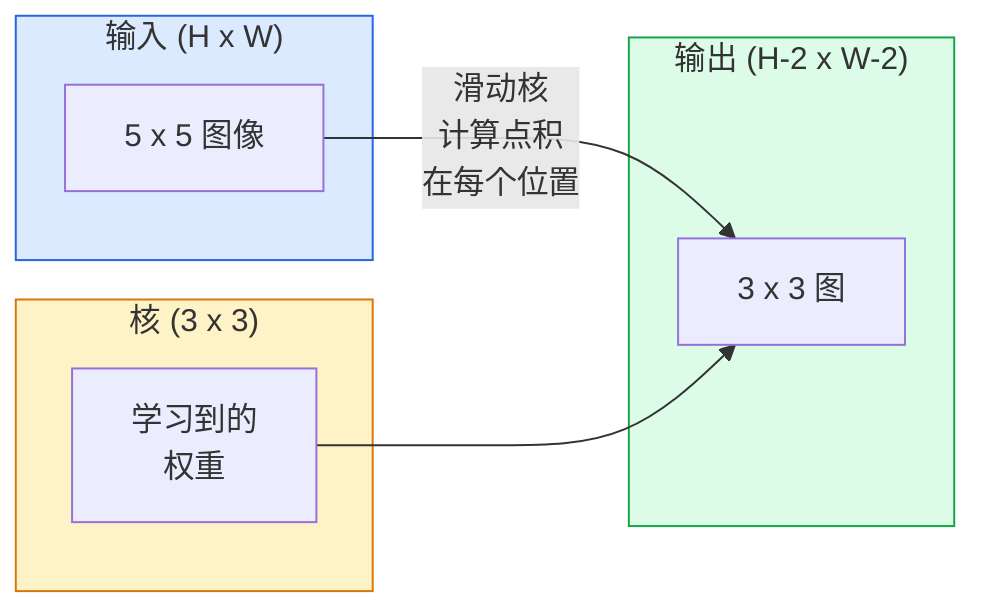
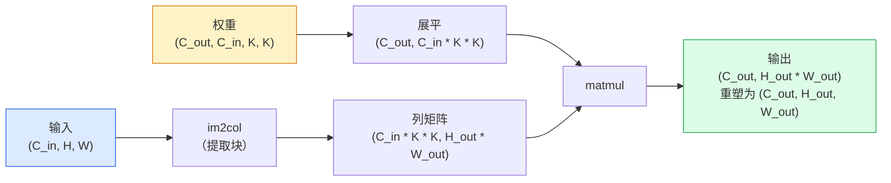

# 从零实现卷积

> 卷积是一个微小的密集层，你将其滑过图像，在每个位置共享相同的权重。

**类型：** 构建
**语言：** Python
**前置知识：** 第三阶段（深度学习核心），第四阶段第01课（图像基础）
**时间：** ~75分钟

## 学习目标

- 仅使用NumPy从零实现2D卷积，包含嵌套循环版本和向量化的`im2col`版本
- 计算任意输入尺寸、核尺寸、填充和步幅下的输出空间大小，并证明`(H - K + 2P) / S + 1`公式
- 手动设计核（边缘、模糊、锐化、Sobel），并解释每种核为何产生它所产生的那种激活模式
- 将卷积堆叠成一个特征提取器，并将堆叠深度与感受野大小联系起来

## 问题

224x224 RGB图像上的全连接层每个神经元需要224 * 224 * 3 = 150,528个输入权重。一个具有1,000个单元的隐藏层已经是1.5亿个参数——在你学到任何有用的东西之前。更糟的是，该层没有概念认为左上角的狗和右下角的狗是相同的模式。它将每个像素位置视为独立的，这对图像来说完全是错误的：将猫平移三个像素不应该迫使网络重新学习这个概念。

图像模型需要的两个属性是**平移等变性**（输出在输入移动时移动）和**参数共享**（相同的特征检测器到处运行）。密集层两者都不给你。卷积则免费给你两者。

卷积不是为深度学习发明的。它是驱动JPEG压缩、Photoshop中的高斯模糊、工业视觉中的边缘检测以及每个已发布的音频滤波器的同一操作。CNN从2012年到2020年主导ImageNet的原因是卷积对于邻近值相关且相同模式可以在任何位置出现的数据是正确的先验。

## 概念

### 一个核，滑动

2D卷积接受一个称为核（或滤波器）的小权重矩阵，将其滑过输入，在每个位置计算逐元素乘积的和。该和成为一个输出像素。



一个5x5输入上的具体3x3示例（无填充，步幅1）：

```
输入 X (5 x 5)：                核 W (3 x 3)：

  1  2  0  1  2                   1  0 -1
  0  1  3  1  0                   2  0 -2
  2  1  0  2  1                   1  0 -1
  1  0  2  1  3
  2  1  1  0  1

核滑过每个有效的3 x 3窗口。输出Y是3 x 3：

 Y[0,0] = sum( W * X[0:3, 0:3] )
 Y[0,1] = sum( W * X[0:3, 1:4] )
 Y[0,2] = sum( W * X[0:3, 2:5] )
 Y[1,0] = sum( W * X[1:4, 0:3] )
 ... 依此类推
```

那个公式——**共享权重、局部性、滑动窗口**——就是整个想法。其他一切都是簿记。

### 输出尺寸公式

给定输入空间大小`H`、核大小`K`、填充`P`、步幅`S`：

```
H_out = floor( (H - K + 2P) / S ) + 1
```

记住这个。你会在每个架构中计算它几十次。

| 场景 | H | K | P | S | H_out |
|----------|---|---|---|---|-------|
| 有效卷积，无填充 | 32 | 3 | 0 | 1 | 30 |
| 相同卷积（保持尺寸） | 32 | 3 | 1 | 1 | 32 |
| 下采样2倍 | 32 | 3 | 1 | 2 | 16 |
| 池化2x2 | 32 | 2 | 0 | 2 | 16 |
| 大感受野 | 32 | 7 | 3 | 2 | 16 |

"相同填充"意味着选择P使得当S == 1时H_out == H。对于奇数K，即P = (K - 1) / 2。这就是为什么3x3核占主导——它们是仍有中心的最小奇数核。

### 填充

没有填充，每个卷积都会缩小特征图。堆叠20个，你的224x224图像变成184x184，浪费了边界上的计算，并使需要匹配形状的残差连接复杂化。

```
5 x 5输入上的零填充（P = 1）：

  0  0  0  0  0  0  0
  0  1  2  0  1  2  0
  0  0  1  3  1  0  0
  0  2  1  0  2  1  0       现在核可以以像素(0, 0)为中心
  0  1  0  2  1  3  0       并且仍然有三行三列的值可以相乘。
  0  2  1  1  0  1  0
  0  0  0  0  0  0  0
```

实践中遇到的模式：`zero`（最常见），`reflect`（镜像边缘，避免生成模型中的硬边界），`replicate`（复制边缘），`circular`（环绕，用于环面问题）。

### 步幅

步幅是滑动的步长。`stride=1`是默认值。`stride=2`将空间维度减半，是在CNN内下采样的经典方式，无需单独的池化层——每个现代架构（ResNet、ConvNeXt、MobileNet）都在某处使用步幅卷积代替最大池化。

```
5 x 5输入上的步幅1，3 x 3核：

  起点: (0,0) (0,1) (0,2)        -> 输出行 0
          (1,0) (1,1) (1,2)        -> 输出行 1
          (2,0) (2,1) (2,2)        -> 输出行 2

  输出: 3 x 3

相同输入上的步幅2：

  起点: (0,0) (0,2)              -> 输出行 0
          (2,0) (2,2)              -> 输出行 1

  输出: 2 x 2
```

### 多输入通道

真实图像有三个通道。RGB输入上的3x3卷积实际上是一个3x3x3的体积：每个输入通道一个3x3切片。在每个空间位置，你跨所有三个切片乘法和求和，并加上偏置。

```
输入:   (C_in,  H,  W)        3 x 5 x 5
核:    (C_in,  K,  K)        3 x 3 x 3（一个核）
输出:  (1,     H', W')       二维图

对于产生C_out个输出通道的层，你堆叠C_out个核：

权重:  (C_out, C_in, K, K)   例如 64 x 3 x 3 x 3
输出:  (C_out, H', W')       64 x 3 x 3

参数计数: C_out * C_in * K * K + C_out   (+ C_out是偏置)
```

最后一行是你在规划模型时会计算的那行。在3通道输入上的64通道3x3卷积有`64 * 3 * 3 * 3 + 64 = 1,792`个参数。很便宜。

### im2col技巧

嵌套循环易于阅读但速度慢。GPU想要大矩阵乘法。技巧：将输入的每个感受野窗口展平为大矩阵的一列，将核展平为一行，整个卷积变成一个矩阵乘法。



每个生产级卷积实现都是某种变体加上缓存分块技巧（直接卷积、Winograd、大核FFT卷积）。理解im2col你就理解了核心。

### 感受野

单个3x3卷积查看9个输入像素。堆叠两个3x3卷积，第二层中的一个神经元查看5x5输入像素。三个3x3卷积给出7x7。一般来说：

```
L个堆叠的K x K卷积后的感受野（步幅1）= 1 + L * (K - 1)

有步幅：感受野随每层的步幅乘性增长。
```

"全用3x3"（VGG、ResNet、ConvNeXt）有效的全部原因在于，两个3x3卷积看到与一个5x5卷积相同的输入区域，但参数更少，且中间有一个额外的非线性。

```figure
convolution-kernel
```

## 构建

### 第一步：填充数组

从最小的原语开始：一个在H x W数组周围用零填充的函数。

```python
import numpy as np

def pad2d(x, p):
    if p == 0:
        return x
    h, w = x.shape[-2:]
    out = np.zeros(x.shape[:-2] + (h + 2 * p, w + 2 * p), dtype=x.dtype)
    out[..., p:p + h, p:p + w] = x
    return out

x = np.arange(9).reshape(3, 3)
print(x)
print()
print(pad2d(x, 1))
```

尾随轴技巧`x.shape[:-2]`意味着同一函数可以在`(H, W)`、`(C, H, W)`或`(N, C, H, W)`上工作而无需修改。

### 第二步：带嵌套循环的2D卷积

参考实现——慢，但明确无误。这就是`torch.nn.functional.conv2d`在原理上所做的。

```python
def conv2d_naive(x, w, b=None, stride=1, padding=0):
    c_in, h, w_in = x.shape
    c_out, c_in_w, kh, kw = w.shape
    assert c_in == c_in_w

    x_pad = pad2d(x, padding)
    h_out = (h + 2 * padding - kh) // stride + 1
    w_out = (w_in + 2 * padding - kw) // stride + 1

    out = np.zeros((c_out, h_out, w_out), dtype=np.float32)
    for oc in range(c_out):
        for i in range(h_out):
            for j in range(w_out):
                hs = i * stride
                ws = j * stride
                patch = x_pad[:, hs:hs + kh, ws:ws + kw]
                out[oc, i, j] = np.sum(patch * w[oc])
        if b is not None:
            out[oc] += b[oc]
    return out
```

四个嵌套循环（输出通道、行、列，加上对C_in、kh、kw的隐式求和）。这就是你将对照检查每个更快实现的基本真值。

### 第三步：用手工设计的核验证

构建垂直Sobel核，将其应用于合成阶跃图像，观察垂直边缘亮起。

```python
def synthetic_step_image():
    img = np.zeros((1, 16, 16), dtype=np.float32)
    img[:, :, 8:] = 1.0
    return img

sobel_x = np.array([
    [[-1, 0, 1],
     [-2, 0, 2],
     [-1, 0, 1]]
], dtype=np.float32)[None]

x = synthetic_step_image()
y = conv2d_naive(x, sobel_x, padding=1)
print(y[0].round(1))
```

期望在第7列有大的正值（从左到右的亮度增加），其他地方为零。那个单一的打印输出是验证数学正确性的检查。

### 第四步：im2col

将输入中的每个核大小窗口转换为矩阵的一列。对于`C_in=3, K=3`，每列是27个数字。

```python
def im2col(x, kh, kw, stride=1, padding=0):
    c_in, h, w = x.shape
    x_pad = pad2d(x, padding)
    h_out = (h + 2 * padding - kh) // stride + 1
    w_out = (w + 2 * padding - kw) // stride + 1

    cols = np.zeros((c_in * kh * kw, h_out * w_out), dtype=x.dtype)
    col = 0
    for i in range(h_out):
        for j in range(w_out):
            hs = i * stride
            ws = j * stride
            patch = x_pad[:, hs:hs + kh, ws:ws + kw]
            cols[:, col] = patch.reshape(-1)
            col += 1
    return cols, h_out, w_out
```

它仍然是一个Python循环，但现在重头戏将是单个向量化的矩阵乘法。

### 第五步：通过im2col + matmul实现快速卷积

用一次矩阵乘法替换四重循环。

```python
def conv2d_im2col(x, w, b=None, stride=1, padding=0):
    c_out, c_in, kh, kw = w.shape
    cols, h_out, w_out = im2col(x, kh, kw, stride, padding)
    w_flat = w.reshape(c_out, -1)
    out = w_flat @ cols
    if b is not None:
        out += b[:, None]
    return out.reshape(c_out, h_out, w_out)
```

正确性检查：运行两个实现并比较。

```python
rng = np.random.default_rng(0)
x = rng.normal(0, 1, (3, 16, 16)).astype(np.float32)
w = rng.normal(0, 1, (8, 3, 3, 3)).astype(np.float32)
b = rng.normal(0, 1, (8,)).astype(np.float32)

y_naive = conv2d_naive(x, w, b, padding=1)
y_im2col = conv2d_im2col(x, w, b, padding=1)

print(f"最大绝对差异: {np.max(np.abs(y_naive - y_im2col)):.2e}")
```

`最大绝对差异`应在`1e-5`左右——差异是浮点累加顺序，不是错误。

### 第六步：手工设计核的集合

五个滤波器，展示单个卷积层在任何训练之前可以表达的内容。

```python
KERNELS = {
    "identity": np.array([[0, 0, 0], [0, 1, 0], [0, 0, 0]], dtype=np.float32),
    "blur_3x3": np.ones((3, 3), dtype=np.float32) / 9.0,
    "sharpen": np.array([[0, -1, 0], [-1, 5, -1], [0, -1, 0]], dtype=np.float32),
    "sobel_x": np.array([[-1, 0, 1], [-2, 0, 2], [-1, 0, 1]], dtype=np.float32),
    "sobel_y": np.array([[-1, -2, -1], [0, 0, 0], [1, 2, 1]], dtype=np.float32),
}

def apply_kernel(img2d, kernel):
    x = img2d[None].astype(np.float32)
    w = kernel[None, None]
    return conv2d_im2col(x, w, padding=1)[0]
```

应用于任何灰度图像，模糊会柔化，锐化会使边缘更清晰，Sobel-x会亮起垂直边缘，Sobel-y会亮起水平边缘。这些正是AlexNet和VGG中第一个训练好的卷积层最终学到的模式——因为无论后续任务是什么，一个好的图像模型都需要边缘和斑点检测器。

## 使用

PyTorch的`nn.Conv2d`封装了具有自动求导、CUDA内核和cuDNN优化的相同操作。形状语义相同。

```python
import torch
import torch.nn as nn

conv = nn.Conv2d(in_channels=3, out_channels=64, kernel_size=3, stride=1, padding=1)
print(conv)
print(f"权重形状: {tuple(conv.weight.shape)}   # (C_out, C_in, K, K)")
print(f"偏置形状:   {tuple(conv.bias.shape)}")
print(f"参数数量:  {sum(p.numel() for p in conv.parameters())}")

x = torch.randn(8, 3, 224, 224)
y = conv(x)
print(f"\n输入  形状: {tuple(x.shape)}")
print(f"输出形状: {tuple(y.shape)}")
```

将`padding=1`替换为`padding=0`，输出降至222x222。将`stride=1`替换为`stride=2`，输出降至112x112。与你上面记住的公式相同。

## 交付

本课产出：

- `outputs/prompt-cnn-architect.md` — 一个提示词，给定输入尺寸、参数预算和目标感受野，设计一组具有适当K/S/P的`Conv2d`层。
- `outputs/skill-conv-shape-calculator.md` — 一个技能，逐层遍历网络规格说明，并返回每个块的输出形状、感受野和参数数量。

## 练习

1. **（简单）** 给定128x128灰度输入和`[Conv3x3(s=1,p=1), Conv3x3(s=2,p=1), Conv3x3(s=1,p=1), Conv3x3(s=2,p=1)]`的堆叠，手动计算每层的输出空间大小和感受野。用PyTorch的`nn.Sequential`加空的卷积验证。
2. **（中等）** 扩展`conv2d_naive`和`conv2d_im2col`以接受`groups`参数。展示`groups=C_in=C_out`复现了深度可分离卷积，其参数计数为`C * K * K`而非`C * C * K * K`。
3. **（困难）** 手动实现`conv2d_im2col`的反向传播：给定输出的梯度，计算`x`和`w`的梯度。在相同的输入和权重上对照`torch.autograd.grad`验证。技巧：im2col的梯度是`col2im`，且必须累积重叠窗口。

## 关键术语

| 术语 | 人们说的 | 实际含义 |
|------|----------------|----------------------|
| 卷积 | "滑动滤波器" | 在每个空间位置应用的可学习点积，权重共享；数学上是互相关，但大家都叫它卷积 |
| 核/滤波器 | "特征检测器" | 形状为(C_in, K, K)的小权重张量，其与输入窗口的点积产生一个输出像素 |
| 步幅 | "跳多远" | 连续核放置之间的步长；步幅2将每个空间维度减半 |
| 填充 | "边缘上的零" | 在输入周围添加的额外值，使核可以在边界像素上居中；`same`填充保持输出尺寸等于输入尺寸 |
| 感受野 | "神经元看到了多少" | 给定输出激活所依赖的原始输入的区域，随深度和步幅增长 |
| im2col | "GEMM技巧" | 将每个感受野窗口重排为列，使卷积变成一个大的矩阵乘法 — 每个快速卷积内核的核心 |
| 深度可分离卷积 | "每个通道一个核" | 分组数等于输入通道数的卷积，每个输出通道仅从其匹配的输入通道计算；MobileNet和ConvNeXt的骨干 |
| 平移等变性 | "输入移，输出移" | 将输入平移k个像素会使输出平移k个像素的属性；权重共享免费带来此属性 |

## 延伸阅读

- [A guide to convolution arithmetic for deep learning (Dumoulin & Visin, 2016)](https://arxiv.org/abs/1603.07285) — 每个课程悄悄复制的填充/步幅/膨胀的权威示意图
- [CS231n: Convolutional Neural Networks for Visual Recognition](https://cs231n.github.io/convolutional-networks/) — 规范的课堂笔记，包括原始的im2col解释
- [The Annotated ConvNet (fast.ai)](https://nbviewer.org/github/fastai/fastbook/blob/master/13_convolutions.ipynb) — 从手动卷积到训练好的数字分类器的笔记本
- [Receptive Field Arithmetic for CNNs (Dang Ha The Hien)](https://distill.pub/2019/computing-receptive-fields/) — 感受野计算的交互式高质量解释器
