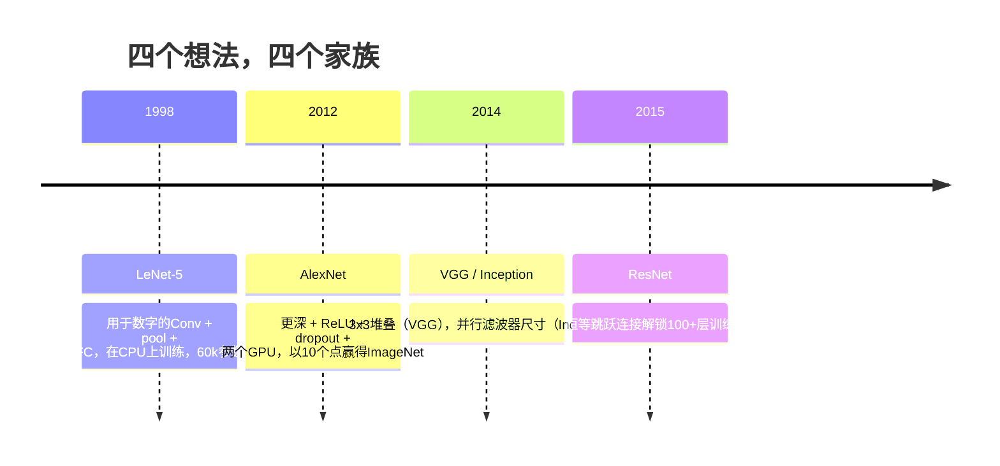
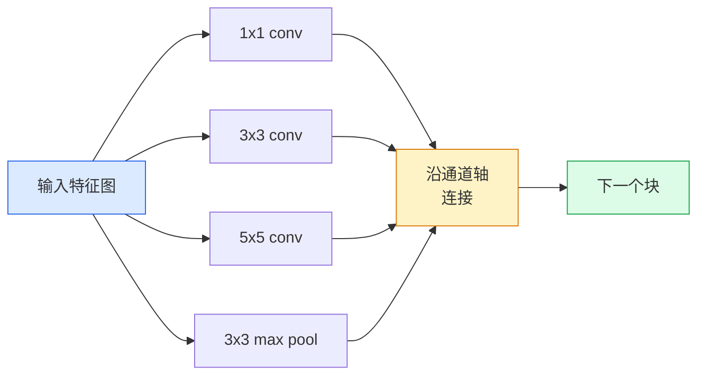
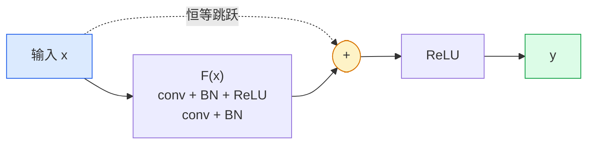

# CNN——从LeNet到ResNet

> 过去三十年的每个主要CNN都是相同的卷积-非线性-下采样配方，加上一个新想法。按顺序学习这些想法。

**类型：** 学习 + 构建
**语言：** Python
**前置知识：** 第三阶段第11课（PyTorch），第四阶段第01课（图像基础），第四阶段第02课（从零实现卷积）
**时间：** ~75分钟

## 学习目标

- 追溯 LeNet-5 -> AlexNet -> VGG -> Inception -> ResNet 的架构谱系，并说明每个家族贡献的单一新想法
- 在PyTorch中实现LeNet-5、VGG风格块和ResNet BasicBlock，每个不到40行
- 解释为什么残差连接将1,000层网络从不可训练变为最先进
- 阅读现代骨干网络（ResNet-18, ResNet-50），并在查看源代码之前预测其输出形状、感受野和参数数量

## 问题

2011年，最好的ImageNet分类器得分约74%的top-5准确率。2012年AlexNet得分85%。2015年ResNet得分96%。没有新数据。没有新一代GPU。这些收益来自架构思想。一个工作视觉工程师必须知道哪个想法来自哪篇论文，因为你在2026年交付的每个生产骨干都是相同部件的重新组合——而且因为这些想法不断转移：分组卷积从CNN到Transformer，残差连接从ResNet到每个存在的LLM，批归一化存在于扩散模型中。

按顺序学习这些网络也免疫你免于一个常见错误：当LeNet大小的网络可以解决问题时，伸手去拿最大的可用模型。MNIST不需要ResNet。了解每个家族的缩放曲线告诉你在哪里定位。

## 概念

### 改变视觉的四个想法



经典视觉中没有其他东西像这四次跳跃那样重要。

### LeNet-5（1998）

Yann LeCun的数字识别器。60,000个参数。两个卷积-池化块，两个全连接层，tanh激活。它定义了每个CNN继承的模板：

```
输入 (1, 32, 32)
  conv 5x5 -> (6, 28, 28)
  avg pool 2x2 -> (6, 14, 14)
  conv 5x5 -> (16, 10, 10)
  avg pool 2x2 -> (16, 5, 5)
  展平 -> 400
  密集 -> 120
  密集 -> 84
  密集 -> 10
```

现代世界称之为CNN的一切——交替的卷积和下采样，馈送到一个小分类器头部——就是具有更多层、更大通道和更好激活函数的LeNet。

### AlexNet（2012）

三个一起打破ImageNet的变化：

1. **ReLU** 替代tanh。梯度不再消失。训练速度提升六倍。
2. **Dropout** 在全连接头部中使用。正则化变成一个层，而非一个技巧。
3. **深度和宽度**。五个卷积层，三个密集层，6000万参数，在两个GPU上训练，模型跨GPU分割。

论文的图2仍然显示GPU分割为两个并行流。这种并行性是硬件变通方案，而非架构洞察——但上面三个想法仍然在你使用的每个模型中。

### VGG（2014）

VGG问：如果你只使用3x3卷积并且深入下去会怎样？

```
堆叠:   conv 3x3 -> conv 3x3 -> pool 2x2
重复:  16或19个卷积层
```

两个3x3卷积看到与一个5x5卷积相同的5x5输入区域，但参数更少（2*9*C^2 = 18C^2 vs 25*C^2）且中间有一个额外的ReLU。VGG将这个观察变成了整个架构。简单性——一种块类型，重复——使它成为后面一切的参考点。

代价：1.38亿参数，训练慢，推理昂贵。

### Inception（2014，同一年）

Google对"应该使用什么核大小？"的回答是：全部，并行使用。



每个分支专门化——1x1用于通道混合，3x3用于局部纹理，5x5用于更大模式，池化用于平移不变特征——连接让下一层挑选哪个分支有用。Inception v1在每个分支内部使用1x1卷积作为瓶颈以保持参数数量合理。

### 退化问题

到2015年，VGG-19有效而VGG-32无效。深度本应有所帮助，但超过约20层，训练和测试损失都变得更糟。那不是过拟合。那是优化器无法找到有用的权重，因为梯度通过每个层乘法地缩小。

```
普通深度网络：
  y = f_L( f_{L-1}( ... f_1(x) ... ) )

相对于早期层的梯度：
  dL/dW_1 = dL/dy * df_L/df_{L-1} * ... * df_2/df_1 * df_1/dW_1

每个乘法项的大小约为（权重大小）*（激活增益）。
堆叠100个增益<1的项，梯度实际上为零。
```

VGG在19层上有效是因为批归一化（同时发布）保持了激活的良好缩放。但即使批归一化也无法将深度拯救到30层以上。

### ResNet（2015）

何恺明、张、任、孙提出了一个修复一切的改变：

```
标准块:   y = F(x)
残差块:   y = F(x) + x
```

`+ x`意味着层总是可以通过将`F(x)`驱动到零来选择什么都不做。一个1,000层的ResNet现在最多和一个1层的网络一样差，因为每个额外的块都有一个简单的逃生口。有了这个保证，优化器愿意让每个块*稍微*有用——而稍微有用，堆叠100次，就是最先进的。



无处不在的两种块变体：

- **BasicBlock**（ResNet-18, ResNet-34）：两个3x3卷积，跳跃跨过两者。
- **Bottleneck**（ResNet-50, -101, -152）：1x1降维，3x3中间，1x1升维，跳跃跨过三者。当通道数高时更便宜。

当跳跃必须跨过下采样（步幅=2）时，恒等路径被替换为1x1步幅2卷积以匹配形状。

### 为什么残差在视觉之外也重要

这个想法实际上不是关于图像分类。它是关于将深度网络从"交叉手指希望梯度存活"转变为一个可靠、可扩展的工程工具。你将在下一阶段读到的每个Transformer在每块中都有完全相同的跳跃连接。没有ResNet，就没有GPT。

```figure
pooling
```

## 构建

### 第一步：LeNet-5

一个最小、忠实的LeNet。Tanh激活，平均池化。唯一的现代让步是我们使用`nn.CrossEntropyLoss`而非原始的Gaussian连接。

```python
import torch
import torch.nn as nn
import torch.nn.functional as F

class LeNet5(nn.Module):
    def __init__(self, num_classes=10):
        super().__init__()
        self.conv1 = nn.Conv2d(1, 6, kernel_size=5)
        self.conv2 = nn.Conv2d(6, 16, kernel_size=5)
        self.pool = nn.AvgPool2d(2)
        self.fc1 = nn.Linear(16 * 5 * 5, 120)
        self.fc2 = nn.Linear(120, 84)
        self.fc3 = nn.Linear(84, num_classes)

    def forward(self, x):
        x = self.pool(torch.tanh(self.conv1(x)))
        x = self.pool(torch.tanh(self.conv2(x)))
        x = torch.flatten(x, 1)
        x = torch.tanh(self.fc1(x))
        x = torch.tanh(self.fc2(x))
        return self.fc3(x)

net = LeNet5()
x = torch.randn(1, 1, 32, 32)
print(f"输出: {net(x).shape}")
print(f"参数: {sum(p.numel() for p in net.parameters()):,}")
```

预期输出：`output: torch.Size([1, 10])`，`params: 61,706`。这就是启动现代视觉的整个数字分类器。

### 第二步：VGG块

一个可重用块：两个3x3卷积，ReLU，批归一化，最大池化。

```python
class VGGBlock(nn.Module):
    def __init__(self, in_c, out_c):
        super().__init__()
        self.conv1 = nn.Conv2d(in_c, out_c, kernel_size=3, padding=1)
        self.bn1 = nn.BatchNorm2d(out_c)
        self.conv2 = nn.Conv2d(out_c, out_c, kernel_size=3, padding=1)
        self.bn2 = nn.BatchNorm2d(out_c)
        self.pool = nn.MaxPool2d(2)

    def forward(self, x):
        x = F.relu(self.bn1(self.conv1(x)))
        x = F.relu(self.bn2(self.conv2(x)))
        return self.pool(x)

class MiniVGG(nn.Module):
    def __init__(self, num_classes=10):
        super().__init__()
        self.stack = nn.Sequential(
            VGGBlock(3, 32),
            VGGBlock(32, 64),
            VGGBlock(64, 128),
        )
        self.head = nn.Sequential(
            nn.AdaptiveAvgPool2d(1),
            nn.Flatten(),
            nn.Linear(128, num_classes),
        )

    def forward(self, x):
        return self.head(self.stack(x))

net = MiniVGG()
x = torch.randn(1, 3, 32, 32)
print(f"输出: {net(x).shape}")
print(f"参数: {sum(p.numel() for p in net.parameters()):,}")
```

CIFAR大小输入上的三个VGG块，一个自适应池化，一个线性层。约29万个参数。对于CIFAR-10已经足够。

### 第三步：ResNet BasicBlock

ResNet-18和ResNet-34的核心构建块。

```python
class BasicBlock(nn.Module):
    def __init__(self, in_c, out_c, stride=1):
        super().__init__()
        self.conv1 = nn.Conv2d(in_c, out_c, kernel_size=3, stride=stride, padding=1, bias=False)
        self.bn1 = nn.BatchNorm2d(out_c)
        self.conv2 = nn.Conv2d(out_c, out_c, kernel_size=3, stride=1, padding=1, bias=False)
        self.bn2 = nn.BatchNorm2d(out_c)
        if stride != 1 or in_c != out_c:
            self.shortcut = nn.Sequential(
                nn.Conv2d(in_c, out_c, kernel_size=1, stride=stride, bias=False),
                nn.BatchNorm2d(out_c),
            )
        else:
            self.shortcut = nn.Identity()

    def forward(self, x):
        out = F.relu(self.bn1(self.conv1(x)))
        out = self.bn2(self.conv2(out))
        out = out + self.shortcut(x)
        return F.relu(out)
```

卷积层上的`bias=False`是批归一化约定——BN的beta参数已经处理了偏置，所以同时携带卷积偏置是浪费。`shortcut`仅在步幅或通道数变化时需要真正的卷积；否则它是无操作的身份连接。

### 第四步：一个微型ResNet

堆叠四组BasicBlock，得到一个用于CIFAR大小输入的可用ResNet。

```python
class TinyResNet(nn.Module):
    def __init__(self, num_classes=10):
        super().__init__()
        self.stem = nn.Sequential(
            nn.Conv2d(3, 32, kernel_size=3, stride=1, padding=1, bias=False),
            nn.BatchNorm2d(32),
            nn.ReLU(inplace=True),
        )
        self.layer1 = self._make_group(32, 32, num_blocks=2, stride=1)
        self.layer2 = self._make_group(32, 64, num_blocks=2, stride=2)
        self.layer3 = self._make_group(64, 128, num_blocks=2, stride=2)
        self.layer4 = self._make_group(128, 256, num_blocks=2, stride=2)
        self.head = nn.Sequential(
            nn.AdaptiveAvgPool2d(1),
            nn.Flatten(),
            nn.Linear(256, num_classes),
        )

    def _make_group(self, in_c, out_c, num_blocks, stride):
        blocks = [BasicBlock(in_c, out_c, stride=stride)]
        for _ in range(num_blocks - 1):
            blocks.append(BasicBlock(out_c, out_c, stride=1))
        return nn.Sequential(*blocks)

    def forward(self, x):
        x = self.stem(x)
        x = self.layer1(x)
        x = self.layer2(x)
        x = self.layer3(x)
        x = self.layer4(x)
        return self.head(x)

net = TinyResNet()
x = torch.randn(1, 3, 32, 32)
print(f"输出: {net(x).shape}")
print(f"参数: {sum(p.numel() for p in net.parameters()):,}")
```

四组每组两个块。第2、3、4组起始处步幅为2。每次下采样通道数翻倍。大约280万个参数。这是可干净缩放到ResNet-152的标准配方。

### 第五步：比较参数到特征的效率

通过所有三个网络运行相同输入并比较参数计数。

```python
def summary(name, net, x):
    y = net(x)
    params = sum(p.numel() for p in net.parameters())
    print(f"{name:12s}  输入 {tuple(x.shape)} -> 输出 {tuple(y.shape)}  参数 {params:>10,}")

x = torch.randn(1, 3, 32, 32)
summary("LeNet5",     LeNet5(),       torch.randn(1, 1, 32, 32))
summary("MiniVGG",    MiniVGG(),      x)
summary("TinyResNet", TinyResNet(),   x)
```

三个模型，三个时代，参数数量相差三个数量级。对于CIFAR-10准确率，你大致需要：LeNet 60%，MiniVGG 89%，TinyResNet 93%（经过几个epoch的训练）。

## 使用

`torchvision.models`提供以上所有模型的预训练版本。跨家族的调用签名相同，这正是骨干抽象的意义所在。

```python
from torchvision.models import resnet18, ResNet18_Weights, vgg16, VGG16_Weights

r18 = resnet18(weights=ResNet18_Weights.IMAGENET1K_V1)
r18.eval()

print(f"ResNet-18 参数: {sum(p.numel() for p in r18.parameters()):,}")
print(r18.layer1[0])
print()

v16 = vgg16(weights=VGG16_Weights.IMAGENET1K_V1)
v16.eval()
print(f"VGG-16   参数: {sum(p.numel() for p in v16.parameters()):,}")
```

ResNet-18有1170万个参数。VGG-16有1.38亿个。类似的ImageNet top-1准确率（69.8% vs 71.6%）。残差连接为你带来12倍的参数效率优势。这就是为什么从2016年到2021年ViT到来之前ResNet变体占据主导——并且在计算是约束的现实部署中仍然占主导。

对于迁移学习，配方总是相同的：加载预训练，冻结骨干，替换分类器头部。

```python
for p in r18.parameters():
    p.requires_grad = False
r18.fc = nn.Linear(r18.fc.in_features, 10)
```

三行。你现在拥有一个10类CIFAR分类器，继承了ImageNet支付的表示。

## 交付

本课产出：

- `outputs/prompt-backbone-selector.md` — 一个提示词，根据任务、数据集大小和计算预算选择合适的CNN家族（LeNet/VGG/ResNet/MobileNet/ConvNeXt）。
- `outputs/skill-residual-block-reviewer.md` — 一个技能，读取PyTorch模块并标记跳跃连接错误（步幅变化时缺少shortcut、shortcut激活顺序、加法相对于BN的位置）。

## 练习

1. **（简单）** 手动逐层计算`TinyResNet`的参数数量。对照`sum(p.numel() for p in net.parameters())`比较。大部分参数预算去了哪里——卷积、BN还是分类器头部？
2. **（中等）** 实现Bottleneck块（1x1 -> 3x3 -> 1x1带跳跃），并用它构建一个CIFAR的ResNet-50风格网络。与`TinyResNet`比较参数。
3. **（困难）** 从`BasicBlock`中移除跳跃连接，在CIFAR-10上训练一个34块的"普通"网络和一个34块的ResNet，各10个epoch。绘制两者训练损失随epoch的变化。复现He等人的图1结果，其中普通深度网络收敛到比其更浅版本更高的损失。

## 关键术语

| 术语 | 人们说的 | 实际含义 |
|------|----------------|----------------------|
| 骨干 | "模型" | 生产馈送到任务头部的特征图的卷积块堆叠 |
| 残差连接 | "跳跃连接" | `y = F(x) + x`；允许优化器通过将F设为零来学习恒等，使任意深度可训练 |
| BasicBlock | "带跳跃的两个3x3卷积" | ResNet-18/34构建块：conv-BN-ReLU-conv-BN-add-ReLU |
| Bottleneck | "1x1降维，3x3，1x1升维" | ResNet-50/101/152块；在高通道数时廉价，因为3x3在降维后的宽度上运行 |
| 退化问题 | "越深越差" | 超过约20个普通卷积层，训练和测试误差都增加；由残差连接解决，而非更多数据 |
| Stem | "第一层" | 将3通道输入转换为基础特征宽度的初始卷积；ImageNet通常为7x7步幅2，CIFAR为3x3步幅1 |
| 头部 | "分类器" | 最终骨干块之后的层：自适应池化、展平、线性层 |
| 迁移学习 | "预训练权重" | 加载在ImageNet上训练的骨干，仅在你的任务上微调头部 |

## 延伸阅读

- [Deep Residual Learning for Image Recognition (He et al., 2015)](https://arxiv.org/abs/1512.03385) — ResNet论文；每个图都值得研究
- [Very Deep Convolutional Networks (Simonyan & Zisserman, 2014)](https://arxiv.org/abs/1409.1556) — VGG论文；仍然是"为什么3x3"的最佳参考
- [ImageNet Classification with Deep CNNs (Krizhevsky et al., 2012)](https://papers.nips.cc/paper_files/paper/2012/hash/c399862d3b9d6b76c8436e924a68c45b-Abstract.html) — AlexNet；结束了手工特征时代的论文
- [Going Deeper with Convolutions (Szegedy et al., 2014)](https://arxiv.org/abs/1409.4842) — Inception v1；并行滤波器思想仍出现在视觉Transformer中
