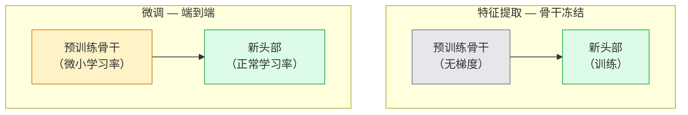

# 迁移学习与微调

> 别人花了一百万GPU小时教会了一个网络边缘、纹理和物体部分的样子。你应该在训练自己的网络之前借用这些特征。

**类型：** 构建
**语言：** Python
**前置知识：** 第四阶段第03课（CNN），第四阶段第04课（图像分类）
**时间：** ~75分钟

## 学习目标

- 区分特征提取和微调，并根据数据集大小、领域距离和计算预算选择正确的方法
- 加载预训练骨干网络，替换其分类器头部，仅训练头部，在不到20行代码内得到一个可行的基线
- 使用判别性学习率逐步解冻层，使早期通用特征获得比后期任务特定特征更小的更新
- 诊断三种常见失败：解冻块上学习率过高导致的特征漂移、小数据集上的BN统计量崩溃、灾难性遗忘

## 问题

在ImageNet上训练ResNet-50大约需要2,000 GPU小时。很少有团队为他们交付的每个任务都有这个预算。大多数团队实际交付的是带有在他们几百或几千张任务特定图像上训练的新头部的预训练骨干网络。

这不是一个捷径。任何ImageNet训练的CNN的第一个卷积块学习边缘和Gabor类滤波器。接下来几个块学习纹理和简单图案。中间块学习物体部分。最终块学习开始看起来像1,000个ImageNet类别的组合。该层级的前90%几乎无需更改地转移到医学成像、工业检测、卫星数据和每个其他视觉任务——因为自然界的边缘和纹理词汇是有限的。最后10%才是你实际训练的。

正确进行迁移学习有三个陷阱等着你：用太高的学习率破坏预训练特征、冻结太多而使模型缺乏信息、以及让BatchNorm的运行统计量漂移到网络的其余部分从未学习过的微小的数据集。本课有意地逐个走过每个陷阱。

## 概念

### 特征提取与微调

两种模式，根据你信任预训练特征的程度和你有多少数据来选择。



经验法则：

| 数据集大小 | 领域距离 | 配方 |
|--------------|-----------------|--------|
| < 1k张图像 | 接近ImageNet | 冻结骨干，仅训练头部 |
| 1k-10k | 接近 | 冻结前2-3个阶段，微调其余 |
| 10k-100k | 任何 | 端到端微调，使用判别性学习率 |
| 100k+ | 远 | 微调所有内容；如果领域足够远，考虑从头训练 |

"接近ImageNet"大致意味着具有物体类内容的自然RGB照片。医学CT扫描、高空卫星图像和显微图像是远领域——特征仍然有帮助，但你需要让更多层适应。

### 为什么冻结有效

CNN学习的ImageNet特征并不专门针对那1,000个类别。它们专门针对自然图像的统计量：特定方向的边缘、纹理、对比度模式、形状基元。这些统计量在人类能命名的几乎每个视觉领域中都是稳定的。这就是为什么一个在ImageNet上训练、仅在CIFAR-10上用新的线性头部（不微调骨干）零样本评估的模型可以达到80%以上的准确率。头部在学如何加权已经学到的特征来完成这个任务。

### 判别性学习率

当你解冻时，早期层应该比晚期层训练得慢。早期层编码你想保留的通用特征；晚期层编码你需要大幅移动的任务特定结构。

```
典型配方：

  阶段0（茎干 + 第一组）：lr = base_lr / 100    （基本固定）
  阶段1：                      lr = base_lr / 10
  阶段2：                      lr = base_lr / 3
  阶段3（最后骨干组）：lr = base_lr
  头部：                          lr = base_lr  （或略高）
```

在PyTorch中，这只是一个传递给优化器的参数组列表。一个模型，五个学习率，零额外代码。

### BatchNorm问题

BN层持有在ImageNet上计算的`running_mean`和`running_var`缓冲区。如果你的任务具有不同的像素分布——不同的光照、不同的传感器、不同的色彩空间——这些缓冲区是错误的。按偏好顺序的三个选项：

1. **以训练模式微调BN。** 让BN随其他所有内容更新其运行统计量。当任务数据集中等大小（>= 5k样本）时的默认选择。
2. **以评估模式冻结BN。** 保持ImageNet统计量，仅训练权重。当数据集足够小以至于BN的移动平均会有噪声时正确。
3. **将BN替换为GroupNorm。** 完全消除移动平均问题。在每GPU批次大小很小的检测和分割骨干中使用。

搞错这个会静默地使准确率下降5-15%。

### 头部设计

分类器头部是1-3个线性层加一个可选的dropout。每个torchvision骨干提供了一个默认头部，你可以替换：

```
backbone.fc = nn.Linear(backbone.fc.in_features, num_classes)          # ResNet
backbone.classifier[1] = nn.Linear(..., num_classes)                    # EfficientNet, MobileNet
backbone.heads.head = nn.Linear(..., num_classes)                       # torchvision ViT
```

对于小数据集，单个线性层通常就足够了。当任务分布与骨干训练分布相差较远时，添加隐藏层（Linear -> ReLU -> Dropout -> Linear）有帮助。

### 逐层学习率衰减

现代微调（BEiT、DINOv2、ViT-B微调）中使用的判别性学习率的更平滑版本。不是将层分组为阶段，而是给每层一个略低于其上层的学习率：

```
lr_layer_k = base_lr * decay^(L - k)
```

当decay = 0.75且L = 12个Transformer块时，第一个块以头部学习率的`0.75^11 ≈ 0.04x`训练。对Transformer微调比对CNN更重要，在CNN中按阶段分组的学习率通常就足够了。

### 要评估的内容

迁移学习运行需要两个你在从头训练时不会跟踪的数字：

- **仅预训练准确率** — 骨干冻结时头部的准确率。这是你的底线。
- **微调后准确率** — 端到端训练后的同一模型。这是你的上限。

如果微调后的准确率低于仅预训练的准确率，你就有一个学习率或BN错误。始终打印两者。

## 构建

### 第一步：加载预训练骨干并检查

```python
import torch
import torch.nn as nn
from torchvision.models import resnet18, ResNet18_Weights

backbone = resnet18(weights=ResNet18_Weights.IMAGENET1K_V1)
print(backbone)
print()
print("分类器头部:", backbone.fc)
print("特征维度:", backbone.fc.in_features)
```

`ResNet18`有四个阶段（`layer1..layer4`）加上一个茎干和一个`fc`头部。每个torchvision分类骨干都有类似的结构。

### 第二步：特征提取——冻结所有，替换头部

```python
def make_feature_extractor(num_classes=10):
    model = resnet18(weights=ResNet18_Weights.IMAGENET1K_V1)
    for p in model.parameters():
        p.requires_grad = False
    model.fc = nn.Linear(model.fc.in_features, num_classes)
    return model

model = make_feature_extractor(num_classes=10)
trainable = sum(p.numel() for p in model.parameters() if p.requires_grad)
frozen = sum(p.numel() for p in model.parameters() if not p.requires_grad)
print(f"可训练: {trainable:>10,}")
print(f"冻结:    {frozen:>10,}")
```

只有`model.fc`可训练。骨干是一个冻结的特征提取器。

### 第三步：判别性微调

一个构建具有阶段特定学习率的参数组的工具函数。

```python
def discriminative_param_groups(model, base_lr=1e-3, decay=0.3):
    stages = [
        ["conv1", "bn1"],
        ["layer1"],
        ["layer2"],
        ["layer3"],
        ["layer4"],
        ["fc"],
    ]
    groups = []
    for i, names in enumerate(stages):
        lr = base_lr * (decay ** (len(stages) - 1 - i))
        params = [p for n, p in model.named_parameters()
                  if any(n.startswith(k) for k in names)]
        if params:
            groups.append({"params": params, "lr": lr, "name": "_".join(names)})
    return groups

model = resnet18(weights=ResNet18_Weights.IMAGENET1K_V1)
model.fc = nn.Linear(model.fc.in_features, 10)
for p in model.parameters():
    p.requires_grad = True

groups = discriminative_param_groups(model)
for g in groups:
    print(f"{g['name']:>10s}  lr={g['lr']:.2e}  参数={sum(p.numel() for p in g['params']):>8,}")
```

`decay=0.3`意味着每个阶段以下一阶段30%的学习率训练。`fc`获得`base_lr`，`layer4`获得`0.3 * base_lr`，`conv1`获得`0.3^5 * base_lr ≈ 0.00243 * base_lr`。听起来极端；经验上它有效。

### 第四步：BatchNorm处理

冻结BN运行统计量而不冻结其权重的辅助函数。

```python
def freeze_bn_stats(model):
    for m in model.modules():
        if isinstance(m, (nn.BatchNorm1d, nn.BatchNorm2d, nn.BatchNorm3d)):
            m.eval()
            for p in m.parameters():
                p.requires_grad = False
    return model
```

在每个epoch开始时设置`model.train()`后调用它。`model.train()`将所有内容切换到训练模式；这仅对BN层反转。

### 第五步：最小端到端微调循环

```python
from torch.optim import SGD
from torch.utils.data import DataLoader
from torch.optim.lr_scheduler import CosineAnnealingLR
import torch.nn.functional as F

def fine_tune(model, train_loader, val_loader, device, epochs=5, base_lr=1e-3, freeze_bn=False):
    model = model.to(device)
    groups = discriminative_param_groups(model, base_lr=base_lr)
    optimizer = SGD(groups, momentum=0.9, weight_decay=1e-4, nesterov=True)
    scheduler = CosineAnnealingLR(optimizer, T_max=epochs)

    for epoch in range(epochs):
        model.train()
        if freeze_bn:
            freeze_bn_stats(model)
        tr_loss, tr_correct, tr_total = 0.0, 0, 0
        for x, y in train_loader:
            x, y = x.to(device), y.to(device)
            logits = model(x)
            loss = F.cross_entropy(logits, y, label_smoothing=0.1)
            optimizer.zero_grad()
            loss.backward()
            optimizer.step()
            tr_loss += loss.item() * x.size(0)
            tr_total += x.size(0)
            tr_correct += (logits.argmax(-1) == y).sum().item()
        scheduler.step()

        model.eval()
        va_total, va_correct = 0, 0
        with torch.no_grad():
            for x, y in val_loader:
                x, y = x.to(device), y.to(device)
                pred = model(x).argmax(-1)
                va_total += x.size(0)
                va_correct += (pred == y).sum().item()
        print(f"epoch {epoch}  训练 {tr_loss/tr_total:.3f}/{tr_correct/tr_total:.3f}  "
              f"验证 {va_correct/va_total:.3f}")
    return model
```

在CIFAR-10上使用上述配方进行五个epoch，将`ResNet18-IMAGENET1K_V1`从约70%零样本线性探针准确率提升到约93%微调准确率。仅头部训练会在约86%达到平台，从不触及骨干。

### 第六步：逐步解冻

一个调度，从后到前每epoch解冻一个阶段。以额外几个epoch为代价减轻特征漂移。

```python
def progressive_unfreeze_schedule(model):
    stages = ["layer4", "layer3", "layer2", "layer1"]
    yielded = set()

    def start():
        for p in model.parameters():
            p.requires_grad = False
        for p in model.fc.parameters():
            p.requires_grad = True

    def unfreeze(epoch):
        if epoch < len(stages):
            name = stages[epoch]
            yielded.add(name)
            for n, p in model.named_parameters():
                if n.startswith(name):
                    p.requires_grad = True
            return name
        return None

    return start, unfreeze
```

在第一个epoch之前调用`start()`一次。在每个epoch开始时调用`unfreeze(epoch)`。每当可训练参数集变化时重建优化器，否则冻结的参数仍然持有使其混淆的缓存状态。

## 使用

对于大多数实际任务，`torchvision.models`加三行代码就足够了。上述更重的机制在你遇到库默认值无法修复的问题时才有用。

```python
from torchvision.models import resnet50, ResNet50_Weights

model = resnet50(weights=ResNet50_Weights.IMAGENET1K_V2)
model.fc = nn.Linear(model.fc.in_features, num_classes)
optimizer = torch.optim.AdamW(model.parameters(), lr=1e-4, weight_decay=1e-4)
```

另外两个生产级默认值：

- `timm`提供约800个预训练视觉骨干，具有一致的API（`timm.create_model("resnet50", pretrained=True, num_classes=10)`）。对于torchvision动物园之外的任何微调，它是标准选择。
- 对于Transformer，`transformers.AutoModelForImageClassification.from_pretrained(name, num_labels=N)`给你ViT / BEiT / DeiT，具有与文本模型相同的加载语义。

## 交付

本课产出：

- `outputs/prompt-fine-tune-planner.md` — 一个提示词，根据数据集大小、领域距离和计算预算，选择特征提取、逐步微调还是端到端微调。
- `outputs/skill-freeze-inspector.md` — 一个技能，给定PyTorch模型，报告哪些参数可训练、哪些BatchNorm层处于评估模式、以及优化器是否实际被馈送了可训练参数。

## 练习

1. **（简单）** 在相同的合成CIFAR数据集上，分别以线性探针（骨干冻结）和完全微调训练`ResNet18`。并排报告两个准确率。解释哪个差距告诉你特征迁移得好，哪个告诉你它们迁移得不好。
2. **（中等）** 有意引入一个错误：在骨干阶段设置`base_lr = 1e-1`（而非头部）。展示训练损失爆炸，然后通过应用`discriminative_param_groups`辅助函数恢复。记录每个阶段开始发散的学习率。
3. **（困难）** 取一个医学成像数据集（例如CheXpert-small、PatchCamelyon或HAM10000）并比较三种方案：(a) ImageNet预训练冻结骨干 + 线性头部；(b) ImageNet预训练端到端微调；(c) 从头训练。报告每个的准确率和计算成本。在什么数据集大小下从头训练变得有竞争力？

## 关键术语

| 术语 | 人们说的 | 实际含义 |
|------|----------------|----------------------|
| 特征提取 | "冻结并训练头部" | 骨干参数冻结，只有新的分类器头部接收梯度 |
| 微调 | "端到端重新训练" | 所有参数可训练，通常学习率远小于从头训练 |
| 判别性学习率 | "早期层学习率更小" | 优化器参数组，其中早期阶段的学习率是后期阶段学习率的一个分数 |
| 逐层学习率衰减 | "平滑的学习率梯度" | 每层学习率乘以decay^(L - k)；在Transformer微调中常见 |
| 灾难性遗忘 | "模型丢失了ImageNet" | 在新任务信号被学习之前，过高的学习率覆盖了预训练特征 |
| BN统计量漂移 | "运行均值错误" | BatchNorm的running_mean/var在与当前任务不同的分布上计算，静默地损害准确率 |
| 线性探针 | "冻结骨干 + 线性头部" | 预训练特征的评估——冻结表示之上最佳线性分类器的准确率 |
| 灾难性崩溃 | "所有内容预测一个类别" | 当微调的学习率足够高以在头部梯度稳定之前破坏特征时发生 |

## 延伸阅读

- [How transferable are features in deep neural networks? (Yosinski et al., 2014)](https://arxiv.org/abs/1411.1792) — 量化了跨层特征可迁移性的论文
- [Universal Language Model Fine-tuning (ULMFiT, Howard & Ruder, 2018)](https://arxiv.org/abs/1801.06146) — 原始的判别性学习率/逐步解冻配方；想法直接迁移到视觉
- [timm documentation](https://huggingface.co/docs/timm) — 现代视觉骨干及其训练所用的精确微调默认值的参考
- [A Simple Framework for Linear-Probe Evaluation (Kornblith et al., 2019)](https://arxiv.org/abs/1805.08974) — 为什么线性探针准确率重要以及如何正确报告它
