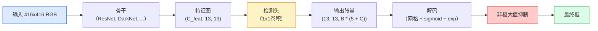

# 目标检测——从零实现YOLO

> 检测就是分类加上回归，在特征图的每个位置运行，然后用非极大值抑制清理结果。

**类型：** 构建
**语言：** Python
**前置知识：** 第四阶段第03课（CNN），第四阶段第04课（图像分类），第四阶段第05课（迁移学习）
**时间：** ~75分钟

## 学习目标

- 解释将检测变成密集预测问题的网格和锚点设计，并说明输出张量中每个数字的含义
- 计算框之间的交并比（IoU）并从零实现非极大值抑制
- 在预训练骨干之上构建一个最小的YOLO风格头部，包括分类、目标存在性和框回归损失
- 读取检测指标行（precision@0.5, recall, mAP@0.5, mAP@0.5:0.95）并选择下一步要调整哪个旋钮

## 问题

分类说"这张图像是狗。"检测说"位置(112, 40, 280, 210)处有一只狗，位置(400, 180, 560, 310)处有一只猫，画面中没有其他东西。"这一个结构性变化——预测可变数量的带标签框而不是每张图像一个标签——是每个自主系统、每个监控产品、每个文档布局解析器和每个工厂视觉线所依赖的。

检测也是视觉中每个工程权衡同时出现的地方。你想要精确的框（回归头），你想要每个框的正确类别（分类头），你想要模型知道什么时候没有东西要检测（目标存在性分数），你希望每个真实物体恰好有一个预测（非极大值抑制）。缺少任何一项，流水线要么错过目标，要么报告幻觉框，要么在略微不同的位置上预测同一目标十五次。

YOLO（You Only Look Once，Redmon等人，2016年）是通过一个卷积网络的单次前向传播使这一切实时运行的设计，相同的结构决策仍然是现代检测器（YOLOv8、YOLOv9、YOLO-NAS、RT-DETR）的骨干。学习核心，每个变体就变成了相同部件的重新排列。

## 概念

### 检测作为密集预测

分类器每张图像输出C个数字。YOLO风格的检测器每张图像输出`(S x S x (5 + C))`个数字，其中S是空间网格大小。



每个`S * S`网格单元预测`B`个框。对于每个框：

- 4个数字描述几何形状：`tx, ty, tw, th`。
- 1个数字是目标存在性分数："这个单元中心有目标吗？"
- C个数字是类别概率。

每单元总计：`B * (5 + C)`。对于VOC，`S=13, B=2, C=20`，即每单元50个数字。

### 为什么有网格和锚点

纯回归会预测每个目标的`(x, y, w, h)`作为绝对坐标。这对卷积网络来说很难，因为平移图像不应该将所有预测平移相同的量——每个目标在空间上有锚定。网格通过将每个真实框分配给其中心所在的网格单元来回答这个问题；只有那个单元对该目标负责。

锚点解决第二个问题。3x3卷积无法轻易从16像素感受野的特征单元回归出500像素宽的框。相反，我们每单元预定义`B`个先验框形状（锚点）并预测每个锚点的微小变化量。模型学会选择正确的锚点并微调它，而不是从零开始回归。

```
锚点框先验（416x416输入示例）：

  小尺寸:   (30,  60)
  中尺寸:  (75,  170)
  大尺寸:   (200, 380)

在每个网格单元，每个锚点发出(tx, ty, tw, th, obj, c_1, ..., c_C)。
```

现代检测器通常使用FPN，每分辨率有不同的锚点集——浅层高分辨率图上用小锚点，深层低分辨率图上用大锚点。同样的想法，更多尺度。

### 解码预测

原始的`tx, ty, tw, th`不是框坐标；它们是绘制前需要变换的回归目标：

```
中心 x  = (sigmoid(tx) + cell_x) * stride
中心 y  = (sigmoid(ty) + cell_y) * stride
宽度     = anchor_w * exp(tw)
高度    = anchor_h * exp(th)
```

`sigmoid`保持中心偏移在单元内。`exp`允许宽度从锚点自由缩放而无需符号翻转。`stride`将网格坐标缩放回像素。这个解码步骤自v2以来在每个YOLO版本中都是一样的。

### IoU

检测中两个框之间的通用相似性度量：

```
IoU(A, B) = area(A 交 B) / area(A 并 B)
```

IoU = 1表示相同；IoU = 0表示无重叠。预测与真实框之间的IoU决定预测是否计为真正例（通常IoU >= 0.5）。两个预测之间的IoU是NMS用来去重的。

### 非极大值抑制

在相邻锚点上训练的卷积网络通常会为同一目标预测重叠的框。NMS保留最高置信度的预测，并删除任何IoU高于阈值的其他预测。

```
NMS(boxes, scores, iou_threshold):
    按分数降序排列框
    keep = []
    当框不为空时：
        选取最高分的框，添加到keep
        删除与所选框IoU > iou_threshold的每个框
    返回keep
```

典型阈值：目标检测为0.45。最近的检测器用`soft-NMS`、`DIoU-NMS`或直接学习抑制（RT-DETR）替代标准NMS，但结构目的相同。

### 损失

YOLO损失是三个带权重的损失的和：

```
L = lambda_coord * L_box(pred, target, 当 obj=1 时)
  + lambda_obj   * L_obj(pred, 1,     当 obj=1 时)
  + lambda_noobj * L_obj(pred, 0,     当 obj=0 时)
  + lambda_cls   * L_cls(pred, target, 当 obj=1 时)
```

只有包含目标的单元才贡献框回归和分类损失。没有目标的单元仅贡献目标存在性损失（教模型保持沉默）。`lambda_noobj`通常很小（~0.5），因为绝大多数单元是空的，否则会主导总损失。

现代变体将MSE框损失替换为CIoU / DIoU（直接优化IoU），使用focal loss处理类别不平衡，并用quality focal loss平衡目标存在性。三组件的结构不变。

### 检测指标

准确率不适用于检测。以下四个数字才有效：

- **Precision@IoU=0.5** — 在被计为正例的预测中，有多少实际正确。
- **Recall@IoU=0.5** — 在所有真实目标中，我们找到了多少。
- **AP@0.5** — IoU阈值0.5下的精确率-召回率曲线面积；每类一个数字。
- **mAP@0.5:0.95** — IoU阈值0.5、0.55、...、0.95上AP的平均值。COCO指标；最严格、信息量最大。

报告所有四个。在mAP@0.5上强但在mAP@0.5:0.95上弱的检测器定位粗糙但不精确；通过更好的框回归损失修复。精确率高而召回率低的检测器过于保守；降低置信度阈值或增加目标存在性权重。

## 构建

### 第一步：IoU

本课的主力函数。处理`(x1, y1, x2, y2)`格式的两组框。

```python
import numpy as np

def box_iou(boxes_a, boxes_b):
    ax1, ay1, ax2, ay2 = boxes_a[:, 0], boxes_a[:, 1], boxes_a[:, 2], boxes_a[:, 3]
    bx1, by1, bx2, by2 = boxes_b[:, 0], boxes_b[:, 1], boxes_b[:, 2], boxes_b[:, 3]

    inter_x1 = np.maximum(ax1[:, None], bx1[None, :])
    inter_y1 = np.maximum(ay1[:, None], by1[None, :])
    inter_x2 = np.minimum(ax2[:, None], bx2[None, :])
    inter_y2 = np.minimum(ay2[:, None], by2[None, :])

    inter_w = np.clip(inter_x2 - inter_x1, 0, None)
    inter_h = np.clip(inter_y2 - inter_y1, 0, None)
    inter = inter_w * inter_h

    area_a = (ax2 - ax1) * (ay2 - ay1)
    area_b = (bx2 - bx1) * (by2 - by1)
    union = area_a[:, None] + area_b[None, :] - inter
    return inter / np.clip(union, 1e-8, None)
```

返回`(N_a, N_b)`形状的成对IoU矩阵。通过将其中一个数组设为`(1, 4)`形状，可用于单个真实框。

### 第二步：非极大值抑制

```python
def nms(boxes, scores, iou_threshold=0.45):
    order = np.argsort(-scores)
    keep = []
    while len(order) > 0:
        i = order[0]
        keep.append(i)
        if len(order) == 1:
            break
        rest = order[1:]
        ious = box_iou(boxes[[i]], boxes[rest])[0]
        order = rest[ious <= iou_threshold]
    return np.array(keep, dtype=np.int64)
```

确定性，排序的`O(N log N)`复杂度，且与`torchvision.ops.nms`在相同输入上行为匹配。

### 第三步：框编码和解码

在像素坐标和网络实际回归的`(tx, ty, tw, th)`目标之间转换。

```python
def encode(box_xyxy, cell_x, cell_y, stride, anchor_wh):
    x1, y1, x2, y2 = box_xyxy
    cx = 0.5 * (x1 + x2)
    cy = 0.5 * (y1 + y2)
    w = x2 - x1
    h = y2 - y1
    tx = cx / stride - cell_x
    ty = cy / stride - cell_y
    tw = np.log(w / anchor_wh[0] + 1e-8)
    th = np.log(h / anchor_wh[1] + 1e-8)
    return np.array([tx, ty, tw, th])


def decode(tx_ty_tw_th, cell_x, cell_y, stride, anchor_wh):
    tx, ty, tw, th = tx_ty_tw_th
    cx = (sigmoid(tx) + cell_x) * stride
    cy = (sigmoid(ty) + cell_y) * stride
    w = anchor_wh[0] * np.exp(tw)
    h = anchor_wh[1] * np.exp(th)
    return np.array([cx - w / 2, cy - h / 2, cx + w / 2, cy + h / 2])


def sigmoid(x):
    return 1.0 / (1.0 + np.exp(-x))
```

测试：编码一个框然后解码——你应该得到非常接近原始的结果（在tx不在后sigmoid范围内时sigmoid逆不完全可逆的范围内）。

### 第四步：最小YOLO头部

特征图上的一个1x1卷积，重塑为`(B, S, S, num_anchors, 5 + C)`。

```python
import torch
import torch.nn as nn

class YOLOHead(nn.Module):
    def __init__(self, in_c, num_anchors, num_classes):
        super().__init__()
        self.num_anchors = num_anchors
        self.num_classes = num_classes
        self.conv = nn.Conv2d(in_c, num_anchors * (5 + num_classes), kernel_size=1)

    def forward(self, x):
        n, _, h, w = x.shape
        y = self.conv(x)
        y = y.view(n, self.num_anchors, 5 + self.num_classes, h, w)
        y = y.permute(0, 3, 4, 1, 2).contiguous()
        return y
```

输出形状：`(N, H, W, num_anchors, 5 + C)`。最后一个维度包含`[tx, ty, tw, th, obj, cls_0, ..., cls_{C-1}]`。

### 第五步：真实值分配

对于每个真实框，决定哪个`(cell, anchor)`负责。

```python
def assign_targets(boxes_xyxy, classes, anchors, stride, grid_size, num_classes):
    num_anchors = len(anchors)
    target = np.zeros((grid_size, grid_size, num_anchors, 5 + num_classes), dtype=np.float32)
    has_obj = np.zeros((grid_size, grid_size, num_anchors), dtype=bool)

    for box, cls in zip(boxes_xyxy, classes):
        x1, y1, x2, y2 = box
        cx, cy = 0.5 * (x1 + x2), 0.5 * (y1 + y2)
        gx, gy = int(cx / stride), int(cy / stride)
        bw, bh = x2 - x1, y2 - y1

        ious = np.array([
            (min(bw, aw) * min(bh, ah)) / (bw * bh + aw * ah - min(bw, aw) * min(bh, ah))
            for aw, ah in anchors
        ])
        best = int(np.argmax(ious))
        aw, ah = anchors[best]

        target[gy, gx, best, 0] = cx / stride - gx
        target[gy, gx, best, 1] = cy / stride - gy
        target[gy, gx, best, 2] = np.log(bw / aw + 1e-8)
        target[gy, gx, best, 3] = np.log(bh / ah + 1e-8)
        target[gy, gx, best, 4] = 1.0
        target[gy, gx, best, 5 + cls] = 1.0
        has_obj[gy, gx, best] = True
    return target, has_obj
```

锚点选择是"与真实框的最佳形状IoU"——一种与YOLOv2/v3分配匹配的廉价代理。v5及以后使用更复杂的策略（任务对齐匹配、动态k）来完善相同思想。

### 第六步：三个损失

```python
def yolo_loss(pred, target, has_obj, lambda_coord=5.0, lambda_obj=1.0, lambda_noobj=0.5, lambda_cls=1.0):
    has_obj_t = torch.from_numpy(has_obj).bool()
    target_t = torch.from_numpy(target).float()

    box_pred = pred[..., :4][has_obj_t]
    box_true = target_t[..., :4][has_obj_t]
    loss_box = torch.nn.functional.mse_loss(box_pred, box_true, reduction="sum")

    obj_pred = pred[..., 4]
    obj_true = target_t[..., 4]
    loss_obj_pos = torch.nn.functional.binary_cross_entropy_with_logits(
        obj_pred[has_obj_t], obj_true[has_obj_t], reduction="sum")
    loss_obj_neg = torch.nn.functional.binary_cross_entropy_with_logits(
        obj_pred[~has_obj_t], obj_true[~has_obj_t], reduction="sum")

    cls_pred = pred[..., 5:][has_obj_t]
    cls_true = target_t[..., 5:][has_obj_t]
    loss_cls = torch.nn.functional.binary_cross_entropy_with_logits(
        cls_pred, cls_true, reduction="sum")

    total = (lambda_coord * loss_box
             + lambda_obj * loss_obj_pos
             + lambda_noobj * loss_obj_neg
             + lambda_cls * loss_cls)
    return total, {"box": loss_box.item(), "obj_pos": loss_obj_pos.item(),
                   "obj_neg": loss_obj_neg.item(), "cls": loss_cls.item()}
```

每个YOLO教程要么硬编码要么扫描的五个超参数。比率很重要：`lambda_coord=5, lambda_noobj=0.5`反映了原始YOLOv1论文，并且仍然是合理的默认值。

### 第七步：推理流水线

解码原始头部输出，应用sigmoid/exp，在目标存在性上设阈值，然后NMS。

```python
def postprocess(pred_tensor, anchors, stride, img_size, conf_threshold=0.25, iou_threshold=0.45):
    pred = pred_tensor.detach().cpu().numpy()
    grid_h, grid_w = pred.shape[1], pred.shape[2]
    num_anchors = len(anchors)

    boxes, scores, classes = [], [], []
    for gy in range(grid_h):
        for gx in range(grid_w):
            for a in range(num_anchors):
                tx, ty, tw, th, obj, *cls = pred[0, gy, gx, a]
                score = sigmoid(obj) * sigmoid(np.array(cls)).max()
                if score < conf_threshold:
                    continue
                cls_idx = int(np.argmax(cls))
                cx = (sigmoid(tx) + gx) * stride
                cy = (sigmoid(ty) + gy) * stride
                w = anchors[a][0] * np.exp(tw)
                h = anchors[a][1] * np.exp(th)
                boxes.append([cx - w / 2, cy - h / 2, cx + w / 2, cy + h / 2])
                scores.append(float(score))
                classes.append(cls_idx)

    if not boxes:
        return np.zeros((0, 4)), np.zeros((0,)), np.zeros((0,), dtype=int)
    boxes = np.array(boxes)
    scores = np.array(scores)
    classes = np.array(classes)
    keep = nms(boxes, scores, iou_threshold)
    return boxes[keep], scores[keep], classes[keep]
```

这就是完整的评估路径：头部 -> 解码 -> 阈值 -> NMS。

## 使用

`torchvision.models.detection`提供具有相同概念结构的生产级检测器。加载预训练模型只需三行。

```python
import torch
from torchvision.models.detection import fasterrcnn_resnet50_fpn_v2

model = fasterrcnn_resnet50_fpn_v2(weights="DEFAULT")
model.eval()
with torch.no_grad():
    predictions = model([torch.randn(3, 400, 600)])
print(predictions[0].keys())
print(f"boxes:  {predictions[0]['boxes'].shape}")
print(f"scores: {predictions[0]['scores'].shape}")
print(f"labels: {predictions[0]['labels'].shape}")
```

对于实时推理流水线，`ultralytics`（YOLOv8/v9）是标准选择：`from ultralytics import YOLO; model = YOLO('yolov8n.pt'); model(img)`。模型内部处理解码和NMS，返回你上面构建的相同`boxes / scores / labels`三元组。

## 交付

本课产出：

- `outputs/prompt-detection-metric-reader.md` — 一个提示词，将`precision, recall, AP, mAP@0.5:0.95`行转化为一行诊断和单一最有用的下一个实验。
- `outputs/skill-anchor-designer.md` — 一个技能，给定真实框的数据集，在`(w, h)`上运行k-means并返回每个FPN级别的锚点集，加上选择正确锚点数量所需的覆盖统计量。

## 练习

1. **（简单）** 实现`box_iou`并在1,000个随机框对上对照`torchvision.ops.box_iou`运行。验证最大绝对差异低于`1e-6`。
2. **（中等）** 将`yolo_loss`移植为使用`CIoU`框损失而非MSE的版本。在100张图像的合成数据集上展示，在相同epoch数内CIoU收敛到比MSE更好的最终mAP@0.5:0.95。
3. **（困难）** 实现多尺度推理：将同一图像以三个分辨率通过模型，合并框预测，并在最后运行单个NMS。在保留集上测量与单尺度推理相比的mAP提升。

## 关键术语

| 术语 | 人们说的 | 实际含义 |
|------|----------------|----------------------|
| 锚点 | "框先验" | 每个网格单元处预定义的框形状，网络从中预测变化量而非绝对坐标 |
| IoU | "重叠度" | 两个框的交并比；检测中的通用相似性度量 |
| NMS | "去重" | 贪婪算法，保留最高分预测并删除高于阈值的重叠预测 |
| 目标存在性 | "这里有东西吗" | 每个锚点每个单元的标量，预测目标是否以该单元为中心 |
| 网格步幅 | "下采样因子" | 每网格单元的像素数；416像素输入配合13网格头部，步幅为32 |
| mAP | "均值平均精确率" | 精确率-召回率曲线下面积的平均值，在类别和（对于COCO）IoU阈值上平均 |
| AP@0.5 | "PASCAL VOC AP" | IoU阈值0.5下的平均精确率；指标的宽松版本 |
| mAP@0.5:0.95 | "COCO AP" | IoU阈值0.5..0.95步长0.05上的平均值；严格版本和当前社区标准 |

## 延伸阅读

- [YOLOv1: You Only Look Once (Redmon et al., 2016)](https://arxiv.org/abs/1506.02640) — 创始论文；之后的每个YOLO都是此结构的改进
- [YOLOv3 (Redmon & Farhadi, 2018)](https://arxiv.org/abs/1804.02767) — 引入多尺度FPN风格头部的论文；仍然是最清晰的图示
- [Ultralytics YOLOv8 docs](https://docs.ultralytics.com) — 当前的生产参考；涵盖数据集格式、增强、训练配方
- [The Illustrated Guide to Object Detection (Jonathan Hui)](https://jonathan-hui.medium.com/object-detection-series-24d03a12f904) — 整个检测动物园的最佳通俗指南；对理解DETR、RetinaNet、FCOS和YOLO之间的关系无价
