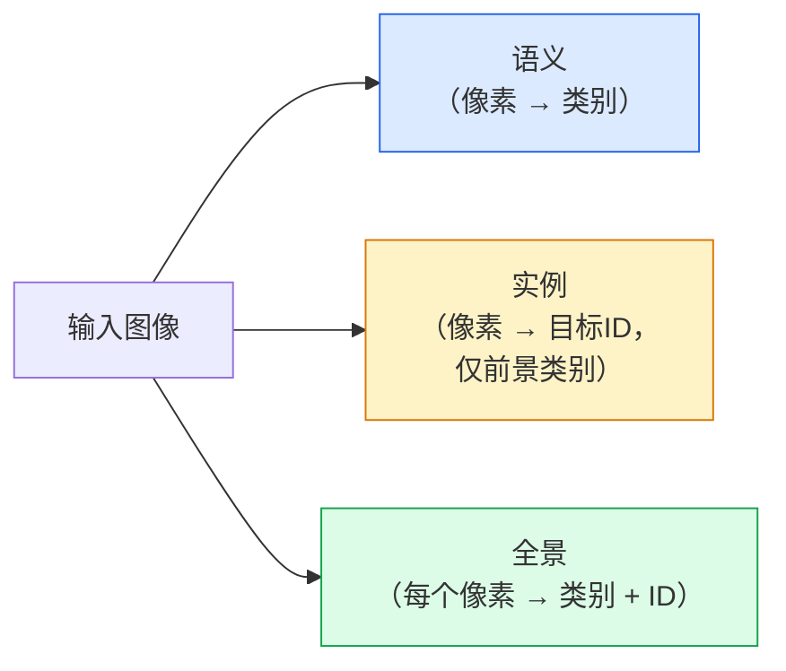
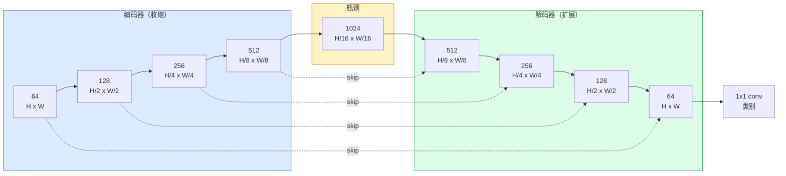

# 语义分割——U-Net

> 分割是每个像素上的分类。U-Net通过配对下采样编码器和上采样解码器，并在它们之间连接跳跃连接来实现这一点。

**类型：** 构建
**语言：** Python
**前置知识：** 第四阶段第03课（CNN），第四阶段第04课（图像分类）
**时间：** ~75分钟

## 学习目标

- 区分语义、实例和全景分割，并为给定问题选择正确的任务
- 在PyTorch中从零构建U-Net，包括编码器块、瓶颈、带转置卷积的解码器和跳跃连接
- 实现逐像素交叉熵、Dice损失以及当前医学和工业分割默认使用的组合损失
- 读取每类的IoU和Dice指标，并诊断差分数是来自小目标召回、边界精度还是类别不平衡

## 问题

分类输出每张图像一个标签。检测输出每张图像几个框。分割输出每个像素一个标签。对于大小为`H x W`的输入，输出是形状为`H x W`（语义）或`H x W x N_instances`（实例）的张量。那是每张图像数百万个预测，而非一个。

分割的结构是它驱动几乎所有密集预测视觉产品的原因：医学成像（肿瘤掩码）、自动驾驶（道路、车道、障碍物）、卫星（建筑足迹、作物边界）、文档解析（布局区域）、机器人（可抓取区域）。这些任务都无法通过在目标周围放一个框来解决；它们需要精确的轮廓。

架构问题易于陈述却不易解决：你需要网络同时看到图像的全局上下文（这是什么类型的场景）和局部像素细节（具体哪个像素是道路哪个是人行道）。标准CNN在空间上压缩以获得上下文，这丢弃了细节。U-Net是同时获得两者的设计。

## 概念

### 语义 vs 实例 vs 全景



- **语义**说"这个像素是路，那个像素是车。"相邻的两辆车合并为一个连续块。
- **实例**说"这个像素是车#3，那个像素是车#5。"忽略背景物体（"stuff" = 天空、道路、草地）。
- **全景**统一两者：每个像素获得一个类别标签，每个实例获得一个唯一ID，stuff和things都被分割。

本课涵盖语义。下一课（Mask R-CNN）涵盖实例。

### U-Net形状



编码器将空间分辨率减半四次，通道数加倍。解码器逆转：空间分辨率加倍四次，通道数减半。跳跃连接在每个分辨率上将匹配的编码器特征与解码器特征连接。最后的1x1卷积将`64 -> num_classes`映射到全分辨率。

为什么跳跃连接是必要的：解码器在尝试输出像素级预测时只看到了小特征图。没有跳跃连接，它无法准确定位边缘，因为该信息在编码器中被压缩掉了。跳跃连接将编码器在下行过程中计算的高分辨率特征图交给解码器。

### 转置 vs 双线性上采样

解码器必须扩展空间维度。两种选择：

- **转置卷积**（`nn.ConvTranspose2d`）——可学习的上采样。历史上的U-Net默认。如果步幅和核大小不能整除，可能产生棋盘伪影。
- **双线性上采样 + 3x3卷积**——平滑上采样后接卷积。更少伪影，更少参数，现在是现代默认。

两者都存在于实际中。对于第一个U-Net，双线性更安全。

### 像素网格上的交叉熵

对于具有C类别的语义分割，模型输出为`(N, C, H, W)`。目标为`(N, H, W)`，包含整数类别ID。交叉熵与分类情况相同，只是应用于每个空间位置：

```
Loss = 在 (n, h, w) 上平均的 -log( softmax(logits[n, :, h, w])[target[n, h, w]] )
```

PyTorch中的`F.cross_entropy`原生处理此形状。无需重塑。

### Dice损失及其必要性

交叉熵平等对待每个像素。当一个类别主导画面时这是错误的（医学成像：99%背景，1%肿瘤）。网络可以通过在所有地方预测背景来获得99%准确率，但仍然毫无用处。

Dice损失通过直接优化预测掩码和真实掩码之间的重叠来解决这个问题：

```
Dice(p, y) = 2 * sum(p * y) / (sum(p) + sum(y) + epsilon)
Dice_loss = 1 - Dice
```

其中`p`是某个类别的sigmoid/softmax概率图，`y`是二值真实掩码。只有当重叠完美时损失才为零。因为它是基于比率的，类别不平衡无关紧要。

在实践中，使用**组合损失**：

```
L = L_cross_entropy + lambda * L_dice       (lambda ~ 1)
```

交叉熵在训练早期提供稳定的梯度；Dice聚焦于训练后期实际匹配掩码形状。这种组合是医学成像的默认选择，在任何类别不平衡的数据集上都难以击败。

### 评估指标

- **像素准确率** — 正确预测的像素百分比。便宜。在不平衡数据上因与分类中准确率相同的原因而失效。
- **每类IoU** — 每个类别掩码的交并比；跨类别平均 = mIoU。
- **Dice（像素上的F1）** — 类似于IoU；`Dice = 2 * IoU / (1 + IoU)`。医学成像偏好Dice，驾驶社区偏好IoU；它们单调相关。
- **边界F1** — 衡量预测边界与真实边界的接近程度，即使小偏移也惩罚。对高精度任务如半导体检测很重要。

报告每类IoU，而非仅mIoU。均值IoU隐藏了一个15%的类别，当其他九个都在85%时。

### 输入分辨率权衡

U-Net的编码器将分辨率减半四次，因此输入必须能被16整除。医学图像通常为512x512或1024x1024。自动驾驶裁剪为2048x1024。U-Net的内存成本随`H * W * C_max`缩放，在1024x1024配合1024瓶颈通道时，前向传播已经使用数GB显存。

两种标准变通方法：
1. 分块输入——用重叠处理256x256块并拼接。
2. 用膨胀卷积替换瓶颈，保持空间分辨率较高但拓宽感受野（DeepLab家族）。

对于第一个模型，256x256输入配合64通道基数的U-Net可以在8 GB显存上舒适地训练。

## 构建

### 第一步：编码器块

两个3x3卷积，带批归一化和ReLU。第一个卷积改变通道数；第二个保持不变。

```python
import torch
import torch.nn as nn
import torch.nn.functional as F

class DoubleConv(nn.Module):
    def __init__(self, in_c, out_c):
        super().__init__()
        self.net = nn.Sequential(
            nn.Conv2d(in_c, out_c, kernel_size=3, padding=1, bias=False),
            nn.BatchNorm2d(out_c),
            nn.ReLU(inplace=True),
            nn.Conv2d(out_c, out_c, kernel_size=3, padding=1, bias=False),
            nn.BatchNorm2d(out_c),
            nn.ReLU(inplace=True),
        )

    def forward(self, x):
        return self.net(x)
```

此块在整个过程中重复使用。`bias=False`因为BN的beta处理了偏置。

### 第二步：下采样和上采样块

```python
class Down(nn.Module):
    def __init__(self, in_c, out_c):
        super().__init__()
        self.net = nn.Sequential(
            nn.MaxPool2d(2),
            DoubleConv(in_c, out_c),
        )

    def forward(self, x):
        return self.net(x)


class Up(nn.Module):
    def __init__(self, in_c, out_c):
        super().__init__()
        self.up = nn.Upsample(scale_factor=2, mode="bilinear", align_corners=False)
        self.conv = DoubleConv(in_c, out_c)

    def forward(self, x, skip):
        x = self.up(x)
        if x.shape[-2:] != skip.shape[-2:]:
            x = F.interpolate(x, size=skip.shape[-2:], mode="bilinear", align_corners=False)
        x = torch.cat([skip, x], dim=1)
        return self.conv(x)
```

仅空间形状检查（`shape[-2:]`）处理维度不能被16整除的输入；安全的`F.interpolate`在连接前对齐张量。比较完整形状也会触发通道数差异，这应该是一个响亮的错误而非静默的插值。

### 第三步：U-Net

```python
class UNet(nn.Module):
    def __init__(self, in_channels=3, num_classes=2, base=64):
        super().__init__()
        self.inc = DoubleConv(in_channels, base)
        self.d1 = Down(base, base * 2)
        self.d2 = Down(base * 2, base * 4)
        self.d3 = Down(base * 4, base * 8)
        self.d4 = Down(base * 8, base * 16)
        self.u1 = Up(base * 16 + base * 8, base * 8)
        self.u2 = Up(base * 8 + base * 4, base * 4)
        self.u3 = Up(base * 4 + base * 2, base * 2)
        self.u4 = Up(base * 2 + base, base)
        self.outc = nn.Conv2d(base, num_classes, kernel_size=1)

    def forward(self, x):
        x1 = self.inc(x)
        x2 = self.d1(x1)
        x3 = self.d2(x2)
        x4 = self.d3(x3)
        x5 = self.d4(x4)
        x = self.u1(x5, x4)
        x = self.u2(x, x3)
        x = self.u3(x, x2)
        x = self.u4(x, x1)
        return self.outc(x)

net = UNet(in_channels=3, num_classes=2, base=32)
x = torch.randn(1, 3, 256, 256)
print(f"输出: {net(x).shape}")
print(f"参数: {sum(p.numel() for p in net.parameters()):,}")
```

输出形状`(1, 2, 256, 256)`——与输入相同的空间大小，`num_classes`个通道。在`base=32`时约770万个参数。

### 第四步：损失函数

```python
def dice_loss(logits, targets, num_classes, eps=1e-6):
    probs = F.softmax(logits, dim=1)
    targets_one_hot = F.one_hot(targets, num_classes).permute(0, 3, 1, 2).float()
    dims = (0, 2, 3)
    intersection = (probs * targets_one_hot).sum(dim=dims)
    denom = probs.sum(dim=dims) + targets_one_hot.sum(dim=dims)
    dice = (2 * intersection + eps) / (denom + eps)
    return 1 - dice.mean()


def combined_loss(logits, targets, num_classes, lam=1.0):
    ce = F.cross_entropy(logits, targets)
    dc = dice_loss(logits, targets, num_classes)
    return ce + lam * dc, {"ce": ce.item(), "dice": dc.item()}
```

Dice按类别计算然后平均（宏观Dice）。`eps`防止批次中缺少类别时除以零。

### 第五步：IoU指标

```python
@torch.no_grad()
def iou_per_class(logits, targets, num_classes):
    preds = logits.argmax(dim=1)
    ious = torch.zeros(num_classes)
    for c in range(num_classes):
        pred_c = (preds == c)
        true_c = (targets == c)
        inter = (pred_c & true_c).sum().float()
        union = (pred_c | true_c).sum().float()
        ious[c] = (inter / union) if union > 0 else torch.tensor(float("nan"))
    return ious
```

返回长度为C的向量。`nan`标记批次中缺失的类别——计算mIoU时不要平均这些。

### 第六步：端到端验证的合成数据集

在彩色背景上生成形状，使网络必须学习形状而非像素颜色。

```python
import numpy as np
from torch.utils.data import Dataset, DataLoader

def synthetic_segmentation(num_samples=200, size=64, seed=0):
    rng = np.random.default_rng(seed)
    images = np.zeros((num_samples, size, size, 3), dtype=np.float32)
    masks = np.zeros((num_samples, size, size), dtype=np.int64)
    for i in range(num_samples):
        bg = rng.uniform(0, 1, (3,))
        images[i] = bg
        masks[i] = 0
        num_shapes = rng.integers(1, 4)
        for _ in range(num_shapes):
            cls = int(rng.integers(1, 3))
            color = rng.uniform(0, 1, (3,))
            cx, cy = rng.integers(10, size - 10, size=2)
            r = int(rng.integers(4, 12))
            yy, xx = np.meshgrid(np.arange(size), np.arange(size), indexing="ij")
            if cls == 1:
                mask = (xx - cx) ** 2 + (yy - cy) ** 2 < r ** 2
            else:
                mask = (np.abs(xx - cx) < r) & (np.abs(yy - cy) < r)
            images[i][mask] = color
            masks[i][mask] = cls
        images[i] += rng.normal(0, 0.02, images[i].shape)
        images[i] = np.clip(images[i], 0, 1)
    return images, masks


class SegDataset(Dataset):
    def __init__(self, images, masks):
        self.images = images
        self.masks = masks

    def __len__(self):
        return len(self.images)

    def __getitem__(self, i):
        img = torch.from_numpy(self.images[i]).permute(2, 0, 1).float()
        mask = torch.from_numpy(self.masks[i]).long()
        return img, mask
```

三个类别：背景（0）、圆形（1）、方形（2）。网络必须学会区分形状。

### 第七步：训练循环

```python
def train_one_epoch(model, loader, optimizer, device, num_classes):
    model.train()
    loss_sum, total = 0.0, 0
    iou_sum = torch.zeros(num_classes)
    for x, y in loader:
        x, y = x.to(device), y.to(device)
        logits = model(x)
        loss, _ = combined_loss(logits, y, num_classes)
        optimizer.zero_grad()
        loss.backward()
        optimizer.step()
        loss_sum += loss.item() * x.size(0)
        total += x.size(0)
        iou_sum += iou_per_class(logits, y, num_classes).nan_to_num(0)
    return loss_sum / total, iou_sum / len(loader)
```

在合成数据集上运行10-30个epoch，观察形状类别的mIoU攀升超过0.9。注意`nan_to_num(0)`将批次中缺失的类别视为0；为了准确的每类IoU，在评估时按存在性掩码并使用`torch.nanmean`跨批次计算，而不是在这里平均。

## 使用

对于生产环境，`segmentation_models_pytorch`（"smp"）用任何torchvision或timm骨干包装每个标准分割架构。三行代码：

```python
import segmentation_models_pytorch as smp

model = smp.Unet(
    encoder_name="resnet34",
    encoder_weights="imagenet",
    in_channels=3,
    classes=3,
)
```

实际工作中也值得了解：
- **DeepLabV3+** 用膨胀卷积替换基于最大池化的下采样，使瓶颈保持分辨率；在卫星和驾驶数据上边界更快。
- **SegFormer** 将卷积编码器替换为分层Transformer；在许多基准上当前最先进。
- **Mask2Former** / **OneFormer** 在单一架构中统一语义、实例和全景分割。

所有三个都可以在`smp`或`transformers`中作为替换使用，数据加载器相同。

## 交付

本课产出：

- `outputs/prompt-segmentation-task-picker.md` — 一个提示词，在语义、实例和全景分割之间选择，并为给定任务命名架构。
- `outputs/skill-segmentation-mask-inspector.md` — 一个技能，报告类别分布、预测掩码统计量，以及预测不足或边界模糊的类别。

## 练习

1. **（简单）** 为二值分割任务（前景 vs 背景）实现`bce_dice_loss`。在合成二类数据集上验证，当前景仅占像素的5%时，组合损失比单独BCE收敛更快。
2. **（中等）** 将上采样块从`nn.Upsample + conv`替换为`nn.ConvTranspose2d`上采样块。在合成数据集上训练两者并比较mIoU。观察转置卷积版本中棋盘伪影出现的位置。
3. **（困难）** 取一个真实分割数据集（Oxford-IIIT Pets、Cityscapes mini split或医学子集），训练U-Net到与`smp.Unet`参考值相差2个IoU点以内的精度。报告每类IoU，并识别哪些类别从向损失中添加Dice中受益最多。

## 关键术语

| 术语 | 人们说的 | 实际含义 |
|------|----------------|----------------------|
| 语义分割 | "标记每个像素" | 将像素分类到C个类别；同一类别的实例合并 |
| 实例分割 | "标记每个目标" | 分离同一类别的不同实例；仅前景 |
| 全景分割 | "语义 + 实例" | 每个像素获得一个类别；每个物体实例也获得唯一ID |
| 跳跃连接 | "U-Net桥" | 将编码器特征连接到匹配分辨率的解码器特征；保留高频细节 |
| 转置卷积 | "反卷积" | 可学习的上采样；可能产生棋盘伪影 |
| Dice损失 | "重叠损失" | 1 - 2|A ∩ B| / (|A| + |B|)；直接优化掩码重叠并对类别不平衡鲁棒 |
| mIoU | "均值交并比" | 跨类别的平均IoU；分割的社区标准指标 |
| 边界F1 | "边界准确率" | 仅在边界像素上计算的F1分数；对精度关键任务很重要 |

## 延伸阅读

- [U-Net: Convolutional Networks for Biomedical Image Segmentation (Ronneberger et al., 2015)](https://arxiv.org/abs/1505.04597) — 原始论文；每个人复制的图在第2页
- [Fully Convolutional Networks (Long et al., 2015)](https://arxiv.org/abs/1411.4038) — 首次将分割作为端到端卷积问题的论文
- [segmentation_models_pytorch](https://github.com/qubvel/segmentation_models.pytorch) — 生产分割的参考；每个标准架构加每个标准损失
- [Lessons learned from training SOTA segmentation (kaggle.com competitions)](https://www.kaggle.com/code/iafoss/carvana-unet-pytorch) — 为什么TTA、伪标签和类别权重在真实数据上重要的实践指南
