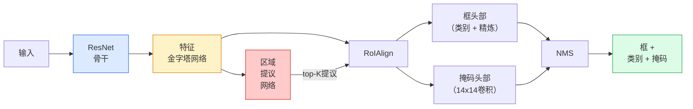

# 实例分割——Mask R-CNN

> 给Faster R-CNN检测器添加一个微小的掩码分支，你就得到了实例分割。难的部分是RoIAlign，而且它比看起来更难。

**类型：** 构建 + 学习
**语言：** Python
**前置知识：** 第四阶段第06课（YOLO），第四阶段第07课（U-Net）
**时间：** ~75分钟

## 学习目标

- 端到端追溯Mask R-CNN架构：骨干、FPN、RPN、RoIAlign、框头部、掩码头部
- 从零实现RoIAlign，并解释为什么RoIPool不再使用
- 使用torchvision的`maskrcnn_resnet50_fpn_v2`预训练模型获取生产级实例掩码，并正确读取其输出格式
- 通过替换框和掩码头部并保持骨干冻结，在小型自定义数据集上微调Mask R-CNN

## 问题

语义分割给你每类一个掩码。实例分割给你每个目标一个掩码，即使两个目标共享一个类别。计数个体、跨帧跟踪和测量物体（墙上的每块砖、显微镜图像中的每个细胞）都需要实例分割。

Mask R-CNN（何恺明等人，2017年）通过将实例分割重新定义为"检测加一个掩码"来解决这个问题。这个设计如此简洁，以至于在接下来的五年里，几乎每篇实例分割论文都是Mask R-CNN的变体，而且torchvision的实现仍然是中小型数据集的生产默认。

困难的工程问题是采样：如何从一个其角点不与像素边界对齐的建议框中裁剪出固定大小的特征区域？搞错这一点会在每个地方损失十分之一个mAP点。RoIAlign就是答案。

## 概念

### 架构



需要理解的五个部分：

1. **骨干** — ResNet-50或ResNet-101，在ImageNet上训练。生成步幅为4、8、16、32的特征图层级。
2. **FPN（特征金字塔网络）** — 自上而下 + 横向连接，给每个级别提供C通道的语义丰富特征。检测查询匹配目标大小的FPN级别。
3. **RPN（区域提议网络）** — 一个小型卷积头，在每个锚点位置预测"这里有目标吗？"和"如何精炼框？"。每张图像产生约1000个提议。
4. **RoIAlign** — 从任何FPN级别上的任何框中采样固定大小（如7x7）的特征块。双线性采样，无量化。
5. **头部** — 双层框头部，精炼框并选择类别，外加一个小型卷积头，为每个提议输出一个`28x28`的二值掩码。

### 为什么是RoIAlign，而不是RoIPool

原始的Fast R-CNN使用RoIPool，它将提议框分割成一个网格，在每个单元中取最大值，并将所有坐标四舍五入为整数。这种四舍五入使特征图与输入像素坐标错位高达一个完整的特征图像素——在224x224图像上很小，但当特征图步幅为32时是灾难性的。

```
RoIPool:
  框 (34.7, 51.3, 98.2, 142.9)
  四舍五入 -> (34, 51, 98, 142)
  分割网格 -> 四舍五入每个单元边界
  错位在每一步累积

RoIAlign:
  框 (34.7, 51.3, 98.2, 142.9)
  在精确浮点坐标处使用双线性插值采样
  任何地方都不四舍五入
```

RoIAlign在COCO上免费将掩码AP提升3-4个点。每个关心定位精度的检测器现在都使用它——YOLOv7 seg、RT-DETR、Mask2Former等。

### RPN一段话

在特征图的每个位置，放置不同大小和形状的K个锚点框。为每个锚点预测一个目标存在性分数和一个回归偏移量，将锚点转换为更合适的框。按分数保留前约1000个框，在IoU 0.7处应用NMS，并将幸存者交给头部。RPN使用其自己的小损失进行训练——与第6课的YOLO损失结构相同，只是有两个类别（目标 / 无目标）。

### 掩码头部

对于每个提议（RoIAlign之后），掩码头是一个微型FCN：四个3x3卷积，一个2x反卷积，一个最终的1x1卷积，在`28x28`分辨率下产生`num_classes`个输出通道。仅保留与预测类别对应的通道；其他被忽略。这解耦了掩码预测和分类。

将28x28的掩码上采样到提议的原始像素大小以产生最终的二值掩码。

### 损失

Mask R-CNN有四个加在一起的损失：

```
L = L_rpn_cls + L_rpn_box + L_box_cls + L_box_reg + L_mask
```

- `L_rpn_cls`, `L_rpn_box` — RPN提议的目标存在性 + 框回归。
- `L_box_cls` — (C+1)类（包括背景）上头部分类器的交叉熵。
- `L_box_reg` — 头部框精炼的smooth L1。
- `L_mask` — 28x28掩码输出的逐像素二值交叉熵。

每个损失有其自己的默认权重；torchvision实现将它们暴露为构造参数。

### 输出格式

`torchvision.models.detection.maskrcnn_resnet50_fpn_v2`返回字典的列表，每张图像一个：

```
{
    "boxes":  (N, 4) 像素坐标 (x1, y1, x2, y2),
    "labels": (N,) 类别ID，0 = 背景，因此索引从1开始,
    "scores": (N,) 置信度分数,
    "masks":  (N, 1, H, W) 浮点掩码，范围[0, 1] — 在0.5处设阈值得到二值掩码,
}
```

掩码已经是全图像分辨率。28x28头部输出已在内部上采样。

## 构建

### 第一步：从零实现RoIAlign

这是Mask R-CNN的一个组件，作为代码比作为散文更容易理解。

```python
import torch
import torch.nn.functional as F

def roi_align_single(feature, box, output_size=7, spatial_scale=1 / 16.0):
    """
    feature: (C, H, W) 单图像特征图
    box: (x1, y1, x2, y2) 原始图像像素坐标
    output_size: 输出网格边长（框头部用7，掩码头部用14）
    spatial_scale: 特征图步幅的倒数
    """
    C, H, W = feature.shape
    x1, y1, x2, y2 = [c * spatial_scale - 0.5 for c in box]
    bin_w = (x2 - x1) / output_size
    bin_h = (y2 - y1) / output_size

    grid_y = torch.linspace(y1 + bin_h / 2, y2 - bin_h / 2, output_size)
    grid_x = torch.linspace(x1 + bin_w / 2, x2 - bin_w / 2, output_size)
    yy, xx = torch.meshgrid(grid_y, grid_x, indexing="ij")

    gx = 2 * (xx + 0.5) / W - 1
    gy = 2 * (yy + 0.5) / H - 1
    grid = torch.stack([gx, gy], dim=-1).unsqueeze(0)
    sampled = F.grid_sample(feature.unsqueeze(0), grid, mode="bilinear",
                            align_corners=False)
    return sampled.squeeze(0)
```

每个数字都在双线性采样位置。没有四舍五入，没有量化，没有丢失的梯度。

### 第二步：与torchvision的RoIAlign比较

```python
from torchvision.ops import roi_align

feature = torch.randn(1, 16, 50, 50)
boxes = torch.tensor([[0, 10, 20, 100, 90]], dtype=torch.float32)

ours = roi_align_single(feature[0], boxes[0, 1:].tolist(), output_size=7, spatial_scale=1/4)
theirs = roi_align(feature, boxes, output_size=(7, 7), spatial_scale=1/4, sampling_ratio=1, aligned=True)[0]

print(f"形状 我们的:   {tuple(ours.shape)}")
print(f"形状 他们的: {tuple(theirs.shape)}")
print(f"最大差值:    {(ours - theirs).abs().max().item():.3e}")
```

使用`sampling_ratio=1`和`aligned=True`，两者匹配到`1e-5`以内。

### 第三步：加载预训练Mask R-CNN

```python
import torch
from torchvision.models.detection import maskrcnn_resnet50_fpn_v2, MaskRCNN_ResNet50_FPN_V2_Weights

model = maskrcnn_resnet50_fpn_v2(weights=MaskRCNN_ResNet50_FPN_V2_Weights.DEFAULT)
model.eval()
print(f"参数: {sum(p.numel() for p in model.parameters()):,}")
```

4600万参数，91类（COCO）。第一个类别（ID 0）是背景；模型实际检测的一切从ID 1开始。

### 第四步：运行推理

```python
with torch.no_grad():
    x = torch.randn(3, 400, 600)
    predictions = model([x])
p = predictions[0]
print(f"boxes:  {tuple(p['boxes'].shape)}")
print(f"labels: {tuple(p['labels'].shape)}")
print(f"scores: {tuple(p['scores'].shape)}")
print(f"masks:  {tuple(p['masks'].shape)}")
```

掩码张量形状为`(N, 1, H, W)`。在0.5处设阈值以获得每个目标的二值掩码：

```python
binary_masks = (p['masks'] > 0.5).squeeze(1)  # (N, H, W) 布尔值
```

### 第五步：为自定义类别数替换头部

常见的微调配方：重用骨干、FPN和RPN；替换两个分类器头部。

```python
from torchvision.models.detection.faster_rcnn import FastRCNNPredictor
from torchvision.models.detection.mask_rcnn import MaskRCNNPredictor

def build_custom_maskrcnn(num_classes):
    model = maskrcnn_resnet50_fpn_v2(weights=MaskRCNN_ResNet50_FPN_V2_Weights.DEFAULT)
    in_features = model.roi_heads.box_predictor.cls_score.in_features
    model.roi_heads.box_predictor = FastRCNNPredictor(in_features, num_classes)
    in_features_mask = model.roi_heads.mask_predictor.conv5_mask.in_channels
    hidden_layer = 256
    model.roi_heads.mask_predictor = MaskRCNNPredictor(in_features_mask, hidden_layer, num_classes)
    return model

custom = build_custom_maskrcnn(num_classes=5)
print(f"自定义 cls_score.out_features: {custom.roi_heads.box_predictor.cls_score.out_features}")
```

`num_classes`必须包含背景类，因此具有4个目标类的数据集使用`num_classes=5`。

### 第六步：冻结不需要训练的部分

在小数据集上，冻结骨干和FPN。只有RPN目标存在性+回归和两个头部学习。

```python
def freeze_backbone_and_fpn(model):
    for p in model.backbone.parameters():
        p.requires_grad = False
    return model

custom = freeze_backbone_and_fpn(custom)
trainable = sum(p.numel() for p in custom.parameters() if p.requires_grad)
print(f"冻结后可训练: {trainable:,}")
```

在500张图像的数据集上，这是收敛与过拟合之间的区别。

## 使用

torchvision中Mask R-CNN的完整训练循环是40行代码，在任务之间不会发生有意义的变化——交换数据集即可运行。

```python
def train_step(model, images, targets, optimizer):
    model.train()
    loss_dict = model(images, targets)
    losses = sum(loss for loss in loss_dict.values())
    optimizer.zero_grad()
    losses.backward()
    optimizer.step()
    return {k: v.item() for k, v in loss_dict.items()}
```

`targets`列表必须包含每张图像的字典，带有`boxes`、`labels`和`masks`（作为`(num_instances, H, W)`二值张量）。模型在训练期间返回一个损失字典，在评估期间返回预测列表，键由`model.training`决定。

`pycocotools`评估器既产生框的mAP@IoU=0.5:0.95，也产生掩码的；你需要两个数字来知道框头部还是掩码头部是瓶颈。

## 交付

本课产出：

- `outputs/prompt-instance-vs-semantic-router.md` — 一个提示词，问三个问题并在实例 vs 语义 vs 全景之间选择，加上要开始的精确模型。
- `outputs/skill-mask-rcnn-head-swapper.md` — 一个技能，给定新的`num_classes`，为在任何torchvision检测模型上交换头部生成10行代码。

## 练习

1. **（简单）** 在100个随机框上验证你的RoIAlign对照`torchvision.ops.roi_align`。报告最大绝对差异。同时运行RoIPool（2017年前的行为）并展示它在靠近边界的框上偏离约1-2个特征图像素。
2. **（中等）** 在50张图像的自定义数据集（任何两个类别：气球、鱼、坑洞、标志）上微调`maskrcnn_resnet50_fpn_v2`。冻结骨干，训练20个epoch，报告掩码AP@0.5。
3. **（困难）** 将Mask R-CNN的掩码头部替换为预测56x56而非28x28的版本。测量mAP@IoU=0.75的前后变化。解释为什么增益（或缺乏增益）与预期的边界精度/内存权衡匹配。

## 关键术语

| 术语 | 人们说的 | 实际含义 |
|------|----------------|----------------------|
| Mask R-CNN | "检测加掩码" | Faster R-CNN + 一个小型FCN头，为每个提议每个类别预测28x28掩码 |
| FPN | "特征金字塔" | 自上而下 + 横向连接，给每个步幅级别C通道的语义丰富特征 |
| RPN | "区域提议器" | 一个小型卷积头，每张图像产生约1000个目标/无目标提议 |
| RoIAlign | "无四舍五入裁剪" | 从任何浮点坐标框中双线性采样固定大小的特征网格 |
| RoIPool | "2017年前裁剪" | 与RoIAlign相同目的但四舍五入框坐标；已废弃 |
| 掩码AP | "实例mAP" | 使用掩码IoU而非框IoU计算的平均精确率；COCO实例分割指标 |
| 二值掩码头 | "每类掩码" | 为每个提议每个类别预测一个二值掩码；仅保留预测类别对应的通道 |
| 背景类 | "第0类" | 包罗万象的"无目标"类；真实类别的索引从1开始 |

## 延伸阅读

- [Mask R-CNN (He et al., 2017)](https://arxiv.org/abs/1703.06870) — 论文；关于RoIAlign的第3节是关键阅读
- [FPN: Feature Pyramid Networks (Lin et al., 2017)](https://arxiv.org/abs/1612.03144) — FPN论文；每个现代检测器都使用它
- [torchvision Mask R-CNN tutorial](https://pytorch.org/tutorials/intermediate/torchvision_tutorial.html) — 微调循环的参考
- [Detectron2 model zoo](https://github.com/facebookresearch/detectron2/blob/main/MODEL_ZOO.md) — 生产级实现，带有几乎每个检测和分割变体的训练权重
