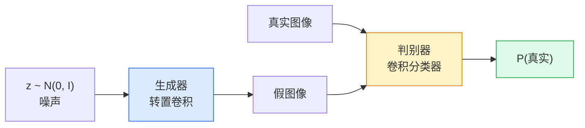
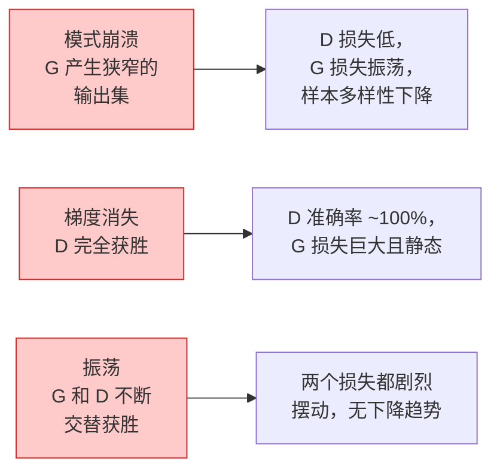

# 图像生成——GAN

> GAN是两个神经网络玩一个固定游戏。一个画，一个评论。它们共同进步，直到画作能骗过评论家。

**类型：** 构建
**语言：** Python
**前置知识：** 第四阶段第03课（CNN），第三阶段第06课（优化器），第三阶段第07课（正则化）
**时间：** ~75分钟

## 学习目标

- 解释生成器和判别器之间的极小极大博弈，以及为什么均衡对应于p_model = p_data
- 在PyTorch中实现DCGAN，并在不到60行代码中生成连贯的32x32合成图像
- 使用三个标准技巧稳定GAN训练：非饱和损失、谱归一化、TTUR（双时间尺度更新规则）
- 读取区分健康收敛与模式崩溃、振荡和判别器完全获胜的训练曲线

## 问题

分类教网络将图像映射到标签。生成反转问题：采样看起来来自相同分布的新图像。没有你可以差异对比的"正确"输出；只有一个你想要模仿的分布。

标准损失函数（MSE、交叉熵）无法衡量"这个样本来自真实分布吗？"最小化逐像素误差产生模糊的平均值，而非真实样本。突破是学习损失：训练第二个网络，其工作是区分真假，并使用其判断来推动生成器。

GAN（Goodfellow等人，2014年）定义了该框架。到2018年，StyleGAN正在产生与照片无法区分的1024x1024人脸。扩散模型此后在质量和可控性上夺取了王位，但使扩散实用的每个技巧——归一化选择、潜在空间、特征损失——都是先在GAN上理解的。

## 概念

### 两个网络



**生成器** G 接受噪声向量`z`并输出图像。**判别器** D 接受图像并输出一个标量：图像为真实的概率。

### 博弈

G 希望 D 出错。D 希望正确。形式上：

```
min_G max_D  E_x[log D(x)] + E_z[log(1 - D(G(z)))]
```

从右到左读：D 在真实（`log D(real)`）和虚假（`log (1 - D(fake))`）图像上最大化准确率。G 最小化 D 在假图像上的准确率——它希望 `D(G(z))` 高。

Goodfellow 证明了这一极小极大博弈具有全局均衡，其中 `p_G = p_data`，D 在所有地方输出 0.5，生成分布与真实分布之间的 Jensen-Shannon 散度为零。困难的部分是到达那里。

### 非饱和损失

上述形式数值不稳定。在训练早期，每个假图像的 `D(G(z))` 接近零，因此 `log(1 - D(G(z)))` 对 G 的梯度消失。修复：翻转 G 的损失。

```
L_D = -E_x[log D(x)] - E_z[log(1 - D(G(z)))]
L_G = -E_z[log D(G(z))]                          # 非饱和
```

现在当 `D(G(z))` 接近零时，G 的损失很大，其梯度信息丰富。每个现代 GAN 都用这种变体训练。

### DCGAN 架构规则

Radford、Metz、Chintala（2015年）将多年的失败实验蒸馏为五条使 GAN 训练稳定的规则：

1. 用步幅卷积替换池化（两个网络）。
2. 在生成器和判别器中使用批归一化，但 G 的输出和 D 的输入除外。
3. 在更深架构上移除全连接层。
4. G 在所有层上使用 ReLU，输出层除外（输出用 tanh 映射到[-1, 1]）。
5. D 在所有层上使用 LeakyReLU（negative_slope=0.2）。

每个基于卷积的现代 GAN（StyleGAN、BigGAN、GigaGAN）仍然从这些规则开始并一次替换一个部分。

### 失败模式及其特征



- **模式崩溃**：G 找到一个能骗过 D 的图像，只产生这一个。修复：添加小批量判别、谱归一化或标签条件。
- **判别器获胜**：D 变得太快太强，G 的梯度消失。修复：更小的 D、更低的 D 学习率，或在真实标签上应用标签平滑。
- **振荡**：两个网络交替获胜，从未接近均衡。修复：TTUR（D 比 G 学习快 2-4 倍），或切换到 Wasserstein 损失。

### 评估

GAN 没有真值，那么你怎么知道它们在工作？

- **样本检查**——在每个 epoch 结束时查看 64 个样本。不可协商。
- **FID（Fréchet Inception Distance）**——真实集和生成集的 Inception-v3 特征分布之间的距离。越低越好。社区标准。
- **Inception Score**——更老、更脆弱；偏好 FID。
- **生成模型的精确率/召回率**——分别衡量质量（精确率）和覆盖率（召回率）。比单独 FID 信息更丰富。

对于小型合成数据运行，样本检查就足够了。

## 构建

### 第一步：生成器

一个接受 64 维噪声并产生 32x32 图像的小型 DCGAN 生成器。

```python
import torch
import torch.nn as nn

class Generator(nn.Module):
    def __init__(self, z_dim=64, img_channels=3, feat=64):
        super().__init__()
        self.net = nn.Sequential(
            nn.ConvTranspose2d(z_dim, feat * 4, kernel_size=4, stride=1, padding=0, bias=False),
            nn.BatchNorm2d(feat * 4),
            nn.ReLU(inplace=True),
            nn.ConvTranspose2d(feat * 4, feat * 2, kernel_size=4, stride=2, padding=1, bias=False),
            nn.BatchNorm2d(feat * 2),
            nn.ReLU(inplace=True),
            nn.ConvTranspose2d(feat * 2, feat, kernel_size=4, stride=2, padding=1, bias=False),
            nn.BatchNorm2d(feat),
            nn.ReLU(inplace=True),
            nn.ConvTranspose2d(feat, img_channels, kernel_size=4, stride=2, padding=1, bias=False),
            nn.Tanh(),
        )

    def forward(self, z):
        return self.net(z.view(z.size(0), -1, 1, 1))
```

四个转置卷积，每个用 `kernel_size=4, stride=2, padding=1`，使它们干净地加倍空间大小。通过 tanh 输出激活在[-1, 1]。

### 第二步：判别器

生成器的镜像。LeakyReLU，步幅卷积，最终以一个标量 logit 结束。

```python
class Discriminator(nn.Module):
    def __init__(self, img_channels=3, feat=64):
        super().__init__()
        self.net = nn.Sequential(
            nn.Conv2d(img_channels, feat, kernel_size=4, stride=2, padding=1),
            nn.LeakyReLU(0.2, inplace=True),
            nn.Conv2d(feat, feat * 2, kernel_size=4, stride=2, padding=1, bias=False),
            nn.BatchNorm2d(feat * 2),
            nn.LeakyReLU(0.2, inplace=True),
            nn.Conv2d(feat * 2, feat * 4, kernel_size=4, stride=2, padding=1, bias=False),
            nn.BatchNorm2d(feat * 4),
            nn.LeakyReLU(0.2, inplace=True),
            nn.Conv2d(feat * 4, 1, kernel_size=4, stride=1, padding=0),
        )

    def forward(self, x):
        return self.net(x).view(-1)
```

最后的卷积将`4x4`特征图缩减为`1x1`。输出是每张图像一个标量；仅在损失计算期间应用 sigmoid。

### 第三步：训练步骤

交替：每批次更新 D 一次，然后 G 一次。

```python
import torch.nn.functional as F

def train_step(G, D, real, z, opt_g, opt_d, device):
    real = real.to(device)
    bs = real.size(0)

    # D 步骤
    opt_d.zero_grad()
    d_real = D(real)
    d_fake = D(G(z).detach())
    loss_d = (F.binary_cross_entropy_with_logits(d_real, torch.ones_like(d_real))
              + F.binary_cross_entropy_with_logits(d_fake, torch.zeros_like(d_fake)))
    loss_d.backward()
    opt_d.step()

    # G 步骤
    opt_g.zero_grad()
    d_fake = D(G(z))
    loss_g = F.binary_cross_entropy_with_logits(d_fake, torch.ones_like(d_fake))
    loss_g.backward()
    opt_g.step()

    return loss_d.item(), loss_g.item()
```

D 步骤中的 `G(z).detach()` 是关键：我们不希望在 D 更新期间将梯度流入 G。忘记这一点是经典的初学者错误。

### 第四步：合成形状上的完整训练循环

```python
from torch.utils.data import DataLoader, TensorDataset
import numpy as np

def synthetic_images(num=2000, size=32, seed=0):
    rng = np.random.default_rng(seed)
    imgs = np.zeros((num, 3, size, size), dtype=np.float32) - 1.0
    for i in range(num):
        r = rng.uniform(6, 12)
        cx, cy = rng.uniform(r, size - r, size=2)
        yy, xx = np.meshgrid(np.arange(size), np.arange(size), indexing="ij")
        mask = (xx - cx) ** 2 + (yy - cy) ** 2 < r ** 2
        color = rng.uniform(-0.5, 1.0, size=3)
        for c in range(3):
            imgs[i, c][mask] = color[c]
    return torch.from_numpy(imgs)

device = "cuda" if torch.cuda.is_available() else "cpu"
data = synthetic_images()
loader = DataLoader(TensorDataset(data), batch_size=64, shuffle=True)

G = Generator(z_dim=64, img_channels=3, feat=32).to(device)
D = Discriminator(img_channels=3, feat=32).to(device)
opt_g = torch.optim.Adam(G.parameters(), lr=2e-4, betas=(0.5, 0.999))
opt_d = torch.optim.Adam(D.parameters(), lr=2e-4, betas=(0.5, 0.999))

for epoch in range(10):
    for (batch,) in loader:
        z = torch.randn(batch.size(0), 64, device=device)
        ld, lg = train_step(G, D, batch, z, opt_g, opt_d, device)
    print(f"epoch {epoch}  D {ld:.3f}  G {lg:.3f}")
```

`Adam(lr=2e-4, betas=(0.5, 0.999))` 是 DCGAN 默认值——低 beta1 防止动量项过多地稳定对抗博弈。

### 第五步：采样

```python
@torch.no_grad()
def sample(G, n=16, z_dim=64, device="cpu"):
    G.eval()
    z = torch.randn(n, z_dim, device=device)
    imgs = G(z)
    imgs = (imgs + 1) / 2
    return imgs.clamp(0, 1)
```

在采样前始终切换到评估模式。对于 DCGAN，这很重要，因为使用批次归一化的运行统计量而不是批次的统计量。

### 第六步：谱归一化

判别器中 BN 的替代品，保证网络是 1-Lipschitz。修复大多数"D 胜得太狠"的失败。

```python
from torch.nn.utils import spectral_norm

def build_sn_discriminator(img_channels=3, feat=64):
    return nn.Sequential(
        spectral_norm(nn.Conv2d(img_channels, feat, 4, 2, 1)),
        nn.LeakyReLU(0.2, inplace=True),
        spectral_norm(nn.Conv2d(feat, feat * 2, 4, 2, 1)),
        nn.LeakyReLU(0.2, inplace=True),
        spectral_norm(nn.Conv2d(feat * 2, feat * 4, 4, 2, 1)),
        nn.LeakyReLU(0.2, inplace=True),
        spectral_norm(nn.Conv2d(feat * 4, 1, 4, 1, 0)),
    )
```

将`Discriminator`替换为`build_sn_discriminator()`，你通常不需要 TTUR 技巧。谱归一化是你可以应用的最简单的单次鲁棒性升级。

## 使用

对于严肃的生成，使用预训练权重或切换到扩散。两个标准库：

- `torch_fidelity` 计算你的生成器上的 FID / IS，无需编写自定义评估代码。
- `pytorch-gan-zoo`（旧版）和 `StudioGAN` 提供经过测试的 DCGAN、WGAN-GP、SN-GAN、StyleGAN 和 BigGAN 实现。

在 2026 年，GAN 仍然是以下任务的最佳选择：实时图像生成（延迟 <10 ms）、风格迁移、具有精确控制的图像到图像翻译（Pix2Pix、CycleGAN）。扩散在逼真度和文本条件上胜出。

## 交付

本课产出：

- `outputs/prompt-gan-training-triage.md` — 一个提示词，读取训练曲线描述并选择失败模式（模式崩溃、D 胜、振荡）加上推荐的单一修复。
- `outputs/skill-dcgan-scaffold.md` — 一个技能，从 `z_dim`、目标`image_size`和`num_channels`编写 DCGAN 骨架，包括训练循环和样本保存器。

## 练习

1. **（简单）** 在上面训练 DCGAN 于合成圆形数据集，并在每个 epoch 结束时保存 16 个样本的网格。到哪个 epoch 生成的圆形变得清晰可辨？
2. **（中等）** 将判别器的批归一化替换为谱归一化。并排训练两个版本。哪个收敛更快？哪个在三个种子上的方差更低？
3. **（困难）** 实现条件 DCGAN：将类别标签馈入 G 和 D（在 G 中将 one-hot 连接到噪声，在 D 中连接类别嵌入通道）。在第 7 课的"圆形 vs 方形"合成数据集上训练，并通过用特定标签采样来展示类别条件工作。

## 关键术语

| 术语 | 人们说的 | 实际含义 |
|------|----------------|----------------------|
| 生成器（G） | "画东西的网络" | 将噪声映射到图像；训练以欺骗判别器 |
| 判别器（D） | "评论家" | 二分类器；训练以区分真实和生成的图像 |
| 极小极大 | "博弈" | 在 G 上最小化、D 上最大化的对抗损失；均衡是 p_G = p_data |
| 非饱和损失 | "数值稳定的版本" | G 的损失是 -log(D(G(z))) 而非 log(1 - D(G(z)))，以避免训练早期梯度消失 |
| 模式崩溃 | "生成器只产一种东西" | G 只产生数据分布的一个小子集；用 SN、小批量判别或更大批次修复 |
| TTUR | "两个学习率" | D 学习比 G 快，通常快 2-4 倍；稳定训练 |
| 谱归一化 | "1-Lipschitz 层" | 一种权重归一化，限制每层的 Lipschitz 常数；阻止 D 变得任意陡峭 |
| FID | "Fréchet Inception Distance" | 真实集和生成集的 Inception-v3 特征分布之间的距离；标准评估指标 |

## 延伸阅读

- [Generative Adversarial Networks (Goodfellow et al., 2014)](https://arxiv.org/abs/1406.2661) — 开启一切的论文
- [DCGAN (Radford, Metz, Chintala, 2015)](https://arxiv.org/abs/1511.06434) — 使 GAN 可训练的架构规则
- [Spectral Normalization for GANs (Miyato et al., 2018)](https://arxiv.org/abs/1802.05957) — 最有用的单一稳定化技巧
- [StyleGAN3 (Karras et al., 2021)](https://arxiv.org/abs/2106.12423) — SOTA GAN；读起来像过去十年每个技巧的金曲专辑
