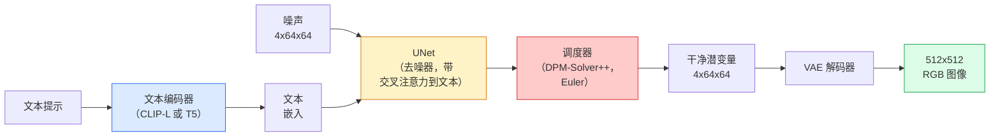

# Stable Diffusion——架构与微调

> Stable Diffusion 是一个在预训练 VAE 的潜空间中运行的 DDPM，通过交叉注意力以文本为条件，用快速确定性 ODE 求解器采样，并由无分类器引导控制。

**类型：** 学习 + 使用
**语言：** Python
**前置知识：** 第四阶段第10课（扩散模型），第七阶段第02课（自注意力）
**时间：** ~75分钟

## 学习目标

- 追溯 Stable Diffusion 流水线的五个部分：VAE、文本编码器、U-Net、调度器、安全检查器——以及每个部分实际做什么
- 解释潜空间扩散，以及为什么在 4x64x64 的潜空间（而非 3x512x512 的图像）中训练将计算量减少 48 倍而不损失质量
- 使用 `diffusers` 生成图像、运行图像到图像、修补和 ControlNet 引导的生成
- 在小型自定义数据集上用 LoRA 微调 Stable Diffusion，并在推理时加载 LoRA 适配器

## 问题

直接在 512x512 RGB 图像上训练 DDPM 很昂贵。每个训练步骤通过一个看到 3x512x512 = 786,432 个输入值的 U-Net 进行反向传播，而采样需要同一 U-Net 的 50+ 次前向传播。在 Stable Diffusion 1.5（2022 年发布）的质量水平上，像素空间扩散大约需要 256 GPU 月的训练，在消费级 GPU 上每张图像需要 10-30 秒。

使开放权重文本到图像实用的技巧是**潜扩散**（Rombach 等人，CVPR 2022）。训练一个将 3x512x512 图像映射到 4x64x64 潜张量并返回的 VAE，然后在该潜空间中运行扩散。计算量下降 `(3*512*512)/(4*64*64) = 48 倍`。采样从数十秒降至同一 GPU 上的不到两秒。

几乎每个现代图像生成模型——SDXL、SD3、FLUX、HunyuanDiT、Wan-Video——都是潜扩散模型，在自编码器、去噪器（U-Net 或 DiT）和文本条件上有变化。学习 Stable Diffusion 你就学会了模板。

## 概念

### 流水线



- **VAE** — 冻结的自编码器。编码器将图像转换为潜变量（用于 img2img 和训练）。解码器将潜变量转换回图像。
- **文本编码器** — CLIP 文本编码器（SD 1.x/2.x）、CLIP-L + CLIP-G（SDXL）或 T5-XXL（SD3/FLUX）。生成标记嵌入序列。
- **U-Net** — 去噪器。具有交叉注意力层，在每个分辨率级别从潜变量关注到文本嵌入。
- **调度器** — 采样算法（DDIM、Euler、DPM-Solver++）。选择 sigma，将预测的噪声混合回潜变量。
- **安全检查器** — 输出图像上可选的 NSFW/非法内容过滤器。

### 无分类器引导（CFG）

纯文本条件学习每个提示 `c` 的 `epsilon_theta(x_t, t, c)`。CFG 训练同一网络时有 10% 的时间丢弃 `c`（替换为空嵌入），得到一个同时预测条件噪声和无条件噪声的模型。在推理时：

```
eps = eps_uncond + w * (eps_cond - eps_uncond)
```

`w` 是引导尺度。`w=0` 是无条件，`w=1` 是纯条件，`w>1` 将输出推向"更以提示为条件"，代价是多样性。SD 默认是 `w=7.5`。

CFG 是文本到图像以生产质量工作的原因。没有它，提示对输出的偏置很弱；有了它，提示占主导。

### 潜空间几何

VAE 的 4 通道潜变量不仅仅是压缩图像。它是一个算术大致对应于语义编辑的流形（提示工程和插值都在这里发生），并且扩散 U-Net 已被训练将其整个建模预算花在这里。解码随机的 4x64x64 潜变量不会产生随机外观的图像——它产生垃圾，因为只有特定的潜变量子流形才能解码为有效图像。

两个后果：

1. **Img2img** = 将图像编码为潜变量，添加部分噪声，运行去噪器，解码。图像结构幸存是因为编码接近可逆；内容基于提示变化。
2. **修补** = 与 img2img 相同，但去噪器仅更新被遮罩的区域；未被遮罩的区域保持在编码的潜变量。

### U-Net 架构

SD U-Net 是第 10 课中 TinyUNet 的大版本，有三个新增：

- 在每个空间分辨率的 **Transformer 块**，包含自注意力 + 对文本嵌入的交叉注意力。
- 通过正弦编码上的 MLP 进行**时间嵌入**。
- 编码器和解码器之间匹配分辨率上的**跳跃连接**。

SD 1.5 的总参数：约 8.6 亿。SDXL：约 26 亿。FLUX：约 120 亿。参数的跳跃主要发生在注意力层。

### LoRA 微调

Stable Diffusion 的完全微调需要 20+ GB 显存并更新 8.6 亿个参数。LoRA（低秩适应）保持基础模型冻结，并向注意力层注入小的秩分解矩阵。用于 SD 的 LoRA 适配器通常为 10-50 MB，在单张消费级 GPU 上训练 10-60 分钟，并在推理时作为即插即用修改加载。

```
原始：W_q : (d_in, d_out)   冻结
LoRA：W_q + alpha * (A @ B)   其中 A : (d_in, r)，B : (r, d_out)

r 通常为 4-32。
```

LoRA 是几乎所有社区微调的分发方式。CivitAI 和 Hugging Face 托管了数百万个。

### 你会遇到的调度器

- **DDIM** — 确定性，约 50 步，简单。
- **Euler ancestral** — 随机，30-50 步，稍具创造性的样本。
- **DPM-Solver++ 2M Karras** — 确定性，20-30 步，生产默认。
- **LCM / TCD / Turbo** — 一致性模型和蒸馏变体；1-4 步，牺牲一些质量。

交换调度器在 `diffusers` 中是一行代码更改，有时无需重新训练即可修复样本问题。

## 构建

### 第一步：文本到图像

```python
import torch
from diffusers import StableDiffusionPipeline

pipe = StableDiffusionPipeline.from_pretrained(
    "runwayml/stable-diffusion-v1-5",
    torch_dtype=torch.float16,
).to("cuda")

image = pipe(
    prompt="一只狗在东京骑滑板车，吉卜力风格",
    guidance_scale=7.5,
    num_inference_steps=25,
    generator=torch.Generator("cuda").manual_seed(42),
).images[0]
image.save("dog.png")
```

`float16` 将显存减半，无可见质量损失。默认 DPM-Solver++ 的 `num_inference_steps=25` 与 DDIM 的 `num_inference_steps=50` 质量相当。

### 第二步：交换调度器

```python
from diffusers import DPMSolverMultistepScheduler, EulerAncestralDiscreteScheduler

pipe.scheduler = DPMSolverMultistepScheduler.from_config(pipe.scheduler.config)
pipe.scheduler = EulerAncestralDiscreteScheduler.from_config(pipe.scheduler.config)
```

调度器状态与 U-Net 权重解耦。你可以用 DDPM 训练，用任何调度器采样。

### 第三步：图像到图像

```python
from diffusers import StableDiffusionImg2ImgPipeline
from PIL import Image

img2img = StableDiffusionImg2ImgPipeline.from_pretrained(
    "runwayml/stable-diffusion-v1-5",
    torch_dtype=torch.float16,
).to("cuda")

init_image = Image.open("dog.png").convert("RGB").resize((512, 512))
out = img2img(
    prompt="一只骑滑板车的狗，油画",
    image=init_image,
    strength=0.6,
    guidance_scale=7.5,
).images[0]
```

`strength` 是在去噪前添加多少噪声（0.0 = 不变，1.0 = 完全重新生成）。0.5-0.7 是风格转换的标准范围。

### 第四步：修补

```python
from diffusers import StableDiffusionInpaintPipeline

inpaint = StableDiffusionInpaintPipeline.from_pretrained(
    "runwayml/stable-diffusion-inpainting",
    torch_dtype=torch.float16,
).to("cuda")

image = Image.open("dog.png").convert("RGB").resize((512, 512))
mask = Image.open("dog_mask.png").convert("L").resize((512, 512))

out = inpaint(
    prompt="一只猫",
    image=image,
    mask_image=mask,
    guidance_scale=7.5,
).images[0]
```

遮罩中的白色像素是要重新生成的区域。黑色像素被保留。

### 第五步：LoRA 加载

```python
pipe.load_lora_weights("sayakpaul/sd-lora-ghibli")
pipe.fuse_lora(lora_scale=0.8)

image = pipe(prompt="一个吉卜力风格的村庄广场").images[0]
```

`lora_scale` 控制强度；0.0 = 无效果，1.0 = 完全效果。`fuse_lora` 将适配器原地烘焙到权重中以提高速度，但阻止了交换。在加载不同适配器之前调用 `pipe.unfuse_lora()`。

### 第六步：LoRA 训练（大纲）

真正的 LoRA 训练在 `peft` 或 `diffusers.training` 中。概述：

```python
# 伪代码
for step, batch in enumerate(dataloader):
    images, prompts = batch
    latents = vae.encode(images).latent_dist.sample() * 0.18215

    t = torch.randint(0, num_train_timesteps, (batch_size,))
    noise = torch.randn_like(latents)
    noisy_latents = scheduler.add_noise(latents, noise, t)

    text_emb = text_encoder(tokenizer(prompts))

    pred_noise = unet(noisy_latents, t, text_emb)  # LoRA 权重在此注入

    loss = F.mse_loss(pred_noise, noise)
    loss.backward()
    optimizer.step()
```

只有 LoRA 矩阵接收梯度；基础的 U-Net、VAE 和文本编码器被冻结。使用批次大小为 1 和梯度检查点时，这可以放入 8 GB 显存。

## 使用

在生产中，你实际做的决策：

- **模型家族**：SD 1.5 用于开源社区微调，SDXL 用于更高保真度，SD3/FLUX 用于最先进质量和严格的许可要求。
- **调度器**：DPM-Solver++ 2M Karras 用于 20-30 步，LCM-LoRA 用于延迟低于 1 秒。
- **精度**：在 4080/4090 上用 `float16`，在 A100 及更新上用 `bfloat16`，显存紧张时用 `int8`（通过 `bitsandbytes` 或 `compel`）。
- **条件**：纯文本有效；需要更强控制时，在基础流水线之上添加 ControlNet（canny、深度、姿态）。

对于批量生成，`AUTO1111` / `ComfyUI` 是社区工具；对于生产 API，使用 `diffusers` + `accelerate` 或带有 TensorRT 编译的 `optimum-nvidia`。

## 交付

本课产出：

- `outputs/prompt-sd-pipeline-planner.md` — 一个提示词，根据延迟预算、保真度目标和许可约束选择 SD 1.5 / SDXL / SD3 / FLUX 及调度器和精度。
- `outputs/skill-lora-training-setup.md` — 一个技能，为自定义数据集编写完整的 LoRA 训练配置，包括标题、秩、批次大小和学习率。

## 练习

1. **（简单）** 用 `guidance_scale` 在 `[1, 3, 5, 7.5, 10, 15]` 中生成相同提示。描述图像如何变化。在什么引导值下出现伪影？
2. **（中等）** 取任何真实照片，以 `strength` 在 `[0.2, 0.4, 0.6, 0.8, 1.0]` 下通过 `StableDiffusionImg2ImgPipeline` 运行。哪个强度保持构图同时改变风格？为什么 1.0 完全忽略输入？
3. **（困难）** 在 10-20 张单一主体（宠物、标志、角色）的图像上训练 LoRA，并用该主体生成新颖场景。报告产生最佳身份保持而不过拟合到输入图像的 LoRA 秩和训练步数。

## 关键术语

| 术语 | 人们说的 | 实际含义 |
|------|----------------|----------------------|
| 潜扩散 | "在潜空间中扩散" | 在 VAE 潜空间（4x64x64）而非像素空间（3x512x512）中运行整个 DDPM；节省 48 倍计算 |
| VAE 缩放因子 | "0.18215" | 将 VAE 的原始潜变量重新缩放到大致单位方差的常数；在每个 SD 流水线中硬编码 |
| 无分类器引导 | "CFG" | 混合条件和无条件噪声预测；影响最大的单一推理旋钮 |
| 调度器 | "采样器" | 将噪声 + 模型预测转换为去噪潜变量轨迹的算法 |
| LoRA | "低秩适配器" | 微调注意力层而不触及基础权重的小秩分解矩阵 |
| 交叉注意力 | "文本-图像注意力" | 从潜变量标记到文本标记的注意力；在每个 U-Net 级别注入提示信息 |
| ControlNet | "结构条件" | 一个单独训练的适配器，用额外输入（canny、深度、姿态、分割）引导 SD |
| DPM-Solver++ | "默认调度器" | 二阶确定性 ODE 求解器；在 2026 年低步数（20-30）下质量最佳 |

## 延伸阅读

- [High-Resolution Image Synthesis with Latent Diffusion (Rombach et al., 2022)](https://arxiv.org/abs/2112.10752) — Stable Diffusion 论文；包括证明设计合理性的每项消融实验
- [Classifier-Free Diffusion Guidance (Ho & Salimans, 2022)](https://arxiv.org/abs/2207.12598) — CFG 论文
- [LoRA: Low-Rank Adaptation of Large Language Models (Hu et al., 2021)](https://arxiv.org/abs/2106.09685) — LoRA 首先是用于 NLP；几乎无需更改即可迁移到 SD
- [diffusers documentation](https://huggingface.co/docs/diffusers) — 每个 SD / SDXL / SD3 / FLUX 流水线的参考
