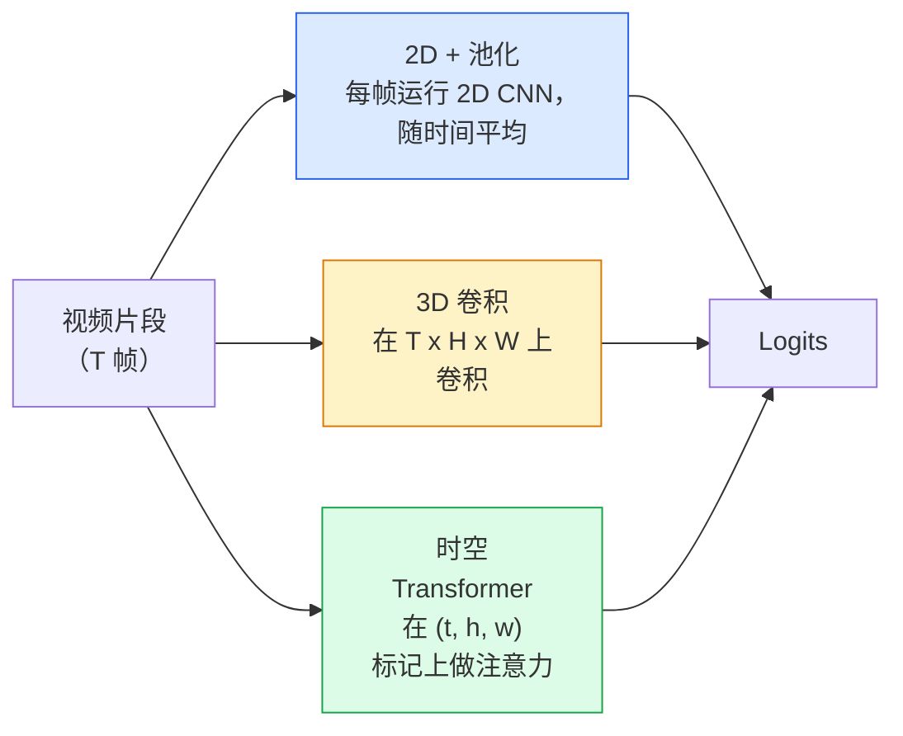

# 视频理解——时间建模

> 视频是一个图像序列加上连接它们的物理规律。每个视频模型要么将时间视为额外轴（3D 卷积）、一个要关注的序列（Transformer），要么是一个要提取一次并池化的特征（2D+池化）。

**类型：** 学习 + 构建
**语言：** Python
**前置知识：** 第四阶段第03课（CNN），第四阶段第04课（图像分类）
**时间：** ~45分钟

## 学习目标

- 区分三种主要视频建模方法（2D+池化、3D 卷积、时空 Transformer），并预测它们的成本和准确率权衡
- 在 PyTorch 中实现帧采样、时间池化和一个 2D+池化基线分类器
- 解释为什么 I3D 的"膨胀"3D 核能很好地从 ImageNet 权重迁移，以及因式分解的 (2+1)D 卷积有什么不同
- 读取标准动作识别数据集和指标：Kinetics-400/600、UCF101、Something-Something V2；片段级和视频级的 top-1 准确率

## 问题

30 秒的视频以 30 fps 是 900 帧。简单来说，视频分类就是运行 900 次图像分类然后进行某种聚合。当动作几乎在每帧中可见时（体育、烹饪、锻炼视频），这有效；当动作由运动本身定义时则完全失败："把东西从左推到右"在每一帧中看起来都像两个静止物体。

每个视频架构的核心问题是：时间结构何时被建模，以及如何建模？答案驱动其他一切——计算成本、预训练策略、是否可以重用 ImageNet 权重、模型在哪些数据集上训练。

本课刻意比静态图像课短。核心图像机制已经到位，视频理解主要是关于时间的故事：采样、建模和聚合。

## 概念

### 三个架构家族



### 2D + 池化

取一个 2D CNN（ResNet、EfficientNet、ViT）。在每个采样帧上独立运行它。平均（或最大池化、或注意力池化）逐帧嵌入。将池化后的向量馈送到分类器。

优点：
- ImageNet 预训练直接迁移。
- 实现最简单。
- 便宜：T 帧 * 单图像推理成本。

缺点：
- 无法建模运动。动作 = 外观的聚合。
- 时间池化与顺序无关；"开门"和"关门"看起来一样。

何时使用：外观密集型任务、小视频数据集上的迁移学习、初始基线。

### 3D 卷积

将 2D（H, W）核替换为 3D（T, H, W）核。网络在空间和时间上卷积。早期家族：C3D、I3D、SlowFast。

I3D 技巧：取预训练的 2D ImageNet 模型，沿着新时间轴复制每个 2D 核来"膨胀"它。3x3 的 2D 卷积变成 3x3x3 的 3D 卷积。这为 3D 模型提供了强大的预训练权重，而不是从头训练。

优点：
- 直接建模运动。
- I3D 膨胀提供免费迁移学习。

缺点：
- 比对应的 2D 模型多 T/8 的 FLOPs（对于堆叠 3 次的时间核为 3）。
- 时间核小；长程运动需要金字塔或双流方法。

何时使用：动作是信号的动作识别（Something-Something V2、具有运动密集型类别的 Kinetics）。

### 时空 Transformer

将视频标记化为时空块网格，并关注所有块。TimeSformer、ViViT、Video Swin、VideoMAE。

重要的注意力模式：
- **联合** — 在 (t, h, w) 上的一次大注意力。在 `T*H*W` 上是二次的；昂贵。
- **分割** — 每块两次注意力：一次在时间上，一次在空间上。近似线性缩放。
- **因式分解** — 时间注意力和空间注意力在块间交替。

优点：
- 在每个主要基准上的 SOTA 准确率。
- 通过块膨胀从图像 Transformer（ViT）迁移。
- 通过稀疏注意力支持长上下文视频。

缺点：
- 计算密集。
- 需要小心选择注意力模式，否则运行时膨胀。

何时使用：大数据集、高保真视频理解、多模态视频+文本任务。

### 帧采样

10 秒片段以 30 fps 有 300 帧；将所有 300 帧馈送给任何模型都是浪费。标准策略：

- **均匀采样** — 在整个片段中均匀选择 T 帧。2D+池化的默认选择。
- **密集采样** — 随机连续 T 帧窗口。3D 卷积常用，因为运动需要相邻帧。
- **多片段** — 从同一视频采样多个 T 帧窗口，分别分类，在测试时平均预测。

T 通常为 8、16、32 或 64。更大的 T = 更多的时间信号，但更多的计算。

### 评估

两个级别：
- **片段级准确率** — 模型看到一个 T 帧片段，报告 top-k。
- **视频级准确率** — 在多个片段上平均片段级预测；更高且更稳定。

始终报告两者。得分 78% 片段/82% 视频的模型严重依赖测试时平均；得分 80%/81% 的模型每个片段更鲁棒。

### 你会遇到的数据集

- **Kinetics-400 / 600 / 700** — 通用动作数据集。40 万个片段；YouTube URL（许多已失效）。
- **Something-Something V2** — 运动定义的动作（"将 X 从左移到右"）。无法被 2D+池化解决。
- **UCF-101**、**HMDB-51** — 更旧、更小，但仍被报告。
- **AVA** — 空间和时间中的动作*定位*；比分类更难。

## 构建

### 第一步：帧采样器

在帧列表（或视频张量）上工作的均匀和密集采样器。

```python
import numpy as np

def sample_uniform(num_frames_total, T):
    if num_frames_total <= T:
        return list(range(num_frames_total)) + [num_frames_total - 1] * (T - num_frames_total)
    step = num_frames_total / T
    return [int(i * step) for i in range(T)]


def sample_dense(num_frames_total, T, rng=None):
    rng = rng or np.random.default_rng()
    if num_frames_total <= T:
        return list(range(num_frames_total)) + [num_frames_total - 1] * (T - num_frames_total)
    start = int(rng.integers(0, num_frames_total - T + 1))
    return list(range(start, start + T))
```

两者都返回你用来切片视频张量的 `T` 个索引。

### 第二步：2D+池化基线

在每帧上运行 2D ResNet-18，平均池化特征，分类。

```python
import torch
import torch.nn as nn
from torchvision.models import resnet18, ResNet18_Weights

class FramePool(nn.Module):
    def __init__(self, num_classes=400, pretrained=True):
        super().__init__()
        weights = ResNet18_Weights.IMAGENET1K_V1 if pretrained else None
        backbone = resnet18(weights=weights)
        self.features = nn.Sequential(*(list(backbone.children())[:-1]))
        self.head = nn.Linear(512, num_classes)

    def forward(self, x):
        # x: (N, T, 3, H, W)
        N, T = x.shape[:2]
        x = x.view(N * T, *x.shape[2:])
        feats = self.features(x).view(N, T, -1)
        pooled = feats.mean(dim=1)
        return self.head(pooled)

model = FramePool(num_classes=10)
x = torch.randn(2, 8, 3, 224, 224)
print(f"输出: {model(x).shape}")
print(f"参数: {sum(p.numel() for p in model.parameters()):,}")
```

1100 万个参数，ImageNet 预训练，逐帧运行，平均，分类。在外观密集型任务上，这个基线通常在正确 3D 模型的 5-10 个点以内——有时更好，因为它重用了更强的 ImageNet 骨干。

### 第三步：I3D 风格的膨胀 3D 卷积

通过沿新时间轴重复权重，将单个 2D 卷积转换为 3D 卷积。

```python
def inflate_2d_to_3d(conv2d, time_kernel=3):
    out_c, in_c, kh, kw = conv2d.weight.shape
    weight_3d = conv2d.weight.data.unsqueeze(2)
    weight_3d = weight_3d.repeat(1, 1, time_kernel, 1, 1) / time_kernel
    conv3d = nn.Conv3d(in_c, out_c, kernel_size=(time_kernel, kh, kw),
                        padding=(time_kernel // 2, conv2d.padding[0], conv2d.padding[1]),
                        stride=(1, conv2d.stride[0], conv2d.stride[1]),
                        bias=False)
    conv3d.weight.data = weight_3d
    return conv3d

conv2d = nn.Conv2d(3, 64, kernel_size=3, padding=1, bias=False)
conv3d = inflate_2d_to_3d(conv2d, time_kernel=3)
print(f"2D 权重形状:  {tuple(conv2d.weight.shape)}")
print(f"3D 权重形状:  {tuple(conv3d.weight.shape)}")
x = torch.randn(1, 3, 8, 56, 56)
print(f"3D 输出形状:  {tuple(conv3d(x).shape)}")
```

除以 `time_kernel` 保持激活幅度大致恒定——对于不在第一次前向传播破坏批归一化统计量很重要。

### 第四步：因式分解 (2+1)D 卷积

将 3D 卷积拆分为 2D（空间）和 1D（时间）卷积。相同感受野，更少参数，在某些基准上准确率更好。

```python
class Conv2Plus1D(nn.Module):
    def __init__(self, in_c, out_c, kernel_size=3):
        super().__init__()
        mid_c = (in_c * out_c * kernel_size * kernel_size * kernel_size) \
                // (in_c * kernel_size * kernel_size + out_c * kernel_size)
        self.spatial = nn.Conv3d(in_c, mid_c, kernel_size=(1, kernel_size, kernel_size),
                                 padding=(0, kernel_size // 2, kernel_size // 2), bias=False)
        self.bn = nn.BatchNorm3d(mid_c)
        self.act = nn.ReLU(inplace=True)
        self.temporal = nn.Conv3d(mid_c, out_c, kernel_size=(kernel_size, 1, 1),
                                  padding=(kernel_size // 2, 0, 0), bias=False)

    def forward(self, x):
        return self.temporal(self.act(self.bn(self.spatial(x))))

c = Conv2Plus1D(3, 64)
x = torch.randn(1, 3, 8, 56, 56)
print(f"(2+1)D 输出: {tuple(c(x).shape)}")
```

完整的 R(2+1)D 网络与 ResNet-18 相同，只是每个 3x3 卷积被替换为 `Conv2Plus1D`。

## 使用

两个库涵盖了生产视频工作：

- `torchvision.models.video` — R(2+1)D、MViT、Swin3D，带有预训练的 Kinetics 权重。API 与图像模型相同。
- `pytorchvideo`（Meta）— 模型动物园、用于 Kinetics / SSv2 / AVA 的数据加载器、标准变换。

对于视觉-语言视频模型（视频描述、视频问答），使用 `transformers`（`VideoMAE`、`VideoLLaMA`、`InternVideo`）。

## 交付

本课产出：

- `outputs/prompt-video-architecture-picker.md` — 一个提示词，根据外观 vs 运动、数据集大小和计算预算选择 2D+池化 / I3D / (2+1)D / Transformer。
- `outputs/skill-frame-sampler-auditor.md` — 一个技能，检查视频流水线的采样器并标记常见错误：差一错误、当 `num_frames < T` 时不均匀采样、缺乏保持宽高比的裁剪等。

## 练习

1. **（简单）** 计算 T=8 的 FramePool 与 I3D 风格 3D ResNet（T=8）的近似 FLOPs。证明为什么 2D+池化便宜 3-5 倍。
2. **（中等）** 生成合成视频数据集：向随机方向移动的随机球，按运动方向标注（"从左到右"、"从右到左"、"对角向上"）。在上面训练 FramePool。展示它达到接近随机准确率，证明仅外观不足以完成运动任务。
3. **（困难）** 通过将 ResNet-18 中的每个 Conv2d 替换为 `Conv2Plus1D` 来构建 R(2+1)D-18。从 ImageNet 预训练的 ResNet-18 膨胀第一个卷积的权重。在练习 2 的运动数据集上训练并击败 FramePool。

## 关键术语

| 术语 | 人们说的 | 实际含义 |
|------|----------------|----------------------|
| 2D + 池化 | "逐帧分类器" | 在每个采样帧上运行 2D CNN，跨时间平均池化特征，分类 |
| 3D 卷积 | "时空核" | 在 (T, H, W) 上卷积的核；可以原生建模运动 |
| 膨胀 | "将 2D 权重提升到 3D" | 通过沿新时间轴复制 2D 卷积的权重来初始化 3D 卷积权重，然后除以 kernel_T 以保持激活尺度 |
| (2+1)D | "因式分解卷积" | 将 3D 拆分为 2D 空间 + 1D 时间；更少参数，中间有额外非线性 |
| 分割注意力 | "时间然后空间" | Transformer 块，每层有两个注意力：一个关注同帧的标记，一个关注同位置的标记 |
| 片段 | "T 帧窗口" | T 帧的采样子序列；视频模型消耗的单位 |
| 片段 vs 视频准确率 | "两种评估设置" | 片段 = 每个视频一个样本，视频 = 跨多个采样片段的平均值 |
| Kinetics | "视频的 ImageNet" | 400-700 个动作类别，30 万+ YouTube 片段，标准视频预训练语料库 |

## 延伸阅读

- [I3D: Quo Vadis, Action Recognition (Carreira & Zisserman, 2017)](https://arxiv.org/abs/1705.07750) — 引入膨胀和 Kinetics 数据集
- [R(2+1)D: A Closer Look at Spatiotemporal Convolutions (Tran et al., 2018)](https://arxiv.org/abs/1711.11248) — 因式分解卷积，仍是一个强基线
- [TimeSformer: Is Space-Time Attention All You Need? (Bertasius et al., 2021)](https://arxiv.org/abs/2102.05095) — 第一个强视频 Transformer
- [VideoMAE (Tong et al., 2022)](https://arxiv.org/abs/2203.12602) — 视频的掩码自编码器预训练；当前主导预训练配方
