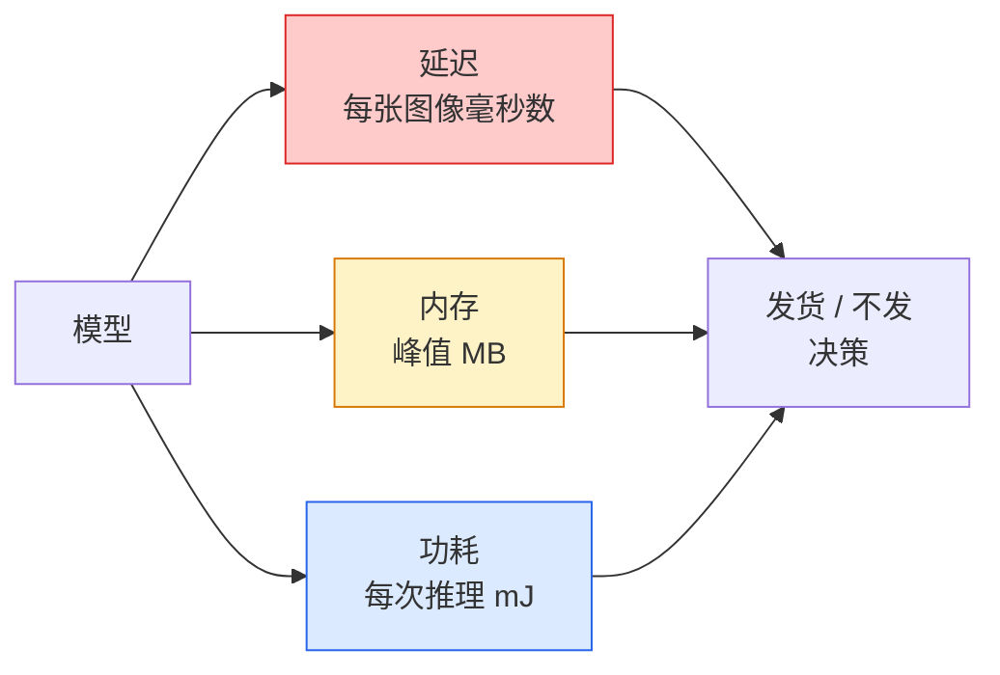

# 实时视觉——边缘部署

> 边缘推理是让一个 90% 准确率的模型在 2 GB 内存的设备上以 30 fps 运行的学科。每个百分点的准确率都用毫秒的延迟来交换。

**类型：** 学习 + 构建
**语言：** Python
**前置知识：** 第四阶段第04课（图像分类），第十阶段第11课（量化）
**时间：** ~75分钟

## 学习目标

- 测量任何 PyTorch 模型的推理延迟、峰值内存和吞吐量，并理解 FLOPs / 参数 / 延迟之间的权衡
- 使用 PyTorch 的训练后量化将视觉模型量化为 INT8，并验证准确率损失 < 1%
- 导出为 ONNX 并使用 ONNX Runtime 或 TensorRT 编译；指出三种最常见的导出失败及其修复方法
- 说明在边缘约束下何时选择 MobileNetV3、EfficientNet-Lite、ConvNeXt-Tiny 或 MobileViT

## 问题

训练时的视觉模型是一个浮点怪物。1 亿参数，每次前向传播 10 GFLOPs，2 GB 显存。这些没有一个能放在手机、汽车信息娱乐单元、工业相机或无人机上。部署视觉系统意味着将相同的预测适配到一个小 100 倍的预算中。

三个旋钮完成了大部分工作：模型选择（使用相同方法的更小架构）、量化（INT8 替代 FP32）和推理运行时（ONNX Runtime、TensorRT、Core ML、TFLite）。正确使用它们就是工作台上的演示与在 30 美元相机模块上发货的产品之间的区别。

本课首先建立测量规范（你无法优化你无法测量的东西），然后讲解三个旋钮。目标不是学习每个边缘运行时，而是知道有哪些杠杆存在以及如何验证每个杠杆是否按预期工作。

## 概念

### 三个预算



- **延迟**：p50、p95、p99。只平均 p50 会隐藏对实时系统重要的尾部行为。
- **峰值内存**：设备曾经看到的最大值，而不是稳态平均值。重要，因为 OOM 在嵌入式目标上是致命的。
- **功耗 / 能耗**：在电池供电设备上每次推理的毫焦耳数。通常通过 CPU/GPU 利用率 * 时间来代理。

一张（模型、延迟、内存、准确率）表格是进行边缘决策的依据。每个单元格都在目标设备上测量，而不是在工作站上。

### 测量规范

每个边缘分析应遵循三条规则：

1. **预热**模型 5-10 次伪前向传播后再测量。冷缓存和 JIT 编译会产生不具代表性的初始数字。
2. **同步** GPU 工作负载，在计时块前后调用 `torch.cuda.synchronize()`。没有这个，你测量的是内核调度时间，而不是内核执行时间。
3. **固定输入大小**为生产分辨率。224x224 上的延迟不是 512x512 上的延迟。

### FLOPs 作为代理

FLOPs（每次推理的浮点运算次数）是一个廉价的、与设备无关的延迟代理。对架构比较有用，作为绝对墙上时钟时间则具有误导性。一个 FLOPs 多 10% 的模型在实践中可能快 2 倍，因为它使用了硬件友好的操作（深度可分离卷积编译效果好，大的 7x7 卷积则不然）。

规则：FLOPs 用于架构搜索，设备上延迟用于部署决策。

### 量化（一段话）

用 INT8 替换 FP32 的权重和激活。模型大小下降 4 倍，内存带宽下降 4 倍，在具有 INT8 内核的硬件上计算量下降 2-4 倍（每个现代移动 SoC，每个具有 Tensor Core 的 NVIDIA GPU）。视觉任务的准确率损失通常为 0.1-1 个百分点，使用训练后静态量化即可。

类型：

- **动态** — 权重量化为 INT8，激活以 FP 计算。简单，加速幅度小。
- **静态（训练后）** — 量化权重 + 在小标定集上标定激活范围。比动态快得多。
- **量化感知训练（QAT）** — 在训练期间模拟量化，使模型学会适应。准确率最佳，需要标注数据。

对于视觉，训练后静态量化提供了 95% 的收益，只需 5% 的工作量。只有当 PTQ 的准确率损失不可接受时才使用 QAT。

### 剪枝与蒸馏

- **剪枝** — 移除不重要的权重（幅度基础）或通道（结构化）。在过参数化的模型上效果良好；对已经紧凑的架构作用较小。
- **蒸馏** — 训练一个小学生模型模仿大教师模型的 logits。通常可以恢复通过缩小模型损失的大部分准确率。生产边缘模型的标准做法。

### 推理运行时

- **PyTorch eager** — 慢，不用于部署。仅用于开发。
- **TorchScript** — 遗留。已被 `torch.compile` 和 ONNX 导出取代。
- **ONNX Runtime** — 中立运行时。CPU、CUDA、CoreML、TensorRT、OpenVINO 都有 ONNX 提供商。从这里开始。
- **TensorRT** — NVIDIA 的编译器。在 NVIDIA GPU（工作站和 Jetson）上延迟最低。与 ONNX Runtime 集成或独立使用。
- **Core ML** — Apple 的 iOS/macOS 运行时。需要 `.mlmodel` 或 `.mlpackage`。
- **TFLite** — Google 的 Android/ARM 运行时。需要 `.tflite`。
- **OpenVINO** — Intel 的 CPU/VPU 运行时。需要 `.xml` + `.bin`。

实践中：导出 PyTorch -> ONNX -> 为目标选择运行时。ONNX 是通用语言。

### 边缘架构选择器

| 预算 | 模型 | 原因 |
|--------|-------|------|
| < 300 万参数 | MobileNetV3-Small | 到处都能编译，良好的基线 |
| 300-1000 万 | EfficientNet-Lite-B0 | TFLite 上每参数准确率最佳 |
| 1000-2000 万 | ConvNeXt-Tiny | 每参数准确率最佳，CPU 友好 |
| 2000-3000 万 | MobileViT-S 或 EfficientViT | 具有 ImageNet 准确率的 Transformer |
| 3000-8000 万 | Swin-V2-Tiny | 如果堆栈支持窗口注意力 |

除非有特殊原因，否则将所有模型量化为 INT8。

```figure
cnn-param-count
```

## 构建

### 第一步：正确测量延迟

```python
import time
import torch

def measure_latency(model, input_shape, device="cpu", warmup=10, iters=50):
    model = model.to(device).eval()
    x = torch.randn(input_shape, device=device)
    with torch.no_grad():
        for _ in range(warmup):
            model(x)
        if device == "cuda":
            torch.cuda.synchronize()
        times = []
        for _ in range(iters):
            if device == "cuda":
                torch.cuda.synchronize()
            t0 = time.perf_counter()
            model(x)
            if device == "cuda":
                torch.cuda.synchronize()
            times.append((time.perf_counter() - t0) * 1000)
    times.sort()
    return {
        "p50_ms": times[len(times) // 2],
        "p95_ms": times[int(len(times) * 0.95)],
        "p99_ms": times[int(len(times) * 0.99)],
        "mean_ms": sum(times) / len(times),
    }
```

预热、同步、使用 `time.perf_counter()`。报告百分位数，而不仅仅是均值。

### 第二步：参数和 FLOP 计数

```python
def parameter_count(model):
    return sum(p.numel() for p in model.parameters())

def flops_estimate(model, input_shape):
    """
    仅对卷积/线性模型的粗略 FLOP 计数。生产中使用 `fvcore` 或 `ptflops`。
    """
    total = 0
    def conv_hook(m, inp, out):
        nonlocal total
        c_out, c_in, kh, kw = m.weight.shape
        h, w = out.shape[-2:]
        total += 2 * c_in * c_out * kh * kw * h * w
    def linear_hook(m, inp, out):
        nonlocal total
        total += 2 * m.in_features * m.out_features
    hooks = []
    for m in model.modules():
        if isinstance(m, torch.nn.Conv2d):
            hooks.append(m.register_forward_hook(conv_hook))
        elif isinstance(m, torch.nn.Linear):
            hooks.append(m.register_forward_hook(linear_hook))
    model.eval()
    with torch.no_grad():
        model(torch.randn(input_shape))
    for h in hooks:
        h.remove()
    return total
```

对于真实项目，使用 `fvcore.nn.FlopCountAnalysis` 或 `ptflops`；它们能正确处理每种模块类型。

### 第三步：训练后静态量化

```python
def quantise_ptq(model, calibration_loader, backend="x86"):
    import torch.ao.quantization as tq
    model = model.eval().cpu()
    model.qconfig = tq.get_default_qconfig(backend)
    tq.prepare(model, inplace=True)
    with torch.no_grad():
        for x, _ in calibration_loader:
            model(x)
    tq.convert(model, inplace=True)
    return model
```

三个步骤：配置、准备（插入观察器）、使用真实数据标定、转换（融合 + 量化）。要求模型已融合（`Conv -> BN -> ReLU` -> `ConvBnReLU`），由 `torch.ao.quantization.fuse_modules` 处理。

### 第四步：导出为 ONNX

```python
def export_onnx(model, sample_input, path="model.onnx"):
    model = model.eval()
    torch.onnx.export(
        model,
        sample_input,
        path,
        input_names=["input"],
        output_names=["output"],
        dynamic_axes={"input": {0: "batch"}, "output": {0: "batch"}},
        opset_version=17,
    )
    return path
```

`opset_version=17` 是 2026 年的安全默认值。`dynamic_axes` 允许你以任意批次大小运行 ONNX 模型。

### 第五步：基准测试和比较方案

```python
import torch.nn as nn
from torchvision.models import mobilenet_v3_small

def compare_regimes():
    model = mobilenet_v3_small(weights=None, num_classes=10)
    params = parameter_count(model)
    flops = flops_estimate(model, (1, 3, 224, 224))
    lat_fp32 = measure_latency(model, (1, 3, 224, 224), device="cpu")
    print(f"FP32 MobileNetV3-Small: {params:,} params  {flops/1e9:.2f} GFLOPs  "
          f"p50={lat_fp32['p50_ms']:.2f}ms  p95={lat_fp32['p95_ms']:.2f}ms")
```

对 `resnet50`、`efficientnet_v2_s` 和 `convnext_tiny` 运行相同函数，你就得到了部署决策所需的比较表。

## 使用

生产堆栈通常收敛到以下三种路径之一：

- **Web / 无服务器**：PyTorch -> ONNX -> ONNX Runtime（CPU 或 CUDA 提供商）。最简单，对大多数场景足够。
- **NVIDIA 边缘（Jetson、GPU 服务器）**：PyTorch -> ONNX -> TensorRT。延迟最低，工程投入最大。
- **移动端**：PyTorch -> ONNX -> Core ML（iOS）或 TFLite（Android）。在导出前量化。

对于测量，使用 `torch-tb-profiler`、`nvprof` / `nsys` 和 macOS 上的 Instruments 进行逐层分析。`benchmark_app`（OpenVINO）和 `trtexec`（TensorRT）提供独立的 CLI 数字。

## 交付

本课产出：

- `outputs/prompt-edge-deployment-planner.md` — 一个提示词，根据目标设备和延迟 SLA 选择骨干网络、量化策略和运行时。
- `outputs/skill-latency-profiler.md` — 一个技能，编写完整的延迟基准测试脚本，包括预热、同步、百分位数和内存跟踪。

## 练习

1. **（简单）** 在 CPU 上以 224x224 测量 `resnet18`、`mobilenet_v3_small`、`efficientnet_v2_s` 和 `convnext_tiny` 的 p50 延迟。报告表格并确定哪个架构具有最佳的每毫秒准确率。
2. **（中等）** 对 `mobilenet_v3_small` 应用训练后静态量化。报告 FP32 与 INT8 的延迟以及在 CIFAR-10 或类似数据集保留子集上的准确率损失。
3. **（困难）** 将 `convnext_tiny` 导出为 ONNX，通过 `onnxruntime` 的 `CPUExecutionProvider` 运行，并与 PyTorch eager 基线的延迟进行比较。确定 ONNX Runtime 比 PyTorch 更快的第一个层并解释原因。

## 关键术语

| 术语 | 人们说的 | 实际含义 |
|------|----------------|----------------------|
| 延迟 | "多快" | 从输入到输出的时间；p50/p95/p99 百分位数，而非均值 |
| FLOPs | "模型大小" | 每次前向传播的浮点运算次数；计算成本的粗略代理 |
| INT8 量化 | "8 位" | 用 8 位整数替换 FP32 权重/激活；约小 4 倍，快 2-4 倍 |
| PTQ | "训练后量化" | 量化已训练模型而无需重新训练；简单，通常足够 |
| QAT | "量化感知训练" | 在训练期间模拟量化；准确率最佳，需要标注数据 |
| ONNX | "中立格式" | 每个主流推理运行时都支持的模型交换格式 |
| TensorRT | "NVIDIA 编译器" | 将 ONNX 编译为针对 NVIDIA GPU 优化的引擎 |
| 蒸馏 | "教师 -> 学生" | 训练小型模型模仿大型模型的 logits；恢复大部分丢失的准确率 |

## 延伸阅读

- [EfficientNet (Tan & Le, 2019)](https://arxiv.org/abs/1905.11946) — 高效架构的复合缩放
- [MobileNetV3 (Howard et al., 2019)](https://arxiv.org/abs/1905.02244) — 移动优先架构，带 h-swish 和 squeeze-excite
- [A Practical Guide to TensorRT Optimization (NVIDIA)](https://developer.nvidia.com/blog/accelerating-model-inference-with-tensorrt-tips-and-best-practices-for-pytorch-users/) — 如何真正达到论文中的吞吐量数字
- [ONNX Runtime docs](https://onnxruntime.ai/docs/) — 量化、图优化、提供商选择
