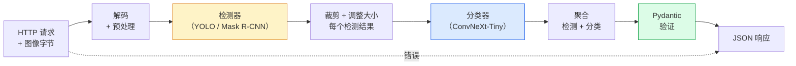

# 构建完整视觉流水线——综合实践

> 生产级视觉系统是由模型和规则链接而成的链条，通过数据契约串联。本阶段的各个组件已经就位；综合实践将它们端到端地连接起来。

**类型：** 构建
**语言：** Python
**前置知识：** 第四阶段第01-15课
**时间：** ~120分钟

## 学习目标

- 设计一个生产级视觉流水线，能够检测目标、分类目标并输出结构化 JSON——处理所有失败路径
- 将检测器（Mask R-CNN 或 YOLO）、分类器（ConvNeXt-Tiny）和数据契约（Pydantic）接入一个服务
- 对端到端流水线进行基准测试，并识别第一个瓶颈（通常是预处理，然后是检测器）
- 部署一个最小化的 FastAPI 服务，接受图像上传，运行流水线，返回带有分类结果的检测输出

## 问题

单独的视觉模型很有用；视觉产品是链式模型。零售货架审计是一个检测器加上一个产品分类器再加上一个价格 OCR 流水线。自动驾驶是一个 2D 检测器加上一个 3D 检测器加上一个分割器加上一个跟踪器再加上一个规划器。医疗预筛查是一个分割器加上一个区域分类器再加上一个临床医生界面。

将这些链条连接起来，是区分 ML 原型和产品的关键。模型之间的每个接口都是新 bug 的温床。每个坐标变换、每个归一化、每个遮罩调整大小都是静默失败的候选者。一个流水线的强度取决于其最薄弱的接口。

这个综合实践搭建了最小可行流水线：检测 + 分类 + 结构化输出 + 服务层。第四阶段中的其他一切都可以插入到这个骨架中：将 Mask R-CNN 替换为 YOLOv8，添加 OCR 头，添加分割分支，添加跟踪器。架构是稳定的；组件是可插拔的。

## 概念

### 流水线



七个阶段。两个模型阶段比较昂贵；其他五个阶段是 bug 经常出没的地方。

### 使用 Pydantic 的数据契约

每个模型边界都变成一个类型化对象。这会将静默失败变成显式失败。

```
Detection(
    box: tuple[float, float, float, float],   # (x1, y1, x2, y2)，绝对像素
    score: float,                              # [0, 1]
    class_id: int,                             # 来自检测器的标签映射
    mask: Optional[list[list[int]]],           # 如果存在，RLE 编码
)

PipelineResult(
    image_id: str,
    detections: list[Detection],
    classifications: list[Classification],
    inference_ms: float,
)
```

当检测器返回 `(cx, cy, w, h)` 格式的框而不是 `(x1, y1, x2, y2)` 时，Pydantic 的验证会在边界处失败，你会立即发现问题，而不是调试一个静默返回空区域的下游裁剪操作。

### 延迟分布

几乎所有视觉流水线中都有三个真理：

1. **预处理通常是最大的单个模块。** 解码 JPEG、转换色彩空间、调整大小——这些是 CPU 密集型的，容易被忽视。
2. **检测器主导 GPU 时间。** 70-90% 的 GPU 时间花在检测前向传播上。
3. **后处理（NMS、RLE 编码/解码）** 在 GPU 上很便宜，在 CPU 上很昂贵。始终在实际目标上进行性能分析。

了解分布情况是将优化转化为优先级列表的关键。

### 失败模式

- **空检测结果** — 返回空列表，不要崩溃。记录日志。
- **框超出边界** — 在裁剪前将其限制在图像尺寸内。
- **裁剪过小** — 对小于分类器最小输入的框跳过分类。
- **上传损坏** — 返回 400 响应，包含特定错误码，而不是 500。
- **模型加载失败** — 在服务启动时失败，而不是在第一次请求时。

生产流水线处理每一种情况，而不编写隐藏失败的通用 `try/except`。每个失败都有一个命名代码和一个响应。

### 批处理

生产服务为多个客户端提供服务。跨请求批处理检测和分类可以倍增吞吐量。权衡：等待批次填满带来的额外延迟。典型设置：收集请求最多 20 毫秒，一起批处理，处理，分发响应。`torchserve` 和 `triton` 原生支持此功能；负载可预测的小型服务自行实现微批处理器。

## 构建

### 第一步：数据契约

```python
from pydantic import BaseModel, Field
from typing import List, Optional, Tuple

class Detection(BaseModel):
    box: Tuple[float, float, float, float]
    score: float = Field(ge=0, le=1)
    class_id: int = Field(ge=0)
    mask_rle: Optional[str] = None


class Classification(BaseModel):
    detection_index: int
    class_id: int
    class_name: str
    score: float = Field(ge=0, le=1)


class PipelineResult(BaseModel):
    image_id: str
    detections: List[Detection]
    classifications: List[Classification]
    inference_ms: float
```

五秒钟的代码可以在任何严肃的流水线上节省一个小时的调试时间。

### 第二步：最小化的 Pipeline 类

```python
import time
import numpy as np
import torch
from PIL import Image

class VisionPipeline:
    def __init__(self, detector, classifier, class_names,
                 device="cpu", min_crop=32):
        self.detector = detector.to(device).eval()
        self.classifier = classifier.to(device).eval()
        self.class_names = class_names
        self.device = device
        self.min_crop = min_crop

    def preprocess(self, image):
        """
        image: PIL.Image 或 np.ndarray (H, W, 3) uint8
        返回：CHW 浮点张量在设备上
        """
        if isinstance(image, Image.Image):
            image = np.asarray(image.convert("RGB"))
        tensor = torch.from_numpy(image).permute(2, 0, 1).float() / 255.0
        return tensor.to(self.device)

    @torch.no_grad()
    def detect(self, image_tensor):
        return self.detector([image_tensor])[0]

    @torch.no_grad()
    def classify(self, crops):
        if len(crops) == 0:
            return []
        batch = torch.stack(crops).to(self.device)
        logits = self.classifier(batch)
        probs = logits.softmax(-1)
        scores, cls = probs.max(-1)
        return list(zip(cls.tolist(), scores.tolist()))

    def run(self, image, image_id="anonymous"):
        t0 = time.perf_counter()
        tensor = self.preprocess(image)
        det = self.detect(tensor)

        crops = []
        detections = []
        valid_indices = []
        for i, (box, score, cls) in enumerate(zip(det["boxes"], det["scores"], det["labels"])):
            x1, y1, x2, y2 = [max(0, int(b)) for b in box.tolist()]
            x2 = min(x2, tensor.shape[-1])
            y2 = min(y2, tensor.shape[-2])
            detections.append(Detection(
                box=(x1, y1, x2, y2),
                score=float(score),
                class_id=int(cls),
            ))
            if (x2 - x1) < self.min_crop or (y2 - y1) < self.min_crop:
                continue
            crop = tensor[:, y1:y2, x1:x2]
            crop = torch.nn.functional.interpolate(
                crop.unsqueeze(0),
                size=(224, 224),
                mode="bilinear",
                align_corners=False,
            )[0]
            crops.append(crop)
            valid_indices.append(i)

        class_preds = self.classify(crops)

        classifications = []
        for valid_idx, (cls_id, cls_score) in zip(valid_indices, class_preds):
            classifications.append(Classification(
                detection_index=valid_idx,
                class_id=int(cls_id),
                class_name=self.class_names[cls_id],
                score=float(cls_score),
            ))

        return PipelineResult(
            image_id=image_id,
            detections=detections,
            classifications=classifications,
            inference_ms=(time.perf_counter() - t0) * 1000,
        )
```

每个接口都是类型化的。每个失败路径都有特定的处理决策。

### 第三步：接入检测器和分类器

```python
from torchvision.models.detection import maskrcnn_resnet50_fpn_v2
from torchvision.models import convnext_tiny

# 使用 ImageNet 预训练权重，实现无需训练的实用流水线
detector = maskrcnn_resnet50_fpn_v2(weights="DEFAULT")
classifier = convnext_tiny(weights="DEFAULT")
class_names = [f"imagenet_class_{i}" for i in range(1000)]

pipe = VisionPipeline(detector, classifier, class_names)

# 使用合成图像进行冒烟测试
test_image = (np.random.rand(400, 600, 3) * 255).astype(np.uint8)
result = pipe.run(test_image, image_id="demo")
print(result.model_dump_json(indent=2)[:500])
```

### 第四步：FastAPI 服务

```python
from fastapi import FastAPI, UploadFile, HTTPException
from io import BytesIO

app = FastAPI()
pipe = None  # 启动时初始化

@app.on_event("startup")
def load():
    global pipe
    detector = maskrcnn_resnet50_fpn_v2(weights="DEFAULT").eval()
    classifier = convnext_tiny(weights="DEFAULT").eval()
    pipe = VisionPipeline(detector, classifier, class_names=[f"c{i}" for i in range(1000)])

@app.post("/detect")
async def detect_endpoint(file: UploadFile):
    if file.content_type not in {"image/jpeg", "image/png", "image/webp"}:
        raise HTTPException(status_code=400, detail="不支持的图像类型")
    data = await file.read()
    try:
        img = Image.open(BytesIO(data)).convert("RGB")
    except Exception:
        raise HTTPException(status_code=400, detail="无法解码图像")
    result = pipe.run(img, image_id=file.filename or "upload")
    return result.model_dump()
```

使用 `uvicorn main:app --host 0.0.0.0 --port 8000` 运行。使用 `curl -F 'file=@dog.jpg' http://localhost:8000/detect` 测试。

### 第五步：对流水线进行基准测试

```python
import time

def benchmark(pipe, num_runs=20, image_size=(400, 600)):
    img = (np.random.rand(*image_size, 3) * 255).astype(np.uint8)
    pipe.run(img)  # 预热

    stages = {"preprocess": [], "detect": [], "classify": [], "total": []}
    for _ in range(num_runs):
        t0 = time.perf_counter()
        tensor = pipe.preprocess(img)
        t1 = time.perf_counter()
        det = pipe.detect(tensor)
        t2 = time.perf_counter()
        crops = []
        for box in det["boxes"]:
            x1, y1, x2, y2 = [max(0, int(b)) for b in box.tolist()]
            x2 = min(x2, tensor.shape[-1])
            y2 = min(y2, tensor.shape[-2])
            if (x2 - x1) >= pipe.min_crop and (y2 - y1) >= pipe.min_crop:
                crop = tensor[:, y1:y2, x1:x2]
                crop = torch.nn.functional.interpolate(
                    crop.unsqueeze(0), size=(224, 224), mode="bilinear", align_corners=False
                )[0]
                crops.append(crop)
        pipe.classify(crops)
        t3 = time.perf_counter()
        stages["preprocess"].append((t1 - t0) * 1000)
        stages["detect"].append((t2 - t1) * 1000)
        stages["classify"].append((t3 - t2) * 1000)
        stages["total"].append((t3 - t0) * 1000)

    for stage, times in stages.items():
        times.sort()
        print(f"{stage:12s}  p50={times[len(times)//2]:7.1f} ms  p95={times[int(len(times)*0.95)]:7.1f} ms")
```

在 CPU 上的典型输出：预处理约 3 ms，检测 300-500 ms，分类 20-40 ms，总计 350-550 ms。在 GPU 上，检测为 20-40 ms，预处理和分类在相对比例上开始更重要。

## 使用

生产模板收敛到相同的结构，加上：

- **模型版本管理** — 始终在响应中记录模型名称和权重哈希。
- **每个请求的追踪 ID** — 记录每个请求的每个阶段时序，以便将慢速响应与阶段关联起来。
- **降级路径** — 如果分类器超时，返回不带分类的检测结果，而不是使整个请求失败。
- **安全过滤器** — NSFW / PII 过滤器在分类之后、响应离开服务之前运行。
- **批量端点** — 接受图像 URL 列表的 `/detect_batch` 端点，用于批量处理。

对于生产级服务，`torchserve`、`Triton Inference Server` 和 `BentoML` 开箱即用地处理批处理、版本管理、指标和健康检查。直接运行 `FastAPI` 对于原型和小规模产品来说已经足够。

## 交付

本课产出：

- `outputs/prompt-vision-service-shape-reviewer.md` — 一个提示词，审查视觉服务的代码中违反契约/响应形状的情况，并指出第一个破坏性 bug。
- `outputs/skill-pipeline-budget-planner.md` — 一个技能，给定目标延迟和吞吐量，为每个流水线阶段分配时间预算，并标记哪个阶段会首先超出预算。

## 练习

1. **（简单）** 在任何开放数据集的 10 张图像上运行流水线。报告每个阶段的平均时间和每张图像的检测数量分布。
2. **（中等）** 向 `Detection` 添加一个遮罩输出字段，并将其编码为 RLE。验证即使是 10 个目标的图像，JSON 也保持在 1MB 以下。
3. **（困难）** 在分类器前添加一个微批处理器：收集最多 10 毫秒的裁剪结果，在一个 GPU 调用中全部分类，按请求返回结果。在每秒 5 个并发请求的情况下测量吞吐量增益和增加的延迟。

## 关键术语

| 术语 | 人们说的 | 实际含义 |
|------|----------------|----------------------|
| 流水线 | "这个系统" | 一个有序的预处理、推理和后处理步骤链，每对步骤之间有类型化接口 |
| 数据契约 | "模式定义" | Pydantic / dataclass 定义，每个阶段的输入和输出都必须符合；在边界处捕获集成 bug |
| 预处理 | "模型之前" | 解码、色彩转换、调整大小、归一化；通常是最大的 CPU 时间消耗点 |
| 后处理 | "模型之后" | NMS、遮罩调整大小、阈值筛选、RLE 编码；在 GPU 上便宜，在 CPU 上昂贵 |
| 微批处理器 | "收集然后转发" | 聚合器，等待固定窗口收集多个请求，然后运行单个批处理前向传播 |
| 追踪 ID | "请求标识" | 每个请求的标识符，在每个阶段记录日志，以便端到端追踪慢速请求 |
| 失败代码 | "命名错误" | 每个失败类的特定错误码，而不是泛型 500；支持客户端重试逻辑 |
| 健康检查 | "就绪探针" | 报告服务是否可以回答请求的廉价端点；负载均衡器依赖于此 |

## 延伸阅读

- [Full Stack Deep Learning — Deploying Models](https://fullstackdeeplearning.com/course/2022/lecture-5-deployment/) — 生产级 ML 部署的经典概述
- [BentoML docs](https://docs.bentoml.com) — 带有批处理、版本管理和指标的部署框架
- [torchserve docs](https://pytorch.org/serve/) — PyTorch 的官方部署库
- [NVIDIA Triton Inference Server](https://developer.nvidia.com/triton-inference-server) — 高吞吐量部署，支持批处理和多模型
