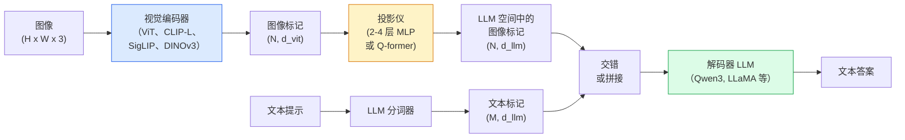

# 视觉-语言模型——ViT-MLP-LLM 模式

> 视觉编码器将图像转换为标记。MLP 投影仪将这些标记映射到 LLM 的嵌入空间。语言模型完成其余工作。这个模式——ViT-MLP-LLM——就是 2026 年每个生产级 VLM。

**类型：** 学习 + 使用
**语言：** Python
**前置知识：** 第四阶段第14课（ViT），第四阶段第18课（CLIP），第七阶段第02课（自注意力）
**时间：** ~75分钟

## 学习目标

- 陈述 ViT-MLP-LLM 架构，并解释三个组件各自贡献什么
- 在参数数量、上下文长度和基准性能方面比较 Qwen3-VL、InternVL3.5、LLaVA-Next 和 GLM-4.6V
- 解释 DeepStack：为什么多级 ViT 特征比单个最后一层特征能更紧密地对齐视觉-语言
- 在生产中用跨模态错误率（CMER）衡量 VLM 幻觉并根据信号采取行动

## 问题

CLIP（第四阶段第18课）为你提供了一个图像和文本的共享嵌入空间，这对于零样本分类和检索已经足够。但它无法回答"这张图像中有多少辆红色汽车？"，因为 CLIP 不生成文本——它只对相似度进行评分。

视觉-语言模型（VLM）——Qwen3-VL、InternVL3.5、LLaVA-Next、GLM-4.6V——将 CLIP 家族的图像编码器连接到完整的语言模型。模型看到一张图像加一个问题，并生成一个答案。2026 年，开源 VLM 在多模态基准（MMMU、MMBench、DocVQA、ChartQA、MathVista、OSWorld）上与 GPT-5 和 Gemini-2.5-Pro 竞争或超越它们。

三件套（ViT、投影仪、LLM）是标准。模型之间的差异在于哪个 ViT、哪个投影仪、哪个 LLM、训练数据和对齐方法。一旦你理解了这个模式，交换任何组件都是机械性的。

## 概念

### ViT-MLP-LLM 架构



1. **视觉编码器** — 一个预训练的 ViT（CLIP-L/14、SigLIP、DINOv3 或微调变体）。产生图块标记。
2. **投影仪** — 一个小模块（2-4 层 MLP，或 Q-former），将视觉标记映射到 LLM 的嵌入维度。这是大部分微调发生的地方。
3. **LLM** — 一个仅解码器的语言模型（Qwen3、Llama、Mistral、GLM、InternLM）。按顺序读取视觉 + 文本标记，生成文本。

原则上所有三个组件都是可训练的。实践中，视觉编码器和 LLM 大部分保持冻结，而投影仪进行训练——用少量参数传递大量信号。

### DeepStack

普通的投影只使用最后一个 ViT 层。DeepStack（Qwen3-VL）从多个 ViT 深度采样特征并将它们堆叠。深层携带高级语义；浅层携带细粒度的空间和纹理信息。将两者输入 LLM 缩小了"图像包含什么"（语义）和"确切在何处"（空间定位）之间的差距。

### 三个训练阶段

现代 VLM 分阶段训练：

1. **对齐** — 冻结 ViT 和 LLM。仅在图像-标题对上训练投影仪。教会投影仪将视觉空间映射到语言空间。
2. **预训练** — 解冻所有组件。在大规模交错的图像-文本数据（5 亿+对）上训练。建立模型的视觉知识。
3. **指令微调** — 在精选的（图像、问题、答案）三元组上微调。教会对话行为和任务格式。这是将"视觉感知的语言模型"变为可用助手的关键。

大多数 LoRA 微调针对阶段 3，使用一个小的标注数据集。

### 模型家族比较（2026 年初）

| 模型 | 参数 | 视觉编码器 | LLM | 上下文 | 优势 |
|-------|--------|----------------|-----|---------|-----------|
| Qwen3-VL-235B-A22B (MoE) | 235B (22B active) | 定制 ViT + DeepStack | Qwen3 | 256K | 通用 SOTA，GUI 代理 |
| Qwen3-VL-30B-A3B (MoE) | 30B (3B active) | 定制 ViT + DeepStack | Qwen3 | 256K | 更小的 MoE 替代 |
| Qwen3-VL-8B (dense) | 8B | 定制 ViT | Qwen3 | 128K | 生产稠密默认 |
| InternVL3.5-38B | 38B | InternViT-6B | Qwen3 + GPT-OSS | 128K | 强 MMBench / MMVet |
| InternVL3.5-241B-A28B | 241B (28B active) | InternViT-6B | Qwen3 | 128K | 与 GPT-4o 竞争 |
| LLaVA-Next 72B | 72B | SigLIP | Llama-3 | 32K | 开放，易于微调 |
| GLM-4.6V | ~70B | 定制 | GLM | 64K | 开源，强 OCR |
| MiniCPM-V-2.6 | 8B | SigLIP | MiniCPM | 32K | 边缘友好 |

### 视觉代理

Qwen3-VL-235B 在 OSWorld 上达到全球顶级性能——OSWorld 是一个用于操作 GUI（桌面、移动端、Web）的**视觉代理**的基准。模型看到截图，理解 UI，并发出动作（点击、输入、滚动）。结合工具，它在常见桌面任务上形成闭环。这就是大多数 2026 年"AI PC"演示的底层运行内容。

### 代理能力 + RoPE 变体

VLM 需要知道视频中一帧的**时间**。Qwen3-VL 从 T-RoPE（时间旋转位置嵌入）演变为**基于文本的时间对齐**——与视频帧交错的显式时间戳文本标记。模型看到 "`<timestamp 00:32>` frame, prompt" 并可以推理时间关系。

### 对齐问题

抓取数据集中 12% 的图像-文本对包含不完全基于图像的描述。在此之上训练的 VLM 沉默地学会产生幻觉——编造物体、误读数字、虚构关系。在生产中这是主要的失败模式。

Skywork.ai 引入了**跨模态错误率（CMER）** 来跟踪它：

```
CMER = 文本置信度很高但图像-文本相似度（通过 CLIP 家族检查器）很低的那部分输出
```

高 CMER 意味着模型自信地说出那些没有基于图像的内容。监控 CMER 并将其视为生产 KPI 在他们的部署中将幻觉率降低了约 35%。诀窍不是"修复模型"，而是"将高 CMER 输出路由到人工审查"。

### 使用 LoRA / QLoRA 微调

对 70B VLM 进行完全微调超出了大多数团队的能力范围。在注意力 + 投影仪层上的 LoRA（秩 16-64），或使用 4 位基础权重的 QLoRA，可以放在单个 A100 / H100 上。成本：5,000-50,000 个示例，$100-$5,000 的计算费用，2-10 小时的训练。

### 空间推理仍然薄弱

当前 VLM 在空间推理基准（上-下、左-右、计数、距离）上得分为 50-60%。如果你的用例依赖于"哪个物体在另一个上面"，请仔细验证——通用 VLM 性能低于人类。对于纯空间任务，比 VLM 更好的替代方案：专门的关键点 / 姿态估计器、深度模型或带有框几何后处理的检测模型。

## 构建

### 第一步：投影仪

你最常训练的部分。2-4 层 MLP，带 GELU。

```python
import torch
import torch.nn as nn


class Projector(nn.Module):
    def __init__(self, vit_dim=768, llm_dim=4096, hidden=4096):
        super().__init__()
        self.net = nn.Sequential(
            nn.Linear(vit_dim, hidden),
            nn.GELU(),
            nn.Linear(hidden, llm_dim),
        )

    def forward(self, x):
        return self.net(x)
```

输入是一个 `(N_patches, d_vit)` 标记张量。输出是 `(N_patches, d_llm)`。LLM 将每个输出行视为另一个标记。

### 第二步：组装 ViT-MLP-LLM 端到端

最小 VLM 的前向传播骨架。实际代码使用 `transformers`；这是概念布局。

```python
class MinimalVLM(nn.Module):
    def __init__(self, vit, projector, llm, image_token_id):
        super().__init__()
        self.vit = vit
        self.projector = projector
        self.llm = llm
        self.image_token_id = image_token_id  # 文本提示中的占位符标记

    def forward(self, image, input_ids, attention_mask):
        # 1. 视觉特征
        vision_tokens = self.vit(image)                     # (B, N_patches, d_vit)
        vision_embeds = self.projector(vision_tokens)       # (B, N_patches, d_llm)

        # 2. 文本嵌入
        text_embeds = self.llm.get_input_embeddings()(input_ids)  # (B, M, d_llm)

        # 3. 用视觉嵌入替换图像占位符标记
        merged = self._merge(text_embeds, vision_embeds, input_ids)

        # 4. 运行 LLM
        return self.llm(inputs_embeds=merged, attention_mask=attention_mask)

    def _merge(self, text_embeds, vision_embeds, input_ids):
        out = text_embeds.clone()
        expected = vision_embeds.size(1)
        for b in range(input_ids.size(0)):
            positions = (input_ids[b] == self.image_token_id).nonzero(as_tuple=True)[0]
            if len(positions) != expected:
                raise ValueError(
                    f"批次项 {b} 有 {len(positions)} 个图像标记但 vision_embeds 有 {expected} 个图块。"
                    " 批次中的每个样本必须预填充到相同数量的图像占位符标记。")
            out[b, positions] = vision_embeds[b]
        return out
```

文本中的 `<image>` 占位符标记被替换为真实的图像嵌入——与 LLaVA、Qwen-VL 和 InternVL 使用的模式相同。

### 第三步：CMER 计算

一个轻量级的运行时检查。

```python
import torch.nn.functional as F


def cross_modal_error_rate(image_emb, text_emb, text_confidence, sim_threshold=0.25, conf_threshold=0.8):
    """
    image_emb, text_emb: 图像和生成文本的嵌入（内部归一化）
    text_confidence:     [0, 1] 中每个标记的平均概率
    返回：              具有低图像-文本对齐的高置信度输出的比例
    """
    image_emb = F.normalize(image_emb, dim=-1)
    text_emb = F.normalize(text_emb, dim=-1)
    sim = (image_emb * text_emb).sum(dim=-1)        # 余弦相似度
    high_conf_low_sim = (text_confidence > conf_threshold) & (sim < sim_threshold)
    return high_conf_low_sim.float().mean().item()
```

将 CMER 视为生产 KPI。按端点、按提示类型、按客户监控它。上升的 CMER 表明模型在某些输入分布上开始产生幻觉。

### 第四步：玩具 VLM 分类器（可运行）

演示投影仪可以训练。假的"ViT 特征"输入；一个微型 LLM 风格的标记预测一个类别。

```python
class ToyVLM(nn.Module):
    def __init__(self, vit_dim=32, llm_dim=64, num_classes=5):
        super().__init__()
        self.projector = Projector(vit_dim, llm_dim, hidden=64)
        self.head = nn.Linear(llm_dim, num_classes)

    def forward(self, vision_tokens):
        projected = self.projector(vision_tokens)
        pooled = projected.mean(dim=1)
        return self.head(pooled)
```

可以在不到 200 步内拟合合成的（特征，类别）对——足以证明投影仪模式有效。

## 使用

2026 年生产团队使用 VLM 的三种方式：

- **托管 API** — OpenAI Vision、Anthropic Claude Vision、Google Gemini Vision。零基础设施，供应商风险。
- **开源自托管** — 通过 `transformers` 和 `vllm` 的 Qwen3-VL 或 InternVL3.5。完全控制，前期投入更高。
- **领域微调** — 加载 Qwen2.5-VL-7B 或 LLaVA-1.6-7B，在 5k-50k 自定义示例上做 LoRA，用 `vllm` 或 `TGI` 提供服务。

```python
from transformers import AutoProcessor, AutoModelForVision2Seq
import torch
from PIL import Image

model_id = "Qwen/Qwen3-VL-8B-Instruct"
processor = AutoProcessor.from_pretrained(model_id)
model = AutoModelForVision2Seq.from_pretrained(model_id, torch_dtype=torch.bfloat16, device_map="auto")

messages = [{
    "role": "user",
    "content": [
        {"type": "image", "image": Image.open("plot.png")},
        {"type": "text", "text": "这张图表显示了什么？"},
    ],
}]
inputs = processor.apply_chat_template(messages, add_generation_prompt=True, tokenize=True, return_dict=True, return_tensors="pt").to("cuda")
generated = model.generate(**inputs, max_new_tokens=256)
answer = processor.decode(generated[0][inputs["input_ids"].shape[1]:], skip_special_tokens=True)
```

`apply_chat_template` 隐藏了 `<image>` 占位符标记的标记化；模型内部处理合并。

## 交付

本课产出：

- `outputs/prompt-vlm-selector.md` — 根据准确率、延迟、上下文长度和预算选择 Qwen3-VL / InternVL3.5 / LLaVA-Next / API 的提示词。
- `outputs/skill-cmer-monitor.md` — 生成用于为生产 VLM 端点仪表化跨模态错误率的代码，包含每个端点的仪表板和告警阈值。

## 练习

1. **（简单）** 通过任何开放 VLM 在五张图像上运行三个提示（"这是什么？"、"数一下物体"、"描述场景"）。手动将每个答案评为正确 / 部分正确 / 幻觉。计算初次的 CMER 类似比率。
2. **（中等）** 使用 LoRA（秩 16）在 500 张带标题的目标领域图像上微调 Qwen2.5-VL-3B 或 LLaVA-1.6-7B。比较零样本与微调后的 MMBench 风格准确率。
3. **（困难）** 将 VLM 的图像编码器替换为 DINOv3 而不是其默认的 SigLIP/CLIP。仅重新训练投影仪（冻结 LLM + 冻结 DINOv3）。测量密集预测任务（计数、空间推理）是否改善。

## 关键术语

| 术语 | 人们说的 | 实际含义 |
|------|----------------|----------------------|
| ViT-MLP-LLM | "VLM 模式" | 视觉编码器 + 投影仪 + 语言模型；每个 2026 VLM |
| 投影仪 | "桥梁" | 2-4 层 MLP（或 Q-former），将视觉标记映射到 LLM 嵌入空间 |
| DeepStack | "Qwen3-VL 特征技巧" | 多级 ViT 特征堆叠，而非仅最后一层 |
| 图像标记 | "<image> 占位符" | 文本流中的特殊标记，被投影的视觉嵌入替换 |
| CMER | "幻觉 KPI" | 跨模态错误率；当文本置信度高但图像-文本相似度低时高 |
| 视觉代理 | "能点击的 VLM" | 操作 GUI（OSWorld、移动端、Web）的 VLM，使用工具调用 |
| Q-former | "固定数量标记桥" | BLIP-2 风格投影仪，产生固定数量的视觉查询标记 |
| 对齐 / 预训练 / 指令微调 | "三个阶段" | 标准 VLM 训练流水线 |

## 延伸阅读

- [Qwen3-VL Technical Report (arXiv 2511.21631)](https://arxiv.org/abs/2511.21631)
- [InternVL3.5 Advancing Open-Source Multimodal Models (arXiv 2508.18265)](https://arxiv.org/html/2508.18265v1)
- [LLaVA-Next series](https://llava-vl.github.io/blog/2024-05-10-llava-next-stronger-llms/)
- [BentoML: Best Open-Source VLMs 2026](https://www.bentoml.com/blog/multimodal-ai-a-guide-to-open-source-vision-language-models)
- [MMMU: Multi-discipline Multimodal Understanding benchmark](https://mmmu-benchmark.github.io/)
- [VLMs in manufacturing (Robotics Tomorrow, March 2026)](https://www.roboticstomorrow.com/story/2026/03/when-machines-learn-to-see-like-experts-the-rise-of-vision-language-models-in-manufacturing/26335/)
