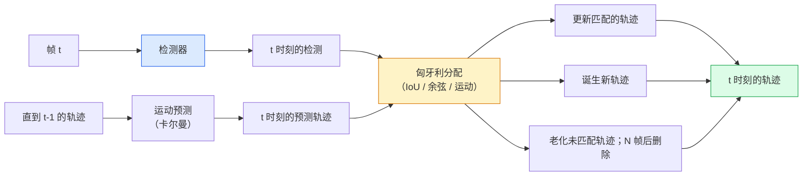

# 多目标跟踪与视频记忆

> 跟踪是检测加关联。检测每一帧。将这一帧的检测与上一帧的轨迹按 ID 匹配。

**类型：** 构建
**语言：** Python
**前置知识：** 第四阶段第06课（YOLO 检测），第四阶段第08课（Mask R-CNN），第四阶段第24课（SAM 3）
**时间：** ~60分钟

## 学习目标

- 区分基于检测的跟踪和基于查询的跟踪，并说出算法系列（SORT、DeepSORT、ByteTrack、BoT-SORT、SAM 2 记忆跟踪器、SAM 3.1 Object Multiplex）
- 从头实现 IoU + 匈牙利分配，用于经典的基于检测的跟踪
- 解释 SAM 2 的记忆库以及为什么它比基于 IoU 的关联更好地处理遮挡
- 阅读三个跟踪指标（MOTA、IDF1、HOTA）并为给定用例选择需要哪个

## 问题

检测器告诉你物体在单帧中的位置。跟踪器告诉你第 `t` 帧中的哪个检测与第 `t-1` 帧中的检测是同一个物体。没有它，你无法统计穿过一条线的物体，无法在遮挡中跟踪一个球，也无法知道"4 号车已经在车道中 8 秒了"。

跟踪对每个面向视频的产品都至关重要：体育分析、监控、自动驾驶、医学视频分析、野生动物监测、标识计数。核心构建块是共享的：每帧检测器、运动模型（卡尔曼滤波器或更丰富的模型）、关联步骤（在 IoU / 余弦 / 学习特征上的匈牙利算法）和轨迹生命周期（诞生、更新、消亡）。

2026 年带来了两种新模式：**SAM 2 基于记忆的跟踪**（用特征记忆替代运动模型关联）和 **SAM 3.1 Object Multiplex**（同一概念的许多实例的共享记忆）。本课先讲解经典堆栈，然后讲解基于记忆的方法。

## 概念

### 基于检测的跟踪



2026 年你将遇到的每个跟踪器都是这个循环的变体。差异：

- **SORT**（2016）：卡尔曼滤波器 + IoU 匈牙利。简单、快速，没有外观模型。
- **DeepSORT**（2017）：SORT + 每个轨迹基于 CNN 的外观特征（ReID 嵌入）。更好地处理交叉。
- **ByteTrack**（2021）：将低置信度检测作为第二阶段关联；不需要外观特征，但在 MOT17 上是顶级表现者。
- **BoT-SORT**（2022）：Byte + 相机运动补偿 + ReID。
- **StrongSORT / OC-SORT** — ByteTrack 的后代，具有更好的运动和外观。

### 卡尔曼滤波器（一段话）

卡尔曼滤波器维护一个每轨迹状态 `(x, y, w, h, dx, dy, dw, dh)` 及其协方差。在每帧，**预测**使用恒定速度模型的状态，然后用匹配的检测**更新**。当预测不确定性高时，更新更信任检测。这提供了平滑的轨迹，以及通过短遮挡（1-5 帧）继续跟踪的能力。

每个经典跟踪器在运动预测步骤中使用卡尔曼滤波器。

### 匈牙利算法

给定一个 `M x N` 代价矩阵（轨迹 x 检测），找到最小化总代价的一对一分配。代价通常是 `1 - IoU(track_bbox, detection_bbox)` 或外观特征的负余弦相似度。运行时间为 O((M+N)^3)；对于 M、N 最多约 1000，在 Python 中通过 `scipy.optimize.linear_sum_assignment` 已经足够快。

### ByteTrack 的关键思想

标准跟踪器丢弃低置信度检测（< 0.5）。ByteTrack 将它们保留为**第二阶段候选**：在轨迹匹配高置信度检测之后，未匹配的轨迹尝试以一个稍宽松的 IoU 阈值匹配低置信度检测。恢复短遮挡，在人群附近减少 ID 切换。

### SAM 2 基于记忆的跟踪

SAM 2 通过保持**记忆库**的每个实例时空特征来处理视频。在一帧上给出提示（点击、框、文本）后，它将实例编码到记忆中。在后续帧上，记忆与帧的新特征进行交叉注意力，解码器为新帧中的相同实例产生遮罩。

没有卡尔曼滤波器，没有匈牙利分配。关联隐含在记忆-注意力操作中。

优点：
- 对大遮挡鲁棒（记忆跨许多帧携带实例身份）。
- 与 SAM 3 文本提示结合时开放词汇。
- 不需要独立的运动模型。

缺点：
- 多目标跟踪时比 ByteTrack 慢。
- 记忆库增长；限制上下文窗口。

### SAM 3.1 Object Multiplex

先前的 SAM 2 / SAM 3 跟踪为每个实例保留一个独立的记忆库。对于 50 个物体，就是 50 个记忆库。Object Multiplex（2026 年 3 月）将它们压缩为一个带有**每实例查询标记**的共享记忆。成本在实例数量上亚线性增长。

Multiplex 是 2026 年人群跟踪的新默认选择：音乐会人群、仓库工人、交通路口。

### 需要知道的三个指标

- **MOTA（多目标跟踪准确率）** — 1 - (FN + FP + ID 切换) / GT。按错误类型加权；一个混杂了检测和关联失败的单一指标。
- **IDF1（ID F1）** — ID 精度和召回率的调和平均值。特别关注每个真实值轨迹如何随时间保持其 ID。对于 ID 切换敏感的任务优于 MOTA。
- **HOTA（高阶跟踪准确率）** — 分解为检测准确率（DetA）和关联准确率（AssA）。自 2020 年以来的社区标准；最全面。

对于监控（谁是谁）：报告 IDF1。对于体育分析（统计传球）：HOTA。对于一般的学术比较：HOTA。

## 构建

### 第一步：基于 IoU 的代价矩阵

```python
import numpy as np


def bbox_iou(a, b):
    """
    a, b: (N, 4) 数组 [x1, y1, x2, y2]。
    返回 (N_a, N_b) IoU 矩阵。
    """
    ax1, ay1, ax2, ay2 = a[:, 0], a[:, 1], a[:, 2], a[:, 3]
    bx1, by1, bx2, by2 = b[:, 0], b[:, 1], b[:, 2], b[:, 3]
    inter_x1 = np.maximum(ax1[:, None], bx1[None, :])
    inter_y1 = np.maximum(ay1[:, None], by1[None, :])
    inter_x2 = np.minimum(ax2[:, None], bx2[None, :])
    inter_y2 = np.minimum(ay2[:, None], by2[None, :])
    inter = np.clip(inter_x2 - inter_x1, 0, None) * np.clip(inter_y2 - inter_y1, 0, None)
    area_a = (ax2 - ax1) * (ay2 - ay1)
    area_b = (bx2 - bx1) * (by2 - by1)
    union = area_a[:, None] + area_b[None, :] - inter
    return inter / np.clip(union, 1e-8, None)
```

### 第二步：最小化 SORT 风格的跟踪器

为简洁起见省略了固定恒定速度卡尔曼——这里我们使用一个简单的 IoU 关联；在生产中卡尔曼预测是必不可少的。`sort` Python 包提供完整版本。

```python
from scipy.optimize import linear_sum_assignment


class Track:
    def __init__(self, tid, bbox, frame):
        self.id = tid
        self.bbox = bbox
        self.last_frame = frame
        self.hits = 1

    def update(self, bbox, frame):
        self.bbox = bbox
        self.last_frame = frame
        self.hits += 1


class SimpleTracker:
    def __init__(self, iou_threshold=0.3, max_age=5):
        self.tracks = []
        self.next_id = 1
        self.iou_threshold = iou_threshold
        self.max_age = max_age

    def step(self, detections, frame):
        if not self.tracks:
            for d in detections:
                self.tracks.append(Track(self.next_id, d, frame))
                self.next_id += 1
            return [(t.id, t.bbox) for t in self.tracks]

        track_boxes = np.array([t.bbox for t in self.tracks])
        det_boxes = np.array(detections) if len(detections) else np.empty((0, 4))

        iou = bbox_iou(track_boxes, det_boxes) if len(det_boxes) else np.zeros((len(track_boxes), 0))
        cost = 1 - iou
        cost[iou < self.iou_threshold] = 1e6

        matched_track = set()
        matched_det = set()
        if cost.size > 0:
            row, col = linear_sum_assignment(cost)
            for r, c in zip(row, col):
                if cost[r, c] < 1.0:
                    self.tracks[r].update(det_boxes[c], frame)
                    matched_track.add(r); matched_det.add(c)

        for i, d in enumerate(det_boxes):
            if i not in matched_det:
                self.tracks.append(Track(self.next_id, d, frame))
                self.next_id += 1

        self.tracks = [t for t in self.tracks if frame - t.last_frame <= self.max_age]
        return [(t.id, t.bbox) for t in self.tracks]
```

60 行。接受每帧检测，返回每帧轨迹 ID。真实系统会添加卡尔曼预测、ByteTrack 的第二阶段重新匹配和外观特征。

### 第三步：合成轨迹测试

```python
def synthetic_frames(num_frames=20, num_objects=3, H=240, W=320, seed=0):
    rng = np.random.default_rng(seed)
    starts = rng.uniform(20, 200, size=(num_objects, 2))
    velocities = rng.uniform(-5, 5, size=(num_objects, 2))
    frames = []
    for f in range(num_frames):
        dets = []
        for i in range(num_objects):
            cx, cy = starts[i] + f * velocities[i]
            dets.append([cx - 10, cy - 10, cx + 10, cy + 10])
        frames.append(dets)
    return frames


tracker = SimpleTracker()
for f, dets in enumerate(synthetic_frames()):
    tracks = tracker.step(dets, f)
```

三个沿直线移动的物体应在其所有 20 帧中保持其 ID。

### 第四步：ID 切换指标

```python
def count_id_switches(tracks_per_frame, gt_per_frame):
    """
    tracks_per_frame:  列表的列表 (track_id, bbox)
    gt_per_frame:      列表的列表 (gt_id, bbox)
    返回 ID 切换次数。
    """
    prev_assignment = {}
    switches = 0
    for tracks, gts in zip(tracks_per_frame, gt_per_frame):
        if not tracks or not gts:
            continue
        t_boxes = np.array([b for _, b in tracks])
        g_boxes = np.array([b for _, b in gts])
        iou = bbox_iou(g_boxes, t_boxes)
        for g_idx, (gt_id, _) in enumerate(gts):
            j = iou[g_idx].argmax()
            if iou[g_idx, j] > 0.5:
                t_id = tracks[j][0]
                if gt_id in prev_assignment and prev_assignment[gt_id] != t_id:
                    switches += 1
                prev_assignment[gt_id] = t_id
    return switches
```

这是一个简化的 IDF1 邻近指标：计算一个真实值对象改变其分配的预测轨迹 ID 的次数。真正的 MOTA / IDF1 / HOTA 工具位于 `py-motmetrics` 和 `TrackEval` 中。

## 使用

2026 年的生产跟踪器：

- `ultralytics` — YOLOv8 + ByteTrack / BoT-SORT 内置。`results = model.track(source, tracker="bytetrack.yaml")`。默认选择。
- `supervision`（Roboflow）— ByteTrack 包装器加标注工具。
- SAM 2 / SAM 3.1 — 通过 `processor.track()` 的基于记忆的跟踪。
- 自定义堆栈：检测器（YOLOv8 / RT-DETR）+ `sort-tracker` / `OC-SORT` / `StrongSORT`。

选择：

- 30+ fps 的行人 / 汽车 / 箱子：**带 ultralytics 的 ByteTrack**。
- 密集人群中同一类的许多实例：**SAM 3.1 Object Multiplex**。
- 严重遮挡且可识别外观：**DeepSORT / StrongSORT**（ReID 特征）。
- 体育 / 复杂交互：**BoT-SORT** 或学习跟踪器（MOTRv3）。

## 交付

本课产出：

- `outputs/prompt-tracker-picker.md` — 根据场景类型、遮挡模式和延迟预算选择 SORT / ByteTrack / BoT-SORT / SAM 2 / SAM 3.1 的提示词。
- `outputs/skill-mot-evaluator.md` — 编写针对真实值轨迹的 MOTA / IDF1 / HOTA 完整评估框架的技能。

## 练习

1. **（简单）** 对 3、10 和 30 个物体运行上述合成跟踪器。报告每种情况下的 ID 切换计数。确定简单的 IoU 关联开始失效的位置。
2. **（中等）** 在关联前添加一个恒定速度卡尔曼预测步骤。证明短（2-3 帧）遮挡不再导致 ID 切换。
3. **（困难）** 将 SAM 2 的基于记忆的跟踪器（通过 `transformers`）作为替代跟踪器后端集成。在 30 秒的人群剪辑上运行 SimpleTracker 和 SAM 2，比较 ID 切换计数，手动为 5 个显著人物标注真实值 ID。

## 关键术语

| 术语 | 人们说的 | 实际含义 |
|------|----------------|----------------------|
| 基于检测的跟踪 | "先检测再关联" | 每帧检测器 + 在 IoU / 外观上的匈牙利分配 |
| 卡尔曼滤波器 | "运动预测" | 线性动力学 + 协方差，用于平滑轨迹预测和遮挡处理 |
| 匈牙利算法 | "最优分配" | 解决最小成本二分匹配问题；`scipy.optimize.linear_sum_assignment` |
| ByteTrack | "低置信度第二轮" | 将未匹配的轨迹重新匹配到低置信度检测以恢复短遮挡 |
| DeepSORT | "SORT + 外观" | 为跨帧匹配添加 ReID 特征；更好地保持 ID |
| 记忆库 | "SAM 2 技巧" | 跨帧存储每个实例的时空特征；交叉注意力替代显式关联 |
| Object Multiplex | "SAM 3.1 共享记忆" | 带每实例查询的单个共享记忆，用于快速多目标跟踪 |
| HOTA | "现代跟踪指标" | 分解为检测和关联准确率；社区标准 |

## 延伸阅读

- [SORT (Bewley et al., 2016)](https://arxiv.org/abs/1602.00763) — 最小化基于检测的跟踪论文
- [DeepSORT (Wojke et al., 2017)](https://arxiv.org/abs/1703.07402) — 添加外观特征
- [ByteTrack (Zhang et al., 2022)](https://arxiv.org/abs/2110.06864) — 低置信度第二轮
- [BoT-SORT (Aharon et al., 2022)](https://arxiv.org/abs/2206.14651) — 相机运动补偿
- [HOTA (Luiten et al., 2020)](https://arxiv.org/abs/2009.07736) — 分解跟踪指标
- [SAM 2 video segmentation (Meta, 2024)](https://ai.meta.com/sam2/) — 基于记忆的跟踪器
- [SAM 3.1 Object Multiplex (Meta, March 2026)](https://ai.meta.com/blog/segment-anything-model-3/)
