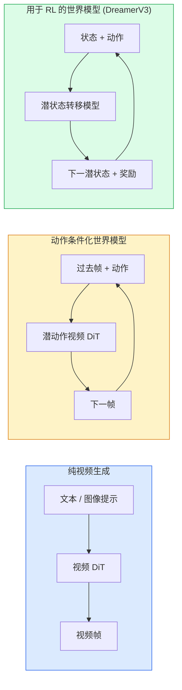

# 世界模型与视频扩散

> 一个能预测场景未来几秒的视频模型就是一个世界模拟器。用动作条件化该预测，你就有了一个学习到的游戏引擎。

**类型：** 学习 + 构建
**语言：** Python
**前置知识：** 第四阶段第10课（扩散），第四阶段第12课（视频理解），第四阶段第23课（DiT + 纠正流）
**时间：** ~75分钟

## 学习目标

- 解释纯视频生成模型（Sora 2）和动作条件化的世界模型（Genie 3、DreamerV3）之间的区别
- 描述视频 DiT：时空图块、3D 位置编码、跨 (T, H, W) 标记的联合注意力
- 追踪世界模型如何接入机器人学：VLM 规划 → 视频模型仿真 → 逆动力学发出动作
- 为给定用例（创意视频、交互式模拟、自动驾驶合成）在 Sora 2、Genie 3、Runway GWM-1 Worlds、Wan-Video 和 HunyuanVideo 之间做出选择

## 问题

视频生成和世界建模在 2026 年融合了。一个能生成连贯一分钟视频的模型，在某种意义上已经学会了世界如何运动：物体恒存、重力、因果关系、风格。如果你用动作（向左走、开门）来条件化该预测，视频模型就变成了一个可学习的模拟器，可以替代游戏引擎、驾驶模拟器或机器人环境。

这其中的关键是非常具体的。Genie 3 从一张图像生成可玩的场景。Runway GWM-1 Worlds 合成无限可探索的场景。Sora 2 生成带同步音频和模拟物理的长达一分钟的视频。NVIDIA Cosmos-Drive、Wayve Gaia-2 和 Tesla DrivingWorld 为自动驾驶车辆训练数据生成逼真的驾驶视频。世界模型范式正在悄悄地接管机器人学的 sim-to-real。

本课是第四阶段的"大局观"课程。它将图像生成、视频理解和自主推理连接到了主流研究正在趋同的架构模式。

## 概念

### 世界建模的三个家族



- **Sora 2** 是基于提示条件化的纯视频生成。没有动作接口。你不能在生成过程中"引导"它。
- **Genie 3**、**GWM-1 Worlds**、**Mirage / Magica** 是动作条件化的世界模型。从观察到的视频推断潜动作，然后用动作条件化未来帧预测。交互式——你按按键或移动相机，场景做出响应。
- **DreamerV3** 和经典的 RL 世界模型家族在潜空间中预测，带有显式的动作条件化，基于奖励信号训练。视觉较少；对样本高效的 RL 更有用。

### 视频 DiT 架构

```
视频潜变量：          (C, T, H, W)
图块化（空间）：    每帧的 P_h x P_w 图块网格
图块化（时间）：    将 P_t 帧分组为时间图块
结果标记：          (T / P_t) * (H / P_h) * (W / P_w) 个标记
```

位置编码是 3D 的：每个 (t, h, w) 坐标的旋转或可学习嵌入。注意力可以是：

- **完全联合** — 所有标记关注所有标记。N 个标记的 O(N^2)。对长视频来说过于昂贵。
- **分割** — 交替时间注意力（相同空间位置，跨时间：`(H*W) * T^2`）和空间注意力（相同时间步，跨空间：`T * (H*W)^2`）。由 TimeSformer 和大多数视频 DiT 使用。
- **窗口** — (t, h, w) 中的局部窗口。由 Video Swin 使用。

每个 2026 年的视频扩散模型使用这三种模式之一，加上 AdaLN 条件化（第 23 课）和纠正流。

### 以动作为条件：潜动作模型

Genie 学习每帧的一个**潜动作**，通过区分性预测连续帧对之间的动作。然后模型的解码器以推断出的潜动作为条件——而不是显式的键盘按键。在推理时，用户可以指定一个潜动作（或从一个新的先验中采样一个），模型生成与该动作一致的下一帧。

Sora 完全跳过了动作接口。其解码器从过去的时空标记预测未来的时空标记。提示条件化开始；没有什么在生成过程中引导它。

### 物理合理性

Sora 2 的 2026 版本明确宣传了**物理合理性**：重量、平衡、物体恒存、因果效应。团队通过人工评分的合理性分数来测量；模型在掉落物体、角色碰撞和有意失败（跳得不够远）方面相较于 Sora 1 有明显的改善。

合理性仍然是主要的失败模式。2024-2025 年人们吃面条或从杯子喝水的视频揭示了模型缺乏持久的物体表示。2026 年的模型（Sora 2、Runway Gen-5、HunyuanVideo）减少了但并没有消除这些问题。

### 自动驾驶世界模型

驾驶世界模型基于轨迹、边界框或导航地图条件化生成逼真的道路场景。用途：

- **Cosmos-Drive-Dreams**（NVIDIA）— 生成用于 RL 训练的几分钟驾驶视频。
- **Gaia-2**（Wayve）— 轨迹条件化的场景合成，用于策略评估。
- **DrivingWorld**（Tesla）— 模拟不同的天气、时间和交通条件。
- **Vista**（字节跳动）— 响应式驾驶场景合成。

它们替代了昂贵的数据采集，用于边缘情况——夜间行人乱穿马路、结冰的交叉口、不常见的车辆类型——否则需要数百万英里的驾驶。

### 机器人堆栈：VLM + 视频模型 + 逆动力学

新兴的三组件机器人循环：

1. **VLM** 解析目标（"拿起红色杯子"），规划高级动作序列。
2. **视频生成模型** 模拟执行每个动作会是什么样子——预测 N 帧之后的观测。
3. **逆动力学模型** 提取将产生这些观测的具体电机指令。

这替代了奖励塑性和样本密集的 RL。世界模型进行想象；逆动力学在驱动上形成闭环。Genie Envisioner 是一个实例；许多研究团队正在趋同于这个结构。

### 评估

- **视觉质量** — FVD（Fréchet 视频距离）、用户研究。
- **提示对齐** — 每帧 CLIPScore、VQA 风格评估。
- **物理合理性** — 在基准测试套件上人工评分（Sora 2 的内部基准、VBench）。
- **可控性**（对交互式世界模型）— 动作 → 观测一致性；你能回到先前的状态吗？

### 2026 年模型格局

| 模型 | 用途 | 参数 | 输出 | 许可 |
|-------|-----|------------|--------|---------|
| Sora 2 | 文本到视频，音频 | — | 1 分钟 1080p + 音频 | 仅 API |
| Runway Gen-5 | 文本/图像到视频 | — | 10 秒片段 | API |
| Runway GWM-1 Worlds | 交互式世界 | — | 无限 3D 场景展开 | API |
| Genie 3 | 从图像交互式世界 | 11B+ | 可玩帧 | 研究预览 |
| Wan-Video 2.1 | 开放文本到视频 | 14B | 高质量片段 | 非商用 |
| HunyuanVideo | 开放文本到视频 | 13B | 10 秒片段 | 宽松 |
| Cosmos / Cosmos-Drive | 自动驾驶模拟 | 7-14B | 驾驶场景 | NVIDIA 开放 |
| Magica / Mirage 2 | AI 原生游戏引擎 | — | 可修改世界 | 产品 |

## 构建

### 第一步：视频的 3D 图块化

```python
import torch
import torch.nn as nn


class VideoPatch3D(nn.Module):
    def __init__(self, in_channels=4, dim=64, patch_t=2, patch_h=2, patch_w=2):
        super().__init__()
        self.proj = nn.Conv3d(
            in_channels, dim,
            kernel_size=(patch_t, patch_h, patch_w),
            stride=(patch_t, patch_h, patch_w),
        )
        self.patch_t = patch_t
        self.patch_h = patch_h
        self.patch_w = patch_w

    def forward(self, x):
        # x: (N, C, T, H, W)
        x = self.proj(x)
        n, c, t, h, w = x.shape
        tokens = x.reshape(n, c, t * h * w).transpose(1, 2)
        return tokens, (t, h, w)
```

一个步长等于核大小的 3D 卷积充当了时空图块化器。`(T, H, W) -> (T/2, H/2, W/2)` 的标记网格。

### 第二步：3D 旋转位置编码

旋转位置嵌入（RoPE）分别沿 `t`、`h`、`w` 轴应用：

```python
def rope_3d(tokens, t_dim, h_dim, w_dim, grid):
    """
    tokens: (N, T*H*W, D)
    grid: (T, H, W) 尺寸
    t_dim + h_dim + w_dim == D
    """
    T, H, W = grid
    n, seq, d = tokens.shape
    if t_dim + h_dim + w_dim != d:
        raise ValueError(f"t_dim+h_dim+w_dim ({t_dim}+{h_dim}+{w_dim}) 必须等于 D={d}")
    assert seq == T * H * W
    t_idx = torch.arange(T, device=tokens.device).repeat_interleave(H * W)
    h_idx = torch.arange(H, device=tokens.device).repeat_interleave(W).repeat(T)
    w_idx = torch.arange(W, device=tokens.device).repeat(T * H)
    # 简化：仅按频率缩放通道。真正的 RoPE 旋转配对。
    freqs_t = torch.exp(-torch.log(torch.tensor(10000.0)) * torch.arange(t_dim // 2, device=tokens.device) / (t_dim // 2))
    freqs_h = torch.exp(-torch.log(torch.tensor(10000.0)) * torch.arange(h_dim // 2, device=tokens.device) / (h_dim // 2))
    freqs_w = torch.exp(-torch.log(torch.tensor(10000.0)) * torch.arange(w_dim // 2, device=tokens.device) / (w_dim // 2))
    emb_t = torch.cat([torch.sin(t_idx[:, None] * freqs_t), torch.cos(t_idx[:, None] * freqs_t)], dim=-1)
    emb_h = torch.cat([torch.sin(h_idx[:, None] * freqs_h), torch.cos(h_idx[:, None] * freqs_h)], dim=-1)
    emb_w = torch.cat([torch.sin(w_idx[:, None] * freqs_w), torch.cos(w_idx[:, None] * freqs_w)], dim=-1)
    return tokens + torch.cat([emb_t, emb_h, emb_w], dim=-1)
```

简化的加法形式。真正的 RoPE 以频率旋转配对通道；位置信息相同。

### 第三步：分割注意力块

```python
class DividedAttentionBlock(nn.Module):
    def __init__(self, dim=64, heads=2):
        super().__init__()
        self.time_attn = nn.MultiheadAttention(dim, heads, batch_first=True)
        self.space_attn = nn.MultiheadAttention(dim, heads, batch_first=True)
        self.ln1 = nn.LayerNorm(dim)
        self.ln2 = nn.LayerNorm(dim)
        self.ln3 = nn.LayerNorm(dim)
        self.mlp = nn.Sequential(nn.Linear(dim, 4 * dim), nn.GELU(), nn.Linear(4 * dim, dim))

    def forward(self, x, grid):
        T, H, W = grid
        n, seq, d = x.shape
        # 时间注意力：相同 (h, w)，跨 t
        xt = x.view(n, T, H * W, d).permute(0, 2, 1, 3).reshape(n * H * W, T, d)
        a, _ = self.time_attn(self.ln1(xt), self.ln1(xt), self.ln1(xt), need_weights=False)
        xt = (xt + a).reshape(n, H * W, T, d).permute(0, 2, 1, 3).reshape(n, seq, d)
        # 空间注意力：相同 t，跨 (h, w)
        xs = xt.view(n, T, H * W, d).reshape(n * T, H * W, d)
        a, _ = self.space_attn(self.ln2(xs), self.ln2(xs), self.ln2(xs), need_weights=False)
        xs = (xs + a).reshape(n, T, H * W, d).reshape(n, seq, d)
        xs = xs + self.mlp(self.ln3(xs))
        return xs
```

时间注意力在每个空间位置内跨时间关注；空间注意力在每个帧内跨位置关注。两个 O(T^2 + (HW)^2) 操作替代了一个 O((THW)^2) 操作。这是 TimeSformer 和每个现代视频 DiT 的核心。

### 第四步：组建微型视频 DiT

```python
class TinyVideoDiT(nn.Module):
    def __init__(self, in_channels=4, dim=64, depth=2, heads=2):
        super().__init__()
        self.patch = VideoPatch3D(in_channels=in_channels, dim=dim, patch_t=2, patch_h=2, patch_w=2)
        self.blocks = nn.ModuleList([DividedAttentionBlock(dim, heads) for _ in range(depth)])
        self.out = nn.Linear(dim, in_channels * 2 * 2 * 2)

    def forward(self, x):
        tokens, grid = self.patch(x)
        for blk in self.blocks:
            tokens = blk(tokens, grid)
        return self.out(tokens), grid
```

不是一个可用的视频生成器；是一个演示每个组件形状正确的结构演示。

### 第五步：检查形状

```python
vid = torch.randn(1, 4, 8, 16, 16)  # (N, C, T, H, W)
model = TinyVideoDiT()
out, grid = model(vid)
print(f"输入  {tuple(vid.shape)}")
print(f"标记网格 {grid}")
print(f"输出 {tuple(out.shape)}")
```

期望 `grid = (4, 8, 8)` 和 `out = (1, 256, 32)` 在图块化之后；然后头投影到每标记的时空图块，准备反向图块化回视频。

## 使用

2026 年的生产访问模式：

- **Sora 2 API**（OpenAI）— 文本到视频，同步音频。高级定价。
- **Runway Gen-5 / GWM-1**（Runway）— 图像到视频，交互式世界。
- **Wan-Video 2.1 / HunyuanVideo** — 开源自托管。
- **Cosmos / Cosmos-Drive**（NVIDIA）— 驾驶模拟开放权重。
- **Genie 3** — 研究预览，请求访问。

构建交互式世界模型演示：从 Wan-Video 开始追求质量，在上面添加潜动作适配器实现交互性。对于自动驾驶模拟：Cosmos-Drive 是 2026 年的开放参考。

对于机器人学，实际中的堆栈：

1. 语言目标 -> VLM（Qwen3-VL）-> 高级计划。
2. 计划 -> 潜动作视频模型 -> 想象中的场景展开。
3. 场景展开 -> 逆动力学模型 -> 低级动作。
4. 动作执行 -> 观测反馈到步骤 1。

## 交付

本课产出：

- `outputs/prompt-video-model-picker.md` — 根据任务、许可和延迟在 Sora 2 / Runway / Wan / HunyuanVideo / Cosmos 之间选择。
- `outputs/skill-physical-plausibility-checks.md` — 定义自动化检查（物体恒存、重力、连续性）以在交付前对任何生成的视频运行。

## 练习

1. **（简单）** 计算 5 秒 360p 视频在 patch-t=2、patch-h=8、patch-w=8 下的标记数量。推理在此规模下的注意力所需内存。
2. **（中等）** 将上面的分割注意力块替换为完全联合注意力块，测量形状和参数数量。解释为什么分割注意力对真实视频模型是必要的。
3. **（困难）** 构建一个最小的潜动作视频模型：取一个 (frame_t, action_t, frame_{t+1}) 三元组的数据集（任何简单的 2D 游戏），训练一个以动作嵌入为条件的微型视频 DiT，并证明不同的动作产生不同的下一帧。

## 关键术语

| 术语 | 人们说的 | 实际含义 |
|------|----------------|----------------------|
| 世界模型 | "学习到的模拟器" | 给定状态和动作预测未来观测的模型 |
| 视频 DiT | "时空 Transformer" | 具有 3D 图块化和分割注意力的扩散 Transformer |
| 潜动作 | "推断的控制" | 从帧对推断的离散或连续动作潜变量；用于条件化下一帧生成 |
| 分割注意力 | "时间然后空间" | 每块两个注意力操作——先跨时间再跨空间——以保持 O(N^2) 可控 |
| 物体恒存 | "事物保持真实" | 视频模型必须学习的场景属性；食物、玻璃器皿上的经典失败模式 |
| FVD | "Fréchet 视频距离" | 视频等效于 FID；主要的视觉质量指标 |
| 逆动力学模型 | "观测到动作" | 给定 (状态, 下一状态)，输出连接它们的动作；闭合机器人循环 |
| Cosmos-Drive | "NVIDIA 驾驶模拟" | 用于 RL 和评估的开放权重自动驾驶世界模型 |

## 延伸阅读

- [Sora technical report (OpenAI)](https://openai.com/index/video-generation-models-as-world-simulators/)
- [Genie: Generative Interactive Environments (Bruce et al., 2024)](https://arxiv.org/abs/2402.15391) — 潜动作世界模型
- [TimeSformer (Bertasius et al., 2021)](https://arxiv.org/abs/2102.05095) — 视频 Transformer 的分割注意力
- [DreamerV3 (Hafner et al., 2023)](https://arxiv.org/abs/2301.04104) — 用于 RL 的世界模型
- [Cosmos-Drive-Dreams (NVIDIA, 2025)](https://research.nvidia.com/labs/toronto-ai/cosmos-drive-dreams/) — 驾驶世界模型
- [Top 10 Video Generation Models 2026 (DataCamp)](https://www.datacamp.com/blog/top-video-generation-models)
- [From Video Generation to World Model — survey repo](https://github.com/ziqihuangg/Awesome-From-Video-Generation-to-World-Model/)
