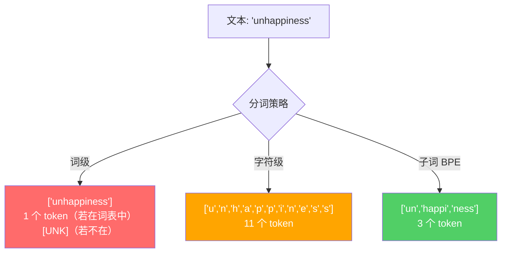
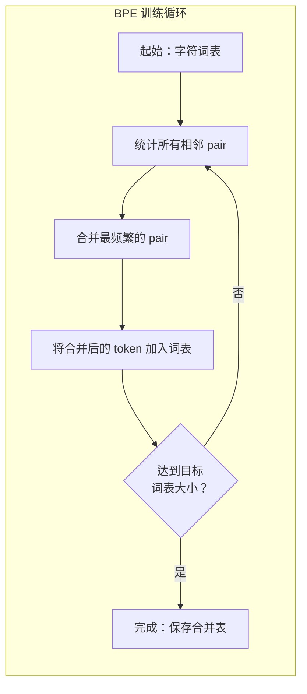
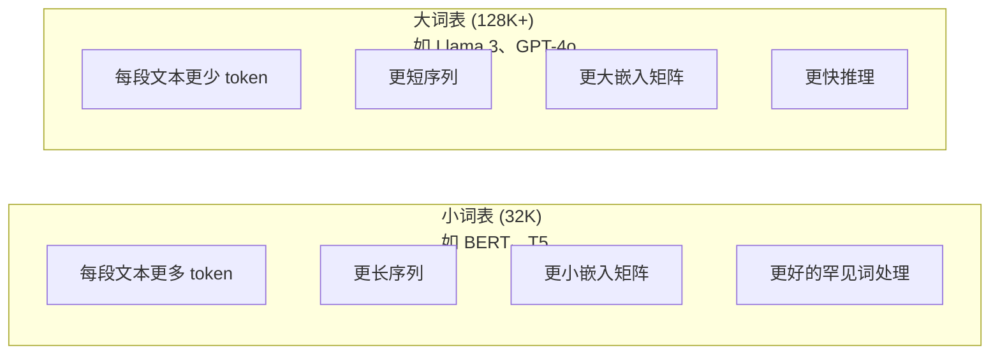

# 分词器：BPE、WordPiece、SentencePiece

> 你的大语言模型并不阅读英文。它阅读的是整数。分词器决定了这些整数是承载意义还是浪费空间。

**类型：** 构建
**语言：** Python
**前置条件：** 第 05 阶段（NLP 基础）
**时长：** ~90 分钟

## 学习目标

- 从零实现 BPE、WordPiece 和 Unigram 分词算法，并比较它们的合并策略
- 解释词表大小如何影响模型效率：太小会产生过长序列，太大会浪费嵌入参数
- 分析跨语言和代码的分词伪影，识别特定分词器在哪些情况下会失效
- 使用 tiktoken 和 sentencepiece 库对文本进行分词，并检查生成的 token ID

## 问题所在

你的大语言模型并不阅读英文。它不阅读任何语言。它阅读的是数字。

"Hello, world!" 与 [15496, 11, 995, 0] 之间的鸿沟就是分词器。每个单词、每个空格、每个标点符号都必须被转换为整数，模型才能处理它。这种转换并非中性的。它将假设固化到模型中，且日后无法撤销。

如果做错了，你的模型会浪费容量来用多个 token 编码常见词。"unfortunately" 变成四个 token 而不是一个。你的 128K 上下文窗口对于富含多音节词的文本来说，实际容量缩减了 75%。如果做对了，同样的上下文窗口可以承载两倍的信息量。"这个模型能很好地处理代码"和"这个模型在 Python 上会卡住"之间的区别，往往取决于分词器是如何训练的。

你对 GPT-4 或 Claude 发起的每次 API 调用都按 token 计费。模型生成的每个 token 都消耗算力。表示一个输出所需的 token 越少，端到端推理就越快。分词不是预处理。它是架构。

## 核心概念

### 三种失败的方案（和一种成功的）

将文本转换为数字有三种显而易见的方法。其中两种在大规模场景下不可行。

**词级分词**按空格和标点拆分。"The cat sat" 变成 ["The", "cat", "sat"]。简单。但 "tokenization" 呢？或者 "GPT-4o" 呢？或者德语复合词 "Geschwindigkeitsbegrenzung" 呢？词级分词需要庞大的词表来覆盖每种语言中的每个词。遗漏一个词，你就会得到可怕的 `[UNK]` token——模型在说"我不知道这是什么"。仅英语就有超过一百万个词形。再加上代码、URL、科学计数法和 100 种其他语言，你需要一个无限大的词表。

**字符级分词**走向另一个极端。"hello" 变成 ["h", "e", "l", "l", "o"]。词表极小（几百个字符）。永远不会出现未知 token。但序列变得极长。一个 10 个词级 token 的句子变成 50 个字符级 token。模型必须学习 "t"、"h"、"e" 合在一起表示 "the"——把注意力容量消耗在三岁小孩就会的事情上。

**子词分词**找到了最佳平衡点。常见词保持完整："the" 是一个 token。罕见词分解为有意义的片段："unhappiness" 变成 ["un", "happi", "ness"]。词表保持可控（30K 到 128K 个 token）。序列保持简短。未知 token 基本消失，因为任何词都可以由子词片段组成。

每个现代大语言模型都使用子词分词。GPT-2、GPT-4、BERT、Llama 3、Claude——全部如此。问题在于使用哪种算法。



### BPE：字节对编码

BPE 是一种被重新用于分词的贪心压缩算法。其思想简单到可以写在一张索引卡上。

从单个字符开始。统计训练语料库中每对相邻 token 的出现次数。将最频繁的 pair 合并为新 token。重复直到达到目标词表大小。

```figure
tokenizer-bpe
```

以下是 BPE 在包含 "lower"、"lowest" 和 "newest" 的小语料库上运行的过程：

语料库（含词频）：
"lower" x5
"lowest" x2
"newest" x6

步骤 0 -- 从字符开始：
l o w e r (x5)
l o w e s t (x2)
n e w e s t (x6)

步骤 1 -- 统计相邻 pair：
(e,s): 8 (s,t): 8 (l,o): 7 (o,w): 7
(w,e): 13 (e,r): 5 (n,e): 6 ...

步骤 2 -- 合并最频繁的 pair (w,e) -> "we"：
l o we r (x5)
l o we s t (x2)
n e we s t (x6)

步骤 3 -- 重新统计并合并 (e,s) -> "es"：
l o we r (x5)
l o we s t (x2) <- 'es' 只能由 'e'+'s' 组成，而非 'we'+'s'
n e we s t (x6) <- 等等，'we' 前面的 'e' 和 'we' 后面的 's'

精确追踪如下：
合并 "we" 后，剩余 pair：
(l,o): 7 (o,we): 7 (we,r): 5 (we,s): 8
(s,t): 8 (n,e): 6 (e,we): 6

步骤 3 -- 合并 (we,s) -> "wes" 或 (s,t) -> "st"（并列 8 次，取第一个）：
合并 (we,s) -> "wes"：
l o we r (x5)
l o wes t (x2)
n e wes t (x6)

步骤 4 -- 合并 (wes,t) -> "west"：
l o we r (x5)
l o west (x2)
n e west (x6)

...继续直到达到目标词表大小。
```

合并表就是分词器。要编码新文本，按学习到的顺序应用合并。训练语料库决定了存在哪些合并，而这个选择永久性地塑造了模型看到的内容。



### 字节级 BPE（GPT-2、GPT-3、GPT-4）

标准 BPE 在 Unicode 字符上操作。字节级 BPE 在原始字节（0-255）上操作。这给你一个恰好 256 的基础词表，能处理任何语言或编码，且永远不会产生未知 token。

GPT-2 引入了这种方法。基础词表覆盖每个可能的字节。BPE 合并在此基础上构建。OpenAI 的 tiktoken 库实现了字节级 BPE，词表大小如下：

- GPT-2：50,257 个 token
- GPT-3.5/GPT-4：~100,256 个 token（cl100k_base 编码）
- GPT-4o：200,019 个 token（o200k_base 编码）

### WordPiece（BERT）

WordPiece 看起来与 BPE 类似，但选择合并的方式不同。它不使用原始频率，而是最大化训练数据的似然：

```
BPE 合并准则：count(A, B)
WordPiece 合并准则：count(AB) / (count(A) * count(B))
```

BPE 问："哪对出现最频繁？"WordPiece 问："哪对比随机预期更频繁地一起出现？"这个微妙的差异产生了不同的词表。WordPiece 偏好共现令人意外的合并，而非仅仅频繁的合并。

WordPiece 还使用 "##" 前缀表示续接子词：

```
"unhappiness" -> ["un", "##happi", "##ness"]
"embedding" -> ["em", "##bed", "##ding"]
```

"##" 前缀告诉你这个片段续接前一个 token。BERT 使用 WordPiece，词表为 30,522 个 token。每个 BERT 变体——DistilBERT，RoBERTa 的分词器实际上是 BPE，但 BERT 本身是 WordPiece。

### SentencePiece（Llama、T5）

SentencePiece 将输入视为原始 Unicode 字符流，包括空白字符。没有预分词步骤。没有关于词边界的语言特定规则。这使其真正与语言无关——它适用于中文、日文、泰文和其他不以空格分词的语言。

SentencePiece 支持两种算法：
- **BPE 模式**：与标准 BPE 相同的合并逻辑，应用于原始字符序列
- **Unigram 模式**：从大词表开始，迭代地移除对整体似然影响最小的 token。与 BPE 相反——剪枝而非合并。

Llama 2 使用 SentencePiece BPE，词表为 32,000 个 token。T5 使用 SentencePiece Unigram，词表为 32,000 个 token。注意：Llama 3 切换到了基于 tiktoken 的字节级 BPE 分词器，词表为 128,256 个 token。

### 词表大小的权衡

这是一个具有可衡量后果的真实工程决策。



具体数字。对于 128K 词表和 4,096 维嵌入，仅嵌入矩阵就有 128,000 × 4,096 = 5.24 亿个参数。对于 32K 词表，是 1.31 亿个参数。仅分词器选择就造成了 4 亿参数的差异。

但更大的词表更积极地压缩文本。用 32K 词表需要 100 个 token 的英文段落，用 128K 词表可能只需 70 个 token。这意味着生成时减少 30% 的前向传播。对于服务数百万请求的模型，这是算力成本的直接降低。

趋势很明显：词表大小在增长。GPT-2 使用 50,257。GPT-4 使用 ~100K。Llama 3 使用 128K。GPT-4o 使用 200K。

| 模型 | 词表大小 | 分词器类型 | 每英文单词平均 token 数 |
|-------|-----------|----------------|---------------------------|
| BERT | 30,522 | WordPiece | ~1.4 |
| GPT-2 | 50,257 | 字节级 BPE | ~1.3 |
| Llama 2 | 32,000 | SentencePiece BPE | ~1.4 |
| GPT-4 | ~100,256 | 字节级 BPE | ~1.2 |
| Llama 3 | 128,256 | 字节级 BPE (tiktoken) | ~1.1 |
| GPT-4o | 200,019 | 字节级 BPE | ~1.0 |

### 多语言税

主要在英文上训练的分词器对其他语言非常残酷。韩文文本在 GPT-2 分词器中平均每个词 2-3 个 token。中文可能更糟。这意味着韩语用户的有效上下文窗口只有英语用户的一半——付出同样的价格，获得更低的信息密度。

这就是为什么 Llama 3 将词表从 32K 扩大到 128K，翻了四倍。更多 token 分配给非英文文字，意味着跨语言更公平的压缩。

```figure
tokenizer-tradeoff
```

## 构建它

### 步骤 1：字符级分词器

从基础开始。字符级分词器将每个字符映射到其 Unicode 码点。无需训练。无未知 token。直接映射。

```python
class CharTokenizer:
    def encode(self, text):
        return [ord(c) for c in text]

    def decode(self, tokens):
        return "".join(chr(t) for t in tokens)
```

"hello" 变成 [104, 101, 108, 108, 111]。每个字符是自己的 token。这是我们要改进的基线。

### 步骤 2：从零构建 BPE 分词器

真正的实现。我们在原始字节上训练（如 GPT-2），统计 pair，合并最频繁的，并按顺序记录每次合并。合并表就是分词器。

```python
from collections import Counter

class BPETokenizer:
    def __init__(self):
        self.merges = {}
        self.vocab = {}

    def _get_pairs(self, tokens):
        pairs = Counter()
        for i in range(len(tokens) - 1):
            pairs[(tokens[i], tokens[i + 1])] += 1
        return pairs

    def _merge_pair(self, tokens, pair, new_token):
        merged = []
        i = 0
        while i < len(tokens):
            if i < len(tokens) - 1 and tokens[i] == pair[0] and tokens[i + 1] == pair[1]:
                merged.append(new_token)
                i += 2
            else:
                merged.append(tokens[i])
                i += 1
        return merged

    def train(self, text, num_merges):
        tokens = list(text.encode("utf-8"))
        self.vocab = {i: bytes([i]) for i in range(256)}

        for i in range(num_merges):
            pairs = self._get_pairs(tokens)
            if not pairs:
                break
            best_pair = max(pairs, key=pairs.get)
            new_token = 256 + i
            tokens = self._merge_pair(tokens, best_pair, new_token)
            self.merges[best_pair] = new_token
            self.vocab[new_token] = self.vocab[best_pair[0]] + self.vocab[best_pair[1]]

        return self

    def encode(self, text):
        tokens = list(text.encode("utf-8"))
        for pair, new_token in self.merges.items():
            tokens = self._merge_pair(tokens, pair, new_token)
        return tokens

    def decode(self, tokens):
        byte_sequence = b"".join(self.vocab[t] for t in tokens)
        return byte_sequence.decode("utf-8", errors="replace")
```

训练循环是 BPE 的核心：统计 pair，合并胜者，重复。每次合并减少总 token 数。经过 `num_merges` 轮后，词表从 256（基础字节）增长到 256 + num_merges。

编码按学习的确切顺序应用合并。这很重要。如果合并 1 创建了 "th"，合并 5 创建了 "the"，编码必须先应用合并 1，这样 "the" 才能在合并 5 中由 "th" + "e" 形成。

解码是逆过程：在词表中查找每个 token ID，拼接字节，解码为 UTF-8。

### 步骤 3：编码与解码的往返验证

```python
corpus = (
    "The cat sat on the mat. The cat ate the rat. "
    "The dog sat on the log. The dog ate the frog. "
    "Natural language processing is the study of how computers "
    "understand and generate human language. "
    "Tokenization is the first step in any NLP pipeline."
)

tokenizer = BPETokenizer()
tokenizer.train(corpus, num_merges=40)

test_sentences = [
    "The cat sat on the mat.",
    "Natural language processing",
    "tokenization pipeline",
    "unhappiness",
]

for sentence in test_sentences:
    encoded = tokenizer.encode(sentence)
    decoded = tokenizer.decode(encoded)
    raw_bytes = len(sentence.encode("utf-8"))
    ratio = len(encoded) / raw_bytes
    print(f"'{sentence}'")
    print(f" Tokens: {len(encoded)} (from {raw_bytes} bytes) -- ratio: {ratio:.2f}")
    print(f" Roundtrip: {'PASS' if decoded == sentence else 'FAIL'}")
```

压缩比告诉你分词器的效率。0.50 的比率意味着分词器将文本压缩到原始字节数一半的 token 数。越低越好。在训练语料库上，压缩比会很好。在分布外文本如 "unhappiness"（不出现在语料库中）上，压缩比会更差——分词器回退到字符级编码来处理未见模式。

### 步骤 4：与 tiktoken 比较

```python
import tiktoken

enc = tiktoken.get_encoding("cl100k_base")

texts = [
    "The cat sat on the mat.",
    "unhappiness",
    "Hello, world!",
    "def fibonacci(n): return n if n < 2 else fibonacci(n-1) + fibonacci(n-2)",
    "Geschwindigkeitsbegrenzung",
]

for text in texts:
    our_tokens = tokenizer.encode(text)
    tiktoken_tokens = enc.encode(text)
    tiktoken_pieces = [enc.decode([t]) for t in tiktoken_tokens]
    print(f"'{text}'")
    print(f" Our BPE: {len(our_tokens)} tokens")
    print(f" tiktoken: {len(tiktoken_tokens)} tokens -> {tiktoken_pieces}")
```

tiktoken 使用完全相同的算法，但在数百 GB 的文本上训练，有 100,000 次合并。算法是相同的。区别在于训练数据和合并次数。你在一段文本上用 40 次合并训练的分词器无法与 tiktoken 在大规模语料上的 100K 次合并竞争。但机制是相同的。

### 步骤 5：词表分析

```python
def analyze_vocabulary(tokenizer, test_texts):
    total_tokens = 0
    total_chars = 0
    token_usage = Counter()

    for text in test_texts:
        encoded = tokenizer.encode(text)
        total_tokens += len(encoded)
        total_chars += len(text)
        for t in encoded:
            token_usage[t] += 1

    print(f"Vocabulary size: {len(tokenizer.vocab)}")
    print(f"Total tokens across all texts: {total_tokens}")
    print(f"Total characters: {total_chars}")
    print(f"Avg tokens per character: {total_tokens / total_chars:.2f}")

    print(f"\nMost used tokens:")
    for token_id, count in token_usage.most_common(10):
        token_bytes = tokenizer.vocab[token_id]
        display = token_bytes.decode("utf-8", errors="replace")
        print(f" Token {token_id:4d}: '{display}' (used {count} times)")

    unused = [t for t in tokenizer.vocab if t not in token_usage]
    print(f"\nUnused tokens: {len(unused)} out of {len(tokenizer.vocab)}")
```

这揭示了词表中的 Zipf 分布。少数 token 占主导地位（空格、"the"、"e"）。大多数 token 很少使用。生产分词器针对这种分布进行优化——常见模式获得短 token ID，罕见模式获得更长的表示。

## 使用它

你的手写 BPE 可以工作了。现在看看生产工具是什么样的。

### tiktoken（OpenAI）

```python
import tiktoken

enc = tiktoken.get_encoding("cl100k_base")

text = "Tokenizers convert text to integers"
tokens = enc.encode(text)
print(f"Tokens: {tokens}")
print(f"Pieces: {[enc.decode([t]) for t in tokens]}")
print(f"Roundtrip: {enc.decode(tokens)}")
```

tiktoken 用 Rust 编写，提供 Python 绑定。每秒编码数百万 token。相同的 BPE 算法，工业级实现。

### Hugging Face tokenizers

```python
from tokenizers import Tokenizer
from tokenizers.models import BPE
from tokenizers.trainers import BpeTrainer
from tokenizers.pre_tokenizers import ByteLevel

tokenizer = Tokenizer(BPE())
tokenizer.pre_tokenizer = ByteLevel()

trainer = BpeTrainer(vocab_size=1000, special_tokens=["<pad>", "<eos>", "<unk>"])
tokenizer.train(["corpus.txt"], trainer)

output = tokenizer.encode("The cat sat on the mat.")
print(f"Tokens: {output.tokens}")
print(f"IDs: {output.ids}")
```

Hugging Face tokenizers 库底层也是 Rust。它能在数秒内在 GB 级语料库上训练 BPE。这是训练自己的模型时使用的工具。

### 加载 Llama 的分词器

```python
from transformers import AutoTokenizer

tokenizer = AutoTokenizer.from_pretrained("meta-llama/Llama-3.1-8B")

text = "Tokenizers are the unsung heroes of LLMs"
tokens = tokenizer.encode(text)
print(f"Token IDs: {tokens}")
print(f"Tokens: {tokenizer.convert_ids_to_tokens(tokens)}")
print(f"Vocab size: {tokenizer.vocab_size}")

multilingual = ["Hello world", "Hola mundo", "Bonjour le monde"]
for text in multilingual:
    ids = tokenizer.encode(text)
    print(f"'{text}' -> {len(ids)} tokens")
```

Llama 3 的 128K 词表在压缩非英文文本方面明显优于 GPT-2 的 50K 词表。你可以自己验证——用多种语言编码同一个句子并统计 token 数。

## 交付它

本课程产出 `outputs/prompt-tokenizer-analyzer.md`——一个可复用的提示词，用于分析任意文本和模型组合的分词效率。给它一段文本样本，它会告诉你哪个模型的分词器处理得最好。

## 练习

1. 修改 BPE 分词器，在每次合并步骤时打印词表。观察 "t" + "h" 如何变成 "th"，然后 "th" + "e" 如何变成 "the"。追踪常见英文单词是如何一步步组装的。

2. 向 BPE 分词器添加特殊 token（`<pad>`、`<eos>`、`<unk>`）。为它们分配 ID 0、1、2，并相应地移动所有其他 token。实现一个在运行 BPE 之前按空格拆分的预分词步骤。

3. 实现 WordPiece 合并准则（似然比而非频率）。在相同语料库上用相同合并次数训练 BPE 和 WordPiece。比较生成的词表——哪个产生更多语言学上有意义的子词？

4. 构建多语言分词器效率基准测试。取 10 个英文、西班牙文、中文、韩文和阿拉伯文句子。用 tiktoken（cl100k_base）对每个进行分词，测量每字符平均 token 数。量化每种语言的"多语言税"。

5. 在更大的语料库上训练你的 BPE 分词器（下载一篇维基百科文章）。调整合并次数，使压缩比在该文本上与 tiktoken 相差不超过 10%。这迫使你理解语料库大小、合并次数和压缩质量之间的关系。

## 关键术语

| 术语 | 人们常说的 | 实际含义 |
|------|----------------|----------------------|
| Token | "一个词" | 模型词表中的一个单元——可以是字符、子词、词或多词片段 |
| BPE | "某种压缩方法" | 字节对编码——迭代地合并最频繁的相邻 token pair，直到达到目标词表大小 |
| WordPiece | "BERT 的分词器" | 类似 BPE，但合并最大化似然比 count(AB)/(count(A)*count(B)) 而非原始频率 |
| SentencePiece | "一个分词器库" | 与语言无关的分词器，在原始 Unicode 上操作，无需预分词，支持 BPE 和 Unigram 算法 |
| Vocabulary size | "它认识多少词" | 唯一 token 的总数：GPT-2 有 50,257 个，BERT 有 30,522 个，Llama 3 有 128,256 个 |
| Fertility | "不是分词器术语" | 每词平均 token 数——衡量跨语言的分词器效率（1.0 为完美，3.0 意味着模型工作量大三倍） |
| Byte-level BPE | "GPT 的分词器" | 在原始字节（0-255）而非 Unicode 字符上操作的 BPE，保证任何输入都不会产生未知 token |
| Merge table | "分词器文件" | 训练期间学习到的 pair 合并有序列表——这就是分词器本身，顺序很重要 |
| Pre-tokenization | "按空格拆分" | 子词分词之前应用的规则：空格拆分、数字分离、标点处理 |
| Compression ratio | "分词器效率如何" | 生成的 token 数除以输入字节数——越低意味着压缩越好、推理越快 |

## 延伸阅读

- [Sennrich et al., 2016 -- "Neural Machine Translation of Rare Words with Subword Units"](https://arxiv.org/abs/1508.07909) -- 将 BPE 引入 NLP 的论文，将 1994 年的压缩算法转变为现代分词的基础
- [Kudo & Richardson, 2018 -- "SentencePiece: A simple and language independent subword tokenizer"](https://arxiv.org/abs/1808.06226) -- 与语言无关的分词，使多语言模型变得可行
- [OpenAI tiktoken 仓库](https://github.com/openai/tiktoken) -- Rust 中的生产级 BPE 实现，提供 Python 绑定，被 GPT-3.5/4/4o 使用
- [Hugging Face Tokenizers 文档](https://huggingface.co/docs/tokenizers) -- 具有 Rust 性能的生产级分词器训练
