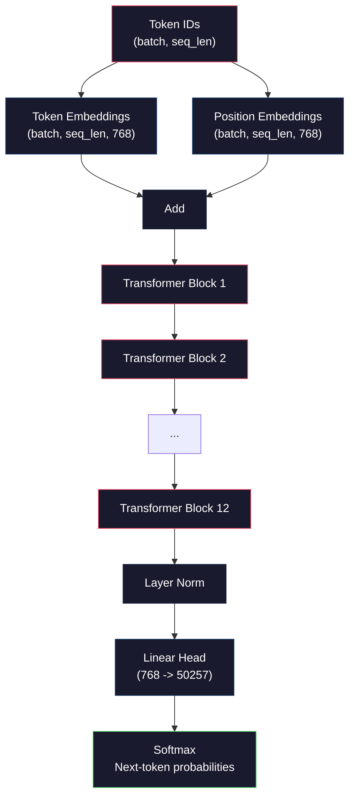
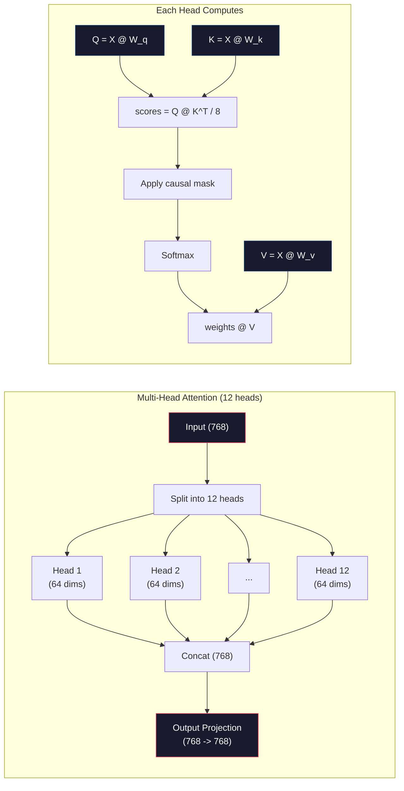
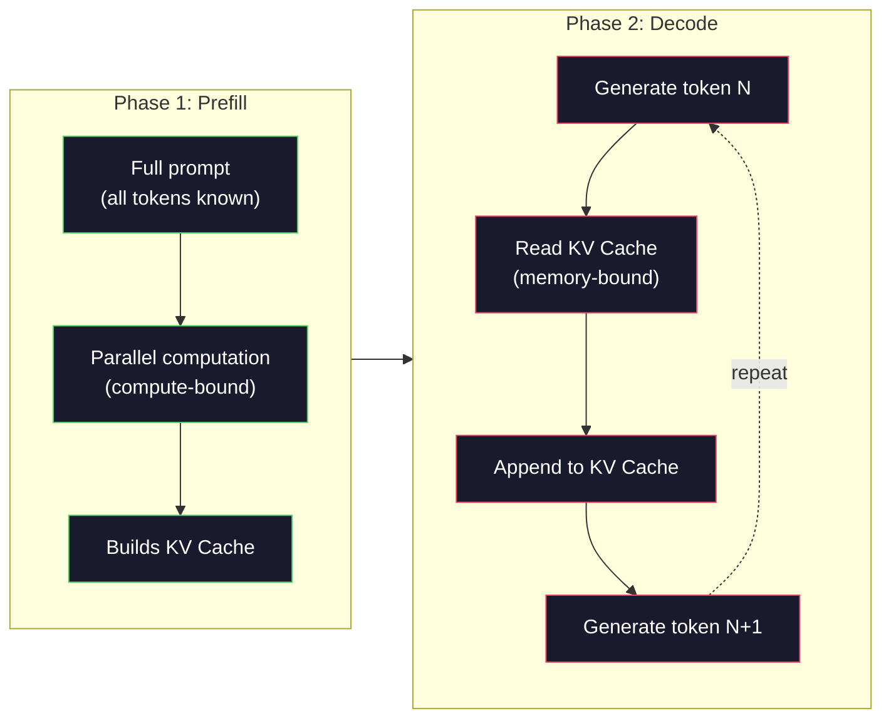

# 预训练一个小型 GPT（124M 参数）

> GPT-2 Small 拥有 1.24 亿个参数。12 个 transformer 层，12 个注意力头，768 维嵌入。你可以在单张 GPU 上用几小时从零开始训练它。大多数人从未这样做过——他们使用预训练好的检查点。但如果你不亲手训练一个，你实际上并不理解你所构建产品背后的模型内部到底发生了什么。

**类型:** Build
**语言:** Python (使用 numpy)
**前置知识:** Phase 10, 课程 01-03 (Tokenizers, Building a Tokenizer, Data Pipelines)
**时间:** ~120 分钟

## 学习目标

- 从零实现完整的 GPT-2 架构（124M 参数）：token 嵌入、位置嵌入、transformer 块和语言模型头
- 使用下一个 token 预测和交叉熵损失在文本语料上训练 GPT 模型
- 实现带温度采样和 top-k/top-p 过滤的自回归文本生成
- 监控训练损失曲线，验证模型是否学习到连贯的语言模式

## 问题

你知道 transformer 是什么。你看过那些图。你能背诵"注意力就是一切"，并在白板上画出标有"多头注意力"的方框。

但这些都不意味着你理解模型生成文本时实际发生了什么。

GPT-2 Small（采用权重绑定）中有 124,438,272 个参数。每一个参数都是通过运行训练循环设置的：前向传播、计算损失、反向传播、更新权重。十二个 transformer 块。每块十二个注意力头。768 维嵌入空间。50,257 个 token 的词汇表。每次模型生成一个 token，所有 1.24 亿个参数都参与到一个矩阵乘法链中，该链将一串 token ID 转换为下一个 token 的概率分布。

如果你从未亲手构建过这个，你就是在用黑盒工作。你可以调用 API，可以微调。但当问题出现时——模型产生幻觉、重复输出、拒绝遵循指令——你对*为什么*发生这些问题没有任何心智模型。

本课程从零开始构建 GPT-2 Small。不是在 PyTorch 中，而是在 numpy 中。每个矩阵乘法都清晰可见。每个梯度都由你的代码计算。你将亲眼看到 1.24 亿个数字如何协同预测下一个词。

## 概念

### GPT 架构

GPT 是一个自回归语言模型。"自回归"意味着它一次生成一个 token，每个 token 都以所有之前的 token 为条件。该架构是一叠 transformer 解码器块。

以下是从 token ID 到下一个 token 概率的完整计算图：

1. 输入 token ID。形状：(batch_size, seq_len)。
2. Token 嵌入查找。每个 ID 映射到 768 维向量。形状：(batch_size, seq_len, 768)。
3. 位置嵌入查找。每个位置 (0, 1, 2, ...) 映射到 768 维向量。形状相同。
4. 将 token 嵌入与位置嵌入相加。
5. 通过 12 个 transformer 块。
6. 最终层归一化。
7. 线性投影到词汇表大小。形状：(batch_size, seq_len, vocab_size)。
8. Softmax 获取概率。

这就是整个模型。没有卷积。没有循环。只有嵌入、注意力、前馈网络和层归一化，堆叠 12 次。



### Transformer 块

12 个块中的每一个都遵循相同的模式。Pre-norm 架构（GPT-2 使用 pre-norm，而不是原始 transformer 的 post-norm）：

1. LayerNorm
2. 多头自注意力
3. 残差连接（加回输入）
4. LayerNorm
5. 前馈网络（MLP）
6. 残差连接（加回输入）

残差连接至关重要。没有它们，梯度在反向传播到达第 1 块之前就会消失。有了它们，梯度可以通过"跳跃"路径直接从损失流向任何一层。这就是为什么你可以堆叠 12、32 甚至 96 个块（GPT-4 据传使用了 120 个）。

### 注意力：核心机制

自注意力让每个 token 可以查看所有之前的 token，并决定对每个 token 的关注程度。以下是数学原理。

对于每个 token 位置，从输入计算三个向量：

- **Query (Q)**："我在找什么？"
- **Key (K)**："我包含什么？"
- **Value (V)**："我携带什么信息？"

```
Q = input @ W_q    (768 -> 768)
K = input @ W_k    (768 -> 768)
V = input @ W_v    (768 -> 768)

attention_scores = Q @ K^T / sqrt(d_k)
attention_scores = mask(attention_scores)   # 因果掩码：未来位置设为 -inf
attention_weights = softmax(attention_scores)
output = attention_weights @ V
```

因果掩码是使 GPT 成为自回归模型的关键。位置 5 可以关注位置 0-5，但不能关注 6、7、8 等。这防止了模型在训练时通过"偷看"未来 token 来作弊。

**多头注意力**将 768 维空间拆分为 12 个头，每个头 64 维。每个头学习不同的注意力模式。一个头可能跟踪句法关系（主谓一致）。另一个可能跟踪语义相似性（同义词）。还有一个可能跟踪位置邻近性（附近的词）。所有 12 个头的输出被拼接并投影回 768 维。



除以 sqrt(d_k)——sqrt(64) = 8——是缩放操作。没有它，高维向量的点积会变得很大，将 softmax 推入梯度几乎为零的区域。这是原始论文《Attention Is All You Need》中的关键洞见之一。

### KV 缓存：为什么推理很快

在训练期间，你一次性处理整个序列。在推理期间，你一次生成一个 token。如果没有优化，生成第 N 个 token 需要重新计算所有 N-1 个之前 token 的注意力。对于长度为 N 的序列，每个生成 token 的代价是 O(N^2)，总计 O(N^3)。

KV 缓存解决了这个问题。在计算每个 token 的 K 和 V 后，将它们存储起来。当生成第 N+1 个 token 时，你只需要计算新 token 的 Q，然后从缓存中查找之前所有 token 的 K 和 V。这将每个 token 的 K 和 V 计算成本从 O(N) 降低到 O(1)。注意力分数计算仍然是 O(N)，因为你需要关注所有之前的位置，但你避免了输入上的冗余矩阵乘法。

对于 GPT-2（12 层，12 头），KV 缓存每个 token 存储 2 (K + V) × 12 层 × 12 头 × 64 维 = 18,432 个值。对于 1024 token 的序列，FP32 下约为 75MB。对于 Llama 3 405B（128 层），单个序列的 KV 缓存可能超过 10GB。这就是长上下文推理受限于内存的原因。

### Prefill 与 Decode：推理的两个阶段

当你向 LLM 发送提示时，推理分两个不同的阶段进行。

**Prefill** 并行处理你的整个提示。所有 token 都是已知的，因此模型可以同时计算所有位置的注意力。这个阶段受计算能力限制——GPU 以满吞吐量进行矩阵乘法运算。对于 A100 上 1000 token 的提示，prefill 大约需要 20-50ms。

**Decode** 一次生成一个 token。每个新 token 依赖于所有之前的 token。这个阶段受内存限制——瓶颈是从 GPU 内存读取模型权重和 KV 缓存，而不是矩阵数学本身。GPU 的计算核心在等待内存读取时大部分处于空闲状态。对于 GPT-2，每个 decode 步骤所需的时间大致相同，无论矩阵乘法需要多少 FLOPs，因为内存带宽是约束条件。

这个区别对生产系统很重要。Prefill 吞吐量随 GPU 计算能力扩展（更多 FLOPS = 更快的 prefill）。Decode 吞吐量随内存带宽扩展（更快的内存 = 更快的 decode）。这就是为什么 NVIDIA 的 H100 专注于相比 A100 改进内存带宽——它直接加快了 token 生成速度。



### 训练循环

训练 LLM 就是下一个 token 预测。给定 token [0, 1, 2, ..., N-1]，预测 token [1, 2, 3, ..., N]。损失函数是模型预测的概率分布与实际下一个 token 之间的交叉熵。

一个训练步骤：

1. **前向传播**：将 batch 通过所有 12 个块。获取每个位置的 logits（softmax 之前的分数）。
2. **计算损失**：logits 与目标 token（输入向右偏移一个位置）之间的交叉熵。
3. **反向传播**：使用反向传播计算所有 124M 参数的梯度。
4. **优化器步骤**：更新权重。GPT-2 使用 Adam，带学习率预热和余弦衰减。

学习率调度比你想象的更重要。GPT-2 在前 2,000 步从 0 预热到峰值学习率，然后按余弦曲线衰减。以高学习率开始会导致模型发散。保持恒定高学习率会在后续训练中引起振荡。这种预热后衰减的模式被每个主要 LLM 所使用。

### GPT-2 Small：各项数据

| 组件 | 形状 | 参数量 |
|-----------|-------|------------|
| Token 嵌入 | (50257, 768) | 38,597,376 |
| 位置嵌入 | (1024, 768) | 786,432 |
| 每块注意力 (W_q, W_k, W_v, W_out) | 4 x (768, 768) | 2,359,296 |
| 每块 FFN (up + down) | (768, 3072) + (3072, 768) | 4,718,592 |
| 每块 LayerNorm (2x) | 2 x 768 x 2 | 3,072 |
| 最终 LayerNorm | 768 x 2 | 1,536 |
| **每块合计** | | **7,080,960** |
| **总计（12块）** | | **85,054,464 + 39,383,808 = 124,438,272** |

输出投影（logits 头）与 token 嵌入矩阵共享权重。这称为权重绑定——它减少了 38M 参数，并提升了性能，因为它迫使模型在输入和输出上使用相同的表示空间。

## 构建它

### 第 1 步：嵌入层

Token 嵌入将 50,257 个可能的 token 中的每一个映射到 768 维向量。位置嵌入添加了关于每个 token 在序列中位置的信息。两者相加。

```python
import numpy as np

class Embedding:
    def __init__(self, vocab_size, embed_dim, max_seq_len):
        self.token_embed = np.random.randn(vocab_size, embed_dim) * 0.02
        self.pos_embed = np.random.randn(max_seq_len, embed_dim) * 0.02

    def forward(self, token_ids):
        seq_len = token_ids.shape[-1]
        tok_emb = self.token_embed[token_ids]
        pos_emb = self.pos_embed[:seq_len]
        return tok_emb + pos_emb
```

初始化时使用 0.02 的标准差来自 GPT-2 论文。太大则初始前向传播会产生极端值，破坏训练稳定性。太小则初始输出对所有输入几乎相同，使早期梯度信号毫无用处。

### 第 2 步：带因果掩码的自注意力

首先是单头注意力。因果掩码在 softmax 之前将未来位置设为负无穷，确保每个位置只能关注自身和更早的位置。

```python
def attention(Q, K, V, mask=None):
    d_k = Q.shape[-1]
    scores = Q @ K.transpose(0, -1, -2 if Q.ndim == 4 else 1) / np.sqrt(d_k)
    if mask is not None:
        scores = scores + mask
    weights = np.exp(scores - scores.max(axis=-1, keepdims=True))
    weights = weights / weights.sum(axis=-1, keepdims=True)
    return weights @ V
```

softmax 实现在指数化之前减去最大值。没有这一步，exp(大数) 会溢出到无穷大。这是一个数值稳定性技巧，不会改变输出，因为对于任何常数 c，softmax(x - c) = softmax(x)。

### 第 3 步：多头注意力

将 768 维输入拆分为 12 个头，每个头 64 维。每个头独立计算注意力。拼接结果并投影回 768 维。

```python
class MultiHeadAttention:
    def __init__(self, embed_dim, num_heads):
        self.num_heads = num_heads
        self.head_dim = embed_dim // num_heads
        self.W_q = np.random.randn(embed_dim, embed_dim) * 0.02
        self.W_k = np.random.randn(embed_dim, embed_dim) * 0.02
        self.W_v = np.random.randn(embed_dim, embed_dim) * 0.02
        self.W_out = np.random.randn(embed_dim, embed_dim) * 0.02

    def forward(self, x, mask=None):
        batch, seq_len, d = x.shape
        Q = (x @ self.W_q).reshape(batch, seq_len, self.num_heads, self.head_dim).transpose(0, 2, 1, 3)
        K = (x @ self.W_k).reshape(batch, seq_len, self.num_heads, self.head_dim).transpose(0, 2, 1, 3)
        V = (x @ self.W_v).reshape(batch, seq_len, self.num_heads, self.head_dim).transpose(0, 2, 1, 3)

        scores = Q @ K.transpose(0, 1, 3, 2) / np.sqrt(self.head_dim)
        if mask is not None:
            scores = scores + mask
        weights = np.exp(scores - scores.max(axis=-1, keepdims=True))
        weights = weights / weights.sum(axis=-1, keepdims=True)
        attn_out = weights @ V

        attn_out = attn_out.transpose(0, 2, 1, 3).reshape(batch, seq_len, d)
        return attn_out @ self.W_out
```

reshape-transpose-reshape 的变换是多头注意力中最令人困惑的部分。过程如下：(batch, seq_len, 768) 张量变成 (batch, seq_len, 12, 64)，然后变成 (batch, 12, seq_len, 64)。现在 12 个头中的每一个都有自己的 (seq_len, 64) 矩阵来运行注意力。注意力计算之后，我们逆转这个过程：(batch, 12, seq_len, 64) 变成 (batch, seq_len, 12, 64)，再变成 (batch, seq_len, 768)。

### 第 4 步：Transformer 块

一个完整的 transformer 块：LayerNorm、带残差的多头注意力、LayerNorm、带残差的前馈网络。

```python
class LayerNorm:
    def __init__(self, dim, eps=1e-5):
        self.gamma = np.ones(dim)
        self.beta = np.zeros(dim)
        self.eps = eps

    def forward(self, x):
        mean = x.mean(axis=-1, keepdims=True)
        var = x.var(axis=-1, keepdims=True)
        return self.gamma * (x - mean) / np.sqrt(var + self.eps) + self.beta


class FeedForward:
    def __init__(self, embed_dim, ff_dim):
        self.W1 = np.random.randn(embed_dim, ff_dim) * 0.02
        self.b1 = np.zeros(ff_dim)
        self.W2 = np.random.randn(ff_dim, embed_dim) * 0.02
        self.b2 = np.zeros(embed_dim)

    def forward(self, x):
        h = x @ self.W1 + self.b1
        h = np.maximum(0, h)  # GELU 近似：为简化使用 ReLU
        return h @ self.W2 + self.b2


class TransformerBlock:
    def __init__(self, embed_dim, num_heads, ff_dim):
        self.ln1 = LayerNorm(embed_dim)
        self.attn = MultiHeadAttention(embed_dim, num_heads)
        self.ln2 = LayerNorm(embed_dim)
        self.ffn = FeedForward(embed_dim, ff_dim)

    def forward(self, x, mask=None):
        x = x + self.attn.forward(self.ln1.forward(x), mask)
        x = x + self.ffn.forward(self.ln2.forward(x))
        return x
```

前馈网络将 768 维输入扩展到 3,072 维（4 倍），应用非线性变换，然后投影回 768 维。这种扩展-收缩模式为模型在每个位置上提供了更"宽"的内部表示。GPT-2 使用 GELU 激活函数，但这里为简化使用 ReLU——对于理解架构而言，差异很小。

### 第 5 步：完整 GPT 模型

堆叠 12 个 transformer 块。在前面加上嵌入层，在后面加上输出投影。

```python
class MiniGPT:
    def __init__(self, vocab_size=50257, embed_dim=768, num_heads=12,
                 num_layers=12, max_seq_len=1024, ff_dim=3072):
        self.embedding = Embedding(vocab_size, embed_dim, max_seq_len)
        self.blocks = [
            TransformerBlock(embed_dim, num_heads, ff_dim)
            for _ in range(num_layers)
        ]
        self.ln_f = LayerNorm(embed_dim)
        self.vocab_size = vocab_size
        self.embed_dim = embed_dim

    def forward(self, token_ids):
        seq_len = token_ids.shape[-1]
        mask = np.triu(np.full((seq_len, seq_len), -1e9), k=1)

        x = self.embedding.forward(token_ids)
        for block in self.blocks:
            x = block.forward(x, mask)
        x = self.ln_f.forward(x)

        logits = x @ self.embedding.token_embed.T
        return logits

    def count_parameters(self):
        total = 0
        total += self.embedding.token_embed.size
        total += self.embedding.pos_embed.size
        for block in self.blocks:
            total += block.attn.W_q.size + block.attn.W_k.size
            total += block.attn.W_v.size + block.attn.W_out.size
            total += block.ffn.W1.size + block.ffn.b1.size
            total += block.ffn.W2.size + block.ffn.b2.size
            total += block.ln1.gamma.size + block.ln1.beta.size
            total += block.ln2.gamma.size + block.ln2.beta.size
        total += self.ln_f.gamma.size + self.ln_f.beta.size
        return total
```

注意权重绑定：`logits = x @ self.embedding.token_embed.T`。输出投影重用 token 嵌入矩阵（转置）。这不仅仅是一个节省参数的技巧——它意味着模型使用相同的向量空间来理解 token（嵌入）和预测它们（输出）。

### 第 6 步：训练循环

对于 124M 参数的实际训练运行，你需要 GPU 和 PyTorch。本训练循环在一个运行纯 numpy 的小模型上演示了其机制。我们使用一个小型模型（4 层，4 头，128 维）使其易于处理。

```python
def cross_entropy_loss(logits, targets):
    batch, seq_len, vocab_size = logits.shape
    logits_flat = logits.reshape(-1, vocab_size)
    targets_flat = targets.reshape(-1)

    max_logits = logits_flat.max(axis=-1, keepdims=True)
    log_softmax = logits_flat - max_logits - np.log(
        np.exp(logits_flat - max_logits).sum(axis=-1, keepdims=True)
    )

    loss = -log_softmax[np.arange(len(targets_flat)), targets_flat].mean()
    return loss


def train_mini_gpt(text, vocab_size=256, embed_dim=128, num_heads=4,
                   num_layers=4, seq_len=64, num_steps=200, lr=3e-4):
    tokens = np.array(list(text.encode("utf-8")[:2048]))
    model = MiniGPT(
        vocab_size=vocab_size, embed_dim=embed_dim, num_heads=num_heads,
        num_layers=num_layers, max_seq_len=seq_len, ff_dim=embed_dim * 4
    )

    print(f"Model parameters: {model.count_parameters():,}")
    print(f"Training tokens: {len(tokens):,}")
    print(f"Config: {num_layers} layers, {num_heads} heads, {embed_dim} dims")
    print()

    for step in range(num_steps):
        start_idx = np.random.randint(0, max(1, len(tokens) - seq_len - 1))
        batch_tokens = tokens[start_idx:start_idx + seq_len + 1]

        input_ids = batch_tokens[:-1].reshape(1, -1)
        target_ids = batch_tokens[1:].reshape(1, -1)

        logits = model.forward(input_ids)
        loss = cross_entropy_loss(logits, target_ids)

        if step % 20 == 0:
            print(f"Step {step:4d} | Loss: {loss:.4f}")

    return model
```

损失起始值接近 ln(vocab_size)——对于 256 token 的字节级词汇表，即 ln(256) = 5.55。随机模型对每个 token 赋予相等的概率。随着训练的进行，损失下降，因为模型学会了预测常见模式："t"后面的"th"、句号后面的空格，等等。

在生产中，你会使用 Adam 优化器配合梯度累积、学习率预热和梯度裁剪。前向传播-损失-反向传播-更新的循环是相同的，但优化器更复杂。

### 第 7 步：文本生成

生成使用训练好的模型一次预测一个 token。每个预测都是从输出分布中采样（或贪婪地取 argmax）。

```python
def generate(model, prompt_tokens, max_new_tokens=100, temperature=0.8):
    tokens = list(prompt_tokens)
    seq_len = model.embedding.pos_embed.shape[0]

    for _ in range(max_new_tokens):
        context = np.array(tokens[-seq_len:]).reshape(1, -1)
        logits = model.forward(context)
        next_logits = logits[0, -1, :]

        next_logits = next_logits / temperature
        probs = np.exp(next_logits - next_logits.max())
        probs = probs / probs.sum()

        next_token = np.random.choice(len(probs), p=probs)
        tokens.append(next_token)

    return tokens
```

Temperature 控制随机性。Temperature 1.0 使用原始分布。Temperature 0.5 使其更尖锐（更确定性——模型更常选择其最佳选项）。Temperature 1.5 使其更平坦（更随机——低概率 token 获得更大机会）。Temperature 0.0 是贪婪解码（总是选择最高概率的 token）。

`tokens[-seq_len:]` 窗口是必要的，因为模型有最大上下文长度（GPT-2 为 1024）。一旦超过，你必须丢弃最早的 token。这就是大家都在谈论的"上下文窗口"。

```figure
sampling-decoder
```

## 使用它

### 完整训练和生成演示

```python
corpus = """The transformer architecture has revolutionized natural language processing.
Attention mechanisms allow the model to focus on relevant parts of the input.
Self-attention computes relationships between all pairs of positions in a sequence.
Multi-head attention splits the representation into multiple subspaces.
Each attention head can learn different types of relationships.
The feedforward network provides nonlinear transformations at each position.
Residual connections enable gradient flow through deep networks.
Layer normalization stabilizes training by normalizing activations.
Position embeddings give the model information about token ordering.
The causal mask ensures autoregressive generation during training.
Pre-training on large text corpora teaches the model general language understanding.
Fine-tuning adapts the pre-trained model to specific downstream tasks."""

model = train_mini_gpt(corpus, num_steps=200)

prompt = list("The transformer".encode("utf-8"))
output_tokens = generate(model, prompt, max_new_tokens=100, temperature=0.8)
generated_text = bytes(output_tokens).decode("utf-8", errors="replace")
print(f"\nGenerated: {generated_text}")
```

在小语料和小模型上，生成的文本最多只会是半连贯的。它会从训练文本中学习一些字节级模式，但无法像 GPT-2 那样使用 40GB 训练数据和完整的 124M 参数架构进行泛化。重点不在于输出质量，而在于你可以追踪每一步：嵌入查找、注意力计算、前馈变换、logit 投影、softmax 和采样。每个操作都是可见的。

## 交付它

本课程产出 `outputs/prompt-gpt-architecture-analyzer.md`——一个用于分析任何 GPT 风格模型架构选择的提示词。给它一个模型卡片或技术报告，它会分解参数分配、注意力设计和扩展决策。

## 练习

1. 将模型修改为使用 24 层和 16 头而不是 12/12。计算参数量。将深度加倍与将宽度（嵌入维度）加倍相比如何？

2. 实现 GELU 激活函数（GELU(x) = x * 0.5 * (1 + erf(x / sqrt(2)))) 并替换前馈网络中的 ReLU。使用每种激活函数训练 500 步，比较最终损失。

3. 为生成函数添加 KV 缓存。在第一次前向传播后存储每层的 K 和 V 张量，并在后续 token 中重用它们。测量加速效果：分别使用和不使用缓存生成 200 个 token，比较实际时间。

4. 实现 top-k 采样（只考虑 k 个最高概率的 token）和 top-p 采样（核采样：考虑累积概率超过 p 的最小 token 集合）。比较在 temperature 0.8 下 top-k=50 与 top-p=0.95 的输出质量。

5. 构建一个训练损失曲线绘制器。训练模型 1000 步并绘制损失随步数的变化。识别三个阶段：快速初始下降（学习常见字节）、较慢的中间阶段（学习字节模式）和平稳期（在小语料上过拟合）。无论你是在训练 128 维模型还是 GPT-4，这条曲线的形状都是一样的。

## 关键术语

| 术语 | 人们怎么说 | 实际含义 |
|------|----------------|----------------------|
| 自回归 | "它一次生成一个词" | 每个输出 token 以所有之前 token 为条件——模型预测 P(token_n \| token_0, ..., token_{n-1}) |
| 因果掩码 | "它无法看到未来" | 一个上三角矩阵，填充 -infinity 值，防止训练期间关注未来位置 |
| 多头注意力 | "多种注意力模式" | 将 Q、K、V 拆分为并行的头（例如 GPT-2 的 12 个头，每头 64 维），使每个头能学习不同类型的关系 |
| KV 缓存 | "缓存加速" | 存储已计算的 Key 和 Value 张量，避免自回归生成期间重复计算 |
| Prefill | "处理提示" | 第一个推理阶段，所有提示 token 被并行处理——受 GPU FLOPS 计算能力限制 |
| Decode | "生成 token" | 第二个推理阶段，token 一次生成一个——受 GPU 内存带宽限制 |
| 权重绑定 | "共享嵌入" | 输入 token 嵌入和输出投影头使用相同的矩阵——在 GPT-2 中节省 38M 参数 |
| 残差连接 | "跳跃连接" | 将输入直接添加到子层的输出 (x + sublayer(x))——使深度网络中的梯度流动成为可能 |
| 层归一化 | "归一化激活" | 沿特征维度归一化到均值 0 和方差 1，带有可学习的缩放和偏置参数 |
| 交叉熵损失 | "预测的错误程度" | -log(分配给正确下一个 token 的概率)，在所有位置上取平均——标准的 LLM 训练目标 |

## 延伸阅读

- [Radford et al., 2019 — "Language Models are Unsupervised Multitask Learners" (GPT-2)](https://cdn.openai.com/better-language-models/language_models_are_unsupervised_multitask_learners.pdf) —— 介绍 124M 到 1.5B 参数系列的 GPT-2 论文
- [Vaswani et al., 2017 — "Attention Is All You Need"](https://arxiv.org/abs/1706.03762) —— 原始 transformer 论文，包含缩放点积注意力和多头注意力
- [Llama 3 Technical Report](https://arxiv.org/abs/2407.21783) —— Meta 如何将 GPT 架构扩展到 405B 参数并使用 16K GPU
- [Pope et al., 2022 — "Efficiently Scaling Transformer Inference"](https://arxiv.org/abs/2211.05102) —— 正式定义 prefill 与 decode 以及 KV 缓存分析的论文
