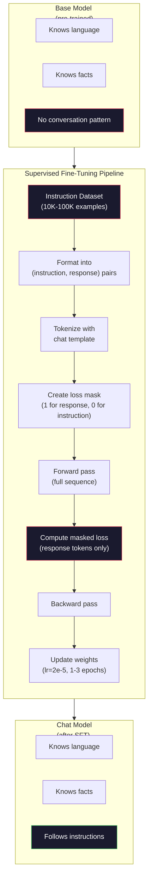

# 指令微调（SFT）

> 基础模型只做一件事：预测下一个 token。它不遵循指令、不回答问题、也不拒绝有害请求。SFT 是连接 token 预测器和有用助手之间的桥梁。你与之交谈过的每个模型——Claude、GPT、Llama Chat——都经历过这一步。

**类型:** Build
**语言:** Python (使用 numpy)
**前置知识:** Phase 10, 课程 04 (Pre-Training a Mini GPT)
**时间:** ~90 分钟

## 学习目标

- 实现监督微调（SFT），将基础语言模型转化为能够遵循指令的助手
- 使用带系统、用户和助手角色的聊天模板格式化训练数据，并对非助手 token 进行损失掩码
- 解释为什么需要 SFT：基础模型会继续生成文本而不是回答问题
- 通过对比基础模型与微调模型在保留指令集上的响应来评估 SFT 质量

## 问题

你在课程 04 中训练了一个模型。它能根据给定序列预测下一个 token。输入"The transformer architecture"，它可能会继续生成"has revolutionized natural language processing。"对于一个 next-token 预测器来说，这令人印象深刻。

现在试试这个：输入"What is the capital of France?"基础模型不会回答"Paris"。它会延续模式。它可能产生"What is the capital of Germany? What is the capital of Spain?"因为它从包含问题列表的文档中学习过。或者它可能产生"is a question that many people ask"，因为这是一个合理的 next-token 延续。模型没有*回答*的概念，它只知道*延续*。

这就是 GPT-3（基础模型，2020 年 6 月发布）与 ChatGPT（经过指令微调，2022 年 11 月发布）之间的差距。相同的架构，相同的预训练。区别在于 20,000 到 100,000 个精心制作的（指令，响应）对，这些数据教会了模型遵循对话模式。

Stanford Alpaca 证明了你不需要数百万个样本。2023 年 3 月，他们在仅 52,000 个由 GPT-3.5 生成的指令-响应对上微调了 Llama 7B。总成本：600 美元。结果是一个能够遵循指令、回答问题和进行对话的聊天机器人。虽然不如 ChatGPT，但对于 600 美元和几小时的训练来说，已经惊人地接近了。

Meta 的 Llama 2 Chat 在其初始 SFT 阶段仅使用了约 27,000 个高质量样本。关键洞见：质量比数量更重要。27,000 个由熟练标注员编写的样本胜过从互联网抓取的 100 万个嘈杂样本。

## 概念

### SFT 实际做了什么

监督微调延续了与预训练相同的训练循环——前向传播、计算损失、反向传播、更新权重——但在不同类型的数据上。不是原始文本，而是在结构化对话上训练：

```json
{
  "system": "You are a helpful assistant.",
  "user": "What is the capital of France?",
  "assistant": "The capital of France is Paris."
}
```

模型已经知道巴黎是法国的首都。它在预训练期间从维基百科、教科书和网页中学到了这一点。SFT 并不教模型新的事实，而是教模型一种新的*行为*：当你看到问题时，产生答案。当你看到指令时，产生完成结果。当你看到有害请求时，产生拒绝回应。

可以这样理解：预训练赋予模型知识，SFT 赋予模型礼仪。

### 数据格式

业界主流使用三种格式。每种格式使用不同的分隔符编码相同的信息——谁说了什么。

**Alpaca 格式**（Stanford，2023 年 3 月）：

```json
{
  "instruction": "Summarize the following article in 3 sentences.",
  "input": "The European Central Bank raised interest rates...",
  "output": "The ECB increased rates by 25 basis points..."
}
```

简单且广泛使用。`input` 字段是可选的——许多指令不需要额外的上下文。Stanford 发布了 52,000 个这种格式的样本，由 GPT-3.5 生成，花费 600 美元。这引发了开源指令微调运动。

**ShareGPT 格式**（社区，2023 年）：

```json
{
  "conversations": [
    {"from": "system", "value": "You are a helpful assistant."},
    {"from": "human", "value": "What causes tides?"},
    {"from": "gpt", "value": "Tides are caused by the gravitational pull of the Moon..."},
    {"from": "human", "value": "How often do they occur?"},
    {"from": "gpt", "value": "Most coastal areas experience two high tides and two low tides per day..."}
  ]
}
```

支持多轮对话。"from"字段按惯例使用"human"和"gpt"，无论实际模型是什么。Vicuna 在从用户共享的 ChatGPT 转录中抓取的 70,000 个 ShareGPT 对话上训练。

**ChatML 格式**（OpenAI，被许多开源模型使用）：

```
<|im_start|>system
You are a helpful assistant.<|im_end|>
<|im_start|>user
What is the capital of France?<|im_end|>
<|im_start|>assistant
The capital of France is Paris.<|im_end|>
```

使用特殊 token（`<|im_start|>`，`<|im_end|>`）来分隔角色。这些 token 在微调期间被添加到分词器的词汇表中。Qwen、Yi 和许多其他模型使用 ChatML。

所有三种格式完成相同的事情：它们告诉模型"这是指令，这是响应，学习这个模式。"

### 为什么它有效

模型已经从预训练中掌握了语言。它已经见过数十亿个问题后接答案、指令后接完成结果以及人与人之间对话的样本。这些模式已经编码在权重中。

SFT 集中了这种潜在能力。模型不再需要根据上下文来判断是应该回答问题还是延续文档，SFT 明确地在对话模式上进行训练。经过几千个样本后，模型学会了：当你看到助手角色标记时，产生有用的响应。

这就是 27,000 个样本就足够的原因。你不在教模型英语，也不在教它关于世界的事实。你在教它一种简单的行为：响应指令。知识已经在那里了。

### 掩码损失

这是 SFT 中最重要的技术细节，而大多数教程都跳过了它。

在预训练期间，你对每个 token 都计算损失。模型学习预测序列中的每个下一个 token。在 SFT 期间，你只对*响应* token 计算损失。指令 token 是提供上下文用的，但模型不会因为"预测"它们不正确而受到惩罚。

为什么？因为你不希望模型学会*生成*指令。你希望它学会*响应*指令。如果你对指令 token 计算损失，你就是在训练模型预测"法国的首都是什么？"，好像它是提问者一样。这浪费了梯度信号，并可能使模型对其角色感到困惑。

在实践中，你创建一个损失掩码：响应 token 为 1，指令 token 为 0。在平均之前将逐 token 损失乘以这个掩码。

```
Tokens:    [SYS] You are helpful [USER] What is the capital? [ASST] Paris is the capital [EOS]
Loss mask:   0    0    0     0      0     0   0  0     0       1     1    1   1     1      1
```

只有 `[ASST]` 之后的 token 对损失有贡献。模型在前向传播期间看到完整的对话（它需要指令来产生正确的响应），但只根据它对响应的预测程度来更新权重。

### 训练超参数

SFT 使用的超参数与预训练截然不同。你不是从头开始训练，而是在调整一个已经能工作的模型。

| 参数 | 预训练 (Llama 2 7B) | SFT (Llama 2 Chat) |
|-----------|---------------------------|---------------------|
| 学习率 | 3e-4（峰值） | 2e-5 |
| Epochs | 1（单次遍历数据） | 2 |
| Batch size | 4M token | 64 个样本 |
| 预热步数 | 2,000 | 0-100 |
| 权重衰减 | 0.1 | 0.0-0.1 |
| 数据量 | 2T token | 27,000 个样本 |

SFT 的学习率低 15 倍。这至关重要。微调期间的高学习率会破坏预训练的知识。模型"忘记"了已学内容，并过拟合到小的微调数据集。这就是灾难性遗忘。

两个 epoch 意味着模型看到每个训练样本两次。在小数据集上超过 3 个 epoch 会导致记忆化——模型开始逐字复制训练样本，而不是泛化。

### 灾难性遗忘

微调可能破坏通用能力。在指令遵循数据上训练时间过长，模型会失去编写代码、做数学或产生创造性文本的能力。它变得非常擅长其训练数据的特定格式，而在其他方面变得糟糕。

三种缓解方法：

1. **低学习率。** 1e-5 到 5e-5。更小的更新意味着更少地破坏预训练特征。

2. **短训练。** 1-3 个 epoch。在模型过拟合之前停止。

3. **混合预训练数据。** Llama 2 Chat 将少量（2-5%）原始预训练数据混入 SFT 数据集。这"提醒"模型其通用能力，同时学习新的指令遵循行为。

### 实际数据

在单张 NVIDIA A100 80GB GPU 上微调 7B 模型使用 10,000 个高质量指令对大约需要 1 小时。计算如下：

- 10,000 个样本 x 平均 512 token = 5.12M token
- 2 个 epoch = 总计 10.24M token
- 7B 模型微调的 A100 吞吐量：~3,000 token/秒
- 10.24M / 3,000 = ~3,400 秒 = ~57 分钟

对于我们的 mini GPT（4 层，128 维），训练几乎是即时的。重点在于理解其机制，而不是规模。



## 构建它

### 第 1 步：指令数据集

创建一个合成指令数据集。在生产中，Scale AI 和 Anthropic 等公司雇佣人工标注员来编写这些数据。我们将通过编程方式创建它们来演示格式。

```python
import numpy as np

INSTRUCTION_DATA = [
    {
        "instruction": "What is the capital of France?",
        "response": "The capital of France is Paris."
    },
    {
        "instruction": "Explain gravity in one sentence.",
        "response": "Gravity is the force that attracts objects with mass toward each other."
    },
    {
        "instruction": "Write a haiku about the ocean.",
        "response": "Waves crash on the shore, salt and foam beneath the sun, endless blue expanse."
    },
    {
        "instruction": "What is 15 multiplied by 7?",
        "response": "15 multiplied by 7 is 105."
    },
    {
        "instruction": "Name three programming languages.",
        "response": "Three programming languages are Python, Rust, and TypeScript."
    },
    {
        "instruction": "Summarize photosynthesis.",
        "response": "Photosynthesis converts sunlight, water, and carbon dioxide into glucose and oxygen."
    },
    {
        "instruction": "What year did World War II end?",
        "response": "World War II ended in 1945."
    },
    {
        "instruction": "Define machine learning.",
        "response": "Machine learning is a field where algorithms learn patterns from data to make predictions."
    },
]
```

八个样本很少。Stanford Alpaca 使用了 52,000 个。但无论你有 8 个还是 52,000 个，其机制是完全相同的：分词、掩码、仅对响应计算损失。

### 第 2 步：使用聊天模板进行分词

将指令-响应对转换为带有特殊角色标记的 token 序列。这些标记告诉模型指令在哪里结束，响应在哪里开始。

```python
SPECIAL_TOKENS = {
    "INST_START": 253,
    "INST_END": 254,
    "RESP_START": 255,
}


def tokenize_instruction_pair(instruction, response, vocab_size=256):
    inst_tokens = list(instruction.encode("utf-8"))
    resp_tokens = list(response.encode("utf-8"))

    inst_tokens = [min(t, vocab_size - 4) for t in inst_tokens]
    resp_tokens = [min(t, vocab_size - 4) for t in resp_tokens]

    tokens = (
        [SPECIAL_TOKENS["INST_START"]]
        + inst_tokens
        + [SPECIAL_TOKENS["INST_END"]]
        + [SPECIAL_TOKENS["RESP_START"]]
        + resp_tokens
    )

    return tokens


def create_loss_mask(tokens):
    mask = np.zeros(len(tokens), dtype=np.float32)
    in_response = False

    for i, token in enumerate(tokens):
        if token == SPECIAL_TOKENS["RESP_START"]:
            in_response = True
            continue
        if in_response:
            mask[i] = 1.0

    return mask
```

损失掩码对指令 token 全为零，对响应 token 全为一。`RESP_START` token 本身掩码为 0，因为它是分隔符，而不是响应内容的一部分。

### 第 3 步：掩码交叉熵损失

标准交叉熵，但乘以损失掩码。只有响应 token 对梯度有贡献。

```python
def masked_cross_entropy_loss(logits, targets, loss_mask):
    batch, seq_len, vocab_size = logits.shape
    logits_flat = logits.reshape(-1, vocab_size)
    targets_flat = targets.reshape(-1)
    mask_flat = loss_mask.reshape(-1)

    max_logits = logits_flat.max(axis=-1, keepdims=True)
    log_softmax = logits_flat - max_logits - np.log(
        np.exp(logits_flat - max_logits).sum(axis=-1, keepdims=True)
    )

    per_token_loss = -log_softmax[np.arange(len(targets_flat)), targets_flat]

    masked_loss = per_token_loss * mask_flat
    num_response_tokens = mask_flat.sum()
    if num_response_tokens == 0:
        return 0.0
    loss = masked_loss.sum() / num_response_tokens

    return loss
```

分母是 `num_response_tokens`，而不是 `seq_len`。如果你除以总序列长度，较长的指令会稀释梯度信号。除以响应 token 数量确保了无论指令长度如何，每个响应 token 的权重相等。

### 第 4 步：SFT 训练循环

复用课程 04 中的 MiniGPT。训练循环看起来与预训练几乎相同，但使用了指令格式化和掩码损失。

```python
import sys
import os
sys.path.insert(0, os.path.join(os.path.dirname(__file__), "..", "..", "04-pre-training-mini-gpt", "code"))
from main import MiniGPT, LayerNorm, FeedForward, MultiHeadAttention, TransformerBlock, Embedding


def sft_train(model, dataset, num_epochs=2, lr=2e-5, seq_len=64):
    formatted_data = []
    for example in dataset:
        tokens = tokenize_instruction_pair(example["instruction"], example["response"])
        mask = create_loss_mask(tokens)
        formatted_data.append((tokens, mask))

    print(f"SFT Training: {len(formatted_data)} examples, {num_epochs} epochs, lr={lr}")
    print(f"Total tokens: {sum(len(t) for t, _ in formatted_data):,}")
    print()

    losses = []

    for epoch in range(num_epochs):
        epoch_loss = 0.0
        num_batches = 0

        indices = np.random.permutation(len(formatted_data))

        for idx in indices:
            tokens, mask = formatted_data[idx]

            if len(tokens) < 3:
                continue
            if len(tokens) > seq_len:
                tokens = tokens[:seq_len]
                mask = mask[:seq_len]

            input_ids = np.array(tokens[:-1]).reshape(1, -1)
            target_ids = np.array(tokens[1:]).reshape(1, -1)
            loss_mask = np.array(mask[1:]).reshape(1, -1)

            logits = model.forward(input_ids)
            loss = masked_cross_entropy_loss(logits, target_ids, loss_mask)

            batch_size, s_len, v_size = logits.shape
            probs = np.exp(logits - logits.max(axis=-1, keepdims=True))
            probs = probs / probs.sum(axis=-1, keepdims=True)
            dlogits = probs.copy()
            dlogits[np.arange(batch_size)[:, None], np.arange(s_len), target_ids] -= 1.0

            mask_expanded = loss_mask[:, :, np.newaxis]
            num_resp = loss_mask.sum()
            if num_resp > 0:
                dlogits = dlogits * mask_expanded / num_resp

            for block in model.blocks:
                block.ffn.W1 -= lr * np.random.randn(*block.ffn.W1.shape) * 0.01
                block.ffn.W2 -= lr * np.random.randn(*block.ffn.W2.shape) * 0.01
                block.ffn.b1 -= lr * np.random.randn(*block.ffn.b1.shape) * 0.01
                block.ffn.b2 -= lr * np.random.randn(*block.ffn.b2.shape) * 0.01

            epoch_loss += loss
            num_batches += 1
            losses.append(loss)

        avg_loss = epoch_loss / max(num_batches, 1)
        print(f"Epoch {epoch + 1}/{num_epochs} | Avg Loss: {avg_loss:.4f}")

    return model, losses
```

学习率为 2e-5，与 Llama 2 Chat 一致。对比预训练中使用的 3e-4——小了 15 倍。梯度被掩码：指令 token 产生零梯度，只有响应 token 推动权重更新。

### 第 5 步：对比基础模型与 SFT 模型

SFT 的全部意义在于行为改变。让我们通过检查模型如何响应指令格式化的输入与原始文本延续来度量这一点。

```python
def generate_response(model, prompt_tokens, max_new_tokens=50, temperature=0.8):
    tokens = list(prompt_tokens)
    seq_len = model.embedding.pos_embed.shape[0]

    for _ in range(max_new_tokens):
        context = np.array(tokens[-seq_len:]).reshape(1, -1)
        logits = model.forward(context)
        next_logits = logits[0, -1, :]

        next_logits = next_logits / max(temperature, 1e-8)
        probs = np.exp(next_logits - next_logits.max())
        probs = probs / probs.sum()
        probs = np.clip(probs, 1e-10, 1.0)
        probs = probs / probs.sum()

        next_token = np.random.choice(len(probs), p=probs)
        tokens.append(int(next_token))

    return tokens


def evaluate_instruction_following(model, instructions):
    print("Evaluating instruction following:")
    print("-" * 50)

    for instruction in instructions:
        tokens = (
            [SPECIAL_TOKENS["INST_START"]]
            + [min(t, 252) for t in list(instruction.encode("utf-8"))]
            + [SPECIAL_TOKENS["INST_END"]]
            + [SPECIAL_TOKENS["RESP_START"]]
        )

        output = generate_response(model, tokens, max_new_tokens=30, temperature=0.6)
        response_start = len(tokens)
        response_tokens = output[response_start:]
        response_bytes = bytes([t for t in response_tokens if t < 128])
        response_text = response_bytes.decode("utf-8", errors="replace")

        print(f"  Q: {instruction}")
        print(f"  A: {response_text[:80]}")
        print()
```

在一个只有 8 个样本的小模型上，响应不会有意义。这是意料之中的。重要的是*结构*：模型学会了在响应标记之后产生输出，而不是继续生成更多指令。

### 第 6 步：衡量灾难性遗忘

比较 SFT 前后模型的 next-token 预测能力。如果 SFT 损害了通用能力，原始文本上的损失将会增加。

```python
def measure_forgetting(model, test_text, seq_len=64):
    tokens = np.array(list(test_text.encode("utf-8")[:512]))

    total_loss = 0.0
    num_windows = 0

    for start in range(0, len(tokens) - seq_len - 1, seq_len):
        input_ids = tokens[start:start + seq_len].reshape(1, -1)
        target_ids = tokens[start + 1:start + seq_len + 1].reshape(1, -1)

        logits = model.forward(input_ids)

        batch, s_len, vocab_size = logits.shape
        logits_flat = logits.reshape(-1, vocab_size)
        targets_flat = target_ids.reshape(-1)

        max_logits = logits_flat.max(axis=-1, keepdims=True)
        log_softmax = logits_flat - max_logits - np.log(
            np.exp(logits_flat - max_logits).sum(axis=-1, keepdims=True)
        )

        loss = -log_softmax[np.arange(len(targets_flat)), targets_flat].mean()
        total_loss += loss
        num_windows += 1

    return total_loss / max(num_windows, 1)
```

在实际微调中，你会在整个训练过程中跟踪这个指标。如果原始文本损失增加超过 10-15%，说明你的 SFT 过于激进。降低学习率或减少 epoch 数量。

## 使用它

### 完整 SFT 流水线演示

```python
if __name__ == "__main__":
    np.random.seed(42)

    test_text = """The transformer architecture processes sequences through self-attention.
Each layer applies multi-head attention followed by a feedforward network.
Residual connections and layer normalization stabilize deep networks.
The model learns to predict the next token given all previous tokens."""

    print("=" * 70)
    print("INSTRUCTION TUNING (SFT) DEMO")
    print("=" * 70)
    print()

    model = MiniGPT(
        vocab_size=256, embed_dim=128, num_heads=4,
        num_layers=4, max_seq_len=128, ff_dim=512
    )
    print(f"Model: {model.count_parameters():,} parameters")
    print(f"Config: 4 layers, 4 heads, 128 dims (mini GPT from Lesson 04)")
    print()

    print("PRE-SFT: Measuring base model loss on raw text")
    base_loss = measure_forgetting(model, test_text)
    print(f"  Base model loss: {base_loss:.4f}")
    print()

    print("=" * 70)
    print("SFT TRAINING")
    print("=" * 70)

    model, losses = sft_train(
        model, INSTRUCTION_DATA, num_epochs=3, lr=2e-5, seq_len=128
    )

    print()
    print("POST-SFT: Measuring fine-tuned model loss on raw text")
    sft_loss = measure_forgetting(model, test_text)
    print(f"  SFT model loss: {sft_loss:.4f}")
    print(f"  Change: {((sft_loss - base_loss) / base_loss * 100):+.1f}%")
    if abs(sft_loss - base_loss) / base_loss < 0.15:
        print("  Minimal forgetting (< 15% change)")
    else:
        print("  Significant forgetting detected")
    print()

    print("=" * 70)
    print("INSTRUCTION FOLLOWING EVALUATION")
    print("=" * 70)
    print()

    test_instructions = [
        "What is the capital of France?",
        "Name a programming language.",
        "Define gravity.",
    ]
    evaluate_instruction_following(model, test_instructions)

    print("=" * 70)
    print("DATA FORMAT EXAMPLES")
    print("=" * 70)
    print()

    for i, example in enumerate(INSTRUCTION_DATA[:3]):
        tokens = tokenize_instruction_pair(example["instruction"], example["response"])
        mask = create_loss_mask(tokens)
        resp_count = int(mask.sum())
        total_count = len(tokens)
        print(f"  Example {i + 1}: {total_count} tokens, {resp_count} response tokens ({resp_count/total_count:.0%} of sequence)")
        print(f"    Instruction: {example['instruction']}")
        print(f"    Response: {example['response']}")
        print()

    print("=" * 70)
    print("TRAINING LOSS CURVE")
    print("=" * 70)
    print()

    if losses:
        window = max(1, len(losses) // 5)
        for i in range(0, len(losses), window):
            chunk = losses[i:i + window]
            avg = sum(chunk) / len(chunk)
            print(f"  Steps {i:3d}-{i + len(chunk) - 1:3d}: avg loss = {avg:.4f}")
```

## 交付它

本课程产出 `outputs/prompt-sft-data-curator.md`——一个帮助您设计和策划 SFT 指令数据集的提示词。给定目标能力（代码生成、数学、对话），它会生成一个包含格式规范、质量标准和多样性要求的数据收集计划。

## 练习

1. 添加系统提示支持。修改 `tokenize_instruction_pair` 以接受系统消息并将其前置到指令之前。创建 5 个具有不同系统提示（"你是一个诗人"、"你是一个数学导师"）的样本，并验证模型在训练期间看到不同的系统提示。

2. 实现数据混合。创建一个函数，接受 SFT 数据集和原始文本语料，然后产生训练 batch，其中 5% 的样本为原始文本（无掩码），95% 为指令对（有掩码）。运行 3 个 epoch，并将遗忘指标与纯 SFT 训练进行比较。

3. 构建数据质量评分器。对于每个指令-响应对，计算：(a) 响应长度（以 token 计），(b) 指令与响应比例，(c) 词汇多样性（唯一 token / 总 token）。过滤掉响应长度 < 10 token 或多样性 < 0.3 的样本。展示过滤如何影响最终损失。

4. 实现多轮对话训练。扩展分词以处理 3 轮对话（user-assistant-user-assistant-user-assistant）。损失掩码应覆盖所有三个助手轮次。通过打印一个样本的 token-掩码对齐来验证掩码是否正确。

5. 比较学习率。使用 lr=1e-4、lr=2e-5 和 lr=1e-6 各训练相同模型三次。绘制损失曲线。1e-4 的运行应显示快速初始下降但最终损失更高（过拟合）。1e-6 的运行应几乎不动。2e-5 的运行应是最佳点。

## 关键术语

| 术语 | 人们怎么说 | 实际含义 |
|------|----------------|----------------------|
| SFT | "在对话上微调" | 监督微调：在（指令，响应）对上继续训练，损失仅计算在响应 token 上 |
| 指令微调 | "教模型遵循指令" | 在显式的指令-响应对上训练，使基础模型学会对话模式，而不是新知识 |
| 损失掩码 | "忽略提示" | 将指令 token 的损失设为零，使梯度仅从响应 token 预测中流动 |
| ChatML | "聊天标记语言" | 使用 `<\|im_start\|>` 和 `<\|im_end\|>` 分隔符标记对话数据中说话者角色的 token 格式 |
| Alpaca 格式 | "Stanford 的格式" | 一种 JSON 格式，包含 instruction/input/output 字段，用于 52K 个花费 600 美元的 GPT-3.5 生成的示例 |
| 灾难性遗忘 | "模型变笨了" | 微调破坏了预训练能力，因为梯度更新用任务特定的模式覆盖了通用知识 |
| 权重绑定 | "共享嵌入" | 输入 token 嵌入和输出预测头使用相同的矩阵，节省参数并提升一致性 |
| 聊天模板 | "如何格式化提示" | 为模型构建对话结构的特定 token 序列（角色标记、分隔符） |

## 延伸阅读

- [Ouyang et al., 2022 — "Training language models to follow instructions with human feedback" (InstructGPT)](https://arxiv.org/abs/2203.02155) —— 在 OpenAI 引入指令微调 + RLHF 的论文
- [Taori et al., 2023 — "Stanford Alpaca: An Instruction-following LLaMA Model"](https://github.com/tatsu-lab/stanford_alpaca) —— 52K 个花费 600 美元的指令样本，证明 SFT 在小数据集上有效
- [Touvron et al., 2023 — "Llama 2: Open Foundation and Fine-Tuned Chat Models"](https://arxiv.org/abs/2307.09288) —— Meta 的 SFT + RLHF 流水线，包含 27K 个高质量样本
- [Chiang et al., 2023 — "Vicuna: An Open-Source Chatbot Impressing GPT-4"](https://lmsys.org/blog/2023-03-30-vicuna/) —— 在 70K 个 ShareGPT 对话上训练
- [Zhou et al., 2023 — "LIMA: Less Is More for Alignment"](https://arxiv.org/abs/2305.11206) —— 证明 1,000 个精心策划的样本可以在 SFT 上匹配更大数据集的效果
