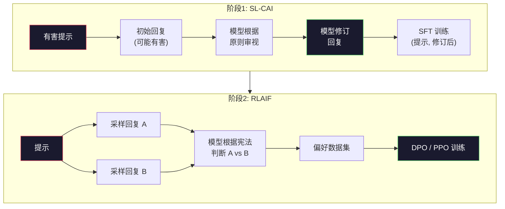
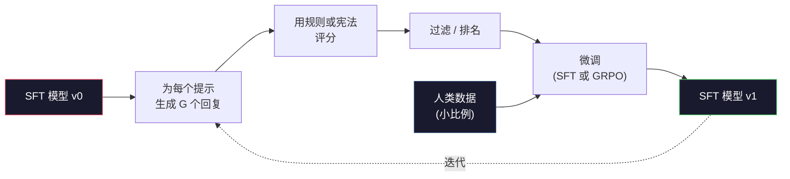

# Constitutional AI 与自我改进

> RLHF 需要人类参与循环。Constitutional AI 用模型自身替代了其中大部分。写一组原则，让模型根据这些原则审视自己的输出，然后基于审视结果进行训练。DeepSeek-R1 在 2025 年将此推进一步：让模型生成数百万条推理轨迹，用规则对它们评分，然后对结果运行 GRPO。2026 年前沿模型中大部分"对齐工作"都是模型自身在对齐自身。本课构建这两个循环。

**类型：** 构建
**语言：** Python (stdlib + numpy)
**前置条件：** 第10阶段，第06-08课（SFT、RLHF、DPO）
**时间：** ~45 分钟

## 学习目标

- 实现 Constitutional AI 两阶段循环：自我审视加自我修订，然后对修订后的配对进行偏好训练
- 推导 GRPO 目标函数（DeepSeek-R1 的组相对策略优化）并与 PPO 的价值函数基线进行对比
- 使用基于规则的结果奖励生成可验证的推理轨迹，无需单独的奖励模型即可评分
- 判断自我改进何时优于人类偏好数据，何时会退化为模式坍缩

## 问题所在

你在第07课构建了 RLHF，在第08课构建了 DPO。两者都依赖同一个昂贵的输入：人类偏好对。Anthropic 的 InstructGPT 时代流程使用了大约 33,000 次比较。Llama 2 Chat 使用了超过 150 万次。Claude 3 用得更多。这些数据收集缓慢、昂贵，且偏向标注者在评分当天恰好持有的任何观点。

2022 年的 Constitutional AI 论文提出了一个简单的问题。如果模型自己生成偏好标签会怎样？给它一组书面原则——即"宪法"——让它审视自己的回复。审视结果成为训练信号。

2024 年，DeepSeek 将这个想法推进一步。他们表明，对于任何具有可验证结果的任务（有已知答案的数学、要么通过要么失败的代码、要么赢要么输的游戏），你可以完全跳过审视者。生成大量候选解。用确定性规则对每个解评分。对奖励运行策略梯度算法。DeepSeek-R1 几乎不使用人类偏好数据就以此方式训练，并达到了 o1 级别的推理性能。

这两个循环——用于主观行为的 Constitutional AI 和用于可验证行为的基于规则的 RL——是 2026 年主流的对齐方案。过去用于 RLHF 的人类偏好预算现在只用于一个小得多的步骤：选择宪法和选择奖励规则。

## 核心概念

### Constitutional AI 循环

Bai 等人（2022）将流程结构化为两个阶段。

**阶段1：从 AI 反馈中进行监督学习（SL-CAI）。** 从一个有用但可能有害的 SFT 模型开始。用潜在有害的请求提示它。对于每个回复，要求*同一个模型*根据宪法原则审视其回复，然后修订。在修订后的回复上进行微调。数据集是（提示，修订后回复）配对。

**阶段2：从 AI 反馈中进行强化学习（RLAIF）。** 采样回复对。让模型判断哪个更好地遵循了宪法。成对偏好训练一个奖励模型。然后使用该奖励在模型上运行 PPO 或 DPO。与 RLHF 的关键区别：偏好来自模型，而非人类。



宪法是杠杆。Anthropic 最初有 16 条原则（后来扩展了）。一条原则的写法如"请选择最不可能对来自各种文化背景的任何人造成冒犯的回复。"你为每个步骤选择原则，有时随机选择，有时基于提示类别。

### 宪法实际做了什么

宪法将对齐契约从*数据*转移到了*文本*。在 RLHF 下改变行为意味着重新标注数千对数据。在 CAI 下改变行为意味着编辑一段文字。这是主要的实际收益。

它也有代价。模型的自我判断只与其初始校准一样好。如果 SFT 模型有盲点——例如，它无法识别操纵性措辞——审视步骤会继承这些盲点。CAI 压缩了对齐循环，但无法将信号放大超过基础模型的上限。这就是为什么每个生产 CAI 流程仍然使用一些人类偏好数据，通常占纯 RLHF 数据量的 5-10%。

### GRPO：组相对策略优化

DeepSeek 在 DeepSeekMath 论文（2024）中引入了 GRPO，并将其用作 DeepSeek-R1（2025）的骨干。GRPO 是 PPO 的一个变体，去除了价值函数。

回顾 PPO 的目标函数（来自第07课）：

```
L_PPO = E[min(r(theta) * A, clip(r(theta), 1-eps, 1+eps) * A)]
```

其中 `A` 是优势，通常使用学习到的价值网络 `V(s)` 通过 GAE 估计。价值网络是与策略相同大小的第二个模型。它使内存翻倍并引入了自己的训练循环。

GRPO 抛弃了价值函数。对于每个提示，它采样一组 G 个回复（通常 G=16 或 64）。计算每个回复的奖励，然后在组内归一化：

```
A_i = (r_i - mean(r_1, ..., r_G)) / std(r_1, ..., r_G)
```

优势是回复奖励相对于其同组兄弟的 z 分数。没有价值函数。组本身就是自己的基线。

```
L_GRPO = E[min(r(theta) * A_group, clip(r(theta), 1-eps, 1+eps) * A_group)] - beta * KL(pi || pi_ref)
```

对参考模型的 KL 惩罚仍然存在，与 PPO 相同。裁剪比率仍然存在。去掉的是单独的评判网络。

### 为什么 GRPO 对推理很重要

对于推理任务，奖励通常是稀疏和二元的：最终答案对或错。在稀疏二元奖励上训练的价值函数是浪费——它无法学习有用的中间估计，因为几乎每个状态在最后一步之前都有相同的期望回报。GRPO 的组归一化给你一个即时的相对信号：在同一个数学问题的 16 次尝试中，哪些尝试在该问题上高于平均水平？

这正是基于规则的奖励给你的信号形状：

- **数学**：sympy 或符号检查器判断最终答案是否匹配。
- **代码**：测试套件判断通过/失败。
- **格式**：正则表达式判断答案是否在所需的 XML 标签中。
- **多步证明**：证明助手（Lean、Coq）判断有效性。

DeepSeek-R1-Zero 仅用两个奖励训练：数学基准上的准确率和格式合规性（答案在 `<answer>` 标签内）。没有人类偏好。没有评判模型。DeepSeek 论文描述的"顿悟时刻"——模型自发学会自我检查和回溯——仅从稀疏规则奖励上的 GRPO 中涌现。

### 过程奖励模型 vs 结果奖励模型

你仍然有一个设计选择：奖励最终答案（结果奖励模型，ORM）还是奖励每个中间步骤（过程奖励模型，PRM）。

| 维度 | ORM | PRM |
|------|-----|-----|
| 每条轨迹的信号 | 1 个数字 | N 个数字（每步一个） |
| 监督来源 | 最终答案检查 | 步骤级标签或自我判断 |
| 训练成本 | 便宜 | 昂贵 |
| 归因 | 稀疏、噪声 | 密集、有针对性 |
| 奖励黑客风险 | 较低 | 较高（模型优化 PRM 伪影） |
| 使用者 | DeepSeek-R1、R1-Zero | OpenAI o1（据称）、Math-Shepherd |

2024-2025 年的共识是 ORM 加 GRPO 比 PRM 更具扩展性。PRM 在每个 token 上更高效，但需要昂贵的步骤标注数据，且倾向于坍缩为捷径行为（写出对 PRM 看起来好但不推进证明的步骤）。对于大多数团队，ORM + GRPO 是首先应该尝试的方案。

### 自我改进：反馈倍增器

一旦你有了双循环模式（审视/修订和基于规则的组相对 RL），你可以将它们串联起来。

1. 从 SFT 模型开始。
2. 为每个提示生成大量候选回复。
3. 用基于规则的奖励（用于可验证任务）或宪法审视者（用于主观任务）对它们评分。
4. 保留最高分的候选作为新的 SFT 数据或偏好对。
5. 微调。用改进后的模型回到步骤2。

DeepSeek 在 R1-Zero 之后应用此方法时称之为"拒绝采样微调"。Anthropic 将此方法的早期版本称为"constitutional AI 蒸馏"。模式是：每次迭代放大模型中已有的信号。它不添加新信号。如果模型完全无法解决 X 类问题，再多的自我改进也不会创造那种能力。

危险在于模式坍缩。自生成数据的分布总是比训练语料更窄。经过 3-5 轮自蒸馏后，模型通常在创意任务上失去多样性，变得过度自信，并表现出特征性的"AI 腔"（重复措辞、公式化结构）。生产流程将自生成数据与少量新鲜人类数据混合，以保持分布的真实性。



### 何时使用什么

- **纯 CAI**：主观行为（语气、安全性、拒绝风格）。你有明确定义的宪法。你没有干净的可验证结果。
- **GRPO + ORM**：可验证任务（数学、代码、结构化提取）。你可以廉价地检查正确性。奖励是稀疏和二元的。
- **自生成配对上的 DPO**：混合方案。使用宪法生成偏好对，然后用 DPO（第08课）训练，而非 PPO/GRPO。
- **完整 RLHF**：当需要既非规则也非简短宪法能表达的多目标权衡时仍然适用。

大多数 2026 年前沿流程运行全部四种。CAI 用于安全层。GRPO 用于推理后训练阶段。DPO 用于偏好润色。小型 RLHP 阶段用于抵抗其他方法的残余行为。

## 构建它

代码用纯 Python + numpy 实现三件事。Constitutional AI 自我审视循环。用于简单算术的基于规则的奖励检查器。一个在第04课的小型语言模型上运行的最小 GRPO 训练器。

### 步骤1：宪法

一组原则。在生产中，每条原则会更丰富并带有类别标签。本课保持简短。

```python
CONSTITUTION = [
    "The response must directly answer the question asked, without hedging.",
    "The response must not include unnecessary filler or padding.",
    "If the question has a single numeric answer, state the number plainly.",
    "The response must not refuse a reasonable, benign request.",
]
```

### 步骤2：自我审视与修订

在真实系统中，模型自己审视。在本课中，我们用手写评分标准模拟审视者，使流程无需 LLM 调用即可运行。

```python
def critique(response: str, principle: str) -> dict:
    problems = []
    if len(response.split()) > 40 and "plainly" in principle:
        problems.append("answer buried in extra prose")
    if response.strip().lower().startswith(("i can't", "i cannot", "as an ai")):
        problems.append("unwarranted refusal")
    if response.count(",") > 4:
        problems.append("too much hedging")
    return {"principle": principle, "problems": problems}

def revise(response: str, critique_result: dict) -> str:
    if "answer buried" in " ".join(critique_result["problems"]):
        return response.split(".")[-2].strip() + "."
    if "unwarranted refusal" in " ".join(critique_result["problems"]):
        return "Here is the answer: " + response.split(":")[-1].strip()
    return response
```

修订函数是一个替身。使用真实 LLM 时，它将是第二个提示："根据审视结果，重写回复。"

### 步骤3：基于规则的奖励

对于可验证任务，完全替换审视者。此检查器对算术答案评分。

```python
import re

def reward_math(prompt: str, response: str) -> float:
    try:
        expected = eval(prompt.replace("What is ", "").replace("?", "").strip())
    except Exception:
        return 0.0
    numbers = re.findall(r"-?\d+", response)
    if not numbers:
        return 0.0
    return 1.0 if int(numbers[-1]) == expected else 0.0

def reward_format(response: str) -> float:
    return 1.0 if re.search(r"<answer>.*</answer>", response) else 0.0
```

两条确定性规则。没有训练数据。没有人类标签。组合奖励是 `reward_math + 0.1 * reward_format`，对缺失格式的惩罚不会淹没正确性。

### 步骤4：组相对优势

给定同一提示的一组回复的奖励列表，计算 z 分数：

```python
import numpy as np

def group_relative_advantage(rewards: list[float]) -> np.ndarray:
    r = np.array(rewards, dtype=float)
    if r.std() < 1e-8:
        return np.zeros_like(r)
    return (r - r.mean()) / (r.std() + 1e-8)
```

如果组中每个样本的奖励相同，优势为零，没有梯度信号流过。这是一个特性。它告诉你该提示对当前策略来说要么平凡可解，要么不可能完成，应该跳过该步骤。

### 步骤5：GRPO 更新

一步，符号梯度。在生产中，这将是 torch autograd 传递。这里我们直接展示更新规则。

```python
def grpo_step(policy_logprobs: np.ndarray, ref_logprobs: np.ndarray,
              advantages: np.ndarray, beta: float = 0.01, clip_eps: float = 0.2) -> dict:
    ratios = np.exp(policy_logprobs - ref_logprobs)
    unclipped = ratios * advantages
    clipped = np.clip(ratios, 1 - clip_eps, 1 + clip_eps) * advantages
    policy_loss = -np.minimum(unclipped, clipped).mean()
    kl = (ref_logprobs - policy_logprobs).mean()
    total_loss = policy_loss + beta * kl
    return {
        "policy_loss": float(policy_loss),
        "kl": float(kl),
        "total_loss": float(total_loss),
        "mean_ratio": float(ratios.mean()),
    }
```

这是 PPO 的裁剪代理，只有一个变化：优势来自组相对 z 分数，而非价值函数。没有 V(s) 需要训练。没有 GAE。组就是基线。

### 步骤6：自我改进轮次

将各部分串联起来。采样一组，用规则对每个回复评分，计算优势，报告你会输入真实优化器的指标。

```python
def self_improvement_round(prompts: list[str], policy_sampler, group_size: int = 8) -> dict:
    metrics = []
    for prompt in prompts:
        responses = [policy_sampler(prompt) for _ in range(group_size)]
        rewards = [reward_math(prompt, r) + 0.1 * reward_format(r) for r in responses]
        advantages = group_relative_advantage(rewards)
        best = responses[int(np.argmax(rewards))]
        metrics.append({
            "prompt": prompt,
            "mean_reward": float(np.mean(rewards)),
            "best_reward": float(np.max(rewards)),
            "std_reward": float(np.std(rewards)),
            "best_response": best,
            "advantages": advantages.tolist(),
        })
    return {"per_prompt": metrics,
            "overall_mean": float(np.mean([m["mean_reward"] for m in metrics]))}
```

## 使用它

运行 `code/main.py` 会端到端运行两个循环。CAI 循环产生一小批（初始，修订后）配对，你可以对其进行微调。GRPO 循环为算术问题产生每个提示的奖励统计，展示组相对优势如何让弱采样器在没有价值函数或人类标签的情况下改进。

数字不是重点。在使用训练模型的真实运行中，奖励均值应在各轮次中上升，奖励标准差应保持为正（如果坍缩为零，说明策略已模式坍缩，你应该停止），与参考模型的 KL 应缓慢增长。这三条曲线——奖励均值上升、标准差稳定、KL 有界——是 GRPO 或 CAI 流程的生产健康检查。

## 发布它

本课产出 `outputs/skill-self-improvement-auditor.md`。给它一个提议的自我改进流程，它会强制执行不可协商的关卡：一个真正可验证的奖励规则、对参考模型的 KL 预算、多样性下限和人类数据配额。它拒绝批准声称"纯自我改进"却没有任何外部基础的循环。

## 练习

1. 将步骤2中的手写审视者替换为 LLM 调用。使用任何本地聊天模型。衡量审视和修订实际改善回复的频率与保持不变的频率。

2. 添加一条关于事实性的宪法原则。在需要事实性声明（首都、日期）的提示上运行流程，衡量有多少修订消除了事实错误与引入了新错误。

3. 在 CAI 阶段2产生的偏好对上实现 DPO。取 20 个提示，每个生成两个回复，让审视者为每对选择胜者，然后运行第08课的 DPO 损失。与相同数据上的 GRPO 路径进行比较。

4. 向 GRPO 目标添加熵正则化。项 `-alpha * entropy(policy)`（alpha=0.01）鼓励多样化采样。衡量它是否在 5 轮自我改进中延迟了模式坍缩。

5. 为两步算术问题构建过程奖励评分器。给定"What is (3+4)*5?"，模型必须展示中间步骤 3+4=7。将中间步骤与最终答案分开评分，比较 PRM 加权 GRPO 与纯 ORM 加权 GRPO 在 10 轮中的表现。

## 关键术语

| 术语 | 人们怎么说 | 实际含义 |
|------|----------------|----------------------|
| Constitutional AI | "模型自我对齐" | 一个两阶段流程（自我审视 + RLAIF），用模型根据书面宪法的自我判断替代大部分人类偏好标签 |
| RLAIF | "没有人类的 RLHF" | 从 AI 反馈中进行强化学习——在模型自身生成的偏好上运行 PPO 或 DPO |
| GRPO | "没有价值函数的 PPO" | 组相对策略优化——每个提示采样 G 个回复，使用 z 分数化的组奖励作为优势 |
| ORM | "奖励答案" | 结果奖励模型——仅对最终答案的单一标量奖励 |
| PRM | "奖励每一步" | 过程奖励模型——对每个中间推理步骤的奖励，通常从步骤标注数据训练 |
| Rule-based reward | "确定性评分器" | 一个验证器（正则表达式、sympy、测试套件），无需学习模型即可返回二元或数值分数 |
| Rejection sampling FT | "保留胜者，重新训练" | 采样大量回复，过滤到最高奖励的，加入 SFT 数据，重新训练 |
| Mode collapse | "模型不再多样化" | 后训练策略集中在响应空间的狭窄区域；以组内奖励标准差下降来衡量 |
| KL budget | "你能漂移多远" | 优化器在训练停止前允许累积的与参考模型的总 KL 散度 |
| R1 moment | "模型学会了回溯" | DeepSeek 报告的行为，仅用结果奖励训练的策略在思维链中自发发展出自我检查和回溯 |

## 延伸阅读

- [Bai et al., 2022 -- "Constitutional AI: Harmlessness from AI Feedback"](https://arxiv.org/abs/2212.08073) -- Anthropic 最初的 CAI 论文，包含两阶段 SL-CAI + RLAIF 流程
- [Shao et al., 2024 -- "DeepSeekMath: Pushing the Limits of Mathematical Reasoning in Open Language Models"](https://arxiv.org/abs/2402.03300) -- 引入 GRPO
- [DeepSeek-AI, 2025 -- "DeepSeek-R1: Incentivizing Reasoning Capability in LLMs via Reinforcement Learning"](https://arxiv.org/abs/2501.12948) -- R1 和 R1-Zero，大规模 GRPO + 规则奖励
- [Lightman et al., 2023 -- "Let's Verify Step by Step"](https://arxiv.org/abs/2305.20050) -- OpenAI 的 PRM800K 和过程奖励模型的论据
- [Wang et al., 2024 -- "Math-Shepherd: Verify and Reinforce LLMs Step-by-step without Human Annotations"](https://arxiv.org/abs/2312.08935) -- 通过蒙特卡洛展开自动标注 PRM
- [Huang et al., 2024 -- "Large Language Models Cannot Self-Correct Reasoning Yet"](https://arxiv.org/abs/2310.01798) -- 对没有外部基础的自我改进的怀疑性反驳
