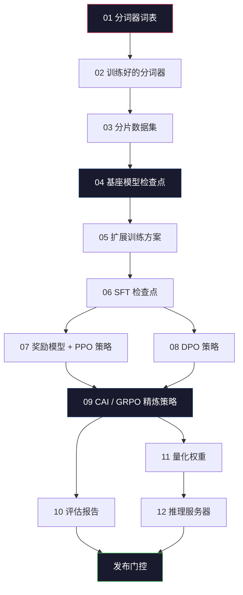
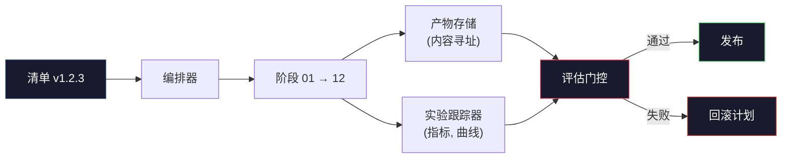

# 构建完整的 LLM 流水线

> 第 01 到 12 课的每一课都是一条流水线中的一个阶段。本课是脚手架，将这些阶段变成一次端到端的完整运行：分词、预训练、扩展、SFT、对齐、评估、量化、服务。你不会在笔记本电脑上训练一个 70B 模型。你将产出编排层、清单、评估门控和回滚计划——这正是 2026 年前沿团队用来决定什么可以上线的工具。这是收官之作。

**类型：** 构建
**语言：** Python (stdlib)
**前置课程：** 第 10 阶段全部课程 01-12
**时间：** ~120 分钟

## 学习目标

- 将前面十一课（分词器、数据、预训练、扩展、SFT、RLHF、DPO、CAI、评估、量化、推理）组合成一个可复现的流水线规范
- 定义阶段之间的产物契约：每个阶段消费什么、产出什么、下一阶段如何验证输入
- 构建一个编排器，跟踪实验、哈希产物，并以评估阈值作为发布门控
- 设计回滚计划：哪些产物重新运行成本低、哪些成本高、一个损坏的检查点代价多大

## 问题

前面的课程各自都能工作。分词器训练完成。微型 GPT 预训练完成。SFT 数据集组装完成。奖励模型训练完成。DPO 运行完成。评估指标测量完成。量化权重导出完成。推理服务器启动完成。每一课都是一个 notebook。每一课都有自己的约定、自己的输出路径、自己的随机种子。

前沿训练运行不是一个 notebook。Llama 3 405B 耗费了大约 3000 万 H100 小时，历时约 54 天。DeepSeek-V3 使用了大约 280 万 H800 小时。在此期间，一个损坏的检查点、一次数据污染、一次评估回归，就可能让团队付出一周的挂钟时间和一个月的 GPU 预算。团队之所以能扛住这些，靠的是流水线卫生：每个阶段都有确定性的输入、确定性的输出、清单、哈希和门控。

这是收官之作。你不会在笔记本电脑上端到端运行这条流水线。你将编写协调各阶段的编排器、描述运行过程的清单、门控发布决策的验证器，以及让第三方能从单个文件重新运行你工作的重放计划。代码量很小；纪律要求很高。

这个模式从 100M 到 1T 参数不变。同样的四个组件——清单、编排器、评估门控、产物存储——既运行 Llama 3，也运行你的业余 GPT。区别只在于每个阶段配置中的数字大小，而非流水线的形状。

## 概念

### 十二个阶段

第 10 阶段的每一课都是一个阶段。以下是完整的依赖图。



阶段 07 和 08 可以并行运行。其他都是硬依赖。阶段 02（分词器）的变更会使所有下游产物失效。阶段 10（评估）的变更仅使发布决策失效。

### 清单

清单是一个单文件，足够完整地描述一次运行以便重放。流水线产出的任何内容都不应依赖于清单中未记录的状态。字段很枯燥，但都是必需的。

```
pipeline_version: 1.2.3
seed: 42
git_commit: a1b2c3d4
stages:
  01_tokenizer:
    recipe: bpe_32k
    input_hash: sha256:...
    output_hash: sha256:...
    wall_clock_sec: 3600
    cost_usd: 12
```

阶段 N 的输出哈希就是阶段 N+1 的输入哈希。任何偏差都会使流水线停止。这就是你及早发现数据污染的方式。这也是另一个大洲的队友验证其重放是否产出了与你相同产物的方式。

实践中，团队使用一个小型 YAML 模式加上一个清单检查器，与上一次成功运行进行差异比对。任何超出预期字段（成本、挂钟时间）的偏差都是红旗。

### 产物类型化

每个阶段的输出是一个类型化产物。不是目录 blob，不是 pickle，而是一个具有已知模式的命名类型。

| 阶段 | 产物类型 | 关键字段 |
|------|----------|---------|
| 01-02 | Tokenizer | vocab.json, merges.txt, config.json, hash |
| 03 | Dataset | shards[], 行数, token 数, 去重统计 |
| 04-05 | Checkpoint | weights.safetensors, config.json, 优化器状态, 步数 |
| 06 | SFT Model | checkpoint + SFT 方案 + 数据配比 |
| 07 | Reward Model | RM checkpoint + 偏好数据哈希 |
| 08-09 | Policy | checkpoint + 参考哈希 + beta + 已消耗 KL 预算 |
| 10 | Eval Report | 基准分数 + 回归差异 + 评估数据哈希 |
| 11 | Quantized Model | 量化权重 + 校准数据 + 相对 FP16 的精度差 |
| 12 | Server Spec | 端点 + 模型哈希 + 配置 + 可观测性钩子 |

类型化防止了最常见的故障模式：将阶段 08 的输出当作阶段 06 的输入使用，把 DPO 训练的模型走 SFT 路径发布出去。类型化产物和类型化阶段签名使这些错误成为编译期失败，而非第五天的失败。

### 评估门控

发布不是"训练完成了"。发布是"训练完成了且评估门控通过了"。门控在运行开始之前就已定义。

```
gates:
  mmlu: >= baseline + 0.5 # 无回归
  humaneval: >= baseline + 1.0
  truthfulqa: >= baseline # 无下降
  safety_refusal_rate: <= 0.05
  kl_from_reference: <= 25.0
  cost_total_usd: <= 50000
```

每个门控都是数值阈值。没有"看起来不错"的门控。没有主观签字。如果所有门控都通过，产物被标记为可发布。如果任何门控失败，运行被挂起，等待指定审核者的明确覆盖，覆盖本身也会记录在清单中。

两个门控能捕获大多数灾难。*回归*门控（新模型在核心基准上必须至少与前一版一样好）捕获训练 bug。*KL 预算*门控（对齐后的策略与参考策略的偏离不得超过 X）捕获对齐过度。每个生产流水线都有这两个。

### 编排器

一小段代码，读取清单、调度阶段、跟踪产物，并在任何契约违反时停止。这不是 Airflow。这不是 Kubeflow。对于流水线卫生，你需要的是你自己写的、无聊的东西。

编排器的工作范围很窄：

1. 从清单解析 DAG。
2. 对每个阶段，检查预期输出是否已以正确哈希存在（若存在则跳过）。
3. 运行阶段，捕获 stdout/stderr，测量挂钟时间和成本。
4. 验证输出哈希与下游阶段的预期输入哈希是否匹配。
5. 失败时，写入包含确切失败阶段的部分清单并以非零退出码退出。

这就是 200 行 Python。它看起来就像本课的 `code/main.py` 文件。底层上，真正的流水线使用 `torchrun` 或 `ray` 在集群上执行各个阶段，但编排器本身运行在单机上。

### 实验跟踪与产物存储

两个外部系统锚定流水线。

**实验跟踪器（wandb, neptune, mlflow）。** 每个阶段记录损失曲线、评估指标、系统遥测。跟踪器是你三周后需要比较运行 A 和运行 B 时去的地方。团队几乎总是使用托管跟踪器——自己写会浪费本该投入训练的时间。

**产物存储（S3, R2, GCS）。** 用于检查点、数据集、分词器、评估报告的不可变对象存储。产物按哈希寻址，而非按文件名。像 `latest.pt` 这样的文件名是自找麻烦；`ckpt-7b-step-20000-sha256:abc123.safetensors` 才是契约。

编排器同时写入两者。跟踪器是给看图表的人用的。产物存储是给下一阶段查找输入用的。

### 成本核算

前沿运行有一个美元数字。预算纪律在两个地方执行。

**运行前估算。** 从清单计算预期 FLOPs（预训练：6 × 参数量 × token 数）、预期 GPU 小时数（FLOPs / 峰值吞吐 / 利用率）和当前租赁费率下的美元成本。如果估算超过预算门控，流水线拒绝启动。

**运行中跟踪。** 逐阶段的挂钟时间和成本记录到清单中。每个阶段之后检查剩余预算。如果某阶段超支，下一阶段的门控会以新的剩余预算重新评估。你不会等到 VC 打电话才知道钱花完了。

Llama 3 报告的成本是 6100 万美元。DeepSeek-V3 报告的主要预训练运行成本约 560 万美元。这个差距主要来自硬件效率加上混合专家——但具体成本之所以可见，是因为两个团队都按阶段而非按运行跟踪了成本。

### 可复现性 vs 确定性

这两者不同。*可复现*意味着相同的清单加相同的代码加相同的基础设施产出具有等价下游指标的检查点。*确定性*意味着逐位相同的输出。

现代 LLM 训练是可复现的但不是确定性的。分布式训练的归约顺序、GPU 内核的非确定性（cuBLAS, flash-attn）和混合精度舍入共同导致运行间的浮点数在 1e-5 级别上存在差异。这对最终指标来说没问题，因为指标不会波动。但如果你试图用逐位差异来调试，这就是致命的。解决方案是记录每个阶段的输入哈希、输出哈希和核心指标——如果这些都匹配，即使权重不是逐位相同的，运行也算"复现"了。



### 回滚计划

在运行开始之前，写下每个阶段失败时该怎么办。三类：

- **低成本重跑**（小时级）：分词器、评估、量化、推理服务器。直接重跑。
- **中等成本**（天级）：SFT, DPO, CAI。保留基座模型；只重跑对齐阶段。
- **高成本**（周级和数百万美元）：预训练。这里的回滚计划不是"重跑"。而是"使用最后一个好的检查点，用修订后的数据重跑更便宜的下游阶段"。

因为阶段依赖是类型化和哈希化的，编排器可以自动计算回滚集：使失败阶段及其所有下游失效。阶段 06（SFT）的失败使 06, 07, 08, 09, 10, 11, 12 失效。阶段 11（量化）的失败仅使 11 和 12 失效。提前命名这些，避免在凌晨 4 点团队精疲力竭时临时决策。

### 2026 年观察到的生产方案

大多数前沿团队收敛到了相同的骨架。

- 分词器：128k BPE 加字节回退。在小型、平衡的多语言切片上训练。
- 预训练：10-20T token，主要是网页加代码加合成数据。Muon 或 AdamW 优化器。FSDP2 或 DeepSpeed ZeRO-3。梯度检查点。BF16 权重，FP32 主权重。
- SFT：50 万-200 万指令对，人工和合成混合，对评估集严格去重。
- 对齐：DPO 或 CAI + GRPO。仅在偏好信号对 DPO 来说过于多维时才使用 RLHF。
- 评估：MMLU-Pro, MATH, HumanEval+, GPQA, SWE-Bench Verified, LiveBench，加上一个公众永远看不到的私有留出集。
- 量化：4-bit GPTQ 或 AWQ 用于服务，8-bit 用于精度差异重要的安全评估。
- 服务：vLLM, TensorRT-LLM 或自研。连续批处理。投机解码。KV 缓存驱逐。

数字每六个月变一次。骨架不变。

```figure
beam-search
```

## 构建它

本课的代码是编排器和清单检查器，不是十二个训练脚本。每个阶段用占位符模拟，产出具有正确形状和哈希的输出产物。端到端运行编排器证明流水线的管道在你在真实阶段上烧 GPU 钱之前是通的。

参见 `code/main.py` 获取完整实现。关键部分：

- `Manifest` 数据类：流水线版本、种子、git commit、阶段、门控。
- `Stage` 数据类：名称、类型、输入（哈希）、输出（哈希）、挂钟时间、成本。
- `Orchestrator.run()`：解析 DAG、调度阶段、验证哈希、更新清单。
- `EvalGate.check()`：读取阈值，与最新评估报告比较，返回通过/失败。
- `ArtifactStore`（内存占位）：按哈希 put/get，模拟 S3。
- `CostTracker`：逐阶段和累计，超过上限时停止。

`main.py` 中的流水线运行十二个占位阶段，产出清单，并演练一个失败的评估门控以展示被挂起的运行是什么样子。将每个占位替换为对应课程的真实训练脚本，你就有了真实前沿流水线使用的骨架。

## 使用它

规范工作流有三个命令。

```
python code/main.py plan  # 验证清单，计算成本估算，打印 DAG
python code/main.py run   # 执行阶段，写入 manifest.out.yaml
python code/main.py gate  # 读取 manifest.out.yaml，应用评估门控，发布或挂起
```

每次先运行 `plan`。大多数流水线 bug 在计划阶段就会暴露——缺失的门控阈值、过期的哈希、预算超支。运行 `plan` 是免费的。运行 `run` 是昂贵的。在便宜的一侧捕获 bug 来省钱。

`gate` 的输出要么是 `SHIP`，要么是 `HOLD: <reason>`。被挂起的运行不是失败；它是一个决策点。指定审核者要么覆盖（覆盖会被记录），要么批准回滚。

## 发布它

本课产出 `outputs/skill-llm-pipeline-reviewer.md`。给它一个提议的流水线清单，它检查所有契约：阶段类型化、哈希链、门控、回滚计划、成本估算。它拒绝批准缺少评估门控、KL 预算无上限、或混合评估和训练数据的清单。

## 练习

1. 扩展编排器以支持阶段 07 和 08 的并行执行。使用 stdlib 的 `concurrent.futures` 模块。确认最终清单记录了两个阶段的输出，且阶段 09 的输入哈希是两者的确定性组合。

2. 添加"污染检查"门控。给定评估数据集哈希和训练数据集分片，计算重叠率（精确字符串匹配或 13-gram 匹配）。重叠超过 0.1% 时门控失败。用被污染的训练集测试，确认门控挂起了运行。

3. 从第一性原理实现成本估算器。对于阶段 04（预训练），估算 FLOPs 为 6 × 参数量 × token 数，假设 H100 上 40% MFU（模型 FLOPs 利用率），BF16 峰值 989 TFLOPs，$2.50/GPU 小时。报告 7B 模型在 2T token 上训练的估算。与已发布的 Llama 2 数据比较。

4. 构建部分回滚。模拟阶段 09（CAI）的失败，然后重跑阶段 09 到 12，同时保留 01-08 的缓存。编排器应通过哈希检测缓存产物并跳过它们。测量相对完整重跑节省的挂钟时间。

5. 添加可观测性。为每个阶段发出 OpenTelemetry span，包含参数量、已见 token 数、损失和成本属性。将 span 管道到本地收集器。重点不是仪表盘；重点是每个阶段的健康可从单个 trace ID 追踪。

## 关键术语

| 术语 | 人们怎么说 | 实际含义 |
|------|-----------|---------|
| Manifest | "配方文件" | 描述流水线版本、种子、逐阶段配置和门控阈值的 YAML 或 JSON——足以重放一次运行 |
| Content-addressed | "按哈希而非按名称" | 产物按其内容的 SHA-256 存储，因此你永远不会把版本 A 和版本 B 混淆 |
| Eval gate | "发布标准" | 基准指标和安全分数上的数值阈值，必须通过才能将产物标记为可发布 |
| KL budget | "对齐漂移了多远" | 对齐阶段中累积 KL(policy \|\| reference) 的上限，作为门控执行 |
| MFU | "你用了 GPU 的多少" | 模型 FLOPs 利用率——实际 FLOPs 除以理论峰值。70B 规模典型值 40%，7B 规模 55% |
| Rollback plan | "出问题时怎么办" | 每个阶段失败时的预写行动集：重跑、回退、用修订输入重新训练 |
| Orchestrator | "指挥者" | 读取清单、调度阶段、验证哈希、在任何契约违反时停止的进程 |
| Artifact store | "权重的版本化 S3" | 不可变的内容寻址对象存储——检查点、数据集、评估报告的唯一真相来源 |
| Reproducible | "重放时指标相同" | 不同的逐位权重但等价的下游指标——分布式 LLM 训练的现实目标 |
| Cost gate | "你不能超过 X" | 运行前成本估算加运行中跟踪器——如果估算超过预算，流水线拒绝启动 |

## 延伸阅读

- [Dubey et al., 2024 -- "The Llama 3 Herd of Models"](https://arxiv.org/abs/2407.21783) -- 最详细的前沿流水线公开描述，包括数据、训练、对齐、评估
- [DeepSeek-AI, 2024 -- "DeepSeek-V3 Technical Report"](https://arxiv.org/abs/2412.19437) -- 效率优先的流水线，成本约为 Llama 3 级别训练的 1/10
- [Kaplan et al., 2020 -- "Scaling Laws for Neural Language Models"](https://arxiv.org/abs/2001.08361) -- 最初的计算-数据-参数缩放关系
- [Hoffmann et al., 2022 -- "Training Compute-Optimal Large Language Models (Chinchilla)"](https://arxiv.org/abs/2203.15556) -- 对 Kaplan 的修正，重新校准了现代数据预算
- [PyTorch FSDP2 documentation](https://pytorch.org/docs/stable/fsdp.html) -- PyTorch 2.4+ 中替代 FSDP1 的分布式训练原语
- [Weights & Biases LLM Reports](https://wandb.ai/site/llms) -- 开源 LLM 运行的真实清单和实验跟踪器输出，可作为可借鉴的模板
