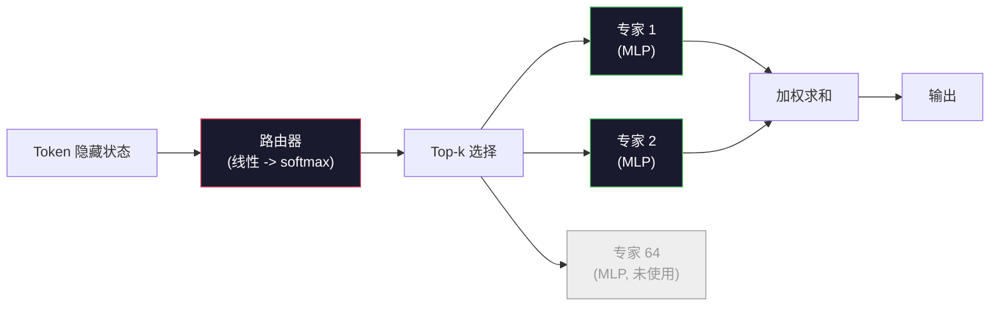

# 开源模型：架构解读

> 你在第 04 课从零构建了一个 GPT-2 Small。2026 年的前沿开源模型属于同一家族，只有五六个具体的变化。用 RMSNorm 替代 LayerNorm。用 SwiGLU 替代 GELU。用 RoPE 替代学习式位置编码。用 GQA 或 MLA 替代完整的 MHA。大规模使用混合专家模型。你已经掌握的数学覆盖了其中 95% 的内容。本课程并排阅读 Llama 3、DeepSeek-V3、Mixtral、Qwen 和 Gemma，指出每个架构在哪些具体行上出现了分歧。

**类型:** 学习
**语言:** Python (stdlib)
**前置要求:** 第 10 阶段，第 04、05、12 课（预训练、扩展、推理）
**时间:** ~45 分钟

## 学习目标

- 阅读 Llama 3、Mistral、Mixtral、Gemma 2、Qwen 2.5 和 DeepSeek-V3 的 config.json，并能解释每个字段
- 指出每个模型相对于 GPT-2 Small 所做的具体架构变更，并从基本原理出发进行论证
- 仅从配置就能计算任何开源模型的参数量、KV 缓存大小和激活内存
- 根据延迟、内存和能力约束，为部署目标选择正确的开源模型

## 问题

在第 04 课中，你用 350 行 numpy 编写了一个 GPT-2 形状的模型。Llama 3 405B 有一份 200 页的技术报告。你的直觉是它们是不同的东西。其实不然。这 200 页描述的是同一个对象，只是有五六个经过充分论证的修改，加上一千个关于扩展的实现细节。骨架——嵌入层、Transformer 块、注意力、MLP、归一化、输出头——没有变化。

本课程是一份差异对比。对于每个主要的开源模型家族，我们列出与 GPT-2 相比具体的变化、原因和代价。完成后，你可以阅读一个新的模型卡，并在脑中将其翻译回 GPT-2 基线。

实际的回报是：当 Meta 发布 Llama 5 或 DeepSeek 发布 V4 时，你不需要建立新的心智模型。你查看配置，看看是哪些已知的旋钮发生了变化，就能知道下游影响是什么。2026 年的架构是一个有限工具箱。每个新模型选择不同的子集。

## 概念

### 不变的核心

所有自回归开源模型共享：

- 词嵌入矩阵（vocab_size x hidden_dim）。
- 堆叠的 N 个解码器块：归一化、自注意力、残差连接、归一化、MLP、残差连接。
- 最终归一化和映射到 vocab_size 的线性输出头（通常与嵌入层权重共享）。
- 因果掩码、下一词元交叉熵损失。

这就是形状。其余的都是旋钮。

### 实际移动的六个旋钮

在 2024-2026 年的每个前沿开源模型中，同样的六个设计选择被反复挑选：

1. **归一化。** LayerNorm → RMSNorm。
2. **位置编码。** 学习式绝对位置 → RoPE（加上变体：YaRN、NTK）。
3. **激活函数。** GELU → SwiGLU（或 GeGLU）。
4. **注意力头共享。** MHA → GQA → MQA → MLA。
5. **密集 vs 稀疏 MLP。** 密集 → 混合专家模型。
6. **预归一化位置。** 预归一化保持不变。后归一化已消失。

其他所有内容（学习率调度、数据混合、批次大小、上下文长度）都属于训练配置，而非架构。六个旋钮。

### 旋钮 1：RMSNorm

LayerNorm 减去均值、除以标准差、缩放和偏移。RMSNorm 只保留缩放：

```
RMSNorm(x) = x / sqrt(mean(x^2) + eps) * gamma
```

无均值减法。无偏置。每个 token 少一次矩阵乘法。Zhang 和 Sennrich（2019）论证它在机器翻译上匹配 LayerNorm，同时快 10%。每个现代开源模型都使用它。

代价：无。收益：小幅吞吐量提升、更简单的代码。

### 旋钮 2：RoPE

学习式位置嵌入在 GPT-2 中是一个 1024 槽的查找表。上下文长度为 1025 时，就超出了表的范围。模型无法外推到训练长度之外。

旋转位置编码（RoPE，Su 等人，2021）通过在注意力点积之前，将每个 Q 和 K 向量成对旋转来注入位置信息。旋转角度是位置的确定性函数，因此没有任何需要学习的内容，也不会用完。配合扩展技巧（NTK 感知插值、YaRN），在 8k 上下文上训练的模型可以在推理时扩展到 128k，且准确率损失较小。

```
q_rotated = rotate(q, angle(pos))
k_rotated = rotate(k, angle(pos))
score = q_rotated . k_rotated
```

每个 Llama、Mistral、Qwen、DeepSeek 和 Gemma 都使用 RoPE。Gemma 2 使用混合方案（大多数层用 RoPE，其他层用局部滑动窗口注意力）。

### 旋钮 3：SwiGLU

GPT-2 的 MLP 是 `x -> gelu(xW1 + b1) -> (...)W2 + b2`。SwiGLU（Shazeer 2020）用门控乘积替换了激活函数：

```
SwiGLU(x) = (xW1) * sigmoid(xW1) * xV
```

两路投影并行而非一路，通过 Swish 激活进行门控。经验上在每参数困惑度上更强。Llama 2 采用了它，所有人都跟进。MLP 的隐藏大小通常设置为使总参数量匹配原始的密集 MLP：如果 GPT-2 使用 `ff_dim = 4 * hidden`，SwiGLU 使用 `ff_dim = (2/3) * 4 * hidden = 8/3 * hidden`。

### 旋钮 4：注意力头共享

GPT-2 使用**多头注意力（MHA）**：每个头有其自己的 Q、K、V 投影。

**多查询注意力（MQA，Shazeer 2019）**在所有头之间共享一个 K 和一个 V。将 KV 缓存减少 num_heads 倍，在典型模型上是 12 到 32 倍的缩减。在困难基准上准确率略有下降。

**分组查询注意力（GQA，Ainslie 等人，2023）**是中间地带：G 组 Q 头共享一个 K 和一个 V。Llama 3 8B 使用 GQA，有 32 个 Q 头和 8 个 KV 头（G=8），因此 KV 缓存相对于完整 MHA 缩小 4 倍。

**多头潜在注意力（MLA，DeepSeek 2024）**将 K 和 V 压缩到一个共享的低秩潜在空间中，按头投影回去。进一步减少 KV 缓存，同时保持每头的表达能力。DeepSeek-V2 和 V3 依靠它来实现长上下文性能。

| 方案 | KV 头数 | KV 缓存 | 准确率 |
|------|---------|---------|--------|
| MHA | num_heads | 完整 | 最佳 |
| GQA | num_groups (G < num_heads) | num_heads / G 缩减 | 接近 MHA |
| MQA | 1 | num_heads 缩减 | 小幅下降 |
| MLA | 潜在空间，逐头解压缩 | 小于 MQA | 接近 MHA |

对于任何大约 13B 参数以上的模型，GQA 或 MLA 实际上是强制性的。大规模下的完整 MHA 是一场 KV 缓存灾难。

### 旋钮 5：混合专家模型

密集 MLP 为每个 token 激活其所有参数。MoE MLP 在每个块中有 K 个专家和一个路由器，为每个 token 选择 top-k 专家（通常为 top-2）。只有这些专家的权重对该 token 进行前向传播。

```
router_logits = xW_r
indices, weights = top_k(router_logits, k=2)
output = sum_i weights[i] * expert[indices[i]](x)
```

吸引力在于：你可以拥有 64 个大小为 7B 的专家（因此总参数量巨大），而每个 token 只运行其中 2 个（因此每个 token 的计算量与密集 7B 模型相当）。Mixtral 8x7B 总共有 47B 参数，但每个 token 只激活 13B。DeepSeek-V3 总共有 671B 参数，但每个 token 只激活 37B。



优点：相同计算量，更多参数，更好的容量。缺点：专家内存仍然需要存在某个地方（因此服务需要的 VRAM 比密集等效模型多），路由器负载平衡很困难，在对齐阶段微调路由器本身就是一个研究领域。

### 旋钮 6：预归一化保持不变

原始的 Transformer 在每个子层之后应用层归一化。自 GPT-2 以来，每个开源模型都将其放在*每个子层之前*。预归一化在深层训练中严格更容易。没有争议。

### 逐个模型的差异对比

这是使所有内容具体化的表格。

| 模型 | 年份 | 总参数 | 激活参数 | 归一化 | 激活函数 | 位置编码 | 注意力 | MoE | 上下文 |
|------|------|---------|----------|--------|----------|----------|---------|-----|--------|
| GPT-2 Small | 2019 | 124M | 124M | LayerNorm | GELU | 学习式 | MHA (12 头) | 否 | 1k |
| Llama 3 8B | 2024 | 8B | 8B | RMSNorm | SwiGLU | RoPE | GQA (32/8) | 否 | 128k |
| Llama 3 70B | 2024 | 70B | 70B | RMSNorm | SwiGLU | RoPE | GQA (64/8) | 否 | 128k |
| Llama 3 405B | 2024 | 405B | 405B | RMSNorm | SwiGLU | RoPE | GQA (128/16) | 否 | 128k |
| Mistral 7B | 2023 | 7.2B | 7.2B | RMSNorm | SwiGLU | RoPE | GQA | 否 | 32k |
| Mixtral 8x7B | 2023 | 47B | 13B | RMSNorm | SwiGLU | RoPE | GQA | 是 (8 专家, top-2) | 32k |
| Gemma 2 9B | 2024 | 9B | 9B | RMSNorm (前+后) | GeGLU | RoPE + 滑动 | GQA | 否 | 8k |
| Qwen 2.5 72B | 2024 | 72B | 72B | RMSNorm | SwiGLU | RoPE (YaRN) | GQA (64/8) | 否 | 128k |
| DeepSeek V2 236B | 2024 | 236B | 21B | RMSNorm | SwiGLU | RoPE | MLA | 是 (160 专家, top-6) | 128k |
| DeepSeek V3 | 2024 | 671B | 37B | RMSNorm | SwiGLU | RoPE | MLA | 是 (256 专家, top-8) | 128k |

扫描各列。RMSNorm 是通用的。SwiGLU 或其 GeGLU 表亲是通用的。RoPE 是通用的。GQA 在 7B 以上是通用的，除非被 MLA 取代。MoE 是在高端市场的差异化因素。

### 读取 config.json

Llama 3 8B 配置：

```
{
  "hidden_size": 4096,
  "intermediate_size": 14336,
  "num_hidden_layers": 32,
  "num_attention_heads": 32,
  "num_key_value_heads": 8,
  "max_position_embeddings": 131072,
  "rope_theta": 500000.0,
  "rms_norm_eps": 1e-5,
  "vocab_size": 128256
}
```

每个字段都对应你已经实现过的内容。

- `hidden_size`：嵌入维度。
- `intermediate_size`：MLP 隐藏大小（3.5 倍 hidden——SwiGLU 计算）。
- `num_hidden_layers`：堆叠深度。
- `num_attention_heads`：Q 头数。
- `num_key_value_heads`：KV 头数（GQA）。
- `max_position_embeddings`：训练上下文长度。
- `rope_theta`：RoPE 基频。Meta 将其从默认的 10k 扩展到 500k，用于长上下文外推。
- `rms_norm_eps`：数值稳定性。
- `vocab_size`：词元数。

仅凭这些你就可以计算总参数、KV 缓存和峰值激活内存。参见 `code/main.py` 获取确切公式。

### 激活内存预算

在数十亿参数以上，激活函数主导训练内存。预训练的经验法则（使用梯度检查点）：

```
activation_mem ~ batch_size * seq_len * hidden_size * num_layers * bytes_per_element
```

对于 batch 1、seq 8192、BF16、32 层、hidden 4096 的 Llama 3 8B：使用检查点时激活内存约为 8 GB，不使用则为 40 GB。这就是为什么 flash-attention 和 ring-attention 很重要——它们重写了注意力计算，使激活函数能够适应内存。

### KV 缓存预算

在最大上下文下的推理：

```
kv_cache = 2 * num_layers * num_kv_heads * head_dim * max_seq_len * bytes_per_element
```

Llama 3 8B 在 128k 上下文、BF16、head_dim = hidden / num_heads = 128 下：
`2 * 32 * 8 * 128 * 131072 * 2 = 17.2 GB` 每个序列。

8B 的权重在 BF16 下是 16 GB。单个 128k 序列的 KV 缓存比权重还大。这就是推动 GQA、MLA 和 KV 缓存量化研究的内存压力。

### 每个模型何时胜出

- **单张 80GB GPU，无需 MoE**：Llama 3 8B、Mistral 7B、Gemma 2 9B。易于服务，工具丰富。
- **单节点（8x80GB），大容量**：Llama 3 70B、Qwen 2.5 72B。最高的密集开源能力。
- **最大开源能力，接受 MoE 复杂度**：DeepSeek V3、Mixtral 8x22B。每激活 FLOP 的最佳能力。
- **长上下文需求**：Llama 3（128k 配合 RoPE 扩展）、DeepSeek（MLA 优势）。
- **低延迟服务**：Gemma 2 9B（滑动窗口减少了长上下文计算量）。

```figure
rmsnorm-vs-layernorm
```

## 构建

本课程的代码是一个计算器。给定任何 config.json，它会按组件打印参数量、最大上下文下的 KV 缓存、SwiGLU MLP 比率，以及关于架构的简短结论（密集 / GQA / MLA / MoE）。

```python
config = {
    "hidden_size": 4096, "intermediate_size": 14336,
    "num_hidden_layers": 32, "num_attention_heads": 32,
    "num_key_value_heads": 8, "vocab_size": 128256,
    "max_position_embeddings": 131072,
}
```

脚本逐个字段遍历架构，计算嵌入层、注意力（含 GQA 缩减）、MLP（含 SwiGLU 扩展）、层归一化和输出头的参数计数。然后计算在给定上下文长度下的 KV 缓存并打印摘要。

参见 `code/main.py` 获取实现。

## 使用

在脚本中附带的 Llama 3 8B、Mistral 7B、Mixtral 8x7B 和 DeepSeek V3 配置上运行计算器。比较参数分解。注意 MoE 模型的总参数量远超密集模型，但激活参数量通常更小。注意 DeepSeek V3 的 KV 缓存比 Llama 3 405B 还小，尽管总参数量更大——这就是 MLA 的效果。

然后，为你本地的任何模型插入配置，阅读摘要，判断它是否适合你的 GPU。

## 交付物

本课程产出 `outputs/skill-open-model-picker.md`。给定一个部署目标（GPU 类型、VRAM、上下文长度、延迟预算）和任务画像（聊天、代码、推理、长上下文），它会推荐一个开源模型、来自第 11 课的量化方案以及来自第 12 课的推理栈，并对六个架构旋钮进行明确推理。

## 练习

1. 从 HuggingFace 读取 Qwen 2.5 72B 配置。从头计算总参数量。与 HF 报告的值进行比较，找出任何差异的来源（头维度舍入、KV 共享因子等）。

2. DeepSeek V3 使用 256 个专家，top-8 路由。计算激活专家与总专家的比率，并与 Mixtral 8x7B 的 8 选 2 进行比较。从稀疏（25%）到较密集稀疏（3%）的转变对每 FLOP 容量意味着什么？

3. 计算 Llama 3 405B 在 FP8 和 BF16 下 128k 上下文的 KV 缓存。在 FP8 下，它是 BF16 数值的一半。在单个 8xH100 节点（每节点 80GB = 总计 640GB，减去权重内存）上，你可以服务多少个并行序列？

4. Gemma 2 交替使用全注意力和滑动窗口注意力层。当一半的层使用 4096 token 滑动窗口而非完整上下文时，写出 KV 缓存的数学计算。在 8k 总上下文下，这能节省多少内存？

5. 找一个在本课程编写之后发布的最新前沿开源模型。识别它选择了六个旋钮中的哪些，以及它是否引入了第七个旋钮。一旦新架构发布，课程内容就会显得过时——目标是更新你的表格，而不是重建你的心智模型。

## 关键术语

| 术语 | 人们的说法 | 实际含义 |
|------|-----------|---------|
| RMSNorm | "没有均值的 LayerNorm" | 仅通过均方根进行归一化，带有一个学习到的缩放——更便宜且与 LayerNorm 可比 |
| RoPE | "旋转位置" | 将每个 Q 和 K 向量在二维对中按位置相关角度旋转——配合扩展技巧可外推到训练长度之外 |
| SwiGLU | "新的 MLP 激活函数" | 带 Swish 的门控线性单元：`(xW1) * sigmoid(xW1) * xV`——2024+ 每个开源模型的标准配置 |
| GQA | "中间地带注意力" | 分组查询注意力：G 组 Q 头共享一个 K 和一个 V 头——缩小 KV 缓存而不产生 MQA 的准确率下降 |
| MLA | "DeepSeek 的注意力" | 多头潜在注意力：将 K/V 压缩到共享低秩潜在空间，逐头解压缩——大型模型中最小的 KV 缓存 |
| MoE | "稀疏专家" | 混合专家模型：每个块 N 个 MLP，路由器为每个 token 选择 top-k——总参数量巨大，激活参数量小 |
| Top-k 路由 | "每个 token 选 k 个专家" | 路由器为每个专家计算分数并激活最高的 k 个——典型 k 值为 2（Mixtral）到 8（DeepSeek） |
| YaRN | "拉伸 RoPE" | Yet another RoPE extension——插值旋转角度以在推理时将上下文从 8k 扩展到 128k+ |
| 滑动窗口注意力 | "不要注意所有内容" | 每个 token 只关注最后 W 个 token——将注意力成本限制在每 token O(W)，用于 Gemma 2 和早期 Mistral |
| 激活参数 | "每个 token 运行的内容" | 对于 MoE 模型，每个 token 需要进行前向传播的参数数量（远小于总参数量）——决定每 token 的 FLOPs |

## 延伸阅读

- [Dubey et al., 2024 -- "The Llama 3 Herd of Models"](https://arxiv.org/abs/2407.21783) — 密集 Llama 3 家族的架构和训练参考
- [DeepSeek-AI, 2024 -- "DeepSeek-V3 Technical Report"](https://arxiv.org/abs/2412.19437) — MLA 加无辅助损失的负载平衡加 671B MoE
- [Jiang et al., 2024 -- "Mixtral of Experts"](https://arxiv.org/abs/2401.04088) — 经典的 MoE 开源模型论文
- [Su et al., 2021 -- "RoFormer: Enhanced Transformer with Rotary Position Embedding"](https://arxiv.org/abs/2104.09864) — RoPE 论文
- [Shazeer, 2020 -- "GLU Variants Improve Transformer"](https://arxiv.org/abs/2002.05202) — SwiGLU、GeGLU 等
- [Ainslie et al., 2023 -- "GQA: Training Generalized Multi-Query Transformer Models"](https://arxiv.org/abs/2305.13245) — GQA 论文
- [Gemma 2 Team, 2024 -- "Gemma 2: Improving Open Language Models at a Practical Size"](https://arxiv.org/abs/2408.00118) — 混合全注意力+滑动注意力、前+后归一化
- [Qwen Team, 2024 -- "Qwen 2.5 Technical Report"](https://arxiv.org/abs/2412.15115) — YaRN 上下文扩展和长上下文训练方案
