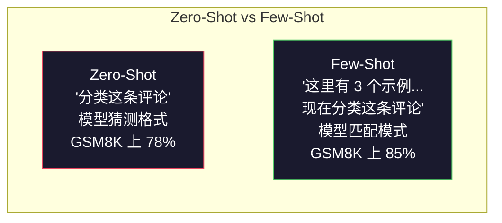
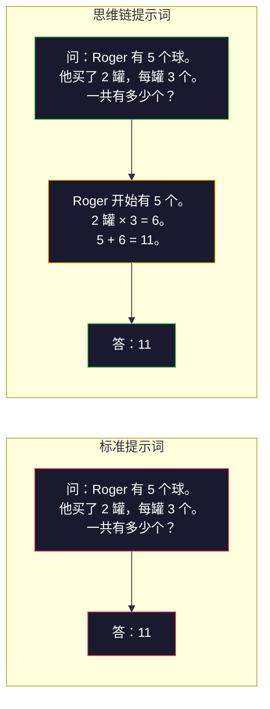
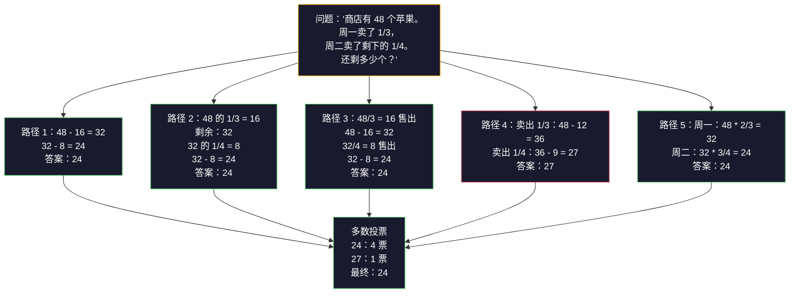
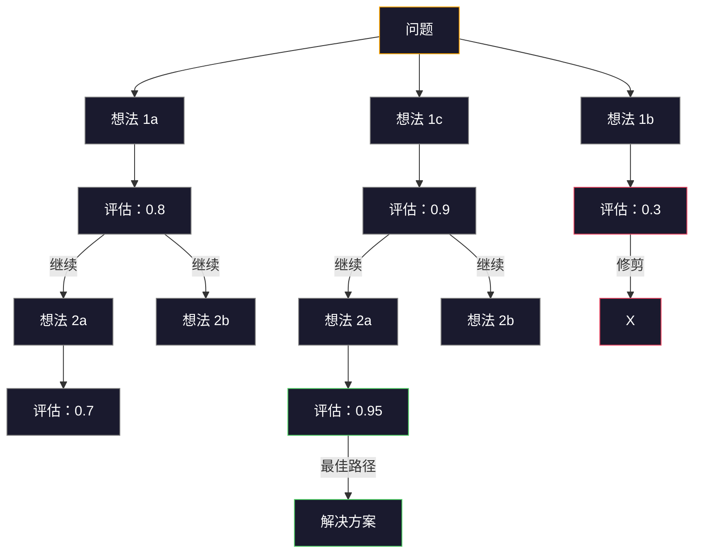

# Few-Shot、思维链、思维树

> 告诉模型做什么是提示。教它如何思考是工程。同一模型、同一任务、同一数据，准确率从 78% 到 91% 的差距，不是因为更好的模型。而是因为更好的推理策略。

**类型：** Build
**语言：** Python
**前置要求：** 课程 11.01（提示词工程）
**预计时间：** ~45 分钟

## 学习目标

- 通过选择并格式化最大化任务准确率的示例演示，实现 few-shot 提示词
- 应用思维链（CoT）推理提高多步骤问题（如数学应用题）的准确率
- 构建一个思维树提示词，探索多条推理路径并选择最佳路径
- 在标准基准上衡量 zero-shot vs few-shot vs CoT 的准确率提升

## 问题

你构建了一个数学辅导应用。你的提示词说："解决这道应用题。"GPT-5 在 GSM8K（标准小学数学基准）上有 94% 的正确率。你以为你已经到顶了。你并没有——思维链仍然能增加 3-4 个百分点。

添加五个词——"让我们逐步思考"——准确率跃升到 91%。添加一些已解决的示例，它达到 95%。相同的模型。相同的温度。相同的 API 成本。唯一的区别是你给了模型草稿纸。

这不是一个 hack。这就是推理的工作方式。人类不会在一次思维飞跃中解决多步骤问题。Transformer 也不会。当你强制模型生成中间 token 时，这些 token 成为下一个 token 的上下文的一部分。每个推理步骤为下一步提供输入。模型字面上地一步步计算到答案。

但"逐步思考"是开始，而不是结束。如果你采样五个推理路径并取多数投票呢？如果你让模型探索一个可能性树，评估和修剪分支呢？如果你在推理中穿插工具使用呢？这些不是假设。它们是已发表的技术，有可衡量的改进，你将在这个课程中构建所有这些。

## 概念

### Zero-Shot vs Few-Shot：何时示例胜于指令

Zero-shot 提示词给模型一个任务，没有别的。Few-shot 提示词先给它示例。

Wei 等人（2022）在 8 个基准上衡量了这一点。对于情感分类等简单任务，zero-shot 和 few-shot 的表现相差在 2% 以内。对于多步骤算术和符号推理等复杂任务，few-shot 将准确率提高了 10-25%。

直觉：示例是压缩的指令。你不是描述输出格式，而是展示它。你不是解释推理过程，而是演示它。模型对示例进行模式匹配比解释抽象指令更可靠。



**Few-shot 胜出时：** 格式敏感型任务、分类、结构化提取、领域特定术语、任何模型需要匹配特定模式的任务。

**Zero-shot 胜出时：** 简单事实性问题、示例会约束创造力的创意性任务、找到好示例比编写好指令更难的任务。

### 示例选择：相似胜于随机

并非所有示例都是平等的。选择与目标输入相似的示例在分类任务上比随机选择好 5-15%（Liu 等人，2022）。三个原则：

1. **语义相似性**：选择嵌入空间中距离输入最近的示例
2. **标签多样性**：覆盖示例中的所有输出类别
3. **难度匹配**：匹配目标问题的复杂程度

大多数任务的最佳示例数量是 3-5 个。低于 3 个，模型没有足够的信号来提取模式。超过 5 个，你遇到收益递减并浪费上下文窗口 token。对于具有许多标签的分类任务，每个标签使用一个示例。

### 思维链：给模型草稿纸

思维链（CoT）提示词由 Google Brain 的 Wei 等人（2022）引入。想法很简单：不只是要求模型给出答案，而是要求它先展示推理步骤。



为什么这在机制上有效？Transformer 生成的每个 token 成为下一个 token 的上下文。没有 CoT，模型必须将所有推理压缩到单次前向传递的隐藏状态中。有了 CoT，模型将中间计算外部化为 token。每个推理 token 扩展了有效的计算深度。

**GSM8K 基准（小学数学，8.5K 问题）：**

| 模型 | Zero-Shot | Zero-Shot CoT | Few-Shot CoT |
|-------|-----------|---------------|--------------|
| GPT-4o | 78% | 91% | 95% |
| GPT-5 | 94% | 97% | 98% |
| o4-mini（推理） | 97% | — | — |
| Claude Opus 4.7 | 93% | 97% | 98% |
| Gemini 3 Pro | 92% | 96% | 98% |
| Llama 4 70B | 80% | 89% | 94% |
| DeepSeek-V3.1 | 89% | 94% | 96% |

**关于推理模型的说明。** 像 OpenAI 的 o 系列（o3、o4-mini）和 DeepSeek-R1 这样的模型在给出答案之前在内部运行思维链。给推理模型添加"让我们逐步思考"是多此一举，有时反而适得其反——它们已经做了。

两种 CoT 风格：

**Zero-shot CoT**：在提示词后附加"让我们逐步思考"。不需要示例。Kojima 等人（2022）表明，这单个句子就能提高算术、常识和符号推理任务的准确率。

**Few-shot CoT**：提供包含推理步骤的示例。比 zero-shot CoT 更有效，因为模型看到了你期望的确切推理格式。

**CoT 有害时：** 简单事实回忆（"法国的首都是什么？"）、单步分类、速度比准确率更重要的任务。CoT 每次查询增加 50-200 token 的推理开销。对于高吞吐量、低复杂度的任务，这是浪费成本。

### 自洽性：多次采样，一次投票

Wang 等人（2023）引入了自洽性。其洞见是：单条 CoT 路径可能包含推理错误。但如果你采样 N 条独立的推理路径（使用 temperature > 0）并对最终答案进行多数投票，错误会相互抵消。



在原始的 PaLM 540B 实验中，自洽性将 GSM8K 准确率从 56.5%（单 CoT）提高到 74.4%（N=40）。在 GPT-5 上改进很小（97% 到 98%），因为基础准确率已经饱和。该技术在最适用于基础 CoT 准确率在 60-85% 的模型——这是单路径错误频繁但不系统的甜点区域。对于推理模型（o 系列、R1），自洽性已被内置的内部采样所取代。

权衡：N 个样本意味着 N 倍的 API 成本和延迟。在实践中，N=5 捕获了大部分收益。N=3 是有意义投票的最低要求。N > 10 对大多数任务来说收益递减。

### 思维树：分支探索

Yao 等人（2023）引入了思维树（ToT）。CoT 沿着一条线性推理路径前进，而 ToT 探索多个分支，在继续之前评估哪些最有希望。



ToT 有三个组件：

1. **想法生成**：产生多个候选下一步
2. **状态评估**：对每个候选评分（可以使用 LLM 本身作为评估器）
3. **搜索算法**：通过树进行 BFS 或 DFS，修剪低分分支

在 24 点游戏任务上（使用算术运算组合 4 个数字得到 24），使用标准提示词的 GPT-4 解决了 7.3% 的问题。使用 CoT 为 4.0%（CoT 在这里实际上有害，因为搜索空间很宽）。使用 ToT 为 74%。

ToT 很昂贵。树中的每个节点需要一次 LLM 调用。分支因子为 3、深度为 3 的树最多需要 39 次 LLM 调用。仅在搜索空间大但可评估的问题上使用它——规划、谜题求解、带约束的创造性问题求解。

### ReAct：思考 + 行动

Yao 等人（2022）将推理轨迹与行动结合起来。模型在思考（生成推理）和行动（调用工具、搜索、计算）之间交替。


ReAct 在知识密集型任务上优于纯 CoT，因为它可以将推理扎根于真实数据。在 HotpotQA（多跳问答）上，使用 ReAct 的 GPT-4 实现了 35.1% 的精确匹配，而纯 CoT 为 29.4%。真正的力量在于推理错误可以通过观察来纠正——模型可以在执行过程中更新其计划。

ReAct 是现代 AI 代理的基础。每个代理框架（LangChain、CrewAI、AutoGen）都实现了某种形式的思考-行动-观察循环。你将在阶段 14 构建完整的代理。本课程涵盖提示词模式。

### 结构化提示词：XML 标签、分隔符、标题

随着提示词变得复杂，结构可以防止模型混淆各部分。三种方法：

**XML 标签**（与 Claude 配合最好，各处表现稳固）：
```
<context>
你正在审查一个拉取请求。
代码库使用 TypeScript 和 React。
</context>

<task>
审查以下 diff 中的错误、安全问题和风格违规。
</task>

<diff>
{diff_content}
</diff>

<output_format>
列出每个问题，包括：文件、行号、严重程度（严重/警告/信息）、描述。
</output_format>
```

**Markdown 标题**（通用）：
```
## 角色
一家金融科技公司的高级安全工程师。

## 任务
分析此 API 端点的漏洞。

## 输入
{api_code}

## 规则
- 重点关注 OWASP Top 10
- 对每个发现评级：严重、高、中、低
- 包括修复步骤
```

**分隔符**（最小但有效）：
```
---输入---
{user_text}
---输入结束---

---指令---
用 3 个要点总结上述内容。
---指令结束---
```

### 提示词链：顺序分解

有些任务对单个提示词来说太复杂了。提示词链将它们分解为步骤，其中一个提示词的输出成为下一个的输入。


链式优于单提示词的原因有三个：

1. **每个步骤更简单**：模型处理一个集中任务，而不是同时处理所有事情
2. **中间输出可检查**：你可以在步骤之间验证和纠正
3. **不同步骤可以使用不同模型**：使用廉价模型进行提取，使用昂贵模型进行推理

### 性能比较

| 技术 | 最适合 | GSM8K 准确率（GPT-5） | API 调用 | Token 开销 | 复杂度 |
|-----------|----------|------------------------|-----------|----------------|------------|
| Zero-Shot | 简单任务 | 94% | 1 | 无 | 简单 |
| Few-Shot | 格式匹配 | 96% | 1 | 200-500 tokens | 低 |
| Zero-Shot CoT | 快速推理提升 | 97% | 1 | 50-200 tokens | 简单 |
| Few-Shot CoT | 最大单次调用准确率 | 98% | 1 | 300-600 tokens | 低 |
| 自洽性（N=5） | 高利害推理 | 98.5% | 5 | 5x token 成本 | 中 |
| 推理模型（o4-mini） | 即插即用 CoT 替代 | 97% | 1 | 隐藏（2-10x 内部） | 简单 |
| 思维树 | 搜索/规划问题 | 不适用（24 点上 74%） | 10-40+ | 10-40x token 成本 | 高 |
| ReAct | 知识扎根推理 | 不适用（HotpotQA 上 35.1%） | 3-10+ | 可变 | 高 |
| 提示词链 | 复杂多步任务 | 96%（管道） | 2-5 | 2-5x token 成本 | 中 |

正确的技术取决于三个因素：准确率要求、延迟预算和成本容忍度。对于大多数生产系统，带有 3 样本自洽性回退的 few-shot CoT 覆盖了 90% 的用例。

## 构建它

我们将构建一个数学问题求解器，将 few-shot 提示词、思维链推理和自洽性投票组合成一个管道。然后我们将为难题添加思维树。

完整的实现在 `code/advanced_prompting.py` 中。以下是关键组件。

### 步骤 1：Few-Shot 示例存储

第一个组件管理 few-shot 示例，并为给定问题选择最相关的示例。

```python
GSM8K_EXAMPLES = [
    {
        "question": "Janet 的鸭子每天下 16 个蛋。她每天早上早餐吃三个，每天为朋友烤松饼用四个。她在农贸市场以每个 2 美元的价格出售剩下的蛋。她每天在农贸市场赚多少钱？",
        "reasoning": "Janet 的鸭子每天下 16 个蛋。她吃了 3 个，烤了 4 个，用了 3 + 4 = 7 个蛋。所以她剩下 16 - 7 = 9 个蛋。她以每个 2 美元出售，所以她每天赚 9 * 2 = 18 美元。",
        "answer": "18"
    },
    ...
]
```

每个示例有三个部分：问题、推理链和最终答案。推理链是将普通 few-shot 示例转化为 CoT few-shot 示例的关键。

### 步骤 2：思维链提示词构建器

提示词构建器将系统消息、带有推理链的 few-shot 示例和目标问题组装成一个提示词。

```python
def build_cot_prompt(question, examples, num_examples=3):
    system = (
        "你是一个数学问题求解器。"
        "对于每个问题，展示你的逐步推理，"
        "然后在最后一行以格式给出最终数字答案："
        "'答案是 [数字]'。"
    )

    example_text = ""
    for ex in examples[:num_examples]:
        example_text += f"问：{ex['question']}\n"
        example_text += f"答：{ex['reasoning']} 答案是 {ex['answer']}。\n\n"

    user = f"{example_text}问：{question}\n答："
    return system, user
```

格式约束（"答案是 [数字]"）至关重要。没有它，自洽性无法跨样本提取和比较答案。

### 步骤 3：自洽性投票

采样 N 个推理路径并取多数答案。

```python
def self_consistency_solve(question, examples, client, model, n_samples=5):
    system, user = build_cot_prompt(question, examples)

    answers = []
    reasonings = []
    for _ in range(n_samples):
        response = client.chat.completions.create(
            model=model,
            messages=[
                {"role": "system", "content": system},
                {"role": "user", "content": user}
            ],
            temperature=0.7
        )
        text = response.choices[0].message.content
        reasonings.append(text)
        answer = extract_answer(text)
        if answer is not None:
            answers.append(answer)

    vote_counts = Counter(answers)
    best_answer = vote_counts.most_common(1)[0][0] if vote_counts else None
    confidence = vote_counts[best_answer] / len(answers) if best_answer else 0

    return best_answer, confidence, reasonings, vote_counts
```

Temperature 0.7 很重要。在 temperature 0.0 时，所有 N 个样本都会相同，违背了目的。你需要足够的随机性来产生多样化的推理路径，但不要太多以至于模型产生胡言乱语。

### 步骤 4：思维树求解器

对于线性推理失败的问题，ToT 探索多种方法并评估哪个方向最有希望。

```python
def tree_of_thought_solve(question, client, model, breadth=3, depth=3):
    thoughts = generate_initial_thoughts(question, client, model, breadth)
    scored = [(t, evaluate_thought(t, question, client, model)) for t in thoughts]
    scored.sort(key=lambda x: x[1], reverse=True)

    for current_depth in range(1, depth):
        next_thoughts = []
        for thought, score in scored[:2]:
            extensions = extend_thought(thought, question, client, model, breadth)
            for ext in extensions:
                ext_score = evaluate_thought(ext, question, client, model)
                next_thoughts.append((ext, ext_score))
        scored = sorted(next_thoughts, key=lambda x: x[1], reverse=True)

    best_thought = scored[0][0] if scored else ""
    return extract_answer(best_thought), best_thought
```

评估器本身就是一个 LLM 调用。你问模型："在 0.0 到 1.0 的范围内，这条推理路径对解决问题有多大希望？"这是 ToT 的关键洞见——模型评估自己的部分解决方案。

### 步骤 5：完整管道

该管道结合了所有技术，并具有升级策略。

```python
def solve_with_escalation(question, examples, client, model):
    system, user = build_cot_prompt(question, examples)
    single_response = call_llm(client, model, system, user, temperature=0.0)
    single_answer = extract_answer(single_response)

    sc_answer, confidence, _, _ = self_consistency_solve(
        question, examples, client, model, n_samples=5
    )

    if confidence >= 0.8:
        return sc_answer, "self_consistency", confidence

    tot_answer, _ = tree_of_thought_solve(question, client, model)
    return tot_answer, "tree_of_thought", None
```

升级逻辑：先尝试便宜的（单 CoT）。如果自洽性置信度低于 0.8（5 个样本中少于 4 个一致），升级到 ToT。这平衡了成本和准确率——大多数问题廉价解决，难题获得更多计算。

## 使用它

### 使用 LangChain

LangChain 为简化 few-shot 和 CoT 模式提供了内置的提示词模板和输出解析支持：

```python
from langchain_core.prompts import FewShotPromptTemplate, PromptTemplate
from langchain_openai import ChatOpenAI

example_prompt = PromptTemplate(
    input_variables=["question", "reasoning", "answer"],
    template="问：{question}\n答：{reasoning} 答案是 {answer}。"
)

few_shot_prompt = FewShotPromptTemplate(
    examples=examples,
    example_prompt=example_prompt,
    suffix="问：{input}\n答：让我们逐步思考。",
    input_variables=["input"]
)

llm = ChatOpenAI(model="gpt-4o", temperature=0.7)
chain = few_shot_prompt | llm
result = chain.invoke({"input": "如果一列火车在 2 小时内行驶了 120 公里..."})
```

LangChain 还有用于语义相似性选择的 `ExampleSelector` 类：

```python
from langchain_core.example_selectors import SemanticSimilarityExampleSelector
from langchain_openai import OpenAIEmbeddings

selector = SemanticSimilarityExampleSelector.from_examples(
    examples,
    OpenAIEmbeddings(),
    k=3
)
```

### 使用 DSPy

DSPy 将提示词策略视为可优化的模块。你不需要手工制作 CoT 提示词，而是定义一个签名，让 DSPy 优化提示词：

```python
import dspy

dspy.configure(lm=dspy.LM("openai/gpt-4o", temperature=0.7))

class MathSolver(dspy.Module):
    def __init__(self):
        self.solve = dspy.ChainOfThought("question -> answer")

    def forward(self, question):
        return self.solve(question=question)

solver = MathSolver()
result = solver(question="Janet 的鸭子每天下 16 个蛋...")
```

DSPy 的 `ChainOfThought` 自动添加推理轨迹。`dspy.majority` 实现自洽性：

```python
result = dspy.majority(
    [solver(question=q) for _ in range(5)],
    field="answer"
)
```

### 比较：从零实现 vs 框架

| 特性 | 从零实现（本课程） | LangChain | DSPy |
|---------|--------------------------|-----------|------|
| 对提示词格式的控制 | 完全 | 基于模板 | 自动 |
| 自洽性 | 手动投票 | 手动 | 内置（`dspy.majority`） |
| 示例选择 | 自定义逻辑 | `ExampleSelector` | `dspy.BootstrapFewShot` |
| 思维树 | 自定义树搜索 | 社区链 | 未内置 |
| 提示词优化 | 手动迭代 | 手动 | 自动编译 |
| 最适合 | 学习，自定义管道 | 标准工作流 | 研究，优化 |

## 交付物

本课程产出两个成果。

**1. 推理链提示词**（`outputs/prompt-reasoning-chain.md`）：一个生产就绪的 few-shot CoT 提示词模板，带有自洽性。插入你的示例和问题领域即可使用。

**2. CoT 模式选择技能**（`outputs/skill-cot-patterns.md`）：一个决策框架，根据任务类型、准确率要求和成本约束选择合适的推理技术。

## 练习

1. **衡量差距**：取 10 个 GSM8K 问题。分别用 zero-shot、few-shot、zero-shot CoT 和 few-shot CoT 求解每个问题。记录每种方法的准确率。哪种技术对你的模型提升最大？

2. **示例选择实验**：对相同的 10 个问题，比较随机示例选择与手动挑选相似示例。衡量准确率差异。在什么情况下，示例质量比示例数量更重要？

3. **自洽性成本曲线**：在 20 个 GSM8K 问题上以 N=1、3、5、7、10 运行自洽性。绘制准确率 vs 成本（总 token）图。对于你的模型，曲线的拐点在哪里？

4. **构建 ReAct 循环**：为管道添加一个计算器工具。当模型生成数学表达式时，使用 Python 的 `eval()`（在沙箱中）执行并将结果反馈。衡量基于工具的推理是否优于纯 CoT。

5. **面向创意任务的 ToT**：调整思维树求解器用于创意写作任务："编写一个既有趣又悲伤的 6 词故事。"使用 LLM 作为评估器。分支探索是否比单次生成产生更好的创意输出？

## 关键术语

| 术语 | 人们说的 | 实际含义 |
|------|----------------|----------------------|
| Few-shot 提示词 | "给它一些示例" | 在提示词中包含输入-输出演示，以锚定模型的输出格式和行为 |
| 思维链 | "让它逐步思考" | 引导出中间推理 token，在产生最终答案之前扩展模型的有效计算 |
| 自洽性 | "运行多次" | 在 temperature > 0 时采样 N 条多样化的推理路径，通过多数投票选择最常见的最终答案 |
| 思维树 | "让它探索选项" | 对推理分支进行结构化搜索，其中每个部分解决方案被评估，仅扩展有希望的路径 |
| ReAct | "思考 + 工具使用" | 在思考-行动-观察循环中交错推理轨迹与外部行动（搜索、计算、API 调用） |
| 提示词链 | "分解为步骤" | 将复杂任务分解为顺序提示词，每个输出作为下一个输入的输入 |
| Zero-shot CoT | "只需添加'逐步思考'" | 在提示词后附加推理触发短语，不提供任何示例，依靠模型的潜在推理能力 |

## 延伸阅读

- [思维链提示词引发大型语言模型的推理能力](https://arxiv.org/abs/2201.11903) —— Wei 等人 2022。来自 Google Brain 的原始 CoT 论文。阅读第 2-3 节了解核心结果。
- [自洽性改善语言模型中的思维链推理](https://arxiv.org/abs/2203.11171) —— Wang 等人 2023。自洽性论文。表 1 包含你需要的所有数据。
- [思维树：大型语言模型的深思熟虑问题求解](https://arxiv.org/abs/2305.10601) —— Yao 等人 2023。ToT 论文。第 4 节中的 24 点结果是亮点。
- [ReAct：协同语言模型中的推理与行动](https://arxiv.org/abs/2210.03629) —— Yao 等人 2022。现代 AI 代理的基础。第 3 节解释了思考-行动-观察循环。
- [大型语言模型是零样本推理者](https://arxiv.org/abs/2205.11916) —— Kojima 等人 2022。"让我们逐步思考"论文。如此简单却出人意料地有效。
- [DSPy：将声明式语言模型调用编译为自我改进的管道](https://arxiv.org/abs/2310.03714) —— Khattab 等人 2023。将提示词视为编译问题。如果你想超越手动提示词工程，请阅读。
- [OpenAI —— 推理模型指南](https://platform.openai.com/docs/guides/reasoning) —— 供应商关于思维链何时成为内部的、按 token 计费的"推理"模式与提示级技巧的指导。
- [Lightman 等，"让我们逐步验证"（2023）](https://arxiv.org/abs/2305.20050) —— 过程奖励模型（PRM），对链中的每一步进行评分；超越仅结果奖励的推理监督信号。
- [Snell 等，"最优扩展 LLM 测试时计算"（2024）](https://arxiv.org/abs/2408.03314) —— 对 CoT 长度、自洽性采样和 MCTS 的系统研究；当准确率比延迟更重要时，"逐步思考"的发展方向。
